 

# JAVA第8章随记

## finalize()

### 定义：类似遗嘱

`finalize()` 是 `Object` 类中定义的一个 **protected** 方法，其最初的设计目的是为 Java 垃圾回收器 (Garbage Collector, GC) 在**销毁（回收）一个对象之前**，==提供一个机会给程序员来执行一些特殊的清理工作==。

例如，一个对象可能持有一些 Java 之外的资源（如文件句柄、数据库连接、网络端口等），这些资源无法被 Java 自身的垃圾回收器直接释放。`finalize()` 方法理论上可以用于确保这些“本地资源”被妥善关闭和释放。

```java
@Override
protected void finalize() throws Throwable {
    try {
        // 你的清理代码，例如关闭文件流
        System.out.println("Finalize method called. Cleaning up...");
    } finally {
        super.finalize(); // 通常建议在finally块中调用父类的finalize
    }
}
```

## debug

### 案例1：观察变量

```java
package com.debug;
//看一下变量的变化情况等
public class debug01 {
    public static void main(String[] args) {
        //演示逐行执行代码
        int sum = 0;
        for (int i = 0; i < 5; i++) {
            sum += i;
            System.out.println("i=" + i);
            System.out.println("sum=" + sum);}
        System.out.println("退出 for....");
    }
}
```

### 案例2：观察数组越界异常

```java
package com.debug;
//看一下数组越界的异常
public class debug02 {
    public static void main(String[] args) {
        int[] arr = {1, 10, -1};
        for (int i = 0; i <= arr.length; i++) {
            System.out.println(arr[i]);}
        System.out.println("退出 for");
    }
}
```

### 案例3：观察源码

```java
package com.debug;

import java.util.Arrays;

//演示如何追源码，看看 java 设计者是怎么实现的。(提高编程思想)
public class debug03 {
    public static void main(String[] args) {
        int[] arr = {1, -1, 10, -20 , 100};
        //我们看看 Arrays.sort 方法底层实现.->Debug
        Arrays.sort(arr);
        for (int i = 0; i < arr.length; i++) {
            System.out.print(arr[i] + "\t");
        }
    }
}
```

## 项目：零钱通

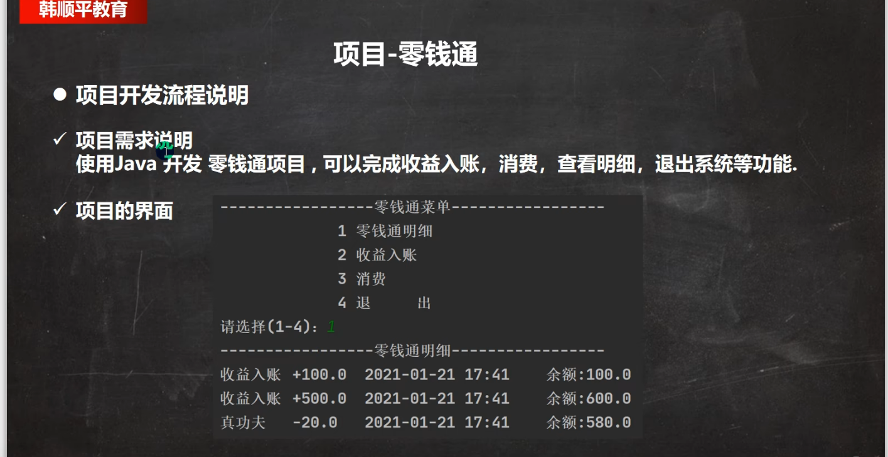

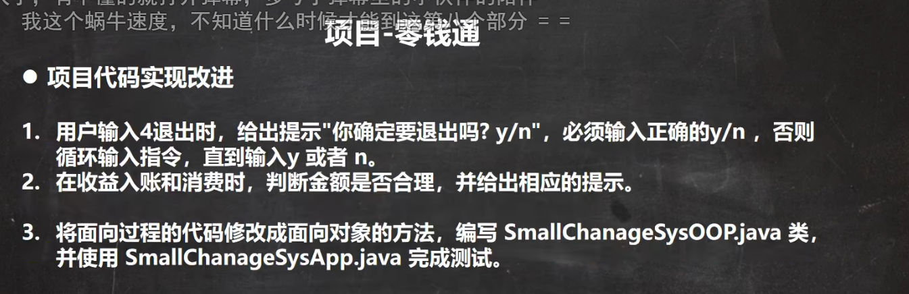

### SmallChangeSysOOP.java

```java
package com.SmallChange.OOP;

import java.text.SimpleDateFormat;
import java.util.Date;
import java.util.Scanner;

public class SmallChangeSysOOP {
    //属性
    Scanner scanner = new Scanner(System.in);
    boolean loop=true;
    Date date=null;
    SimpleDateFormat sdf=new SimpleDateFormat("yyyy-MM-dd HH:mm");
    String details="";
    double money=0;
    double balance=0;
    String cost="";

    //先完成显示菜单
    public void mainMenu(){
        System.out.println("显示零钱通菜单...");
        System.out.println("1.零钱通收支明细");
        System.out.println("2.打开收益入账功能");
        System.out.println("3.打开消费功能");
        System.out.println("4.退出界面");
        do{
            String key="";
            key=scanner.next();
            switch (key){
                case "1":
                    this.Detail();
                    break;
                case "2":
                   this.Income();
                    break;
                case "3":
                   this.Pay();
                    break;
                case "4":
                    this.Exit();
                    break;
                default:
                    System.out.println("输入有误 请重新输入");

            }
        }while(loop);
    }

    //完成零钱通明细
    public void Detail(){
        System.out.println("------------零钱通明细界面------------");
        if(details.equals("")){
            System.out.println("今日尚未支出");
        }else{
            System.out.println(details);
        }
        System.out.print("请选择(1-4):");
    }

    //完成收益入账
    public void Income(){
        System.out.println("打开收益入账功能");
        System.out.print("收益入账金额:");
        money=scanner.nextDouble();
        if(money<0){
            System.out.println("收益金额应>0");
            return ;
        }
        balance+=money;
        //记录每一笔入账date
        date= new Date();
        details+="\n收益入账\t"+"+"+money+"\t"+ sdf.format(date)+"\t"+"余额"+balance;
        System.out.print("请选择(1-4):");
    }

    //完成消费支出
    public void Pay(){
        System.out.println("打开消费功能");
        System.out.print("消费项目:");
        cost=scanner.next();
        System.out.print("消费金额:");
        //增加消费金额判断
        money= scanner.nextDouble();
        if(money<0||money>balance){
            System.out.println("余额不足 支付失败");
            return ;
        }
        balance-=money;
        date=new Date();
        details+="\n"+cost+"\t\t"+"-"+money+"\t"+ sdf.format(date)+"\t"+"余额"+balance;
        System.out.println("请选择(1-4):");
    }

    //退出界面
    public void Exit(){
        System.out.print("请确定是否退出零钱通菜单界面?y/n:");
        boolean exit=true;
        while(exit){
            String confirm=scanner.next();
            if(confirm.equals("y")){
                exit=false;
            }else if(confirm.equals("n")){
                exit=true;
            }else {
                System.out.print("请确定是否退出零钱通菜单界面?y/n:");}
        }
    }
}
```

### APP.java

```java
package com.SmallChange.OOP;

public class APP {
    public static void main(String[] args) {
        SmallChangeSysOOP admin1 = new SmallChangeSysOOP();
        admin1.mainMenu();
    }
}
```

## 写出四种访问修饰符和各自的访问权限

可参考F:\javacode\n1\src\modifier

| 访问级别 | 访问控制修饰符 | 同类     | 同包     | 子类     | 不同包   |
| -------- | -------------- | -------- | -------- | -------- | -------- |
| 公开     | public         | &#10003; | &#10003; | &#10003; | &#10003; |
| 受保护的 | protected      | &#10003; | &#10003; | &#10003; | &#10005; |
| 默认     | 没有修饰符     | &#10003; | &#10003; | &#10005; | &#10005; |
| 私有的   | private        | &#10003; | &#10005; | &#10005; | &#10005; |

## this()和super()的区分

1. **访问权限规则**：
   - `private`：只能在定义该成员的类内部访问
   - 包权限（默认）：可以在同一个包中的类访问
   - `public`：可以被任何类访问
2. **this 关键字**：
   - ==指向当前对象实例==
   - ==可以访问本类的所有成员（包括私有成员）==
   - ==可以访问从父类继承的非私有成员==
3. **super 关键字**：
   - ==指向直接父类==
   - ==只能访问父类中的非私有成员==
   - ==不能跨代访问（如 Son 的 super 不能直接访问 Grand 的成员，得先访问Father，只能通过继承链）==
4. **方法重写**：
   - 子类可以重写父类的方法
   - 使用 `this.方法名()`调用的是重写后的方法
   - 使用 `super.方法名()`调用的是父类的方法

### 经典案例

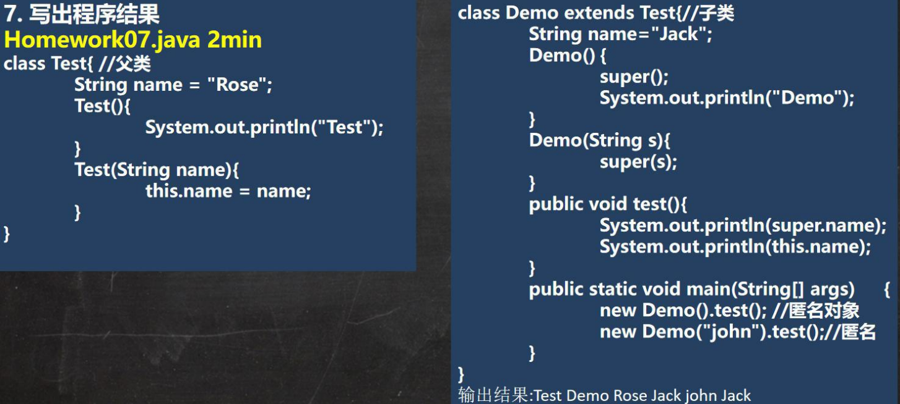

#### key：逐步解释为什么输出这个结果：

1. **执行 `new Demo().test;`**：
   - 创建 `Demo`对象时，调用无参构造函数 `Demo()`。
   - 在 `Demo()`中，==`super()`首先调用父类 `Test`的无参构造函数==，父类构造函数输出 `"Test"`。（==就算不写super（）也会先调用父类==）
   - 然后，子类构造函数继续执行，输出 `"Demo"`。
   - 接着调用 `test()`方法：
     - `System.out.println(super.name)`：访问父类的 `name`（值为 `"Rose"`），输出 `"Rose"`。
     - `System.out.println(this.name)`：访问子类的 `name`（值为 `"Jack"`），输出 `"Jack"`。
   - 所以这一部分输出：`Test`, `Demo`, `Rose`, `Jack`。
2. **执行 `new Demo("john").test;`**：
   - 创建另一个 `Demo`对象时，调用有参构造函数 `Demo("john")`。
   - 在 `Demo(String s)`中，`super(s)`调用父类 `Test`的有参构造函数 `Test(String name)`，将父类的 `name`设置为 `"john"`。注意：父类的有参构造函数没有输出语句，所以不会输出任何内容。
   - 子类的有参构造函数也没有输出语句，所以不会输出类似 `"Demo"`的文字。
   - 接着调用 `test()`方法：
     - `System.out.println(super.name)`：访问父类的 `name`（现在已被设置为 `"john"`），输出 `"john"`。
     - `System.out.println(this.name)`：访问子类的 `name`（仍然为 `"Jack"`），输出 `"Jack"`。
   - 所以这一部分输出：`john`, `Jack`。


## 在静态的 main 方法中尝试调用非静态的 bubblesort 方法

```java
public class homework01 {
    public static void main(String[] args) {
        Person persons[]=new Person[3];
        persons[0] = new Person("张三", 18, "工人");
        persons[1] = new Person("李四", 20, "教师");
        persons[2] = new Person("王五", 40, "码农");}
    public void bubblesort(Person arr[]){}//false 在静态的 main 方法中尝试调用非静态的 bubblesort 方法
}
```

- ==**静态方法**属于类，可以直接通过类名调用==
- 在静态方法中不能直接调用非静态方法

```java
public static void bubblesort(Person arr[]) {
    // 排序逻辑保持不变
}
```

==**非静态方法**属于对象，必须通过对象实例调用==

```java
public static void main(String[] args) {
        // ... 创建Person数组的代码
        
        // 创建homework01类的实例
        homework01 sorter = new homework01();

        // 通过实例调用非静态方法
        sorter.bubblesort(persons);
}
```

## 如何创建对象数组

```java
 //创建多态数组，保存2个学生和2个教师
        Person[] people = new Person[4];
        people[0] = new Student("小明", "男", 15, "00023102");
        people[1] = new Student("小红", "女", 16, "00023103");
        people[2] = new Teacher("张飞", "男", 30, 5);
        people[3] = new Teacher("刘备", "男", 35, 10);
```

## 重写equal()来判断对象是否相等

**重写 equals 方法**：

- **目的**：`Object`类的默认 `equals()`方法比较对象引用（即内存地址），但题目要求比较对象属性值是否相同。因此，需要重写 `equals()`方法来实现内容比较。
- **步骤**：
  - 首先检查对象是否与自身相同（`this == obj`），如果是，直接返回 `true`，提高效率。
  - 检查传入对象是否为 `null`或类型是否不同（`getClass() != obj.getClass()`），如果是，返回 `false`。
  - 将传入对象转换为 `Doctor`类型，以便访问其属性。
  - 逐个比较所有属性：基本类型（如 `age`）使用 `==`比较；引用类型（如 `name`）使用 `equals()`方法比较；浮点数（如 `sal`）使用 `Double.compare()`比较，避免精度问题。
- **注意**：重写 `equals()`方法时，通常也应重写 `hashCode()`方法以保持一致性，但题目未要求，故未实现。

```java
// 重写 Object 类的 equals 方法
    @Override
    public boolean equals(Object obj) {
        // 1. 检查是否为同一对象
        if (this == obj) {
            return true;
        }
        // 2. 检查对象是否为 null 或类型是否不同
        if (obj == null || getClass() != obj.getClass()) {
            return false;
        }
        // 3. 类型转换
        Doctor other = (Doctor) obj;
        // 4. 比较所有属性是否相同
        return age == other.age &&
               Double.compare(sal, other.sal) == 0 && // 处理浮点数比较
               name.equals(other.name) &&
               job.equals(other.job) &&
               gender.equals(other.gender);
    }
}
```

## 多态-向上转型和向下转型

### 什么是多态

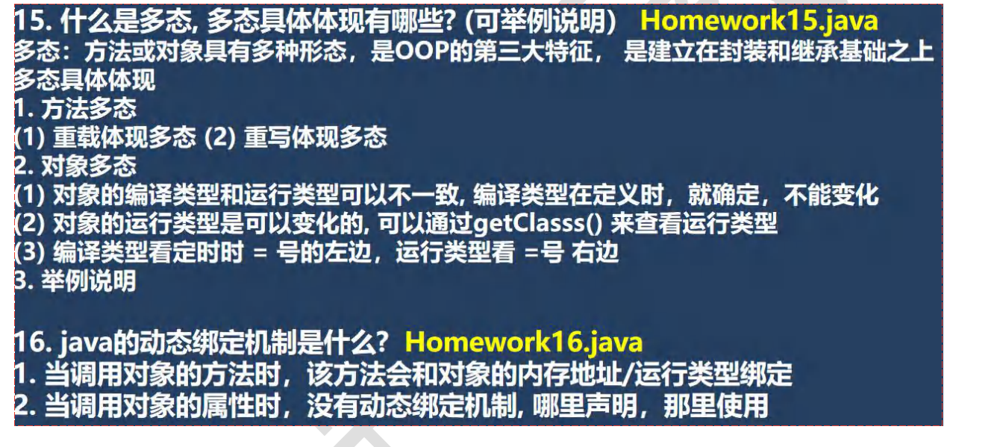


### 向上转型


==因为在编译阶段，能调用哪些成员,是由编译类型来决定的== ->向上转型后不能调用子类特有的方法

==最终运行效果看子类(运行类型)的具体实现, 即调用方法时，按照从子类(运行类型)开始查找方法==

### 向下转型

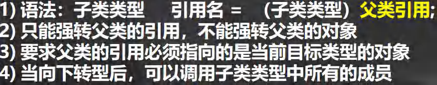

### ==属性没有重写之说！属性的值看编译类型==

### instanceof 比较操作符

用于判断对象的运行类型是否为 XX 类型或 XX 类型的子类型

## Java的构造函数调用规则

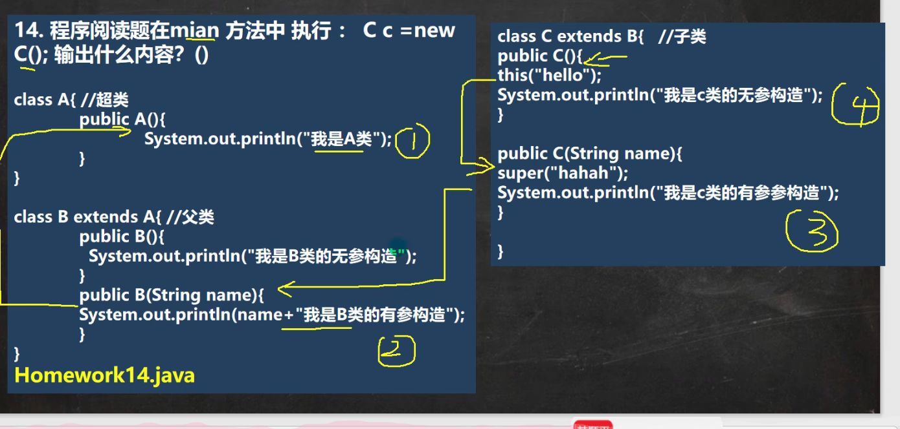

new C()-->

进入class C的无参构造器-->

this("hello")[调用同一个类（C类）的有参构造函数，所以程序立即跳转到 `C`的有参构造函数，而不是先执行无参构造的其余部分]-->

进入class C的有参构造器 -->

super("hahah")-->

进入class B的有参构造器 name =hahah-->

因为B是A的子类 程序默认先执行父类的构造器

## 多态-动态绑定机制

1. **静态绑定（早期绑定）**：在程序**编译时期**就确定了方法调用和哪个方法实现连接。`private`、`static`、`final`方法和变量都使用静态绑定。
2. **动态绑定（晚期绑定）**：在程序**运行时期**才确定方法调用和哪个方法实现连接。这是Java实现多态的关键。

```java
// 1. 父类 Animal
class Animal {
    public void makeSound() {
        System.out.println("The animal makes a sound");
    }
}

// 2. 子类 Dog，继承并重写了 makeSound 方法
class Dog extends Animal {
    @Override
    public void makeSound() { // 这是方法重写（Override）
        System.out.println("The dog barks: Woof!");
    }
    
    public void fetch() { // Dog 特有的方法
        System.out.println("The dog fetches a stick.");
    }
}

// 3. 子类 Cat，继承并重写了 makeSound 方法
class Cat extends Animal {
    @Override
    public void makeSound() {
        System.out.println("The cat meows: Meow!");
    }
}

// 4. 主程序，展示动态绑定
public class Main {
    public static void main(String[] args) {
        // 情景一：静态绑定（显而易见）
        Dog myDog = new Dog();
        myDog.makeSound(); // 输出: The dog barks: Woof!
        // 引用类型是Dog，对象也是Dog，JVM直接调用Dog的makeSound。

        // 情景二：动态绑定（多态的魔力所在！）
        Animal myAnimal; // 声明一个Animal类型的引用变量

        myAnimal = new Dog(); // 该变量指向一个Dog对象
        myAnimal.makeSound(); // 输出: The dog barks: Woof!

        myAnimal = new Cat(); // 同一个变量，现在指向一个Cat对象
        myAnimal.makeSound(); // 输出: The cat meows: Meow!
    }
}
```

```java
class Parent {
    int value = 10;
}
class Child extends Parent {
    int value = 20;
}
public class Test {
    public static void main(String[] args) {
        Parent obj = new Child(); // 向上转型
        System.out.println(obj.value); // 输出 10，而不是 20!
        // 因为字段访问是静态绑定，看的是引用	类型Parent
    }
}
```

**一句话记住动态绑定**：**“编译看左边，运行看右边”**。

- “编译看左边”：编译器检查时，看引用类型（`=`左边）是否有要调用的方法。
- “运行看右边”：JVM运行时，看实际对象（`=`右边 `new`的是啥）的方法实现。

# JAVA第9章 项目：房屋出租系统

需求

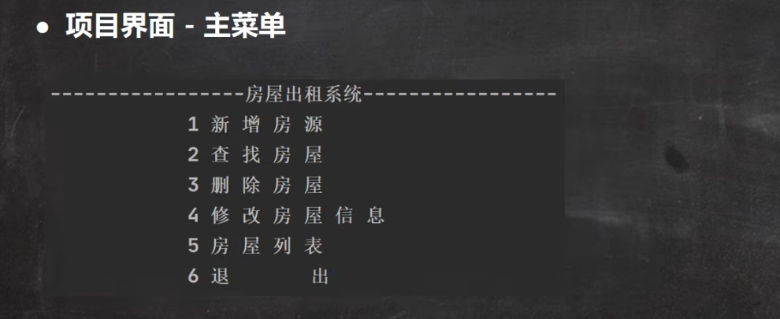

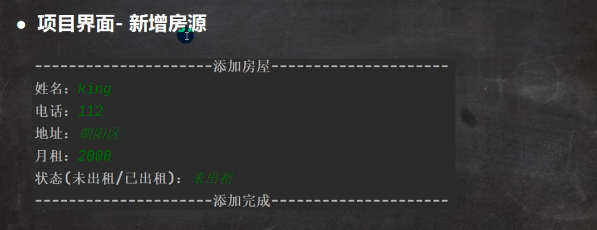

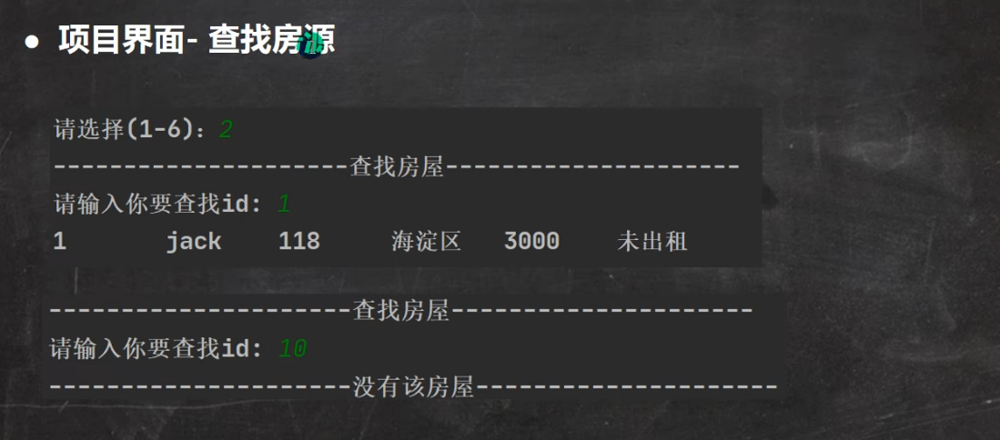

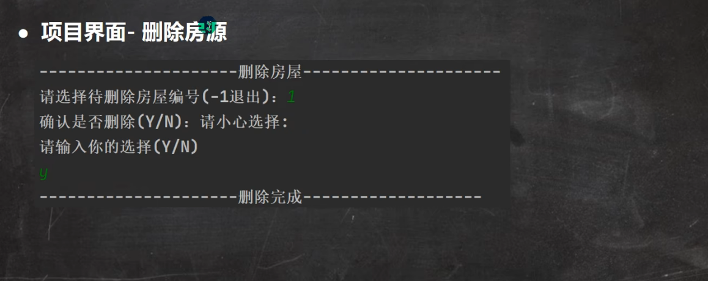

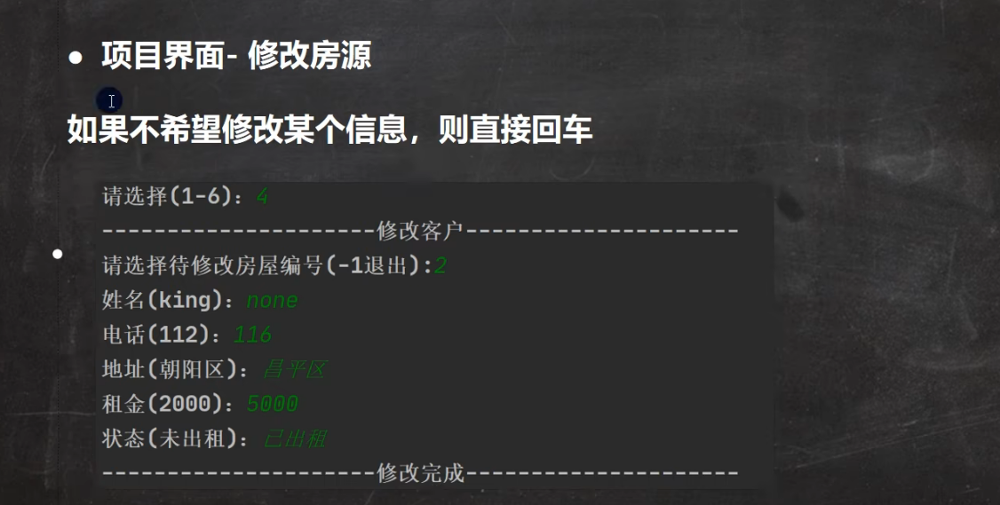

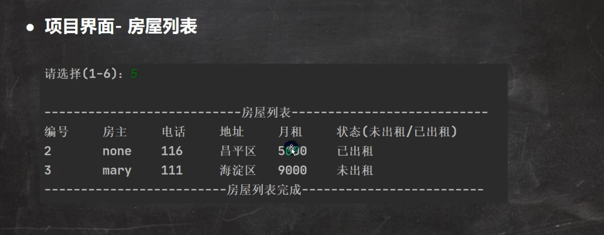

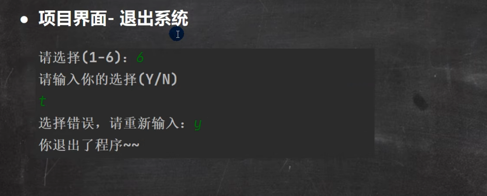

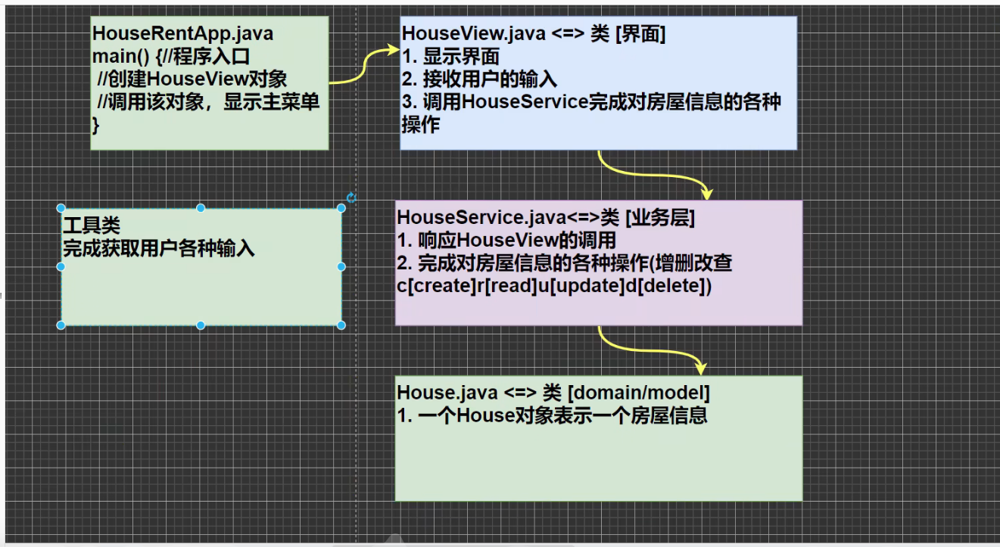

# JAVA第10章随记

## 类变量(static变量)

```java
//定义一个变量 count ，是一个类变量(静态变量) static 静态 

//该变量最大的特点就是会被 Child 类的所有的对象实例共享 

public static int count = 0;
```

不管static变量在内存的哪里 共识(1)static变量是同一个类所有对象共享的(2)static类变量，在类加载的时候就生成了

### 类变量使用注意事项和细节讨论

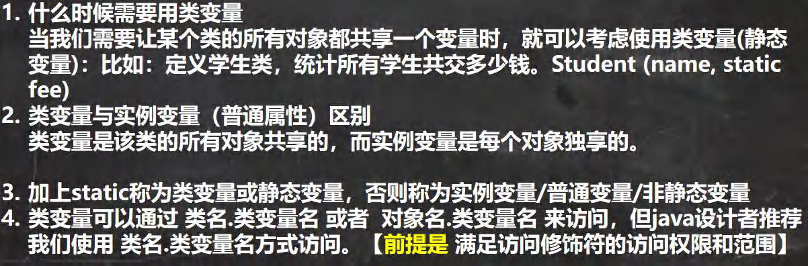

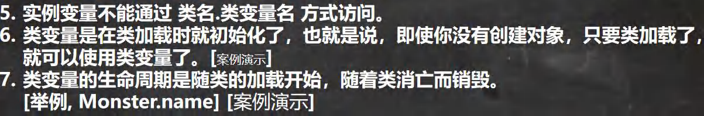

## 类方法(static方法)


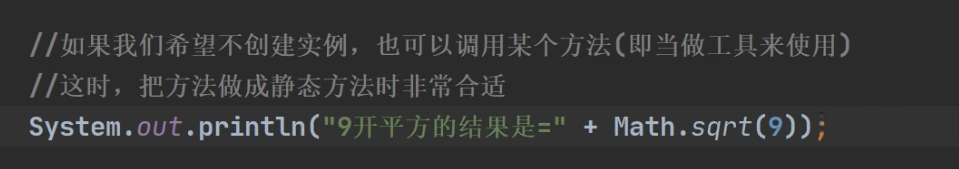

### 类方法使用注意事项和细节讨论

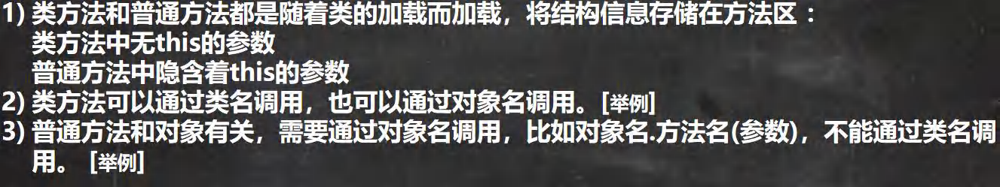


------


## main方法


1) 在 main()方法中，我们可以直接调用 main 方法所在类的静态方法或静态属性。
2)  但是，不能直接访问该类中的非静态成员，必须创建该类的一个实例对象后，才能通过这个对象去访问类中的非静态成员

------


## 代码块

### 定义：

​	代码化块又称为初始化块,属于类中的成员[即是类的一部分]，类似于方法，将逻辑语句封装在方法体中，通过{}包围起来。
但和方法不同，没有方法名，没有返回，没有参数，只有方法体，而且不用通过对象或类显式调用，而是加载类时，或创建对象时隐式调用。

### 语法：


### 好处：

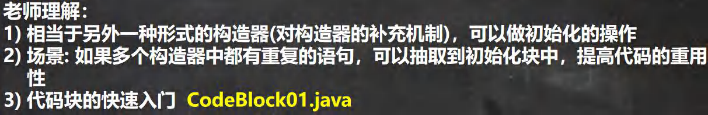

### 代码块使用注意事项和细节讨论：


### 类什么时候被加载⭐⭐⭐

1.创建对象实例时(new)

2.创建子类对象实例，父类也会被加载

3.使用类的静态成员时(静态属性和静态方法)


### ==父类静态，子类静态，父类普通，父类构造器，子类普通，子类构造器==

------

 

## 单例设计模式

#### 含义：某个类只能存在一个对象实例


#### 饿汉式(得先初始化new出对象准备好，==不管需不需要==)-->可能造成资源浪费

1.将构造器私有化

2.在类的内部直接创造对象(该对象是static) private static GirlFriend gf===new GirlFirend("abc")==;

3.提供一个公共的static方法，返回对象

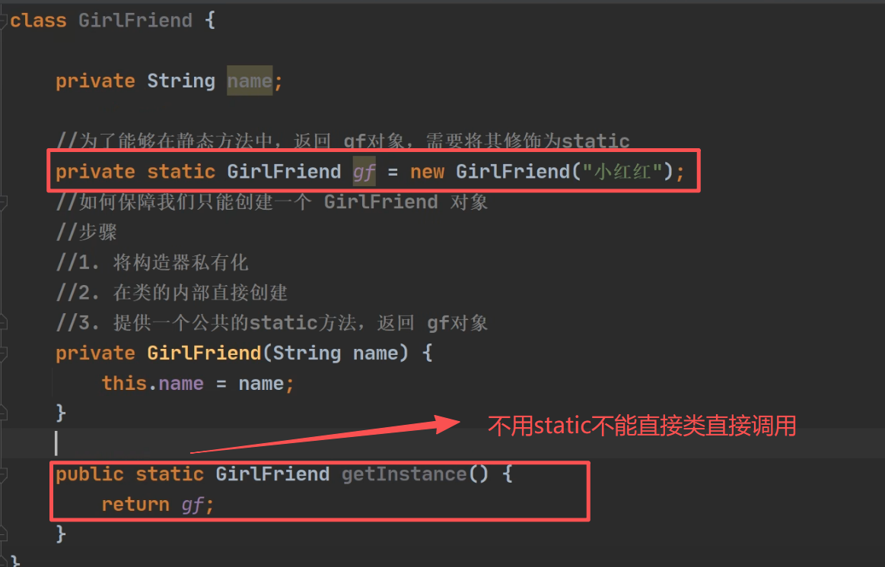

如果不用static不能直接调用GirlFriend里面的getInstance()方法

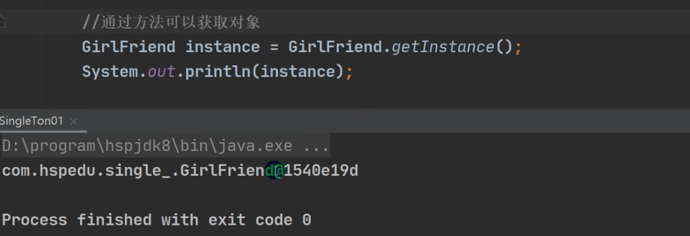

#### 懒汉式（不用它，它就不去创建）

1.将构造器私有化

2.定义一个static静态属性对象   private static Cat cat;

3.提供一个公共的static方法，返回对象  if(cat==null){cat=new Cat("小猫")//这时候再创建}

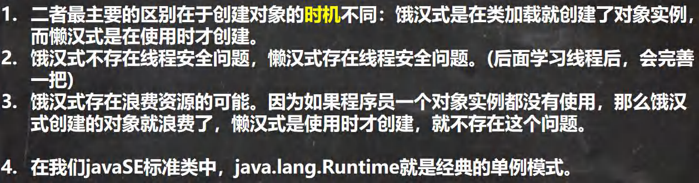

## final关键字

#### 用途

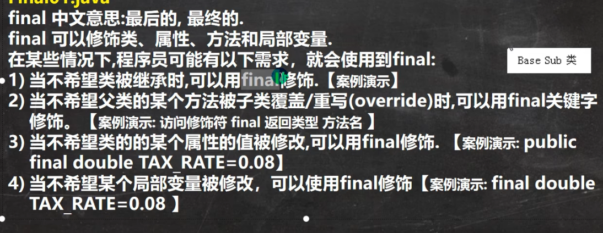

#### final的注意事项和细节


2)final修饰的是非静态属性情况下的赋值（3种位置）

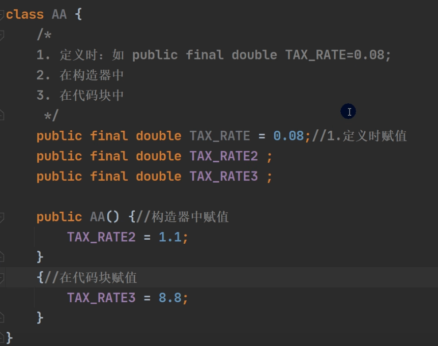

3)final修饰的是静态属性情况下的赋值（2种位置)-1.定义时 2.在静态代码块赋值 ==因为静态属性时，代码块优先级高于构造器==


7）

```java
public class FinalDetail {
    public static void main(String[] args) {
        System.out.println(A.num);
    }
}
class A{  //final和static搭配使用效率更高,不会导致类加载,如果没有final,A类也会被加载,输出A代码块被执行
    public  final static int num=100;
    static{
        System.out.println("A代码块被执行");
    }
}


```

## 抽象类

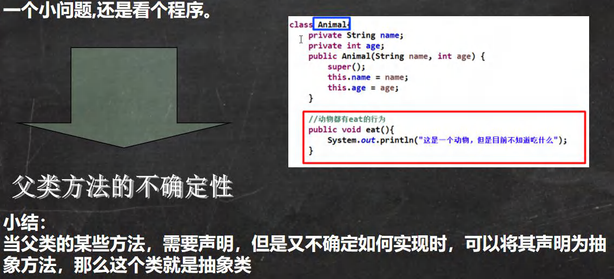

所谓抽象方法就是指没有实现的方法=》没有实现指的是没有方法体 ==public abstract void say();==

当一个类中存在抽象方法的时候，需要将该类声明为抽象类

一般来说 抽象类会被继承 由子类完成抽象方法

### 抽象类使用的注意事项和细节讨论


###  **为什么 `static`和 `abstract`不能一起用？**

现在，关键来了！`static`和 `abstract`不能同时修饰同一个方法，因为它们的设计理念冲突：

- **`static`的要求**：static 方法是类级别的，不能被重写（只能隐藏）。它独立于对象，调用时不需要实例。
- **`abstract`的要求**：abstract 方法必须被子类重写，因为它没有实现，子类必须提供具体代码。
- **冲突点**：
  - 如果允许一个方法同时是 `static`和 `abstract`，会发生什么？
    - Java 编译器会说：“等等，static 方法不能被重写，但 abstract 方法必须被重写——这矛盾了！”
  - 简单比喻：
    - `static`方法像是一个公共的饮水机（所有人共用，不能改）。
    - `abstract`方法像是一个空杯子（必须由你倒水进去）。
    - 你不能既要求饮水机是公共的（不能改），又要求它是空的（必须被倒水）——这逻辑不通。

```java
abstract class MyClass {
    static abstract void myMethod(); // 错误：illegal combination of modifiers: abstract and static
}
```

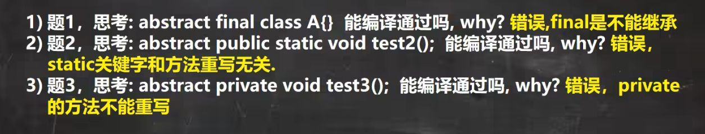

## 接口


### 基本介绍


### 接口注意事项和细节


接口和接口谈继承extends（转接头），但是类和接口谈实现implements

### 接口的多态体现

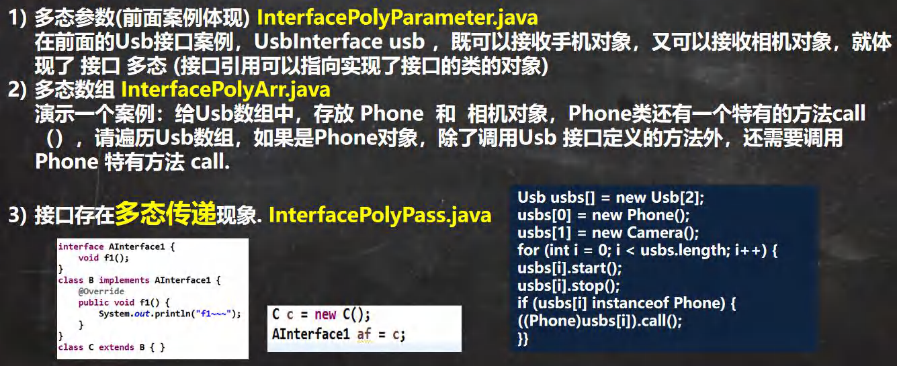

#### 1）多态参数 和继承多态差不多

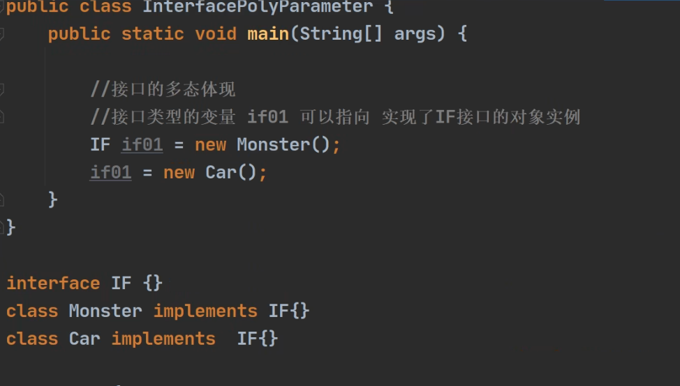

#### 2）多态数组

​	

#### 3)多态传递

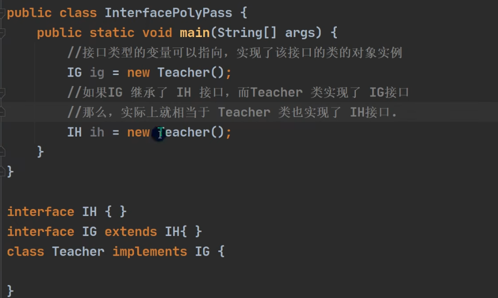

接口练习

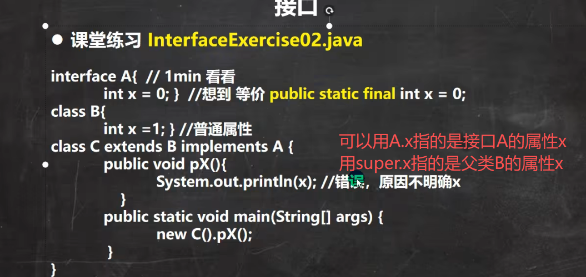

------

## 内部类

### 基本含义：


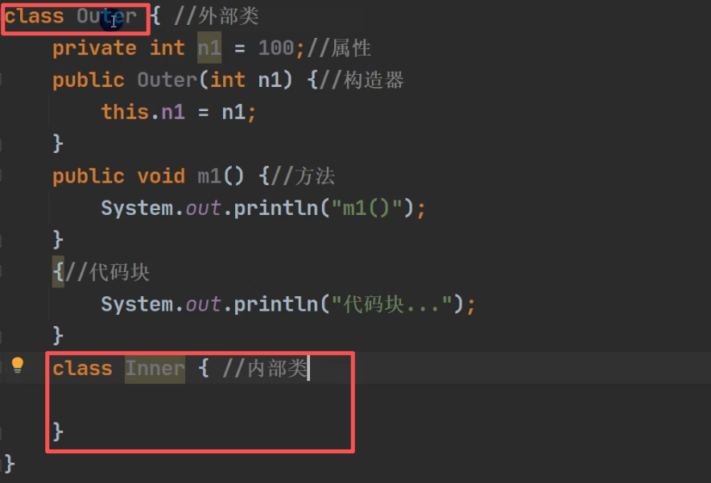

## 内部类的分类

#### 定义在外部类局部位置上（比如方法内）

##### 1）局部内部类（有类名）  ==定义在方法中==

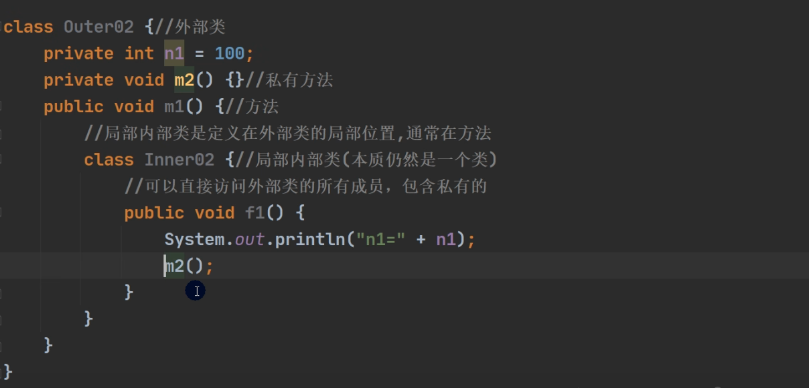


##### 2）匿名内部类（没有类名，重点⭐⭐⭐⭐⭐）【难】

###### ==匿名内部类本质上是一个类，继承了父类，同时还具有创建对象的方法特征，可以不用创建对象直接调用==

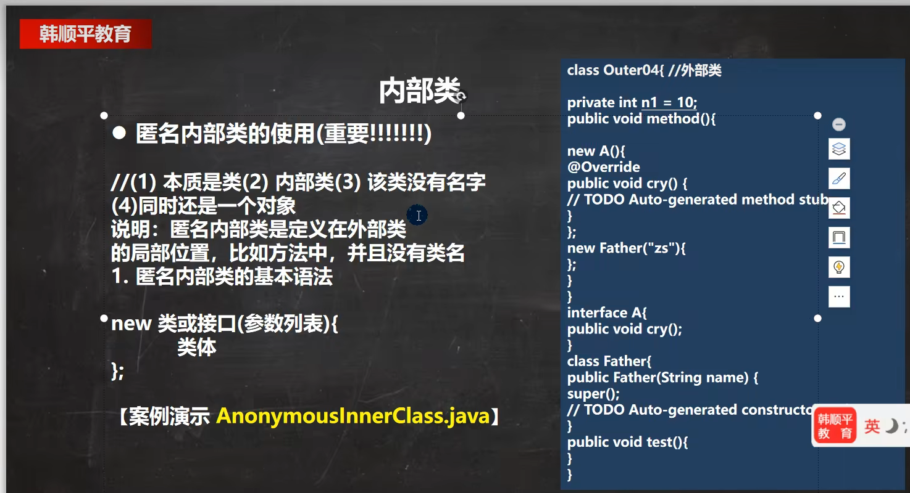

###### 匿名内部类的使用细节


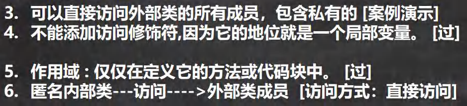


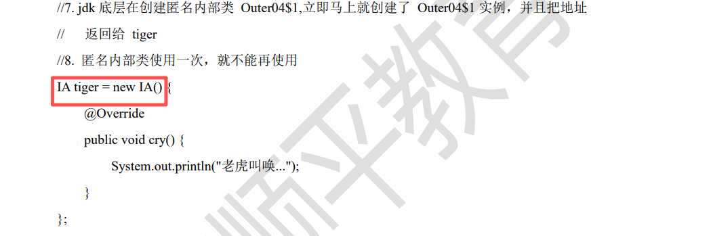

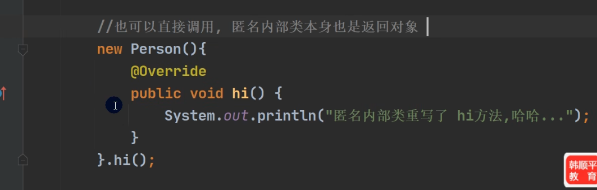

当作实参直接传递


###### 练习

- **接口定义**：创建一个 `Bell`接口，其中包含一个 `ring`方法。
- **手机类定义**：创建一个 `Cellphone`类，具有 `alarmclock`方法，参数为 `Bell`类型。
- **测试部分**：使用匿名内部类对象作为参数，测试闹钟功能，分别打印“懒猪起床了”和“小伙伴上课了”。

```java
// 1. 定义铃声接口 Bell
interface Bell {
    void ring(); // 接口中的抽象方法，表示铃声响起的行为
}

// 2. 定义手机类 Cellphone
class Cellphone {
    // alarmclock 方法：闹钟功能，参数是 Bell 类型
    public void alarmclock(Bell bell) {
        bell.ring(); // 调用传入的 Bell 对象的 ring 方法
    }
}

// 主类，包含测试代码
public class InnerClassExercise02 {
    public static void main(String[] args) {
        Cellphone phone = new Cellphone(); // 创建手机对象

        // 3. 测试1：通过匿名内部类对象作为参数，打印 "懒猪起床了"
        phone.alarmclock(new Bell() {
            @Override
            public void ring() {
                System.out.println("懒猪起床了");
            }
        });
    
        // 4. 测试2：传入另一个匿名内部类对象，打印 "小伙伴上课了"
        phone.alarmclock(new Bell() {
            @Override
            public void ring() {
                System.out.println("小伙伴上课了");
            }
        });
    }

}
```


#### 定义在外部类的成员位置上

##### 1）成员内部类（没用static修饰）

​	**定义位置：** 它直接定义在另一个类（称为**外部类**）的**内部**，并且与外部类的成员变量、成员方法**处于同一级别**（不是定义在方法内部）。

​	**访问权限：** 成员内部类就像是外部类的一个**特殊成员**。因此，它拥有**无限制的访问权限**：

- 可以**直接访问**外部类的**所有成员**（包括 `private`私有成员！）。
- 外部类也可以通过创建内部类对象来访问内部类的成员（但通常内部类成员会被设计为 `private`，仅供外部类使用）。

​	**依赖关系：** 成员内部类的存在**强烈依赖于外部类**。要创建一个成员内部类的对象，**必须先存在一个外部类的对象**。

```java
class OuterClass { // 外部类
    // 外部类的成员变量、方法...

    [访问修饰符] class InnerClass { // 成员内部类
        // 内部类的成员变量、方法...
        //可以是 public, protected, (默认/包私有), private。这决定了其他类能否访问这个内部类以及如何访问。
        // 可以直接访问 OuterClass.this 来引用外部类实例
    }

}
```

```java
// 1. 首先创建外部类对象
OuterClass outerObj = new OuterClass();

// 2. 通过外部类对象来创建内部类对象
OuterClass.InnerClass innerObj = outerObj.new InnerClass();
```


##### 2）静态内部类（使用static修饰）

###### 静态内部类示例

```java
// 外部类
public class OuterClass {
    private static String outerStaticField = "外部类的静态变量";
    private String outerInstanceField = "外部类的实例变量";

    // 静态内部类
    public static class StaticInnerClass {
        private String innerField = "静态内部类的实例变量";
        // 静态内部类可以有自己的静态成员
        private static String innerStaticField = "静态内部类的静态变量";

        public void innerMethod() {
            // 1. 可以直接访问外部类的静态成员
            System.out.println("访问: " + outerStaticField);

            // 2. 不能直接访问外部类的非静态成员（实例变量/方法）
            // 下面这行代码会编译错误
            // System.out.println(outerInstanceField);

            // 3. 如需访问外部类非静态成员，必须先创建外部类对象
            OuterClass outerObj = new OuterClass();
            System.out.println("通过外部对象访问: " + outerObj.outerInstanceField);

            System.out.println("内部类自己的字段: " + innerField);
            System.out.println("内部类自己的静态字段: " + innerStaticField);
        }

        // 静态内部类可以有自己的静态方法
        public static void innerStaticMethod() {
            System.out.println("静态内部类的静态方法访问: " + outerStaticField);
        }
    }
}
```

###### **创建与使用静态内部类**

```java
public class Test {
    public static void main(String[] args) {
        // 创建静态内部类对象：外部类名.内部类名
        OuterClass.StaticInnerClass innerObj = new OuterClass.StaticInnerClass();
        innerObj.innerMethod(); // 调用实例方法

        // 直接调用静态内部类的静态方法
        OuterClass.StaticInnerClass.innerStaticMethod();
    }
```

------

# JAVA第11章随记

## 枚举类：

### 含义：想象枚举就像一家咖啡店的菜单，只有“美式”和“拿铁”两种选项，您不能点“奶茶”（因为菜单上没有）

### 自定义类实现枚举


### 自定义类特点

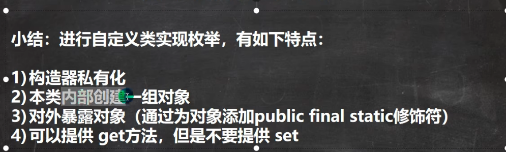

### enum关键字实现枚举

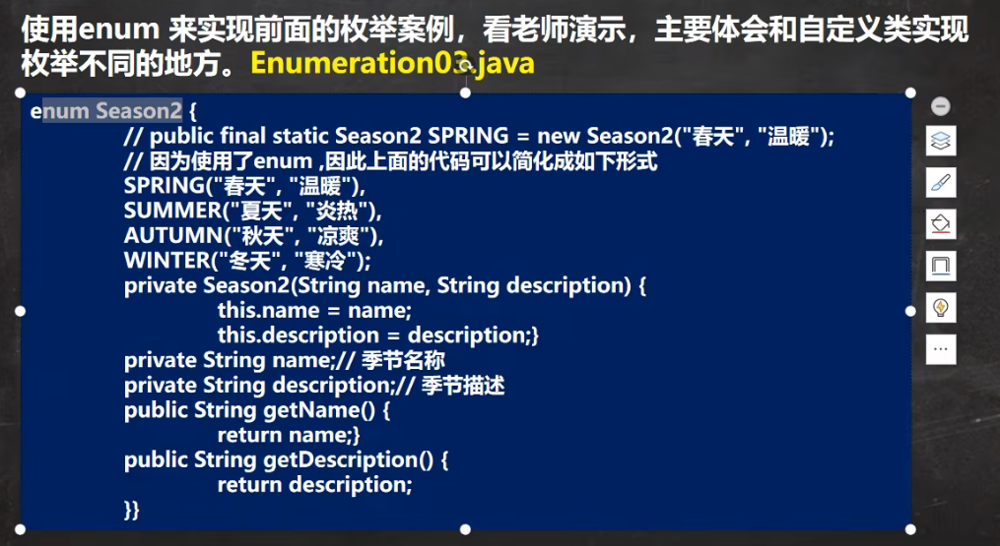

### enum 关键字实现枚举注意事项

1) 当我们使用 enum 关键字开发一个枚举类时，默认会继承 Enum 类, 而且是一个 final 类[如何证明],老师使用 javap 工 具来演示 
2) 传统的 public static final Season2 SPRING = new Season2("春天", "温暖"); 简化成 SPRING("春天", "温暖")， 这里必须知道，它调用的是哪个构造器.
3) 如果使用无参构造器 创建 枚举对象，则实参列表和小括号都可以省略
4) 当有多个枚举对象时，使用==,==间隔，最后有一个分号结尾 
5) 枚举对象必须放在枚举类的行首

### 练习

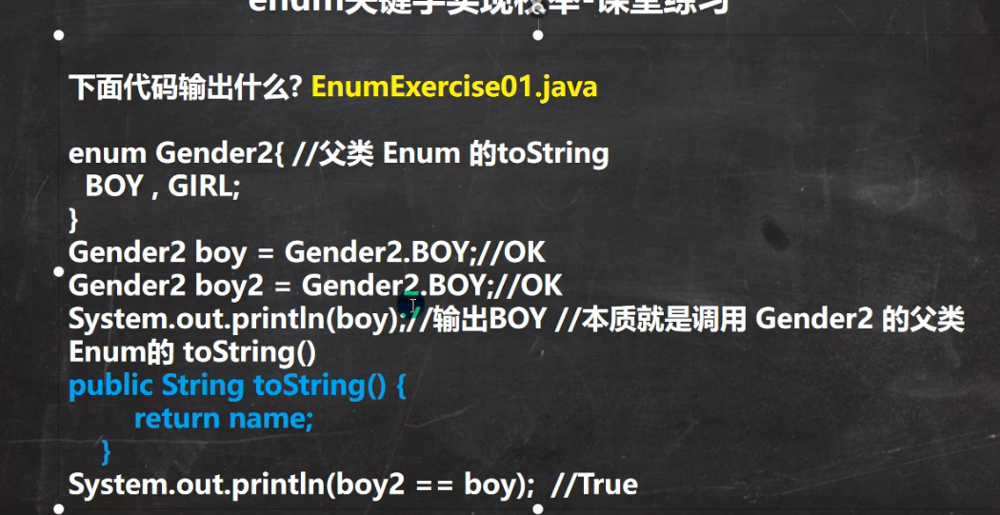

在Java中，枚举值是“单例”的。意思是，`Gender2.BOY`在内存中只有一个实例（就像菜单上的“美式”只有一份配方，无论谁点，都指向同一杯咖啡）。所以`boy`和`boy2`实际上都指向同一个`BOY`对象。

让我用更直观的方式解释为什么输出的是`GIRL`而不是`girl`

核心原因：变量名 ≠ 枚举值的名称

```java
Gender2 girl = Gender2.GIRL;
// 理解为：我给"可口可乐"这个饮料贴了个标签叫"我的饮料"
// 但饮料本身还是叫"可口可乐"
```

### enum的常用方法

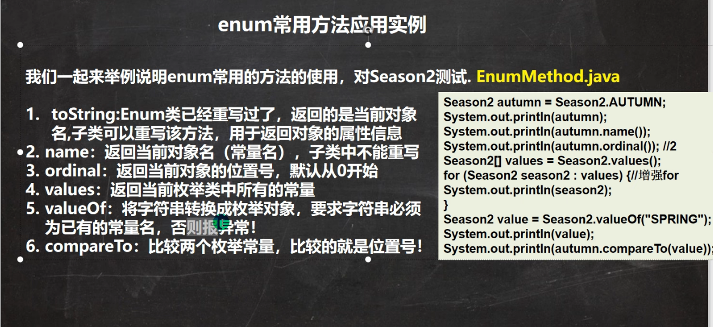

### 例题

#### 任务1：声明Week枚举类

- 创建一个名为`Week`的枚举
- 包含星期一到星期日的定义：`MONDAY, TUESDAY, WEDNESDAY, THURSDAY, FRIDAY, SATURDAY, SUNDAY`

#### 任务2：遍历输出所有星期

- 使用枚举的`values()`方法获取所有枚举值的数组
- 遍历这个数组并输出
- 输出格式要符合右侧示例（包含标题和中文星期名称）

```java
// 任务1：声明Week枚举类
enum Week {
    MONDAY("星期一"),TUESDAY("星期二"), WEDNESDAY("星期三"),THURSDAY("星期四"),FRIDAY("星期五"),
    SATURDAY("星期六"),SUNDAY("星期日");
    
    private String chineseName;
    
    // 私有构造方法
    private Week(String chineseName) {
        this.chineseName = chineseName;
    }
    
    // 获取中文名称的方法
    public String getChineseName() {
        return chineseName;
    }
}

// 主类
public class EnumExercise02 {
    public static void main(String[] args) {
        
        // 任务2：使用values返回所有的枚举数组并遍历输出
        System.out.println("===所有星期的信息如下===");
        
        // 获取所有Week枚举值
        Week[] weeks = Week.values();
        
        // 遍历输出[强]
        for (Week day : weeks) {
            System.out.println(day.getChineseName());
        }
    }
}
```

### enum实现接口

1) ==使用 enum 关键字后，就不能再继承其它类了，因为 enum 会隐式继承 Enum，而 Java 是单继承机制==。 
2)  枚举类和普通类一样，可以实现接口，如下形式。 enum 类名 implements 接口 1，接口 2{}

------

## 注解

 使用 Annotation 时要在其前面增加 @ 符号, 并把该 Annotation 当成一个修饰符使用。用于修饰它支持的程序元素三个基本的Annotation: 

1) @Override: 限定某个方法，是重写父类方法, 该注解只能用于方法 

2) @Deprecated: 用于表示某个程序元素(类, 方法等)已过时

3) @SuppressWarnings: 抑制编译器警告

   ------

   

## 元注解

1) Retention //指定注解的作用范围，三种 SOURCE,CLASS,RUNTIME 
2) Target // 指定注解可以在哪些地方使用 
3) Documented //指定该注解是否会在 javadoc 体现
4) Inherited //子类会继承父类注

**`@Retention`- 控制生命周期**

这是最关键的元注解之一，它决定了注解信息在哪个阶段有效。例如，如果你希望注解在运行时依然可用（比如通过反射机制读取），就必须设置为 `RUNTIME`

```java
import java.lang.annotation.Retention;
import java.lang.annotation.RetentionPolicy;

@Retention(RetentionPolicy.RUNTIME) // 注解在运行时保留，可通过反射读取
public @interface MyRuntimeAnnotation {
    String value() default "default value";
}
```

**`@Target`- 限定使用范围**

此元注解防止注解被误用在不适用的元素上。你可以指定多个目标类型

```java
import java.lang.annotation.ElementType;
import java.lang.annotation.Target;

@Target({ElementType.TYPE, ElementType.METHOD}) // 该注解只能用于类和方法上
public @interface MyMethodAnnotation {
}
```

------

# JAVA第12章随记-异常

## 异常

### 基本概念


### 异常体系图


### 常见的运行时异常

#### 1. NullPointerException（空指针异常）

- **解释**：当程序试图访问一个“空”对象（即没有实际值的对象）的方法或属性时，就会抛出这个异常。简单说，就像你想用一个不存在的遥控器操作电视。

- **小例子**：

  ```java
  String s = null;  // 声明一个字符串变量s，但设置为null（空值）
  s.length();       // 尝试调用s的length()方法，但s是null，所以会抛出NullPointerException
  ```

#### 2. ArithmeticException（数学运算异常）

- **解释**：当进行整数除法时，如果除数是0，就会抛出这个异常。这类似于数学中“除以0”的错误，Java不允许这样做。

- **小例子**：

  ```java
  int a = 5 / 0;  // 尝试计算5除以0，但除以0是无效的，所以抛出ArithmeticException
  ```

#### 3. ArrayIndexOutOfBoundsException（数组下标越界异常）

- **解释**：当访问数组时，如果使用的索引（下标）超出了数组的有效范围（比如数组长度是5，你却访问第10个元素），就会抛出这个异常。就像书架上只有5本书，你却想拿第10本。
- **小例子**：

```java
int[] arr = new int[5];  // 创建一个长度为5的整数数组，索引从0到4
arr[10];                 // 尝试访问索引10的元素，但数组最大索引是4，所以抛出异常
```

#### 4. ClassCastException（类型转换异常）

- **解释**：当试图将一个对象强制转换为不兼容的类型时，就会抛出这个异常。比如，你不能把整数对象当成字符串对象来用。
- **小例子**：

```java
Object o = new Integer(1);  // 创建一个Integer对象（整数类型），并赋值给Object变量o
String s = (String) o;       // 尝试将o强制转换为String类型，但o是Integer，不兼容，所以抛出异常
```

#### 5. NumberFormatException（数字格式不正确异常）

- **解释**：当试图将一个字符串转换为数字（如整数），但字符串的内容不是有效的数字格式时，就会抛出这个异常。比如，把"abc"当成数字转换。
- **小例子**：

```java
Integer.parseInt("abc");  // 尝试将字符串"abc"转换为整数，但"abc"不是数字，所以抛出异常
```

------

### 编译异常

#### 介绍：


#### 常见的编译异常：


### 异常处理

#### try-catch-finally

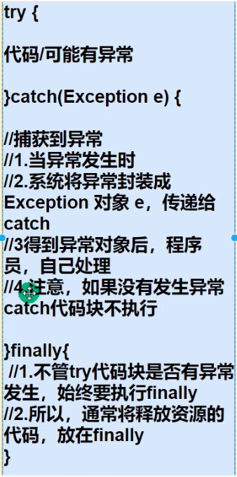

##### 注意细节


##### 练习

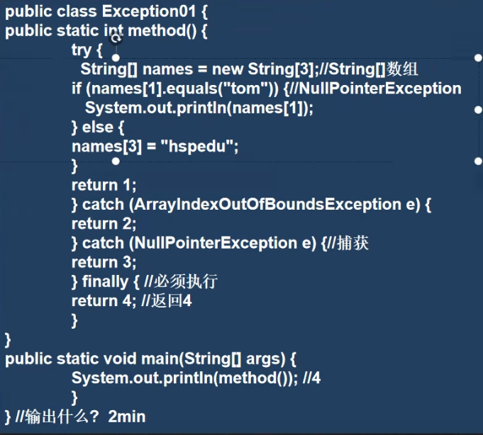

返回4

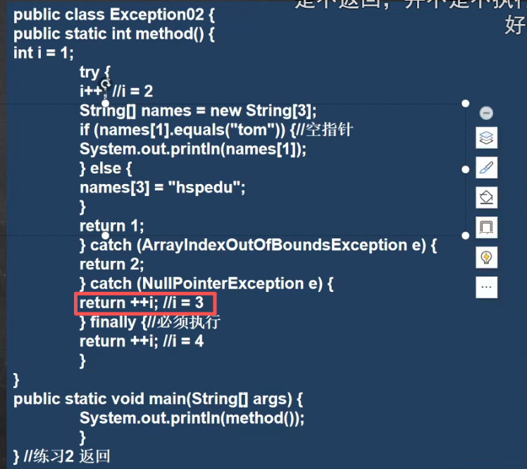

由于finally必须执行，所以catch中的return只有++i部分执行，最后return的是finally的

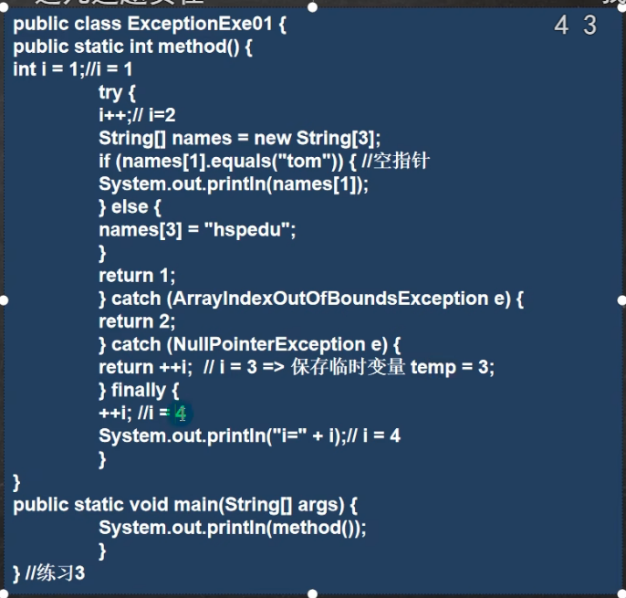

**如果用户输入的不是一个整数，就提示他反复输入，直到输入一个整数为止**。

```java
import java.util.Scanner;  // 导入Scanner类，用于读取用户输入

public class IntegerInputExample {
    public static void main(String[] args) {
        Scanner scanner = new Scanner(System.in);  // 创建Scanner对象，从键盘读取输入
        int number = 0;  // 定义一个变量来存储最终输入的整数
        boolean validInput = false;  // 标志变量，表示输入是否有效，初始为false

        // 使用while循环，直到输入有效整数才退出
        while (!validInput) {
            System.out.print("请输入一个整数: ");  // 提示用户输入
            String input = scanner.nextLine();  // 读取用户输入的一行文本，存储为字符串

            try {
                // 尝试将字符串转换为整数
                number = Integer.parseInt(input);  // 如果输入是有效整数，转换成功
                validInput = true;  // 设置标志为true，退出循环
                System.out.println("输入正确！整数是: " + number);
            } catch (NumberFormatException e) {
                // 如果转换失败（输入不是整数），捕获异常
                System.out.println("错误：输入的不是有效整数，请重新输入！");
            }
        }
        
        scanner.close();  // 关闭Scanner，释放资源
    }
}
```


#### throws

如果程序员没有显示处理异常，默认就是throws

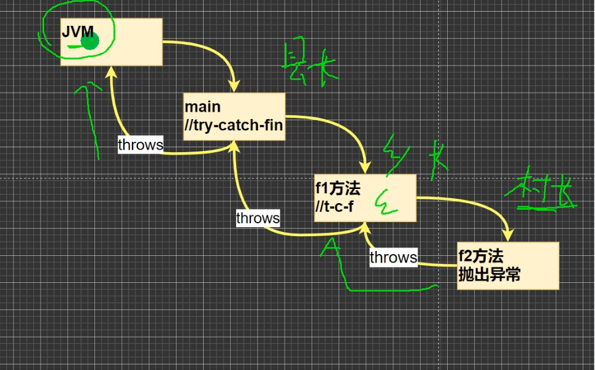

#### 自定义异常

Java允许我们定义自己的异常类，用于描述业务中特有的异常情况。

**步骤**：

1. 自定义一个类，并让它继承 `Exception`（编译时异常）或 `RuntimeException`（运行时异常）。
2. 通常提供两个构造器：一个无参构造器，一个带异常信息的构造器。

**示例**：定义一个年龄非法异常。

```java
// 1. 继承Exception，自定义一个编译时异常
class AgeException extends Exception {
    public AgeException(String message) { // 构造器
        super(message);
    }
}

public class Test {
    // 2. 在方法中使用throw手动抛出我们自定义的异常对象
    public void setAge(int age) throws AgeException {
        if(age < 0 || age > 120) {
            throw new AgeException("年龄需要在0-120之间");
        }
        // ... 正常逻辑
    }
}
```

#### throw 和 throws 的区别（面试常考）

| 特性     | **throw**                                              | **throws**                                                   |
| :------- | :----------------------------------------------------- | :----------------------------------------------------------- |
| **作用** | 用于**方法内部**，**手动生成**并抛出一个异常**对象**。 | 用于**方法声明处**，**标明**该方法可能**抛出**的异常**类型**。 |
| **数量** | 每次只能抛出一个异常对象。                             | 可以声明抛出多个异常类型（用逗号分隔）。                     |
| **本质** | 是一个**动作**，是异常产生的起点。                     | 是一种**声明**，是异常处理的可能去向。                       |

### 总结与举一反三

第12章的核心思想是：**防御式编程**。不要假设你的代码永远正确运行，要主动预见并处理可能出现的错误。

- **如何选择处理方式？**
  - **try-catch**：如果你知道如何处理这个异常（比如除零错误，就提示用户），就用它。
  - **throws**：如果你不知道在当前环境下如何处理（比如一个底层读取文件的方法），就抛出，让调用者决定。
- **给初学者的建议**：
  1. 对于编译时异常，编译器强制你处理，这是帮你排查错误的好机会。
  2. 对于运行时异常，虽然编译器不强制，但也要主动用 `try-catch`去处理可能发生的地方，这是写出高质量代码的关键。
  3. 使用 `try-catch`时，尽量在 `catch`块中做有意义的处理（如日志记录、用户提示），而不是简单地 `printStackTrace()`或空着。
  4. `finally`块非常重要，确保重要资源（如IO流、数据库连接）被释放。

------

# JAVA第13章随记 常用类

## 包装类

### 含义：

Java是面向对象的语言，但八大基本数据类型（`byte`, `short`, `int`, `long`, `float`, `double`, `char`, `boolean`）不是对象。为了让他们能参与到对象的操作中（比如加入到集合`Collection`），Java为每一个基本数据类型都设计了一个对应的“包装类”。

| 基本数据类型 | 包装类        |
| :----------- | :------------ |
| `byte`       | `Byte`        |
| `short`      | `Short`       |
| `int`        | **`Integer`** |
| `long`       | `Long`        |
| `float`      | `Float`       |
| `double`     | `Double`      |
| `char`       | `Character`   |
| `boolean`    | `Boolean`     |

### 装箱和拆箱 (Boxing and Unboxing)

- **装箱**：将基本数据类型 -> 包装类。
  - 手动装箱：`Integer integer = new Integer(100);`(JDK9后已过时)
  - 自动装箱：`Integer integer = 100;`// 编译器自动帮我们改成 `Integer.valueOf(100)`
- **拆箱**：将包装类 -> 基本数据类型。
  - 手动拆箱：`int i = integer.intValue();`
  - 自动拆箱：`int i = integer;`// 编译器自动帮我们改成 `integer.intValue()`

**自动装箱和拆箱是JDK5的新特性，目的是方便开发。**

### 包装类型与 String 类型的相互转换

```java
// Integer -> String
Integer i = 100;
String str1 = i + ""; // 方式1：拼接空字符串
String str2 = i.toString(); // 方式2：toString()
String str3 = String.valueOf(i); // 方式3：String.valueOf()

// String -> Integer
String s = "123";
Integer i1 = new Integer(s); // 方式1：构造器 (过时)
Integer i2 = Integer.valueOf(s); // 方式2：Integer.valueOf()
Integer i3 = Integer.parseInt(s); // 方式3：Integer.parseInt() -> 得到的是int，可自动装箱
```

### 包装类的常用方法

```java
public class WrapperMethod {
public static void main(String[] args) {
    System.out.println(Integer.MIN_VALUE); //返回最小值
    System.out.println(Integer.MAX_VALUE);//返回最大值
    System.out.println(Character.isDigit('a'));//判断是不是数字
    System.out.println(Character.isLetter('a'));//判断是不是字母
    System.out.println(Character.isUpperCase('a'));//判断是不是大写		
    System.out.println(Character.isLowerCase('a'));//判断是不是小写
    System.out.println(Character.isWhitespace('a'));//判断是不是空格
    System.out.println(Character.toUpperCase('a'));//转成大写
    System.out.println(Character.toLowerCase('A'));//转成小写
	}
}
```

### 重要面试题

```java
Integer i1 = new Integer(127);
Integer i2 = new Integer(127);
System.out.println(i1 == i2); // false, 因为new的是不同对象

//valueOf()只要在-128-127之内直接返回值，不需要new一个对象
Integer i3 = 127; // 底层是 Integer.valueOf(127)
Integer i4 = 127;
System.out.println(i3 == i4); // true

//需要new一个对象了
Integer i5 = 128;
Integer i6 = 128;
System.out.println(i5 == i6); // false

//只要有基本数据类型 判断的是值是否相等
Integer i7=127;
int i8=127;
System.out.println(i7 == i8); // True
```

------

## String类

 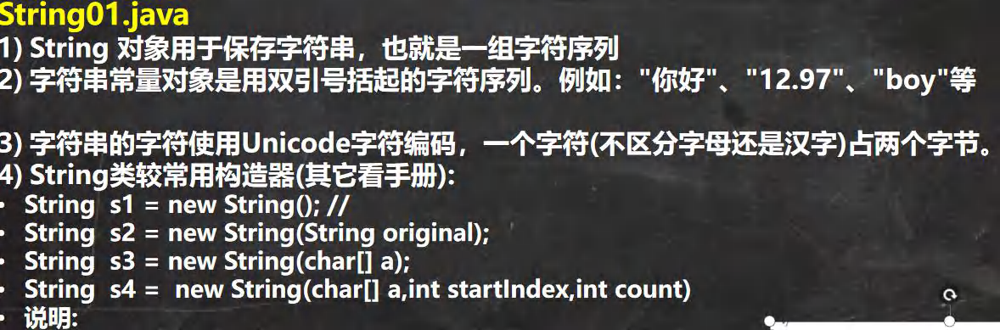


### 最大特点：不可变性（Immutable）

String 对象一旦被创建，其内容（字符序列）就**不可更改**。所有看似修改String的方法（如 `concat`, `replace`, `substring`），实际上都是创建并返回了一个**全新的String对象**，原来的对象丝毫无损。


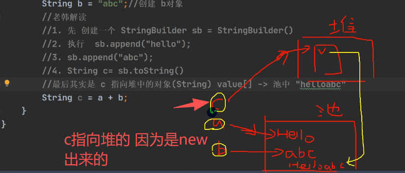


### 不可变性关键例题分析

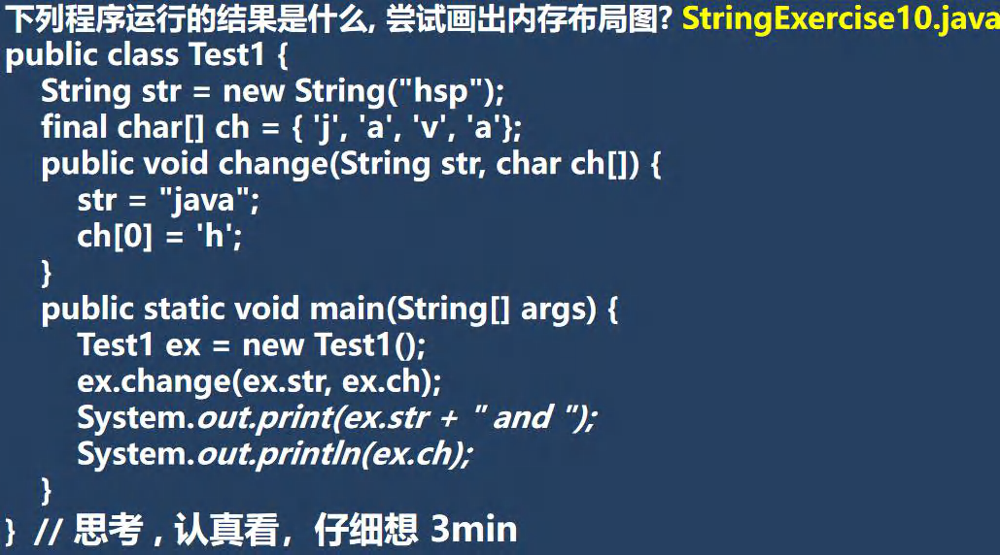

综合考察了：**1. Java 的参数传递机制（值传递）**；**2. 引用类型（对象）在值传递下的表现**；**3. String 的不可变性**；**4. final 关键字对数组的含义**。

好的，这是一道非常经典的 Java 面试题，它综合考察了：**1. Java 的参数传递机制（值传递）**；**2. 引用类型（对象）在值传递下的表现**；**3. String 的不可变性**；**4. final 关键字对数组的含义**。

我们来一步一步地详细解释，并画出内存布局图。

#### 核心结论

程序的运行结果是：**hsp and hava**

下面我们来彻底分析为什么会是这个结果。

------

#### 第一步：理解 Java 的参数传递机制 - “值传递”

Java 中只有**值传递**。这意味着，当你将一个变量作为参数传递给一个方法时，传递的是这个变量存储的**值的副本**，而不是变量本身。

- 对于**基本数据类型**（如 int, char），传递的是值的副本。在方法内修改副本，不影响原始变量。
- 对于**引用数据类型**（如 String, 数组，对象），传递的是**引用的副本**（可以理解为内存地址的副本）。这个副本和原始引用指向的是**同一个实际对象**。

#### 第二步：分析代码和内存变化（画图讲解）

我们来一步步执行 `main`方法，并画出关键步骤的内存状态图。

##### 1. 程序初始状态（第12行执行完毕）

当执行 `Test1 ex = new Test1();`后，内存布局如下：

```
// 内存布局图 (状态1)
堆 (Heap)：
[地址0x111] String对象：内容 "hsp"  <--- ex.str （指向这里）
[地址0x222] char[]对象：内容 ['j','a','v','a'] <--- ex.ch （指向这里）

栈 (Stack) - main方法栈帧：
ex (引用变量) -------> [地址0x999] Test1对象
                      {
                        str ------> [0x111] ("hsp")
                        ch -------> [0x222] (['j','a','v','a'])
                      }
```

**解释**：

- 在堆中创建了两个对象：一个 String 对象（值为 "hsp"），一个 char 数组对象（值为 {'j','a','v','a'}）。
- `ex`是一个指向 `Test1`对象的引用。这个 `Test1`对象的成员变量 `str`和 `ch`分别指向堆中的 String 和 char[] 对象。

##### 2. 进入 change 方法时（参数传递）

执行 `ex.change(ex.str, ex.ch);`。

这一步进行了**值传递**：

- 将 `ex.str`存储的**地址值**（0x111）**复制**一份，传递给 `change`方法的形参 `str`。
- 将 `ex.ch`存储的**地址值**（0x222）**复制**一份，传递给 `change`方法的形参 `ch[]`。

此时，内存布局变为：

```
// 内存布局图 (状态2)
堆 (Heap)：
[0x111] String："hsp"  <--- ex.str （原始引用）
                             ｜
                            str （change方法的形参，是ex.str的副本，也指向0x111）

[0x222] char[]：['j','a','v','a'] <--- ex.ch （原始引用）
                                              ｜
                                             ch[] （change方法的形参，是ex.ch的副本，也指向0x222）

栈 (Stack)：
main栈帧: ex -> [0x999] (Test1对象)
change栈帧: str (指向0x111), ch[] (指向0x222)
```

**关键点**：现在有两个引用指向 String "hsp"（`ex.str`和 形参 `str`），有两个引用指向 char 数组（`ex.ch`和 形参 `ch[]`）。

##### 3. 执行 change 方法体内的操作

现在，我们执行 `change`方法中的两条语句：

**第一条语句：`str = "java";`**

1. 首先，JVM 会在字符串常量池中创建（或查找）一个值为 "java" 的 String 对象，假设其地址为 0x333。
2. 然后，将 change 方法栈帧中的**形参 `str`** 的值，从 0x111 **改为** 0x333。

**执行后，内存布局变为：**

```
// 内存布局图 (状态3)
堆 (Heap)：
[0x111] String："hsp"  <--- ex.str （原始引用，完全没变！）
[0x333] String："java" <--- str （change方法的形参，现在指向这里了）
[0x222] char[]：['j','a','v','a'] <--- ex.ch 和 ch[]

栈 (Stack)：
main栈帧: ex -> [0x999] (Test1对象)
change栈帧: str (现在指向0x333), ch[] (指向0x222)
```

**为什么 `ex.str`没变？**

因为 String 是**不可变**的，你无法修改 0x111 位置的那个 "hsp" 对象。`str = "java";`这个操作，只是**改变了形参 `str`这个局部引用变量的指向**，让它去指向一个新的字符串 "java"。这丝毫不会影响 `main`方法中 `ex.str`这个原始引用的指向。

**第二条语句：`ch[0] = 'h';`**

1. 通过 change 方法栈帧中的形参 `ch[]`（其值为 0x222）找到堆中的 char[] 数组。
2. **直接修改**这个数组的第 0 个元素，将 `'j'`改为 `'h'`。

**执行后，内存布局变为：**

```
// 内存布局图 (最终状态)
堆 (Heap)：
[0x111] String："hsp"  <--- ex.str
[0x333] String："java" <--- str (形参)
[0x222] char[]：['h','a','v','a'] <--- ex.ch 和 ch[] (共同指向，且内容被修改了！)

栈 (Stack)：
main栈帧: ex -> [0x999] (Test1对象)
change栈帧: str (指向0x333), ch[] (指向0x222)
```

**为什么 `ex.ch`指向的数组内容变了？**

因为 `ex.ch`和形参 `ch[]`持有的是**同一个数组对象的地址副本**。通过任何一个引用去修改这个数组的内容，另一个引用在访问时，看到的也是被修改后的内容。这就像你用两个遥控器（`ex.ch`和 `ch[]`）控制了同一台电视机，你用其中一个换了台，另一个遥控器看到的节目也变了。

##### 4. change 方法结束，回到 main 方法

`change`方法执行完毕，其栈帧被销毁，局部变量 `str`和 `ch[]`也随之消失。内存中只剩下 `main`方法栈帧和堆中的对象。

此时的内存布局是：

```
堆 (Heap)：
[0x111] String："hsp"  <--- ex.str （依然指向"hsp"）
[0x333] String："java" （没有被任何引用指向，稍后会被GC回收）
[0x222] char[]：['h','a','v','a'] <--- ex.ch （指向被修改过的数组）

栈 (Stack) - main方法栈帧：
ex -> [0x999] (Test1对象)
```

#### 第三步：打印结果

现在执行 `main`方法中的打印语句：

```
System.out.print(ex.str + " and "); // 1. 打印 ex.str 指向的内容 -> "hsp"
System.out.println(ex.ch);          // 2. 打印 ex.ch 指向的数组内容 -> "hava" (因为数组被修改了)
```

所以，最终输出结果是：**hsp and hava**

------

#### 核心知识点总结与举一反三

1. **Java 是值传递**：传递的是值的副本。对于对象，传递的是引用的副本（地址的副本）。
2. **String 的不可变性**：任何对 String 的修改操作（如 `=`赋值，`concat`），只要不是直接修改原对象（实际上也做不到），都会创建新对象或改变引用的指向。这导致了在方法内部无法通过赋值来修改外部的 String 引用。
3. **数组/对象的内容是可变的**：如果你传递的是一个数组或普通对象的引用，那么在方法内部可以通过这个引用副本**修改其内部的数据**（如 `ch[0] = 'h'`或 `obj.setName(...)`），因为大家操作的是同一块内存。
4. **`final`关键字对于数组的含义**：`final char[] ch`中的 `final`表示**引用变量 `ch`自身不能被重新赋值**（即不能再指向另一个数组），但它**不限制**其指向的数组对象内部元素的修改。这就是为什么 `ch[0] = 'h'`是合法的。

**一个很好的比喻**：

你把你的住址（引用）告诉朋友（传递参数）。

- **String 情况**：朋友收到地址后，自己搬了家（`str = "java"`），但这不会影响你住在原来的地方（`ex.str`还是 "hsp"）。
- **数组情况**：朋友用你给的地址进了你家，并把电视搬走了（`ch[0] = 'h'`）。等你回家时，会发现电视真的没了（`ex.ch`看到的数组内容变了）。

希望这个从内存层面出发的详细解释，能让你彻底理解这个问题！

==数组是对象， 对象在堆中， 字符常量在常量池中==


------

### 两种创建方式

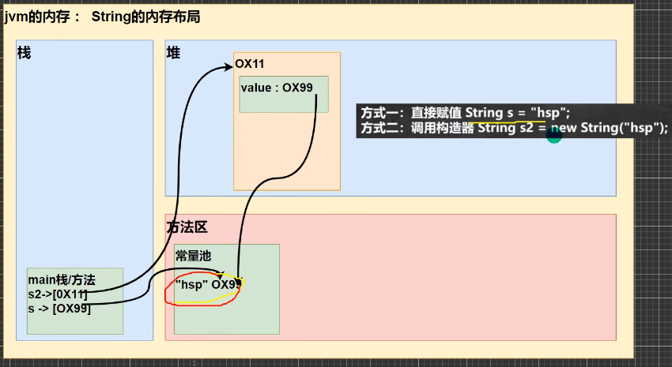

### 内存机制区别

1.先从常量池查看是否有"hsp"数据空间，如果有，直接指向;如果没有则重新创建，然后指向。==s最终指向的是常量池的空间地址==

```java
String s1 = "hsp"; // 在字符串常量池中创建
```

2.先在堆中创建空间，里面维护了value属性，指向常量池的hsp空间.如果常量池没有"hsp”，重新创建，如果有，直接通过value指向。==最终指向的是堆中的空间地址。==

```java
String s2 = new String("hsp"); // 在堆中创建对象，并看常量池中是否有"hsp"
```

### 测试题

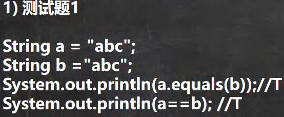


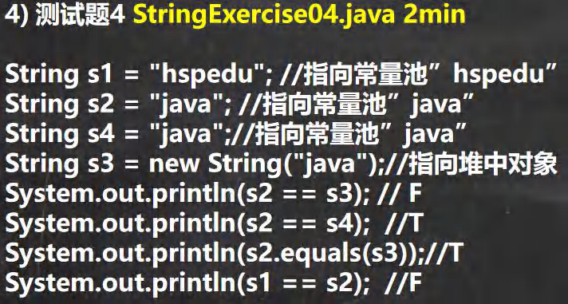

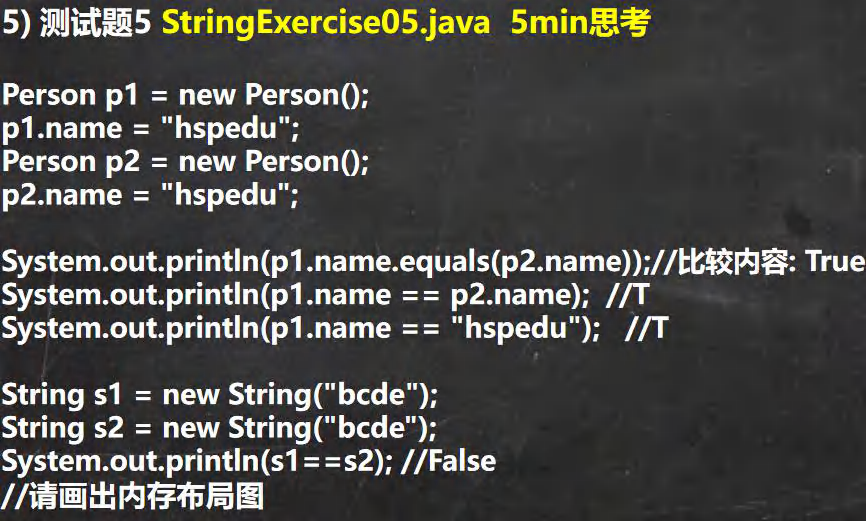

### String类的常用方法

- `append()`：追加，最常用。
- `delete(start, end)`：删除。
- `replace(start, end, str)`：替换。
- `indexOf()`：查找。
- `insert(index, str)`：插入。
- `reverse()`：反转。
- `toString()`：转换为String。

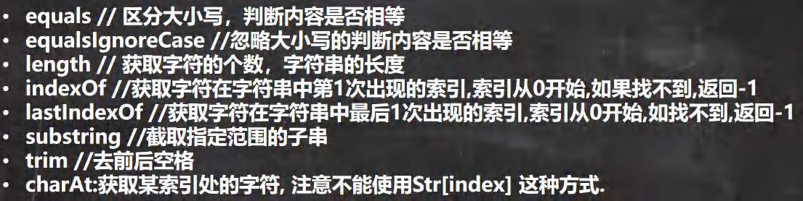


replace()方法执行后，返回的结果才是替换过的

`compareTo()`方法并不只是比较字符串的长度。它遵循的是 **字典顺序**（类似于字典或电话簿中单词的排列顺序），其比较规则可以总结为下表：

| 比较情况                      | 返回值依据                                                   | 示例（`str1.compareTo(str2)`） | 示例结果          |
| :---------------------------- | :----------------------------------------------------------- | :----------------------------- | :---------------- |
| **情况1：首字符不同**         | 返回第一个不同字符的Unicode值之差（`str1的字符 - str2的字符`） | `"apple".compareTo("banana")`  | 负数（'a' - 'b'） |
| **情况2：字符相同，长度不同** | 返回两个字符串的长度之差（`str1.length() - str2.length()`）  | `"hi".compareTo("hello")`      | 正数（'i' - 'e'） |
| **情况3：字符完全相同**       | 返回 `0`                                                     | `"hello".compareTo("hello")`   | `0`               |

```java
format()方法 
// 字符串和字符
String name = "Alice";
String str1 = String.format("Hello, %s! Your initial is %c.", name, name.charAt(0));
System.out.println(str1); // 输出：Hello, Alice! Your initial is A.

// 整数和浮点数
int age = 25;
double salary = 8000.555;
String str2 = String.format("Age: %d, Salary: %.2f", age, salary); // %.2f 表示保留两位小数
System.out.println(str2); // 输出：Age: 25, Salary: 8000.56 (注意四舍五入)

// 布尔值
boolean isJavaFun = true;
String str3 = String.format("Is Java fun? %b", isJavaFun);
System.out.println(str3); // 输出：Is Java fun? true

// 换行符 %n
String str4 = String.format("First Line.%nSecond Line.");
System.out.println(str4); // 输出两行文字
```

------

### StringBuffer类(10/02)

#### 介绍

| 特性维度     | StringBuffer 的特点                                          |
| :----------- | :----------------------------------------------------------- |
| **可变性**   | **可变**。内容可以直接修改，不会创建新对象 。                |
| **线程安全** | **线程安全**。其方法是同步的（synchronized），适合多线程环境 。 |
| **性能**     | 在频繁修改字符串时，性能远高于 String；但由于同步开销，在单线程环境下通常比 StringBuilder 慢 。 |
| **核心方法** | `append()`, `insert()`, `delete()`, `reverse()`, `toString()`等 。 |

#### String ->StringBuffer

要理解 StringBuffer 的价值，首先要明白 Java 中基本的 `String`类是**不可变的（immutable）**。这意味着一旦一个 String 对象被创建，它的值就不能被改变。当你对 String 对象进行看似“修改”的操作时，例如拼接，实际上是在不断地创建新的 String 对象。

```java
String result = "";
for (int i = 0; i < 10000; i++) {
    result += i; // 每次循环都会在内存中创建一个新的String对象！
}
```

在上面的例子中，循环一万次会产生大量临时字符串对象，导致**巨大的内存开销和性能下降**。StringBuffer 就是为了解决这个问题而生的。因为它是一个**可变的字符序列**，你可以在同一个对象上进行修改，避免了不必要的对象创建，特别适合在循环或需要频繁拼接字符串的场景中使用 

```java
StringBuffer result = new StringBuffer();
for (int i = 0; i < 10000; i++) {
    result.append(i); // 所有操作都在原始的result对象上进行，高效！
}
```

#### 创建 StringBuffer 对象

```java
// 1. 创建一个初始容量为16个字符的空StringBuffer
StringBuffer sb1 = new StringBuffer();

// 2. 创建一个指定初始容量的空StringBuffer
StringBuffer sb2 = new StringBuffer(100);

// 3. 用一个已存在的字符串创建StringBuffer，容量为字符串长度+16
StringBuffer sb3 = new StringBuffer("Hello");
```

**容量（capacity）** 指的是当前对象分配的字符空间大小，可以通过 `capacity()`方法查看。而 **长度（length）** 指的是实际存储的字符个数，通过 `length()`方法查看。StringBuffer 会自动扩容以容纳更多字符，你通常不需要手动管理 。

#### 常用方法详解

**追加内容：`append(String str)`**

```java
StringBuffer sb = new StringBuffer("Hello");
sb.append(" World"); // sb 现在的内容是 "Hello World"
sb.append(123);       // sb 现在的内容是 "Hello World123"
```

**插入内容：`insert(int offset, String str)`**

```java
StringBuffer sb = new StringBuffer("Hello World");
sb.insert(5, ","); // 在索引5（第6个字符）的位置插入逗号
// 结果："Hello, World"
```

**删除内容：`delete(int start, int end)`**

```java
StringBuffer sb = new StringBuffer("Hello Java World");
sb.delete(6, 10); // 删除索引6到10的字符（"Java"）
// 结果："Hello World"
```

**替换内容：`replace(int start, int end, String str)`**

```java
StringBuffer sb = new StringBuffer("Hello World");
sb.replace(6, 11, "Java"); // 将"World"替换为"Java"
// 结果："Hello Java"
```

**反转字符串：`reverse()`**

```java
StringBuffer sb = new StringBuffer("abc");
sb.reverse();
// 结果："cba"
```

**转换为 String：`toString()`**

```java
StringBuffer sb = new StringBuffer("Hello");
String immutableString = sb.toString(); // 转换为String对象
```

#### StringBuffer练习

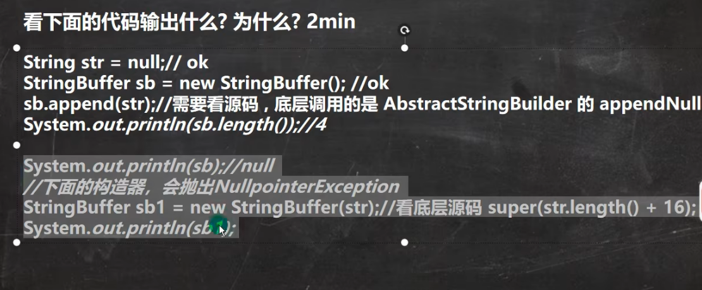


### StringBuffer vs StringBuilder

Java 还提供了一个和 StringBuffer 几乎一模一样的类——**StringBuilder**。它们的 API（方法）是完全一致的。

它们之间**唯一重要的区别**在于：

- **StringBuffer** 是**线程安全的**，它的方法都是同步的（synchronized）。
- **StringBuilder** 是**非线程安全的**，没有同步开销。

因此，在选择时遵循这个原则：

- 如果你的代码在**多线程环境**下运行，并且多个线程可能同时修改同一个字符串，那么使用 **StringBuffer**。
- 如果你的代码在**单线程环境**下运行，或者不存在线程安全问题，那么优先使用 **StringBuilder**，因为它能获得更好的性能。

### 总结与使用场景

| 特性         | String           | StringBuffer         | StringBuilder        |
| :----------- | :--------------- | :------------------- | :------------------- |
| **可变性**   | 不可变           | **可变**             | **可变**             |
| **线程安全** | 是（因不可变）   | **是**               | 否                   |
| **性能**     | 低（频繁修改时） | 中                   | **高**               |
| **适用场景** | 字符串不常改变   | **多线程下频繁修改** | **单线程下频繁修改** |

------

## Math类

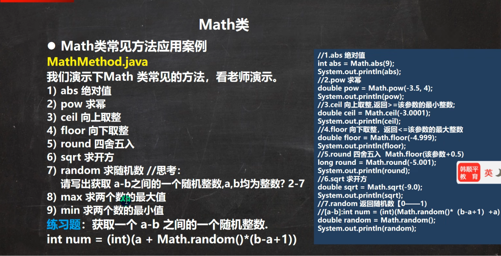

------

## Arrays类

| 方法类别     | 关键方法                                                   | 主要用途                                                     |
| :----------- | :--------------------------------------------------------- | :----------------------------------------------------------- |
| **数组输出** | `toString(array)`, `deepToString(array)`                   | 将数组内容转换为易读的字符串格式，方便打印和调试。           |
| **数组排序** | `sort(array)`, `parallelSort(array)`                       | 对数组元素进行排序（默认升序）。`parallelSort`利用多核优势，对大数组排序更快。 |
| **元素查找** | `binarySearch(array, key)`                                 | 在已排序的数组中使用二分查找法快速查找特定元素。             |
| **数组复制** | `copyOf(array, newLength)`, `copyOfRange(array, from, to)` | 复制数组的全部或部分元素到一个新数组。                       |
| **数组填充** | `fill(array, value)`, `fill(array, from, to, value)`       | 将数组的所有元素或指定范围内的元素填充为指定的值。           |
| **数组比较** | `equals(array1, array2)`, `deepEquals(array1, array2)`     | 比较两个数组的内容是否完全相等（包括顺序）。`deepEquals`用于比较多维数组。 |
| **数组转换** | `asList(T... a)`                                           | 将数组转换为一个固定大小的 List 集合。                       |

#### 1. 输出数组内容：`toString()`和 `deepToString()`

直接使用 `System.out.println(array)`打印数组会输出一串难以理解的哈希码。而 `Arrays.toString()`方法可以将数组元素以清晰、美观的字符串形式（如 `[1, 2, 3]`）展示出来。

```java
import java.util.Arrays;

int[] numbers = {3, 1, 4, 1, 5};
System.out.println(Arrays.toString(numbers)); // 输出: [3, 1, 4, 1, 5]

// 对于多维数组，使用 deepToString 才能正确显示嵌套结构
int[][] matrix = {{1, 2}, {3, 4}};
System.out.println(Arrays.deepToString(matrix)); // 输出: [[1, 2], [3, 4]]
[3](@ref)
```

#### 2. 数组排序：`sort()`和 `parallelSort()`⭐⭐⭐

`sort()`方法可以对数组进行升序排序，这是使用二分查找等方法的前提。

```java
int[] scores = {79, 65, 93, 64, 88};
Arrays.sort(scores); // 排序后 scores 变为 [64, 65, 79, 88, 93]
System.out.println(Arrays.toString(scores));

// 也可以只对数组的指定范围进行排序
int[] arr = {3, 2, 1, 5, 4};
Arrays.sort(arr, 0, 3); // 对索引0到2（不包括3）的元素排序
System.out.println(Arrays.toString(arr)); // 输出: [1, 2, 3, 5, 4]
[2](@ref)
```

对于大型数组，可以考虑使用 `parallelSort()`，它可能会更快，因为它利用了多线程并行处理。

##### 🔑 Comparator 接口：自定义排序的灵魂

无论是哪种 `sort`方法，当需要进行自定义排序时，都离不开 `Comparator`接口。它的核心是一个需要实现的 `compare`方法，其返回值决定了两个对象的顺序：

- **返回负数**：表示第一个参数 `o1`应该排在 `o2`**前面**。
- **返回零**：表示 `o1`和 `o2`相等，顺序不变。
- **返回正数**：表示 `o1`应该排在 `o2`**后面**。

记住一个简单口诀：**负前正后**。

##### 📝 三种 sort 接口的用法详解

###### 1. Arrays.sort() - 数组排序专家

`Arrays.sort()`专用于对数组进行排序，它提供了多种重载方法。

- **自然排序（升序）**

  对于基本数据类型（如 `int[]`, `double[]`）和实现了 `Comparable`接口的对象数组（如 `String[]`, `Integer[]`），可以直接调用，默认按升序排列。

  ```java
  import java.util.Arrays;
  
  int[] intArr = {5, 3, 8, 1};
  Arrays.sort(intArr); // 排序后 intArr 变为 [1, 3, 5, 8]
  
  String[] strArr = {"Banana", "Apple", "Orange"};
  Arrays.sort(strArr); // 排序后 strArr 变为 ["Apple", "Banana", "Orange"]
  ```

- **自定义排序（使用 Comparator）**

  对于对象数组，可以通过传入 `Comparator`来定义任意排序规则。`Comparator`的实现方式非常灵活：

  - **匿名内部类**（传统方式，代码稍显冗长）
  - **Lambda 表达式**（Java 8+ 推荐，简洁直观）
  - **方法引用**或**内置比较器工厂方法**（特定场景下更简洁）

  ```java
  Integer[] numArr = {5, 3, 8, 1}; // 注意是 Integer[] 而非 int[]
  
  // 使用 Lambda 表达式实现降序排序
  Arrays.sort(numArr, (o1, o2) -> o2 - o1); // 排序后 [8, 5, 3, 1]
  /**
  Lambda表达式 (o1, o2) -> o2 - o1实际上就是在实现 compare方法，只是语法更简洁。
  ​分解理解：​​
  (o1, o2)：这是方法的参数，对应 compare(Object o1, Object o2)
  ->：Lambda运算符，意思是"映射到"或"返回"
  o2 - o1：这是方法体，对应 return o2 - o1;
  // 根据"负前正后"规则：
  // 返回负数 → o1(5)应该排在o2(3)的后面
  // 所以大的数字(5)会排在前面，小的数字(3)排在后面
  // 这就是降序！
  */
  
  // 使用内置比较器实现按字符串长度排序
  String[] words = {"Cat", "Elephant", "Dog"};
  Arrays.sort(words, Comparator.comparingInt(String::length)); // 排序后 ["Cat", "Dog", "Elephant"]
  ```

###### 2. Collections.sort() 与 List.sort() - 集合排序利器

这两个方法用于对 `List`集合（如 `ArrayList`, `LinkedList`）进行排序，它们的核心逻辑相同，只是调用方式不同。

- **`Collections.sort()`**：这是一个静态方法，通过工具类 `Collections`调用。
- **`List.sort()`**：这是 Java 8 以后 `List`接口的默认方法，更面向对象，推荐使用。

```java
import java.util.*;

List<Integer> numList = Arrays.asList(5, 3, 8, 1);

// 使用 Collections.sort() 升序排序
Collections.sort(numList); // 排序后列表为 [1, 3, 5, 8]

// 使用 List.sort() 和 Lambda 表达式降序排序
numList.sort((o1, o2) -> o2 - o1); // 排序后列表为 [8, 5, 3, 1]
```

##### 💡 进阶使用技巧

1. ###### **组合比较器**

   当首要排序规则相同时，可以使用 `thenComparing`方法指定次要、再次要的排序规则，形成级联比较。

   ```java
   // 假设一个Person类，有name和age属性
   List<Person> people = ...;
   // 先按年龄升序，如果年龄相同，再按姓名降序
   people.sort(Comparator.comparingInt(Person::getAge)
                        .thenComparing(Comparator.comparing(Person::getName).reversed()));
   ```

2. ###### **处理 null 值**

   可以使用 `Comparator.nullsFirst`或 `Comparator.nullsLast`来指定排序时 `null`值的位置，避免 `NullPointerException`。

   ```java
   List<String> listWithNulls = Arrays.asList("Apple", null, "Banana");
   listWithNulls.sort(Comparator.nullsFirst(String::compareTo)); // null值排在最前
   ```

#### 3. 二分查找：`binarySearch()`

**重要前提**：使用此方法前，必须确保数组已经是有序的（通常是升序），否则结果不可靠。

- **如果找到元素**：返回该元素在数组中的**索引**。
- **如果未找到元素**：返回一个**负值**，其绝对值表示该元素若存在时应插入的位置（从1开始计数）。

```java
int[] sortedArray = {10, 20, 30, 40, 50};
int index1 = Arrays.binarySearch(sortedArray, 30);
System.out.println(index1); // 输出: 2 (找到，索引为2)

int index2 = Arrays.binarySearch(sortedArray, 25);
System.out.println(index2); // 输出: -3 (未找到，若插入应在索引2的位置)
[2,3](@ref)
```

#### 4. 复制数组：`copyOf()`和 `copyOfRange()`

这些方法会创建一个新的数组对象，而不是简单的引用复制。

```java
int[] original = {1, 2, 3, 4, 5};

// 复制指定长度（从开头开始）
int[] copy1 = Arrays.copyOf(original, 3); // 新数组为 [1, 2, 3]

// 如果新长度大于原数组，多出的部分会用默认值（如0）填充
int[] copy2 = Arrays.copyOf(original, 7); // 新数组为 [1, 2, 3, 4, 5, 0, 0]

// 复制指定范围 [from, to)
int[] copy3 = Arrays.copyOfRange(original, 1, 4); // 新数组为 [2, 3, 4]
[2,3,6](@ref)
```

#### 5. 填充数组：`fill()`

可以快速将数组的所有元素或部分元素设置为同一个值。

```java
int[] arr = new int[5];
Arrays.fill(arr, 10); // 将整个数组填充为10: [10, 10, 10, 10, 10]

// 填充指定范围 [from, to)
Arrays.fill(arr, 1, 4, 20); // 将索引1到3的元素填充为20: [10, 20, 20, 20, 10]
[2,5](@ref)
```

#### 6. 比较数组：`equals()`和 `deepEquals()`

`equals()`方法会比较两个数组的长度、对应位置的元素是否都相等

。对于多维数组，需要使用 `deepEquals()`进行深层比较。

```java
int[] a1 = {1, 2, 3};
int[] a2 = {1, 2, 3};
int[] a3 = {3, 2, 1};

System.out.println(Arrays.equals(a1, a2)); // true
System.out.println(Arrays.equals(a1, a3)); // false

int[][] m1 = {{1, 2}, {3, 4}};
int[][] m2 = {{1, 2}, {3, 4}};
System.out.println(Arrays.equals(m1, m2));     // false (比较的是子数组的引用)
System.out.println(Arrays.deepEquals(m1, m2)); // true  (深层比较内容)
[3,5](@ref)
```

####  重要注意事项

1. **`asList()`的陷阱**：使用 `Arrays.asList(T... a)`将数组转换为 List 时，得到的 List 大小是**固定**的，不能进行添加(`add`)或删除(`remove`)操作，否则会抛出 `UnsupportedOpationException`异常。此外，该方法不适用于基本数据类型（如 `int[]`）的数组，需要是包装类（如 `Integer[]`）。
2. **数组大小固定**：Arrays 类的方法操作的是固定大小的数组。如果你需要动态调整大小的集合，应该考虑使用 `ArrayList`等集合类。

## System类

### 时间测量：性能测试利器

`currentTimeMillis()`和 `nanoTime()`常用来测量代码执行时间：

```java
long startTime = System.nanoTime();
// ... 在这里执行你需要测试的代码 ...
long endTime = System.nanoTime();
long duration = endTime - startTime;
System.out.println("代码执行耗时：" + duration + " 纳秒");
```

**区别在于**：`currentTimeMillis()`获取的是当前时间与时间原点（1970年1月1日 UTC）的毫秒数，也可用于表示当前日期时间；而 `nanoTime()`提供更高精度的纳秒级计时，更适用于测量时间间隔，但与日历时间无关

### **高效数组复制**：`arraycopy()`是本地方法，性能优于手动循环。

```java
int[] src = {1, 2, 3, 4, 5};
int[] dest = new int[5];
System.arraycopy(src, 0, dest, 0, src.length); // 将src全部复制到dest
```

------

## BigInteger类和BigDecimal类

| 特性维度     | **BigInteger（大整数）**                                     | **BigDecimal（高精度小数）**                                 |
| :----------- | :----------------------------------------------------------- | :----------------------------------------------------------- |
| **核心用途** | 处理任意精度的整数运算                                       | 处理任意精度的浮点数（小数）运                               |
| **精度保证** | 精确的整数运算，无精度丢失                                   | 精确的小数运算，避免 double/float 的二进制表示误差           |
| **核心操作** | 加(`add`)、减(`subtract`)、乘(`multiply`)、除(`divide`)、取余(`remainder`)、幂运算(`pow`) | 加(`add`)、减(`subtract`)、乘(`multiply`)、除(`divide`)、精度设置(`setScale`) |
| **创建对象** | `new BigInteger("12345678901234567890")` `BigInteger.valueOf(100L)` | `new BigDecimal("123.456")` `BigDecimal.valueOf(0.1)`        |
| **关键特点** | 不可变，线程安全                                             | 不可变，线程安全；**除法必须指定舍入模式**                   |

### 创建 BigInteger 对象

```java
// 1. 使用字符串构造器（处理超大数）
BigInteger hugeNumber = new BigInteger("123456789012345678901234567890");
// 2. 使用valueOf方法（转换基本数据类型）
BigInteger fromLong = BigInteger.valueOf(1234567890L);
```

### 常用运算示例

`BigInteger`提供了完整的数学运算方法，但注意：这些方法不会修改原对象，而是返回一个新的 `BigInteger`对象，因为它是不可变的（immutable)。

```java
BigInteger a = new BigInteger("10");
BigInteger b = new BigInteger("3");

BigInteger sum = a.add(b);        // 10 + 3 = 13
BigInteger difference = a.subtract(b); // 10 - 3 = 7
BigInteger product = a.multiply(b);   // 10 * 3 = 30
BigInteger quotient = a.divide(b);    // 10 / 3 = 3 (整数除法)
BigInteger remainder = a.remainder(b); // 10 % 3 = 1
BigInteger power = a.pow(2);          // 10^2 = 100
```

### 创建 BigDecimal 对象：避坑指南

**至关重要的一点**：尽量避免使用 `double`构造器，而应使用 `String`构造器或 `BigDecimal.valueOf`静态方法，以避免在构造阶段就引入精度误差。

```java
// 错误示范：可能产生不可预期的精度丢失
BigDecimal bad = new BigDecimal(0.1); 
System.out.println(bad); // 可能输出：0.1000000000000000055511151231257827021181583404541015625

// 正确示范：使用字符串或valueOf方法
BigDecimal good1 = new BigDecimal("0.1"); // 精确表示 0.1
BigDecimal good2 = BigDecimal.valueOf(0.1); // 推荐方式，内部已做优化
```

### 运算与精度控制

BigDecimal`的加、减、乘运算相对直接。但除法 (`divide`) 是其中最需要小心对待的操作。如果相除的结果是无限小数（如 1 除以 3），你必须明确指定结果的小数位数（`scale`）和舍入模式（`RoundingMode`），否则会抛出 `ArithmeticException。

```java
BigDecimal num1 = new BigDecimal("10");
BigDecimal num2 = new BigDecimal("3");

// 错误的除法：不指定舍入模式，结果无限循环会抛出异常
// BigDecimal result = num1.divide(num2); 

// 正确的除法：指定保留2位小数，并采用四舍五入
BigDecimal result = num1.divide(num2, 2, RoundingMode.HALF_UP); // 结果：3.33
```

常见的舍入模式（`RoundingMode`）包括：

- **`HALF_UP`**：最熟悉的“四舍五入”。
- **`HALF_DOWN`**：“五舍六入”。
- **`UP`**：总是向远离零的方向舍入。
- **`DOWN`**：总是向零方向舍入（直接截断）。

你可以使用 `setScale`方法单独调整一个 `BigDecimal`对象的精度。

### 比较操作：使用 compareTo

由于 `BigDecimal`会考虑精度（`scale`），`1.0`和 `1.00`在 `equals`方法看来是不同的对象。因此，**比较两个 `BigDecimal`的数值是否相等时，应该使用 `compareTo()`方法**。

```java
BigDecimal d1 = new BigDecimal("1.0");
BigDecimal d2 = new BigDecimal("1.00");

System.out.println(d1.equals(d2));    // false：因为精度不同
System.out.println(d1.compareTo(d2) == 0); // true：数值相等
```

### 一个简单的场景对比

```java
// 场景：计算 0.1 加 10 次的结果
// 使用 double（存在精度误差）
double doubleSum = 0.0;
for (int i = 0; i < 10; i++) {
    doubleSum += 0.1;
}
System.out.println("double 结果: " + doubleSum); // 输出可能不是精确的 1.0

// 使用 BigDecimal（精确计算）
BigDecimal decimalSum = new BigDecimal("0.0");
for (int i = 0; i < 10; i++) {
    decimalSum = decimalSum.add(new BigDecimal("0.1"));
}
System.out.println("BigDecimal 结果: " + decimalSum); // 精确输出 1.0
```

------

## 日期类

### Calendar类

​	功能更强大，用于提取和操作日期的各个部分（年、月、日等）。通过 `Calendar.getInstance()`获取实例，然后用 `get`方法获取特定字段的值。

```java
import java.util.Calendar;

Calendar calendar = Calendar.getInstance();

// 获取当前的年、月、日
int year = calendar.get(Calendar.YEAR);
int month = calendar.get(Calendar.MONTH) + 1; // 注意：Calendar的月份从0开始（0代表一月），所以需要加1
int day = calendar.get(Calendar.DATE);

System.out.println("今天是：" + year + "年" + month + "月" + day + "日");

// 使用add方法进行日期加减（这里是加一天）
calendar.add(Calendar.DATE, 1);
Date tomorrow = calendar.getTime();
System.out.println("明天是: " + tomorrow);
```

### **LocalDate：处理日期**

```java
import java.time.LocalDate;

// 获取当前日期
LocalDate today = LocalDate.now();
System.out.println("今天: " + today); // 输出格式：2025-10-02

// 创建指定日期
LocalDate nationalDay = LocalDate.of(2025, 10, 1);
System.out.println("国庆节: " + nationalDay);

// 日期加减（非常直观）
LocalDate tomorrow = today.plusDays(1); // 加一天
LocalDate nextWeek = today.plusWeeks(1); // 加一周
LocalDate lastMonth = today.minusMonths(1); // 减一个月

System.out.println("明天: " + tomorrow);
System.out.println("一周后: " + nextWeek);
System.out.println("一个月前: " + lastMonth);
```

### **DateTimeFormatter：格式化日期**

`DateTimeFormatter`用于日期和字符串之间的转换。

```java
import java.time.format.DateTimeFormatter;

LocalDate date = LocalDate.now();

// 定义格式器
DateTimeFormatter formatter = DateTimeFormatter.ofPattern("yyyy年MM月dd日");
// 将日期格式化为字符串
String formattedDate = date.format(formatter);
System.out.println("格式化后的日期: " + formattedDate); // 输出：2025年10月02日

// 将字符串解析为日期
String dateStr = "2025-12-25";
LocalDate christmas = LocalDate.parse(dateStr); // 默认解析标准格式（yyyy-MM-dd）
System.out.println("解析出的日期: " + christmas);

// 解析自定义格式的字符串
String customDateStr = "25/12/2025";
DateTimeFormatter customFormatter = DateTimeFormatter.ofPattern("dd/MM/yyyy");
LocalDate anotherChristmas = LocalDate.parse(customDateStr, customFormatter);
System.out.println("解析自定义格式的日期: " + anotherChristmas);
```

**计算日期间隔**：使用 `Period`类计算两个日期之间相差的年、月、日。

```java
import java.time.Period;

LocalDate start = LocalDate.of(2020, 1, 1);
LocalDate end = LocalDate.of(2025, 10, 2);

Period period = Period.between(start, end);
System.out.println("间隔: " + period.getYears() + "年 " + period.getMonths() + "月 " + period.getDays() + "天");
```

### **题目**：请使用日期时间相关的API，计算出一个人已经出生了多少天。

```java
import java.text.ParseException;
import java.text.SimpleDateFormat;
import java.util.Date;
import java.util.Scanner;

/*
 把String转换成Date对象
*/
public class Demo {
    public static void main(String[] args) throws ParseException {
        System.out.println("请输入出生日期 格式 YYYY-MM-dd");
        // 获取出生日期,键盘输入
        String birthdayString = new Scanner(System.in).next();
        // 将字符串日期,转成Date对象
        // 创建SimpleDateFormat对象,写日期模式
        SimpleDateFormat sdf = new SimpleDateFormat("yyyy-MM-dd");
        // 调用方法parse,字符串转成日期对象
        Date birthdayDate = sdf.parse(birthdayString);
        // 获取今天的日期对象
        Date todayDate = new Date();
        // 将两个日期转成毫秒值,Date类的方法getTime
        long birthdaySecond = birthdayDate.getTime();
        long todaySecond = todayDate.getTime();
        long secone = todaySecond-birthdaySecond;
        if (secone < 0){
            System.out.println("还没出生呢");
        } else {
            System.out.println(secone/1000/60/60/24);
        }
    }
}

```

------

# 	JAVA第14章随记 集合

## 集合


## 集合的框架体系⭐⭐⭐⭐⭐(背)


```java
//1. 集合主要是两组(单列集合 , 双列集合)
//2. Collection 接口有两个重要的子接口 List Set , 他们的实现子类都是单列集合
//3. Map 接口的实现子类 是双列集合，存放的 K-V 键值对
```

## Collection接口和常用方法


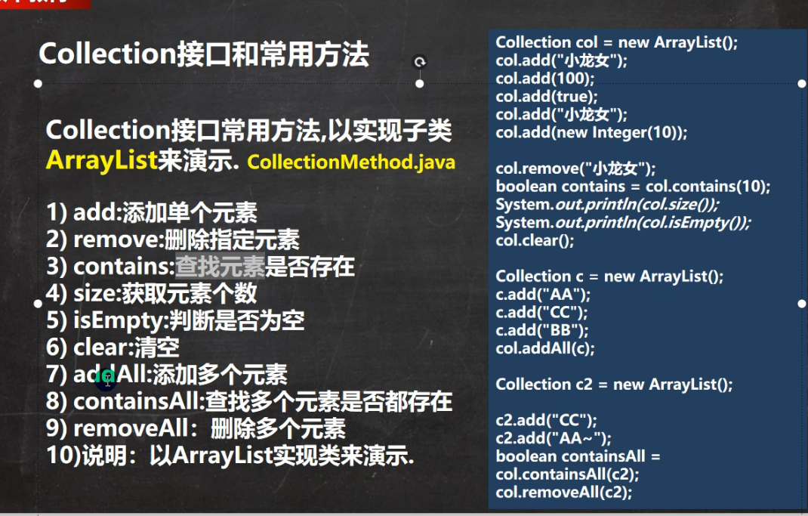

### iterator迭代器

#### 1. Iterator的基本概念

Iterator是Java集合框架中的一个接口，它位于`java.util`包中。Iterator不是集合本身，而是一种用于遍历集合的机制。任何实现了`Iterable`接口的集合（如ArrayList、LinkedList、HashSet等）都可以通过调用`iterator()`方法获取一个迭代器对象。

Iterator的核心作用是提供一种统一的遍历集合元素的方式，无论底层集合的具体实现如何，你都可以使用相同的方法来访问其中的元素。

#### 2. Iterator的核心方法

Iterator接口定义了三个核心方法，掌握了它们就掌握了Iterator的使用：

| 方法名      | 返回值      | 功能描述                                   |
| :---------- | :---------- | :----------------------------------------- |
| `hasNext()` | `boolean`   | 检查是否还有更多元素可供遍历               |
| `next()`    | `E`（泛型） | 返回下一个元素，并将指针向后移动           |
| `remove()`  | `void`      | 删除上次调用`next()`返回的元素（可选操作） |

##### 2.1 hasNext()和next()方法

`hasNext()`方法用于检查集合中是否还有未遍历的元素，而`next()`方法则实际获取下一个元素并将迭代器的指针向后移动。

```java
import java.util.ArrayList;
import java.util.Iterator;

public class IteratorExample {
    public static void main(String[] args) {
        // 创建一个ArrayList集合
        ArrayList<String> fruits = new ArrayList<>();
        fruits.add("Apple");
        fruits.add("Banana");
        fruits.add("Cherry");
        
        // 获取迭代器
        Iterator<String> iterator = fruits.iterator();
        
        // 使用while循环遍历集合
        while(iterator.hasNext()) {
            String fruit = iterator.next();
            System.out.println(fruit);
        }
    }
}
```

##### 2.2 remove()方法

`remove()`方法用于删除迭代器当前指向的元素。**重要提示**：必须先调用`next()`方法定位到元素后，才能调用`remove()`方法。

```java
import java.util.ArrayList;
import java.util.Iterator;

public class RemoveExample {
    public static void main(String[] args) {
        ArrayList<Integer> numbers = new ArrayList<>();
        numbers.add(12);
        numbers.add(8);
        numbers.add(2);
        numbers.add(23);
        
        Iterator<Integer> it = numbers.iterator();
        while(it.hasNext()) {
            Integer num = it.next();
            if(num < 10) {
                it.remove(); // 删除小于10的元素
            }
        }
        
        System.out.println(numbers); // 输出: [12, 23]
    }
}
```

#### 3. Iterator的工作原理

理解Iterator的工作原理有助于避免常见的错误。你可以把迭代器想象成一个指向集合元素的"指针"：

1. 当通过`集合.iterator()`获取迭代器时，指针位于第一个元素之前
2. 第一次调用`next()`，指针移动到第一个元素并返回该元素
3. 后续调用`next()`，指针继续向后移动
4. 当`hasNext()`返回`false`时，表示所有元素已遍历完毕

Iterator（迭代器）是Java中用于遍历集合（如ArrayList、HashSet等）的重要工具。它提供了一种标准的方法来逐个访问集合中的元素，而无需关心集合的内部结构。下面我将为你详细解释Iterator的用法、原理和注意事项。

下面的表格展示了迭代器遍历集合`["A", "B", "C"]`的过程：

| 操作        | 返回值  | 指针位置 |
| :---------- | :------ | :------- |
| 初始状态    | -       | ↑A, B, C |
| `hasNext()` | `true`  | ↑A, B, C |
| `next()`    | "A"     | A, ↑B, C |
| `next()`    | "B"     | A, B, ↑C |
| `next()`    | "C"     | A, B, C↑ |
| `hasNext()` | `false` | A, B, C↑ |

#### 4. 增强for循环与Iterator的关系

Java的增强for循环，增强 for 循环是一种“语法糖”，意思是它只是现有技术的简便写法，编译后会被转换成等价的底层实现,==底层仍然使用Iterator实现。==

```java
// 增强for循环
/*
for (元素类型 局部变量名 : 要遍历的数组或集合) {
    // 循环体，可以使用局部变量
}
*/
for (String fruit : fruits) {
    System.out.println(fruit);
}

// 等价于以下Iterator写法
Iterator<String> iterator = fruits.iterator();
while(iterator.hasNext()) {
    String fruit = iterator.next();
    System.out.println(fruit);
}
```

虽然增强for循环更简洁，但它有一个限制：**在增强for循环中不能直接修改集合结构（如删除元素）**，否则会抛出`ConcurrentModificationException`异常。需要删除元素时，必须使用显式的Iterator。

#### 5.测试题

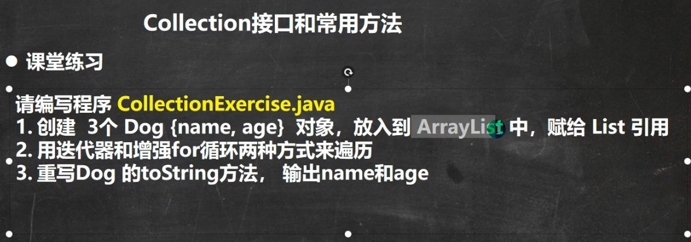

```java
import java.util.ArrayList;
import java.util.Iterator;
import java.util.List;

// 定义Dog类
class Dog {
    private String name;
    private int age;

    // 构造方法，用于初始化name和age
    public Dog(String name, int age) {
        this.name = name;
        this.age = age;
    }

    // 重写toString方法，自定义输出格式
    @Override
    public String toString() {
        return "Dog{name='" + name + "', age=" + age + "}";
    }
}

// 主类
public class CollectionExercise {
    public static void main(String[] args) {
        // 1. 创建ArrayList并赋给List接口引用（多态：List是接口，ArrayList是实现类）
        List dogList = new ArrayList();

        // 创建3个Dog对象并添加到ArrayList中
        dogList.add(new Dog("Buddy", 3));
        dogList.add(new Dog("Max", 5));
        dogList.add(new Dog("Charlie", 2));

        // 2. 使用迭代器遍历 快捷键itit
        System.out.println("=== 使用迭代器遍历 ===");
        Iterator<Dog> iterator = dogList.iterator(); // 获取迭代器对象
        while (iterator.hasNext()) { // 检查是否还有下一个元素
            Dog dog = iterator.next(); // 获取下一个元素并移动指针
            System.out.println(dog); // 自动调用dog的toString方法
        }

        // 3. 使用增强for循环遍历 快捷键I
        System.out.println("\n=== 使用增强for循环遍历 ===");
        for (Dog dog : dogList) { // 语法：for (元素类型 变量 : 集合)
            System.out.println(dog);
        }
    }
}
```

------

## List接口和常用方法

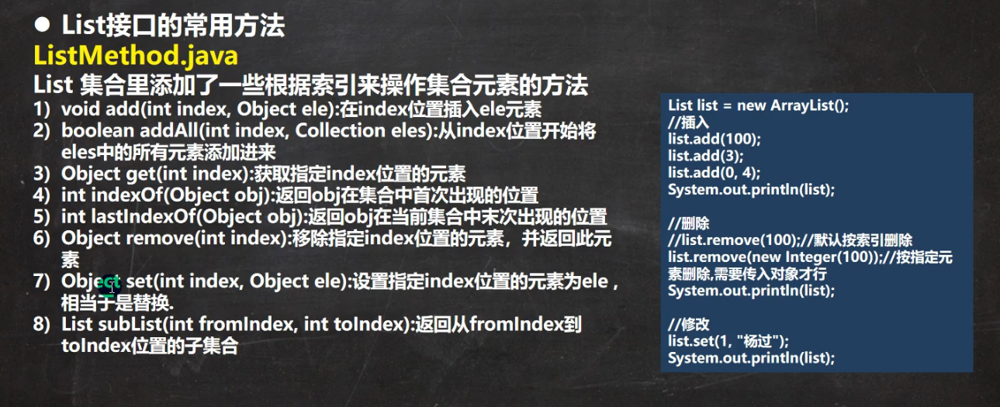

List 接口是 Java 集合框架中非常核心的一部分，它代表了一个==**有序、可重复**==的序列。下面这个表格汇总了 List 主要实现类的特点，帮助你快速建立整体印象：

| 实现类                   | 底层数据结构         | 线程安全           | 随机访问效率        | 插入/删除效率                 | 典型适用场景                 |
| :----------------------- | :------------------- | :----------------- | :------------------ | :---------------------------- | :--------------------------- |
| **ArrayList**            | 动态数组             | **否**             | **O(1) - 快**       | O(n) - 慢（需移动元素）       | 查询频繁，增删操作少         |
| **LinkedList**           | 双向链表             | **否**             | O(n) - 慢（需遍历） | **O(1) - 快**（在已知节点处） | 频繁在列表中间进行插入和删除 |
| **Vector**               | 动态数组             | **是**（方法同步） | O(1) - 快           | O(n) - 慢                     | 遗留系统，线程安全需求       |
| **CopyOnWriteArrayList** | 动态数组（写时复制） | **是**（写时复制） | O(1) - 快（读）     | O(n) - 慢（写）               | 读多写极少的高并发场景       |

理解 List 接口，首先要掌握它的三个核心特性：

- **有序性**：元素按照插入的顺序存储，第一个添加的元素索引为0，第二个为1，以此类推。
- **可重复性**：允许存储相同的元素。
- **索引支持**：可以通过类似数组的下标（从0开始）来精确访问和操作元素。

### List 常用的操作方法：

**1. 增加元素**

- `boolean add(E e)`: 将元素追加到列表末尾。
- `void add(int index, E element)`: 在指定索引位置插入元素，该位置及后续的元素会自动后移。

**2. 删除元素**

- `E remove(int index)`: 移除指定索引位置的元素，并返回被移除的元素。
- `boolean remove(Object o)`: 移除列表中第一次出现的指定元素（如果存在），返回是否成功移除。

**3. 修改元素**

- `E set(int index, E element)`: 用指定元素替换列表中指定位置的元素，并返回被替换的旧元素。

**4. 查询元素**

- `E get(int index)`: 返回列表中指定位置的元素。
- `int indexOf(Object o)`: 返回指定元素在列表中第一次出现的索引，如果不存在则返回-1。
- `int lastIndexOf(Object o)`: 返回指定元素在列表中最后一次出现的索引。
- `int size()`: 返回列表中的元素个数。
- `boolean contains(Object o)`: 判断列表是否包含指定元素。
- `boolean isEmpty()`: 判断列表是否为空。

**5. 其他操作**

- `void clear()`: 清空列表中的所有元素。
- `List<E> subList(int fromIndex, int toIndex)`: 返回从 `fromIndex`（包含）到 `toIndex`（不包含）的子列表视图。

```java
import java.util.ArrayList;
import java.util.List;

public class ListBasicExample {
    public static void main(String[] args) {
        // 1. 创建一个ArrayList（使用List接口引用，这是良好的编程习惯）
        List<String> cityList = new ArrayList<>();

        // 2. 添加元素
        cityList.add("Beijing"); // 索引0
        cityList.add("Shanghai"); // 索引1
        cityList.add("Guangzhou"); // 索引2
        cityList.add(1, "Shenzhen"); // 在索引1处插入，原索引1及之后的元素后移

        System.out.println("初始列表: " + cityList); // 输出: [Beijing, Shenzhen, Shanghai, Guangzhou]

        // 3. 查询元素
        String city = cityList.get(2);
        System.out.println("索引2的城市是: " + city); // 输出: Shanghai
        System.out.println("深圳的索引位置: " + cityList.indexOf("Shenzhen")); // 输出: 1
        System.out.println("列表大小: " + cityList.size()); // 输出: 4

        // 4. 修改元素
        String oldCity = cityList.set(3, "Hangzhou");
        System.out.println("将" + oldCity + "替换为Hangzhou后: " + cityList); // 输出: [Beijing, Shenzhen, Shanghai, Hangzhou]

        // 5. 删除元素
        cityList.remove("Shenzhen"); // 按元素删除
        cityList.remove(0); // 按索引删除
        System.out.println("删除部分元素后: " + cityList); // 输出: [Shanghai, Hangzhou]

        // 6. 子列表
        List<String> subList = cityList.subList(0, 1);
        System.out.println("子列表: " + subList); // 输出: [Shanghai]
    }
}
```

###  遍历List的三种方式

#### **1. 普通 for 循环（使用索引）**

当需要知道元素的索引时使用。

```java
for (int i = 0; i < list.size(); i++) {
    String item = list.get(i);
    System.out.println("索引 " + i + ": " + item);
}
```

#### **2. 增强 for 循环（for-each）**

语法简洁，适用于只需遍历元素而无需索引的场景。

```java
for (String item : list) {
    System.out.println(item);
}
```

#### **3. 迭代器（Iterator）**

提供了安全的遍历方式，可以在遍历过程中使用迭代器的 `remove()`方法删除元素，而不会引发并发修改异常。

```java
java.util.Iterator<String> iterator = list.iterator();
while (iterator.hasNext()) {
    String item = iterator.next();
    System.out.println(item);
    // 如果需要，可以在这里安全地使用 iterator.remove(); 删除当前元素
}
```

------

## 改查多ArrayList (Collection-List子类)

### 定义

底层的数据结构就是**数组**，数组元素类型为 Object 类型，即可以存放所有类型数据。对 ArrayList 类的实例的所有操作底层都是基于数组的。

### 注意事项

1.**线程不安全**

ArrayList 是**非同步的**，多个线程同时修改（添加、删除）可能导致数据不一致或异常。

2.**Fail-Fast 机制**

当使用迭代器遍历 ArrayList 时，如果**直接通过 ArrayList 的方法（非迭代器自身的 `remove`方法）修改了集合的结构**，迭代器会立即抛出 `ConcurrentModificationException`异常，这就是 fail-fast。这是为了尽早发现并发修改问题，避免更隐蔽的错误。

```java
// 错误示例：会抛出ConcurrentModificationException
Iterator<String> it = list.iterator();
while (it.hasNext()) {
    String s = it.next();
    if ("A".equals(s)) {
        list.remove(s); // 错误！直接调用集合的remove方法
    }
}

// 正确做法：使用迭代器的remove方法
Iterator<String> it = list.iterator();
while (it.hasNext()) {
    String s = it.next();
    if ("A".equals(s)) {
        it.remove(); // 正确！使用迭代器的remove方法
    }
}
```

ArrayList 是 List 接口的大小可变数组的实现；
ArrayList 实现了所有可选列表操作，并允许 null 元素；
ArrayList 不断添加元素，容量也会自动增长；

### 扩容机制

| **默认初始容量** | 10                                                           |
| ---------------- | ------------------------------------------------------------ |
| **扩容机制**     | 通常增加为原容量的 1.5 倍（`int newCapacity = oldCapacity + (oldCapacity >> 1)`） |

```java
// 1. 无参构造：创建一个初始容量为10的空列表（实际首次添加元素时才分配容量为10的数组，刚开始容量为0，10满了再扩容原本的1.5倍）
ArrayList<String> list1 = new ArrayList<>(); 

// 2. 指定初始容量：如果预先知道大致容量，可避免初期频繁扩容，提升性能，下次扩容直接扩容1.5倍
ArrayList<Integer> list2 = new ArrayList<>(100); 

// 3. 通过集合构造：创建一个包含指定集合所有元素的新ArrayList
List<String> existingList = Arrays.asList("A", "B", "C");
ArrayList<String> list3 = new ArrayList<>(existingList);
```

### 底层结构和源码分析


 

------

## Vector类

| 实现类     | 底层数据结构 | 线程安全(synchronized) | 随机访问效率 | 插入/删除效率 | 典型适用场景           |
| :--------- | :----------- | :--------------------- | :----------- | :------------ | :--------------------- |
| **Vector** | 动态数组     | **是**（方法同步）     | O(1) - 快    | O(n) - 慢     | 遗留系统，线程安全需求 |

### Vector和ArrayList的比较


### Vector源码解读

```java
//老韩解读源码 

//1. new Vector() 底层

 /* public Vector() 

{ this(10); } 

补充：如果是 Vector vector = new Vector(8);

 走的方法: public Vector(int initialCapacity) 

{ this(initialCapacity, 0); } 

//2. vector.add(i) 

2.1 //下面这个方法就添加数据到 vector 集合 

public synchronized boolean add(E e) { 

	modCount++; 

	ensureCapacityHelper(elementCount + 1);

 	elementData[elementCount++] = e; 

	return true; } 

2.2 //确定是否需要扩容 条件 ：minCapacity - elementData.length>0

 private void ensureCapacityHelper(int minCapacity) { 

// overflow-conscious code 

if (minCapacity - elementData.length > 0)

	grow(minCapacity); } 

2.3 //如果 需要的数组大小 不够用，就扩容 , 扩容的算法 

//newCapacity = oldCapacity + ((capacityIncrement > 0) ? capacityIncrement : oldCapacity); //就是扩容两倍.

private void grow(int minCapacity) { 

    // overflow-conscious code 

    int oldCapacity = elementData.length; 

    int newCapacity = oldCapacity + ((capacityIncrement > 0) ? capacityIncrement : oldCapacity); 

    if (newCapacity - minCapacity < 0) 

    newCapacity = minCapacity; 

    if (newCapacity - MAX_ARRAY_SIZE > 0) 

    newCapacity = hugeCapacity(minCapacity); 

    elementData = Arrays.copyOf(elementData, newCapacity); }
```

------

## 增删多LinkedList(Collection-List子类)

| 特性          | 说明                                                         |
| :------------ | :----------------------------------------------------------- |
| **底层实现**  | 双向链表（每个节点包含数据、指向前驱节点的引用和指向后继节点的引用） |
| **数据特性**  | 有序、可重复、允许包含 `null`元素                            |
| **随机访问**  | **较慢**（O(n)），需要从头或尾开始遍历链表                   |
| **插入/删除** | **高效**（在已知节点位置时复杂度为 O(1)，只需调整指针）      |

链表中的每个基本单位称为**节点（Node）**。在 LinkedList 中，节点是一个静态内部类，其结构如下：

```java
private static class Node<E> {
    E item;        // 当前节点存储的数据
    Node<E> next;  // 指向下一个节点的引用（指针）
    Node<E> prev;  // 指向上一个节点的引用（指针）
    // 构造方法...
}
```

LinkedList 本身则维护了两个重要的成员变量，分别指向链表的首尾：

- `transient Node<E> first;`：指向链表的**第一个节点**。
- `transient Node<E> last;`：指向链表的**最后一个节点**。
- `transient int size;`：记录链表中节点的**数量**。

#### 1. 作为 List 的基本操作

这些方法是你从 ArrayList 那里就已经熟悉的。

- **添加元素**

  ```java
  LinkedList<String> list = new LinkedList<>();
  list.add("Apple");       // 添加到末尾 [Apple]
  list.add(0, "Banana");  // 在索引0处插入 [Banana, Apple]
  list.addFirst("Mango"); // 添加到开头 [Mango, Banana, Apple]
  list.addLast("Orange"); // 添加到末尾 [Mango, Banana, Apple, Orange]
  ```

- **删除元素**

  ```java
  list.remove("Banana");   // 删除指定元素 [Mango, Apple, Orange]
  list.remove(1);          // 删除索引1处的元素 [Mango, Orange]
  list.removeFirst();      // 删除首元素 [Orange]
  list.removeLast();       // 删除尾元素 []
  ```

- **获取与查询元素**

  ```
  LinkedList<String> list = new LinkedList<>();
  list.add("A");
  list.add("B");
  list.add("C");
  
  String element = list.get(1); // 获取索引1的元素，返回 "B"
  String first = list.getFirst(); // 获取第一个元素 "A"
  String last = list.getLast();  // 获取最后一个元素 "C"
  boolean hasB = list.contains("B"); // 判断是否包含 "B"，返回 true
  int indexOfB = list.indexOf("B"); // 查找 "B" 第一次出现的索引，返回 1
  ```

#### 2. 作为 Queue/Deque 的队列和栈操作

这是 LinkedList 的特色功能，非常实用。

- **作为队列（FIFO: 先进先出）**

  ```
  Queue<String> queue = new LinkedList<>();
  queue.offer("First");  // 入队，添加到队尾
  queue.offer("Second");
  String head = queue.peek(); // 获取队首元素但不移除，返回 "First"
  String out = queue.poll();  // 出队，移除并返回队首元素 "First"
  ```

- **作为栈（LIFO: 后进先出）**

  ```
  Deque<String> stack = new LinkedList<>();
  stack.push("Element1"); // 压栈，相当于 addFirst
  stack.push("Element2");
  String top = stack.peek(); // 获取栈顶元素但不移除，返回 "Element2"
  String pop = stack.pop();  // 弹栈，移除并返回栈顶元素 "Element2"
  ```

------

## ArrayList和LinkList的比较⭐⭐⭐⭐⭐


------

## Set接口和常用方法

Set接口是Java集合框架中一个非常重要的成员，它专门用于存储**不重复的元素**。下面这个表格汇总了Set接口的核心特性和主要实现类的对比，帮助你快速建立整体印象。

| 特性/实现类      | **HashSet**                            | **LinkedHashSet**             | **TreeSet**                        |
| :--------------- | :------------------------------------- | :---------------------------- | :--------------------------------- |
| **底层实现**     | 基于 HashMap (哈希表)                  | 继承 HashSet，使用链表+哈希表 | 基于 TreeMap (红黑树)              |
| **元素顺序**     | ==**无序**==，不保证插入和遍历顺序一致 | ==**按插入顺序**==排列        | ==**按自然顺序或自定义顺序**==排序 |
| **线程安全**     | 否                                     | 否                            | 否                                 |
| **允许null元素** | 是 (最多一个)                          | 是 (最多一个)                 | 否 (JDK7+)                         |
| **性能特点**     | ==增删查==非常快，平均时间复杂度 O(1)  | 性能略低于HashSet，但遍历快   | 增删查慢，时间复杂度 O(log n)      |
| **适用场景**     | ==快速去重，不关心顺序==               | 去重且需要保留插入顺序        | 需要元素排序或范围查询             |

###  Set 接口核心特性

Set接口的核心特性源于其定义，理解这些特性是正确使用它的关键：

1. **元素唯一性**：这是Set最根本的特性。它不允许存储重复的元素。当你试图添加一个已经存在于Set中的元素时，`add()`方法会返回`false`，且集合内容不会改变。它判断元素是否重复，依赖于对象的`equals()`和`hashCode()`方法，而非简单的`==`运算符。
2. **无序性**：这里的“无序”指的是**不保证元素存入的顺序和取出的顺序一致**。特别是最常用的`HashSet`，其元素的存储位置由哈希值决定，因此遍历顺序是不确定的。需要注意的是，`LinkedHashSet`和`TreeSet`是例外，它们会维护某种特定的顺序。
3. **无索引**：与List不同，Set不提供通过整数索引（如`get(int index)`）来直接访问元素的方法。你必须使用迭代器或增强型for循环来遍历所有元素。

### Set 接口常用方法详解

```java
Set<String> set = new HashSet<>();
set.add("Apple");  // 返回 true
set.add("Banana"); // 返回 true
set.add("Apple");  // 返回 false，因为"Apple"已存在
```

- **`boolean remove(Object o)`**
  - **功能**：如果指定元素存在，则从此集合中移除该元素。
  - **返回值**：如果集合包含该元素并被移除，则返回`true`。
  - **示例**：`set.remove("Banana"); // 返回 true`
- **`boolean contains(Object o)`**
  - **功能**：判断集合中是否包含指定元素。
  - **返回值**：包含则返回`true`。
  - **示例**：`set.contains("Apple"); // 返回 true`
- **`int size()`**
  - **功能**：返回集合中的元素个数。
  - **示例**：`int count = set.size(); // 假设此时 count 为 2`
- **`boolean isEmpty()`**
  - **功能**：判断集合是否为空（不包含任何元素）。
  - **示例**：`if (set.isEmpty()) { ... }`
- **`void clear()`**
  - **功能**：清空集合中的所有元素。
  - **示例**：`set.clear(); // 清空后，set.size() 为 0`

### 遍历Set集合

由于Set没有索引，遍历必须使用迭代器或增强for循环。

- **增强for循环 (推荐)**：

  ```java
  for (String element : set) {
      System.out.println(element);
  }
  ```

- **使用Iterator迭代器**：

  ```java
  Iterator<String> iterator = set.iterator();
  while (iterator.hasNext()) {
      String element = iterator.next();
      System.out.println(element);
      // 可以使用 iterator.remove() 安全地删除当前元素
  }
  ```

### Set选择建议


## 无序HashSet类(Set子类)

###  创建HashSet对象

使用`new`关键字来创建一个HashSet。在尖括号`<>`中指定集合中要存储的元素类型（例如`String`, `Integer`），这称为泛型，它保证了类型安全。

```java
HashSet<String> sites = new HashSet<>(); // 创建一个用于存放字符串的HashSet[5](@ref)
```

### 添加元素：`add()`方法

使用`add()`方法向集合中添加元素。如果尝试添加一个已经存在的元素，操作不会成功，且方法会返回`false`。

```java
sites.add("Google");
sites.add("Bing");
sites.add("Baidu");
sites.add("Google"); // 这个重复的"Google"不会被添加进去[5,10](@ref)
System.out.println(sites); // 输出可能是 [Google, Baidu, Bing] 或其他顺序
```

#### ⚖️ 添加不同类型对象的区别

HashSet 判断元素是否重复，严重依赖于对象的 ==`hashCode()`和 `equals()`方法==。对于不同类型的对象，这两个方法的行为差异导致了添加结果的不同。

##### **添加 `new String()`与直接添加字符串字面量**

- **关键点**：`String`类已经重写了 `hashCode()`和 `equals()`方法，其计算依据是字符串的 **内容**，而非对象的内存地址。
- **`new String("abc")`和 `new String("abc")`**：虽然是两个不同的对象（使用 `==`比较返回 `false`），但因为它们的内容相同，所以 `hashCode()`返回值相同，`equals()`比较返回 `true`。因此==HashSet 会认为它们是重复元素，第二个不会被添加==。
- **直接添加字符串字面量**：例如 `add("abc")`。在 Java 中，内容相同的字符串字面量可能被编译器优化指向同一个对象（字符串驻留机制），但无论如何，只要内容相同，在 HashSet 看来就是重复的。所以 **`new String("abc")`和 字符串字面量 `"abc"`也会被 HashSet 视为重复元素**。

##### **添加自定义类对象**

- **关键点**：如果你没有在自定义类中重写 `hashCode()`和 `equals()`方法，它们将继承自 `Object`类。`Object`类中的默认实现是基于对象的 **内存地址**。

- **未重写的情况**：即使两个自定义对象的所有字段值都相同（逻辑上相等），因为它们是分别 `new`出来的，内存地址不同，所以默认的 `hashCode()`返回值很可能不同，`equals()`比较也会返回 `false`。HashSet 会认为它们是不同的对象，从而都能添加进去。这通常 **不符合 Set 集合元素唯一的预期**。

- **正确重写后**：为了让 HashSet 能正确判断自定义对象的唯一性，你必须在该类中重写 `hashCode()`和 `equals()`方法。重写时，应确保逻辑上相等的对象返回相同的哈希码，并且 `equals()`方法返回 `true`。一个常见的重写例子如下（以 `User`类为例）：

  ```java
  @Override
  public int hashCode() {
      // 使用 Objects.hash 方便地组合多个字段的哈希值
      return Objects.hash(name, age);
  }
  
  @Override
  public boolean equals(Object obj) {
      if (this == obj) return true;
      if (obj == null || getClass() != obj.getClass()) return false;
      User other = (User) obj;
      // 比较所有相关字段是否相等
      return age == other.age && Objects.equals(name, other.name);
  }
  ```

  重写后，只要两个 `User`对象的 `name`和 `age`相同，HashSet 就会正确识别为重复元素。

## HashSet添加元素的底层源码⭐⭐⭐⭐⭐

HashSet底层是HashMap，HashMap底层是(数组＋链表＋红黑树)

==先算hasCode，hashCode转成的索引相同的话，比较equals 不同的话添加进去。==


#### 1. HashSet 的底层结构：HashMap

这是理解 `HashSet`所有行为的基石。

- **“HashSet 底层是 HashMap”**：这意味着你创建一个 `HashSet`时，它内部其实封装了一个 `HashMap`对象。
- **`HashSet`的元素去哪了？**：当你调用 `hashSet.add("abc")`时，内部的 `HashMap`会执行 `map.put("abc", PRESENT)`。这里的 `"abc"`成为了 `HashMap`的 **Key**，而 **Value** 则是一个固定的、无实际意义的静态对象。正因为 `HashMap`的 **Key** 是唯一的，所以 `HashSet`天然就具有了元素唯一的特性。

#### 2. 添加元素的详细流程

这个过程就是 `HashMap`存入 Key 的过程，下图直观再现了从计算哈希值到最终决定添加或放弃的完整逻辑链：

现在我们来分解图中的每一步：

- **第2点：得到哈希值，转为索引值**
  - **得到哈希值**：首先，它会调用待添加元素的 `hashCode()`方法，计算出一个整型的哈希值。
  - **转为索引值**：这个哈希值通常很大，不能直接作为数组下标。它会通过一个扰动函数（为了减少哈希冲突）和模运算（如 `索引 = (数组长度 - 1) & hash`），最终映射到底层数组（`table`）的一个具体位置上。这个位置就是元素将要存放的“桶”。
- **第3、4点：检查位置并直接加入**
  - 系统会去检查计算出的那个索引位置是否为空。
  - **如果为空**：说明是第一次遇到这个哈希值的元素，没有发生冲突。太好了！直接在这个位置创建一个新节点，把元素放进去。添加成功。
- **第5点：处理哈希冲突（该位置已有元素）**
  - **如果该位置不为空**：说明发生了“哈希冲突”，即不同的元素计算出了相同的数组索引。
  - 这时，`HashSet`会调用 `equals()`方法进行精确比较：（eqals不是简单的比较，Dogs类可以由程序员自由重写）
    - **如果 `equals()`返回 `true`**：说明两个元素是“相等的”（根据你的业务逻辑定义）。`HashSet`会**放弃添加**这个新元素，因为它要保证唯一性。
    - **如果 `equals()`返回 `false`**：说明两个元素只是哈希值冲突了，但本身并不相同。这时，新元素会以**链表**的形式添加到这个位置已有元素的后面。

## HashSet的扩容和转成红黑树机制

- **首次添加时的初始化**：当第一次调用`add()`方法时，底层的`HashMap`会初始化它的存储数组（称为`table`）。如PPT所示，初始容量为**16**。
- **临界值的计算**：临界值 = 容量 × 负载因子。默认负载因子是**0.75**，所以初始临界值 = 16 * 0.75 = **12**。这个值决定了何时需要扩容。

### 扩容机制：动态增长以保持性能

当元素越来越多时，为了减少哈希冲突、保证操作效率，`HashSet`（实际上是底层的`HashMap`）需要进行扩容。

- **触发条件**：当`HashSet`中的元素数量（==不仅仅是`table`数组被占用的位置，而是所有元素的总数==）**超过临界值**时，就会触发扩容。如图中例子，当添加第13个元素时，当前容量16和临界值12已无法满足需求。
- **扩容方式**：扩容会创建一个新的、更大的数组。新容量通常是旧容量的**2倍**（16 -> 32）。这是一种权衡，既避免频繁扩容，又不会浪费太多内存。
- **重新散列**：扩容后，所有已存在的元素需要重新计算其在新数组中的位置，并移动过去。这个过程开销较大，因此如果能预估元素数量，在创建`HashSet`时指定一个合适的初始容量是提升性能的好习惯。
- **更新临界值**：扩容后，临界值也会重新计算：新临界值 = 新容量 × 负载因子 = 32 * 0.75 = **24**。

### 树化：应对大量哈希冲突的优化

这是Java 8引入的重要优化，用于解决当哈希冲突严重时，链表过长导致的查询性能下降问题。

- **问题场景**：不同的元素可能计算出相同的数组索引，从而在同一个位置形成链表。如果链表很长，遍历查找的效率会从O(1)退化为O(n)。
- **树化条件（两个条件必须同时满足）**：
  1. ==**链表长度达到 8**。==
  2. ==**当前`table`数组的总长度达到 64**==。
- **树化行动**：当同时满足以上两个条件时，将该位置的链表转换为一颗**红黑树**。
- **目的**：红黑树是一种自平衡的二叉搜索树，即使数据量较大，其查找、插入的时间复杂度也能维持在O(log n)，远优于长链表的O(n)。
- **否则扩容**：如果链表长度达到8，但数组总长度未达到64，HashMap会选择**优先扩容**。因为扩容可能会将原本冲突的元素重新分散到不同的位置，从而直接缩短链表长度，这是一种成本可能更低的解决方式。

## HashSet的实践


```java
import java.util.HashSet;
import java.util.Objects;

// Employee类
class Employee {
    private String name;
    private int age;
    
    // 构造方法
    public Employee(String name, int age) {
        this.name = name;
        this.age = age;
    }
    
    // getter方法
    public String getName() { return name; }
    public int getAge() { return age; }
    
    // 关键步骤1：重写hashCode方法
    @Override
    public int hashCode() {
        // 使用Objects.hash()方法，基于name和age计算哈希值
        return Objects.hash(name, age);
    }
    
    // 关键步骤2：重写equals方法
    @Override
    public boolean equals(Object obj) {
        if (this == obj) return true; // 如果是同一个对象，直接返回true
        if (obj == null || getClass() != obj.getClass()) return false; // 如果对象为null或类型不同
        
        Employee other = (Employee) obj; // 类型转换
        
        // 比较name和age是否都相等
        return age == other.age && Objects.equals(name, other.name);
    }
    
    // 可选：重写toString方法，方便输出查看
    @Override
    public String toString() {
        return "Employee{name='" + name + "', age=" + age + "}";
    }
}

// 测试类
public class HashSetExercise {
    public static void main(String[] args) {
        HashSet<Employee> employees = new HashSet<>();
        
        // 创建3个Employee对象
        Employee emp1 = new Employee("张三", 25);
        Employee emp2 = new Employee("李四", 30);
        Employee emp3 = new Employee("张三", 25); // 与emp1相同
        
        // 添加到HashSet
        System.out.println("添加emp1: " + employees.add(emp1)); // 输出true
        System.out.println("添加emp2: " + employees.add(emp2)); // 输出true
        System.out.println("添加emp3: " + employees.add(emp3)); // 输出false（重复，添加失败）
        
        // 验证结果
        System.out.println("最终集合大小: " + employees.size()); // 输出2
        System.out.println("集合内容: " + employees);
    }
}
```

### 扩展


```java
import java.util.HashSet;
import java.util.Objects;

// 1. 定义 MyDate 类
class MyDate {
    private int year;
    private int month;
    private int day;

    public MyDate(int year, int month, int day) {
        this.year = year;
        this.month = month;
        this.day = day;
    }

    // 关键：为 MyDate 类重写 hashCode 和 equals
    // 这样，当且仅当年、月、日都相同时，两个 MyDate 对象才被视为相等
    @Override
    public int hashCode() {
        return Objects.hash(year, month, day);
    }

    @Override
    public boolean equals(Object o) {
        if (this == o) return true;
        if (o == null || getClass() != o.getClass()) return false;
        MyDate myDate = (MyDate) o;
        return year == myDate.year &&
                month == myDate.month &&
                day == myDate.day;
    }

    // 可选：重写 toString 方便查看结果
    @Override
    public String toString() {
        return year + "-" + month + "-" + day;
    }
}

// 2. 定义 Employee 类
class Employee {
    private String name;
    private double sal;
    private MyDate birthday;

    public Employee(String name, double sal, MyDate birthday) {
        this.name = name;
        this.sal = sal;
        this.birthday = birthday;
    }

    // 关键：为 Employee 类重写 hashCode 和 equals
    // 判断依据是 name 和 birthday 是否都相等
    @Override
    public int hashCode() {
        return Objects.hash(name, birthday);
    }

    @Override
    public boolean equals(Object o) {
        if (this == o) return true;
        if (o == null || getClass() != o.getClass()) return false;
        Employee employee = (Employee) o;
        return Objects.equals(name, employee.name) &&
                Objects.equals(birthday, employee.birthday);
    }

    // 可选：重写 toString 方便查看结果
    @Override
    public String toString() {
        return "Employee{" +
                "name='" + name + '\'' +
                ", sal=" + sal +
                ", birthday=" + birthday +
                '}';
    }
}

// 3. 测试类
public class HashSetExercise {
    public static void main(String[] args) {
        HashSet<Employee> set = new HashSet<>();

        // 创建几个 MyDate 对象
        MyDate date1 = new MyDate(1990, 1, 1);
        MyDate date2 = new MyDate(1995, 5, 5);
        MyDate date3 = new MyDate(1990, 1, 1); // 与 date1 相同

        // 创建 Employee 对象
        Employee emp1 = new Employee("张三", 10000, date1);
        Employee emp2 = new Employee("李四", 12000, date2);
        Employee emp3 = new Employee("张三", 15000, date3); // 名字和生日与 emp1 相同，但工资不同

        // 尝试添加到 HashSet
        System.out.println("添加 emp1（张三，1990-1-1）: " + set.add(emp1)); // 返回 true
        System.out.println("添加 emp2（李四，1995-5-5）: " + set.add(emp2)); // 返回 true
        System.out.println("添加 emp3（张三，1990-1-1）: " + set.add(emp3)); // 返回 false！因为重复了

        System.out.println("最终集合中的员工数量: " + set.size()); // 输出 2

        // 遍历集合查看内容
        for (Employee emp : set) {
            System.out.println(emp);
        }
    }
}
```

## LinkedHashSet(不重复 插入和取出顺序一致)

### 核心特性与底层原理

简单来说，你可以把 LinkedHashSet 看作是 **HashSet 和 LinkedList 的优点结合体**。

| 特性               | 说明                                                         |
| :----------------- | :----------------------------------------------------------- |
| **元素唯一性**     | 继承自 `Set`接口，不允许存储重复的元素。                     |
| **插入顺序有序**   | 内部维护了一个**双向链表**，==严格按照元素被添加到集合的先后顺序来记录顺序==。当你遍历集合时，元素的顺序就是你的添加顺序。 |
| **允许 null 元素** | 可以存储一个 `null`元素。                                    |
| **非线程安全**     | 默认不是线程安全的，多线程环境下访问需要外部同步。           |

**底层实现**：正如流程图所示，LinkedHashSet 的底层是基于 `LinkedHashMap`实现的。它结合了：

1. **哈希表（Hash Table）**：用于快速定位元素，提供了 `O(1)`时间复杂度的添加、删除和查找操作。
2. **双向链表（Doubly-Linked List）**：贯穿于所有元素，专门用于记录元素的**插入顺序**。这正是它与 HashSet 最本质的区别。


## Map接口

### 1. 基本概念

`Map`是Java集合框架中的一个接口，它用于存储“键值对（Key-Value Pair）”数据。每个元素都包含一个键（Key）和一个值（Value），键是唯一的，但值可以重复。

**简单比喻**：

> 你可以把`Map`想象成一个字典或电话簿：
>
> - **键（Key）**：就像字典中的“单词”或电话簿中的“姓名”
> - **值（Value）**：就像字典中的“解释”或电话簿中的“电话号码”

### 2. Map 的特点

- 键不允许重复（如果重复put，会覆盖旧值）
- 每个键最多只能映射到一个值
- value可以重复
- key可以为null但只能有一个，value也可以为null且不限制
- 常见实现类：`HashMap`, `TreeMap`, `LinkedHashMap`


本质上就是把Table表的每个Node的kv键值对打包给一个新的Entry对象，再把这个对象放到集合EntrySet里面，一来方便遍历，二来方便统一管理，第三个可以防止Node的其他值被篡改！

因为程序员只需要关注键值对，对Node的其他属性不关心，所以把kv封装成Entry丢到集合里面让程序员自己玩，Node我就不给你了。


```java
实际存储：Node (底层实现)
          ↓ 实现
对外接口：Entry (抽象概念)
          ↓ 封装
方便使用：EntrySet (工具集合)
```

### 3.Map常用方法

```java
import java.util.*;

public class HashMapExample {
    public static void main(String[] args) {
        // 1. 创建HashMap
        Map<String, Integer> map = new HashMap<>();

        // 2. 添加元素
        map.put("Alice", 25);
        map.put("Bob", 30);
        map.put("Charlie", 28);
        map.put("Alice", 26); // 会覆盖之前的25

        // 3. 获取元素
        System.out.println("Alice的年龄: " + map.get("Alice")); // 26

        // 4. 遍历所有键
        for (String name : map.keySet()) {
            System.out.println(name);
        }

        // 5. 遍历所有值
        for (Integer age : map.values()) {
            System.out.println(age);
        }

        // 6. 遍历键值对（推荐方式）
        for (Map.Entry<String, Integer> entry : map.entrySet()) {
            System.out.println(entry.getKey() + ":" + entry.getValue());
        }
    }
}
```

### 4.Map遍历方法

| 类别                         | 方法                                                     | 核心思想                             | 特点               |
| :--------------------------- | :------------------------------------------------------- | :----------------------------------- | :----------------- |
| **1. 遍历键值对 (EntrySet)** | 1. `entrySet()`+ 增强 for 循环 2. `entrySet()`+ Iterator | 直接拿到**键和值的组合对象**         | **最常用、效率高** |
| **2. 先遍历键 (KeySet)**     | 3. `keySet()`+ 增强 for 循环 4. `keySet()`+ Iterator     | 先拿到所有**键**，再通过键去**取**值 | 效率稍低，写法直观 |

```java
Map<String, Integer> map = new HashMap<>();
map.put("Alice", 25);
map.put("Bob", 30);
map.put("Charlie", 28);
```

#### 方法 1 & 2：通过 `entrySet()`遍历（推荐👍）

##### 为什么需要 `map.entrySet()`？

- `Map`是一个键值对集合，但您不能直接遍历它内部的键值对。
- `entrySet()`方法的作用是返回一个包含所有"键值对包裹"的集合（`Set`）。每个"包裹"都是一个 `Map.Entry`对象，里面装着一个键和对应的值。
- 这样您就可以通过遍历这个集合来访问每个键值对了。

这是**最常用且效率最高**的方法，因为它是直接遍历键值对，不需要再次查询。

##### 方法 1: `entrySet()`+ 增强 for 循环

```java
System.out.println("=== 方法1: entrySet() + 增强for循环 ===");
Set entrySet=map.entrySet();//EntrySet<Map.Entry<k,v>>
for (Object entry: entrySet) {
    //将entry转成Map.entry
    Map.Entry m=(Map.Entry) entry;
    System.out.println("Key: " + m.getKey() + ", Value: " + m.getValue());
}
```

**输出结果：**

```java
Key: Alice, Value: 25
Key: Bob, Value: 30
Key: Charlie, Value: 28
```

**通俗解释：**

> `map.entrySet()`会返回一个装着所有“键值对包裹”的集合。你用 `for`循环拆开每一个包裹，然后直接从包裹里拿出键(`getKey()`)和值(`getValue()`)。

------

##### 方法 2: `entrySet()`+ Iterator（迭代器）

```java
System.out.println("\n=== 方法2: entrySet() + Iterator ===");
Iterator iter=entrySet().iterator();
while (iter.hasNext()) {
    Object entry=iter.next();//Node类型--》实现了Map.entry()
    Map.Entry m=(Map.Entry) entry;
    System.out.println("Key: " + m.getKey() + ", Value: " + m.getValue());
    // 可以在遍历时安全地删除元素
    // if (key.equals("Bob")) {
    //     iterator.remove(); // 安全删除当前元素
    // }
}
```

**通俗解释：**

> 让一个“迭代器小哥”帮你一个一个地检查包裹。他告诉你“还有下一个吗？”(`hasNext()`)，你说“有”，他就把下一个包裹递给你(`next()`)。这种方式的好处是，你可以让小哥直接把某个包裹扔掉(`remove()`)，而不会出错。

#### 方法 3: `keySet()`+ 增强 for 循环

```java
System.out.println("\n=== 方法3: keySet() + 增强for循环 ===");
for (String key : map.keySet()) {
    Integer value = map.get(key); // 通过键获取值
    System.out.println("Key: " + key + ", Value: " + value);
}
```

#### 方法 4: `keySet()`+ Iterator

```java
System.out.println("\n=== 方法4: keySet() + Iterator ===");
Iterator<String> keyIterator = map.keySet().iterator();
while (keyIterator.hasNext()) {
    String key = keyIterator.next();
    Integer value = map.get(key); // 通过键获取值
    System.out.println("Key: " + key + ", Value: " + value);
}
```

**通俗解释：**

> 你先拿到所有包裹的“取件码”（`keySet()`），然后你拿着每一个取件码，再去仓库里找对应的包裹（`get(key)`）。比第一种方法多跑了一趟腿。

### Map练习


```java
package com.Map_;

import java.util.HashMap;
import java.util.Iterator;
import java.util.Map;
import java.util.Set;

public class exercise {
    public static void main(String[] args) {
        Map map = new HashMap();
        map.put(101, new Employee("张三", 20000.0, 101));
        map.put(102, new Employee("李四", 17000.0, 102));
        map.put(103, new Employee("王五", 19000.0, 103));

        //遍历1 entrySet+增强for
        Set entryset = map.entrySet();
        for(Object entry:entryset){
            Map.Entry m=(Map.Entry) entry;
            Object value = m.getValue();
            Employee em=(Employee) value;
            if(em.getSal()>18000){
                System.out.println(m.getKey()+"=="+m.getValue());}
        }
        //遍历2 keySet()+Iterator
        Iterator iterator = map.keySet().iterator();
        while (iterator.hasNext()){
            Object key = iterator.next();
            Employee value = (Employee) map.get(key);
            if(value.getSal()>18000){
                System.out.println(key+"=="+value);
            }
        }
    }
}
class Employee{
    private String name;
    private double sal;
    private int id;

    public Employee(String name, double sal, int id) {
        this.name = name;
        this.sal = sal;
        this.id = id;
    }
    public String getName() {
        return name;
    }
    public void setName(String name) {
        this.name = name;
    }
    public double getSal() {
        return sal;
    }
    public void setSal(double sal) {
        this.sal = sal;
    }
    public int getId() {
        return id;
    }
    public void setId(int id) {
        this.id = id;
    }
    @Override
    public String toString() {
        return "Employee{" +
                "name='" + name + '\'' +
                ", sal=" + sal +
                ", id=" + id +
                '}';
    }
}

```

## HashMap阶段小结


## Map接口实现类-HashTable

HashTable是Java中一个经典的键值对存储数据结构，它通过同步机制实现了线程安全。下面这个表格能帮你快速抓住它的核心要点：

| 特性          | HashTable 的具体实现                                         |
| :------------ | :----------------------------------------------------------- |
| **线程安全**  | 所有公共方法（如`put`, `get`）都使用 `synchronized`关键字修饰，保证多线程环境下的数据安全。 |
| **Null键/值** | **不允许**键（Key）或值（Value）为`null`，否则会抛出`NullPointerException`。 |
| **底层结构**  | **数组 + 链表**。数组中的每个位置称为一个"桶"（Bucket），哈希冲突时，新元素会加入该桶的链表中。 |
| **初始容量**  | 默认初始容量为**11**。扩容时，新容量为**旧容量 × 2 + 1**，以使容量保持为素数（质数），这有助于减少哈希冲突。 |
| **哈希函数**  | `index = (key.hashCode() & 0x7FFFFFFF) % table.length`。通过按位与操作确保索引值为非负数。 |
| **扩容机制**  | 当元素数量**超过阈值11*0.75=8（容量 × 负载因子，默认负载因子为0.75）** 时，会触发`rehash()`操作进行扩容。 |

## Map接口实现类-Properties(HashTable的子类)


## 总结-开发中如何选择集合实现类(==记住==)


## TreeSet类(Set子类)

TreeSet 是 Java 中一个非常实用的集合类，它能够自动对元素进行排序并保证元素的唯一性。下面这个表格能帮你快速抓住它的核心要点：

### 自然顺序的排序规则

#### 字符串的自然顺序 = 字典序（字母顺序）

- 按字符的Unicode编码值逐个比较
- 从第一个字符开始比较，如果相同再比较第二个字符
- 类似于英文字典的排列方式

| 特性          | 说明                                                         |
| :------------ | :----------------------------------------------------------- |
| **核心特性**  | 元素**唯一**，且**自动排序**                                 |
| **底层实现**  | 基于 **红黑树**（一种自平衡的二叉查找树）                    |
| **排序方式**  | 1. **自然排序**：元素类实现 `Comparable`接口 2. **比较器排序**：创建 TreeSet 时传入 `Comparator`对象 |
| **性能特点**  | 插入、删除和查找操作的时间复杂度均为 **O(log n)**            |
| **线程安全**  | **否**，多线程环境下需要外部同步                             |
| **允许 null** | 通常**不允许**，除非使用支持 null 的自定义比较器             |

```java
import java.util.Comparator;
import java.util.TreeSet;

public class TreeSetDemo {
    public static void main(String[] args) {
        // 使用你截图中的自定义比较器创建TreeSet
        TreeSet<String> treeSet = new TreeSet<>(new Comparator<String>() {
            @Override
            public int compare(String o1, String o2) {
                // 按字典顺序排序（自然顺序）
                return o1.compareTo(o2);
            }
        });
        
        // 添加数据 - 就是你截图中的4个字符串
        treeSet.add("jack");
        treeSet.add("tom"); 
        treeSet.add("sp");
        treeSet.add("a");
        
        // 查看排序结果
        System.out.println("排序后的结果: " + treeSet);
        //排序后的结果: [a, jack, sp, tom]
    }
}
```

## TreeMap类(Map子类)

TreeMap 是 Java 集合框架中一个非常实用的类，它能够按照键（Key）的顺序来存储键值对。下面这个表格能帮你快速抓住它的核心要点：

### 自然顺序的排序规则

#### 字符串的自然顺序 = 字典序（字母顺序）

- 按字符的Unicode编码值逐个比较
- 从第一个字符开始比较，如果相同再比较第二个字符
- 类似于英文字典的排列方式

| 特性             | TreeMap 的具体实现                                |
| :--------------- | :------------------------------------------------ |
| **核心数据结构** | 基于 **红黑树**（一种自平衡的二叉查找树）         |
| **核心特性**     | 键值对**按键的顺序存储**（自然顺序或自定义顺序）  |
| **元素唯一性**   | **键（Key）是唯一的**，相同的键会覆盖旧值         |
| **性能特点**     | 插入、删除和查找操作的时间复杂度均为 **O(log n)** |
| **线程安全**     | **否**，多线程环境下需要外部同步                  |
| **允许 null 键** | **不允许**，会抛出 `NullPointerException`         |

## Collections工具类

```java
import java.util.*;

public class CollectionsDemo {
    public static void main(String[] args) {
        // 创建测试数据
        List<String> fruits = new ArrayList<>(Arrays.asList(
            "apple", "banana", "orange", "grape", "banana"
        ));
        
        System.out.println("原始列表: " + fruits);//原始列表: [apple, banana, orange, grape, banana]

        // 1. reverse - 反转顺序
        Collections.reverse(fruits);
        System.out.println("1. reverse反转后: " + fruits);//[banana, grape, orange, banana, apple]
        
        // 2. shuffle - 随机打乱
        Collections.shuffle(fruits);
        System.out.println("2. shuffle随机打乱: " + fruits);//[orange, banana, grape, apple, banana]
        
        // 3. sort - 自然顺序升序
        Collections.sort(fruits);
        System.out.println("3. sort自然排序: " + fruits);//[apple, banana, banana, grape, orange]
        
        // 4. sort with Comparator - 自定义排序（按字符串长度）
        Collections.sort(fruits, (s1, s2) -> s1.length() - s2.length());
        System.out.println("4. 按长度排序: " + fruits);//[apple, banana, banana, grape, orange]
        
        // 5. swap - 交换元素（交换第一个和最后一个）
        Collections.swap(fruits, 0, fruits.size()-1);
        System.out.println("5. swap交换后: " + fruits);//[orange, grape, banana, banana, apple]
        
        // 6. max - 自然顺序最大值
        String maxFruit = Collections.max(fruits);
        System.out.println("6. 自然顺序最大值: " + maxFruit);//orange
        
        // 7. max with Comparator - 自定义比较最大值（按长度）
        String longestFruit = Collections.max(fruits, (s1, s2) -> s1.length() - s2.length());
        System.out.println("7. 最长的水果: " + longestFruit);//orange
        
        // 8. min - 自然顺序最小值
        String minFruit = Collections.min(fruits);
        System.out.println("8. 自然顺序最小值: " + minFruit);//apple
        
        // 9. min with Comparator - 自定义比较最小值
        String shortestFruit = Collections.min(fruits, (s1, s2) -> s1.length() - s2.length());
        System.out.println("9. 最短的水果: " + shortestFruit);//grape
        
        // 10. frequency - 统计出现次数
        int bananaCount = Collections.frequency(fruits, "banana");
        System.out.println("10. banana出现次数: " + bananaCount);//2
        
        // 11. copy - 列表复制（重要：目标列表size要足够）
        List<String> destList = new ArrayList<>(Arrays.asList("1", "2", "3", "4", "5"));
        Collections.copy(destList, fruits);
        System.out.println("11. copy复制后: " + destList);//[orange, grape, banana, banana, apple]
        
        // 12. replaceAll - 替换所有匹配值
        Collections.replaceAll(fruits, "banana", "BANANA");
        System.out.println("12. replaceAll替换后: " + fruits);//[orange, grape, BANANA, BANANA, apple]
    }
}
```

## 集合课后练习

### 1


```java
package com.ArrayList_;

import java.util.*;

public class Homework01 {
    public static void main(String[] args) {
        News news1 = new News("新冠确诊病例超千万，数百万印度教信徒赴恒河”圣浴“引民众担忧");
        News news2 = new News("男子突然想起2个月前钓的鱼还在网兜里，捞起一看赶紧放生");
        ArrayList arrayList = new ArrayList();
        arrayList.add(news1);
        arrayList.add(news2);
        Collections.reverse(arrayList);
        for (int i = 0; i <arrayList.size(); i++) {
            Object o = arrayList.get(i);
            News news=(News) o;
            String title=news.getTitle();
            if(news.getTitle().length()>15){
                title = title.substring(0, 15) + "..."; // 截取前15个字符
            }
            System.out.println(title);
        }
    }
}
class News{
    private String title;
    private String content;

    public News(String title) {
        this.title = title;
        this.content="";
    }

    public String getTitle() {
        return title;
    }

    public void setTitle(String title) {
        this.title = title;
    }

    public String getContent() {
        return content;
    }

    public void setContent(String content) {
        this.content = content;
    }

    @Override
    public String toString() {
        return "News{" +
                "title='" + title  +
                '}';
    }
}

```

### 2


```java
import java.util.ArrayList;
import java.util.Iterator;
import java.util.List;

// 1. 定义Car类
class Car {
    private String name;
    private double price;
    
    // 构造方法
    public Car(String name, double price) {
        this.name = name;
        this.price = price;
    }
    
    // getter和setter方法
    public String getName() {
        return name;
    }
    
    public void setName(String name) {
        this.name = name;
    }
    
    public double getPrice() {
        return price;
    }
    
    public void setPrice(double price) {
        this.price = price;
    }
    
    // 重写toString方法
    @Override
    public String toString() {
        return "Car{name='" + name + "', price=" + price + "}";
    }
    
    // 重写equals方法，便于比较和删除操作
    @Override
    public boolean equals(Object obj) {
        if (this == obj) return true;
        if (obj == null || getClass() != obj.getClass()) return false;
        Car car = (Car) obj;
        return Double.compare(car.price, price) == 0 && 
               name.equals(car.name);
    }
}

public class Homework02 {
    public static void main(String[] args) {
        // 创建ArrayList集合
        ArrayList<Car> carList = new ArrayList<>();
        
        System.out.println("=== ArrayList基本操作演示 ===");
        
        // 1. add: 添加单个元素
        System.out.println("\n1. 添加单个元素:");
        carList.add(new Car("宝马", 500000));
        carList.add(new Car("奔驰", 600000));
        carList.add(new Car("奥迪", 450000));
        System.out.println("添加后集合: " + carList);
        
        // 2. remove: 删除指定元素
        System.out.println("\n2. 删除奔驰:");
        Car benz = new Car("奔驰", 600000);
        carList.remove(benz);
        System.out.println("删除后集合: " + carList);
        
        // 3. contains: 查找元素是否存在
        System.out.println("\n3. 查找元素是否存在:");
        Car bmw = new Car("宝马", 500000);
        System.out.println("集合中是否包含宝马: " + carList.contains(bmw));
        System.out.println("集合中是否包含奔驰: " + carList.contains(benz));
        
        // 4. size: 获取元素个数
        System.out.println("\n4. 获取元素个数:");
        System.out.println("当前集合大小: " + carList.size());
        
        // 5. isEmpty: 判断是否为空
        System.out.println("\n5. 判断是否为空:");
        System.out.println("集合是否为空: " + carList.isEmpty());
        
        // 6. clear: 清空集合
        System.out.println("\n6. 清空集合:");
        carList.clear();
        System.out.println("清空后集合大小: " + carList.size());
        System.out.println("清空后是否为空: " + carList.isEmpty());
        
        // 重新添加一些车辆用于后续演示
        carList.add(new Car("丰田", 200000));
        carList.add(new Car("本田", 180000));
        carList.add(new Car("大众", 150000));
        
        // 7. addAll: 添加多个元素
        System.out.println("\n7. 添加多个元素:");
        ArrayList<Car> newCars = new ArrayList<>();
        newCars.add(new Car("比亚迪", 120000));
        newCars.add(new Car("特斯拉", 300000));
        carList.addAll(newCars);
        System.out.println("添加多个元素后: " + carList);
        
        // 8. containsAll: 查找多个元素是否都存在
        System.out.println("\n8. 查找多个元素是否都存在:");
        ArrayList<Car> checkCars = new ArrayList<>();
        checkCars.add(new Car("丰田", 200000));
        checkCars.add(new Car("比亚迪", 120000));
        System.out.println("是否同时包含丰田和比亚迪: " + carList.containsAll(checkCars));
        
        // 9. removeAll: 删除多个元素
        System.out.println("\n9. 删除多个元素:");
        ArrayList<Car> removeCars = new ArrayList<>();
        removeCars.add(new Car("本田", 180000));
        removeCars.add(new Car("大众", 150000));
        carList.removeAll(removeCars);
        System.out.println("删除多个元素后: " + carList);
        
        System.out.println("\n=== 遍历方式演示 ===");
        
        // 重新填充数据用于遍历演示
        carList.clear();
        carList.add(new Car("宝马", 500000));
        carList.add(new Car("奔驰", 600000));
        carList.add(new Car("奥迪", 450000));
        carList.add(new Car("雷克萨斯", 550000));
        
        // 10. 使用增强for循环遍历
        System.out.println("\n10. 使用增强for循环遍历:");
        for (Car car : carList) {
            System.out.println(car);
        }
        
        // 11. 使用迭代器遍历
        System.out.println("\n11. 使用迭代器遍历:");
        Iterator<Car> iterator = carList.iterator();
        while (iterator.hasNext()) {
            Car car = iterator.next();
            System.out.println(car);
        }
    }
}
```

### 3

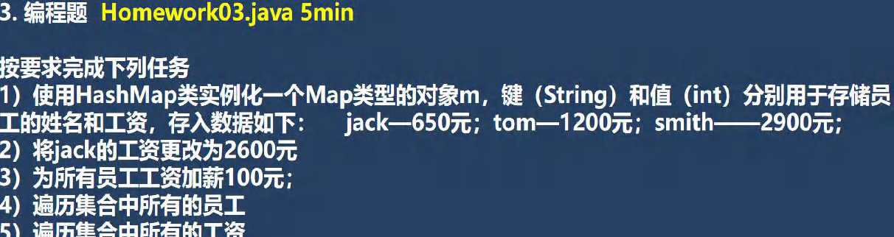

```java
package com.ArrayList_;

import java.util.HashMap;
import java.util.Iterator;
import java.util.Map;
import java.util.Set;

public class Homework03 {
    public static void main(String[] args) {
        Map m = new HashMap();
        m.put("jack",650);
        m.put("tom",1200);
        m.put("smith",2900);
        m.put("jack",2600);
        Set entrySet = m.entrySet();
        Iterator iter = entrySet.iterator();
        while (iter.hasNext()){
            Object entry = iter.next();
            Map.Entry e=(Map.Entry) entry;
            Object value = e.getValue();
            value=(int)value+100;
            e.setValue(value);
            System.out.println(e.getKey());
            System.out.println(e.getValue());
        }
    }
}
```

### 4-5


```java
这道题要求比较HashSet和TreeSet如何实现去重（即确保集合中不包含重复元素）。以下是基于题目要点的扩展解释，我会从基础概念讲起，逐步深入。

（1）HashSet的去重机制：基于hashCode()和equals()方法
​核心答案​：HashSet通过组合使用对象的hashCode()和equals()方法来实现去重。添加元素时，先计算哈希值定位存储位置，再使用equals方法比较是否重复。

​详细解题思路​：

​底层数据结构​：HashSet底层基于HashMap实现（HashMap使用数组+链表/红黑树存储键值对，但HashSet只使用键，值固定为一个虚拟对象）。这使它具有快速查找的特性。

​去重流程​（分步解释）：

​计算哈希值​：当调用hashSet.add(element)时，首先调用元素的hashCode()方法计算哈希值。哈希值是一个整数，用于确定元素在底层数组中的索引位置（通过哈希函数映射）。

​定位索引​：根据哈希值找到数组对应的索引（称为“桶”或“bucket”）。如果该位置为空（没有元素），则直接存入新元素。

​处理冲突​：如果该位置已有元素（哈希冲突），则使用equals()方法遍历比较新元素与现有元素：

如果equals()返回true，表示元素重复，不添加新元素。

如果equals()返回false，表示不重复，则将新元素添加到链表或红黑树的末尾（Java 8后，链表长度超过阈值会转为红黑树以提高性能）。

​关键方法的作用​：

hashCode()：用于快速定位，减少比较次数。理想情况下，不同对象应有不同哈希值，但实际可能冲突。

equals()：用于精确比较内容是否相同。必须保证：如果两个对象equals为true，则hashCode必须相同；但hashCode相同，equals不一定为true。

​示例帮助理解​：

java
// 假设有一个Person类，重写hashCode和equals
class Person {
    String name;
    // 重写hashCode和equals，基于name字段
    @Override
    public int hashCode() { return name != null ? name.hashCode() : 0; }
    @Override
    public boolean equals(Object obj) { /* 比较name */ }
}

HashSet<Person> set = new HashSet<>();
set.add(new Person("Alice")); // 添加成功，计算hashCode定位索引
set.add(new Person("Alice")); // 添加失败，因为hashCode相同且equals返回true
​举一反三​：如果未重写hashCode()和equals()，HashSet会使用Object类的默认实现（基于内存地址），可能导致重复元素被误加。因此，自定义类用作HashSet元素时，必须重写这两个方法。

（2）TreeSet的去重机制：基于Comparator或Comparable接口
​核心答案​：TreeSet通过比较机制实现去重。如果提供了Comparator对象，使用其compare方法；否则，依赖元素的Comparable接口的compareTo方法。如果比较返回0，视为重复元素，不添加。

​详细解题思路​：

​底层数据结构​：TreeSet底层基于TreeMap实现（红黑树结构），元素会自动排序，因此去重基于排序比较。

​去重流程​：

​判断比较器​：添加元素时（如treeSet.add(element)），TreeSet检查是否在构造时传入了Comparator对象。

如果传入了Comparator：使用comparator.compare(newElement, existingElement)比较新元素与现有元素。

如果未传入Comparator：要求元素必须实现Comparable接口，使用element.compareTo(existingElement)比较。

​比较结果处理​：

如果compare方法返回0，表示元素“相等”（去重依据），不添加新元素。

如果返回负数或正数，根据红黑树排序规则插入新位置。

​关键点​：

TreeSet的“去重”基于比较结果是否为0，而非equals方法（但默认情况下，compareTo应和equals逻辑一致）。

如果未提供Comparator且元素未实现Comparable，添加时会抛出ClassCastException（见第5题）。

​示例帮助理解​：

java
// 方式1：使用Comparator
TreeSet<String> set1 = new TreeSet<>( (a,b) -> a.compareTo(b) ); // 自定义比较器
set1.add("apple");
set1.add("apple"); // 添加失败，compare返回0

// 方式2：依赖Comparable（String已实现）
TreeSet<String> set2 = new TreeSet<>();
set2.add("banana");
set2.add("banana"); // 添加失败，compareTo返回0
​举一反三​：TreeSet不仅去重，还排序。如果去重逻辑需要自定义（如忽略大小写），可通过Comparator实现。注意：如果compare返回0但equals为false，可能导致集合行为不一致，因此建议保持比较逻辑与equals同步。

总结第4题
HashSet去重快，但不保证顺序；TreeSet去重同时排序，但性能稍低。选择取决于需求：如果需要快速访问且不关心顺序，用HashSet；如果需要有序遍历，用TreeSet。
```

```java
第5题：代码分析题（TreeSet添加Person对象是否会抛出异常）
这道题要求判断代码TreeSet treeSet = new TreeSet(); treeSet.add(new Person());是否会抛出异常，并从源码层面解释原因。

核心答案
​是否会抛出异常​：会抛出ClassCastException（类型转换异常）。

​异常发生时机​：在调用treeSet.add(new Person())时抛出。

详细解题思路
我将从源码角度逐步解释原因，包括TreeSet的add方法如何工作，以及为什么Person类会导致异常。假设Person是一个自定义类，未实现任何接口。

​代码分析​：

TreeSet treeSet = new TreeSet();：创建了一个空的TreeSet实例。由于未传入Comparator，TreeSet会依赖元素的自然排序（即要求元素实现Comparable接口）。

treeSet.add(new Person());：尝试添加一个Person对象。Person类如果没有实现Comparable接口，就会出问题。

​源码层面解释​（基于Java标准库源码，简化说明）：

TreeSet底层使用TreeMap来存储元素。add方法实际上调用TreeMap的put方法。

关键源码逻辑（简化版）：

java
// TreeSet的add方法内部
public boolean add(E e) {
    return map.put(e, PRESENT) == null; // PRESENT是虚拟值
}

// TreeMap的put方法内部
public V put(K key, V value) {
    // 首先检查比较器：如果未设置comparator，则尝试将key强制转换为Comparable
    Comparable<? super K> k = (Comparable<? super K>) key; // 这里可能抛出ClassCastException
    // 然后使用k.compareTo(...)进行比较和插入
}
​异常触发点​：当TreeMap的put方法执行时，如果未提供Comparator，它会尝试将添加的对象（这里是Person实例）强制转换为Comparable接口类型。由于Person类没有实现Comparable接口，这个强制转换失败，抛出ClassCastException。

​根本原因​：TreeSet需要比较元素来维护排序和去重。如果没有比较机制（无Comparator或元素不可比较），就无法工作。

​示例和变体帮助理解​：

​错误代码示例​：

java

class Person { } // 未实现Comparable
TreeSet treeSet = new TreeSet();
treeSet.add(new Person()); // 抛出ClassCastException
​修复方法​：

方法1：让Person实现Comparable接口。

java
class Person implements Comparable<Person> {
    @Override
    public int compareTo(Person other) { /* 实现比较逻辑，例如基于id */ }
}
方法2：创建TreeSet时传入Comparator。

java

TreeSet<Person> treeSet = new TreeSet<>( (p1, p2) -> p1.name.compareTo(p2.name) );
treeSet.add(new Person()); // 正常添加
​举一反三​：这种异常是“接口编程”和“动态绑定”的体现。TreeSet在运行时动态决定比较方式，如果元素不满足契约（未实现Comparable），就会失败。这强调了Java中“约定优于配置”的原则。

​小白友好提示​：可以把TreeSet想象成一个需要“排序规则”的智能书架。如果你不放书（元素）时告诉它如何排序（通过Comparator或Comparable），它就会“困惑”并报错。Person类就像一本没有标签的书，书架不知道如何摆放它。

总结第5题
代码会抛出ClassCastException，因为Person未实现Comparable接口，且未提供Comparator。从源码看，TreeSet在添加元素时强制转换失败。

预防措施：始终为TreeSet提供比较机制，要么元素实现Comparable，要么构造时传入Comparator。

如果您对这部分内容还有疑问，或想查看更多代码示例，请随时告诉我！我可以进一步细化解释。
```

### 6  ==JAVA集合的陷阱==


```java
步骤1: 创建HashSet和添加初始对象（第1-4行）​​

​代码: HashSet set = new HashSet();等。

​功能: 创建一个空的HashSet集合，然后添加p1和p2。

​逻辑解释:

HashSet基于哈希表实现，它使用hashCode值快速定位元素存储的“桶”（类似书架上的格子）。添加元素时：

先调用对象的hashCode()方法计算哈希值（例如，p1的hashCode基于id=1001和name="AA"）。

根据哈希值找到对应的桶索引。

如果桶为空，直接存入；如果桶非空，用equals方法比较是否重复（重复则不添加）。

这里，p1和p2的id和name不同，所以hashCode不同，它们被存入不同的桶，添加成功。set初始包含两个元素。

​语法细节: HashSet是泛型集合，但这里使用了原始类型（未指定泛型），但不影响行为。add方法返回boolean（成功返回true）。

​小白提示: 想象set是一个书架，每本书（Person对象）有一个唯一编号（hashCode）。添加时，根据编号放书到对应格子。p1和p2编号不同，所以放在不同格子。

​步骤2: 修改p1的name字段（第5行）​​

​代码: p1.name = "CC";

​功能: 将p1对象的name从"AA"改为"CC"。

​逻辑解释:

p1是对象引用，set中存储的是p1的引用（即内存地址），而不是对象的副本。所以修改p1的name后，set中的p1对象也同步变化（现在name="CC"）。

但关键点：对象在set中的存储位置（桶索引）是基于添加时的hashCode计算的。修改p1的name后，p1的hashCode变了（从基于"AA"变为基于"CC"），但它在set中的位置没有变——它仍然在原始桶中（基于旧hashCode"AA"的桶）。

​陷阱: 这破坏了HashSet的不变性：如果对象在集合中被修改，导致hashCode变化，后续操作（如remove）可能无法正确定位对象。

​示例: 就像把一本书从书架格子里拿出来改了标题，但书架记录的位置还是旧标题的编号，导致以后查找时可能找错格子。

​步骤3: 尝试移除p1（第6行）​​

​代码: set.remove(p1);

​功能: 尝试从set中移除p1对象。

​逻辑解释:

remove方法的工作流程：

计算p1的当前hashCode（基于id=1001,name="CC"）。

根据新hashCode找到对应的桶（比如桶B）。

在桶B中使用equals方法比较是否有匹配对象。

问题：p1实际存储在旧桶中（基于添加时hashCode"AA"的桶，比如桶A）。但新hashCode"CC"可能对应不同的桶B。因此，remove在桶B中查找，找不到p1（因为p1在桶A），所以移除失败，返回false。

结果：p1仍然在set中，但它的name已是"CC"。

​语法细节: remove方法返回boolean表示是否成功。这里它返回false，但代码没检查。

​小白提示: 这就像根据新书名编号找书，但书还在老位置，所以找不到。HashSet设计假设对象hashCode不变，修改后就会出错。

​步骤4: 第一个输出（第7行）​​

​代码: System.out.println(set);

​输出: set包含p1和p2。p1的name是"CC"，p2的name是"BB"。所以输出类似[Person{id=1001, name='CC'}, Person{id=1002, name='BB'}]。

​原因: remove失败，set未变化。

​步骤5: 添加新Person(1001,"CC")（第8行）​​

​代码: set.add(new Person(1001,"CC"));

​功能: 添加一个新对象，其id和name与修改后的p1相同。

​逻辑解释:

add方法流程：

计算新对象的hashCode（基于id=1001,name="CC"），找到对应桶（比如桶B）。

在桶B中检查是否重复：桶B可能为空（因为p1在桶A），所以没有重复对象。

因此添加成功。

但问题：新对象和p1在逻辑上相等（id和name相同），但由于p1在桶A（基于旧hashCode），而新对象在桶B（基于新hashCode），HashSet认为它们不重复。这导致set中出现重复元素，违背了Set的去重原则。

​输出: 添加后，set有三个元素：p1(1001,"CC")、p2(1002,"BB")、新对象(1001,"CC")。

​步骤6: 第二个输出（第9行）​​

​代码: System.out.println(set);

​输出: set包含三个元素，包括两个“相等”的对象。输出类似[Person{id=1001, name='CC'}, Person{id=1002, name='BB'}, Person{id=1001, name='CC'}]。

​步骤7: 添加新Person(1001,"AA")（第10行）​​

​代码: set.add(new Person(1001,"AA"));

​功能: 添加另一个新对象，其id和name与原始p1（添加时）相同。

​逻辑解释:

add方法：

计算新对象的hashCode（基于id=1001,name="AA"），找到对应桶（桶A，即p1的原始桶）。

在桶A中，有p1对象（但p1的name现在是"CC"）。使用equals比较：新对象name="AA"，p1 name="CC"，所以不相等。

因此添加成功。

结果：set有四个元素，包括p1、p2、第一个新对象、和这个新对象。

​输出: 添加后，set有四个元素。

​步骤8: 第三个输出（第11行）​​

​代码: System.out.println(set);

​输出: set包含四个元素：p1(1001,"CC")、p2(1002,"BB")、第一个新对象(1001,"CC")、第二个新对象(1001,"AA")。输出类似[Person{id=1001, name='CC'}, Person{id=1002, name='BB'}, Person{id=1001, name='CC'}, Person{id=1001, name='AA'}]。

为什么输出会这样？关键陷阱分析
​核心问题: 当对象被添加到HashSet后，如果修改了影响hashCode的字段（如name），会导致对象存储位置（桶）与当前hashCode不一致。后续操作（如remove或add）可能无法正确工作，因为HashSet依赖hashCode定位桶。

​hashCode和equals的作用:

hashCode: 用于快速定位桶，理想情况下不同对象应有不同hashCode，但可能冲突。

equals: 用于精确比较对象内容。HashSet要求如果两个对象equals为true，则hashCode必须相同。

这里，修改p1后，hashCode变了，但对象在旧桶中，造成“错位”。

​陷阱总结: 永远不要修改已存储在HashSet（或HashMap键）中的对象的hashCode相关字段，否则集合状态会不一致。这是Java集合的常见陷阱。
```

```java
//举一反三：学习建议和变体示例
//为了帮助您更好地理解，这里有一些扩展内容：

//​正确做法: 如果需要修改Set中的对象，应先remove对象，修改后再add回去，确保hashCode一致。
set.remove(p1); // 先移除
p1.name = "CC"; // 修改
set.add(p1); // 再添加
```

# JAVA第15章随记_泛型

## **1. 为什么需要泛型？—— 从需求说起**

**需求：** 我们需要一个类，可以用来存放不同类别的奖品。奖品可能是`Integer`类型的现金，也可能是`String`类型的实物名称。

**传统方法的问题：**

如果不使用泛型，我们可能需要为每种数据类型都写一个几乎一模一样的类，代码冗余，难以维护。

```java
// 为整数奖品写一个类
class PrizeInteger {
    private Integer content; // 奖品内容
    // ... getter, setter, 构造方法
}

// 为字符串奖品再写一个类
class PrizeString {
    private String content; // 奖品内容
    // ... 同样的getter, setter, 构造方法再来一遍
}

public class Main {
    public static void main(String[] args) {
        PrizeInteger cashPrize = new PrizeInteger(1000);
        PrizeString goodsPrize = new PrizeString("iPhone");
        // 问题：如果想存Double类型的奖品，又得新建一个PrizeDouble类！
    }
}
```

**问题分析：**

- **代码冗余**：逻辑完全相同的类，仅仅因为字段类型不同，就要重复编写。
- **类型不安全**：如果我们用一个通用的`Object`类型来存储，取出时需要强制转换，很容易出错。

```java
class Prize {
    private Object content; // 用Object可以存任何东西

    public Object getContent() {
        return content;
    }
    public void setContent(Object content) {
        this.content = content;
    }
}

public class Main {
    public static void main(String[] args) {
        Prize prize = new Prize();
        prize.setContent("iPhone"); // 放入一个String

        // 程序员不小心以为里面是Integer，进行强制转换
        Integer money = (Integer) prize.getContent(); // 编译通过，但运行时会抛出ClassCastException!
    }
}
```

**结论：** 我们需要一种机制，既能让我们写一个通用的类，又能保证放入和取出类型的绝对安全。这就是泛型要解决的问题。

## **2. 泛型快速入门——用泛型解决问题**

泛型就像是一个**模板**或者**标签**。在定义类的时候，我们先不指定具体的类型，而是用一个占位符（比如`T`）来代替。等到真正创建这个类的对象时，再告诉编译器这个占位符`T`具体是什么类型。

```java
// 定义一个泛型类 Prize<T>
// T 就是类型参数，像个占位符
class Prize<T> { 
    private T content; // 奖品内容，类型由T决定

    public T getContent() {
        return content;
    }
    public void setContent(T content) {
        this.content = content;
    }
}

public class Main {
    public static void main(String[] args) {
        // 创建用于存放String的Prize对象
        Prize<String> goodsPrize = new Prize<>();
        goodsPrize.setContent("iPhone");
        String goods = goodsPrize.getContent(); // 直接得到String，无需强制转换！

        // 创建用于存放Integer的Prize对象
        Prize<Integer> cashPrize = new Prize<>();
        cashPrize.setContent(1000);
        int money = cashPrize.getContent(); // 直接得到Integer

        // 尝试错误操作：编译器直接报错，保证了类型安全！
        // goodsPrize.setContent(1000); // 错误！String类型的Prize不能放入Integer
    }
}
```

**泛型的好处：**

1. **代码复用**：一套代码，多种类型。`Prize<T>`一个类就解决了`PrizeInteger`, `PrizeString`, `PrizeDouble`等多个类的问题。
2. **类型安全**：编译器在编译阶段就能检查类型是否正确，将运行时错误`ClassCastException`提前到了编译期，大大提高了程序的健壮性。

## **3. 泛型的语法详解**

### **3.1 泛型的声明**

- **泛型类**：在类名后加`<类型参数>`

  ```java
  class ClassName<T> { ... } // T是Type的缩写，常用
  class ClassName<K, V> { ... } // K-Key, V-Value, 常用于键值对
  ```

- **泛型接口**：在接口名后加`<类型参数>`

  ```java
  interface InterfaceName<T> { ... }
  ```

- **泛型方法**：在方法返回值前加`<类型参数>`

  ```java
  public <E> void methodName(E e) { ... }
  ```

### **3.2 泛型的实例化**

在创建对象或调用方法时，用具体的类型（如`String`, `Integer`）替换掉类型参数。

```java
// 实例化泛型类
ArrayList<String> list = new ArrayList<String>();
// Java 7以后，后边的泛型可以省略，称为"钻石语法"
ArrayList<String> list = new ArrayList<>(); //老韩也是推荐这种写法

// 调用泛型方法（通常类型可自动推断，无需显式指定）
String middle = getMiddle("A", "B", "C"); // 编译器知道T是String
```

### **3.4 泛型使用的注意事项和细节**

1. **类型参数只能是引用类型**，不能是基本数据类型（如`int`, `double`）。

   ```java
   // 错误！
   // ArrayList<int> list = new ArrayList<>();
   // 正确！使用基本类型的包装类
   ArrayList<Integer> list = new ArrayList<>();
   ```

2. ==**泛型类型在逻辑上可看作是多个不同的类型**，但实际上**是相同类型**。这是由于Java泛型的**类型擦除**机制==。

   ```java
   ArrayList<String> list1 = new ArrayList<>();
   ArrayList<Integer> list2 = new ArrayList<>();
   // 编译后，两者都会被擦除成原始的ArrayList类型
   System.out.println(list1.getClass() == list2.getClass()); // 输出 true
   ```

3. **类型擦除（Type Erasure）**：这是Java泛型的实现方式。**泛型信息只存在于代码编译阶段**，在编译生成的字节码(.class文件)中，不包含泛型的类型信息。所有类型参数都会被替换为它们的**原始类型**（通常是`Object`），并在必要时插入强制类型转换。

   ```java
   // 你写的代码
   Prize<String> prize = new Prize<>();
   String content = prize.getContent();
   
   // 编译后（概念上等价于）
   Prize<T> prize = new Prize(); // T被擦除为Object
   Object contentObj = prize.getContent();
   String content = (String) contentObj; // 编译器自动插入的强制转换
   ```

   **类型擦除带来的限制：**

   - 不能实例化类型参数：`new T()`是错误的。//因为在new的时候不能确定T的类型-》就无法在内存开辟空间
   - 不能对泛型类型使用`instanceof`：`if (obj instanceof ArrayList<String>)`是错误的。

4. static方法和static属性不能使用泛型 

   ​	static是在类加载时同时加载的（这时候对象还没创建），而泛型是在对象创建时定义的，就是你在静态方法中使用一个没有定义的类型那jvm就懵逼了。

## 4.泛型的练习题


```java
//main
package com.Generic_;

import java.util.ArrayList;
import java.util.Comparator;

public class Exercise {
    public static void main(String[] args) {
        ArrayList<Employee> employees = new ArrayList<>();
        employees.add(new Employee("tom", 5000, new MyDate(2002, 12, 10)));
        employees.add(new Employee("tom", 1000, new MyDate(2002, 12, 13)));
        employees.add(new Employee("tom", 50000, new MyDate(2002, 12, 14)));
        System.out.println(employees);
        System.out.println("========");
        //先判断name
        employees.sort(new Comparator<Employee>() {
            @Override
            public int compare(Employee o1, Employee o2) {
                int i = o1.getName().compareTo(o2.getName());
                if(i!=0){
                    return i;
                }
                return o1.getBirthday().compareTo(o2.getBirthday());
            }
        });
        //遍历结果
        System.out.println(employees);
    }
}
```

```java
package com.Generic_;

public class MyDate implements Comparable<MyDate>{
    private int year;
    private int month;
    private int day;

    public MyDate(int year, int month, int day) {
        this.year = year;
        this.month = month;
        this.day = day;
    }

    @Override
    public int compareTo(MyDate o) {
        //判断年-月-日
        return year-o.getYear()==0?(month-o.getMonth()==0?(day-o.getDay()):month-o.getMonth()):year-o.getYear();
    }

    @Override
    public String toString() {
        return "MyDate{" +
                "year=" + year +
                ", month=" + month +
                ", day=" + day +
                '}';
    }

    public int getYear() {
        return year;
    }

    public void setYear(int year) {
        this.year = year;
    }

    public int getMonth() {
        return month;
    }

    public void setMonth(int month) {
        this.month = month;
    }

    public int getDay() {
        return day;
    }

    public void setDay(int day) {
        this.day = day;
    }
}

```

```java
package com.Generic_;

public class Employee {
    private String name;
    private int sal;
    private MyDate birthday;

    public Employee(String name, int sal, MyDate birthday) {
        this.name = name;
        this.sal = sal;
        this.birthday = birthday;
    }

    public String getName() {
        return name;
    }

    public void setName(String name) {
        this.name = name;
    }

    public int getSal() {
        return sal;
    }

    public void setSal(int sal) {
        this.sal = sal;
    }

    public MyDate getBirthday() {
        return birthday;
    }

    public void setBirthday(MyDate birthday) {
        this.birthday = birthday;
    }

    @Override
    public String toString() {
        return "Employee{" +
                "name='" + name + '\'' +
                ", sal=" + sal +
                ", birthday=" + birthday +
                '}';
    }
}

```

## **5. 自定义泛型**

### **5.1 自定义泛型类**

```java
// T 是类型参数，在实例化时确定
public class MyGenericClass<T> {
    private T field;

    public void setField(T value) {
        this.field = value;
    }
    public T getField() {
        return field;
    }

    // 普通方法，使用类定义的泛型T
    public void showType() {
        System.out.println("T的实际类型是: " + field.getClass().getName());
    }
}

// 使用
MyGenericClass<Integer> intObj = new MyGenericClass<>();
intObj.setField(123);
intObj.showType(); // 输出: T的实际类型是: java.lang.Integer
```

### **5.2 自定义泛型接口**

```java
// 泛型接口
public interface MyGenerator<T> {
    T generate();
}

// 实现方式1：实现类也声明为泛型类
public class FruitGenerator<T> implements MyGenerator<T> {
    @Override
    public T generate() {
        // ... 实现逻辑
        return null;
    }
}
// 实现方式2：实现类时直接指定具体类型
public class StringGenerator implements MyGenerator<String> {
    @Override
    public String generate() {
        return "Generated String";
    }
}
```

### **5.3 自定义泛型方法**

泛型方法可以独立于类而存在。即使所在的类不是泛型类，方法也可以是泛型的。

```java
public class Utility {
    // 这是一个泛型方法。<E>是类型参数声明，E可用于参数和返回值类型
    public static <E> void printArray(E[] inputArray) {
        for (E element : inputArray) {
            System.out.print(element + " ");
        }
        System.out.println();
    }

    public static void main(String[] args) {
        Integer[] intArray = {1, 2, 3};
        String[] strArray = {"A", "B", "C"};
        printArray(intArray); // 编译器推断E为Integer
        printArray(strArray); // 编译器推断E为String
    }
}
```

------

### 6**. 泛型的继承和通配符**

当我们处理未知类型的泛型对象时，通配符 `?`就非常有用了。

1. **无界通配符 `<?>`**：表示可以接受任何类型的泛型对象。主要用于读取数据。

   ```java
   public static void printBoxContent(Prize<?> box) {
       Object obj = box.getContent(); // 只能以Object类型读取
       System.out.println(obj);
   }
   ```

2. **上界通配符 `<? extends T>`**：表示通配符 `?`代表的是 `T`类型或其**子类**。这使得你能够更安全地**读取**数据（生产者，Producer）。

   ```java
   // 假设有继承关系：Animal <- Cat, Animal <- Dog
   public static void processAnimals(Prize<? extends Animal> animalBox) {
       Animal animal = animalBox.getContent(); // 可以安全地读取为Animal
       // animalBox.setContent(new Cat()); // 错误！编译不通过（除了null）
   }
   ```

3. **下界通配符 `<? super T>`**：表示通配符 `?`代表的是 `T`类型或其**父类**。这使得你能够更安全地**写入**数据（消费者，Consumer）。

   ```java
   public static void addDogToBox(Prize<? super Dog> dogBox) {
       dogBox.setContent(new Dog()); // 可以安全地写入Dog及其子类
       // Dog dog = dogBox.getContent(); // 错误！读取出来的类型只能是Object
   }
   ```

**PECS 原则 (Producer-Extends, Consumer-Super)：**

- **Producer（生产者）**：如果你主要从泛型对象中**获取**数据，使用 `<? extends T>`。
- **Consumer（消费者）**：如果你主要向泛型对象中**放入**数据，使用 `<? super T>`。

------

## **6. 本章总结与作业**

**核心思想：** 泛型通过**参数化类型**，实现了代码的复用和类型安全。

**关键概念：**

- **泛型类/接口/方法**：如何声明和使用。
- **类型擦除**：理解泛型的底层机制和由此带来的限制。
- **通配符**：`?`, `? extends T`, `? super T`的区别和应用场景（PECS原则）。

**实践建议：**

- 多看Java集合框架（如`ArrayList<String>`）的源码，它是泛型的最佳实践。
- 尝试用泛型重构你之前写过的一些重复代码。

**举一反三：**

你可以用泛型的思想去设计一个`DataBase<T>`类，它可以连接并操作不同类型的数据库（`MySQL`, `Oracle`等），而核心的业务逻辑代码只需要写一份。

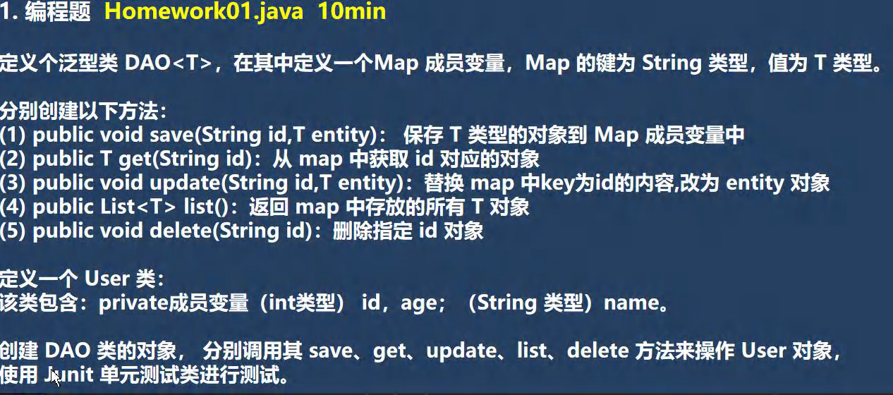

```java
package com.Generic_;

import java.util.ArrayList;
import java.util.HashMap;
import java.util.List;
import java.util.Map;

public class Homework {
    public static void main(String[] args) {
        DAO<User> objectDAO = new DAO<>();
        objectDAO.save("10",new User(10,5,"jack"));
        objectDAO.save("11",new User(11,6,"tom"));
        objectDAO.save("12",new User(12,7,"butter"));
        System.out.println(objectDAO);
        System.out.println(objectDAO.get("10"));
        objectDAO.update("10",new User(10,10,"king"));
        System.out.println(objectDAO);
        System.out.println(objectDAO.list());
        objectDAO.delete("10");
        System.out.println(objectDAO);
    }
}
class DAO<T>{
    private Map<String,T> map=new HashMap<>();
    public void save(String id,T entity){
        map.put(id,entity);
    }
    public T get(String id){
        return map.get(id);
    }
    public void update(String id,T entity){
        map.put(id,entity);
    }
    //任务 返回map中存放的所有T对象
    public List<T> list(){
        //遍历出map即可
        return new ArrayList<>(map.values());
    }
    //任务 删除指定id对象
    public void delete(String id){
        map.remove(id);
    }

    @Override
    public String toString() {
        return "DAO{" +
                "map=" + map +
                '}';
    }
}
class User{
    private int id;
    private int age;
    private String name;

    public User(int id, int age, String name) {
        this.id = id;
        this.age = age;
        this.name = name;
    }

    @Override
    public String toString() {
        return "User{" +
                "id=" + id +
                ", age=" + age +
                ", name='" + name + '\'' +
                '}';
    }

    public int getId() {
        return id;
    }

    public void setId(int id) {
        this.id = id;
    }

    public int getAge() {
        return age;
    }

    public void setAge(int age) {
        this.age = age;
    }

    public String getName() {
        return name;
    }

    public void setName(String name) {
        this.name = name;
    }
}
```


## 7.JUnit

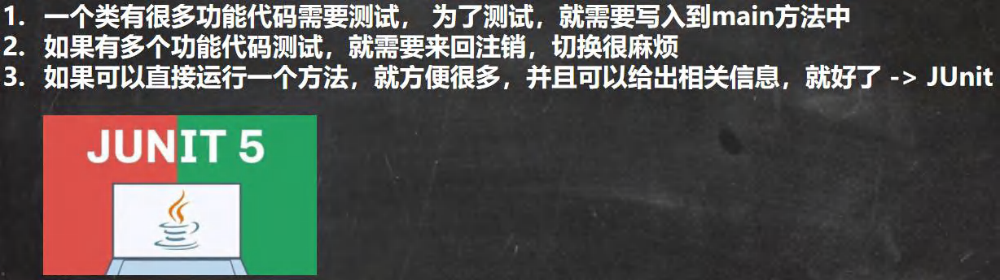


# JAVA第16章随记_Stream流

## 1.1 体验Stream流【理解】

- 案例需求

  按照下面的要求完成集合的创建和遍历

  - 创建一个集合，存储多个字符串元素
  - 把集合中所有以"张"开头的元素存储到一个新的集合
  - 把"张"开头的集合中的长度为3的元素存储到一个新的集合
  - 遍历上一步得到的集合

- 原始方式示例代码

  ```java
  public class MyStream1 {
      public static void main(String[] args) {
          //集合的批量添加
          ArrayList<String> list1 = new ArrayList<>(List.of("张三丰","张无忌","张翠山","王二麻子","张良","谢广坤"));
          //list.add()
  
          //遍历list1把以张开头的元素添加到list2中。
          ArrayList<String> list2 = new ArrayList<>();
          for (String s : list1) {
              if(s.startsWith("张")){
                  list2.add(s);
              }
          }
          //遍历list2集合，把其中长度为3的元素，再添加到list3中。
          ArrayList<String> list3 = new ArrayList<>();
          for (String s : list2) {
              if(s.length() == 3){
                  list3.add(s);
              }
          }
          for (String s : list3) {
              System.out.println(s);
          }      
      }
  }
  ```

- 使用Stream流示例代码

  ```java
  public class StreamDemo {
      public static void main(String[] args) {
          //集合的批量添加
          ArrayList<String> list1 = new ArrayList<>(List.of("张三丰","张无忌","张翠山","王二麻子","张良","谢广坤"));
  
          //Stream流
          list1.stream().filter(s->s.startsWith("张"))
                  .filter(s->s.length() == 3)
                  .forEach(s-> System.out.println(s));
      }
  }
  ```

- Stream流的好处

  - 直接阅读代码的字面意思即可完美展示无关逻辑方式的语义：获取流、过滤姓张、过滤长度为3、逐一打印
  - Stream流把真正的函数式编程风格引入到Java中
  - 代码简洁

## 1.2 Stream流的常见生成方式【应用】

- Stream流的思想

  

- Stream流的三类方法

  - 获取Stream流
    - 创建一条流水线,并把数据放到流水线上准备进行操作
  - 中间方法
    - 流水线上的操作
    - 一次操作完毕之后,还可以继续进行其他操作
  - 终结方法
    - 一个Stream流只能有一个终结方法
    - 是流水线上的最后一个操作

- 生成Stream流的方式

  - ==Collection体系集合==

    使用默认方法stream()生成流， default Stream<E> stream()

  - ==Map体系集合==

    把Map转成Set集合，间接的生成流(不能直接处理双列集合)

  - ==数组==

    通过Arrays中的静态方法stream生成流

  - ==同种数据类型的多个数据==

    通过Stream接口的静态方法of(T... values)生成流

- 代码演示

  ```java
  public class StreamDemo {
      public static void main(String[] args) {
          //Collection体系的集合可以使用默认方法stream()生成流
          List<String> list = new ArrayList<String>();
          Stream<String> listStream = list.stream();
  
          Set<String> set = new HashSet<String>();
          Stream<String> setStream = set.stream();
  
          //Map体系的集合间接的生成流  将Map转换成keySet()或者entrySet()然后进行stream()操作
          Map<String,Integer> map = new HashMap<String, Integer>();
          Stream<String> keyStream = map.keySet().stream();
          Stream<Integer> valueStream = map.values().stream();
          Stream<Map.Entry<String, Integer>> entryStream = map.entrySet().stream();
  
          //数组可以通过Arrays中的静态方法stream生成流 即Arrays.stream()
          String[] strArray = {"hello","world","java"};
          Stream<String> strArrayStream = Arrays.stream(strArray);
        
        	//同种数据类型的多个数据可以通过Stream接口的静态方法of(T... values)生成流
          //注意  Stream.of()处理数组时,只能处理引用数据类型[String,Integer],不能处理基本数据类型
          Stream<String> strArrayStream2 = Stream.of("hello", "world", "java");
          Stream<Integer> intStream = Stream.of(10, 20, 30);
      }
  }
  ```

## 1.3Stream流中间操作方法【应用】

- 概念

  中间操作的意思是,执行完此方法之后,Stream流依然可以继续执行其他操作

- 常见方法

  | 方法名                                          | 说明                                                       |
  | ----------------------------------------------- | ---------------------------------------------------------- |
  | Stream<T> filter(Predicate predicate)           | 用于对流中的数据进行过滤                                   |
  | Stream<T> limit(long maxSize)                   | 返回此流中的元素组成的流，截取前指定参数个数的数据         |
  | Stream<T> skip(long n)                          | 跳过指定参数个数的数据，返回由该流的剩余元素组成的流       |
  | static <T> Stream<T> concat(Stream a, Stream b) | 合并a和b两个流为一个流                                     |
  | Stream<T> distinct()                            | 返回由该流的不同元素（根据Object.equals(Object) ）组成的流 |

- filter代码演示

  ```java
  public class MyStream3 {
      public static void main(String[] args) {
  //        Stream<T> filter(Predicate predicate)：过滤
  //        Predicate接口中的方法	boolean test(T t)：对给定的参数进行判断，返回一个布尔值
  
          ArrayList<String> list = new ArrayList<>();
          list.add("张三丰");
          list.add("张无忌");
          list.add("张翠山");
          list.add("王二麻子");
          list.add("张良");
          list.add("谢广坤");
  
          //filter方法获取流中的 每一个数据.
          //而test方法中的s,就依次表示流中的每一个数据.
          //我们只要在test方法中对s进行判断就可以了.
          //如果判断的结果为true,则当前的数据留下
          //如果判断的结果为false,则当前数据就不要.
  //        list.stream().filter(
  //                new Predicate<String>() {
  //                    @Override
  //                    public boolean test(String s) {
  //                        boolean result = s.startsWith("张");
  //                        return result;
  //                    }
  //                }
  //        ).forEach(s-> System.out.println(s));
  
          //因为Predicate接口中只有一个抽象方法test
          //所以我们可以使用lambda表达式来简化
  //        list.stream().filter(
  //                (String s)->{
  //                    boolean result = s.startsWith("张");
  //                        return result;
  //                }
  //        ).forEach(s-> System.out.println(s));
  
          list.stream().filter(s ->s.startsWith("张")).forEach(s-> System.out.println(s));
  
      }
  }
  ```

- limit&skip代码演示

  ```java
  public class StreamDemo02 {
      public static void main(String[] args) {
          //创建一个集合，存储多个字符串元素
          ArrayList<String> list = new ArrayList<String>();
  
          list.add("林青霞");
          list.add("张曼玉");
          list.add("王祖贤");
          list.add("柳岩");
          list.add("张敏");
          list.add("张无忌");
  
          //需求1：取前3个数据在控制台输出
          list.stream().limit(3).forEach(s-> System.out.println(s));
          System.out.println("--------");
  
          //需求2：跳过3个元素，把剩下的元素在控制台输出
          list.stream().skip(3).forEach(s-> System.out.println(s));
          System.out.println("--------");
  
          //需求3：跳过2个元素，把剩下的元素中前2个在控制台输出
          list.stream().skip(2).limit(2).forEach(s-> System.out.println(s));
      }
  }
  ```

- concat&distinct代码演示

  ```java
  public class StreamDemo03 {
      public static void main(String[] args) {
          //创建一个集合，存储多个字符串元素
          ArrayList<String> list = new ArrayList<String>();
  
          list.add("林青霞");
          list.add("张曼玉");
          list.add("王祖贤");
          list.add("柳岩");
          list.add("张敏");
          list.add("张无忌");
  
          //需求1：取前4个数据组成一个流
          Stream<String> s1 = list.stream().limit(4);
  
          //需求2：跳过2个数据组成一个流
          Stream<String> s2 = list.stream().skip(2);
  
          //需求3：合并需求1和需求2得到的流，并把结果在控制台输出
  //        Stream.concat(s1,s2).forEach(s-> System.out.println(s));
  
          //需求4：合并需求1和需求2得到的流，并把结果在控制台输出，要求字符串元素不能重复
          Stream.concat(s1,s2).distinct().forEach(s-> System.out.println(s));
      }
  }
  ```

## 1.4Stream流终结操作方法【应用】

- 概念

  终结操作的意思是,执行完此方法之后,Stream流将不能再执行其他操作

- 常见方法

  | 方法名                        | 说明                     |
  | ----------------------------- | ------------------------ |
  | void forEach(Consumer action) | 对此流的每个元素执行操作 |
  | long count()                  | 返回此流中的元素数       |
  | toArray()                     | 返回数组                 |

- 代码演示

  ```java
  public class MyStream5 {
      public static void main(String[] args) {
          ArrayList<String> list = new ArrayList<>();
          list.add("张三丰");
          list.add("张无忌");
          list.add("张翠山");
          list.add("王二麻子");
          list.add("张良");
          list.add("谢广坤");
  
          //method1(list);
          
  //        long count()：返回此流中的元素数
          long count = list.stream().count();
          System.out.println(count);
      }
  
      private static void method1(ArrayList<String> list) {
          //  void forEach(Consumer action)：对此流的每个元素执行操作
          //  Consumer接口中的方法void accept(T t)：对给定的参数执行此操作
          //在forEach方法的底层,会循环获取到流中的每一个数据.
          //并循环调用accept方法,并把每一个数据传递给accept方法
          //s就依次表示了流中的每一个数据.
          //所以,我们只要在accept方法中,写上处理的业务逻辑就可以了.
          list.stream().forEach(
                  new Consumer<String>() {
                      @Override
                      public void accept(String s) {
                          System.out.println(s);
                      }
                  }
          );
        
          System.out.println("====================");
          //lambda表达式的简化格式
          //是因为Consumer接口中,只有一个accept方法
          list.stream().forEach(
                  (String s)->{
                      System.out.println(s);
                  }
          );
          System.out.println("====================");
          //lambda表达式还是可以进一步简化的.
          list.stream().forEach(s->System.out.println(s));
      }
  }
  ```

`toArray`方法有两种重载形式：

1. **`Object[] toArray()`**

   这是最简单直接的形式。它返回一个包含流中所有元素的 **`Object[]`** 数组。由于泛型擦除机制，运行时无法确定流中元素的具体类型，所以只能返回`Object[]`。如果你需要操作具体类型的数组，需要进行强制类型转换，但这可能引发`ClassCastException`。

   ```java
   Stream<String> stringStream = Stream.of("A", "B", "C");
   Object[] objectArray = stringStream.toArray(); // 返回 Object[]
   // String[] strArray = (String[]) objectArray; // 这样做是不安全的，可能抛出异常[1](@ref)
   ```

2. **`<A> A[] toArray(IntFunction<A[]> generator)`**

   这是**更推荐使用**的方法，因为它可以返回你指定的任意类型的数组。它接收一个`IntFunction<A[]>`作为参数（通常简写为**方法引用** `String[]::new`），这个函数的作用是根据流的大小（int类型）来创建一个指定类型的新数组。

   ```java
   Stream<String> stringStream = Stream.of("A", "B", "C");
   String[] stringArray = stringStream.toArray(String[]::new); // 返回 String[]
   
   Stream<Integer> integerStream = Stream.of(1, 2, 3);
   Integer[] integerArray = integerStream.toArray(Integer[]::new); // 返回 Integer[]
   ```

   这里的 `String[]::new`等价于 Lambda 表达式 `size -> new String[size]`。

## 1.5Stream流的收集操作【应用】

- 概念

  对数据使用Stream流的方式操作完毕后,可以把流中的数据收集到集合中

- 常用方法

  | 方法名                         | 说明               |
  | ------------------------------ | ------------------ |
  | R collect(Collector collector) | 把结果收集到集合中 |

- 工具类Collectors提供了具体的收集方式

  | 方法名                                                       | 说明                   |
  | ------------------------------------------------------------ | ---------------------- |
  | public static <T> Collector toList()                         | 把元素收集到List集合中 |
  | public static <T> Collector toSet()                          | 把元素收集到Set集合中  |
  | public static  Collector toMap(Function keyMapper,Function valueMapper) | 把元素收集到Map集合中  |

- 代码演示

  ```java
  // toList和toSet方法演示 
  public class MyStream7 {
      public static void main(String[] args) {
          ArrayList<Integer> list1 = new ArrayList<>();
          for (int i = 1; i <= 10; i++) {
              list1.add(i);
          }
  
          list1.add(10);
          list1.add(10);
          list1.add(10);
          list1.add(10);
          list1.add(10);
  
          //filter负责过滤数据的.
          //collect负责收集数据.
                  //获取流中剩余的数据,但是他不负责创建容器,也不负责把数据添加到容器中.
          //Collectors.toList() : 在底层会创建一个List集合.并把所有的数据添加到List集合中.
          List<Integer> list = list1.stream().filter(number -> number % 2 == 0)
                  .collect(Collectors.toList());
  
          System.out.println(list);
  
      Set<Integer> set = list1.stream().filter(number -> number % 2 == 0)
              .collect(Collectors.toSet());
      System.out.println(set);
  }
  }
  /**
  Stream流的收集方法 toMap方法演示
  创建一个ArrayList集合，并添加以下字符串。字符串中前面是姓名，后面是年龄
  "zhangsan,23"
  "lisi,24"
  "wangwu,25"
  保留年龄大于等于24岁的人，并将结果收集到Map集合中，姓名为键，年龄为值
  */
  public class MyStream8 {
  	public static void main(String[] args) {
        	ArrayList<String> list = new ArrayList<>();
          list.add("zhangsan,23");
          list.add("lisi,24");
          list.add("wangwu,25");
  
          Map<String, Integer> map = list.stream().filter(
                  s -> {
                      String[] split = s.split(",");
                      int age = Integer.parseInt(split[1]);
                      return age >= 24;
                  }
  
           //   collect方法只能获取到流中剩余的每一个数据.
           //在底层不能创建容器,也不能把数据添加到容器当中
  
           //Collectors.toMap 创建一个map集合并将数据添加到集合当中
  
            // s 依次表示流中的每一个数据
  
            //第一个lambda表达式就是如何获取到Map中的键
            //第二个lambda表达式就是如何获取Map中的值
          ).collect(Collectors.toMap(
                  s -> s.split(",")[0],
                  s -> Integer.parseInt(s.split(",")[1]) ));
          System.out.println(map);
  	}
  }
  ```

## 1.6Stream流综合练习【应用】


```java
package com.stream_;

import java.util.ArrayList;
import java.util.List;
import java.util.function.Predicate;
import java.util.stream.Collectors;

public class test01 {
    public static void main(String[] args) {
        ArrayList<Integer> arrs = new ArrayList<>();
        arrs.add(1);
        arrs.add(2);
        arrs.add(3);
        arrs.add(4);
        arrs.add(5);
        arrs.add(6);
        arrs.add(7);
        arrs.add(8);
        arrs.add(9);
        arrs.add(10);
        List<Integer> collect = arrs.stream().filter(new Predicate<Integer>() {
            @Override
            public boolean test(Integer integer) {
                return integer % 2 == 0;
            }
        }).collect(Collectors.toList());
        System.out.println(collect);
    }
}

```


```java
package com.stream_;

import java.util.ArrayList;
import java.util.Map;
import java.util.function.Function;
import java.util.function.Predicate;
import java.util.stream.Collectors;

public class test02 {
    public static void main(String[] args) {
        ArrayList<String> arrs = new ArrayList<>();
        arrs.add("zhangsan,23");
        arrs.add("lisi,24");
        arrs.add("wangwu,25");
        Map<String, String> collect = arrs.stream().filter(new Predicate<String>() {
            @Override
            public boolean test(String s) {
                return Integer.parseInt(s.split(",")[1]) >= 24;
            }
        }).collect(Collectors.toMap(new Function<String, String>() {
            @Override
            public String apply(String s) {
                return s.split(",")[0];
            }
        }, new Function<String, String>() {
            @Override
            public String apply(String s) {
                return s.split(",")[1];
            }
        }));
        System.out.println(collect);
    }
}

```

- 案例需求

  现在有两个ArrayList集合，分别存储6名男演员名称和6名女演员名称，要求完成如下的操作

  - 男演员只要名字为3个字的前三人
  - 女演员只要姓林的，并且不要第一个
  - 把过滤后的男演员姓名和女演员姓名合并到一起
  - 把上一步操作后的元素作为构造方法的参数创建演员对象,遍历数据

  演员类Actor已经提供，里面有一个成员变量，一个带参构造方法，以及成员变量对应的get/set方法

- 代码实现

  演员类

  ```java
  public class Actor {
      private String name;
  
      public Actor(String name) {
          this.name = name;
      }
  
      public String getName() {
          return name;
      }
  
      public void setName(String name) {
          this.name = name;
      }
  }
  ```

  测试类

  ```java
  public class StreamTest {
      public static void main(String[] args) {
          //创建集合
          ArrayList<String> manList = new ArrayList<String>();
          manList.add("周润发");
          manList.add("成龙");
          manList.add("刘德华");
          manList.add("吴京");
          manList.add("周星驰");
          manList.add("李连杰");
    
          ArrayList<String> womanList = new ArrayList<String>();
          womanList.add("林心如");
          womanList.add("张曼玉");
          womanList.add("林青霞");
          womanList.add("柳岩");
          womanList.add("林志玲");
          womanList.add("王祖贤");
    
          //男演员只要名字为3个字的前三人
          Stream<String> manStream = manList.stream().filter(s -> s.length() == 3).limit(3);
    
          //女演员只要姓林的，并且不要第一个
          Stream<String> womanStream = womanList.stream().filter(s -> s.startsWith("林")).skip(1);
    
          //把过滤后的男演员姓名和女演员姓名合并到一起
          Stream<String> stream = Stream.concat(manStream, womanStream);
    
        	// 将流中的数据封装成Actor对象之后打印
        	stream.forEach(name -> {
              Actor actor = new Actor(name);
              System.out.println(actor);
          }); 
      }
  }
  ```

## 1.7方法引用

### 1体验方法引用【理解】

- 方法引用的出现原因

  在使用Lambda表达式的时候，我们实际上传递进去的代码就是一种解决方案：拿参数做操作

  那么考虑一种情况：如果我们在Lambda中所指定的操作方案，已经有地方存在相同方案，那是否还有必要再写重复逻辑呢？答案肯定是没有必要

  那我们又是如何使用已经存在的方案的呢？

  这就是我们要讲解的方法引用，我们是通过方法引用来使用已经存在的方案

- 代码演示

  ```java
  public interface Printable {
      void printString(String s);
  }
  
  public class PrintableDemo {
      public static void main(String[] args) {
          //在主方法中调用usePrintable方法
  //        usePrintable((String s) -> {
  //            System.out.println(s);
  //        });
  	    //Lambda简化写法
          usePrintable(s -> System.out.println(s));
  
          //方法引用
          usePrintable(System.out::println);
  
      }
  
      private static void usePrintable(Printable p) {
          p.printString("爱生活爱Java");
      }
  }
  
  ```

### 2方法引用符【理解】

- 方法引用符

  ::  该符号为引用运算符，而它所在的表达式被称为方法引用

- 推导与省略

  - 如果使用Lambda，那么根据“可推导就是可省略”的原则，无需指定参数类型，也无需指定的重载形式，它们都将被自动推导
  - 如果使用方法引用，也是同样可以根据上下文进行推导
  - 方法引用是Lambda的孪生兄弟

### 3引用类方法【应用】

​	引用类方法，其实就是引用类的静态方法

- 格式

  类名::静态方法

- 范例

  Integer::parseInt

  Integer类的方法：public static int parseInt(String s) 将此String转换为int类型数据

- 练习描述

  - 定义一个接口(Converter)，里面定义一个抽象方法 int convert(String s);
  - 定义一个测试类(ConverterDemo)，在测试类中提供两个方法
    - 一个方法是：useConverter(Converter c)
    - 一个方法是主方法，在主方法中调用useConverter方法

- 代码演示

  ```java
  public interface Converter {
      int convert(String s);
  }
  
  public class ConverterDemo {
      public static void main(String[] args) {
  
  		//Lambda写法
          useConverter(s -> Integer.parseInt(s));
  
          //引用类方法
          useConverter(Integer::parseInt);
  
      }
  
      private static void useConverter(Converter c) {
          int number = c.convert("666");
          System.out.println(number);
      }
  }
  ```

- 使用说明

  Lambda表达式被类方法替代的时候，它的形式参数全部传递给静态方法作为参数

# JAVA第17章随记_File

## 1 概述

`java.io.File` 类是文件和目录路径名的抽象表示，主要用于文件和目录的创建、查找和删除等操作。

## 2 构造方法

- `public File(String pathname) ` ：通过将给定的**路径名字符串**转换为抽象路径名来创建新的 File实例。  
- `public File(String parent, String child) ` ：从**父路径名字符串和子路径名字符串**创建新的 File实例。
- `public File(File parent, String child)` ：从**父抽象路径名和子路径名字符串**创建新的 File实例。  
- 构造举例，代码如下：

```java
// 文件路径名
String pathname = "D:\\aaa.txt";
File file1 = new File(pathname); 

// 文件路径名
String pathname2 = "D:\\aaa\\bbb.txt";
File file2 = new File(pathname2); 

// 通过父路径和子路径字符串
 String parent = "d:\\aaa";
 String child = "bbb.txt";
 File file3 = new File(parent, child);

// 通过父级File对象和子路径字符串
File parentDir = new File("d:\\aaa");
String child = "bbb.txt";
File file4 = new File(parentDir, child);
```

> 小贴士：
>
> 1. 一个File对象代表硬盘中实际存在的一个文件或者目录。
> 2. 无论该路径下是否存在文件或者目录，都不影响File对象的创建。


## 3 常用方法

### 获取功能的方法

- `public String getAbsolutePath() ` ：返回此File的绝对路径名字符串。

- ` public String getPath() ` ：将此File转换为路径名字符串。 

- `public String getName()`  ：返回由此File表示的文件或目录的名称。  

- `public long length()`  ：返回由此File表示的文件的长度。 

  方法演示，代码如下：

  ```java
  public class FileGet {
      public static void main(String[] args) {
          File f = new File("d:/aaa/bbb.java");     
          System.out.println("文件绝对路径:"+f.getAbsolutePath());
          System.out.println("文件构造路径:"+f.getPath());
          System.out.println("文件名称:"+f.getName());
          System.out.println("文件长度:"+f.length()+"字节");
  
          File f2 = new File("d:/aaa");     
          System.out.println("目录绝对路径:"+f2.getAbsolutePath());
          System.out.println("目录构造路径:"+f2.getPath());
          System.out.println("目录名称:"+f2.getName());
          System.out.println("目录长度:"+f2.length());
      }
  }
  输出结果：
  文件绝对路径:d:\aaa\bbb.java
  文件构造路径:d:\aaa\bbb.java
  文件名称:bbb.java
  文件长度:636字节
  
  目录绝对路径:d:\aaa
  目录构造路径:d:\aaa
  目录名称:aaa
  目录长度:4096
  ```

> API中说明：length()，表示文件的长度。但是File对象表示目录，则返回值未指定。

### 绝对路径和相对路径

- **绝对路径**：从盘符开始的路径，这是一个完整的路径。
- **相对路径**：相对于项目目录的路径，这是一个便捷的路径，开发中经常使用。

```java
public class FilePath {
    public static void main(String[] args) {
      	// D盘下的bbb.java文件
        File f = new File("D:\\bbb.java");
        System.out.println(f.getAbsolutePath());
      	
		// 项目下的bbb.java文件
        File f2 = new File("bbb.java");
        System.out.println(f2.getAbsolutePath());
    }
}
输出结果：
D:\bbb.java
D:\idea_project_test4\bbb.java
```

### 判断功能的方法

- `public boolean exists()` ：此File表示的文件或目录是否实际存在。
- `public boolean isDirectory()` ：此File表示的是否为目录。
- `public boolean isFile()` ：此File表示的是否为文件。

方法演示，代码如下：

```java
public class FileIs {
    public static void main(String[] args) {
        File f = new File("d:\\aaa\\bbb.java");
        File f2 = new File("d:\\aaa");
      	// 判断是否存在
        System.out.println("d:\\aaa\\bbb.java 是否存在:"+f.exists());
        System.out.println("d:\\aaa 是否存在:"+f2.exists());
      	// 判断是文件还是目录
        System.out.println("d:\\aaa 文件?:"+f2.isFile());
        System.out.println("d:\\aaa 目录?:"+f2.isDirectory());
    }
}
输出结果：
d:\aaa\bbb.java 是否存在:true
d:\aaa 是否存在:true
d:\aaa 文件?:false
d:\aaa 目录?:true
```

### 创建删除功能的方法

- `public boolean createNewFile()` ：当且仅当具有该名称的文件尚不存在时，创建一个新的空文件。 
  - 要用try-catch试错

- `public boolean delete()` ：删除由此File表示的文件或目录。  
- `public boolean mkdir()` ：创建由此File表示的目录。
- `public boolean mkdirs()` ：创建由此File表示的目录，包括任何必需但不存在的父目录。

方法演示，代码如下：

```java
public class FileCreateDelete {
    public static void main(String[] args) throws IOException {
        // 文件的创建
        File f = new File("aaa.txt");
        System.out.println("是否存在:"+f.exists()); // false
        System.out.println("是否创建:"+f.createNewFile()); // true
        System.out.println("是否存在:"+f.exists()); // true
		
     	// 目录的创建
      	File f2= new File("newDir");	
        System.out.println("是否存在:"+f2.exists());// false
        System.out.println("是否创建:"+f2.mkdir());	// true
        System.out.println("是否存在:"+f2.exists());// true

		// 创建多级目录
      	File f3= new File("newDira\\newDirb");
        System.out.println(f3.mkdir());// false
        File f4= new File("newDira\\newDirb");
        System.out.println(f4.mkdirs());// true
      
      	// 文件的删除
       	System.out.println(f.delete());// true
      
      	// 目录的删除
        System.out.println(f2.delete());// true
        System.out.println(f4.delete());// false
    }
}
```

> API中说明：delete方法，如果此File表示目录，则目录必须为空才能删除。

## 4 目录的遍历

- `public String[] list()` ：返回一个String数组，表示该File目录中的所有子文件或目录。
- `public File[] listFiles()` ：返回一个File数组，表示该File目录中的所有的子文件或目录。  

```java
public class FileFor {
    public static void main(String[] args) {
        File dir = new File("d:\\java_code");
      
      	//获取当前目录下的文件以及文件夹的名称。
		String[] names = dir.list();
		for(String name : names){
			System.out.println(name);
		}
        //获取当前目录下的文件以及文件夹对象，只要拿到了文件对象，那么就可以获取更多信息
        File[] files = dir.listFiles();
        for (File file : files) {
            System.out.println(file);
        }
    }
}
```

> 小贴士：
>
> 调用listFiles方法的File对象，表示的必须是实际存在的目录，否则返回null，无法进行遍历。

## 5 综合练习

#### 练习1：创建文件夹

​	在当前模块下的aaa文件夹中创建一个a.txt文件

代码实现：

```java
package com.File_;

import java.io.File;

public class test01 {
    public static void main(String[] args) {
        File Fatherfile = new File("bbb");
        Fatherfile.mkdirs();
        File file = new File(Fatherfile, "a.txt");
        try {
            boolean newFile = file.createNewFile();
            System.out.println("文件创建操作返回值: " + newFile);

        } catch (Exception e) {
            System.out.println("捕获到异常: ");
            e.printStackTrace(); // 打印完整的异常堆栈，信息更详细
        }
    }
}


```

#### 练习2：查找文件（不考虑子文件夹）

​	定义一个方法找某一个文件夹中，是否有以avi结尾的电影（暂时不需要考虑子文件夹）

代码示例：

```java
public class Test2 {
    public static void main(String[] args) {
        /*需求：
             定义一个方法找某一个文件夹中，是否有以avi结尾的电影。
	        （暂时不需要考虑子文件夹）
        */

        File file = new File("D:\\aaa\\bbb");
        boolean b = haveAVI(file);
        System.out.println(b);
    }
    /*
    * 作用：用来找某一个文件夹中，是否有以avi结尾的电影
    * 形参：要查找的文件夹
    * 返回值：查找的结果  存在true  不存在false
    * */
    public static boolean haveAVI(File file){// D:\\aaa
        //1.进入aaa文件夹，而且要获取里面所有的内容
        File[] files = file.listFiles();
        //2.遍历数组获取里面的每一个元素
        for (File f : files) {
            //f：依次表示aaa文件夹里面每一个文件或者文件夹的路径
            if(f.isFile() && f.getName().endsWith(".avi")){
                return true;
            }
        }
        //3.如果循环结束之后还没有找到，直接返回false
        return false;
    }
}
```

### 练习3：（考虑子文件夹）

​	找到电脑中所有以avi结尾的电影。（需要考虑子文件夹）

代码示例：

```java
public class Test3 {
    public static void main(String[] args) {
        /* 需求：
        找到电脑中所有以avi结尾的电影。（需要考虑子文件夹）


        套路：
            1，进入文件夹
            2，遍历数组
            3，判断
            4，判断

        */

        findAVI();

    }

    public static void findAVI(){
        //获取本地所有的盘符
        File[] arr = File.listRoots();
        for (File f : arr) {
            findAVI(f);
        }
    }

    public static void findAVI(File src){//"C:\\
        //1.进入文件夹src
        File[] files = src.listFiles();
        //2.遍历数组,依次得到src里面每一个文件或者文件夹
        if(files != null){
            for (File file : files) {
                if(file.isFile()){
                    //3，判断，如果是文件，就可以执行题目的业务逻辑
                    String name = file.getName();
                    if(name.endsWith(".avi")){
                        System.out.println(file);
                    }
                }else{
                    //4，判断，如果是文件夹，就可以递归
                    //细节：再次调用本方法的时候，参数一定要是src的次一级路径
                    findAVI(file);
                }
            }
        }
    }
}
```

### 练习4：删除多级文件夹

需求： 如果我们要删除一个有内容的文件夹
	   1.先删除文件夹里面所有的内容
           2.再删除自己

代码示例：

```java
public class Test4 {
    public static void main(String[] args) {
        /*
           删除一个多级文件夹
           如果我们要删除一个有内容的文件夹
           1.先删除文件夹里面所有的内容
           2.再删除自己
        */

        File file = new File("D:\\aaa\\src");
        delete(file);

    }

    /*
    * 作用：删除src文件夹
    * 参数：要删除的文件夹
    * */
    public static void delete(File src){
        //1.先删除文件夹里面所有的内容
        //进入src
        File[] files = src.listFiles();
        //遍历
        for (File file : files) {
            //判断,如果是文件，删除
            if(file.isFile()){
                file.delete();
            }else {
                //判断,如果是文件夹，就递归
                delete(file);
            }
        }
        //2.再删除自己
        src.delete();
    }
}
```

### 练习5：统计大小

​	需求：统计一个文件夹的总大小

代码示例：

```java
public class Test5 {
    public static void main(String[] args) {
       /*需求：
            统计一个文件夹的总大小
      */


        File file = new File("D:\\aaa\\src");

        long len = getLen(file);
        System.out.println(len);//4919189
    }

    /*
    * 作用：
    *       统计一个文件夹的总大小
    * 参数：
    *       表示要统计的那个文件夹
    * 返回值：
    *       统计之后的结果
    *
    * 文件夹的总大小：
    *       说白了，文件夹里面所有文件的大小
    * */
    public static long getLen(File src){
        //1.定义变量进行累加
        long len = 0;
        //2.进入src文件夹
        File[] files = src.listFiles();
        //3.遍历数组
        for (File file : files) {
            //4.判断
            if(file.isFile()){
                //我们就把当前文件的大小累加到len当中
                len = len + file.length();
            }else{
                //判断，如果是文件夹就递归
                len = len + getLen(file);
            }
        }
        return len;
    }
}
```

### 练习6：统计文件个数

  需求：统计一个文件夹中每种文件的个数并打印。（考虑子文件夹）
            打印格式如下：
            txt:3个
            doc:4个
            jpg:6个

代码示例：

```java
public class Test6 {
    public static void main(String[] args) throws IOException {
        /*
            需求：统计一个文件夹中每种文件的个数并打印。（考虑子文件夹）
            打印格式如下：
            txt:3个
            doc:4个
            jpg:6个
        */
        File file = new File("D:\\aaa\\src");
        HashMap<String, Integer> hm = getCount(file);
        System.out.println(hm);
    }

    /*
    * 作用：
    *       统计一个文件夹中每种文件的个数
    * 参数：
    *       要统计的那个文件夹
    * 返回值：
    *       用来统计map集合
    *       键：后缀名 值：次数
    *
    *       a.txt
    *       a.a.txt
    *       aaa（不需要统计的）
    *
    *
    * */
    public static HashMap<String,Integer> getCount(File src){
        //1.定义集合用来统计
        HashMap<String,Integer> hm = new HashMap<>();
        //2.进入src文件夹
        File[] files = src.listFiles();
        //3.遍历数组
        for (File file : files) {
            //4.判断，如果是文件，统计
            if(file.isFile()){
                //a.txt
                String name = file.getName();
                String[] arr = name.split("\\.");
                if(arr.length >= 2){
                    String endName = arr[arr.length - 1];
                    if(hm.containsKey(endName)){
                        //存在
                        int count = hm.get(endName);
                        count++;
                        hm.put(endName,count);
                    }else{
                        //不存在
                        hm.put(endName,1);
                    }
                }
            }else{
                //5.判断，如果是文件夹，递归
                //sonMap里面是子文件中每一种文件的个数
                HashMap<String, Integer> sonMap = getCount(file);
                //hm:  txt=1  jpg=2  doc=3
                //sonMap: txt=3 jpg=1
                //遍历sonMap把里面的值累加到hm当中
                Set<Map.Entry<String, Integer>> entries = sonMap.entrySet();
                for (Map.Entry<String, Integer> entry : entries) {
                    String key = entry.getKey();
                    int value = entry.getValue();
                    if(hm.containsKey(key)){
                        //存在
                        int count = hm.get(key);
                        count = count + value;
                        hm.put(key,count);
                    }else{
                        //不存在
                        hm.put(key,value);
                    }
                }
            }
        }
        return hm;
    }
}
```


# JAVA第18章随记_IO流

## 1. IO概述

### 1.1 什么是IO

生活中，你肯定经历过这样的场景。当你编辑一个文本文件，忘记了`ctrl+s` ，可能文件就白白编辑了。当你电脑上插入一个U盘，可以把一个视频，拷贝到你的电脑硬盘里。那么数据都是在哪些设备上的呢？键盘、内存、硬盘、外接设备等等。

我们把这种数据的传输，可以看做是一种数据的流动，按照流动的方向，以内存为基准，分为`输入input` 和`输出output` ，即流向内存是输入流，流出内存的输出流。

Java中I/O操作主要是指使用`java.io`包下的内容，进行输入、输出操作。**输入**也叫做**读取**数据，**输出**也叫做作**写出**数据。

### 1.2 IO的分类

根据数据的流向分为：**输入流**和**输出流**。

* **输入流** ：把数据从`其他设备`上读取到`内存（程序）`中的流。 
* **输出流** ：把数据从`内存（程序）` 中写出到`其他设备`上的流。

格局数据的类型分为：**字节流**和**字符流**。

* **字节流** ：以字节为单位，读写数据的流。
* **字符流** ：以字符为单位，读写数据的流。

### 1.3 IO的流向说明图解


### 1.4 顶级父类们

|            |           **输入流**            |              输出流              |
| :--------: | :-----------------------------: | :------------------------------: |
| **字节流** | 字节输入流<br />**InputStream** | 字节输出流<br />**OutputStream** |
| **字符流** |   字符输入流<br />**Reader**    |    字符输出流<br />**Writer**    |

## 2. 字节流

### 2.1 一切皆为字节

一切文件数据(文本、图片、视频等)在存储时，都是以二进制数字的形式保存，都一个一个的字节，那么传输时一样如此。所以，字节流可以传输任意文件数据。在操作流的时候，我们要时刻明确，无论使用什么样的流对象，底层传输的始终为二进制数据。

### 2.2 字节输出流【OutputStream】

`java.io.OutputStream `抽象类是表示字节输出流的所有类的超类，将指定的字节信息写出到目的地。它定义了字节输出流的基本共性功能方法。

* `public void close()` ：关闭此输出流并释放与此流相关联的任何系统资源。  
* `public void flush() ` ：刷新此输出流并强制任何缓冲的输出字节被写出。  
* `public void write(byte[] b)`：将 b.length字节从指定的字节数组写入此输出流。  
* `public void write(byte[] b, int off, int len)` ：从指定的字节数组写入 len字节，从偏移量 off开始输出到此输出流。  
* `public abstract void write(int b)` ：将指定的字节输出流。

> 小贴士：
>
> close方法，当完成流的操作时，必须调用此方法，释放系统资源。

### 2.3 FileOutputStream类

`OutputStream`有很多子类，我们从最简单的一个子类开始。

`java.io.FileOutputStream `类是文件输出流，用于将数据写出到文件。

#### 构造方法

* `public FileOutputStream(File file)`：创建文件输出流以写入由指定的 File对象表示的文件。 
* `public FileOutputStream(String name)`： 创建文件输出流以指定的名称写入文件。  

当你创建一个流对象时，必须传入一个文件路径。该路径下，如果没有这个文件，会创建该文件。如果有这个文件，会清空这个文件的数据。

* 构造举例，代码如下：

```java
public class FileOutputStreamConstructor throws IOException {
    public static void main(String[] args) {
   	 	// 使用File对象创建流对象
        File file = new File("a.txt");
        FileOutputStream fos = new FileOutputStream(file);
      
        // 使用文件名称创建流对象
        FileOutputStream fos = new FileOutputStream("b.txt");
    }
}
```

#### 写出字节数据

1. **写出字节**：`write(int b)` 方法，每次可以写出一个字节数据，代码使用演示：

```java
public class FOSWrite {
    public static void main(String[] args) throws IOException {
        // 使用文件名称创建流对象
        FileOutputStream fos = new FileOutputStream("fos.txt");     
      	// 写出数据
      	fos.write(97); // 写出第1个字节
      	fos.write(98); // 写出第2个字节
      	fos.write(99); // 写出第3个字节
      	// 关闭资源
        fos.close();
    }
}
输出结果：
abc
```

> 小贴士：
>
> 1. 虽然参数为int类型四个字节，但是只会保留一个字节的信息写出。
> 2. 流操作完毕后，必须释放系统资源，调用close方法，千万记得。

2. **写出字节数组**：`write(byte[] b)`，每次可以写出数组中的数据，代码使用演示：

```java
public class FOSWrite {
    public static void main(String[] args) throws IOException {
        // 使用文件名称创建流对象
        FileOutputStream fos = new FileOutputStream("fos.txt");     
      	// 字符串转换为字节数组
      	byte[] b = "黑马程序员".getBytes();
      	// 写出字节数组数据
      	fos.write(b);
      	// 关闭资源
        fos.close();
    }
}
输出结果：
黑马程序员
```

3. **写出指定长度字节数组**：`write(byte[] b, int off, int len)` ,每次写出从off索引开始，len个字节，代码使用演示：

```java
public class FOSWrite {
    public static void main(String[] args) throws IOException {
        // 使用文件名称创建流对象
        FileOutputStream fos = new FileOutputStream("fos.txt");     
      	// 字符串转换为字节数组
      	byte[] b = "abcde".getBytes();
		// 写出从索引2开始，2个字节。索引2是c，两个字节，也就是cd。
        fos.write(b,2,2);
      	// 关闭资源
        fos.close();
    }
}
输出结果：
cd
```

#### 数据追加续写

经过以上的演示，每次程序运行，创建输出流对象，都会清空目标文件中的数据。如何保留目标文件中数据，还能继续添加新数据呢？

- `public FileOutputStream(File file, boolean append)`： 创建文件输出流以写入由指定的 File对象表示的文件。  
- `public FileOutputStream(String name, boolean append)`： 创建文件输出流以指定的名称写入文件。  

这两个构造方法，参数中都需要传入一个boolean类型的值，`true` 表示追加数据，`false` 表示清空原有数据。这样创建的输出流对象，就可以指定是否追加续写了，代码使用演示：

```java
public class FOSWrite {
    public static void main(String[] args) throws IOException {
        // 使用文件名称创建流对象
        FileOutputStream fos = new FileOutputStream("fos.txt"，true);     
      	// 字符串转换为字节数组
      	byte[] b = "abcde".getBytes();
		// 写出从索引2开始，2个字节。索引2是c，两个字节，也就是cd。
        fos.write(b);
      	// 关闭资源
        fos.close();
    }
}
文件操作前：cd
文件操作后：cdabcde
```

#### 写出换行

Windows系统里，换行符号是`\r\n` 。把

以指定是否追加续写了，代码使用演示：

```java
public class FOSWrite {
    public static void main(String[] args) throws IOException {
        // 使用文件名称创建流对象
        FileOutputStream fos = new FileOutputStream("fos.txt");  
      	// 定义字节数组
      	byte[] words = {97,98,99,100,101};
      	// 遍历数组
        for (int i = 0; i < words.length; i++) {
          	// 写出一个字节
            fos.write(words[i]);
          	// 写出一个换行, 换行符号转成数组写出
            fos.write("\r\n".getBytes());
        }
      	// 关闭资源
        fos.close();
    }
}

输出结果：
a
b
c
d
e
```

> * 回车符`\r`和换行符`\n` ：
>   * 回车符：回到一行的开头（return）。
>   * 换行符：下一行（newline）。
> * 系统中的换行：
>   * Windows系统里，每行结尾是 `回车+换行` ，即`\r\n`；
>   * Unix系统里，每行结尾只有 `换行` ，即`\n`；
>   * Mac系统里，每行结尾是 `回车` ，即`\r`。从 Mac OS X开始与Linux统一。

### 2.4 字节输入流【InputStream】

`java.io.InputStream `抽象类是表示字节输入流的所有类的超类，可以读取字节信息到内存中。它定义了字节输入流的基本共性功能方法。

- `public void close()` ：关闭此输入流并释放与此流相关联的任何系统资源。    
- `public abstract int read()`： 从输入流读取数据的下一个字节。 
- `public int read(byte[] b)`： 从输入流中读取一些字节数，并将它们存储到字节数组 b中 。

> 小贴士：
>
> close方法，当完成流的操作时，必须调用此方法，释放系统资源。

### 2.5 FileInputStream类

`java.io.FileInputStream `类是文件输入流，从文件中读取字节。

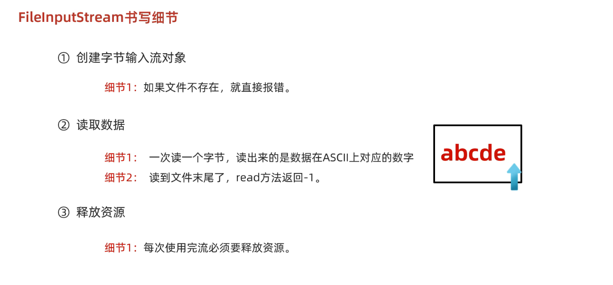

#### 构造方法

* `FileInputStream(File file)`： 通过打开与实际文件的连接来创建一个 FileInputStream ，该文件由文件系统中的 File对象 file命名。 
* `FileInputStream(String name)`： 通过打开与实际文件的连接来创建一个 FileInputStream ，该文件由文件系统中的路径名 name命名。  

当你创建一个流对象时，必须传入一个文件路径。该路径下，如果没有该文件,会抛出`FileNotFoundException` 。

- 构造举例，代码如下：

```java
public class FileInputStreamConstructor throws IOException{
    public static void main(String[] args) {
   	 	// 使用File对象创建流对象
        File file = new File("a.txt");
        FileInputStream fos = new FileInputStream(file);
      
        // 使用文件名称创建流对象
        FileInputStream fos = new FileInputStream("b.txt");
    }
}
```

#### 读取字节数据

1. **读取字节**：`read`方法，每次可以读取一个字节的数据，提升为int类型，读取到文件末尾，返回`-1`，代码使用演示：

```java
public class FISRead {
    public static void main(String[] args) throws IOException{
      	// 使用文件名称创建流对象
       	FileInputStream fis = new FileInputStream("read.txt");
      	// 读取数据，返回一个字节
        int read = fis.read();
        System.out.println((char) read);
        read = fis.read();
        System.out.println((char) read);
        read = fis.read();
        System.out.println((char) read);
        read = fis.read();
        System.out.println((char) read);
        read = fis.read();
        System.out.println((char) read);
      	// 读取到末尾,返回-1
       	read = fis.read();
        System.out.println( read);
		// 关闭资源
        fis.close();
    }
}
输出结果：
a
b
c
d
e
-1
```

循环改进读取方式，代码使用演示：

```java
public class FISRead {
    public static void main(String[] args) throws IOException{
      	// 使用文件名称创建流对象
       	FileInputStream fis = new FileInputStream("read.txt");
      	// 定义变量，保存数据
        int b ；
        // 循环读取
        while ((b = fis.read())!=-1) {
            System.out.println((char)b);
        }
		// 关闭资源
        fis.close();
    }
}
输出结果：
a
b
c
d
e
```

> 小贴士：
>
> 1. 虽然读取了一个字节，但是会自动提升为int类型。
> 2. 流操作完毕后，必须释放系统资源，调用close方法，千万记得。

2. **使用字节数组读取**：`read(byte[] b)`，每次读取b的长度个字节到数组中，返回读取到的有效字节个数，读取到末尾时，返回`-1` ，代码使用演示：

```java
public class FISRead {
    public static void main(String[] args) throws IOException{
      	// 使用文件名称创建流对象.
       	FileInputStream fis = new FileInputStream("read.txt"); // 文件中为abcde
      	// 定义变量，作为有效个数
        int len ；
        // 定义字节数组，作为装字节数据的容器   
        byte[] b = new byte[2];
        // 循环读取
        while (( len= fis.read(b))!=-1) {
           	// 每次读取后,把数组变成字符串打印
            System.out.println(new String(b));
        }
		// 关闭资源
        fis.close();
    }
}

输出结果：
ab
cd
ed
```

==错误数据`d`，是由于最后一次读取时，只读取一个字节`e`，数组中，上次读取的数据没有被完全替换，所以要通过`len` ，获取有效的字节==，代码使用演示：

```java
public class FISRead {
    public static void main(String[] args) throws IOException{
      	// 使用文件名称创建流对象.
       	FileInputStream fis = new FileInputStream("read.txt"); // 文件中为abcde
      	// 定义变量，作为有效个数
        int len ；
        // 定义字节数组，作为装字节数据的容器   
        byte[] b = new byte[2];
        // 循环读取
        while (( len= fis.read(b))!=-1) {
           	// 每次读取后,把数组的有效字节部分，变成字符串打印
            System.out.println(new String(b，0，len));//  len 每次读取的有效字节个数
            System.out.println(new String(b));//如果是这样 最后一次数组输出的是ed 因为上次数组b存储的是cd
            //最后一次只有一个e e把cd的c给重写了 而d没有改变
        }
        /**
        不能这样 read表示读取数据，而且是读取(read)一个数据就移动一次指针
        while (fis.read(b)!=-1) {
           	// 每次读取后,把数组的有效字节部分，变成字符串打印
            System.out.println(fis.read());//  len 每次读取的有效字节个数
        }
        */
		// 关闭资源
        fis.close();
    }
}

输出结果：
ab
cd
e
```

> 小贴士：
>
> 使用数组读取，每次读取多个字节，减少了系统间的IO操作次数，从而提高了读写的效率，建议开发中使用。

### 2.6 字节流练习：图片复制

#### 复制原理图解


#### 案例实现

复制图片文件，代码使用演示：

```java
public class Copy {
    public static void main(String[] args) throws IOException {
        // 1.创建流对象
        // 1.1 指定数据源
        FileInputStream fis = new FileInputStream("D:\\test.jpg");
        // 1.2 指定目的地
        FileOutputStream fos = new FileOutputStream("test_copy.jpg");

        // 2.读写数据
        // 2.1 定义数组
        byte[] b = new byte[1024];
        // 2.2 定义长度
        int len;
        // 2.3 循环读取
        while ((len = fis.read(b))!=-1) {
            // 2.4 写出数据
            fos.write(b, 0 , len);
        }

        // 3.关闭资源
        fos.close();
        fis.close();
    }
}
```

> 小贴士：
>
> 流的关闭原则：先开后关，后开先关。

## 3. 字符流=字节流+字符集

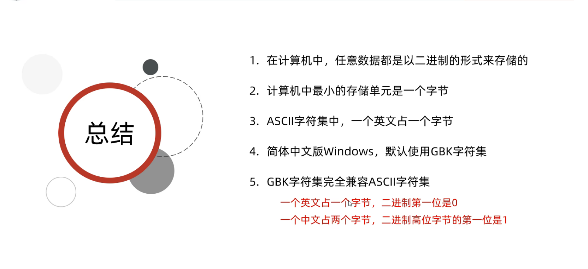

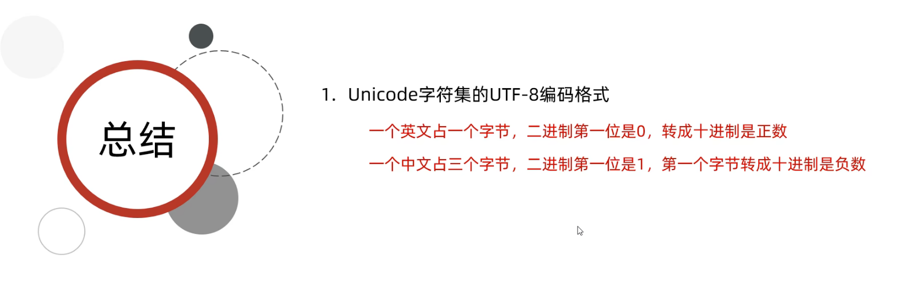


当使用字节流读取文本文件时，可能会有一个小问题。就是遇到中文字符时，可能不会显示完整的字符，那是因为一个中文字符可能占用多个字节存储。所以Java提供一些字符流类，以字符为单位读写数据，专门用于处理文本文件。

### 3.1 字符输入流【Reader】

`java.io.Reader`抽象类是表示用于读取字符流的所有类的超类，可以读取字符信息到内存中。它定义了字符输入流的基本共性功能方法。

- `public void close()` ：关闭此流并释放与此流相关联的任何系统资源。    
- `public int read()`： 从输入流读取一个字符。 
- `public int read(char[] cbuf)`： 从输入流中读取一些字符，并将它们存储到字符数组 cbuf中 。

### 3.2 FileReader类  

`java.io.FileReader `类是读取字符文件的便利类。构造时使用系统默认的字符编码和默认字节缓冲区。

> 小贴士：
>
> 1. 字符编码：字节与字符的对应规则。Windows系统的中文编码默认是GBK编码表。
>
>    idea中UTF-8
>
> 2. 字节缓冲区：一个字节数组，用来临时存储字节数据。

#### 构造方法

- `FileReader(File file)`： 创建一个新的 FileReader ，给定要读取的File对象。   
- `FileReader(String fileName)`： 创建一个新的 FileReader ，给定要读取的文件的名称。  

当你创建一个流对象时，必须传入一个文件路径。类似于FileInputStream 。

- 构造举例，代码如下：

```java
public class FileReaderConstructor throws IOException{
    public static void main(String[] args) {
   	 	// 使用File对象创建流对象
        File file = new File("a.txt");
        FileReader fr = new FileReader(file);
      
        // 使用文件名称创建流对象
        FileReader fr = new FileReader("b.txt");
    }
}
```

#### 读取字符数据

1. **读取字符**：`read`方法，每次可以读取一个字符的数据，提升为int类型，读取到文件末尾，返回`-1`，循环读取，代码使用演示：

```java
public class FRRead {
    public static void main(String[] args) throws IOException {
      	// 使用文件名称创建流对象
       	FileReader fr = new FileReader("read.txt");
      	// 定义变量，保存数据
        int b ；
        // 循环读取
        while ((b = fr.read())!=-1) {
            System.out.println((char)b);
        }
		// 关闭资源
        fr.close();
    }
}
输出结果：
黑
马
程
序
员
```

> 小贴士：虽然读取了一个字符，但是会自动提升为int类型。

2. **使用字符数组读取**：`read(char[] cbuf)`，每次读取b的长度个字符到数组中，返回读取到的有效字符个数，读取到末尾时，返回`-1` ，代码使用演示：

```java
public class FRRead {
    public static void main(String[] args) throws IOException {
      	// 使用文件名称创建流对象
       	FileReader fr = new FileReader("read.txt");
      	// 定义变量，保存有效字符个数
        int len ；
        // 定义字符数组，作为装字符数据的容器
         char[] cbuf = new char[2];
        // 循环读取
        while ((len = fr.read(cbuf))!=-1) {
            System.out.println(new String(cbuf));
        }
		// 关闭资源
        fr.close();
    }
}
输出结果：
黑马
程序
员序
```

获取有效的字符改进，代码使用演示：

```java
public class FISRead {
    public static void main(String[] args) throws IOException {
      	// 使用文件名称创建流对象
       	FileReader fr = new FileReader("read.txt");
      	// 定义变量，保存有效字符个数
        int len ；
        // 定义字符数组，作为装字符数据的容器
        char[] cbuf = new char[2];
        // 循环读取
        while ((len = fr.read(cbuf))!=-1) {
            System.out.println(new String(cbuf,0,len));
        }
    	// 关闭资源
        fr.close();
    }
}

输出结果：
黑马
程序
员
```

### 3.3 字符输出流【Writer】

`java.io.Writer `抽象类是表示用于写出字符流的所有类的超类，将指定的字符信息写出到目的地。它定义了字节输出流的基本共性功能方法。

- `void write(int c)` 写入单个字符。
- `void write(char[] cbuf) `写入字符数组。 
- `abstract  void write(char[] cbuf, int off, int len) `写入字符数组的某一部分,off数组的开始索引,len写的字符个数。 
- `void write(String str) `写入字符串。 
- `void write(String str, int off, int len)` 写入字符串的某一部分,off字符串的开始索引,len写的字符个数。
- `void flush() `刷新该流的缓冲。  
- `void close()` 关闭此流，但要先刷新它。 

### 3.4 FileWriter类

`java.io.FileWriter `类是写出字符到文件的便利类。构造时使用系统默认的字符编码和默认字节缓冲区。

#### 构造方法

- `FileWriter(File file)`： 创建一个新的 FileWriter，给定要读取的File对象。   
- `FileWriter(String fileName)`： 创建一个新的 FileWriter，给定要读取的文件的名称。  

当你创建一个流对象时，必须传入一个文件路径，类似于FileOutputStream。

- 构造举例，代码如下：

```java
public class FileWriterConstructor {
    public static void main(String[] args) throws IOException {
   	 	// 使用File对象创建流对象
        File file = new File("a.txt");
        FileWriter fw = new FileWriter(file);
      
        // 使用文件名称创建流对象
        FileWriter fw = new FileWriter("b.txt");
    }
}
```

#### 基本写出数据

**写出字符**：`write(int b)` 方法，每次可以写出一个字符数据，代码使用演示：

```java
public class FWWrite {
    public static void main(String[] args) throws IOException {
        // 使用文件名称创建流对象
        FileWriter fw = new FileWriter("fw.txt");     
      	// 写出数据
      	fw.write(97); // 写出第1个字符
      	fw.write('b'); // 写出第2个字符
      	fw.write('C'); // 写出第3个字符
      	fw.write(30000); // 写出第4个字符，中文编码表中30000对应一个汉字。
      
      	/*
        【注意】关闭资源时,与FileOutputStream不同。
      	 如果不关闭,数据只是保存到缓冲区，并未保存到文件。
        */
        // fw.close();
    }
}
输出结果：
abC田
```

> 小贴士：
>
> 1. 虽然参数为int类型四个字节，但是只会保留一个字符的信息写出。
> 2. 未调用close方法，数据只是保存到了缓冲区，并未写出到文件中。

#### 字符流底层原理


每次会尽量将缓冲区装满

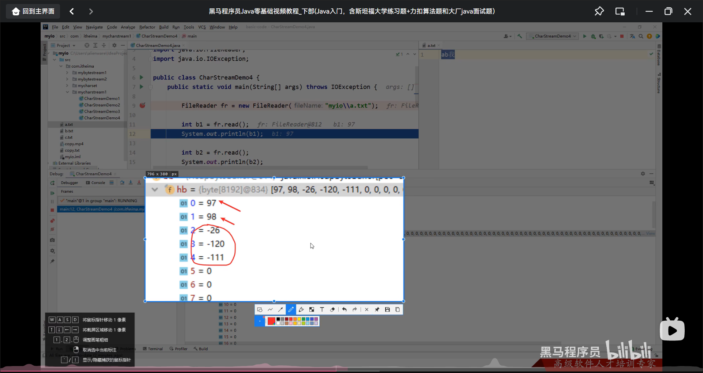

当缓冲区full后还有文件中的数据要read，缓冲区会根据FIFO进行置换覆盖


#### 关闭和刷新

因为内置缓冲区的原因，如果不关闭输出流，无法写出字符到文件中。但是关闭的流对象，是无法继续写出数据的。如果我们既想写出数据，又想继续使用流，就需要`flush` 方法了。

* `flush` ：刷新缓冲区，流对象可以继续使用。
* `close `:先刷新缓冲区，然后通知系统释放资源。流对象不可以再被使用了。

代码使用演示：

```java
public class FWWrite {
    public static void main(String[] args) throws IOException {
        // 使用文件名称创建流对象
        FileWriter fw = new FileWriter("fw.txt");
        // 写出数据，通过flush
        fw.write('刷'); // 写出第1个字符
        fw.flush();
        fw.write('新'); // 继续写出第2个字符，写出成功
        fw.flush();
      
      	// 写出数据，通过close
        fw.write('关'); // 写出第1个字符
        fw.close();
        fw.write('闭'); // 继续写出第2个字符,【报错】java.io.IOException: Stream closed
        fw.close();
    }
}
```

> 小贴士：即便是flush方法写出了数据，操作的最后还是要调用close方法，释放系统资源。

#### 写出其他数据

1. **写出字符数组** ：`write(char[] cbuf)` 和 `write(char[] cbuf, int off, int len)` ，每次可以写出字符数组中的数据，用法类似FileOutputStream，代码使用演示：

```java
public class FWWrite {
    public static void main(String[] args) throws IOException {
        // 使用文件名称创建流对象
        FileWriter fw = new FileWriter("fw.txt");     
      	// 字符串转换为字节数组
      	char[] chars = "黑马程序员".toCharArray();
      
      	// 写出字符数组
      	fw.write(chars); // 黑马程序员
        
		// 写出从索引2开始，2个字节。索引2是'程'，两个字节，也就是'程序'。
        fw.write(b,2,2); // 程序
      
      	// 关闭资源
        fos.close();
    }
}
```

2. **写出字符串**：`write(String str)` 和 `write(String str, int off, int len)` ，每次可以写出字符串中的数据，更为方便，代码使用演示：

```java
public class FWWrite {
    public static void main(String[] args) throws IOException {
        // 使用文件名称创建流对象
        FileWriter fw = new FileWriter("fw.txt");     
      	// 字符串
      	String msg = "黑马程序员";
      
      	// 写出字符数组
      	fw.write(msg); //黑马程序员
      
		// 写出从索引2开始，2个字节。索引2是'程'，两个字节，也就是'程序'。
        fw.write(msg,2,2);	// 程序
      	
        // 关闭资源
        fos.close();
    }
}
```

3. **续写和换行**：操作类似于FileOutputStream。

```java
public class FWWrite {
    public static void main(String[] args) throws IOException {
        // 使用文件名称创建流对象，可以续写数据
        FileWriter fw = new FileWriter("fw.txt"，true);     
      	// 写出字符串
        fw.write("黑马");
      	// 写出换行
      	fw.write("\r\n");
      	// 写出字符串
  		fw.write("程序员");
      	// 关闭资源
        fw.close();
    }
}
输出结果:
黑马
程序员
```

> 小贴士：字符流，只能操作文本文件，不能操作图片，视频等非文本文件。
>
> 当我们单纯读或者写文本文件时  使用字符流 其他情况使用字节流

## 4.综合(字节流和字符流)练习

### 场景分析

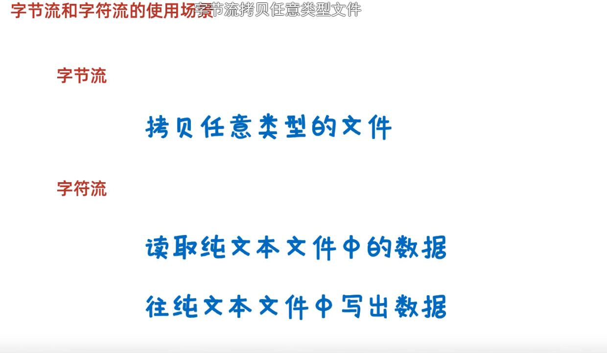

### 练习1：拷贝文件夹

```java
public class Test01 {
    public static void main(String[] args) throws IOException {
        //拷贝一个文件夹，考虑子文件夹

        //1.创建对象表示数据源
        File src = new File("D:\\aaa\\src");
        //2.创建对象表示目的地
        File dest = new File("D:\\aaa\\dest");

        //3.调用方法开始拷贝
        copydir(src,dest);


    }

    /*
    * 作用：拷贝文件夹
    * 参数一：数据源
    * 参数二：目的地
    *
    * */
    private static void copydir(File src, File dest) throws IOException {
        dest.mkdirs();
        //递归
        //1.进入数据源
        File[] files = src.listFiles();
        //2.遍历数组
        for (File file : files) {
            if(file.isFile()){
                //3.判断文件，拷贝
                FileInputStream fis = new FileInputStream(file);
                FileOutputStream fos = new FileOutputStream(new File(dest,file.getName()));
                byte[] bytes = new byte[1024];
                int len;
                while((len = fis.read(bytes)) != -1){
                    fos.write(bytes,0,len);
                }
                fos.close();
                fis.close();
            }else {
                //4.判断文件夹，递归
                copydir(file, new File(dest,file.getName()));
            }
        }
    }
}

```

### 练习2：文件加密

```java
public class Test02 {
    public static void main(String[] args) throws IOException {
        /*
            为了保证文件的安全性，就需要对原始文件进行加密存储，再使用的时候再对其进行解密处理。
            加密原理：
                对原始文件中的每一个字节数据进行更改，然后将更改以后的数据存储到新的文件中。
            解密原理：
                ==读取加密之后的文件，按照加密的规则反向操作，变成原始文件==。

             ^ : 异或
                 两边相同：false
                 两边不同：true

                 0：false
                 1：true

               100:1100100
               10: 1010

               1100100
             ^ 0001010
             __________
               1101110
             ^ 0001010
             __________
               1100100

        */
    }

    public static void encryptionAndReduction(File src, File dest) throws IOException {
        FileInputStream fis = new FileInputStream(src);
        FileOutputStream fos = new FileOutputStream(dest);
        int b;
        while ((b = fis.read()) != -1) {
            fos.write(b ^ 2);
        }
        //4.释放资源
        fos.close();
        fis.close();
    }
}
```

### 练习3：数字排序

文本文件中有以下的数据：
                2-1-9-4-7-8
 将文件中的数据进行排序，变成以下的数据：
                1-2-4-7-8-9

实现方式一：

```java
public class Test03 {
    public static void main(String[] args) throws IOException {
        /*
            文本文件中有以下的数据：
                2-1-9-4-7-8
            将文件中的数据进行排序，变成以下的数据：
                1-2-4-7-8-9
        */


        //1.读取数据
        FileReader fr = new FileReader("myio\\a.txt");
        StringBuilder sb = new StringBuilder();
        int ch;
        while((ch = fr.read()) != -1){
            sb.append((char)ch);
        }		
        fr.close();
        System.out.println(sb);
        //2.排序
        String str = sb.toString();
        String[] arrStr = str.split("-");//2-1-9-4-7-8

        ArrayList<Integer> list = new ArrayList<>();
        for (String s : arrStr) {
            int i = Integer.parseInt(s);
            list.add(i);
        }
        Collections.sort(list);
        System.out.println(list);
        //3.写出
        FileWriter fw = new FileWriter("myio\\a.txt");
        for (int i = 0; i < list.size(); i++) {
            if(i == list.size() - 1){
                fw.write(list.get(i) + "");
            }else{
                fw.write(list.get(i) + "-");
            }
        }
        fw.close();
    }
}
```

实现方式二：

```java
public class Test04 {
    public static void main(String[] args) throws IOException {
        /*
            文本文件中有以下的数据：
                2-1-9-4-7-8
            将文件中的数据进行排序，变成以下的数据：
                1-2-4-7-8-9

           细节1：
                文件中的数据不要换行

            细节2:
                bom头
        */
        //1.读取数据
        FileReader fr = new FileReader("myio\\a.txt");
        StringBuilder sb = new StringBuilder();
        int ch;
        while((ch = fr.read()) != -1){
            sb.append((char)ch);
        }
        fr.close();
        System.out.println(sb);
        //2.排序
        Integer[] arr = Arrays.stream(sb.toString()
                                      .split("-"))
            .map(Integer::parseInt)
            .sorted()
            .toArray(Integer[]::new);
        //3.写出
        FileWriter fw = new FileWriter("myio\\a.txt");
        String s = Arrays.toString(arr).replace(", ","-");
        String result = s.substring(1, s.length() - 1);
        fw.write(result);
        fw.close();
    }
}
```

# JAVA第19章随记_其他高级流

## 1. 缓冲流(真正从文件中读取数据的其实还是基本流fis fos fr fw)

昨天学习了基本的一些流，作为IO流的入门，今天我们要见识一些更强大的流。比如能够高效读写的缓冲流，能够转换编码的转换流，能够持久化存储对象的序列化流等等。这些功能更为强大的流，都是在基本的流对象基础之上创建而来的，就像穿上铠甲的武士一样，相当于是对基本流对象的一种增强。

### 1.1 概述

缓冲流,也叫高效流，是对4个基本的`FileXxx` 流的增强，所以也是4个流，按照数据类型分类：

* **字节缓冲流**：`BufferedInputStream`，`BufferedOutputStream` 
* **字符缓冲流**：`BufferedReader`，`BufferedWriter`

缓冲流的基本原理，==是在创建流对象时，会创建一个内置的默认大小的缓冲区数组，通过缓冲区读写，减少系统IO次数，从而提高读写的效率==。（增加了在内存的操作，减少了读写硬盘所浪费的时间）


### 1.2 字节缓冲流

#### 构造方法

* `public BufferedInputStream(InputStream in)` ：创建一个 新的缓冲输入流。 
* `public BufferedOutputStream(OutputStream out)`： 创建一个新的缓冲输出流。

构造举例，代码如下：

```java
// 创建字节缓冲输入流
BufferedInputStream bis = new BufferedInputStream(new FileInputStream("bis.txt"));
// 创建字节缓冲输出流
BufferedOutputStream bos = new BufferedOutputStream(new FileOutputStream("bos.txt"));
```

#### 效率测试

查询API，缓冲流读写方法与基本的流是一致的，我们通过复制大文件（375MB），测试它的效率。

1. 基本流，代码如下：

```java
public class BufferedDemo {
    public static void main(String[] args) throws FileNotFoundException {
        // 记录开始时间
      	long start = System.currentTimeMillis();
		// 创建流对象
        try (
        	FileInputStream fis = new FileInputStream("jdk9.exe");
        	FileOutputStream fos = new FileOutputStream("copy.exe")
        ){
        	// 读写数据
            int b;
            while ((b = fis.read()) != -1) {
                fos.write(b);
            }
        } catch (IOException e) {
            e.printStackTrace();
        }
		// 记录结束时间
        long end = System.currentTimeMillis();
        System.out.println("普通流复制时间:"+(end - start)+" 毫秒");
    }
}

十几分钟过去了...
```

2. 缓冲流，代码如下：

```java
public class BufferedDemo {
    public static void main(String[] args) throws FileNotFoundException {
        // 记录开始时间
      	long start = System.currentTimeMillis();
		// 创建流对象
        try (
        	BufferedInputStream bis = new BufferedInputStream(new FileInputStream("jdk9.exe"));
	     BufferedOutputStream bos = new BufferedOutputStream(new FileOutputStream("copy.exe"));
        ){
        // 读写数据
            int b;
            while ((b = bis.read()) != -1) {
                bos.write(b);
            }
        } catch (IOException e) {
            e.printStackTrace();
        }
		// 记录结束时间
        long end = System.currentTimeMillis();
        System.out.println("缓冲流复制时间:"+(end - start)+" 毫秒");
    }
}

缓冲流复制时间:8016 毫秒
```

如何更快呢？

使用数组的方式，代码如下：

```java
public class BufferedDemo {
    public static void main(String[] args) throws FileNotFoundException {
      	// 记录开始时间
        long start = System.currentTimeMillis();
		// 创建流对象
        try (
			BufferedInputStream bis = new BufferedInputStream(new FileInputStream("jdk9.exe"));
		 BufferedOutputStream bos = new BufferedOutputStream(new FileOutputStream("copy.exe"));
        ){
          	// 读写数据
            int len;
            byte[] bytes = new byte[8*1024];
            while ((len = bis.read(bytes)) != -1) {
                bos.write(bytes, 0 , len);
            }
        } catch (IOException e) {
            e.printStackTrace();
        }
		// 记录结束时间
        long end = System.currentTimeMillis();
        System.out.println("缓冲流使用数组复制时间:"+(end - start)+" 毫秒");
    }
}
缓冲流使用数组复制时间:666 毫秒
```

### 1.3 字符缓冲流

#### 构造方法

* `public BufferedReader(Reader in)` ：创建一个 新的缓冲输入流。 
* `public BufferedWriter(Writer out)`： 创建一个新的缓冲输出流。

构造举例，代码如下：

```java
// 创建字符缓冲输入流
BufferedReader br = new BufferedReader(new FileReader("br.txt"));
// 创建字符缓冲输出流
BufferedWriter bw = new BufferedWriter(new FileWriter("bw.txt"));
```

#### 特有方法（好用）

字符缓冲流的基本方法与普通字符流调用方式一致，不再阐述，我们来看它们具备的特有方法。

* BufferedReader：`public String readLine()`: 读一行文字。 
* BufferedWriter：`public void newLine()`: 写一行行分隔符,由系统属性定义符号。 

`readLine`方法演示，代码如下：

```java
public class BufferedReaderDemo {
    public static void main(String[] args) throws IOException {
      	 // 创建流对象
        BufferedReader br = new BufferedReader(new FileReader("in.txt"));
		// 定义字符串,保存读取的一行文字
        String line  = null;
      	// 循环读取,读取到最后返回null
        while ((line = br.readLine())!=null) {
            System.out.print(line);
            System.out.println("------");
        }
		// 释放资源
        br.close();
    }
}
```

`newLine`方法演示，代码如下：

  ```java
public class BufferedWriterDemo throws IOException {
    public static void main(String[] args) throws IOException  {
      	// 创建流对象
		BufferedWriter bw = new BufferedWriter(new FileWriter("out.txt"));
      	// 写出数据
        bw.write("黑马");
      	// 写出换行
        bw.newLine();
        bw.write("程序");
        bw.newLine();
        bw.write("员");
        bw.newLine();
		// 释放资源
        bw.close();
    }
}
输出效果:
黑马
程序
员
  ```

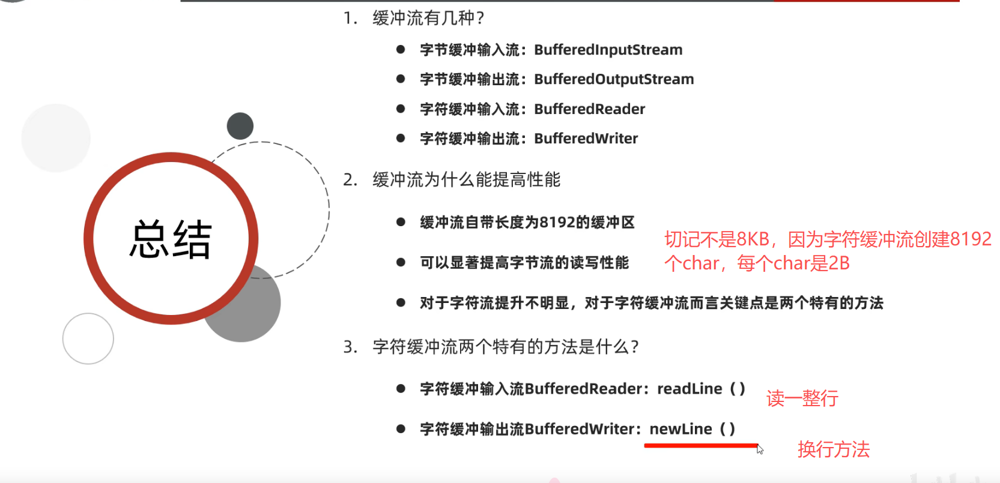

### 1.4 练习:文本排序

请将文本信息恢复顺序。

```
    3.侍中、侍郎郭攸之、费祎、董允等，此皆良实，志虑忠纯，是以先帝简拔以遗陛下。愚以为宫中之事，事无大小，悉以咨之，然后施行，必得裨补阙漏，有所广益。
    8.愿陛下托臣以讨贼兴复之效，不效，则治臣之罪，以告先帝之灵。若无兴德之言，则责攸之、祎、允等之慢，以彰其咎；陛下亦宜自谋，以咨诹善道，察纳雅言，深追先帝遗诏，臣不胜受恩感激。
    4.将军向宠，性行淑均，晓畅军事，试用之于昔日，先帝称之曰能，是以众议举宠为督。愚以为营中之事，悉以咨之，必能使行阵和睦，优劣得所。
    2.宫中府中，俱为一体，陟罚臧否，不宜异同。若有作奸犯科及为忠善者，宜付有司论其刑赏，以昭陛下平明之理，不宜偏私，使内外异法也。
    1.先帝创业未半而中道崩殂，今天下三分，益州疲弊，此诚危急存亡之秋也。然侍卫之臣不懈于内，忠志之士忘身于外者，盖追先帝之殊遇，欲报之于陛下也。诚宜开张圣听，以光先帝遗德，恢弘志士之气，不宜妄自菲薄，引喻失义，以塞忠谏之路也。
    9.今当远离，临表涕零，不知所言。
    6.臣本布衣，躬耕于南阳，苟全性命于乱世，不求闻达于诸侯。先帝不以臣卑鄙，猥自枉屈，三顾臣于草庐之中，咨臣以当世之事，由是感激，遂许先帝以驱驰。后值倾覆，受任于败军之际，奉命于危难之间，尔来二十有一年矣。
    7.先帝知臣谨慎，故临崩寄臣以大事也。受命以来，夙夜忧叹，恐付托不效，以伤先帝之明，故五月渡泸，深入不毛。今南方已定，兵甲已足，当奖率三军，北定中原，庶竭驽钝，攘除奸凶，兴复汉室，还于旧都。此臣所以报先帝而忠陛下之职分也。至于斟酌损益，进尽忠言，则攸之、祎、允之任也。
    5.亲贤臣，远小人，此先汉所以兴隆也；亲小人，远贤臣，此后汉所以倾颓也。先帝在时，每与臣论此事，未尝不叹息痛恨于桓、灵也。侍中、尚书、长史、参军，此悉贞良死节之臣，愿陛下亲之信之，则汉室之隆，可计日而待也。
```

#### 案例分析

1. 逐行读取文本信息。
2. 把读取到的文本存储到集合中
3. 对集合中的文本进行排序
4. 遍历集合，按顺序，写出文本信息。

#### 案例实现

```java
public class Demo05Test {
    public static void main(String[] args) throws IOException {
        //1.创建ArrayList集合,泛型使用String
        ArrayList<String> list = new ArrayList<>();
        //2.创建BufferedReader对象,构造方法中传递FileReader对象
        BufferedReader br = new BufferedReader(new FileReader("10_IO\\in.txt"));
        //3.创建BufferedWriter对象,构造方法中传递FileWriter对象
        BufferedWriter bw = new BufferedWriter(new FileWriter("10_IO\\out.txt"));
        //4.使用BufferedReader对象中的方法readLine,以行的方式读取文本
        String line;
        while((line = br.readLine())!=null){
            //5.把读取到的文本存储到ArrayList集合中
            list.add(line);
        }
        //6.使用Collections集合工具类中的方法sort,对集合中的元素按照自定义规则排序
        Collections.sort(list, new Comparator<String>() {
            /*
                o1-o2:升序
                o2-o1:降序
             */
            @Override
            public int compare(String o1, String o2) {
                //依次比较集合中两个元素的首字母,升序排序
                return o1.charAt(0)-o2.charAt(0);
            }
        });
        //7.遍历ArrayList集合,获取每一个元素
        for (String s : list) {
            //8.使用BufferedWriter对象中的方法wirte,把遍历得到的元素写入到文本中(内存缓冲区中)
            bw.write(s);
            //9.写换行
            bw.newLine();
        }
        //10.释放资源
        bw.close();
        br.close();
    }
}
```


使用Treemap实现排序

```java
package com.io_;

import java.io.*;
import java.util.Map;
import java.util.Set;
import java.util.TreeMap;

public class csb02 {
    public static void main(String[] args) throws IOException {
        //使用字符缓冲流 有个readline功能
        BufferedReader br = new BufferedReader(new FileReader("n1\\ccc\\a.txt"));
        BufferedWriter bw = new BufferedWriter(new FileWriter("copy02.txt"));
        String line;
        //使用TreeMap实现
        TreeMap<Integer, String> treemap = new TreeMap<>();
        while ((line = br.readLine()) != null){
            String[] split = line.split("\\.");
            treemap.put(Integer.parseInt(split[0]),line);
        }
        System.out.println(treemap);
        //写回
        Set<Map.Entry<Integer, String>> entries = treemap.entrySet();
        for (Map.Entry<Integer, String> entry : entries) {
            bw.write(entry.getValue());
            bw.newLine();
        }
        //回收资源
        bw.close();
        br.close();
    }
}

```

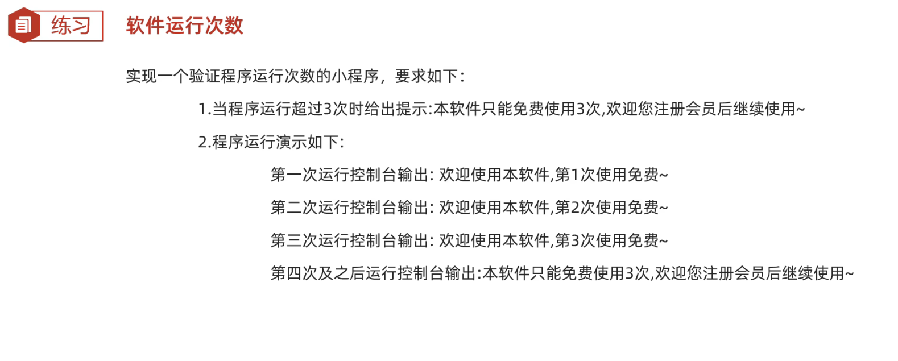

```java
package com.io_;

import java.io.*;

public class Runtime_count {
    public static void main(String[] args) throws IOException {
        //创建字符流 读取数据count
        BufferedReader br = new BufferedReader(new FileReader("count"));
        String line=br.readLine();
        int count = Integer.parseInt(line);
        //判断<3 继续使用 >3停止使用 充钱
        if(count<3){
            count++;
            System.out.println("你使用了"+count+"次");
        }else{
            System.out.println("请充钱");
        }
        //将数据更新回文件中
        BufferedWriter bw = new BufferedWriter(new FileWriter("count"));
        bw.write(count+"");
        bw.close();
        br.close();
    }
}
```

## 2. 转换流

### 2.1 字符编码和字符集

#### 字符编码

计算机中储存的信息都是用二进制数表示的，而我们在屏幕上看到的数字、英文、标点符号、汉字等字符是二进制数转换之后的结果。按照某种规则，将字符存储到计算机中，称为**编码** 。反之，将存储在计算机中的二进制数按照某种规则解析显示出来，称为**解码** 。比如说，按照A规则存储，同样按照A规则解析，那么就能显示正确的文本符号。反之，按照A规则存储，再按照B规则解析，就会导致乱码现象。

编码:字符(能看懂的)--字节(看不懂的)

解码:字节(看不懂的)-->字符(能看懂的)

* **字符编码`Character Encoding`** : 就是一套自然语言的字符与二进制数之间的对应规则。

  编码表:生活中文字和计算机中二进制的对应规则

#### 字符集

* **字符集 `Charset`**：也叫编码表。是一个系统支持的所有字符的集合，包括各国家文字、标点符号、图形符号、数字等。

计算机要准确的存储和识别各种字符集符号，需要进行字符编码，一套字符集必然至少有一套字符编码。常见字符集有ASCII字符集、GBK字符集、Unicode字符集等。

可见，当指定了**编码**，它所对应的**字符集**自然就指定了，所以**编码**才是我们最终要关心的。

* **ASCII字符集** ：
  * ASCII（American Standard Code for Information Interchange，美国信息交换标准代码）是基于拉丁字母的一套电脑编码系统，用于显示现代英语，主要包括控制字符（回车键、退格、换行键等）和可显示字符（英文大小写字符、阿拉伯数字和西文符号）。
  * 基本的ASCII字符集，使用7位（bits）表示一个字符，共128字符。ASCII的扩展字符集使用8位（bits）表示一个字符，共256字符，方便支持欧洲常用字符。
* **ISO-8859-1字符集**：
  * 拉丁码表，别名Latin-1，用于显示欧洲使用的语言，包括荷兰、丹麦、德语、意大利语、西班牙语等。
  * ISO-8859-1使用单字节编码，兼容ASCII编码。
* **GBxxx字符集**：
  * GB就是国标的意思，是为了显示中文而设计的一套字符集。
  * **GB2312**：简体中文码表。一个小于127的字符的意义与原来相同。但两个大于127的字符连在一起时，就表示一个汉字，这样大约可以组合了包含7000多个简体汉字，此外数学符号、罗马希腊的字母、日文的假名们都编进去了，连在ASCII里本来就有的数字、标点、字母都统统重新编了两个字节长的编码，这就是常说的"全角"字符，而原来在127号以下的那些就叫"半角"字符了。
  * **GBK**：最常用的中文码表。是在GB2312标准基础上的扩展规范，使用了双字节编码方案，共收录了21003个汉字，完全兼容GB2312标准，同时支持繁体汉字以及日韩汉字等。
  * **GB18030**：最新的中文码表。收录汉字70244个，采用多字节编码，每个字可以由1个、2个或4个字节组成。支持中国国内少数民族的文字，同时支持繁体汉字以及日韩汉字等。
* **Unicode字符集** ：
  * Unicode编码系统为表达任意语言的任意字符而设计，是业界的一种标准，也称为统一码、标准万国码。
  * 它最多使用4个字节的数字来表达每个字母、符号，或者文字。有三种编码方案，UTF-8、UTF-16和UTF-32。最为常用的UTF-8编码。
  * UTF-8编码，可以用来表示Unicode标准中任何字符，它是电子邮件、网页及其他存储或传送文字的应用中，优先采用的编码。互联网工程工作小组（IETF）要求所有互联网协议都必须支持UTF-8编码。所以，我们开发Web应用，也要使用UTF-8编码。它使用一至四个字节为每个字符编码，编码规则：
    1. 128个US-ASCII字符，只需一个字节编码。
    2. 拉丁文等字符，需要二个字节编码。 
    3. 大部分常用字（含中文），使用三个字节编码。
    4. 其他极少使用的Unicode辅助字符，使用四字节编码。

### 2.2 编码引出的问题

在IDEA中，使用`FileReader` 读取项目中的文本文件。由于IDEA的设置，都是默认的`UTF-8`编码，所以没有任何问题。但是，当读取Windows系统中创建的文本文件时，由于Windows系统的默认是GBK编码，就会出现乱码。

```java
public class ReaderDemo {
    public static void main(String[] args) throws IOException {
        FileReader fileReader = new FileReader("E:\\File_GBK.txt");
        int read;
        while ((read = fileReader.read()) != -1) {
            System.out.print((char)read);
        }
        fileReader.close();
    }
}
输出结果：
���
```

那么如何读取GBK编码的文件呢？ 

### 2.3 InputStreamReader类  

转换流`java.io.InputStreamReader`，是Reader的子类，是从字节流到字符流的桥梁。它读取字节，并使用指定的字符集将其解码为字符。它的字符集可以由名称指定，也可以接受平台的默认字符集。 

#### 构造方法

* `InputStreamReader(InputStream in)`: 创建一个使用默认字符集的字符流。 
* `InputStreamReader(InputStream in, String charsetName)`: 创建一个指定字符集的字符流。

构造举例，代码如下： 

```java
InputStreamReader isr = new InputStreamReader(new FileInputStream("in.txt"));
InputStreamReader isr2 = new InputStreamReader(new FileInputStream("in.txt") , "GBK");
```

#### 指定编码读取

```java
public class ReaderDemo2 {
    public static void main(String[] args) throws IOException {
      	// 定义文件路径,文件为gbk编码
        String FileName = "E:\\file_gbk.txt";
      	// 创建流对象,默认UTF8编码
        InputStreamReader isr = new InputStreamReader(new FileInputStream(FileName));
      	// 创建流对象,指定GBK编码
        InputStreamReader isr2 = new InputStreamReader(new FileInputStream(FileName) , "GBK");
		// 定义变量,保存字符
        int read;
      	// 使用默认编码字符流读取,乱码
        while ((read = isr.read()) != -1) {
            System.out.print((char)read); // ��Һ�
        }
        isr.close();
      
      	// 使用指定编码字符流读取,正常解析
        while ((read = isr2.read()) != -1) {
            System.out.print((char)read);// 大家好
        }
        isr2.close();
    }
}
```

### 2.4 OutputStreamWriter类

转换流`java.io.OutputStreamWriter` ，是Writer的子类，是从字符流到字节流的桥梁。使用指定的字符集将字符编码为字节。它的字符集可以由名称指定，也可以接受平台的默认字符集。 

#### 构造方法

- `OutputStreamWriter(OutputStream in)`: 创建一个使用默认字符集的字符流。 
- `OutputStreamWriter(OutputStream in, String charsetName)`: 创建一个指定字符集的字符流。

构造举例，代码如下： 

```java
OutputStreamWriter isr = new OutputStreamWriter(new FileOutputStream("out.txt"));
OutputStreamWriter isr2 = new OutputStreamWriter(new FileOutputStream("out.txt") , "GBK");
```

#### 指定编码写出

```java
public class OutputDemo {
    public static void main(String[] args) throws IOException {
      	// 定义文件路径
        String FileName = "E:\\out.txt";
      	// 创建流对象,默认UTF8编码
        OutputStreamWriter osw = new OutputStreamWriter(new FileOutputStream(FileName));
        // 写出数据
      	osw.write("你好"); // 保存为6个字节
        osw.close();
      	
		// 定义文件路径
		String FileName2 = "E:\\out2.txt";
     	// 创建流对象,指定GBK编码
        OutputStreamWriter osw2 = new OutputStreamWriter(new FileOutputStream(FileName2),"GBK");
        // 写出数据
      	osw2.write("你好");// 保存为4个字节
        osw2.close();
    }
}
```

#### 转换流理解图解

**转换流是字节与字符间的桥梁！**

### 2.5 练习：转换文件编码

将GBK编码的文本文件，转换为UTF-8编码的文本文件。

#### 案例分析

1. 指定GBK编码的转换流，读取文本文件。
2. 使用UTF-8编码的转换流，写出文本文件。

#### 案例实现

```java
public class TransDemo {
   public static void main(String[] args) {      
    	// 1.定义文件路径
     	String srcFile = "file_gbk.txt";
        String destFile = "file_utf8.txt";
		// 2.创建流对象
    	// 2.1 转换输入流,指定GBK编码
        InputStreamReader isr = new InputStreamReader(new FileInputStream(srcFile) , "GBK");
    	// 2.2 转换输出流,默认utf8编码
        OutputStreamWriter osw = new OutputStreamWriter(new FileOutputStream(destFile),"UTF-8");
		// 3.读写数据
    	// 3.1 定义数组
        char[] cbuf = new char[1024];
    	// 3.2 定义长度
        int len;
    	// 3.3 循环读取
        while ((len = isr.read(cbuf))!=-1) {
            // 循环写出
          	osw.write(cbuf,0,len);
        }
    	// 4.释放资源
        osw.close();
        isr.close();
  	}
}
```

## 3. 序列化

### 3.1 概述

Java 提供了一种对象**序列化**的机制。用一个字节序列可以表示一个对象，该字节序列包含该`对象的数据`、`对象的类型`和`对象中存储的属性`等信息。字节序列写出到文件之后，相当于文件中**持久保存**了一个对象的信息。 

反之，该字节序列还可以从文件中读取回来，重构对象，对它进行**反序列化**。`对象的数据`、`对象的类型`和`对象中存储的数据`信息，都可以用来在内存中创建对象。看图理解序列化： 

### 3.2 ObjectOutputStream类

`java.io.ObjectOutputStream ` 类，将Java对象的原始数据类型写出到文件,实现对象的持久存储。

#### 构造方法

* `public ObjectOutputStream(OutputStream out) `： 创建一个指定OutputStream的ObjectOutputStream。

构造举例，代码如下：  

```java
FileOutputStream fileOut = new FileOutputStream("employee.txt");
ObjectOutputStream out = new ObjectOutputStream(fileOut);

//可以直接写成
ObjectOutputStream out = new ObjectOutputStream(new FileOutputStream("employee.txt"));
```

#### 序列化操作

1. 一个对象要想序列化，必须满足两个条件:

* 该类必须实现`java.io.Serializable ` 接口，`Serializable` 是一个标记接口，不实现此接口的类将不会使任何状态序列化或反序列化，会抛出`NotSerializableException` 。
* 该类的所有属性必须是可序列化的。如果有一个属性不需要可序列化的，则该属性必须注明是瞬态的，使用`transient` 关键字修饰。(意思就是在本地文件中看不到这个属性，隐藏起来了。)

```java
public class Employee implements java.io.Serializable {
    public String name;
    public String address;
    public transient int age; // transient瞬态修饰成员,不会被序列化
    public void addressCheck() {
      	System.out.println("Address  check : " + name + " -- " + address);
    }
}
```

2.写出对象方法

* `public final void writeObject (Object obj)` : 将指定的对象写出。

```java
public class SerializeDemo{
   	public static void main(String [] args)   {
    	Employee e = new Employee();
    	e.name = "zhangsan";
    	e.address = "beiqinglu";
    	e.age = 20; 
    	try {
      		// 创建序列化流对象
          ObjectOutputStream out = new ObjectOutputStream(new FileOutputStream("employee.txt"));
        	// 写出对象
        	out.writeObject(e);
        	// 释放资源
        	out.close();
        	fileOut.close();
        	System.out.println("Serialized data is saved"); // 姓名，地址被序列化，年龄没有被序列化。
        } catch(IOException i)   {
            i.printStackTrace();
        }
   	}
}
输出结果：
Serialized data is saved
```

### 3.3 ObjectInputStream类

ObjectInputStream反序列化流，将之前使用ObjectOutputStream序列化的原始数据恢复为对象。 

#### 构造方法

* `public ObjectInputStream(InputStream in) `： 创建一个指定InputStream的ObjectInputStream。

#### 反序列化操作1

如果能找到一个对象的class文件，我们可以进行反序列化操作，调用`ObjectInputStream`读取对象的方法：

- `public final Object readObject ()` : 读取一个对象。

```java
public class DeserializeDemo {
   public static void main(String [] args)   {
        Employee e = null;
        try {		
             // 创建反序列化流
             FileInputStream fileIn = new FileInputStream("employee.txt");
             ObjectInputStream in = new ObjectInputStream(fileIn);
             // 读取一个对象
             e = (Employee) in.readObject();
             // 释放资源
             in.close();
             fileIn.close();
        }catch(IOException i) {
             // 捕获其他异常
             i.printStackTrace();
             return;
        }catch(ClassNotFoundException c)  {
        	// 捕获类找不到异常
             System.out.println("Employee class not found");
             c.printStackTrace();
             return;
        }
        // 无异常,直接打印输出
        System.out.println("Name: " + e.name);	// zhangsan
        System.out.println("Address: " + e.address); // beiqinglu
        System.out.println("age: " + e.age); // 0
    }
}
```

**对于JVM可以反序列化对象，它必须是能够找到class文件的类。如果找不到该类的class文件，则抛出一个 `ClassNotFoundException` 异常。**  

#### **反序列化操作2**

**另外，当JVM反序列化对象时，能找到class文件，==但是class文件在序列化对象之后发生了修改，那么反序列化操作也会失败，抛出一个`InvalidClassException`异常==。**发生这个异常的原因如下：

* 该类的序列版本号与从流中读取的类描述符的版本号不匹配 
* 该类包含未知数据类型 
* 该类没有可访问的无参数构造方法 

`Serializable` 接口给需要序列化的类，提供了一个序列版本号。`serialVersionUID` 该版本号的目的在于验证序列化的对象和对应类是否版本匹配。

```java
    public class Employee implements java.io.Serializable {
     // 加入序列版本号
     private static final long serialVersionUID = 1L;
     public String name;
     public String address;
     // 添加新的属性 ,重新编译, 可以反序列化,该属性赋为默认值.
     public int eid; 

     public void addressCheck() {
         System.out.println("Address  check : " + name + " -- " + address);
     }
}
```


### 3.4 练习：序列化集合

1. 将存有多个自定义对象的集合序列化操作，保存到`list.txt`文件中。
2. 反序列化`list.txt` ，并遍历集合，打印对象信息。

#### 案例分析

1. 把若干学生对象 ，保存到集合中。
2. 把集合序列化。
3. 反序列化读取时，只需要读取一次，转换为集合类型。
4. 遍历集合，可以打印所有的学生信息

#### 案例实现

```java
public class SerTest {
	public static void main(String[] args) throws Exception {
		// 创建 学生对象
		Student student = new Student("老王", "laow");
		Student student2 = new Student("老张", "laoz");
		Student student3 = new Student("老李", "laol");

		ArrayList<Student> arrayList = new ArrayList<>();
		arrayList.add(student);
		arrayList.add(student2);
		arrayList.add(student3);
		// 序列化操作
		// serializ(arrayList);
		
		// 反序列化  
		ObjectInputStream ois  = new ObjectInputStream(new FileInputStream("list.txt"));
		// 读取对象,强转为ArrayList类型
		ArrayList<Student> list  = (ArrayList<Student>)ois.readObject();
		
      	for (int i = 0; i < list.size(); i++ ){
          	Student s = list.get(i);
        	System.out.println(s.getName()+"--"+ s.getPwd());
      	}
	}

	private static void serializ(ArrayList<Student> arrayList) throws Exception {
		// 创建 序列化流 
		ObjectOutputStream oos = new ObjectOutputStream(new FileOutputStream("list.txt"));
		// 写出对象
		oos.writeObject(arrayList);
		// 释放资源
		oos.close();
	}
}
```


##  4. 打印流(不能读只能写)

### 4.1 概述

平时我们在控制台打印输出，是调用`print`方法和`println`方法完成的，这两个方法都来自于`java.io.PrintStream`类，该类能够方便地打印各种数据类型的值，是一种便捷的输出方式。

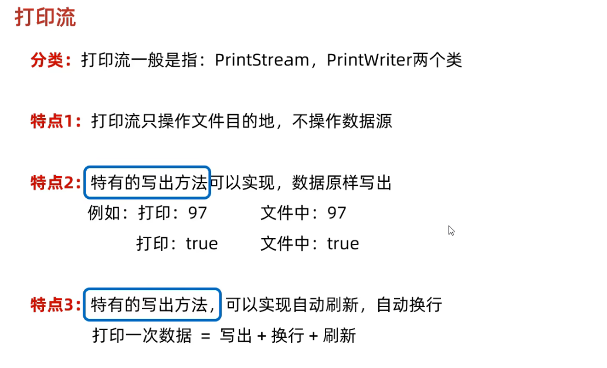

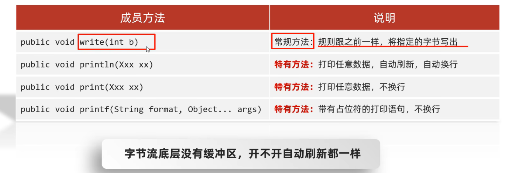

### 4.2 PrintStream类(字节打印流)

#### 构造方法

* `public PrintStream(String fileName)  `： 使用指定的文件名创建一个新的打印流。

构造举例，代码如下：  

```java
PrintStream ps = new PrintStream("ps.txt")；
```

#### 改变打印流向

`System.out`就是`PrintStream`类型的，只不过它的流向是系统规定的，打印在控制台上。不过，既然是流对象，我们就可以玩一个"小把戏"，改变它的流向。

```java
public class PrintDemo {
    public static void main(String[] args) throws IOException {
		// 调用系统的打印流,控制台直接输出97
        System.out.println(97);
      
		// 创建打印流,指定文件的名称
        PrintStream ps = new PrintStream("ps.txt");
      	
      	// 设置系统的打印流流向,输出到ps.txt
        System.setOut(ps);
      	// 调用系统的打印流,ps.txt中输出97
        System.out.println(97);
    }
}
```

### 4.3 PrintWrite(字符打印流)

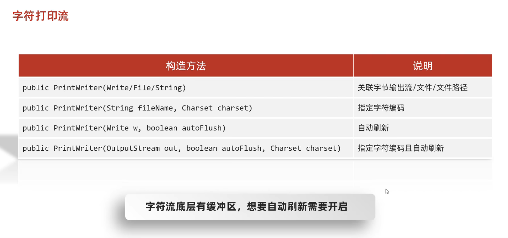


### 4.4 系统输出(sout)和打印流的关系

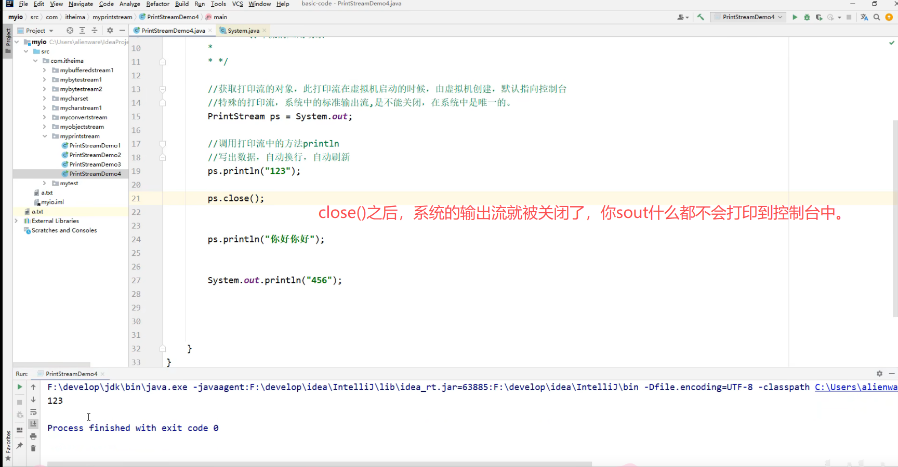

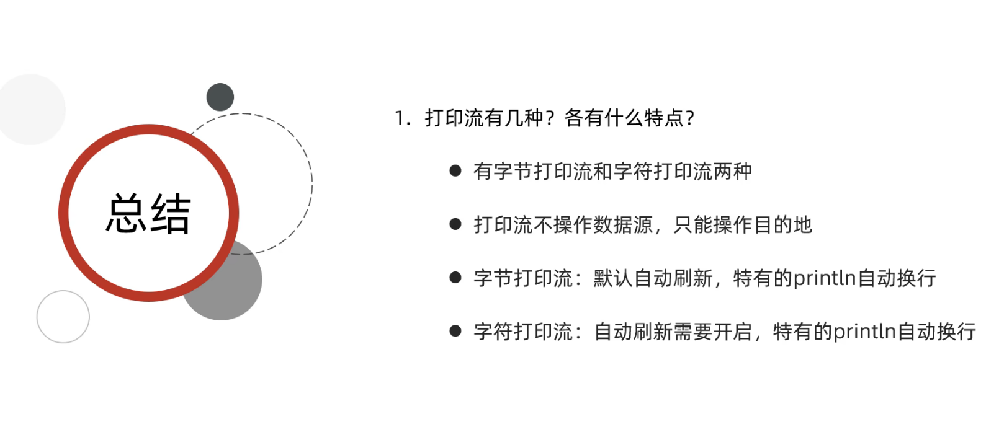

## 5. 压缩流和解压缩流

压缩流：

​	负责把每一个(文件或者文件夹)看成ZipEntry对象放到压缩包中

解压缩流：

​	负责把压缩包中的文件和文件夹==读取==出来，按照层级关系拷贝到目的地当中

```java
/*
*   解压缩流
*
* */
public class ZipStreamDemo1 {
    public static void main(String[] args) throws IOException {

        //1.创建一个File表示要解压的压缩包
        File src = new File("D:\\aaa.zip");
        //2.创建一个File表示解压的目的地
        File dest = new File("D:\\");

        //调用方法
        unzip(src,dest);

    }

    //定义一个方法用来解压
    public static void unzip(File src,File dest) throws IOException {
        //解压的本质：把压缩包里面的每一个文件或者文件夹读取出来，按照层级拷贝到目的地当中
        //创建一个解压缩流用来读取压缩包中的数据
        ZipInputStream zip = new ZipInputStream(new FileInputStream(src));
        //要先获取到压缩包里面的每一个zipentry对象
        //表示当前在压缩包中获取到的文件或者文件夹
        ZipEntry entry;
        while((entry = zip.getNextEntry()) != null){
            System.out.println(entry);
            if(entry.isDirectory()){
                //文件夹：需要在目的地dest处创建一个同样的文件夹
                File file = new File(dest,entry.toString());
                file.mkdirs();
            }else{
                //文件：需要读取到压缩包中的文件，并把他存放到目的地dest文件夹中（按照层级目录进行存放）
                FileOutputStream fos = new FileOutputStream(new File(dest,entry.toString()));
                int b;
                while((b = zip.read()) != -1){
                    //写到目的地
                    fos.write(b);
                }
                fos.close();
                //表示在压缩包中的一个文件处理完毕了。
                zip.closeEntry();
            }
        }
        zip.close();
    }
}
```

```java
public class ZipStreamDemo2 {
    public static void main(String[] args) throws IOException {
        /*
         *   压缩流
         *      需求：
         *          把D:\\a.txt打包成一个压缩包
         * */
        //1.创建File对象表示要压缩的文件
        File src = new File("D:\\a.txt");
        //2.创建File对象表示压缩包的位置
        File dest = new File("D:\\");
        //3.调用方法用来压缩
        toZip(src,dest);
    }

    /*
    *   作用：压缩
    *   参数一：表示要压缩的文件
    *   参数二：表示压缩包的位置
    * */
    public static void toZip(File src,File dest) throws IOException {
        //1.创建压缩流关联压缩包
        ZipOutputStream zos = new ZipOutputStream(new FileOutputStream(new File(dest,"a.zip")));
        //2.创建ZipEntry对象，表示压缩包里面的每一个文件和文件夹
        //参数：压缩包里面的路径
        ZipEntry entry = new ZipEntry("aaa\\bbb\\a.txt");
        //3.把ZipEntry对象放到压缩包当中
        zos.putNextEntry(entry);
        //4.把src文件中的数据写到压缩包当中
        FileInputStream fis = new FileInputStream(src);
        int b;
        while((b = fis.read()) != -1){
            zos.write(b);
        }
        zos.closeEntry();
        zos.close();
    }
}
```

```java
public class ZipStreamDemo3 {
    public static void main(String[] args) throws IOException {
        /*
         *   压缩流
         *      需求：
         *          把D:\\aaa文件夹压缩成一个压缩包
         * */
        //1.创建File对象表示要压缩的文件夹
        File src = new File("D:\\aaa");
        //2.创建File对象表示压缩包放在哪里（压缩包的父级路径）
        File destParent = src.getParentFile();//D:\\
        //3.创建File对象表示压缩包的路径
        File dest = new File(destParent,src.getName() + ".zip");
        //4.创建压缩流关联压缩包
        ZipOutputStream zos = new ZipOutputStream(new FileOutputStream(dest));
        //5.获取src里面的每一个文件，变成ZipEntry对象，放入到压缩包当中
        toZip(src,zos,src.getName());//aaa
        //6.释放资源
        zos.close();
    }

    /*
    *   作用：获取src里面的每一个文件，变成ZipEntry对象，放入到压缩包当中
    *   参数一：数据源
    *   参数二：压缩流
    *   参数三：压缩包内部的路径
    * */
    public static void toZip(File src,ZipOutputStream zos,String name) throws IOException {
        //1.进入src文件夹
        File[] files = src.listFiles();
        //2.遍历数组
        for (File file : files) {
            if(file.isFile()){
                //3.判断-文件，变成ZipEntry对象，放入到压缩包当中
                ZipEntry entry = new ZipEntry(name + "\\" + file.getName());//aaa\\no1\\a.txt
                zos.putNextEntry(entry);
                //读取文件中的数据，写到压缩包
                FileInputStream fis = new FileInputStream(file);
                int b;
                while((b = fis.read()) != -1){
                    zos.write(b);
                }
                fis.close();
                zos.closeEntry();
            }else{
                //4.判断-文件夹，递归
                toZip(file,zos,name + "\\" + file.getName());
                //     no1            aaa   \\   no1
            }
        }
    }
}
```

## 6. 工具包（Commons-io）

介绍：

​	Commons是apache开源基金组织提供的工具包，里面有很多帮助我们提高开发效率的API

比如：

​	StringUtils   字符串工具类

​	NumberUtils   数字工具类 

​	ArrayUtils   数组工具类  

​	RandomUtils   随机数工具类

​	DateUtils   日期工具类 

​	StopWatch   秒表工具类 

​	ClassUtils   反射工具类  

​	SystemUtils   系统工具类  

​	MapUtils   集合工具类

​	Beanutils   bean工具类

​	Commons-io io的工具类

​	等等.....

其中：Commons-io是apache开源基金组织提供的一组有关IO操作的开源工具包。

作用：提高IO流的开发效率。

使用方式：

1，新建lib文件夹

2，把第三方jar包粘贴到文件夹中

3，右键点击add as a library

代码示例：

```java
public class CommonsIODemo1 {
    public static void main(String[] args) throws IOException {
        /*
          FileUtils类
                static void copyFile(File srcFile, File destFile)                   复制文件
                static void copyDirectory(File srcDir, File destDir)                复制文件夹
                static void copyDirectoryToDirectory(File srcDir, File destDir)     复制文件夹
                static void deleteDirectory(File directory)                         删除文件夹
                static void cleanDirectory(File directory)                          清空文件夹
                static String readFileToString(File file, Charset encoding)         读取文件中的数据变成成字符串
                static void write(File file, CharSequence data, String encoding)    写出数据

            IOUtils类
                public static int copy(InputStream input, OutputStream output)      复制文件
                public static int copyLarge(Reader input, Writer output)            复制大文件
                public static String readLines(Reader input)                        读取数据
                public static void write(String data, OutputStream output)          写出数据
         */


        /* File src = new File("myio\\a.txt");
        File dest = new File("myio\\copy.txt");
        FileUtils.copyFile(src,dest);*/


        /*File src = new File("D:\\aaa");
        File dest = new File("D:\\bbb");
        FileUtils.copyDirectoryToDirectory(src,dest);*/

        /*File src = new File("D:\\bbb");
        FileUtils.cleanDirectory(src);*/


    }
}

```

## 7. 工具包（hutool）

介绍：

​	Commons是国人开发的开源工具包，里面有很多帮助我们提高开发效率的API

比如：

​	DateUtil  日期时间工具类 

​	TimeInterval  计时器工具类 

​	StrUtil  字符串工具类

​	HexUtil   16进制工具类

​	HashUtil   Hash算法类

​	ObjectUtil  对象工具类

​	ReflectUtil   反射工具类

​	TypeUtil  泛型类型工具类

​	PageUtil  分页工具类

​	NumberUtil  数字工具类

使用方式：

1，新建lib文件夹

2，把第三方jar包粘贴到文件夹中

3，右键点击add as a library

代码示例：

```java
public class Test1 {
    public static void main(String[] args) {
    /*
        FileUtil类:
                file：根据参数创建一个file对象
                touch：根据参数创建文件

                writeLines：把集合中的数据写出到文件中，覆盖模式。
                appendLines：把集合中的数据写出到文件中，续写模式。
                readLines：指定字符编码，把文件中的数据，读到集合中。
                readUtf8Lines：按照UTF-8的形式，把文件中的数据，读到集合中

                copy：拷贝文件或者文件夹
    */


       /* File file1 = FileUtil.file("D:\\", "aaa", "bbb", "a.txt");
        System.out.println(file1);//D:\aaa\bbb\a.txt

        File touch = FileUtil.touch(file1);
        System.out.println(touch);


        ArrayList<String> list = new ArrayList<>();
        list.add("aaa");
        list.add("aaa");
        list.add("aaa");

        File file2 = FileUtil.writeLines(list, "D:\\a.txt", "UTF-8");
        System.out.println(file2);*/

      /*  ArrayList<String> list = new ArrayList<>();
        list.add("aaa");
        list.add("aaa");
        list.add("aaa");
        File file3 = FileUtil.appendLines(list, "D:\\a.txt", "UTF-8");
        System.out.println(file3);*/
        List<String> list = FileUtil.readLines("D:\\a.txt", "UTF-8");
        System.out.println(list);
    }
}
```

# JAVA第20章随记_多线程

## 1.实现多线程

### 1.1简单了解多线程【理解】

是指从软件或者硬件上实现多个线程并发执行的技术。
具有多线程能力的计算机因有硬件支持而能够在同一时间执行多个线程，提升性能。


### 1.2并发和并行【理解】

+ 并行：在同一时刻，有多个指令在多个CPU上同时执行。

  

+ 并发：在同一时刻，有多个指令在单个CPU上交替执行。

  


### 1.3进程和线程【理解】

- 进程：是正在运行的程序

  独立性：进程是一个能独立运行的基本单位，同时也是系统分配资源和调度的独立单位
  动态性：进程的实质是程序的一次执行过程，进程是动态产生，动态消亡的
  并发性：任何进程都可以同其他进程一起并发执行

- 线程：是进程中的单个顺序控制流，是一条执行路径

  ​	单线程：一个进程如果只有一条执行路径，则称为单线程程序

  ​	多线程：一个进程如果有多条执行路径，则称为多线程程序

  ​	

### 1.4实现多线程方式一：继承Thread类【应用】

- 方法介绍

  | 方法名       | 说明                                        |
  | ------------ | ------------------------------------------- |
  | void run()   | 在线程开启后，此方法将被调用执行            |
  | void start() | 使此线程开始执行，Java虚拟机会调用run方法() |

- 实现步骤

  - 定义一个类MyThread继承Thread类
  - 在MyThread类中重写run()方法
  - 创建MyThread类的对象
  - 启动线程

- 代码演示

  ```java
  public class MyThread extends Thread {
      @Override
      public void run() {
          for(int i=0; i<100; i++) {
              System.out.println(i);
          }
      }
  }
  public class MyThreadDemo {
      public static void main(String[] args) {
          MyThread my1 = new MyThread();
          MyThread my2 = new MyThread();
  
  //        my1.run();
  //        my2.run();
  
          //void start() 导致此线程开始执行; Java虚拟机调用此线程的run方法
          my1.start();
          my2.start();
      }
  }
  ```

  两个小问题

  - 为什么要重写run()方法？

    ==因为run()是用来封装被线程执行的代码==

  - run()方法和start()方法的区别？

    run()：封装线程执行的代码，直接调用，相当于普通方法的调用

    start()：启动线程；然后由JVM调用此线程的run()方法

### 1.5实现多线程方式二：实现Runnable接口【应用】

- Thread构造方法

  | 方法名                               | 说明                   |
  | ------------------------------------ | ---------------------- |
  | Thread(Runnable target)              | 分配一个新的Thread对象 |
  | Thread(Runnable target, String name) | 分配一个新的Thread对象 |

- 实现步骤

  - 定义一个类MyRunnable实现Runnable接口(implements)
  - 在MyRunnable类中重写run()方法
  - 创建MyRunnable类的对象
  - ==创建Thread类的对象，把MyRunnable对象作为构造方法的参数==
  - 启动线程

- 代码演示

  ```java
  public class MyRunnable implements Runnable {
      @Override
      public void run() {
          for(int i=0; i<100; i++) {
              System.out.println(Thread.currentThread().getName()+":"+i);
          }
      }
  }
  public class MyRunnableDemo {
      public static void main(String[] args) {
          //创建MyRunnable类的对象
          MyRunnable my = new MyRunnable();
  
          //创建Thread类的对象，把MyRunnable对象作为构造方法的参数
          //Thread(Runnable target)
  //        Thread t1 = new Thread(my);
  //        Thread t2 = new Thread(my);
          //Thread(Runnable target, String name)
          Thread t1 = new Thread(my,"坦克");
          Thread t2 = new Thread(my,"飞机");
  
          //启动线程
          t1.start();
          t2.start();
      }
  }
  ```

### 1.6实现多线程方式三: 实现Callable接口【应用】

+ 方法介绍

  | 方法名                           | 说明                                               |
  | -------------------------------- | -------------------------------------------------- |
  | V call()                         | 计算结果，如果无法计算结果，则抛出一个异常         |
  | FutureTask(Callable<V> callable) | 创建一个 FutureTask，一旦运行就执行给定的 Callable |
  | V get()                          | 如有必要，等待计算完成，然后获取其结果             |

+ 实现步骤

  + 定义一个类MyCallable实现Callable接口
  + 在MyCallable类中重写call()方法
  + 创建MyCallable类的对象
  + ==创建Future的实现类FutureTask对象，把MyCallable对象作为构造方法的参数==
  + 创建Thread类的对象，把FutureTask对象作为构造方法的参数
  + 启动线程
  + 再调用get方法，就可以获取线程结束之后的结果。

+ 代码演示

  ```java
  public class MyCallable implements Callable<String> {
      @Override
      public String call() throws Exception {
          for (int i = 0; i < 100; i++) {
              System.out.println("跟女孩表白" + i);
          }
          //返回值就表示线程运行完毕之后的结果
          return "答应";
      }
  }
  public class Demo {
      public static void main(String[] args) throws ExecutionException, InterruptedException {
          //线程开启之后需要执行里面的call方法
          MyCallable mc = new MyCallable();
  
          //Thread t1 = new Thread(mc);
  
          //可以获取线程执行完毕之后的结果.也可以作为参数传递给Thread对象
          FutureTask<String> ft = new FutureTask<>(mc);
  
          //创建线程对象
          Thread t1 = new Thread(ft);
  
          String s = ft.get();
          //开启线程
          t1.start();
  
          //String s = ft.get();
          System.out.println(s);
      }
  }
  ```

+ 三种实现方式的对比

  + 实现Runnable、Callable接口
    + 好处: 扩展性强，实现该接口的同时还可以继承其他的类
    + 缺点: 编程相对复杂，不能直接使用Thread类中的方法
  + 继承Thread类
    + 好处: 编程比较简单，可以直接使用Thread类中的方法
    + 缺点: 可以扩展性较差，不能再继承其他的类
  + 需要返回结果的话就用Callable接口


### 1.7设置和获取线程名称【应用】

- 方法介绍

  | 方法名                     | 说明                               |
  | -------------------------- | ---------------------------------- |
  | void  setName(String name) | 将此线程的名称更改为等于参数name   |
  | String  getName()          | 返回此线程的名称                   |
  | Thread  currentThread()    | 返回对当前正在执行的线程对象的引用 |

- 代码演示

  ```java
  public class MyThread extends Thread {
      public MyThread() {}
      public MyThread(String name) {
          super(name);
      }
  
      @Override
      public void run() {
          for (int i = 0; i < 100; i++) {
              System.out.println(getName()+":"+i);
          }
      }
  }
  public class MyThreadDemo {
      public static void main(String[] args) {
          MyThread my1 = new MyThread();
          MyThread my2 = new MyThread();
  		
          //给线程取名字
          //方法一void setName(String name)：将此线程的名称更改为等于参数 name
          my1.setName("高铁");
          my2.setName("飞机");
  			
          //方法二 使用构造方法Thread(String name)
          MyThread my1 = new MyThread("高铁");
          MyThread my2 = new MyThread("飞机");
  
          my1.start();
          my2.start();
  
          //static Thread currentThread() 返回对当前正在执行的线程对象的引用
          //当JVM虚拟机启动之后，会自动的启动多条线程，其中有条线程就叫做main线程，
          //他的作用就是去调用main方法，并执行里面的代码
          //在以前，我们写的所有的代码，其实都是运行在main线程当中的
          System.out.println(Thread.currentThread().getName());
      }
  }
  ```

### 1.8线程休眠【应用】

+ 相关方法

  | 方法名                         | 说明                                             |
  | ------------------------------ | ------------------------------------------------ |
  | static void sleep(long millis) | 使当前正在执行的线程停留（暂停执行）指定的毫秒数 |

+ 代码演示

  ```java
  public class MyRunnable implements Runnable {
      @Override
      public void run() {
          for (int i = 0; i < 100; i++) {
              try {
                  Thread.sleep(100);
              } catch (InterruptedException e) {
                  e.printStackTrace();
              }
  
              System.out.println(Thread.currentThread().getName() + "---" + i);
          }
      }
  }
  public class Demo {
      public static void main(String[] args) throws InterruptedException {
          /*System.out.println("睡觉前");
          Thread.sleep(3000);
          System.out.println("睡醒了");*/
  
          MyRunnable mr = new MyRunnable();
  
          Thread t1 = new Thread(mr);
          Thread t2 = new Thread(mr);
  
          t1.start();
          t2.start();
      }
  }
  ```

### 1.9线程优先级【应用】

- 线程调度

  - 两种调度方式

    - 分时调度模型：所有线程轮流使用 CPU 的使用权，平均分配每个线程占用 CPU 的时间片
    - 抢占式调度模型：优先让优先级高的线程使用 CPU，如果线程的优先级相同，那么会随机选择一个，优先级高的线程获取的 CPU 时间片相对多一些

  - Java使用的是抢占式调度模型

  - 随机性

    假如计算机只有一个 CPU，那么 CPU 在某一个时刻只能执行一条指令，线程只有得到CPU时间片，也就是使用权，才可以执行指令。所以说多线程程序的执行是有随机性，因为谁抢到CPU的使用权是不一定的

    

- 优先级相关方法

  | 方法名                                  | 说明                                                         |
  | --------------------------------------- | ------------------------------------------------------------ |
  | final int getPriority()                 | 返回此线程的优先级                                           |
  | final void setPriority(int newPriority) | 更改此线程的优先级线程默认优先级是5；线程优先级的范围是：1-10 |

- 代码演示

  ```java
  public class MyCallable implements Callable<String> {
      @Override
      public String call() throws Exception {
          for (int i = 0; i < 100; i++) {
              System.out.println(Thread.currentThread().getName() + "---" + i);
          }
          return "线程执行完毕了";
      }
  }
  public class Demo {
      public static void main(String[] args) {
          //优先级: 1 - 10 默认值:5
          MyCallable mc = new MyCallable();
  
          FutureTask<String> ft = new FutureTask<>(mc);
  
          Thread t1 = new Thread(ft);
          t1.setName("飞机");
          t1.setPriority(10);
          //System.out.println(t1.getPriority());//5
          t1.start();
  
          MyCallable mc2 = new MyCallable();
  
          FutureTask<String> ft2 = new FutureTask<>(mc2);
  
          Thread t2 = new Thread(ft2);
          t2.setName("坦克");
          t2.setPriority(1);
          //System.out.println(t2.getPriority());//5
          t2.start();
      }
  }
  ```

### 1.10守护线程【应用】（备胎）

- 相关方法

- 理解：当其他非守护线程执行完毕后，守护线程会陆续结束

- 通俗理解：当女神线程结束了，那么备胎也没有存在的必要了 （不是立马结束，是陆续结束）

  | 方法名                     | 说明                                                         |
  | -------------------------- | ------------------------------------------------------------ |
  | void setDaemon(boolean on) | 将此线程标记为守护线程，当运行的线程都是守护线程时，Java虚拟机将退出 |

- 代码演示

  ```java
  public class MyThread1 extends Thread {
      @Override
      public void run() {
          for (int i = 0; i < 10; i++) {
              System.out.println(getName() + "---" + i);
          }
      }
  }
  public class MyThread2 extends Thread {
      @Override
      public void run() {
          for (int i = 0; i < 100; i++) {
              System.out.println(getName() + "---" + i);
          }
      }
  }
  public class Demo {
      public static void main(String[] args) {
          MyThread1 t1 = new MyThread1();
          MyThread2 t2 = new MyThread2();
  
          t1.setName("女神");
          t2.setName("备胎");
  
          //把第二个线程设置为守护线程
          //当普通线程执行完之后,那么守护线程也没有继续运行下去的必要了.
          t2.setDaemon(true);
  
          t1.start();
          t2.start();
      }
  }
  ```


### 1.11 线程的生命周期

 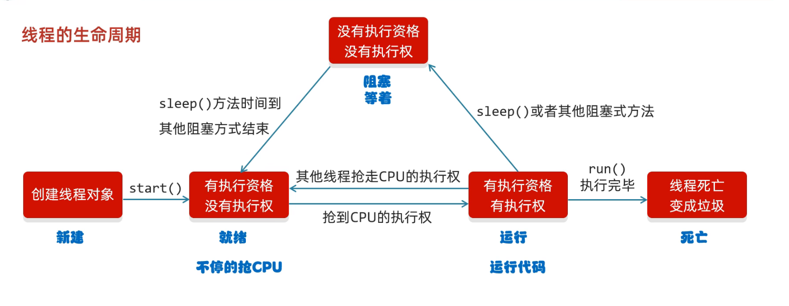

### 1.12 线程的安全问题


会出现窗口1 窗口2 窗口3 同时贩卖一张票的情况出现

## 2.线程同步

### 2.1卖票【应用】

- 案例需求

  某电影院目前正在上映国产大片，共有100张票，而它有3个窗口卖票，请设计一个程序模拟该电影院卖票

- 实现步骤

  - 定义一个类SellTicket实现Runnable接口，里面定义一个成员变量：private int tickets = 100;

  - 在SellTicket类中重写run()方法实现卖票，代码步骤如下

  - 判断票数大于0，就卖票，并告知是哪个窗口卖的
  - 卖了票之后，总票数要减1
  - 票卖没了，线程停止
  - 定义一个测试类SellTicketDemo，里面有main方法，代码步骤如下
  - 创建SellTicket类的对象
  - 创建三个Thread类的对象，把SellTicket对象作为构造方法的参数，并给出对应的窗口名称
  - 启动线程

- 代码实现

  ```java
  public class SellTicket implements Runnable {
      private int tickets = 100;
      //在SellTicket类中重写run()方法实现卖票，代码步骤如下
      @Override
      public void run() {
          while (true) {
              if(ticket <= 0){
                      //卖完了
                      break;
                  }else{
                      try {
                          Thread.sleep(100);
                      } catch (InterruptedException e) {
                          e.printStackTrace();
                      }
                      ticket--;
                      System.out.println(Thread.currentThread().getName() + "在卖票,还剩下" + ticket + "张票");
                  }
          }
      }
  }
  public class SellTicketDemo {
      public static void main(String[] args) {
          //创建SellTicket类的对象
          SellTicket st = new SellTicket();
  
          //创建三个Thread类的对象，把SellTicket对象作为构造方法的参数，并给出对应的窗口名称
          Thread t1 = new Thread(st,"窗口1");
          Thread t2 = new Thread(st,"窗口2");
          Thread t3 = new Thread(st,"窗口3");
  
          //启动线程
          t1.start();
          t2.start();
          t3.start();
      }
  }
  ```


### 2.2卖票案例的问题【理解】

- 卖票出现了问题

  - 相同的票出现了多次

  - 出现了负数的票

- 问题产生原因

  线程执行的随机性导致的,可能在卖票过程中丢失cpu的执行权,导致出现问题


### 2.3同步代码块解决数据安全问题【应用】

- 安全问题出现的条件

  - 是多线程环境

  - 有共享数据

  - 有多条语句操作共享数据

- 如何解决多线程安全问题呢?

  - 基本思想：让程序处于没有安全问题的环境

- 怎么实现呢?

  - 把多条语句操作共享数据的代码给锁起来，让任意时刻只能有一个线程执行即可

  - Java提供了同步代码块的方式来解决

- 同步代码块格式：

  ```java
  synchronized(任意对象) { 
  	多条语句操作共享数据的代码 
  }
  ```

  synchronized(任意对象)：就相当于给代码加锁了，任意对象就可以看成是一把锁

- 同步的好处和弊端  

  - 好处：解决了多线程的数据安全问题

  - 弊端：当线程很多时，因为每个线程都会去判断同步上的锁，这是很耗费资源的，无形中会降低程序的运行效率

- 代码演示

  ```java
  public class SellTicket implements Runnable {
      private int tickets = 100;
      private Object obj = new Object();
  
      @Override
      public void run() {
          while (true) {
              synchronized (obj) { // 对可能有安全问题的代码加锁,多个线程必须使用同一把锁
                  //t1进来后，就会把这段代码给锁起来
                  if (tickets > 0) {
                      try {
                          Thread.sleep(100);
                          //t1休息100毫秒
                      } catch (InterruptedException e) {
                          e.printStackTrace();
                      }
                      //窗口1正在出售第100张票
                      System.out.println(Thread.currentThread().getName() + "正在出售第" + tickets + "张票");
                      tickets--; //tickets = 99;
                  }
              }
              //t1出来了，这段代码的锁就被释放了
          }
      }
  }
  
  public class SellTicketDemo {
      public static void main(String[] args) {
          SellTicket st = new SellTicket();
  
          Thread t1 = new Thread(st, "窗口1");
          Thread t2 = new Thread(st, "窗口2");
          Thread t3 = new Thread(st, "窗口3");
  
          t1.start();
          t2.start();
          t3.start();
      }
  }
  ```

### 2.4同步方法解决数据安全问题【应用】

- 同步方法的格式

  同步方法：就是把synchronized关键字加到方法上

  ```java
  修饰符 synchronized 返回值类型 方法名(方法参数) { 
  	方法体；
  }
  ```

  同步方法的锁对象是什么呢?

  ​	this

- 静态同步方法

  同步静态方法：就是把synchronized关键字加到静态方法上

  ```java
  修饰符 static synchronized 返回值类型 方法名(方法参数) { 
  	方法体；
  }
  ```

  同步静态方法的锁对象是什么呢?

  ​	类名.class

- 代码演示

  ```java
  public class MyRunnable implements Runnable {
      private static int ticketCount = 100;
  
      @Override
      public void run() {
          while(true){
              if("窗口一".equals(Thread.currentThread().getName())){
                  //同步方法
                  boolean result = synchronizedMthod();
                  if(result){
                      break;
                  }
              }
  
              if("窗口二".equals(Thread.currentThread().getName())){
                  //同步代码块
                  synchronized (MyRunnable.class){
                      if(ticketCount == 0){
                         break;
                      }else{
                          try {
                              Thread.sleep(10);
                          } catch (InterruptedException e) {
                              e.printStackTrace();
                          }
                          ticketCount--;
                          System.out.println(Thread.currentThread().getName() + "在卖票,还剩下" + ticketCount + "张票");
                      }
                  }
              }
  
          }
      }
  
      private static synchronized boolean synchronizedMthod() {
          if(ticketCount == 0){
              return true;
          }else{
              try {
                  Thread.sleep(10);
              } catch (InterruptedException e) {
                  e.printStackTrace();
              }
              ticketCount--;
              System.out.println(Thread.currentThread().getName() + "在卖票,还剩下" + ticketCount + "张票");
              return false;
          }
      }
  }
   public class Demo {
        public static void main(String[] args) {
            MyRunnable mr = new MyRunnable();
  
            Thread t1 = new Thread(mr);
            Thread t2 = new Thread(mr);
      
            t1.setName("窗口一");
            t2.setName("窗口二");
      
            t1.start();
            t2.start();
        }
    }
  ```

| 特性       | 同步方法                                         | 同步代码块                                               |
| :--------- | :----------------------------------------------- | :------------------------------------------------------- |
| **锁对象** | 静态方法默认是`类名.class`，普通实例方法是`this` | **可灵活指定**任意对象（本例中指定为`MyRunnable.class`） |
| **锁粒度** | **粗**，锁住整个方法                             | **细**，只锁住需要同步的关键代码                         |
| **性能**   | 相对较低，锁范围大，线程等待时间长               | 相对较高，锁范围小，线程并发度更高                       |
| **灵活性** | 低                                               | 高                                                       |

### ➕ 举一反三

你可以尝试修改代码来加深理解：

- **实验1**：将`ticketCount`的`static`关键字去掉，再运行程序，观察会发生什么现象？（结果可能是两个窗口各卖了100张票，总共卖了200张票，因为票源不共享了）。
- **实验2**：将同步代码块的锁对象从`MyRunnable.class`改为`this`，再运行程序，还能保证线程安全吗？为什么？（不能，因为对于静态变量`ticketCount`，锁应该是类级别的锁（`MyRunnable.class`），而`this`是对象级别的锁，两个线程获取的是不同的锁，无法实现互斥）。
- **了解更多**：除了`synchronized`，Java的`java.util.concurrent.locks`包里的`Lock`接口（如`ReentrantLock`）也能实现同步，功能更强大灵活。

让我用一个更详细的比喻和代码示例来解释为什么“另一个对象会导致`this`锁失效”。

#### 核心问题：锁与资源的管辖范围不匹配

想象一下公司的储物柜区域：

- **静态变量** `ticketCount`（票数）就像公司里的**公共储物柜** - 所有员工都可以使用
- **对象锁** `this`就像每个员工的**工牌** - 每人一张，只能开自己的抽屉

#### 详细场景分析

###### 场景一：只有一个对象（当前代码的情况）

```Java
MyRunnable mr = new MyRunnable(); // 只创建一个对象
Thread t1 = new Thread(mr);  // 窗口一，使用mr对象
Thread t2 = new Thread(mr);  // 窗口二，使用同一个mr对象
```

在这种情况下，两个线程共享**同一个** `mr`对象，因此它们的 `this`指向的是**同一个锁**。这时候看起来好像是"安全"的，但实际上这只是巧合！

###### 场景二：新增另一个对象（问题所在！）

```java
MyRunnable mr1 = new MyRunnable(); // 第一个对象
MyRunnable mr2 = new MyRunnable(); // 第二个对象！！！

Thread t1 = new Thread(mr1);  // 窗口一，使用mr1对象
Thread t2 = new Thread(mr2);  // 窗口二，使用mr2对象
Thread t3 = new Thread(new MyRunnable());  // 窗口三，使用第三个对象！
```

现在问题来了：

- `t1`线程：使用 `mr1`对象的锁（`this`指向 `mr1`）
- `t2`线程：使用 `mr2`对象的锁（`this`指向 `mr2`）
- `t3`线程：使用另一个新对象的锁（另一个 `this`）

**关键点**：虽然这三个线程操作的是同一个静态变量 `ticketCount`（公司公共储物柜），但它们使用的是**不同的对象锁**（各自不同的工牌）！

###### 这为什么会导致线程不安全？

因为`synchronized(this)`只对**同一个对象**的多个线程有效。不同对象的`synchronized`方法或代码块之间**不会互相阻塞**。

具体来说：

- 线程t1进入 `mr1`的同步代码块，获取 `mr1`的锁
- 线程t2同时进入 `mr2`的同步代码块，获取 `mr2`的锁
- 线程t3同时进入第三个对象的同步代码块，获取第三个对象的锁
- **三个线程同时修改同一个静态变量 `ticketCount`** → 数据混乱！

用表格直观对比：

| 情况                                   | 锁对象         | 保护效果   | 说明                         |
| :------------------------------------- | :------------- | :--------- | :--------------------------- |
| 正确：`synchronized(MyRunnable.class)` | 类对象（唯一） | ✅ 安全     | 所有线程竞争**同一把锁**     |
| 错误：`synchronized(this)`（单对象）   | 特定实例       | ⚠️ 看似安全 | 只有同一对象的线程间安全     |
| 错误：`synchronized(this)`（多对象）   | 不同实例       | ❌ 不安全   | 每个对象有各自的锁，互不干扰 |

#### 代码演示问题

如果这样写：

```java
public void run() {
    synchronized(this) {  // 错误：使用对象锁保护静态变量
        if(ticketCount > 0) {
            ticketCount--;  // 多个不同对象的线程可能同时执行到这里！
        }
    }
}
```

当有多个`MyRunnable`实例时，这个同步块根本起不到保护作用，因为每个实例都有自己的`this`锁。

#### 为什么要用类锁？

```java
public void run() {
    synchronized(MyRunnable.class) {  // 正确：使用类锁
        if(ticketCount > 0) {
            ticketCount--;  // 确保同一时间只有一个线程执行
        }
    }
}
```

因为 `MyRunnable.class`在JVM中是**唯一的**，无论创建多少个对象，所有线程竞争的都是**同一把锁**，这样才能真正保护静态变量。

#### 总结

你的困惑很准确！`this`锁在"只有一个对象"时看似有效，但在"多个对象"场景下就完全失效了，因为它无法管辖其他对象的线程。而静态变量是**类级别**的资源，必须用**类级别**的锁来保护。

希望这个解释能帮你彻底理解这个重要的概念！

### 2.5Lock锁【应用】

虽然我们可以理解同步代码块和同步方法的锁对象问题，但是我们并没有直接看到在哪里加上了锁，在哪里释放了锁，为了更清晰的表达如何加锁和释放锁，JDK5以后提供了一个新的锁对象Lock

Lock是接口不能直接实例化，这里采用它的实现类ReentrantLock来实例化

- ReentrantLock构造方法

  | 方法名          | 说明                        |
  | --------------- | --------------------------- |
  | ReentrantLock() | 创建一个ReentrantLock的实例 |

- 加锁解锁方法

  | 方法名        | 说明   |
  | ------------- | ------ |
  | void lock()   | 获得锁 |
  | void unlock() | 释放锁 |

  ```java
  public class Ticket implements Runnable {
      //票的数量
      private int ticket = 100;
      private Object obj = new Object();
      private ReentrantLock lock = new ReentrantLock();
  
      @Override
      public void run() {
          while (true) {
              //synchronized (obj){//多个线程必须使用同一把锁.
              try {
                  lock.lock();
                  if (ticket <= 0) {
                      //卖完了
                      break;
                  } else {
                      Thread.sleep(100);
                      ticket--;
                      System.out.println(Thread.currentThread().getName() + "在卖票,还剩下" + ticket + "张票");
                  }
              } catch (InterruptedException e) {
                  e.printStackTrace();
              } finally {
                  lock.unlock();
              }
              // }
          }
      }
  }
  
  public class Demo {
      public static void main(String[] args) {
          Ticket ticket = new Ticket();
  
          Thread t1 = new Thread(ticket);
          Thread t2 = new Thread(ticket);
          Thread t3 = new Thread(ticket);
  
          t1.setName("窗口一");
          t2.setName("窗口二");
          t3.setName("窗口三");
  
          t1.start();
          t2.start();
          t3.start();
      }
  }
  ```

### 2.6死锁【理解】

+ 概述

  线程死锁是指由于两个或者多个线程互相持有对方所需要的资源，导致这些线程处于等待状态，无法前往执行。

+ 什么情况下会产生死锁

  1. 资源有限
  2. 同步嵌套

+ 代码演示

  ```java
  public class Demo {
      public static void main(String[] args) {
          //定义了两把锁
          Object objA = new Object();
          Object objB = new Object();
  
          new Thread(()->{
              while(true){
                  //抢占了一把锁 然后等待另外一把锁
                  synchronized (objA){
                      //线程一
                      synchronized (objB){
                          System.out.println("小康同学正在走路");
                      }
                  }
              }
          }).start();
  
          new Thread(()->{
              while(true){
                  synchronized (objB){
                      //线程二
                      synchronized (objA){
                          System.out.println("小薇同学正在走路");
                      }
                  }
              }
          }).start();
      }
  }
  ```

## 3.生产者消费者

### 3.1生产者和消费者模式概述【应用】

- 概述

  生产者消费者模式是一个十分经典的多线程协作的模式，弄懂生产者消费者问题能够让我们对多线程编程的理解更加深刻。

  所谓生产者消费者问题，实际上主要是包含了两类线程：

  ​	一类是生产者线程用于生产数据

  ​	一类是消费者线程用于消费数据

  为了解耦生产者和消费者的关系，通常会采用共享的数据区域，就像是一个仓库

  生产者生产数据之后直接放置在共享数据区中，并不需要关心消费者的行为

  消费者只需要从共享数据区中去获取数据，并不需要关心生产者的行为

- Object类的等待和唤醒方法

  | 方法名           | 说明                                                         |
  | ---------------- | ------------------------------------------------------------ |
  | void wait()      | 导致当前线程等待，直到另一个线程调用该对象的 notify()方法或 notifyAll()方法 |
  | void notify()    | 唤醒正在等待对象监视器的单个线程                             |
  | void notifyAll() | 唤醒正在等待对象监视器的所有线程                             |

### 3.2生产者和消费者案例【应用】

- 案例需求

  + 桌子类(Desk)：定义表示包子数量的变量,定义锁对象变量,定义标记桌子上有无包子的变量

  + 生产者类(Cooker)：实现Runnable接口，重写run()方法，设置线程任务

    1.判断是否有包子,决定当前线程是否执行

    2.如果有包子,就进入等待状态,如果没有包子,继续执行,生产包子

    3.生产包子之后,更新桌子上包子状态,唤醒消费者消费包子

  + 消费者类(Foodie)：实现Runnable接口，重写run()方法，设置线程任务

    1.判断是否有包子,决定当前线程是否执行

    2.如果没有包子,就进入等待状态,如果有包子,就消费包子

    3.消费包子后,更新桌子上包子状态,唤醒生产者生产包子

  + 测试类(Demo)：里面有main方法，main方法中的代码步骤如下

    创建生产者线程和消费者线程对象

    分别开启两个线程

- 代码实现

  ```java
  public class Desk {
  
      //定义一个标记
      //true 就表示桌子上有汉堡包的,此时允许吃货执行
      //false 就表示桌子上没有汉堡包的,此时允许厨师执行
      public static boolean flag = false;
  
      //汉堡包的总数量
      //决定整个程序何时结束。总共只生产10个汉堡，卖完就关门
      public static int count = 10;
  
      //锁对象
      public static final Object lock = new Object();
  }
  
  public class Cooker extends Thread {
  //    生产者步骤：
  //            1，判断桌子上是否有汉堡包?如果有就等待，如果没有才生产。
  //            2，把汉堡包放在桌子上。
  //            3，叫醒等待的消费者开吃。
      @Override
      public void run() {
          while(true){
              synchronized (Desk.lock){
                  if(Desk.count == 0){
                      break;
                  }else{
                      if(!Desk.flag){
                          //生产
                          System.out.println("厨师正在生产汉堡包");
                          Desk.flag = true;
                          Desk.lock.notifyAll();
                      }else{
                          try {
                              Desk.lock.wait();
                          } catch (InterruptedException e) {
                              e.printStackTrace();
                          }
                      }
                  }
              }
          }
      }
  }
  
  public class Foodie extends Thread {
      @Override
      public void run() {
      //消费者步骤:
  //        1，判断桌子上是否有汉堡包。
  //        2，如果没有就等待。
  //        3，如果有就开吃。
  //        4，吃完之后，桌子上的汉堡包就没有了叫醒等待的生产者继续生产汉堡包的总数量减一。
  
          //套路:
              //1. while(true)死循环
              //2. synchronized 锁,锁对象要唯一
              //3. 判断,共享数据是否结束?->结束
              //4. 判断,共享数据是否结束?->没有结束
          while(true){
              synchronized (Desk.lock){
                  if(Desk.count == 0){
                      break;
                  }else{
                      if(Desk.flag){
                          //有
                          System.out.println("吃货在吃汉堡包");
                          Desk.flag = false;
                          Desk.lock.notifyAll();
                          Desk.count--;
                      }else{
                          //没有就等待
                          //使用什么对象当做锁,那么就必须用这个对象去调用等待和唤醒的方法.
                          try {
                              Desk.lock.wait();
                          } catch (InterruptedException e) {
                              e.printStackTrace();
                          }
                      }
                  }
              }
          }
  
      }
  }
  
  public class Demo {
      public static void main(String[] args) {
          /*消费者步骤：
          1，判断桌子上是否有汉堡包。
          2，如果没有就等待。
          3，如果有就开吃
          4，吃完之后，桌子上的汉堡包就没有了
                  叫醒等待的生产者继续生产
          汉堡包的总数量减一*/
  
          /*生产者步骤：
          1，判断桌子上是否有汉堡包
          如果有就等待，如果没有才生产。
          2，把汉堡包放在桌子上。
          3，叫醒等待的消费者开吃。*/
  
          Foodie f = new Foodie();
          Cooker c = new Cooker();
  
          f.start();
          c.start();
  
      }
  }
  ```

我完全理解这段生产者-消费者模式的代码可能会让人困惑。这是一个经典的多线程协作案例，我用一个清晰的思路来帮你逐步理解。

#### 🧩 核心概念：生产者-消费者模式

想象一个餐馆的厨房：

- **厨师 (Cooker)**：就像**生产者**，负责制作汉堡包。
- **吃货 (Foodie)**：就像**消费者**，负责吃掉汉堡包。
- **桌子 (Desk)**：就像**共享缓冲区**，厨师把做好的汉堡放桌上，吃货从桌上拿汉堡吃。

他们需要协作：桌子上有汉堡时，吃货才能吃；桌子上没位置（有汉堡）时，厨师就不能再放。这个代码就是用多线程来模拟这个过程。

#### 🔑 核心控制中心：Desk 类

`Desk`类是整个系统的“指挥中心”，它通过三个静态变量来协调厨师和吃货的行为：

```
public class Desk {
    public static boolean flag = false; // 桌子上现在有没有汉堡？
    public static int count = 10;       // 总共要生产多少个汉堡？
    public static final Object lock = new Object(); // 唯一的“令牌”
}
```

- **`flag`**：这是一个信号灯。`true`表示“桌上有汉堡，吃货请吃，厨师等待”；`false`表示“桌上没汉堡，厨师请做，吃货等待”。
- **`count`**：决定整个程序何时结束。总共只生产10个汉堡，卖完就关门。
- **`lock`**：这是关键的**锁对象**（同步监视器）。想象成一个“厕所钥匙”，谁拿到这把钥匙，谁才能进入“厕所”（同步代码块）执行操作。**厨师和吃货必须用同一把钥匙**，这样才能保证不会出现混乱。

#### 👨‍🍳 生产者：Cooker 类（厨师）

厨师的行动逻辑封装在 `run`方法里，这是一个无限循环，直到汉堡做完（`count == 0`）。

1. **先抢“钥匙”**：`synchronized (Desk.lock)`确保厨师和吃货不会同时检查和使用桌子。
2. **看要不要下班**：如果总汉堡数 `count`为0，说明活干完了，用 `break`结束循环。
3. **看桌上情况干活**：
   - **如果桌上没汉堡 (`!Desk.flag`)**：这是厨师的工作信号！厨师就生产一个汉堡（打印消息），然后把标志 `Desk.flag`设为 `true`，表示“汉堡已上桌”。最后，**非常关键**：`Desk.lock.notifyAll()`大喊一声：“吃货快来吃！”，唤醒可能在等待的吃货线程。
   - **如果桌上有汉堡 (`Desk.flag`为 `true`)**：厨师没事干，就调用 `Desk.lock.wait()`，**放下钥匙去休息室睡觉**，直到被吃货唤醒。

#### 😋 消费者：Foodie 类（吃货）

吃货的逻辑和厨师对称：

1. **先抢“钥匙”**：同样是 `synchronized (Desk.lock)`。
2. **看餐厅还营不营业**：同样是检查 `Desk.count`是否为0。
3. **看桌上情况开吃**：
   - **如果桌上有汉堡 (`Desk.flag`)**：吃货就开吃（打印消息）。吃完后：
     - 把标志 `Desk.flag`设为 `false`，表示“汉堡没了”。
     - 用 `Desk.lock.notifyAll()`大喊：“厨师，别睡了，起来做汉堡！”。
     - 将总汉堡数 `Desk.count`减1。
   - **如果桌上没汉堡**：吃货就调用 `wait()`去休息室等着。

#### 🎬 程序启动：Demo 类

`main`方法很简单，就是创建一位厨师和一个吃货，然后让他们开始工作：

```
Foodie f = new Foodie();
Cooker c = new Cooker();
f.start(); // 吃货线程开始运行（run方法）
c.start(); // 厨师线程开始运行（run方法）
```

#### ⚠️ 深入理解关键机制

1. **`wait()`和 `notifyAll()`的默契**

   - 当线程调用 `wait()`时，它会**释放已经持有的锁**（交出钥匙），然后进入等待状态，这样另一个线程才能拿到锁执行任务。
   - `notifyAll()`会唤醒**所有**正在等待这个锁的线程，让它们重新竞争锁。这里使用 `notifyAll()`而不是 `notify()`是为了更可靠，避免只唤醒一个同类线程而导致程序卡住的风险。

2. **为什么用 `while`循环而不是 `if`？**

   代码中检查 `flag`的条件是写在 `if`语句里，但更严谨的做法是使用 `while`循环进行条件判断，这是为了防御**虚假唤醒**——即线程可能在没有被其他线程调用 `notify()`的情况下被唤醒。用 `while`可以保证即使被虚假唤醒，也会再次检查条件是否真正满足。

3. **线程生命周期**

   程序运行时，厨师和吃货线程会根据 `flag`的状态和 `wait()`/`notifyAll()`的调用，在 **运行（Running）**、**等待（Waiting）** 等状态间切换，直到 `count`减到0，各自 `break`跳出循环，线程任务结束。

#### 💡 一个可能的执行场景

1. 程序开始，桌子是空的 (`flag = false`)。
2. 吃货线程先抢到钥匙，发现没汉堡 (`flag=false`)，于是调用 `wait()`释放钥匙去睡觉。
3. 厨师抢到钥匙，发现没汉堡，开始生产。生产完后设置 `flag=true`，并叫醒吃货。
4. 吃货被唤醒，和厨师重新抢钥匙。假设吃货抢到了，看到有汉堡，开始吃。吃完后设置 `flag=false`，`count`减1，并叫醒厨师。
5. 如此循环，直到 `count`从10减到0，两人都结束工作。

希望这个分步解释能帮助你理解这个经典的多线程程序！多线程编程需要仔细理解各个线程的协作和竞争关系，多思考几种执行流程会对理解有很大帮助。

### 3.4阻塞队列基本使用【理解】

+ 阻塞队列继承结构

  


+ 常见BlockingQueue:

  ArrayBlockingQueue: 底层是数组,有界

  LinkedBlockingQueue: 底层是链表,无界.但不是真正的无界,最大为int的最大值

+ BlockingQueue的核心方法:

  put(anObject): 将参数放入队列,如果放不进去会阻塞

  take(): 取出第一个数据,取不到会阻塞

+ 代码示例

  ```java
  public class Demo02 {
      public static void main(String[] args) throws Exception {
          // 创建阻塞队列的对象,容量为 1
          ArrayBlockingQueue<String> arrayBlockingQueue = new ArrayBlockingQueue<>(1);
  
          // 存储元素
          arrayBlockingQueue.put("汉堡包");
  
          // 取元素
          System.out.println(arrayBlockingQueue.take());
          System.out.println(arrayBlockingQueue.take()); // 取不到会阻塞
  
          System.out.println("程序结束了");
      }
  }
  ```

### 3.5阻塞队列实现等待唤醒机制【理解】

+ 案例需求

  + 生产者类(Cooker)：实现Runnable接口，重写run()方法，设置线程任务

    1.构造方法中接收一个阻塞队列对象

    2.在run方法中循环向阻塞队列中添加包子

    3.打印添加结果

  + 消费者类(Foodie)：实现Runnable接口，重写run()方法，设置线程任务

    1.构造方法中接收一个阻塞队列对象

    2.在run方法中循环获取阻塞队列中的包子

    3.打印获取结果

  + 测试类(Demo)：里面有main方法，main方法中的代码步骤如下

    创建阻塞队列对象

    创建生产者线程和消费者线程对象,构造方法中传入阻塞队列对象

    分别开启两个线程

+ 代码实现

  ```java
  public class Cooker extends Thread {
  
      private ArrayBlockingQueue<String> bd;
  
      public Cooker(ArrayBlockingQueue<String> bd) {
          this.bd = bd;
      }
  //    生产者步骤：
  //            1，判断桌子上是否有汉堡包
  //    如果有就等待，如果没有才生产。
  //            2，把汉堡包放在桌子上。
  //            3，叫醒等待的消费者开吃。
  
      @Override
      public void run() {
          while (true) {
              try {
                  bd.put("汉堡包");
                  System.out.println("厨师放入一个汉堡包");
              } catch (InterruptedException e) {
                  e.printStackTrace();
              }
          }
      }
  }
  
  public class Foodie extends Thread {
      private ArrayBlockingQueue<String> bd;
  
      public Foodie(ArrayBlockingQueue<String> bd) {
          this.bd = bd;
      }
  
      @Override
      public void run() {
  //        1，判断桌子上是否有汉堡包。
  //        2，如果没有就等待。
  //        3，如果有就开吃
  //        4，吃完之后，桌子上的汉堡包就没有了
  //                叫醒等待的生产者继续生产
  //        汉堡包的总数量减一
  
          //套路:
          //1. while(true)死循环
          //2. synchronized 锁,锁对象要唯一
          //3. 判断,共享数据是否结束. 结束
          //4. 判断,共享数据是否结束. 没有结束
          while (true) {
              try {
                  String take = bd.take();
                  System.out.println("吃货将" + take + "拿出来吃了");
              } catch (InterruptedException e) {
                  e.printStackTrace();
              }
          }
  
      }
  }
  
  public class Demo {
      public static void main(String[] args) {
          ArrayBlockingQueue<String> bd = new ArrayBlockingQueue<>(1);
  
          Foodie f = new Foodie(bd);
          Cooker c = new Cooker(bd);
  
          f.start();
          c.start();
      }
  }
  ```

### 	3.6 线程的6种状态

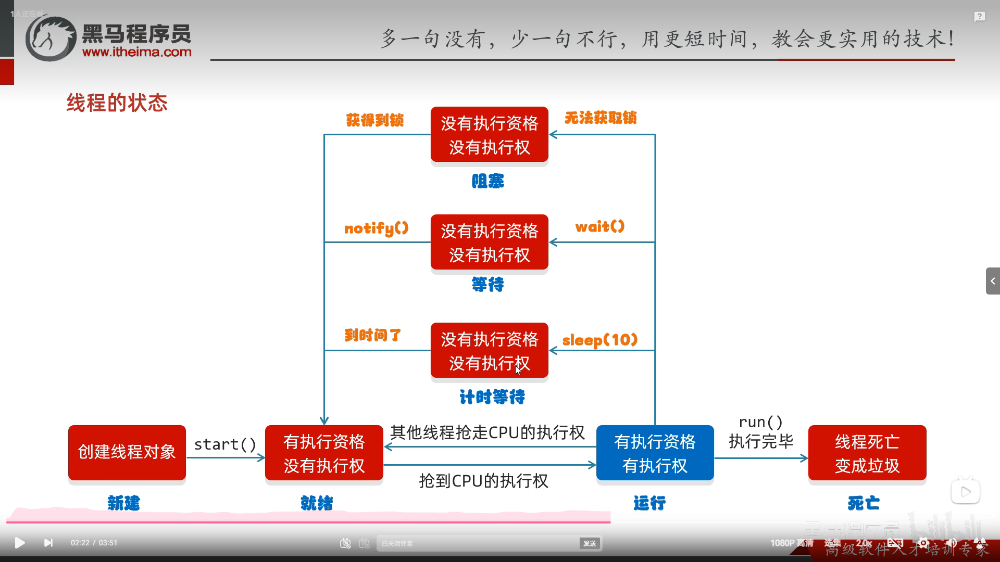


## 4. 线程池

### 4.1 线程状态介绍

当线程被创建并启动以后，它既不是一启动就进入了执行状态，也不是一直处于执行状态。线程对象在不同的时期有不同的状态。那么Java中的线程存在哪几种状态呢？Java中的线程

状态被定义在了java.lang.Thread.State枚举类中，State枚举类的源码如下：

```java
public class Thread {
    
    public enum State {
    
        /* 新建 */
        NEW , 

        /* 可运行状态 */
        RUNNABLE , 

        /* 阻塞状态 */
        BLOCKED , 

        /* 无限等待状态 */
        WAITING , 

        /* 计时等待 */
        TIMED_WAITING , 

        /* 终止 */
        TERMINATED;
    
	}
    
    // 获取当前线程的状态
    public State getState() {
        return jdk.internal.misc.VM.toThreadState(threadStatus);
    }
    
}
```

通过源码我们可以看到Java中的线程存在6种状态，每种线程状态的含义如下

| 线程状态      | 具体含义                                                     |
| ------------- | ------------------------------------------------------------ |
| NEW           | 一个尚未启动的线程的状态。也称之为初始状态、开始状态。线程刚被创建，但是并未启动。还没调用start方法。MyThread t = new MyThread()只有线程象，没有线程特征。 |
| RUNNABLE      | 当我们调用线程对象的start方法，那么此时线程对象进入了RUNNABLE状态。那么此时才是真正的在JVM进程中创建了一个线程，线程一经启动并不是立即得到执行，线程的运行与否要听令与CPU的调度，那么我们把这个中间状态称之为可执行状态(RUNNABLE)也就是说它具备执行的资格，但是并没有真正的执行起来而是在等待CPU的度。 |
| BLOCKED       | 当一个线程试图获取一个对象锁，而该对象锁被其他的线程持有，则该线程进入Blocked状态；当该线程持有锁时，该线程将变成Runnable状态。 |
| WAITING       | 一个正在等待的线程的状态。也称之为等待状态。造成线程等待的原因有两种，分别是调用Object.wait()、join()方法。处于等待状态的线程，正在等待其他线程去执行一个特定的操作。例如：因为wait()而等待的线程正在等待另一个线程去调用notify()或notifyAll()；一个因为join()而等待的线程正在等待另一个线程结束。 |
| TIMED_WAITING | 一个在限定时间内等待的线程的状态。也称之为限时等待状态。造成线程限时等待状态的原因有三种，分别是：Thread.sleep(long)，Object.wait(long)、join(long)。 |
| TERMINATED    | 一个完全运行完成的线程的状态。也称之为终止状态、结束状态     |

各个状态的转换，如下图所示：


### 4.2 线程池-基本原理

**概述 :** 

​	提到池，大家应该能想到的就是水池。水池就是一个容器，在该容器中存储了很多的水。那么什么是线程池呢？线程池也是可以看做成一个池子，在该池子中存储很多个线程。

线程池存在的意义：

​	系统创建一个线程的成本是比较高的，因为它涉及到与操作系统交互，当程序中需要创建大量生存期很短暂的线程时，频繁的创建和销毁线程对系统的资源消耗有可能大于业务处理是对系

​	统资源的消耗，这样就有点"舍本逐末"了。针对这一种情况，为了提高性能，我们就可以采用线程池。线程池在启动的时，会创建大量空闲线程，当我们向线程池提交任务的时，线程池就

​	会启动一个线程来执行该任务。等待任务执行完毕以后，线程并不会死亡，而是再次返回到线程池中称为空闲状态。等待下一次任务的执行。

**线程池的设计思路 :**

1. 准备一个任务容器
2. 一次性启动多个(2个)消费者线程
3. 刚开始任务容器是空的，所以线程都在wait
4. 直到一个外部线程向这个任务容器中扔了一个"任务"，就会有一个消费者线程被唤醒
5. 这个消费者线程取出"任务"，并且执行这个任务，执行完毕后，继续等待下一次任务的到来

### 4.3 线程池-Executors默认线程池

概述 : JDK对线程池也进行了相关的实现，在真实企业开发中我们也很少去自定义线程池，而是使用JDK中自带的线程池。

我们可以使用Executors中所提供的**静态**方法来创建线程池

​	static ExecutorService newCachedThreadPool()   创建一个默认的线程池
​	static newFixedThreadPool(int nThreads)	    创建一个指定最多线程数量的线程池

**代码实现 :** 

```java
package com.itheima.mythreadpool;


//static ExecutorService newCachedThreadPool()   创建一个默认的线程池
//static newFixedThreadPool(int nThreads)	    创建一个指定最多线程数量的线程池

import java.util.concurrent.ExecutorService;
import java.util.concurrent.Executors;

public class MyThreadPoolDemo {
    public static void main(String[] args) throws InterruptedException {

        //1,创建一个默认的线程池对象.池子中默认是空的.默认最多可以容纳int类型的最大值.
        ExecutorService executorService = Executors.newCachedThreadPool();
        //Executors --- 可以帮助我们创建线程池对象
        //ExecutorService --- 可以帮助我们控制线程池

        executorService.submit(()->{
            System.out.println(Thread.currentThread().getName() + "在执行了");
        });

        //Thread.sleep(2000);

        executorService.submit(()->{
            System.out.println(Thread.currentThread().getName() + "在执行了");
        });

        executorService.shutdown();
    }
}

```


### 4.4 线程池-Executors创建指定上限的线程池

**使用Executors中所提供的静态方法来创建线程池**

​	static ExecutorService newFixedThreadPool(int nThreads) : 创建一个指定最多线程数量的线程池

**代码实现 :** 

```java
package com.itheima.mythreadpool;

//static ExecutorService newFixedThreadPool(int nThreads)
//创建一个指定最多线程数量的线程池

import java.util.concurrent.ExecutorService;
import java.util.concurrent.Executors;
import java.util.concurrent.ThreadPoolExecutor;

public class MyThreadPoolDemo2 {
    public static void main(String[] args) {
        //参数不是初始值而是最大值
        ExecutorService executorService = Executors.newFixedThreadPool(10);

        ThreadPoolExecutor pool = (ThreadPoolExecutor) executorService;
        System.out.println(pool.getPoolSize());//0

        executorService.submit(()->{
            System.out.println(Thread.currentThread().getName() + "在执行了");
        });

        executorService.submit(()->{
            System.out.println(Thread.currentThread().getName() + "在执行了");
        });

        System.out.println(pool.getPoolSize());//2
//        executorService.shutdown();
    }
}

```


### 4.5 线程池-ThreadPoolExecutor

**创建线程池对象 :** 

ThreadPoolExecutor threadPoolExecutor = new ThreadPoolExecutor(核心线程数量,

​																															最大线程数量,
​																															空闲线程最大存活时间,

​																															任务队列,

​																															创建线程工厂,

​																															任务的拒绝策略);

**代码实现 :** 

```java
package com.itheima.mythreadpool;

import java.util.concurrent.ArrayBlockingQueue;
import java.util.concurrent.Executors;
import java.util.concurrent.ThreadPoolExecutor;
import java.util.concurrent.TimeUnit;

public class MyThreadPoolDemo3 {
//    参数一：核心线程数量
//    参数二：最大线程数
//    参数三：空闲线程最大存活时间
//    参数四：时间单位
//    参数五：任务队列
//    参数六：创建线程工厂
//    参数七：任务的拒绝策略
    public static void main(String[] args) {
        ThreadPoolExecutor pool = new ThreadPoolExecutor(2,5,2,TimeUnit.SECONDS,new ArrayBlockingQueue<>(10), Executors.defaultThreadFactory(),new ThreadPoolExecutor.AbortPolicy());
        pool.submit(new MyRunnable());
        pool.submit(new MyRunnable());

        pool.shutdown();
    }
}
```

### 4.6 自定义线程池-参数详解


```java
public ThreadPoolExecutor(int corePoolSize,
                              int maximumPoolSize,
                              long keepAliveTime,
                              TimeUnit unit,
                              BlockingQueue<Runnable> workQueue,
                              ThreadFactory threadFactory,
                              RejectedExecutionHandler handler)
    
corePoolSize：   核心线程的最大值，不能小于0
maximumPoolSize：最大线程数，不能小于等于0，maximumPoolSize >= corePoolSize
keepAliveTime：  空闲线程最大存活时间,不能小于0
unit：           时间单位
workQueue：      任务队列，不能为null
threadFactory：  创建线程工厂,不能为null      
handler：        任务的拒绝策略,不能为null  
```


### 4.7 线程池-非默认任务拒绝策略

!

RejectedExecutionHandler是jdk提供的一个任务拒绝策略接口，它下面存在4个子类。

```java
ThreadPoolExecutor.AbortPolicy: 		    丢弃任务并抛出RejectedExecutionException异常。是默认的策略。
ThreadPoolExecutor.DiscardPolicy： 		   丢弃任务，但是不抛出异常 这是不推荐的做法。
ThreadPoolExecutor.DiscardOldestPolicy：    抛弃队列中等待最久的任务 然后把当前任务加入队列中。
ThreadPoolExecutor.CallerRunsPolicy:        调用任务的run()方法绕过线程池直接执行。
```

注：明确线程池对多可执行的任务数 = 队列容量 + 最大线程数

**案例演示1**：演示ThreadPoolExecutor.AbortPolicy任务处理策略

```java
public class ThreadPoolExecutorDemo01 {

    public static void main(String[] args) {

        /**
         * 核心线程数量为1 ， 最大线程池数量为3, 任务容器的容量为1 ,空闲线程的最大存在时间为20s
         */
        ThreadPoolExecutor threadPoolExecutor = new ThreadPoolExecutor(1 , 3 , 20 , TimeUnit.SECONDS ,
                new ArrayBlockingQueue<>(1) , Executors.defaultThreadFactory() , new ThreadPoolExecutor.AbortPolicy()) ;

        // 提交5个任务，而该线程池最多可以处理4个任务，当我们使用AbortPolicy这个任务处理策略的时候，就会抛出异常
        for(int x = 0 ; x < 5 ; x++) {
            threadPoolExecutor.submit(() -> {
                System.out.println(Thread.currentThread().getName() + "---->> 执行了任务");
            });
        }
    }
}
```

**控制台输出结果**

```java
pool-1-thread-1---->> 执行了任务
pool-1-thread-3---->> 执行了任务
pool-1-thread-2---->> 执行了任务
pool-1-thread-3---->> 执行了任务
```

控制台报错，仅仅执行了4个任务，有一个任务被丢弃了


**案例演示2**：演示ThreadPoolExecutor.DiscardPolicy任务处理策略

```java
public class ThreadPoolExecutorDemo02 {
    public static void main(String[] args) {
        /**
         * 核心线程数量为1 ， 最大线程池数量为3, 任务容器的容量为1 ,空闲线程的最大存在时间为20s
         */
        ThreadPoolExecutor threadPoolExecutor = new ThreadPoolExecutor(1 , 3 , 20 , TimeUnit.SECONDS ,
                new ArrayBlockingQueue<>(1) , Executors.defaultThreadFactory() , new ThreadPoolExecutor.DiscardPolicy()) ;

        // 提交5个任务，而该线程池最多可以处理4个任务，当我们使用DiscardPolicy这个任务处理策略的时候，控制台不会报错
        for(int x = 0 ; x < 5 ; x++) {
            threadPoolExecutor.submit(() -> {
                System.out.println(Thread.currentThread().getName() + "---->> 执行了任务");
            });
        }
    }
}
```

**控制台输出结果**

```java
pool-1-thread-1---->> 执行了任务
pool-1-thread-1---->> 执行了任务
pool-1-thread-3---->> 执行了任务
pool-1-thread-2---->> 执行了任务
```

控制台没有报错，仅仅执行了4个任务，有一个任务被丢弃了


**案例演示3**：演示ThreadPoolExecutor.DiscardOldestPolicy任务处理策略

```java
public class ThreadPoolExecutorDemo02 {
    public static void main(String[] args) {
        /**
         * 核心线程数量为1 ， 最大线程池数量为3, 任务容器的容量为1 ,空闲线程的最大存在时间为20s
         */
        ThreadPoolExecutor threadPoolExecutor;
        threadPoolExecutor = new ThreadPoolExecutor(1 , 3 , 20 , TimeUnit.SECONDS ,
                new ArrayBlockingQueue<>(1) , Executors.defaultThreadFactory() , new ThreadPoolExecutor.DiscardOldestPolicy());
        // 提交5个任务
        for(int x = 0 ; x < 5 ; x++) {
            // 定义一个变量，来指定指定当前执行的任务;这个变量需要被final修饰
            final int y = x ;
            threadPoolExecutor.submit(() -> {
                System.out.println(Thread.currentThread().getName() + "---->> 执行了任务" + y);
            });     
        }
    }
}
```

**控制台输出结果**

```java
pool-1-thread-2---->> 执行了任务2
pool-1-thread-1---->> 执行了任务0
pool-1-thread-3---->> 执行了任务3
pool-1-thread-1---->> 执行了任务4
```

由于任务1在线程池中等待时间最长，因此任务1被丢弃。


**案例演示4**：演示ThreadPoolExecutor.CallerRunsPolicy任务处理策略

```java
public class ThreadPoolExecutorDemo04 {
    public static void main(String[] args) {

        /**
         * 核心线程数量为1 ， 最大线程池数量为3, 任务容器的容量为1 ,空闲线程的最大存在时间为20s
         */
        ThreadPoolExecutor threadPoolExecutor;
        threadPoolExecutor = new ThreadPoolExecutor(1 , 3 , 20 , TimeUnit.SECONDS ,
                new ArrayBlockingQueue<>(1) , Executors.defaultThreadFactory() , new ThreadPoolExecutor.CallerRunsPolicy());

        // 提交5个任务
        for(int x = 0 ; x < 5 ; x++) {
            threadPoolExecutor.submit(() -> {
                System.out.println(Thread.currentThread().getName() + "---->> 执行了任务");
            });
        }
    }
}
```

**控制台输出结果**

```java
pool-1-thread-1---->> 执行了任务
pool-1-thread-3---->> 执行了任务
pool-1-thread-2---->> 执行了任务
pool-1-thread-1---->> 执行了任务
main---->> 执行了任务
```

通过控制台的输出，我们可以看到次策略没有通过线程池中的线程执行任务，而是直接调用任务的run()方法绕过线程池直接执行。

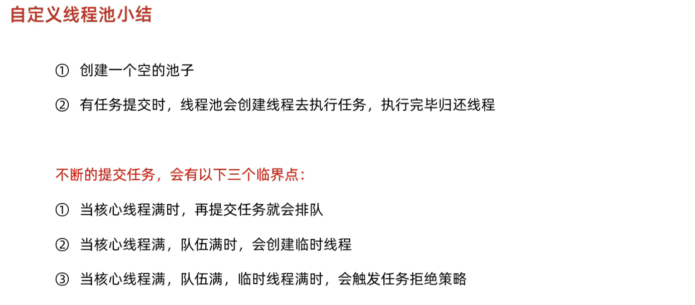

### 4.8 线程池多大合适

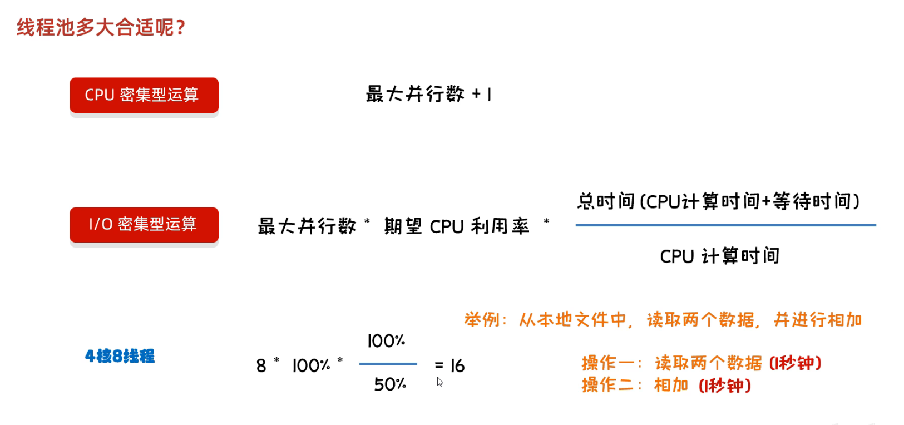

## 5.综合练习


```java
package com.Thread_test;

public class test01 {
    public static void main(String[] args) {
        Ticket ticket = new Ticket();
        Thread s1 = new Thread(ticket, "一号口");
        Thread s2 = new Thread(ticket, "二号口");
        s1.start();
        s2.start();
    }
}

class Ticket implements Runnable {

    private int ticket = 1000;

    @Override
    public void run() {
        while (true) {
            synchronized (Ticket.class){
                if (ticket == 0) {
                    break;
                } else {
                    ticket--;
                    try {
                        Thread.sleep(3000);
                    } catch (InterruptedException e) {
                        throw new RuntimeException(e);
                    }
                    System.out.println(Thread.currentThread().getName() + "正在售卖，还剩下" + ticket + "张票");
                }
            }
        }
    }
}

```


```java
public class GiftSender implements Runnable {
    private int gifts = 100; // 共享变量：总礼品数，初始100份

    @Override
    public void run() {
        while (true) {
            // 使用同步块确保线程安全，锁对象是当前实例(this)
            synchronized (this) {
                // 检查剩余礼品是否小于10份
                if (gifts < 10) {
                    System.out.println(Thread.currentThread().getName() + "停止发送，礼品不足10份");
                    break; // 退出循环
                } else {
                    // 发送一份礼品
                    gifts--; // 礼品数减1
                    System.out.println(Thread.currentThread().getName() + "发送一份礼品，剩余：" + gifts + "份");
                }
            }

            // 添加短暂延迟，模拟发送过程中的耗时
            try {
                Thread.sleep(50);
            } catch (InterruptedException e) {
                e.printStackTrace();
            }
        }
    }
}

public class Demo {
    public static void main(String[] args) {
        // 创建一个GiftSender任务实例（两个线程共享这一个实例）
        GiftSender sender = new GiftSender();

        // 创建两个线程，模拟两个人同时发送
        Thread t1 = new Thread(sender, "张三");
        Thread t2 = new Thread(sender, "李四");

        // 启动线程
        t1.start();
        t2.start();
    }
}
```


```java
class Count implements Runnable {
    private int i = 0;

    @Override
    public void run() {
        while (true) {
            synchronized (Count.class) {
                if (i <= 1000) {
                    if (i % 2 != 0) {
                        System.out.println(Thread.currentThread().getName() +"正在计数"+ i);
                    }
                    i++;
                } else {
                    break;
                }
            }
        }
    }
}
```

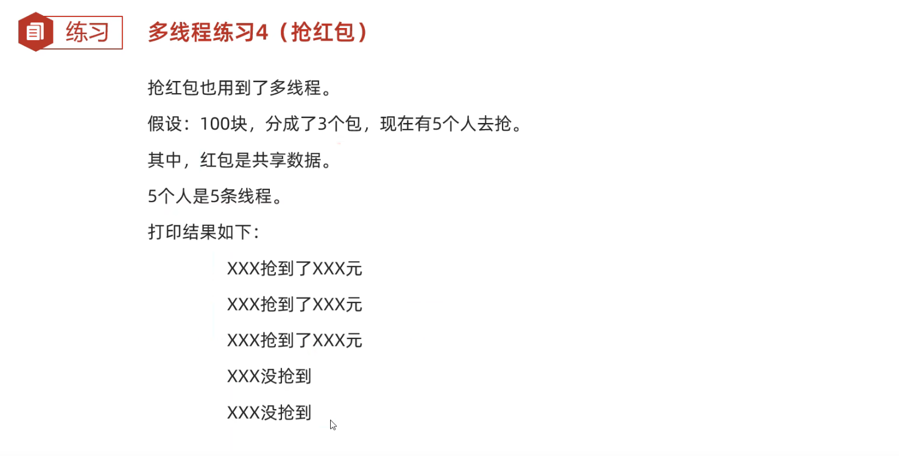

```java
package com.Thread_test;

import java.math.BigDecimal;
import java.math.RoundingMode;
import java.util.Random;

public class test04 {
    public static void main(String[] args) {
        PrizePocket prizePocket = new PrizePocket();
        new Thread(prizePocket,"t1").start();
        new Thread(prizePocket,"t2").start();
        new Thread(prizePocket,"t3").start();
        new Thread(prizePocket,"t4").start();
        new Thread(prizePocket,"t5").start();

    }
}

class PrizePocket implements Runnable{
    BigDecimal money=new BigDecimal("100.00");
    private double MIN=0.01;
    private int count=3;
    @Override
    public void run() {
        synchronized (PrizePocket.class){
            if(count==0){
                System.out.println(Thread.currentThread().getName()+"没抢到红包");
            }else{//准备抢红包
                double prize=0;
                if(count==1){
                    prize=money.doubleValue();//最后一个红包就是所有钱
                    System.out.println("这是最后一个红包噢"+Thread.currentThread().getName()+"抢到了"+prize+"元");
                    count--;
                }else{
                    //开始随机
                    /**
                     * 当前总金额，减去(剩余的红包个数 * 0.01)。为什么要这么做？这是为了确保在分了当前这个红包之后，
                     * 剩下的钱还足够让后面每个没抢的红包至少都有1分钱。
                     * 比如100元分5个，分给第一个人时，要确保后面4个人每人至少有1分钱，
                     * 所以第一个人最多能抢 100 - 4 * 0.01 = 99.96元。
                     */
                    Random random = new Random();
                    //允许分配的最大金额=money-(剩余红包数)*每个红包最小值0.01
                    BigDecimal maxMoney = money.subtract(new BigDecimal(count - 1).multiply(new BigDecimal("0.01")));
                    //生成当前红包的随机金额
                    BigDecimal RandomMoney = new BigDecimal("0.01")
                            .add(new BigDecimal(random.nextDouble()).multiply(maxMoney))
                            .setScale(2, RoundingMode.HALF_UP);
                    money=money.subtract(RandomMoney);
                    prize=RandomMoney.doubleValue();
                    count--;
                    System.out.println(Thread.currentThread().getName()+"抢到了"+prize+"元");
                }
            }
        }
    }
}

```


```java
package com.Thread_test;

import java.util.ArrayList;
import java.util.Collections;

public class test05 {
    public static void main(String[] args) {
        ArrayList<Integer> list = new ArrayList<>();
        Collections.addAll(list,10,5,20,700,100,30,40,0,0,0,10,10,10,10,20,20,20,20,20,1000);
        PrizeBocket prizeBocket = new PrizeBocket(list);
        new Thread(prizeBocket,"抽奖箱1").start();
        new Thread(prizeBocket,"抽奖箱2").start();

    }
}
class PrizeBocket implements Runnable{

    ArrayList<Integer> list;
    public PrizeBocket(ArrayList<Integer> list) {
        this.list = list;
    }
    @Override
    public void run() {
     while (true){
         synchronized (PrizeBocket.class){
             if(list.isEmpty()){
                 break;
             }else {
                 Collections.shuffle(list);
                 Integer prize = list.remove(0);
                 System.out.println(Thread.currentThread().getName()+"产生了一个"+prize+"奖励");
             }
         }
         try {
             Thread.sleep(200);
         } catch (InterruptedException e) {
             throw new RuntimeException(e);
         }
     }
    }
}

```


```java
package com.Thread_test;

import java.util.ArrayList;
import java.util.Collections;

public class test05 {
    public static void main(String[] args) {
        ArrayList<Integer> list = new ArrayList<>();
        Collections.addAll(list,10,20,30,40,50,60,70,80,90,100);
        PrizeBocket prizeBocket = new PrizeBocket(list);
        new Thread(prizeBocket,"抽奖箱1").start();
        new Thread(prizeBocket,"抽奖箱2").start();

    }
}
class PrizeBocket implements Runnable{

    ArrayList<Integer> list;
    //缺点：每多一个抽奖箱就要多创建一个arr 麻烦
    //新建抽奖箱1的集合储存器
    ArrayList<Integer> arr1=new ArrayList<>();
    //新建抽奖箱2的集合储存器
    ArrayList<Integer> arr2=new ArrayList<>();
    public PrizeBocket(ArrayList<Integer> list) {
        this.list = list;
    }
    @Override
    public void run() {
     while (true){
         synchronized (PrizeBocket.class){
             if(list.isEmpty()){
                 if("抽奖箱1".equals(Thread.currentThread().getName())){
                     System.out.println(arr1);
                 }else {
                     System.out.println(arr2);
                 }
                 break;
             }else {
                 Collections.shuffle(list);
                 Integer prize = list.remove(0);
                 if("抽奖箱1".equals(Thread.currentThread().getName())){
                     arr1.add(prize);
                 }else {
                     arr2.add(prize);
                 }
                 //System.out.println(Thread.currentThread().getName()+"产生了一个"+prize+"奖励");
             }
         }
         try {
             Thread.sleep(200);
         } catch (InterruptedException e) {
             throw new RuntimeException(e);
         }
     }
    }
}

```

缺点：每多一个抽奖箱就要多创建一个arr 麻烦

```java
package com.Thread_test;

import java.util.ArrayList;
import java.util.Collections;

public class test05 {
    public static void main(String[] args) {
        ArrayList<Integer> list = new ArrayList<>();
        Collections.addAll(list,10,20,30,40,50,60,70,80,90,100);
        PrizeBocket prizeBocket = new PrizeBocket(list);
        new Thread(prizeBocket,"抽奖箱1").start();
        new Thread(prizeBocket,"抽奖箱2").start();

    }
}
class PrizeBocket implements Runnable{

    ArrayList<Integer> list;
    //新建抽奖箱1的集合储存器
    //ArrayList<Integer> arr1=new ArrayList<>();
    //新建抽奖箱2的集合储存器
    //ArrayList<Integer> arr2=new ArrayList<>();
    public PrizeBocket(ArrayList<Integer> list) {
        this.list = list;
    }
    @Override
    public void run() {
        ArrayList<Integer> arr=new ArrayList<>();
     while (true){
         synchronized (PrizeBocket.class){
             if(list.isEmpty()){
                 System.out.println(Thread.currentThread().getName()+arr);
                 break;
             }else {
                 Collections.shuffle(list);
                 Integer prize = list.remove(0);
                 arr.add(prize);
                 //System.out.println(Thread.currentThread().getName()+"产生了一个"+prize+"奖励");
             }
         }
         try {
             Thread.sleep(200);
         } catch (InterruptedException e) {
             throw new RuntimeException(e);
         }
     }
    }
}
```

| 特性对比     | `ArrayList<Integer> arr = new ArrayList<>();`**放在 run 方法内（正确做法）** | `ArrayList<Integer> arr = new ArrayList<>();`**作为成员变量（错误做法）** |
| :----------- | :----------------------------------------------------------- | :----------------------------------------------------------- |
| **变量类型** | **局部变量**                                                 | **成员变量（实例变量）**                                     |
| **作用域**   | 仅限于其所在的 `run`方法内部 。                              | 在整个 `PrizeBocket`**类实例**内部可见。                     |
| **内存位置** | 存储于**线程栈**内存中。每个线程都有自己独立的栈空间 。      | 存储于**堆**内存中，与所属的对象实例在一起。                 |
| **共享性**   | **线程私有**。每个线程执行 `run`方法时，都会在各自的栈上创建**一个全新的、独立的** `arr`列表。它们互不相干 。 | **线程共享**。因为两个线程使用的是**同一个** `prizeBocket`实例，所以它们操作的是**堆中同一个** `arr`列表对象。 |
| **线程安全** | **天然线程安全**。因为数据不共享，不存在竞争条件，无需同步 。 | **非线程安全**。多个线程并发修改同一个集合，会导致数据错乱（如数据覆盖、丢失）或抛出异常 。 |
| **图示理解** | 每个线程有一个独立的抽奖袋。                                 | 所有线程共用一个公共的抽奖袋                                 |


```java
package com.Thread_test;

import java.util.ArrayList;
import java.util.Collections;
import java.util.concurrent.Callable;
import java.util.concurrent.ExecutionException;
import java.util.concurrent.FutureTask;

public class test07 {
    public static void main(String[] args) throws ExecutionException, InterruptedException {
        ArrayList<Integer> list = new ArrayList<>();
        Collections.addAll(list,10,20,30,40,50,60,70,80,90);
        MyCallable mc1 = new MyCallable(list);
        MyCallable mc2 = new MyCallable(list);
        FutureTask ft1 = new FutureTask(mc1);
        FutureTask ft2 = new FutureTask(mc2);
        Thread t1 = new Thread(ft1, "一");
        Thread t2 = new Thread(ft2, "二");
        t1.start();
        t2.start();
        int max1= (int) ft1.get();
        int max2= (int) ft2.get();
        System.out.println(max1);
        System.out.println(max2);
        System.out.println();
    }
}
class MyCallable implements Callable<Integer>{
    ArrayList<Integer> list;

    public MyCallable(ArrayList<Integer> list) {
        this.list = list;
    }

    @Override
    public Integer call() throws Exception {
        ArrayList<Integer> arr = new ArrayList<>();
        while (true){
            synchronized (MyCallable.class){
                if(list.isEmpty()){
                    break;
                }else{
                    Collections.shuffle(list);
                    Integer prize = list.remove(0);
                    arr.add(prize);
                }
            }
        }
        System.out.println(Thread.currentThread().getName()+arr);
        return Collections.max(arr);
    }
}

```

## 6. 原子性(面试再看)

### 6.1 volatile-问题

**代码分析 :** 

```java
package com.itheima.myvolatile;

public class Demo {
    public static void main(String[] args) {
        MyThread1 t1 = new MyThread1();
        t1.setName("小路同学");
        t1.start();

        MyThread2 t2 = new MyThread2();
        t2.setName("小皮同学");
        t2.start();
    }
}
```

```java
package com.itheima.myvolatile;

public class Money {
    public static int money = 100000;
}
```

```java
package com.itheima.myvolatile;

public class MyThread1 extends  Thread {
    @Override
    public void run() {
        while(Money.money == 100000){

        }

        System.out.println("结婚基金已经不是十万了");
    }
}

```

```java
package com.itheima.myvolatile;

public class MyThread2 extends Thread {
    @Override
    public void run() {
        try {
            Thread.sleep(10);
        } catch (InterruptedException e) {
            e.printStackTrace();
        }

        Money.money = 90000;
    }
}

```

**程序问题 :**  女孩虽然知道结婚基金是十万，但是当基金的余额发生变化的时候，女孩无法知道最新的余额。


### 6.2 volatile解决

**以上案例出现的问题 :**

​	当A线程修改了共享数据时，B线程没有及时获取到最新的值，如果还在使用原先的值，就会出现问题 

​	1，堆内存是唯一的，每一个线程都有自己的线程栈。

​	2 ，每一个线程在使用堆里面变量的时候，都会先拷贝一份到变量的副本中。

​	3 ，在线程中，每一次使用是从变量的副本中获取的。

**Volatile关键字 :** 强制线程每次在使用的时候，都会看一下共享区域最新的值

**代码实现 :** **使用volatile关键字解决**

```java
package com.itheima.myvolatile;

public class Demo {
    public static void main(String[] args) {
        MyThread1 t1 = new MyThread1();
        t1.setName("小路同学");
        t1.start();

        MyThread2 t2 = new MyThread2();
        t2.setName("小皮同学");
        t2.start();
    }
}
```

```java
package com.itheima.myvolatile;

public class Money {
    public static volatile int money = 100000;
}
```

```java
package com.itheima.myvolatile;

public class MyThread1 extends  Thread {
    @Override
    public void run() {
        while(Money.money == 100000){

        }

        System.out.println("结婚基金已经不是十万了");
    }
}

```

```java
package com.itheima.myvolatile;

public class MyThread2 extends Thread {
    @Override
    public void run() {
        try {
            Thread.sleep(10);
        } catch (InterruptedException e) {
            e.printStackTrace();
        }

        Money.money = 90000;
    }
}

```


### 6.3 synchronized解决

**synchronized解决 :** 

​	1 ，线程获得锁

​	2 ，清空变量副本

​	3 ，拷贝共享变量最新的值到变量副本中

​	4 ，执行代码

​	5 ，将修改后变量副本中的值赋值给共享数据

​	6 ，释放锁

**代码实现 :** 

```java
package com.itheima.myvolatile2;

public class Demo {
    public static void main(String[] args) {
        MyThread1 t1 = new MyThread1();
        t1.setName("小路同学");
        t1.start();

        MyThread2 t2 = new MyThread2();
        t2.setName("小皮同学");
        t2.start();
    }
}
```

```java
package com.itheima.myvolatile2;

public class Money {
    public static Object lock = new Object();
    public static volatile int money = 100000;
}
```

```java
package com.itheima.myvolatile2;

public class MyThread1 extends  Thread {
    @Override
    public void run() {
        while(true){
            synchronized (Money.lock){
                if(Money.money != 100000){
                    System.out.println("结婚基金已经不是十万了");
                    break;
                }
            }
        }
    }
}
```

```java
package com.itheima.myvolatile2;

public class MyThread2 extends Thread {
    @Override
    public void run() {
        synchronized (Money.lock) {
            try {
                Thread.sleep(10);
            } catch (InterruptedException e) {
                e.printStackTrace();
            }

            Money.money = 90000;
        }
    }
}
```


### 6.4 原子性

**概述 :** 所谓的原子性是指在一次操作或者多次操作中，要么所有的操作全部都得到了执行并且不会受到任何因素的干扰而中断，要么所有的操作都不执行，多个操作是一个不可以分割的整体。

**代码实现 :** 

```java
package com.itheima.threadatom;

public class AtomDemo {
    public static void main(String[] args) {
        MyAtomThread atom = new MyAtomThread();

        for (int i = 0; i < 100; i++) {
            new Thread(atom).start();
        }
    }
}
class MyAtomThread implements Runnable {
    private volatile int count = 0; //送冰淇淋的数量

    @Override
    public void run() {
        for (int i = 0; i < 100; i++) {
            //1,从共享数据中读取数据到本线程栈中.
            //2,修改本线程栈中变量副本的值
            //3,会把本线程栈中变量副本的值赋值给共享数据.
            count++;
            System.out.println("已经送了" + count + "个冰淇淋");
        }
    }
}
```

**代码总结 :** count++ 不是一个原子性操作, 他在执行的过程中,有可能被其他线程打断

### 6.5 volatile关键字不能保证原子性

解决方案 : 我们可以给count++操作添加锁，那么count++操作就是临界区中的代码，临界区中的代码一次只能被一个线程去执行，所以count++就变成了原子操作。

```java
package com.itheima.threadatom2;

public class AtomDemo {
    public static void main(String[] args) {
        MyAtomThread atom = new MyAtomThread();

        for (int i = 0; i < 100; i++) {
            new Thread(atom).start();
        }
    }
}
class MyAtomThread implements Runnable {
    private volatile int count = 0; //送冰淇淋的数量
    private Object lock = new Object();

    @Override
    public void run() {
        for (int i = 0; i < 100; i++) {
            //1,从共享数据中读取数据到本线程栈中.
            //2,修改本线程栈中变量副本的值
            //3,会把本线程栈中变量副本的值赋值给共享数据.
            synchronized (lock) {
                count++;
                System.out.println("已经送了" + count + "个冰淇淋");
            }
        }
    }
}
```


### 6.6 原子性_AtomicInteger

概述：java从JDK1.5开始提供了java.util.concurrent.atomic包(简称Atomic包)，这个包中的原子操作类提供了一种用法简单，性能高效，线程安全地更新一个变量的方式。因为变

量的类型有很多种，所以在Atomic包里一共提供了13个类，属于4种类型的原子更新方式，分别是原子更新基本类型、原子更新数组、原子更新引用和原子更新属性(字段)。本次我们只讲解

使用原子的方式更新基本类型，使用原子的方式更新基本类型Atomic包提供了以下3个类：

AtomicBoolean： 原子更新布尔类型

AtomicInteger：   原子更新整型

AtomicLong：	原子更新长整型

以上3个类提供的方法几乎一模一样，所以本节仅以AtomicInteger为例进行讲解，AtomicInteger的常用方法如下：

```java
public AtomicInteger()：	   			    初始化一个默认值为0的原子型Integer
public AtomicInteger(int initialValue)：  初始化一个指定值的原子型Integer

int get():   			 				获取值
int getAndIncrement():      			 以原子方式将当前值加1，注意，这里返回的是自增前的值。
int incrementAndGet():     				 以原子方式将当前值加1，注意，这里返回的是自增后的值。
int addAndGet(int data):				 以原子方式将输入的数值与实例中的值（AtomicInteger里的value）相加，并返回结果。
int getAndSet(int value):   			 以原子方式设置为newValue的值，并返回旧值。
```

**代码实现 :**

```java
package com.itheima.threadatom3;

import java.util.concurrent.atomic.AtomicInteger;

public class MyAtomIntergerDemo1 {
//    public AtomicInteger()：	               初始化一个默认值为0的原子型Integer
//    public AtomicInteger(int initialValue)： 初始化一个指定值的原子型Integer
    public static void main(String[] args) {
        AtomicInteger ac = new AtomicInteger();
        System.out.println(ac);

        AtomicInteger ac2 = new AtomicInteger(10);
        System.out.println(ac2);
    }

}
```

```java
package com.itheima.threadatom3;

import java.lang.reflect.Field;
import java.util.concurrent.atomic.AtomicInteger;

public class MyAtomIntergerDemo2 {
//    int get():   		 		获取值
//    int getAndIncrement():     以原子方式将当前值加1，注意，这里返回的是自增前的值。
//    int incrementAndGet():     以原子方式将当前值加1，注意，这里返回的是自增后的值。
//    int addAndGet(int data):	 以原子方式将参数与对象中的值相加，并返回结果。
//    int getAndSet(int value):  以原子方式设置为newValue的值，并返回旧值。
    public static void main(String[] args) {
//        AtomicInteger ac1 = new AtomicInteger(10);
//        System.out.println(ac1.get());

//        AtomicInteger ac2 = new AtomicInteger(10);
//        int andIncrement = ac2.getAndIncrement();
//        System.out.println(andIncrement);
//        System.out.println(ac2.get());

//        AtomicInteger ac3 = new AtomicInteger(10);
//        int i = ac3.incrementAndGet();
//        System.out.println(i);//自增后的值
//        System.out.println(ac3.get());

//        AtomicInteger ac4 = new AtomicInteger(10);
//        int i = ac4.addAndGet(20);
//        System.out.println(i);
//        System.out.println(ac4.get());

        AtomicInteger ac5 = new AtomicInteger(100);
        int andSet = ac5.getAndSet(20);
        System.out.println(andSet);
        System.out.println(ac5.get());
    }
}
```


### 6.7 AtomicInteger-内存解析

**AtomicInteger原理 :** 自旋锁  + CAS 算法

**CAS算法：**

​	有3个操作数（内存值V， 旧的预期值A，要修改的值B）

​	当旧的预期值A == 内存值   此时修改成功，将V改为B                 

​	当旧的预期值A！=内存值   此时修改失败，不做任何操作                 

​	并重新获取现在的最新值（这个重新获取的动作就是自旋）

### 6.8 AtomicInteger-源码解析

**代码实现 :**

```java
package com.itheima.threadatom4;

public class AtomDemo {
    public static void main(String[] args) {
        MyAtomThread atom = new MyAtomThread();

        for (int i = 0; i < 100; i++) {
            new Thread(atom).start();
        }
    }
}
```

```java
package com.itheima.threadatom4;

import java.util.concurrent.atomic.AtomicInteger;

public class MyAtomThread implements Runnable {
    //private volatile int count = 0; //送冰淇淋的数量
    //private Object lock = new Object();
    AtomicInteger ac = new AtomicInteger(0);

    @Override
    public void run() {
        for (int i = 0; i < 100; i++) {
            //1,从共享数据中读取数据到本线程栈中.
            //2,修改本线程栈中变量副本的值
            //3,会把本线程栈中变量副本的值赋值给共享数据.
            //synchronized (lock) {
//                count++;
//                ac++;
            int count = ac.incrementAndGet();
            System.out.println("已经送了" + count + "个冰淇淋");
           // }
        }
    }
}

```

**源码解析 :** 

```java
//先自增，然后获取自增后的结果
public final int incrementAndGet() {
        //+ 1 自增后的结果
        //this 就表示当前的atomicInteger（值）
        //1    自增一次
        return U.getAndAddInt(this, VALUE, 1) + 1;
}

public final int getAndAddInt(Object o, long offset, int delta) {
        //v 旧值
        int v;
        //自旋的过程
        do {
            //不断的获取旧值
            v = getIntVolatile(o, offset);
            //如果这个方法的返回值为false，那么继续自旋
            //如果这个方法的返回值为true，那么自旋结束
            //o 表示的就是内存值
            //v 旧值
            //v + delta 修改后的值
        } while (!weakCompareAndSetInt(o, offset, v, v + delta));
            //作用：比较内存中的值，旧值是否相等，如果相等就把修改后的值写到内存中，返回true。表示修改成功。
            //                                 如果不相等，无法把修改后的值写到内存中，返回false。表示修改失败。
            //如果修改失败，那么继续自旋。
        return v;
}
```


### 6.9 悲观锁和乐观锁

**synchronized和CAS的区别 :** 

**相同点：**在多线程情况下，都可以保证共享数据的安全性。

**不同点：**synchronized总是从最坏的角度出发，认为每次获取数据的时候，别人都有可能修改。所以在每                       次操作共享数据之前，都会上锁。（悲观锁）

​	cas是从乐观的角度出发，假设每次获取数据别人都不会修改，所以不会上锁。只不过在修改共享数据的时候，会检查一下，别人有没有修改过这个数据。

​	如果别人修改过，那么我再次获取现在最新的值。            

​	 如果别人没有修改过，那么我现在直接修改共享数据的值.(乐观锁）


## 7. 并发工具类(面试再看)

### 7.1 并发工具类-Hashtable

​	**Hashtable出现的原因 :** 在集合类中HashMap是比较常用的集合对象，但是HashMap是线程不安全的(多线程环境下可能会存在问题)。为了保证数据的安全性我们可以使用Hashtable，但是Hashtable的效率低下。

**代码实现 :** 

```java
package com.itheima.mymap;

import java.util.HashMap;
import java.util.Hashtable;

public class MyHashtableDemo {
    public static void main(String[] args) throws InterruptedException {
        Hashtable<String, String> hm = new Hashtable<>();

        Thread t1 = new Thread(() -> {
            for (int i = 0; i < 25; i++) {
                hm.put(i + "", i + "");
            }
        });


        Thread t2 = new Thread(() -> {
            for (int i = 25; i < 51; i++) {
                hm.put(i + "", i + "");
            }
        });

        t1.start();
        t2.start();

        System.out.println("----------------------------");
        //为了t1和t2能把数据全部添加完毕
        Thread.sleep(1000);

        //0-0 1-1 ..... 50- 50

        for (int i = 0; i < 51; i++) {
            System.out.println(hm.get(i + ""));
        }//0 1 2 3 .... 50


    }
}
```


### 7.2 并发工具类-ConcurrentHashMap基本使用

​	**ConcurrentHashMap出现的原因 :** 在集合类中HashMap是比较常用的集合对象，但是HashMap是线程不安全的(多线程环境下可能会存在问题)。为了保证数据的安全性我们可以使用Hashtable，但是Hashtable的效率低下。

基于以上两个原因我们可以使用JDK1.5以后所提供的ConcurrentHashMap。

**体系结构 :** 


**总结 :** 

​	1 ，HashMap是线程不安全的。多线程环境下会有数据安全问题

​	2 ，Hashtable是线程安全的，但是会将整张表锁起来，效率低下

​	3，ConcurrentHashMap也是线程安全的，效率较高。     在JDK7和JDK8中，底层原理不一样。

**代码实现 :** 

```java
package com.itheima.mymap;

import java.util.Hashtable;
import java.util.concurrent.ConcurrentHashMap;

public class MyConcurrentHashMapDemo {
    public static void main(String[] args) throws InterruptedException {
        ConcurrentHashMap<String, String> hm = new ConcurrentHashMap<>(100);

        Thread t1 = new Thread(() -> {
            for (int i = 0; i < 25; i++) {
                hm.put(i + "", i + "");
            }
        });


        Thread t2 = new Thread(() -> {
            for (int i = 25; i < 51; i++) {
                hm.put(i + "", i + "");
            }
        });

        t1.start();
        t2.start();

        System.out.println("----------------------------");
        //为了t1和t2能把数据全部添加完毕
        Thread.sleep(1000);

        //0-0 1-1 ..... 50- 50

        for (int i = 0; i < 51; i++) {
            System.out.println(hm.get(i + ""));
        }//0 1 2 3 .... 50
    }
}
```


### 7.3 并发工具类-ConcurrentHashMap1.7原理


### 7.4 并发工具类-ConcurrentHashMap1.8原理


**总结 :** 

​	1，如果使用空参构造创建ConcurrentHashMap对象，则什么事情都不做。     在第一次添加元素的时候创建哈希表

​	2，计算当前元素应存入的索引。

​	3，如果该索引位置为null，则利用cas算法，将本结点添加到数组中。

​	4，如果该索引位置不为null，则利用volatile关键字获得当前位置最新的结点地址，挂在他下面，变成链表。		

​	5，当链表的长度大于等于8时，自动转换成红黑树6，以链表或者红黑树头结点为锁对象，配合悲观锁保证多线程操作集合时数据的安全性

### 7.5 并发工具类-CountDownLatch

**CountDownLatch类 :** 		

| 方法                             | 解释                             |
| -------------------------------- | -------------------------------- |
| public CountDownLatch(int count) | 参数传递线程数，表示等待线程数量 |
| public void await()              | 让线程等待                       |
| public void countDown()          | 当前线程执行完毕                 |

**使用场景：** 让某一条线程等待其他线程执行完毕之后再执行

**代码实现 :** 

```java
package com.itheima.mycountdownlatch;

import java.util.concurrent.CountDownLatch;

public class ChileThread1 extends Thread {

    private CountDownLatch countDownLatch;
    public ChileThread1(CountDownLatch countDownLatch) {
        this.countDownLatch = countDownLatch;
    }

    @Override
    public void run() {
        //1.吃饺子
        for (int i = 1; i <= 10; i++) {
            System.out.println(getName() + "在吃第" + i + "个饺子");
        }
        //2.吃完说一声
        //每一次countDown方法的时候，就让计数器-1
        countDownLatch.countDown();
    }
}

```

```java
package com.itheima.mycountdownlatch;

import java.util.concurrent.CountDownLatch;

public class ChileThread2 extends Thread {

    private CountDownLatch countDownLatch;
    public ChileThread2(CountDownLatch countDownLatch) {
        this.countDownLatch = countDownLatch;
    }
    @Override
    public void run() {
        //1.吃饺子
        for (int i = 1; i <= 15; i++) {
            System.out.println(getName() + "在吃第" + i + "个饺子");
        }
        //2.吃完说一声
        //每一次countDown方法的时候，就让计数器-1
        countDownLatch.countDown();
    }
}

```

```java
package com.itheima.mycountdownlatch;

import java.util.concurrent.CountDownLatch;

public class ChileThread3 extends Thread {

    private CountDownLatch countDownLatch;
    public ChileThread3(CountDownLatch countDownLatch) {
        this.countDownLatch = countDownLatch;
    }
    @Override
    public void run() {
        //1.吃饺子
        for (int i = 1; i <= 20; i++) {
            System.out.println(getName() + "在吃第" + i + "个饺子");
        }
        //2.吃完说一声
        //每一次countDown方法的时候，就让计数器-1
        countDownLatch.countDown();
    }
}

```

```java
package com.itheima.mycountdownlatch;

import java.util.concurrent.CountDownLatch;

public class MotherThread extends Thread {
    private CountDownLatch countDownLatch;
    public MotherThread(CountDownLatch countDownLatch) {
        this.countDownLatch = countDownLatch;
    }

    @Override
    public void run() {
        //1.等待
        try {
            //当计数器变成0的时候，会自动唤醒这里等待的线程。
            countDownLatch.await();
        } catch (InterruptedException e) {
            e.printStackTrace();
        }
        //2.收拾碗筷
        System.out.println("妈妈在收拾碗筷");
    }
}

```

```java
package com.itheima.mycountdownlatch;

import java.util.concurrent.CountDownLatch;

public class MyCountDownLatchDemo {
    public static void main(String[] args) {
        //1.创建CountDownLatch的对象，需要传递给四个线程。
        //在底层就定义了一个计数器，此时计数器的值就是3
        CountDownLatch countDownLatch = new CountDownLatch(3);
        //2.创建四个线程对象并开启他们。
        MotherThread motherThread = new MotherThread(countDownLatch);
        motherThread.start();

        ChileThread1 t1 = new ChileThread1(countDownLatch);
        t1.setName("小明");

        ChileThread2 t2 = new ChileThread2(countDownLatch);
        t2.setName("小红");

        ChileThread3 t3 = new ChileThread3(countDownLatch);
        t3.setName("小刚");

        t1.start();
        t2.start();
        t3.start();
    }
}
```

**总结 :** 

​	1. CountDownLatch(int count)：参数写等待线程的数量。并定义了一个计数器。

​	2. await()：让线程等待，当计数器为0时，会唤醒等待的线程

​	3. countDown()： 线程执行完毕时调用，会将计数器-1。

### 3.6 并发工具类-Semaphore

**使用场景 :** 

​	可以控制访问特定资源的线程数量。

**实现步骤 :** 

​	1，需要有人管理这个通道

​	2，当有车进来了，发通行许可证

​	3，当车出去了，收回通行许可证

​	4，如果通行许可证发完了，那么其他车辆只能等着

**代码实现 :** 

```java
package com.itheima.mysemaphore;

import java.util.concurrent.Semaphore;

public class MyRunnable implements Runnable {
    //1.获得管理员对象，
    private Semaphore semaphore = new Semaphore(2);
    @Override
    public void run() {
        //2.获得通行证
        try {
            semaphore.acquire();
            //3.开始行驶
            System.out.println("获得了通行证开始行驶");
            Thread.sleep(2000);
            System.out.println("归还通行证");
            //4.归还通行证
            semaphore.release();
        } catch (InterruptedException e) {
            e.printStackTrace();
        }
    }
}

```

```java
package com.itheima.mysemaphore;

public class MySemaphoreDemo {
    public static void main(String[] args) {
        MyRunnable mr = new MyRunnable();

        for (int i = 0; i < 100; i++) {
            new Thread(mr).start();
        }
    }
}
```

# JAVA第22章随记_反射

## 1.1 反射的概述：

​	**专业的解释（了解一下）：**

​       是在运行状态中，对于任意一个类，都能够知道这个类的所有属性和方法；

​       对于任意一个对象，都能够调用它的任意属性和方法；

​       这种动态获取信息以及动态调用对象方法的功能称为Java语言的反射机制。

​	**通俗的理解：（掌握）**

* 利用**反射**创建的对象**可以无视修饰符**调用类里面的内容

* 可以跟**配置文件结合起来使用**，把要创建的对象信息和方法写在配置文件中。

  读取到什么类，就创建什么类的对象

  读取到什么方法，就调用什么方法

  此时当需求变更的时候不需要修改代码，只要修改配置文件即可。

## 1.2 学习反射到底学什么？

反射都是从class字节码文件中获取的内容。

* 如何获取class字节码文件的对象
* 利用反射如何获取构造方法（创建对象）
* 利用反射如何获取成员变量（赋值，获取值）
* 利用反射如何获取成员方法（运行）

## 1.3 获取字节码文件对象的三种方式

* Class这个类里面的静态方法forName（“全类名”）**（最常用）**
* 通过class属性获取  
* 通过对象获取字节码文件对象

代码示例：

```java
//1.Class这个类里面的静态方法forName
//Class.forName("类的全类名")： 全类名 = 包名 + 类名
Class clazz1 = Class.forName("com.itheima.reflectdemo.Student");
//源代码阶段获取 --- 先把Student加载到内存中，再获取字节码文件的对象
//clazz 就表示Student这个类的字节码文件对象。
//就是当Student.class这个文件加载到内存之后，产生的字节码文件对象


//2.通过class属性获取
//类名.class
Class clazz2 = Student.class;

//因为class文件在硬盘中是唯一的，所以，当这个文件加载到内存之后产生的对象也是唯一的
System.out.println(clazz1 == clazz2);//true


//3.通过Student对象获取字节码文件对象
Student s = new Student();
Class clazz3 = s.getClass();
System.out.println(clazz1 == clazz2);//true
System.out.println(clazz2 == clazz3);//true
```

## 1.4 字节码文件和字节码文件对象

java文件：就是我们自己编写的java代码。

字节码文件：就是通过java文件编译之后的class文件（是在硬盘上真实存在的，用眼睛能看到的）

字节码文件对象：当class文件加载到内存之后，虚拟机自动创建出来的对象。

​				这个对象里面至少包含了：构造方法，成员变量，成员方法。

而我们的反射获取的是什么？字节码文件对象，这个对象在内存中是唯一的。

## 1.5 获取构造方法

规则：

​	get表示获取

​	Declared表示私有

​	最后的s表示所有，复数形式

​	如果当前获取到的是私有的，必须要临时修改访问权限，否则无法使用

| 方法名                                                       | 说明                              |
| ------------------------------------------------------------ | --------------------------------- |
| Constructor<?>[] getConstructors()                           | 获得所有的构造（只能public修饰）  |
| Constructor<?>[] getDeclaredConstructors()                   | 获得所有的构造（包含private修饰） |
| Constructor<T> getConstructor(Class<?>... parameterTypes)    | 获取指定构造（只能public修饰）    |
| Constructor<T> getDeclaredConstructor(Class<?>... parameterTypes) | 获取指定构造（包含private修饰）   |

代码示例：

```java
public class ReflectDemo2 {
    public static void main(String[] args) throws ClassNotFoundException, NoSuchMethodException {
        //1.获得整体（class字节码文件对象）
        Class clazz = Class.forName("com.itheima.reflectdemo.Student");


        //2.获取构造方法对象
        //获取所有构造方法（public）
        Constructor[] constructors1 = clazz.getConstructors();
        for (Constructor constructor : constructors1) {
            System.out.println(constructor);
        }

        System.out.println("=======================");

        //获取所有构造（带私有的）
        Constructor[] constructors2 = clazz.getDeclaredConstructors();

        for (Constructor constructor : constructors2) {
            System.out.println(constructor);
        }
        System.out.println("=======================");

        //获取指定的空参构造
        Constructor con1 = clazz.getConstructor();
        System.out.println(con1);

        Constructor con2 = clazz.getConstructor(String.class,int.class);
        System.out.println(con2);

        System.out.println("=======================");
        //获取指定的构造(所有构造都可以获取到，包括public包括private)
        Constructor con3 = clazz.getDeclaredConstructor();
        System.out.println(con3);
        //了解 System.out.println(con3 == con1);
        //每一次获取构造方法对象的时候，都会新new一个。

        Constructor con4 = clazz.getDeclaredConstructor(String.class);
        System.out.println(con4);
    }
}
```

## 1.6 获取构造方法并创建对象

涉及到的方法：newInstance

代码示例：

```java
//首先要有一个javabean类
public class Student {
    private String name;

    private int age;


    public Student() {

    }

    public Student(String name) {
        this.name = name;
    }

    private Student(String name, int age) {
        this.name = name;
        this.age = age;
    }


    /**
     * 获取
     * @return name
     */
    public String getName() {
        return name;
    }

    /**
     * 设置
     * @param name
     */
    public void setName(String name) {
        this.name = name;
    }

    /**
     * 获取
     * @return age
     */
    public int getAge() {
        return age;
    }

    /**
     * 设置
     * @param age
     */
    public void setAge(int age) {
        this.age = age;
    }

    public String toString() {
        return "Student{name = " + name + ", age = " + age + "}";
    }
}


//测试类中的代码：
//需求1：
//获取空参，并创建对象

//1.获取整体的字节码文件对象
Class clazz = Class.forName("com.itheima.a02reflectdemo1.Student");
//2.获取空参的构造方法
Constructor con = clazz.getConstructor();
//3.利用空参构造方法创建对象
Student stu = (Student) con.newInstance();
System.out.println(stu);


System.out.println("=============================================");


//测试类中的代码：
//需求2：
//获取带参构造，并创建对象
//1.获取整体的字节码文件对象
Class clazz = Class.forName("com.itheima.a02reflectdemo1.Student");
//2.获取有参构造方法
Constructor con = clazz.getDeclaredConstructor(String.class, int.class);
//3.临时修改构造方法的访问权限（暴力反射）
con.setAccessible(true);
//4.直接创建对象
Student stu = (Student) con.newInstance("zhangsan", 23);
System.out.println(stu);
```

## 1.7 获取成员变量

规则：

​	get表示获取

​	Declared表示私有

​	最后的s表示所有，复数形式

​	如果当前获取到的是私有的，必须要临时修改访问权限，否则无法使用

方法名：

| 方法名                              | 说明                                         |
| ----------------------------------- | -------------------------------------------- |
| Field[] getFields()                 | 返回所有成员变量对象的数组（只能拿public的） |
| Field[] getDeclaredFields()         | 返回所有成员变量对象的数组，存在就能拿到     |
| Field getField(String name)         | 返回单个成员变量对象（只能拿public的）       |
| Field getDeclaredField(String name) | 返回单个成员变量对象，存在就能拿到           |

代码示例：

```java
public class ReflectDemo4 {
    public static void main(String[] args) throws ClassNotFoundException, NoSuchFieldException {
        //获取成员变量对象

        //1.获取class对象
        Class clazz = Class.forName("com.itheima.reflectdemo.Student");

        //2.获取成员变量的对象（Field对象)只能获取public修饰的
        Field[] fields1 = clazz.getFields();
        for (Field field : fields1) {
            System.out.println(field);
        }

        System.out.println("===============================");

        //获取成员变量的对象（public + private）
        Field[] fields2 = clazz.getDeclaredFields();
        for (Field field : fields2) {
            System.out.println(field);
        }

        System.out.println("===============================");
        //获得单个成员变量对象
        //如果获取的属性是不存在的，那么会报异常
        //Field field3 = clazz.getField("aaa");
        //System.out.println(field3);//NoSuchFieldException

        Field field4 = clazz.getField("gender");
        System.out.println(field4);

        System.out.println("===============================");
        //获取单个成员变量（私有）
        Field field5 = clazz.getDeclaredField("name");
        System.out.println(field5);

    }
}


public class Student {
    private String name;

    private int age;

    public String gender;

    public String address;


    public Student() {
    }

    public Student(String name, int age, String address) {
        this.name = name;
        this.age = age;
        this.address = address;
    }


    public Student(String name, int age, String gender, String address) {
        this.name = name;
        this.age = age;
        this.gender = gender;
        this.address = address;
    }

    /**
     * 获取
     * @return name
     */
    public String getName() {
        return name;
    }

    /**
     * 设置
     * @param name
     */
    public void setName(String name) {
        this.name = name;
    }

    /**
     * 获取
     * @return age
     */
    public int getAge() {
        return age;
    }

    /**
     * 设置
     * @param age
     */
    public void setAge(int age) {
        this.age = age;
    }

    /**
     * 获取
     * @return gender
     */
    public String getGender() {
        return gender;
    }

    /**
     * 设置
     * @param gender
     */
    public void setGender(String gender) {
        this.gender = gender;
    }

    /**
     * 获取
     * @return address
     */
    public String getAddress() {
        return address;
    }

    /**
     * 设置
     * @param address
     */
    public void setAddress(String address) {
        this.address = address;
    }

    public String toString() {
        return "Student{name = " + name + ", age = " + age + ", gender = " + gender + ", address = " + address + "}";
    }
}

```

## 1.8 获取成员变量并获取值和修改值

| 方法                                | 说明   |
| ----------------------------------- | ------ |
| void set(Object obj, Object value） | 赋值   |
| Object get(Object obj)              | 获取值 |

代码示例：

```java
public class ReflectDemo5 {
    public static void main(String[] args) throws ClassNotFoundException, NoSuchFieldException, IllegalAccessException {
        Student s = new Student("zhangsan",23,"广州");
        Student ss = new Student("lisi",24,"北京");

        //需求：
        //利用反射获取成员变量并获取值和修改值

        //1.获取class对象
        Class clazz = Class.forName("com.itheima.reflectdemo.Student");

        //2.获取name成员变量
        //field就表示name这个属性的对象
        Field field = clazz.getDeclaredField("name");
        //临时修饰他的访问权限
        field.setAccessible(true);

        //3.设置(修改)name的值
        //参数一：表示要修改哪个对象的name？
        //参数二：表示要修改为多少？
        field.set(s,"wangwu");

        //3.获取name的值
        //表示我要获取这个对象的name的值
        String result = (String)field.get(s);

        //4.打印结果
        System.out.println(result);

        System.out.println(s);
        System.out.println(ss);

    }
}


public class Student {
    private String name;
    private int age;
    public String gender;
    public String address;


    public Student() {
    }

    public Student(String name, int age, String address) {
        this.name = name;
        this.age = age;
        this.address = address;
    }


    public Student(String name, int age, String gender, String address) {
        this.name = name;
        this.age = age;
        this.gender = gender;
        this.address = address;
    }

    /**
     * 获取
     * @return name
     */
    public String getName() {
        return name;
    }

    /**
     * 设置
     * @param name
     */
    public void setName(String name) {
        this.name = name;
    }

    /**
     * 获取
     * @return age
     */
    public int getAge() {
        return age;
    }

    /**
     * 设置
     * @param age
     */
    public void setAge(int age) {
        this.age = age;
    }

    /**
     * 获取
     * @return gender
     */
    public String getGender() {
        return gender;
    }

    /**
     * 设置
     * @param gender
     */
    public void setGender(String gender) {
        this.gender = gender;
    }

    /**
     * 获取
     * @return address
     */
    public String getAddress() {
        return address;
    }

    /**
     * 设置
     * @param address
     */
    public void setAddress(String address) {
        this.address = address;
    }

    public String toString() {
        return "Student{name = " + name + ", age = " + age + ", gender = " + gender + ", address = " + address + "}";
    }
}

```

## 1.9 获取成员方法

规则：

​	get表示获取

​	Declared表示私有

​	最后的s表示所有，复数形式

​	如果当前获取到的是私有的，必须要临时修改访问权限，否则无法使用

| 方法名                                                       | 说明                                         |
| ------------------------------------------------------------ | -------------------------------------------- |
| Method[] getMethods()                                        | 返回所有成员方法对象的数组（只能拿public的） |
| Method[] getDeclaredMethods()                                | 返回所有成员方法对象的数组，存在就能拿到     |
| Method getMethod(String name, Class<?>... parameterTypes)    | 返回单个成员方法对象（只能拿public的）       |
| Method getDeclaredMethod(String name, Class<?>... parameterTypes) | 返回单个成员方法对象，存在就能拿到           |

代码示例：

```java
public class ReflectDemo6 {
    public static void main(String[] args) throws ClassNotFoundException, NoSuchMethodException {
        //1.获取class对象
        Class<?> clazz = Class.forName("com.itheima.reflectdemo.Student");


        //2.获取方法
        //getMethods可以获取父类中public修饰的方法
        Method[] methods1 = clazz.getMethods();
        for (Method method : methods1) {
            System.out.println(method);
        }

        System.out.println("===========================");
        //获取所有的方法（包含私有）
        //但是只能获取自己类中的方法
        Method[] methods2 = clazz.getDeclaredMethods();
        for (Method method : methods2) {
            System.out.println(method);
        }

        System.out.println("===========================");
        //获取指定的方法（空参）
        Method method3 = clazz.getMethod("sleep");
        System.out.println(method3);

        Method method4 = clazz.getMethod("eat",String.class);
        System.out.println(method4);

        //获取指定的私有方法
        Method method5 = clazz.getDeclaredMethod("playGame");
        System.out.println(method5);
    }
}

```

## 1.10 获取成员方法并运行

方法

 Object invoke(Object obj, Object... args) ：运行方法

参数一：用obj对象调用该方法

参数二：调用方法的传递的参数（如果没有就不写）

返回值：方法的返回值（如果没有就不写）

代码示例：

```java
package com.itheima.a02reflectdemo1;

import java.lang.reflect.InvocationTargetException;
import java.lang.reflect.Method;

public class ReflectDemo6 {
    public static void main(String[] args) throws ClassNotFoundException, NoSuchMethodException, InvocationTargetException, IllegalAccessException {
        //1.获取字节码文件对象
        Class clazz = Class.forName("com.itheima.a02reflectdemo1.Student");
		
        //2.获取一个对象
        //需要用这个对象去调用方法
        Student s = new Student();
        
        //3.获取一个指定的方法
        //参数一：方法名
        //参数二：参数列表，如果没有可以不写
        Method eatMethod = clazz.getMethod("eat",String.class);
        
        //运行
        //参数一：表示方法的调用对象
        //参数二：方法在运行时需要的实际参数
        //注意点：如果方法有返回值，那么需要接收invoke的结果
        //如果方法没有返回值，则不需要接收
        String result = (String) eatMethod.invoke(s, "重庆小面");
        System.out.println(result);

    }
}


public class Student {
    private String name;
    private int age;
    public String gender;
    public String address;


    public Student() {

    }

    public Student(String name) {
        this.name = name;
    }

    private Student(String name, int age) {
        this.name = name;
        this.age = age;
    }

    /**
     * 获取
     * @return name
     */
    public String getName() {
        return name;
    }

    /**
     * 设置
     * @param name
     */
    public void setName(String name) {
        this.name = name;
    }

    /**
     * 获取
     * @return age
     */
    public int getAge() {
        return age;
    }

    /**
     * 设置
     * @param age
     */
    public void setAge(int age) {
        this.age = age;
    }

    public String toString() {
        return "Student{name = " + name + ", age = " + age + "}";
    }

    private void study(){
        System.out.println("学生在学习");
    }

    private void sleep(){
        System.out.println("学生在睡觉");
    }

    public String eat(String something){
        System.out.println("学生在吃" + something);
        return "学生已经吃完了，非常happy";
    }
}
```

## 面试题：

​	你觉得反射好不好？好，有两个方向

​	第一个方向：无视修饰符访问类中的内容。但是这种操作在开发中一般不用，都是框架底层来用的。

​	第二个方向：反射可以跟配置文件结合起来使用，动态的创建对象，动态的调用方法。

## 1.11 练习泛型擦除（掌握概念，了解代码）

理解：（掌握）

​	集合中的泛型只在java文件中存在，当编译成class文件之后，就没有泛型了。

代码示例：（了解）

```java
package com.itheima.reflectdemo;

import java.lang.reflect.InvocationTargetException;
import java.lang.reflect.Method;
import java.util.ArrayList;

public class ReflectDemo8 {
    public static void main(String[] args) throws NoSuchMethodException, InvocationTargetException, IllegalAccessException {
        //1.创建集合对象
        ArrayList<Integer> list = new ArrayList<>();
        list.add(123);
//        list.add("aaa");

        //2.利用反射运行add方法去添加字符串
        //因为反射使用的是class字节码文件

        //获取class对象
        Class clazz = list.getClass();

        //获取add方法对象
        Method method = clazz.getMethod("add", Object.class);

        //运行方法
        method.invoke(list,"aaa");

        //打印集合
        System.out.println(list);
    }
}

```

## 1.12 练习：修改字符串的内容（掌握概念，了解代码）

在这个练习中，我需要你掌握的是字符串不能修改的真正原因。

字符串，在底层是一个byte类型的字节数组，名字叫做value

```java
private final byte[] value;
```

真正不能被修改的原因：final和private

final修饰value表示value记录的地址值不能修改。

private修饰value而且没有对外提供getvalue和setvalue的方法。所以，在外界不能获取或修改value记录的地址值。

如果要强行修改可以用反射：

代码示例：（了解）

```java
String s = "abc";
String ss = "abc";
// private final byte[] value= {97,98,99};
// 没有对外提供getvalue和setvalue的方法，不能修改value记录的地址值
// 如果我们利用反射获取了value的地址值。
// 也是可以修改的，final修饰的value
// 真正不可变的value数组的地址值，里面的内容利用反射还是可以修改的，比较危险

//1.获取class对象
Class clazz = s.getClass();

//2.获取value成员变量（private）
Field field = clazz.getDeclaredField("value");
//但是这种操作非常危险
//JDK高版本已经屏蔽了这种操作，低版本还是可以的
//临时修改权限
field.setAccessible(true);

//3.获取value记录的地址值
byte[] bytes = (byte[]) field.get(s);
bytes[0] = 100;

System.out.println(s);//dbc
System.out.println(ss);//dbc
```

## 1.13 练习，反射和配置文件结合动态获取的练习（重点）

需求: 利用反射根据文件中的不同类名和方法名，创建不同的对象并调用方法。

分析:

①通过Properties加载配置文件

②得到类名和方法名

③通过类名反射得到Class对象

④通过Class对象创建一个对象

⑤通过Class对象得到方法

⑥调用方法

代码示例：

```java
public class ReflectDemo9 {
    public static void main(String[] args) throws IOException, ClassNotFoundException, NoSuchMethodException, InvocationTargetException, InstantiationException, IllegalAccessException {
        //1.读取配置文件的信息
        Properties prop = new Properties();
        FileInputStream fis = new FileInputStream("day14-code\\prop.properties");
        prop.load(fis);
        fis.close();
        System.out.println(prop);

        String classname = prop.get("classname") + "";
        String methodname = prop.get("methodname") + "";

        //2.获取字节码文件对象
        Class clazz = Class.forName(classname);

        //3.要先创建这个类的对象
        Constructor con = clazz.getDeclaredConstructor();
        con.setAccessible(true);
        Object o = con.newInstance();
        System.out.println(o);

        //4.获取方法的对象
        Method method = clazz.getDeclaredMethod(methodname);
        method.setAccessible(true);

        //5.运行方法
        method.invoke(o);


    }
}

配置文件中的信息：
classname=com.itheima.a02reflectdemo1.Student
methodname=sleep
```

## 1.14 利用发射保存对象中的信息（重点）

```java
public class MyReflectDemo {
    public static void main(String[] args) throws IllegalAccessException, IOException {
    /*
        对于任意一个对象，都可以把对象所有的字段名和值，保存到文件中去
    */
       Student s = new Student("小A",23,'女',167.5,"睡觉");
       Teacher t = new Teacher("播妞",10000);
       saveObject(s);
    }

    //把对象里面所有的成员变量名和值保存到本地文件中
    public static void saveObject(Object obj) throws IllegalAccessException, IOException {
        //1.获取字节码文件的对象
        Class clazz = obj.getClass();
        //2. 创建IO流
        BufferedWriter bw = new BufferedWriter(new FileWriter("myreflect\\a.txt"));
        //3. 获取所有的成员变量
        Field[] fields = clazz.getDeclaredFields();
        for (Field field : fields) {
            field.setAccessible(true);
            //获取成员变量的名字
            String name = field.getName();
            //获取成员变量的值
            Object value = field.get(obj);
            //写出数据
            bw.write(name + "=" + value);
            bw.newLine();
        }

        bw.close();

    }
}
```

```java
public class Student {
    private String name;
    private int age;
    private char gender;
    private double height;
    private String hobby;

    public Student() {
    }

    public Student(String name, int age, char gender, double height, String hobby) {
        this.name = name;
        this.age = age;
        this.gender = gender;
        this.height = height;
        this.hobby = hobby;
    }

    /**
     * 获取
     * @return name
     */
    public String getName() {
        return name;
    }

    /**
     * 设置
     * @param name
     */
    public void setName(String name) {
        this.name = name;
    }

    /**
     * 获取
     * @return age
     */
    public int getAge() {
        return age;
    }

    /**
     * 设置
     * @param age
     */
    public void setAge(int age) {
        this.age = age;
    }

    /**
     * 获取
     * @return gender
     */
    public char getGender() {
        return gender;
    }

    /**
     * 设置
     * @param gender
     */
    public void setGender(char gender) {
        this.gender = gender;
    }

    /**
     * 获取
     * @return height
     */
    public double getHeight() {
        return height;
    }

    /**
     * 设置
     * @param height
     */
    public void setHeight(double height) {
        this.height = height;
    }

    /**
     * 获取
     * @return hobby
     */
    public String getHobby() {
        return hobby;
    }

    /**
     * 设置
     * @param hobby
     */
    public void setHobby(String hobby) {
        this.hobby = hobby;
    }

    public String toString() {
        return "Student{name = " + name + ", age = " + age + ", gender = " + gender + ", height = " + height + ", hobby = " + hobby + "}";
    }
}
```

```java
public class Teacher {
    private String name;
    private double salary;

    public Teacher() {
    }

    public Teacher(String name, double salary) {
        this.name = name;
        this.salary = salary;
    }

    /**
     * 获取
     * @return name
     */
    public String getName() {
        return name;
    }

    /**
     * 设置
     * @param name
     */
    public void setName(String name) {
        this.name = name;
    }

    /**
     * 获取
     * @return salary
     */
    public double getSalary() {
        return salary;
    }

    /**
     * 设置
     * @param salary
     */
    public void setSalary(double salary) {
        this.salary = salary;
    }

    public String toString() {
        return "Teacher{name = " + name + ", salary = " + salary + "}";
    }
}

```

# JAVA第23章随记_动态代理

## 2.1 好处：

​	无侵入式的给方法增强功能

## 2.2 动态代理三要素：

1，真正干活的对象

2，代理对象

3，利用代理调用方法

切记一点：代理可以增强或者拦截的方法都在接口中，接口需要写在newProxyInstance的第二个参数里。

## 2.3 代码实现：

```java
public class Test {
    public static void main(String[] args) {
    /*
        需求：
            外面的人想要大明星唱一首歌
             1. 获取代理的对象
                代理对象 = ProxyUtil.createProxy(大明星的对象);
             2. 再调用代理的唱歌方法
                代理对象.唱歌的方法("只因你太美");
     */
        //1. 获取代理的对象
        BigStar bigStar = new BigStar("鸡哥");
        Star proxy = ProxyUtil.createProxy(bigStar);

        //2. 调用唱歌的方法
        String result = proxy.sing("只因你太美");
        System.out.println(result);
    }
}
```

```java
/*
*
* 类的作用：
*       创建一个代理
*
* */
public class ProxyUtil {
    /*
    *
    * 方法的作用：
    *       给一个明星的对象，创建一个代理
    *
    *  形参：
    *       被代理的明星对象
    *
    *  返回值：
    *       给明星创建的代理
    *
    *
    *
    * 需求：
    *   外面的人想要大明星唱一首歌
    *   1. 获取代理的对象
    *      代理对象 = ProxyUtil.createProxy(大明星的对象);
    *   2. 再调用代理的唱歌方法
    *      代理对象.唱歌的方法("只因你太美");
    * */
    public static Star createProxy(BigStar bigStar){
       /* java.lang.reflect.Proxy类：提供了为对象产生代理对象的方法：

        public static Object newProxyInstance(ClassLoader loader, Class<?>[] interfaces, InvocationHandler h)
        参数一：用于指定用哪个类加载器，去加载生成的代理类
        参数二：指定接口，这些接口用于指定生成的代理长什么，也就是有哪些方法
        参数三：用来指定生成的代理对象要干什么事情*/
        Star star = (Star) Proxy.newProxyInstance(
                ProxyUtil.class.getClassLoader(),//参数一：用于指定用哪个类加载器，去加载生成的代理类
                new Class[]{Star.class},//参数二：指定接口，这些接口用于指定生成的代理长什么，也就是有哪些方法
                //参数三：用来指定生成的代理对象要干什么事情
                new InvocationHandler() {
                    @Override
                    public Object invoke(Object proxy, Method method, Object[] args) throws Throwable {
                        /*
                        * 参数一：代理的对象
                        * 参数二：要运行的方法 sing
                        * 参数三：调用sing方法时，传递的实参
                        * */
                        if("sing".equals(method.getName())){
                            System.out.println("准备话筒，收钱");
                        }else if("dance".equals(method.getName())){
                            System.out.println("准备场地，收钱");
                        }
                        //去找大明星开始唱歌或者跳舞
                        //代码的表现形式：调用大明星里面唱歌或者跳舞的方法
                        return method.invoke(bigStar,args);
                    }
                }
        );
        return star;
    }
}
```

```java
public interface Star {
    //我们可以把所有想要被代理的方法定义在接口当中
    //唱歌
    public abstract String sing(String name);
    //跳舞
    public abstract void dance();
}
```

```java
public class BigStar implements Star {
    private String name;


    public BigStar() {
    }

    public BigStar(String name) {
        this.name = name;
    }

    //唱歌
    @Override
    public String sing(String name){
        System.out.println(this.name + "正在唱" + name);
        return "谢谢";
    }

    //跳舞
    @Override
    public void dance(){
        System.out.println(this.name + "正在跳舞");
    }

    /**
     * 获取
     * @return name
     */
    public String getName() {
        return name;
    }

    /**
     * 设置
     * @param name
     */
    public void setName(String name) {
        this.name = name;
    }

    public String toString() {
        return "BigStar{name = " + name + "}";
    }
}

```

## 2.4 额外扩展

动态代理，还可以拦截方法

比如：

​	在这个故事中，经济人作为代理，如果别人让邀请大明星去唱歌，打篮球，经纪人就增强功能。

​	但是如果别人让大明星去扫厕所，经纪人就要拦截，不会去调用大明星的方法。

```java
/*
* 类的作用：
*       创建一个代理
* */
public class ProxyUtil {
    public static Star createProxy(BigStar bigStar){
        public static Object newProxyInstance(ClassLoader loader, Class<?>[] interfaces, InvocationHandler h)
        Star star = (Star) Proxy.newProxyInstance(
                ProxyUtil.class.getClassLoader(),
                new Class[]{Star.class},
                new InvocationHandler() {
                    @Override
                    public Object invoke(Object proxy, Method method, Object[] args) throws Throwable {
                        if("cleanWC".equals(method.getName())){
                            System.out.println("拦截，不调用大明星的方法");
                            return null;
                        }
                        //如果是其他方法，正常执行
                        return method.invoke(bigStar,args);
                    }
                }
        );
        return star;
    }
}
```

## 2.5 动态代理的练习

​	 对add方法进行增强，对remove方法进行拦截，对其他方法不拦截也不增强

```java
public class MyProxyDemo1 {
    public static void main(String[] args) {
        //动态代码可以增强也可以拦截
        //1.创建真正干活的人
        ArrayList<String> list = new ArrayList<>();

        //2.创建代理对象
        //参数一：类加载器。当前类名.class.getClassLoader()
        //                 找到是谁，把当前的类，加载到内存中了，我再麻烦他帮我干一件事情，把后面的代理类，也加载到内存

        //参数二：是一个数组，在数组里面写接口的字节码文件对象。
        //                  如果写了List，那么表示代理，可以代理List接口里面所有的方法，对这些方法可以增强或者拦截
        //                  但是，一定要写ArrayList真实实现的接口
        //                  假设在第二个参数中，写了MyInter接口，那么是错误的。
        //                  因为ArrayList并没有实现这个接口，那么就无法对这个接口里面的方法，进行增强或拦截
        //参数三：用来创建代理对象的匿名内部类
        List proxyList = (List) Proxy.newProxyInstance(
                //参数一：类加载器
                MyProxyDemo1.class.getClassLoader(),
                //参数二：是一个数组，表示代理对象能代理的方法范围
                new Class[]{List.class},
                //参数三：本质就是代理对象
                new InvocationHandler() {
                    @Override
                    //invoke方法参数的意义
                    //参数一：表示代理对象，一般不用（了解）
                    //参数二：就是方法名，我们可以对方法名进行判断，是增强还是拦截
                    //参数三：就是下面第三步调用方法时，传递的参数。
                    //举例1：
                    //list.add("阿玮好帅");
                    //此时参数二就是add这个方法名
                    //此时参数三 args[0] 就是 阿玮好帅
                    //举例2：
                    //list.set(1, "aaa");
                    //此时参数二就是set这个方法名
                    //此时参数三  args[0] 就是 1  args[1]"aaa"
                    public Object invoke(Object proxy, Method method, Object[] args) throws Throwable {
                        //对add方法做一个增强，统计耗时时间
                        if (method.getName().equals("add")) {
                            long start = System.currentTimeMillis();
                            //调用集合的方法，真正的添加数据
                            method.invoke(list, args);
                            long end = System.currentTimeMillis();
                            System.out.println("耗时时间：" + (end - start));
                            //需要进行返回，返回值要跟真正增强或者拦截的方法保持一致
                            return true;
                        }else if(method.getName().equals("remove") && args[0] instanceof Integer){
                            System.out.println("拦截了按照索引删除的方法");
                            return null;
                        }else if(method.getName().equals("remove")){
                            System.out.println("拦截了按照对象删除的方法");
                            return false;
                        }else{
                            //如果当前调用的是其他方法,我们既不增强，也不拦截
                            method.invoke(list,args);
                            return null;
                        }
                    }
                }
        );

        //3.调用方法
        //如果调用者是list，就好比绕过了第二步的代码，直接添加元素
        //如果调用者是代理对象，此时代理才能帮我们增强或者拦截

        //每次调用方法的时候，都不会直接操作集合
        //而是先调用代理里面的invoke，在invoke方法中进行判断，可以增强或者拦截
        proxyList.add("aaa");
        proxyList.add("bbb");
        proxyList.add("ccc");
        proxyList.add("ddd");

        proxyList.remove(0);
        proxyList.remove("aaa");


        //打印集合
        System.out.println(list);
    }
}
```


