# HTML_CSS

```java
课前回顾:
  1.批量添加:
    addBatch -> 将sql语句打包到内存中
    executeBatch()将内存中的数据执行到数据库中
  2.连接池:
    C3P0
    Druid
  3.DBUtils:简化jdbc开发的工具包
    a.空参的QueryRunner:执行sql语句
      需要我们自己维护连接对象
      
      update(连接对象,sql,为sql中的?赋值)针对于增删改操作
      query(连接对象,sql,结果集,为sql中的?赋值)针对于查询
    b.有参的QueryRunner(连接池对象)
      不需要我们自己维护连接对象
      update(sql,为sql中的?赋值)针对于增删改操作
      query(sql,结果集,为sql中的?赋值)针对于查询
    c.结果集:ResultSetHandler接口
      BeanHandler:将查询结果的第一行封装成一个javabean对象
      BeanListHandler:将查询结果的每一行都封装成多个javabean对象,然后将多个javabean对象放到List集合中
      ScalarHandler:将查询结果的第一行第一列的数据获取出来,用于处理单值
      ColumnListHandler:将指定一列的数据封装到list集合中
     
  4.事务:用于管理一组操作的,要么全成功,要么全失败
  5.事务管理:Connection中的方法
    setAutoCommit(false)关闭mysql自带事务,自动开启手动事务
    commit()提交事务,事务一旦提交,数据永久保存
    rollback()回滚事务,数据会恢复到上一次的数据
  6.ThreadLocal:容器
    a.方法:
      set   get   remove
    b.特点:
      每次只能存储一个数据
      一个线程存进去的数据,其他线程获取不到
      只要是在一条线程中,都可以共享这个ThreadLocal中的数据
      数据存储之后,会和当前线程绑死    

今日重点:
  1.知道什么是客户端,什么是服务端
  2.知道什么是服务器
  3.会html中的基本标签    
  4.会html中的表单标签(重中之重)
```

# 第一章 Web基本概念

## 1.1 服务器和客户端的概念


### 1.1.1 客户端的作用

```java
和用户以及服务端做交互,用于接收用户在页面上输入的内容,以及往服务端发送请求,以及展示服务端响应回来的数据
```

### 1.1.2 常见的客户端

* PC端网页


* 移动端


## 1.2 服务器的作用

```java
1.和客户端打交道的,用于接收客户端的请求,以及给客户端回复结果(响应)
```

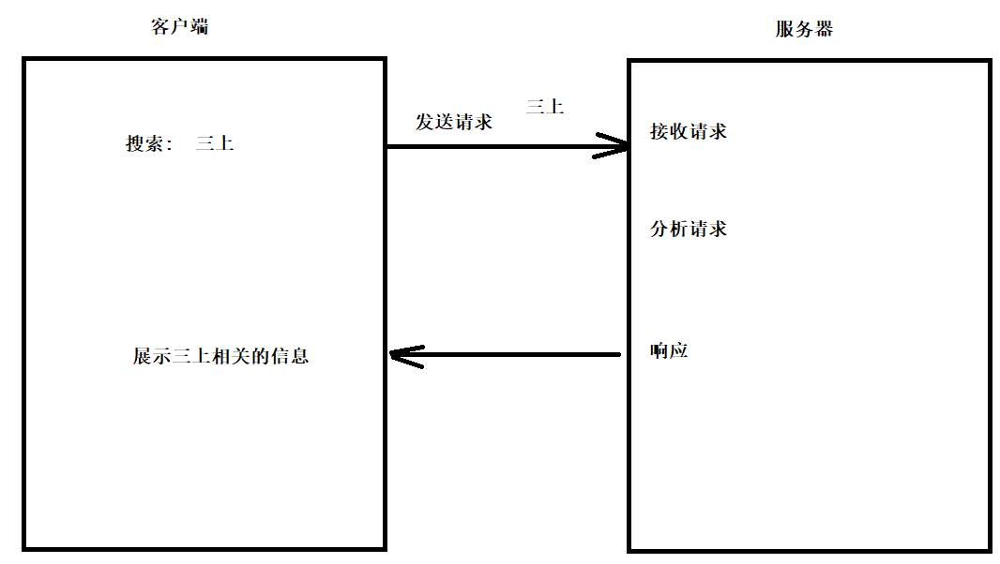

### 1.2.1  服务器的概念

“服务器 server”是一个非常宽泛的概念，**从硬件而言:**服务器是计算机的一种，它比普通计算机运行更快、负载更高、价格更贵。服务器在网络中为其它客户机（如PC机、智能手机、ATM等终端甚至是火车系统等大型设备）提供计算或者应用服务。**从软件而言:**服务器其实就是安装在计算机上的一个软件，根据其作用的不同又可以分为各种不同的服务器，例如应用服务器、数据库服务器、Redis服务器、DNS服务器、ftp服务器等等

**综上所述:**用我们自己的话来总结的话，服务器其实就是一台(或者一个集群)安装了服务器软件的高性能计算机

### 1.2.2  常见的服务器操作系统

服务器是一台计算机，它必须安装操作系统之后才能够安装使用服务器软件

* Linux系统: 使用最多的服务器系统，安全稳定、性能强劲、开源免费（或少许费用）。


* Unix系统: 和硬件服务器捆绑销售，版权不公开，用法和Linux一样。

* Windows Server系统: 源代码不开放，费用高昂，漏洞较多，性能较差，运维成本高。

### 1.2.3 常见的服务器软件

硬件服务器装好系统，就可以安装应用软件了，像我们熟知的Tomcat、MySQL、Redis、FastDFS、ElasticSearch等等都是服务器应用软件。它们分别提供自己特定的服务器功能。如果一台服务器上安装了Tomcat，我们会就会把这台服务器叫做Tomcat服务器；如果装了MySQL，就叫做MySQL服务器。很显然，开发过程中需要很多这样的服务器。

### 1.2.4 服务器端应用程序

就是运行在应用服务器软件上，用于处理具体业务功能的一个应用程序，而我们学习JavaEE开发的目的就是编写服务器端应用程序。例如: 淘宝、滴滴、京东等等项目都是服务器端应用程序.

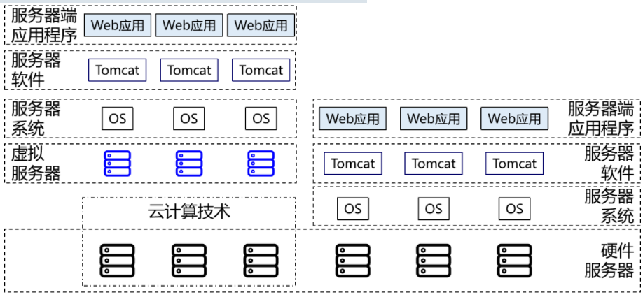


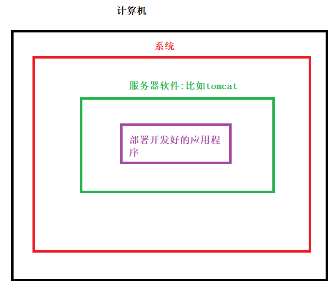


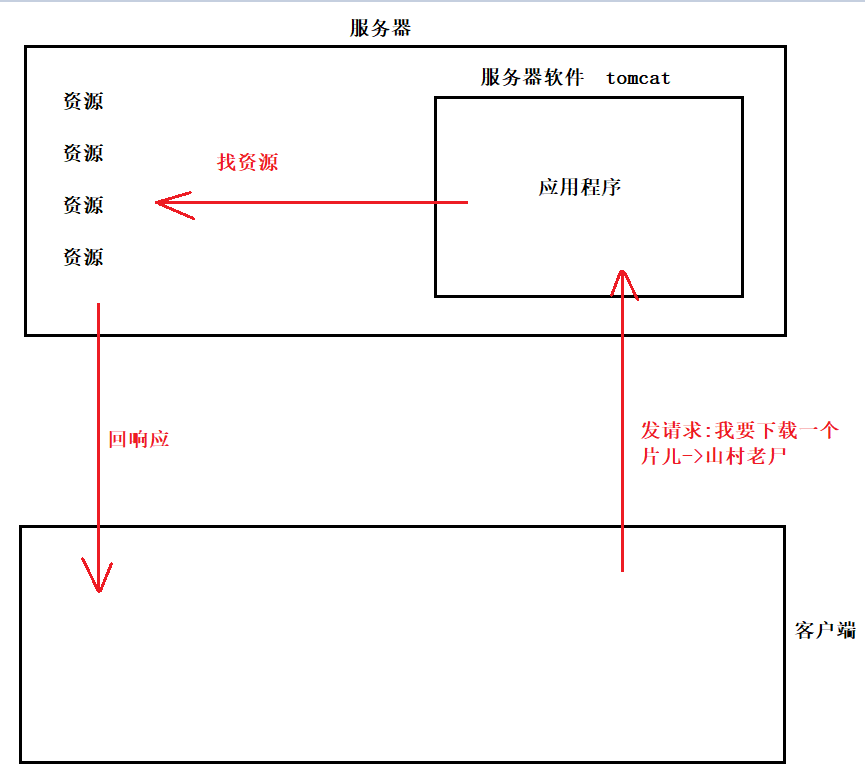

# 第二章 本阶段技术体系

## 2.1  客户端技术

HTML、CSS、JavaScript

```java
html:构造页面
css:美化页面
js:将页面动起来,增加页面和用户的交互,提高用户的使用体验    
```

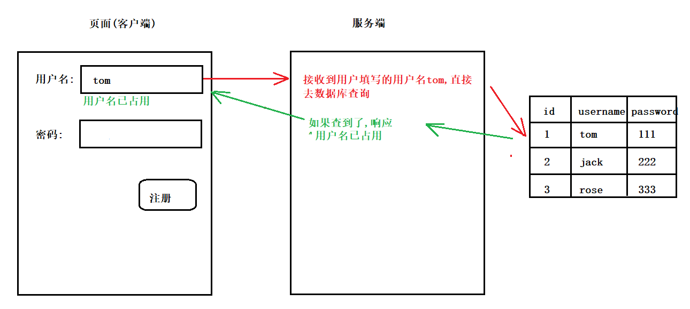

异步：局部刷新，当用户输入用户名后，会立即返回数据给服务端查询是否被注册过，而不需要等密码输入完，点击注册，才同步打包发送给服务端查询数据。

## 2.2  服务器端技术

Tomcat、Servlet、Request、Response、Cookie、Session、Filter、Listener、jsp

Filter:过滤器，当用户想未登录就添加商品进购物车时，这时候会跳转让你先进行登录。会判断用户是否满足条件，满足才可以继续。

jsp的作用如下图所示。 

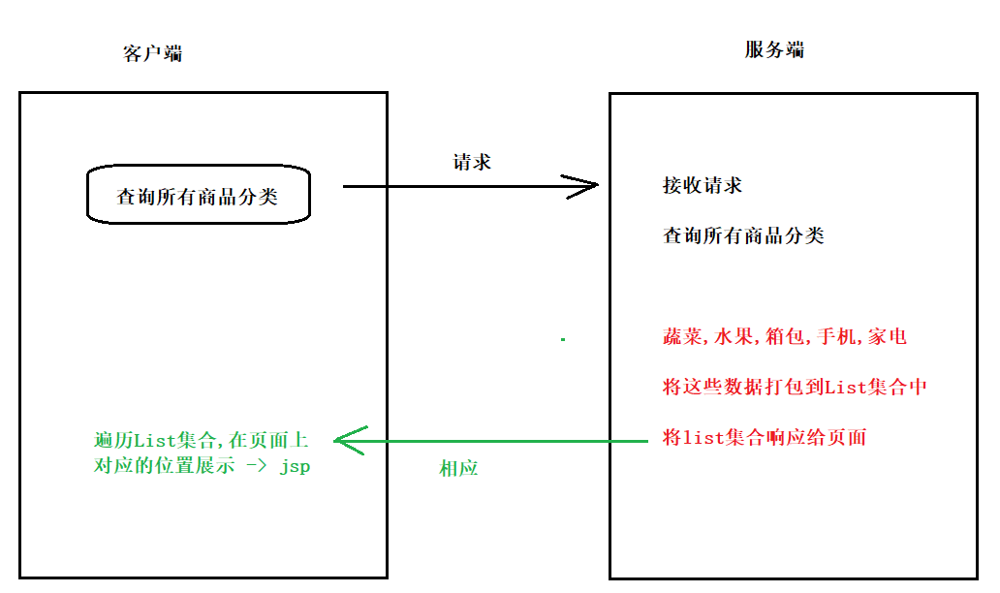

## 2.3  持久层技术(数据库技术)

MySql、JDBC、连接池、DBUtils

# 第三章 HTML入门介绍

## 1.HTML介绍

```java
1.概述:超文本标记语言:
  a.超文本:作用超越普通文本,html中可以干普通本文不能干的事儿,比如引入视频,音乐,展示图片,接收用户输入的数据等
  b.标记语言:组成部分都是由标签组成
2.html中标签特点:
  a.html中的标签名都是预定义的
  b.html中的标签名可以自动纠错
    <html></HTML> 好使
3.作用:
  a.接收用户输入的数据
  b.展示服务器响应回来的结果
  c.构造一个网页    
```

> ```java
> 1.闭合标签:双标签
>   <开始标签></结束标签>
> 2.自闭合标签:单标签
>   <标签名 />
> 3.开始标签和结束标签之间叫做标签体
>   标签体可以是子标签也可以是文本
>     
> 4.标签中可以写属性
>   a.属性的格式: key = "value"
>   b.比如:<开始标签 属性名 = "属性值" 属性名 = "属性值"></结束标签>         
> ```

## 2.网页的运行方式

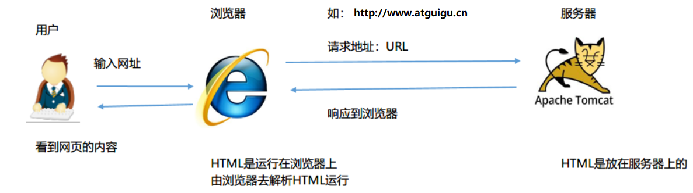

```java
1.保存到服务器上
2.运行在浏览器上
```

## 3.HTML5的介绍

### 3.1HTML5介绍

```java
1.介绍:HTML的第5个版本，HTML5将会取代1999年制定的HTML 4.01、XHTML 1.0标准。
2.作用:主要是为了适应移动客户端的网页展示
3.特点:
  a.同一张网页可以在不同的设备上自适应屏幕宽度
  b.只要开发一张网页就可以运行在不同的设备上
```

### 3.2支持的浏览器

​	目前支持Html5的浏览器包括Firefox（火狐浏览器），IE9及其更高版本，Chrome（谷歌浏览器），Safari，Opera等。我们使用Chrome浏览器进行开发。

​	注：不同的浏览器之间是有差异的，同一个网页在不同的浏览器上运行效果可能不同。

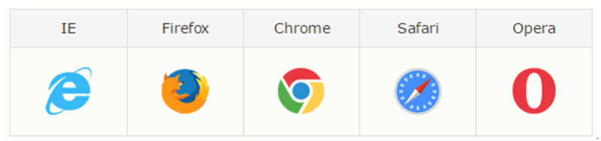


### 3.3HTML5的作品

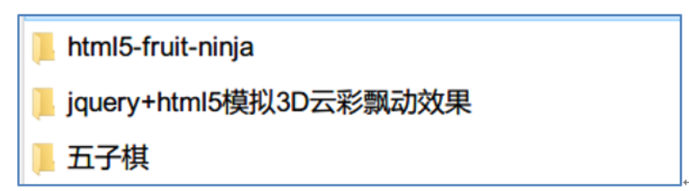 

## 4.网页的基本结构、常见HTML编辑器

### 4.1常见的HTML编辑器

#### 4.1.1.HBuilder

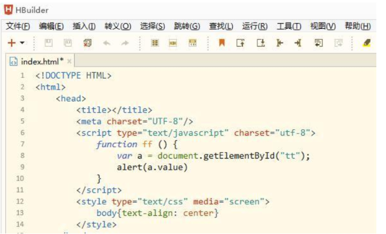

#### 4.1.2Adobe Dreamweaver CS

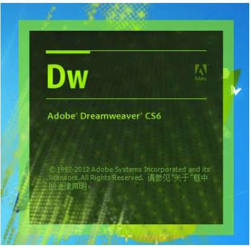

#### 4.1.3.SublimeText


4. Visual Studio Code 

   微软公司第一次向开发者们提供了一款真正的跨平台编辑器。

   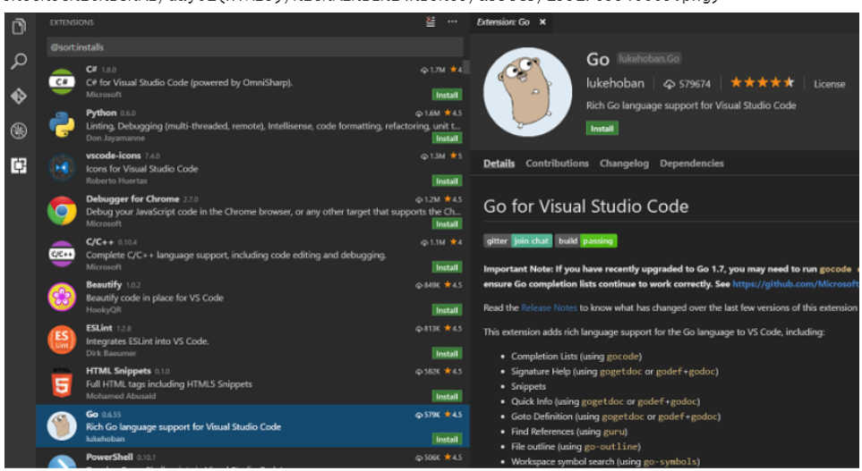

5. NotePad++

6. 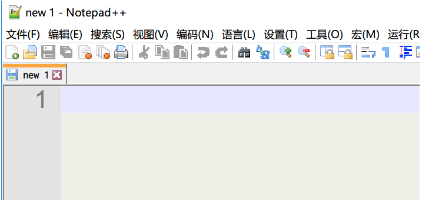 

```html
<!--
  html标签:网页的根标签,所有其他的标签都写在这个html标签中
-->
<!DOCTYPE html>
<html lang="en">
<!--
  head:头标签 主要有三部分
    1.设置网页名称 -> <title>
    2.设置网页编码 -> <meta>
    3.告诉搜索引擎的关键字-> <meta>
-->
<head>
    <meta charset="UTF-8">
    <title>性感涛哥,在线发牌</title>
</head>

<!--
  body标签:主体标签
    网页主体都要写在body标签中
-->
<body>
   <font color="#006400">涛哥和金莲...的故事</font>
</body>
</html>
```

### 4.3HTML的基本结构

```html
1.网页必须以html标签开头和结束->所有标签都会放到html标签中
2.有网页头和网页主体组成:head和body标签
3.内容都放到主体中:body标签
4.head标签三个功能:
  1.设置网页的标题
  2.设置网页的编码,建议服务器端和客户端编码一致  utf-8
  3.告诉搜索引擎(比如:百度)网页的的搜索关键字和描述(可选)
```

## 5.vscode工具的使用

```java
1.前端工程师“Front-End-Developer”源自于美国。大约从2005年开始正式的前端工程师角色被行业所认可，到了2010年，互联网开始全面进入移动时代，前端开发的工作越来越重要。

2.前端工程师比较推崇的一款开发工具就是visual  studio code，下载地址是:
  https://code.visualstudio.com/
```

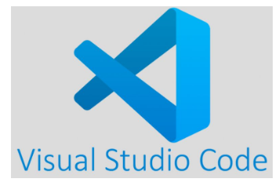

### 5.1.安装以及安装插件

```java
1.安装:qq怎么安,它就怎么安  -> 但是千万注意,安装路径上不要有中文,不要有空格
2.安装插件:
  Auto Rename Tag 自动修改标签对插件
  Chinese Language Pack  汉化包
  HTML CSS Support  HTML CSS 支持
  Intellij IDEA Keybindings IDEA快捷键支持
  Live Server 实时加载功能的小型服务器
  open in  browser 通过浏览器打开当前文件的插件
  Prettier-Code formatter 代码美化格式化插件
  Vetur VScode中的Vue工具插件
  vscode-icons  文件显示图标插件
  Vue3 snipptes 生成VUE模板插件
  Vue language Features Vue3语言特征插件
```

### 5.2.基本使用

#### 5.2.1.创建工作空间

```java
提前在合适位置创建一个空目录，直接用vscode打开，即可直接将该作为项目代码存放的根目录，既工作空间
```

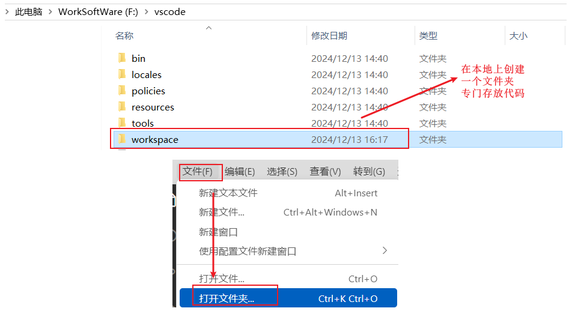

#### 5.2.2.创建子文件夹和文件

```java
1.点击带有"+"号的按钮即可创建文件或者目录    
```

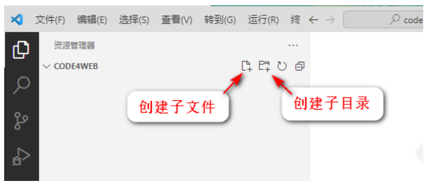

> 注意:默认创建子文件夹,文件夹的嵌套结构不明显,需要修改设置
>
> ```java
> 1.点击设置
> 2.搜索Compact Folders
> 3.将资源管理器中的√去掉
> ```
>
> 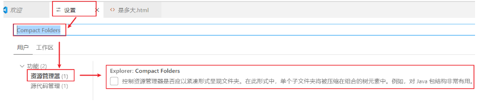

#### 5.2.3.编写基本的html以及运行

```java
1.创建文件,取名为xxx.html
2.输入! 按tab或者回车键,直接生成最基本的html结构代码
```

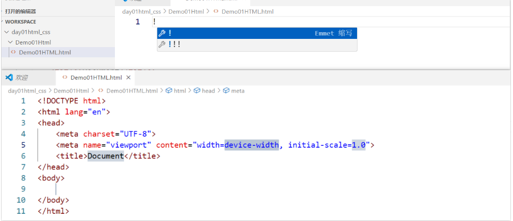

```java
1.运行:点击右下角Go Live ，或者在html编辑视图上右击 open with live Server  ，会自动启动小型服务器，并自动打开浏览器访问当前资源。
    
2.注意:Live Server支持实时加载更新，但是使用完毕后，要记得关闭，点击右下角 “Port:5500” 即可关闭
```

### 5.3.常见设置

```java
设置字体：齿轮>search>搜索    "字体大小"；
设置字体大小可以用滚轮控制：齿轮>设置>搜索 "Mouse Wheel Zoom"；
设置左侧树缩进：齿轮>设置>搜索 "树缩进"；
设置文件夹折叠：齿轮>设置>搜索 "compact" 取消第一个勾选；
设置编码自动保存：齿轮> 设置> 搜索 "Auto Save" ，选择为"afterDelay"；
```

# 第四章 常用标签

```html
1.写标签的快捷键:
  a.先写一个标签名
  b.按tab键
```

## 1.基本标签

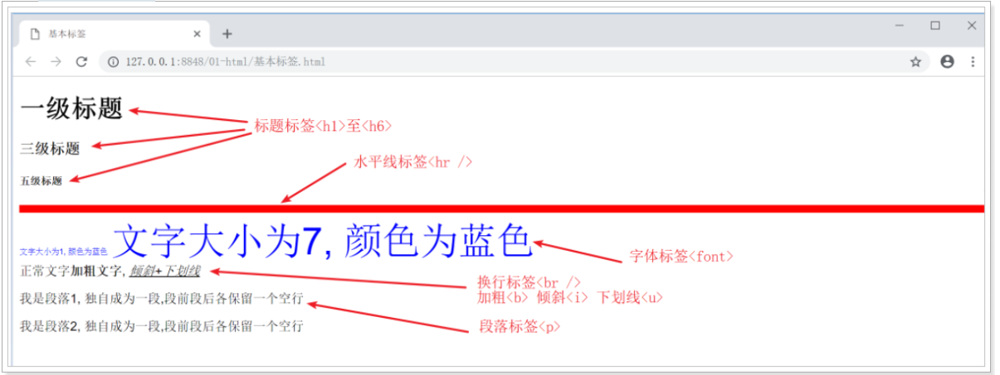

- 标题: 

  ```html
  <hn></hn>
  n的范围:1-6  数字越大,显示越小
  ```

- 水平分割线: 

  ```html
  <hr/>
  属性:
   size
   color
  ```
  
  ----------------------------------
  
- 字体: 

  ```html
  <font 属性名=属性值 属性名=属性值></font>
  
  1.常用属性:
    size (最大到7)
    color
  
  2.color属性：设置字体的颜色
    a.颜色的取值：#xxxxxx 或 颜色英文名字
  
    b.#xxxxxx 表示使用红绿蓝三原色设置颜色。
      - 红绿蓝分别取值：00 -- FF，此处使用16进制。（FF就是十进制的255）
      - #000000 表示黑色，#FFFFFF白色
      - #FF0000红色，#00FF00绿色，#0000FF蓝色
  
    c.color 使用英文单词确定颜色。red 红色，blue 蓝色，green绿色
  ```

  --------------------------------------------------------------------------------

- 换行:

  ```html
  <br/>
  
  注意:换行之后没有行间距
  ```
  
- 格式化: 

  ```html
  <b></b>  加粗
  <u></u>  下划线
  <i></i>  倾斜
  ```
  
- 段落:

  ```html
  <p></p>
  注意:p标签自带换行效果,换行之后有行间距
  ```

```html
<!DOCTYPE html>
<html lang="en">
<head>
    <meta charset="UTF-8">
    <title>常用的基本标签</title>
</head>
<body>
<!--
  标题标签:
    <hn></hn>
    n的范围:1-6  数字越大,显示越小
-->
<h1>我是一个标题标签1</h1>
<h2>我是一个标题标签2</h2>
<h3>我是一个标题标签3</h3>

<!--
    水平分割线标签:
      <hr />
       属性:
         size: 分割线粗细
         color: 分割线的颜色
-->
<hr color="red" size="2"/>

<!--
  字体标签:<font></font>
   <font 属性名=属性值 属性名=属性值></font>

   1.常用属性:
     size (最大到7)  设置字体大小
     color          设置字体颜色

   2.color属性：设置字体的颜色
     a.颜色的取值：#xxxxxx 或 颜色英文名字

     b.#xxxxxx 表示使用红绿蓝三原色设置颜色。
       - 红绿蓝分别取值：00 -- FF，此处使用16进制。（FF就是十进制的255）
       - #000000 表示黑色，#FFFFFF白色
       - #FF0000红色，#00FF00绿色，#0000FF蓝色

     c.color 使用英文单词确定颜色。red 红色，blue 蓝色，green绿色
-->
<font size="5" color="#5f9ea0">字体标签</font>

<!--

  换行标签:
  <br/>
  注意:换行之后没有行间距
-->
<br/>
<font size="5" color="blue">字体标签</font>

<br/>
<hr color="red" size="2"/>
<!--
  格式化标签:
    <b></b>  加粗
    <u></u>  下划线
    <i></i>  倾斜

    标签之间可以嵌套
-->
<i><u><b>格式化标签</b></u></i>

<br/>
<hr color="red" size="2"/>

<!--
  段落标签:<p>
  注意:p标签自带换行效果,换行之后有行间距
-->
<p>我是段落1</p>
<p>我是段落2</p>
<p>我是段落3</p>
</body>
</html>
```

## 2.图片标签

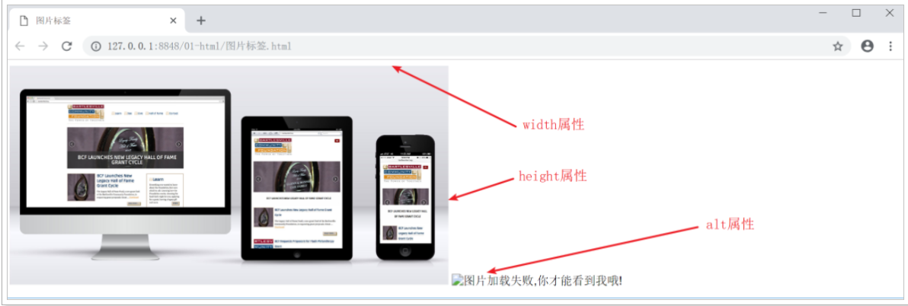

```java
1.
2.图片标签属性:
  src:指定需要显示的图片路径
  alt:图片无法显示时的替代文本
  width:设置图片的宽度
  height:设置图片的高度
  title:将鼠标放到图片上出现的文字提示   
3.注意:  如果想设置图片的大小,我们只设置width,单位为%即可(不写也可以),图片会自适应,等比例缩放
```

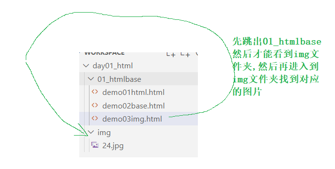

```html
<!DOCTYPE html>
<html lang="en">
<head>
    <meta charset="UTF-8">
    <title>图片标签</title>
</head>
<body>
  <!--
    图片标签:
      a.标签名: 
      b.属性:
        src:指定需要显示的图片路径
        alt:图片无法显示时的替代文本
        width:设置图片的宽度
        height:设置图片的高度
        title:将鼠标放到图片上出现的文字提示

      c.注意:调整图片,只设置 width 即可,图片会等比例缩放
  -->
  
</body>
</html>
```

## 3.超链接标签

```html
1.<a></a>
2.a标签属性:
  href:用于确定需要显示页面的路径
  target:确定以何种方式打开href所设置的页面.常用取值: _blank  _self等
         _blank:在新窗口中打开href确定的页面(新建)
         _self:默认,在原窗口打开href确定的页面(当前)
```

```html
<!DOCTYPE html>
<html lang="en">
<head>
    <meta charset="UTF-8">
    <title>超链接标签</title>
</head>
<body>
<!--
  1.<a></a>
  2.a标签属性:
  href:用于确定需要显示页面的路径
  target:确定以何种方式打开href所设置的页面.常用取值: _blank  _self等
         _blank:在新窗口中打开href确定的页面
         _self:默认,在原窗口打开href确定的页面
-->
<a href="http://www.atguigu.com" target="_self">跳转页面</a>
</body>
</html>
```

## 4.表格标签

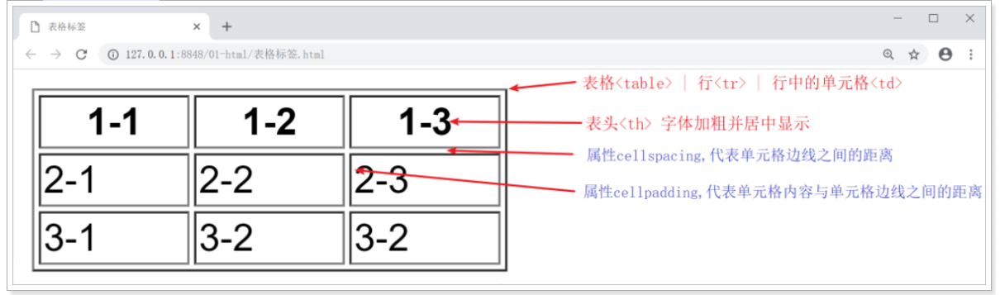

```html
表格标签:  <table>标签用于定义表格，相当于整个表格的容器。

1.表格标签属性:
  border 表格边框的宽度。
  width 表格的宽度。如果使用百分比,表格随着网页的大小而变化
  bgcolor 表格的背景颜色。
  cellspacing 单元格边线之间的的距离。
  cellpadding 单元格内容与单元格边线之间的距离。
  align:表格对齐   取值：left 左 、right 右、center 居中
```

```html
1.定义行标签
  <tr>
2.定义单元格,列
  <td>
3.设置表头
  <th>  单元格中的内容默认居中,加粗
```

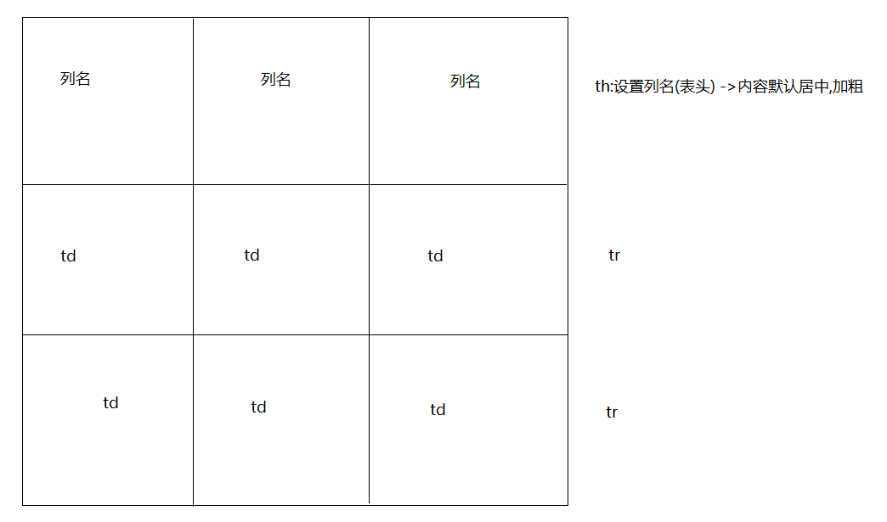

```html
<!DOCTYPE html>
<html lang="en">
<head>
    <meta charset="UTF-8">
    <title>表格标签</title>
</head>
<body>
   <table border="1" width="500" height = "300" bgcolor="#5f9ea0" cellspacing="5" cellpadding = "2">
       <tr>
           <th>1-1</th>
           <th>1-2</th>
           <th>1-3</th>
       </tr>
       <tr align="center">
           <td>2-1</td>
           <td>2-2</td>
           <td>2-3</td>
       </tr>	
       <tr align="center">
           <td>3-1</td>
           <td>3-2</td>
           <td>3-3</td>
       </tr>
   </table>

   <hr  size="2" color="red"/>
   
   <table border="1" width="500" height = "300" bgcolor="#5f9ea0" cellspacing="5" cellpadding = "2">
       <!--
          快速生成n行n列快捷键:
            tr*行数>td*列数   ->  tab键
       -->
      
       <tr>
           <td></td>
           <td></td>
           <td></td>
       </tr>
       <tr>
           <td></td>
           <td></td>
           <td></td>
       </tr>
       <tr>
           <td></td>
           <td></td>
           <td></td>
       </tr>
   </table>

</body>
</html>
```

```java
快速生成多行多列:
 tr*行数>td*列数  -> tab键
```

```java
注意:
  在浏览器解析页面时,会给tr加一个父标签,叫做<tbody>  
  tbody中写的是表格的主体
```

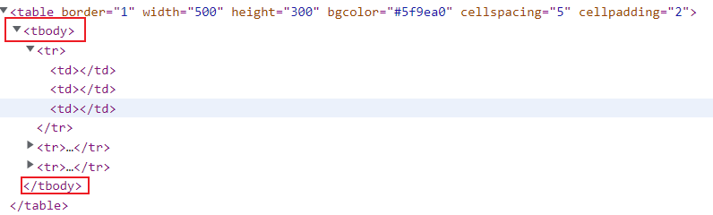

## 5.表格标签-单元格合并

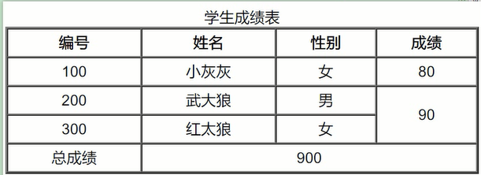

```html
<td>标签用于定义表格的单元格
    属性: colspan  单元格跨列
         rowspan  单元格跨行
```

```html
<!DOCTYPE html>
<html lang="en">
<head>
    <meta charset="UTF-8">
    <title>单元格合并</title>
</head>
<body>
  <table border="2" width="500" cellspacing="0" cellpadding="1" align="center">
      <!--设置表名-->
      <caption>学生成绩表</caption>

      <tr>
          <th>编号</th>
          <th>姓名</th>
          <th>性别</th>
          <th>成绩</th>
      </tr>
      <tr align="center">
          <td>100</td>
          <td>小灰灰</td>
          <td>女</td>
          <td>80</td>
      </tr>
      <tr align="center">
          <td>200</td>
          <td>武大狼</td>
          <td>男</td>
          <td rowspan="2">90</td>
      </tr>
      <tr align="center">
          <td>300</td>
          <td>红太狼</td>
          <td>女</td>
      </tr>
      <tr align="center">
          <td>总成绩</td>
          <td colspan="3">900</td>

      </tr>
  </table>
</body>
</html>
```

## 6.div标签span标签

```java
1.以前的网页都是用table做布局
  好处:容易上手,浏览器兼容
  坏处:由于浏览器读取html的方式为从上到下(瀑布式加载)解析,需要等到浏览器读到</table>,表格才会显示,如果访问量大,网页显示速度会慢
      
2.div:速度快,不用读到</div>就能显示
```

```java
div标签:  块级元素标签
    
1.一个div霸占屏幕一行,就是网页中的一整行
2.配合css样式表使用
```

```java
span标签: 行级元素标签
1.不会占屏幕一整行  而是  多个span在同一行上
2.配合css样式表使用
```

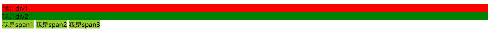

```html
<!DOCTYPE html>
<html lang="en">
<head>
    <meta charset="UTF-8">
    <title>div和span标签</title>
</head>
<body>

<!--
   1.div:块级标签
     a.div需要结合css样式才能展示效果
     b.一个div霸占一整行(一大块)
     
   2.span:行级标签
     a.span需要结合css样式才能展示效果
     b.一个span占一小块,多个span在同一行上

-->
  <div style="background-color: red">我是div1</div>
  <div style="background-color: green">我是div2</div>
  <span style="background-color: yellowgreen">我是span1</span>
  <span style="background-color: yellowgreen">我是span2</span>
  <span style="background-color: yellowgreen">我是span3</span>
</body>
</html>
```

# 第五章 表单 重点

## 1 表单标签form

```html
1.标签名:<form></form>
2.作用:
  a.收集用户在页面中所填写的数据
  b.将表单中所填写的数据发送给服务器

3.属性:
  action:将表单中的数据提交到哪个服务器上,属性值写的是服务器资源的url
         如果写#,代表的是将表单中的数据提交到当前页面上

  method:以何种请求方式提交表单数据
         常见的两个请求方式: GET  POST-> 不区分大小写
```

```html
<!DOCTYPE html>
<html lang="en">
<head>
    <meta charset="UTF-8">
    <title>form表单</title>
</head>
<body>
<!--
  action:写的是将表单中的数据提交给哪个服务器资源,写的是服务器资源的url
  method:提交方式,GET,POST 不区分大小写
-->
<form action="" method="get">
    <!--
      在form中写的就是要提交给服务器的数据
    -->
</form>
</body>
</html>
```

## 2 输入标签input

`<input>` 标签用于获得用户输入信息，type属性值不同，搜集方式不同。最常用的标签。

```html
文本输入框: 属性
  type = "text"
  name 属性:当将表单中的数据提交给服务器之后,服务器需要根据name的属性值,去获取输入框中提交的数据  
  value 属性:value属性值其实就是输入框中输入的值;value的属性值和name是一对,是一个键值对的形式 
            我们直接在输入框中输入的内容其实就是在给value赋值
            服务器根据name获取对应的输入框数据,其实就是在根据name获取value
             
  placeholder属性:输入框的小提示
----------------------------------------------------------------------------    
<!-- 文本输入框 -->
   用户名:<input type="text" value="" placeholder="请输入用户名" name="user"/> <br/>
```

```html
密码输入框: 属性
      type="password" 
      placeholder="输入框预期值的提示信息"
      name：发送给服务器的名称
      value="文本框的默认值"
 --------------------------------------------------------------------------
<!-- 密码输入框 -->
    密　码:<input type="password" placeholder="请输入密码" name="pass"/> <br/>
```

```html
单选按钮: 属性
      type="radio" 	->单选按钮
      name="定义名字",name相同的单选按钮才能保证单选,name相同证明这是同一组数据，相当于利用name的属性值
		将两个按钮分成一组了
      checked="checked" 默认选中属性, 需要注意: 属性很特别,属性名和属性值一样,固定写法
      value="值" 
 ----------------------------------------------------------------------------
<!-- 单选按钮 -->
check="checked" ->默认选中
    性　别:<input type="radio" name="gender" checked="checked" value="男"/>男
          <input type="radio" name="gender" value="女"/>女 <br/>
```

```html
复选按钮: 属性
      type="checkbox"
      checked="checked" 默认选中属性,一般不用加
      value="值"  这样就可以通过name拿到value的值,发给服务器,所以还得加上一个name="hobby"
                  name都应该是一样的,证明这是一组复选
----------------------------------------------------------------------------
<!-- 复选按钮 -->
    爱　好:<input type="checkbox" checked="checked" name="hobby" value = "抽烟"/>抽烟
          <input type="checkbox" name="hobby" value = "喝酒"/>喝酒
          <input type="checkbox" name="hobby" value = "打牌"/>打牌 <br />
```

```html
文件域: 属性
      type="file"   文件上传服务器
----------------------------------------------------------------------------
<!-- 文件域 -->        
    上传头像:<input type="file" /> <br />
```

```html
按钮:
 1.普通按钮: 属性 
     type="button"
     value="按钮上显示文本"用于配合后面的技术JavaScript
   <!-- 普通按钮 -->
     <input type="button" value="点我提交"/>
 --------------------------------------------------------------------------   
 2.重置按钮: 属性 
     type="reset"
 
   <!-- 重置按钮 -->
    <input type="reset" />
----------------------------------------------------------------------------
 3.提交按钮: 表单数据发送到服务器提交按钮: 属性 
     type="submit"
   
   <!-- 提交按钮 -->
     <input type="submit" />
----------------------------------------------------------------------------
 4.图片按钮: 属性    可以将表单数据提交给服务器
     type="image"  
  <!--图片按钮-->
 <input type="image" src="img/btn.jpg"/>
```

```html
<!DOCTYPE html>
<html lang="en">
<head>
    <meta charset="UTF-8">
    <title>form表单</title>
</head>
<body>
<form action="#" method="get">
    <!--
       1.文本输入框:<input type = "text"/>
         type:input类型 text->普通文本输入框

         placeholder属性:输入框的小提示

         name:设置name属性有利于将来将输入框中的数据提交给服务器,name和value属性是绑死的,
              可以将name的属性值看成是key,将value的属性值看成是value
              将来表单提交给服务器之后,在服务器上可以根据name的属性值获取到value值
              而value值才是服务器想要得到的数据

         value:输入框的内容 -> 真正提交给服务器的数据
               一般value的属性值可以空着,将来我们直接在输入框中输入数据,就是在给value属性赋值

       2.比如:name属性值设置成username   value属性值为"tom"->提交给服务器之后
             username = "tom"
    -->
    用户名:<input type="text" name="username" value="" placeholder="请输入用户名"/><br/>

    <!--
       1.密码框:<input type = "password"/>

         type:input类型 password-> 密码框

         placeholder属性:输入框的小提示

         name:设置name属性有利于将来将输入框中的数据提交给服务器,name和value属性是绑死的,
              可以将name的属性值看成是key,将value的属性值看成是value
              将来表单提交给服务器之后,在服务器上可以根据name的属性值获取到value值
              而value值才是服务器想要得到的数据

         value:输入框的内容 -> 真正提交给服务器的数据
               一般value的属性值可以空着,将来我们直接在输入框中输入数据,就是在给value属性赋值

       2.注意:在页面上不要直接打空格
              需要用转义字符:  &nbsp;

    -->
    密&nbsp;&nbsp;&nbsp;码:<input type="password" name="password" value="" placeholder="请输入密码"/><br/>

    <!--
       1.单选框:<input type = "radio"/>

         checked="checked" 默认选中属性, 需要注意: 属性很特别,属性名和属性值一样,固定写法
         value:提交给服务器端的数据
         name:如果多个单选设置成一样的name属性值,就会互斥

       2.注意:单选应该是互斥的,如果想让两个单选互斥,需要将两个单选变成一组控件,可以使用name,给两个单选的name属性值
             设置成一样的
    -->
    性&nbsp;&nbsp;&nbsp;别:
    <input type="radio" name="gender" value="男"/>男
    <input type="radio" name="gender" value="女"/>女<br/>

    <!--
     1.复选框:<input type = "checkbox"/>
       checked="checked" 默认选中属性, 需要注意: 属性很特别,属性名和属性值一样,固定写法
       value:提交给服务器端的数据
       name:如果多个复选设置成一样的name属性值,那么就是一组数据
    -->
    爱&nbsp;&nbsp;&nbsp;好:
    <input type="checkbox" name="hobby" value="抽烟">抽烟
    <input type="checkbox" name="hobby" value="喝酒">喝酒
    <input type="checkbox" name="hobby" value="烫头">烫头<br/>

    <!--
     1.文件域: 属性
       type="file"   文件上传服务器
    -->
    上&nbsp;&nbsp;&nbsp;传:<input type="file"/><br/>

    <!--
     1.普通按钮:
       type = "button"
     2.注意:普通按钮都是和js事件绑定使用 -> 后天说
       BOM  DOM
    -->
    <input type="button" value="普通按钮"/>

    <!--
      1.重置按钮:
        type = "reset"
    -->
    <input type="reset" value="重置按钮" />

    <!--
       1.提交按钮: 表单数据发送到服务器提交按钮: 属性
         type="submit"
    -->
    <input type="submit" value="提交按钮">

    <!--
      1.图片按钮: 属性    可以将表单数据提交给服务器
      type="image"
    -->
    <input type="image" src="../img/24.jpg" width="50"/>
</form>
</body>
</html>
```

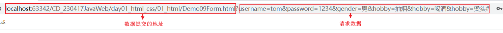

## 3 下拉菜单

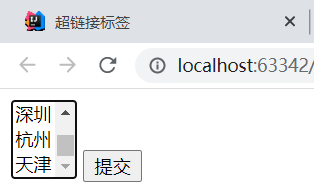

```java
1.<select> 下拉列表 ,可以 进行单选或者多选
2.属性:
  name:发送给服务器的名称
  multiple:取值为"multiple"表示多选,一般不写
  size:展示多少条信息
```

```java
1.select标签有一个子标签 <option>
2.option标签:给select设置下拉菜单内容
3.option标签属性:
  selected:默认选中当前列表项
  value:发送服务器的数据
      
4.注意:option中设置的value值,其实就是给select设置value值->一定记住
```

```html
    <select name="city">
        <option value="bj">北京市</option>
        <option value="sh">上海市</option>
        <option value="gz">广州市</option>
        <option value="sz">深圳市</option>
        <option value="hz">杭州市</option>
    </select>
```

## 4. 提交方式区别

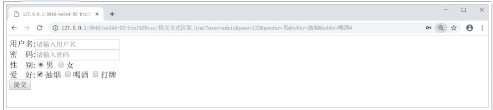

服务器提交方式GET和POST区别

```html
1.get提交:表单提交的参数,放到浏览器地址栏上,暴露敏感数据;浏览器的地址栏数据有限(255个字符),不适合提交过大的数据
          a.提交的数据在地址栏上显示方式:?为分界线
          b.?前面的是提交服务器的地址(请求路径);?后面的是表单提交的具体数据(请求参数)
          c.提交的数据都是key=value形式,多个key=value之间用&连接
            key:页面上给name属性设置的属性值
            value:页面上给value属性设置的属性值
             
2.post提交:表单提交的参数,不会显示在地址栏上;不会暴露敏感数据;没有数据大小限制
          a.post提交方式提交的数据,在请求体中
          b.post提交方式,提交的数据也是key=value形式,多个key=value之间用&连接
                key:页面上给name属性设置的属性值
                value:页面上给value属性设置的属性值
```

# 第六章 css样式作用和语法(了解)

CSS (Cascading Style Sheets) ：指层叠样式表. 指使用不同的添加方式，给同一个HTML标签添加样式，最后所有的样式都叠加到一起，共同作用于该标签。类似于我们使用的美颜相机.


- 主要用于设置HTML页面中的文本内容（字体、大小、对其方式等）、图片的外形（高宽、边框样式、边距等）以及版面的布局等外观显示样式。

- 作用: 美化页面. HTML负责显示数据, CSS负责美化效果

- 语法结构

  ```java
  选择器{
      属性名:属性值;
      属性名:属性值;
  }
  ```

  - 选择器: 指定对HTML的哪个标签起作用

  ```css
  div {
      width: 200px;
      height: 200px;
      border: red 1px solid;
  }
  ```

```html
<!DOCTYPE html>
<html lang="en">
<head>
    <meta charset="UTF-8">
    <title>css初体验</title>

    <style type="text/css">
        div{
             background-color: red;
             font-family:"华文行楷" ;
         }
    </style>
</head>
<body>

<div>我是div1</div>
<div>我是div2</div>
<div>我是div3</div>
</body>
</html>
```

# 第七章 css引入方式(了解)

## 1 css引入方式一_行内

- 行内样式:
  - 在HTML标签中添加属性 style="属性:属性值"
  - 作用域最小,作用于当前标签; 行内样式的优先级最高

```html
<body>
    <h3 style="color: red;">h3标签</h3>
    <h3>哈哈</h3>
</body>
```

## 2 css引入方式二_内部

- 内部样式:
  - 在HTML页面里面写CSS代码, 一般写在<head>中, 使用标签 style , 属性: type="text/css"
  - 作用是当前整个页面有效

```html
<html>
    <head>
        <meta charset="UTF-8">
        <title></title>
        <style type="text/css">
            h3{
                color: chocolate;
            }
        </style>
    </head>
    <body>
        <h3>h3标签</h3>
        <h3>哈哈</h3>
    </body>
</html>
```

## 3 css引入方式三_外部样式

```java
1.CSS样式定义在另一个文件中,后缀名.css (文本文件)
    2.在HTML页面中,引入样式表, 使用link标签 写在head中
   属性: 
      href="css文件路径"  
      type="text/css" 
      rel="引入的文件和当前页面是什么关系" 样式表
3.作用范围最大,哪个页面引入,哪个有效
```

```html
<html>
    <head>
        <meta charset="UTF-8">
        <title></title>
        <link href="css/1.css"  type="text/css" rel="stylesheet"/>
    </head>
    <body>
        <h3>h3标签</h3>
        <h3>哈哈</h3>
    </body>
</html>
```

css/1.css

```css
h3{
    color: blue;
}
```

```java
小结:
 行内样式:在开始标签中写style = "属性名:属性值"
    
 内部样式:在head中
         <style type = "text/css">
            
         </style>
 外部样式:创建一个css文件,在文件中写样式,然后在html中引入
        <link href = "css文件的路径" type = "text/css" rel = "stylesheet"></link>
        
```

## 4.三种样式的优先级

优先级：后面出现的同名样式会覆盖前面的同名样式

层叠样式表：多个样式，如果同名的会覆盖，不同的还是起作用

```html
如果有行内样式最先去执行行内样式
如果没有行内样式,后面出现的同名的样式会覆盖前面的同名样式
```

```html
<!DOCTYPE html>
<html>
<head>
    <meta charset="UTF-8">
    <title>css三种引入方式优先级</title>
<!--外部样式-->
    <link href="../css/css.css" type="text/css" rel="stylesheet"/>
    
<!--内部样式-->
   <style type="text/css">
       p{
           color:blue;
       }
   </style>
    
   
</head>
<body>
<!--行内样式-->
<!--<p style="color: red">我要先执行</p>-->
<p>我要先执行</p>
</body>
</html>
```

```css
p{
    color: green;
}
```

```java
小结:
   三种引入方式优先级:就近原则
   如果有行内样式,就先执行行内样式
   如果没有行内样式,后面的会把前面的样式覆盖掉
  
```

```java
三种样式哪个用的最多呀:
   开发中外部用的比较多,但是讲课我要用内部,或者行内(省事)
```

# 第八章 css选择器(了解)

## 1.css基本选择器

```html
<p>我是段落1</p>
<p>我是段落2</p>
<p class="three">我是段落3</p>
<p class="three">我是段落4</p>
```

选择器就是对HTML标签设置样式作用


- **标签选择器:**标签元素选择器用HTML标签名称作为选择器，按标签名称分类，为页面中某一类标签指定统一的CSS样式。

  ```java
  基本语法格式如下：
      标签名 {
         属性1:属性值1; 
         属性2:属性值2; 
         属性3:属性值3;
      }
  ```

- **ID选择器**:id选择器使用“#”进行标识，后面紧跟id名

  ```java
  基本语法格式如下：
    #id名 {
        属性1:属性值1; 
        属性2:属性值2; 
        属性3:属性值3; 
    }
    
    需要在html标签上,添加属性id="选择器名", 配合ID选择器进行使用
    id属性的属性值在页面上都是唯一的,将来我需要通过js代码获取标签对象:document.getElementById("id的属性值")
  ```

- **class选择器**:类选择器类选择器使用“.”（英文点号）进行标识，后面紧跟类名其

  ```java
  基本语法格式如下：
  .类名 {
      属性1:属性值1; 
      属性2:属性值2; 
      属性3:属性值3; 
   }
   需要在html标签上,添加属性class="选择器名", 配合class选择器进行使用
  ```

```java
1.注意:
     如果需要使用ID选择器. 要保证：ID的属性值具有唯一性
     因为后面学习的JavaScript技术中: 对象document中的方法getElementById("one"), 会把标签变成对象,只要找到第一个了,后面就不找了. 所以,ID的属性值要唯一.
     当使用ID选择器和class选择器, 对同一个标签设置相同属性时, ID选择器 优先级高于 class选择器

2.选择器的优先级:id选择器>类选择器>标签选择器
```

```html
<!DOCTYPE html>
<html>
<head>
    <meta charset="UTF-8">
    <title>css选择器</title>

    <style type="text/css">
       /*
          标签选择器
            语法:
              标签名{
                 属性名:属性值;
                 属性名:属性值;
              }
       */
        p{
            color:red;
        }
        
        /*
          id选择器
            注意:如果想使用id选择器,那么当前标签上需要有id属性
                 页面上的id值都是唯一的
                 将来我们学js的时候,我们可以根据id值获取当前的标签:document.getElementById("id值")
            格式:
             #id值{
              属性名:属性值;
              属性名:属性值;
             }
        */
        
        #two{
            color:green;
        }
        
    /*
       类选择器:
         注意:想使用类选择器,标签中需要有class属性
         格式 :
           . class名{
              属性名:属性值;
              属性名:属性值;
           }
    */
        .three{
            color: darkgoldenrod;
        }
    </style>
</head>
<body>
<p>我是段落1</p>
<p id="two">我是段落2</p>
<p class="three">我是段落3</p>
<p class="three">我是段落4</p>
</body>
</html>
```

```java
选择器的优先级:id选择器>类选择器>标签选择器
```

```html
<!DOCTYPE html>
<html>
<head>
    <meta charset="UTF-8">
    <title>css选择器优先级</title>
    <style type="text/css">
        /*
         标签选择器
        */
        p{
            color: red;
        }
    /*
      id选择器
    */
        #one{
            color: green;
        }
        
    /*
      类选择器
    */
        .cName{
            color:blue;
        }
    </style>
</head>
<body>
<p id="one" class="cName">我是段落1</p>
</body>
</html>
```

```java
小结:
 1.选择器:3种
   标签选择器:
     标签名{
         属性名:属性值;
     }
   id选择器->标签中必须有id属性,而且属性值必须唯一
     #id值{
       属性名:属性值;
     }
   类选择器:->标签中必须有class属性
     .class值{
         属性名:属性值;
      }
  选择器优先级:id>类>标签
```

# 第九章 css常用属性(了解)

## 1 css边框属性

```java
border ：设置边框的样式
  1.格式：border:宽度 样式 颜色
  2.例如：
      div{
          border:1px solid #ff0000 
      }
      像素实边红色。
  3.样式取值：solid 实线，none 无边，double 双线 等
  4.width、height：用于设置边框的宽度、高度。->单位px(像素)
```

```html
<!DOCTYPE html>
<html>
    <head>
        <meta charset="UTF-8">
        <title></title>
        <style type="text/css">
            div{
                width: 200px;
                height: 200px;
                border: 10px solid  red;
            }
        </style>
    </head>
    <body>
        <div>我是div</div>
    </body>
</html>
```

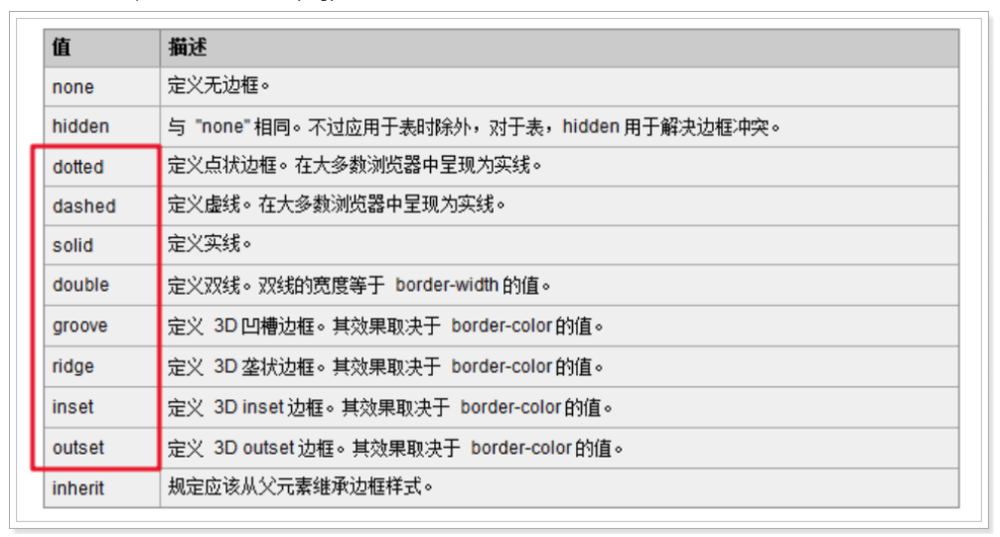

## 2 css字体属性

常用的属性值：

```html
1.font-size:文本大小
2.font-family: 字体
3.color: 颜色
```

```html
<!DOCTYPE html>
<html>
    <head>
        <meta charset="UTF-8">
        <title></title>
        <style type="text/css">
            div{
                font-family: 楷体;
                font-size: 32px;
                color: red;
            }
        </style>
    </head>
    <body>
        <div>我是div</div>
    </body>
</html>
```

## 3 css背景属性

常用的属性值：

```
background-color 背景色
```

```
- background-image 背景图
-   属性:url(图片地址)
```


```html
<!DOCTYPE html>
<html>
    <head>
        <meta charset="UTF-8">
        <title></title>
        <style type="text/css">
            /*
            body{
                background-color: red;
                background-image: url(img/btn.jpg);
            }*/
            
            div{
                width: 200px;
                height: 200px;
                
                background-image: url(img/btn.jpg);
                background-color: blue;
            }
        </style>
    </head>
    <body>
        <div>我是div</div>
    </body>
</html>
```

## 4 css盒子模型

所谓盒子模型就是把HTML页面中的元素看作是一个矩形的盒子，也就是一个盛装内容的容器。 

每个矩形都由元素的内容（content）、内边距（padding）、边框（border）和外边距（margin）组成。

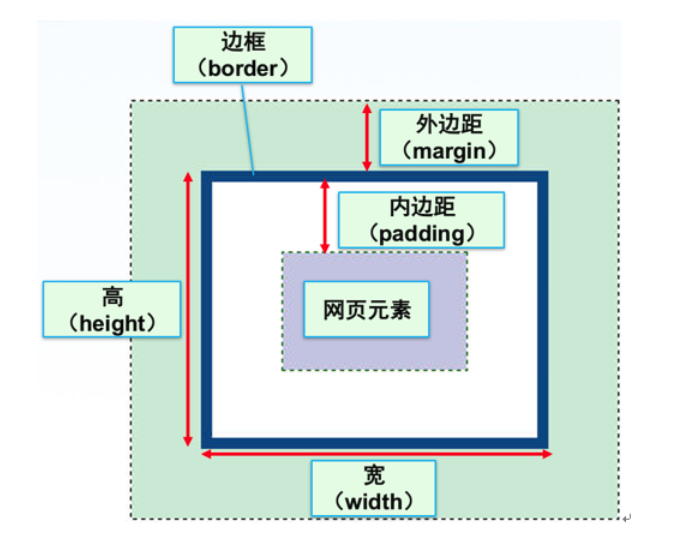 

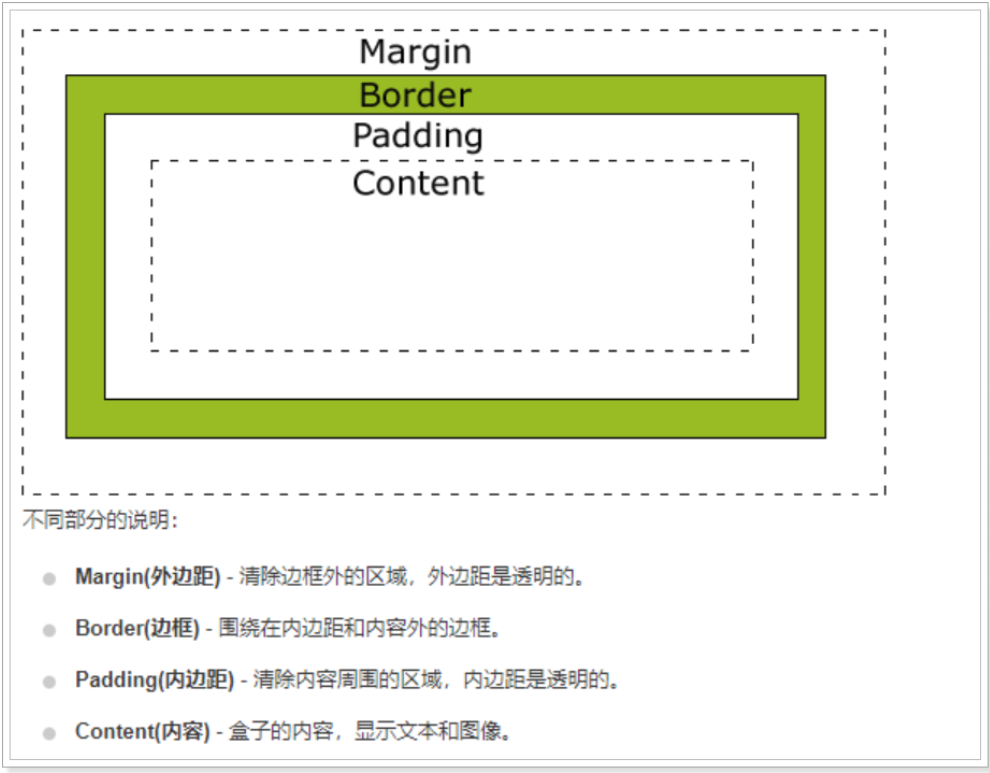

什么是盒子模型: CSS的 框模型 (Box Model) 规定了元素框 处理元素内容、内边距、边框 和 外边距 的方式。

- 外边距：margin, 设置不同元素之间, 它们边框与边框之间的距离->div边框和页面边框的距离

  也通过使用下面四个单独的属性，分别设置上、右、下、左 的外边框：

  ```
  margin-top 
  margin-right 
  margin-bottom 
  margin-left
  
  看上不看下,看左不看右
  ```

- 内边距 padding, 设置元素边框与元素内容之间的距离

  也通过使用下面四个单独的属性，分别设置上、右、下、左 的内边距：

  ```
  padding-top  
  padding-right  
  padding-bottom  
  padding-left
  ```

css盒子模型框模型 (Box Model) 多属性值使用:

- margin: 50px; 上下左右
- margin: 10px 50px; 上下 10 , 左右50
- margin: 10px 20px 30px; 上10 ,左右20, 下30
- margin: 10px 20px 30px 40px; 顺时针 上 右 下 左
- margin: 0 auto; 上下0, 左右距离自动调整(居中)

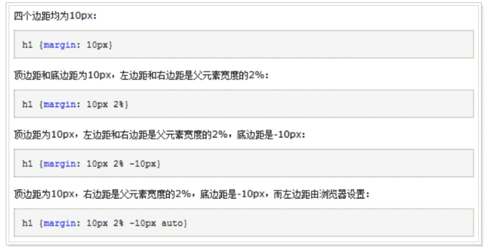

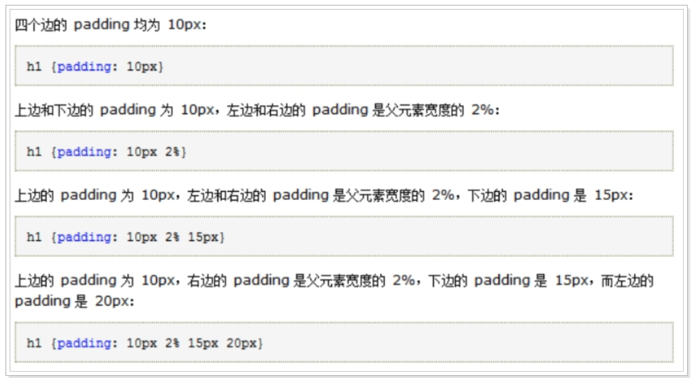

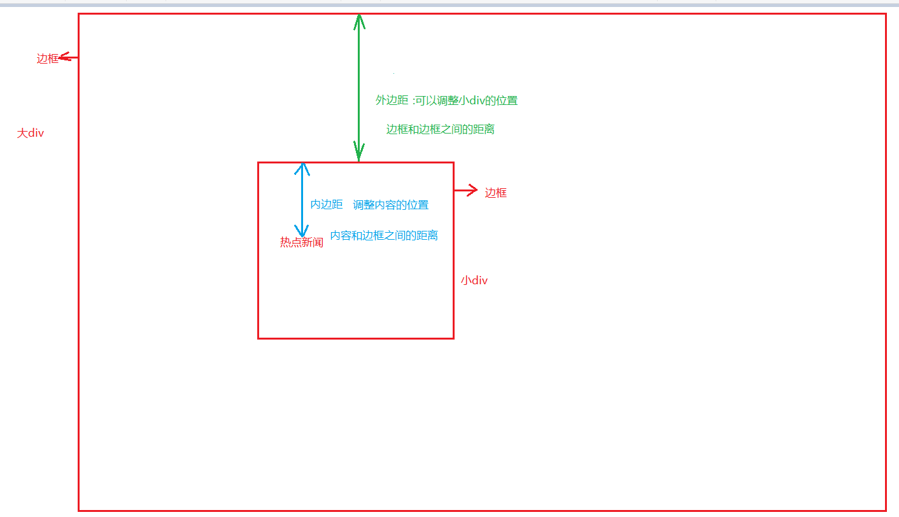

```html
<!DOCTYPE html>
<html>
<head>
    <meta charset="UTF-8">
    <title>盒子模型</title>
    <style type="text/css">
        /*
        外边距:边框和外面的div或者页面边缘的距离
          margin-top->设置上面的外边距
          margin-right->设置右边
          margin-bottom->设置下面
          margin-left->设置左边
          
          看上不看下,看左不看右
          
          内边距:内容到边框的距离
          padding-top
          padding-right
          padding-bottom
          padding-left
        */
        div{
            border: 2px solid red;
            width: 200px;
            height: 200px;
            
            margin-top: 100px;
            margin-left: 100px;
            margin-right: 200px;
            margin-bottom: 300px;
            
            padding-top: 20px;
            padding-left:10px;
        }
    </style>
</head>
<body>
<div>我是一个div</div>
</body>
</html>
```

```html
<!DOCTYPE html>
<html>
<head>
    <meta charset="UTF-8">
    <title>盒子模型</title>
    <style type="text/css">
        /*
        盒子模型多属性值使用:
         - margin: 50px; 上下左右
         - margin: 10px 50px; 上下 10 , 左右50
         - margin: 10px 20px 30px; 上10 ,左右20, 下30
         - margin: 10px 20px 30px 40px; 顺时针 上 右 下 左
         - margin: 0 auto; 上下0, 左右距离自动调整(居中)
        */
        div{
            border: 2px solid red;
            width: 200px;
            height: 200px;
            
            /*margin: 50px;*/
           /* margin: 10px 50px;*/
            /*margin: 10px 20px 30px;*/
    
            margin: 10px 20px 30px 40px;
        }
    </style>
</head>
<body>
<div>我是一个div</div>
</body>
</html>
```
