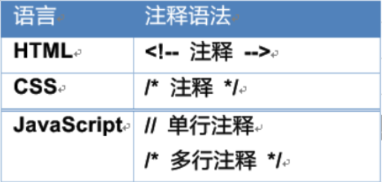
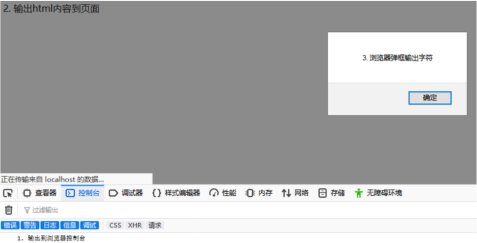
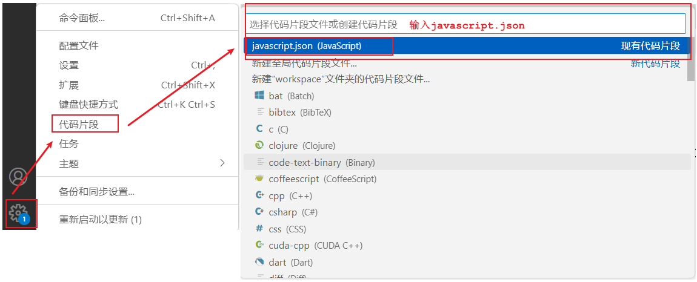
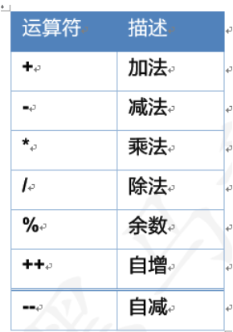
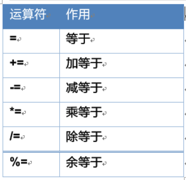
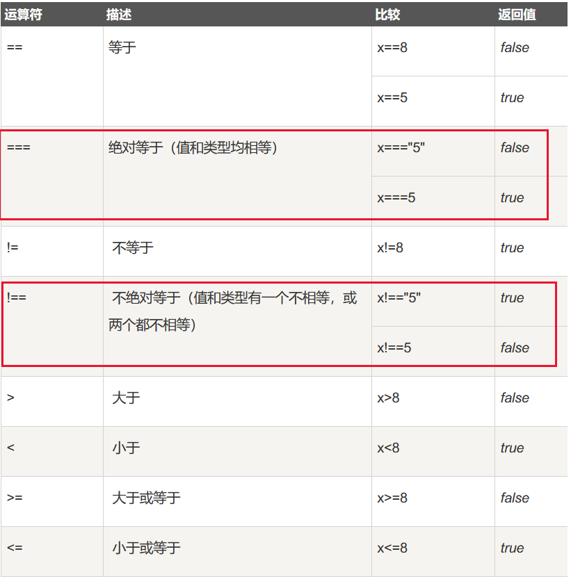
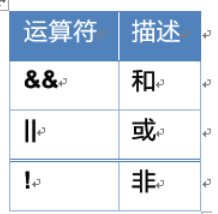
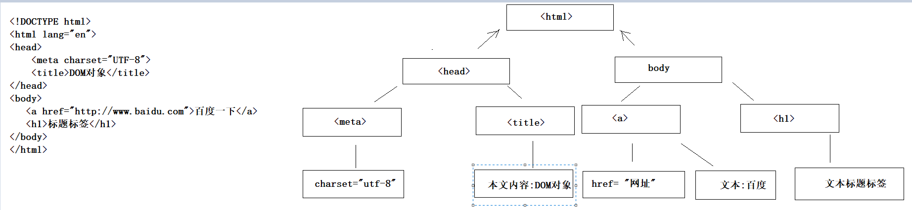
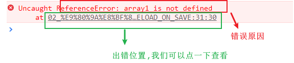
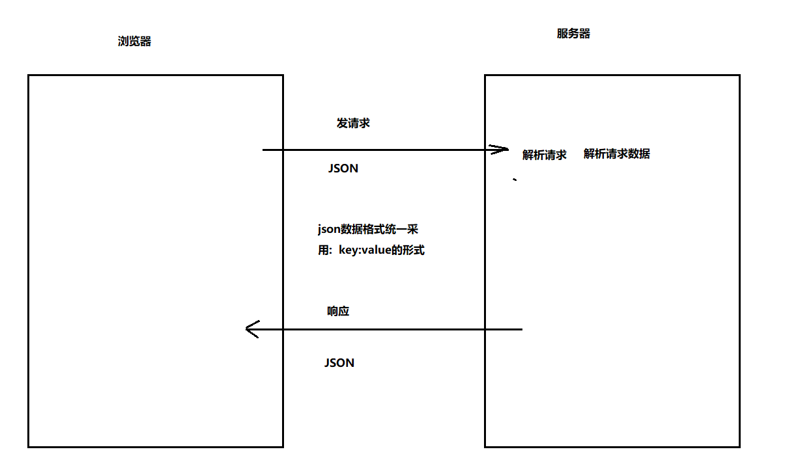

# day02.JavaScript脚本语言

```java
课前回顾:
  1.基本标签:
    p标签  hn  hr  font  br a   b  u  i
  2.表格标签:
    table  tr  th  td
  3.块级标签:
    div  span
  4.图片标签: img
  5.表单标签:form -> 将表单中的数据提交给服务器
    属性: action = "写的发送给服务端的url"
         method = "发送的请求方法" -> get post
  6.嵌套在form表单中的标签: input
    type = "text" 普通的输入框
    name = ""  提交给服务器时请求参数的key
    value = "" 提交给服务器时请求参数的value
   
    type = "password" 密码输入框
    type = "radio" 单选框
    type = "checkbox" 复选框
    type = "file" 文件上传
    type = "button" 普通按钮 -> 都是js的事件使用
    type = "reset" 重置按钮
    type = "submit" 提交表单按钮
    type = "image" 图片提交按钮
  7.下拉菜单:
    select
    option标签:给下拉菜单添加内容
          属性:value  -> 给option设置value值,就相当于给select设置value值
  8.css:层叠样式表->美化页面
    a.引入方式:
      行内样式  内部样式  外部样式
    b.选择器:
      #id属性值{}
      .class属性值{}
      标签名{}
  9.get和post请求的区别:
    a.get请求:请求参数显示在浏览器地址栏上
    b.post请求:请求参数不会显示在浏览器地址栏上,会显示在请求体中
        
今日重点:
  1.会定义js的函数
  2.会使用DOM对象操作标签->操作标签的属性以及标签体
  3.会使用JS事件
  4.知道json数据格式,以及基本操作
```

# 第一章.JS介绍

```java
1.脚本语言：JavaScript是一种解释型的脚本语言。不同于C、C++、Java等语言先编译后执行,	JavaScript不会产生编译出来的字节码文件，而是在程序的运行过程中对源文件逐行进行解释；

2.基于对象：JavaScript是一种基于对象的脚本语言，它不仅可以创建对象，也能使用现有的对象。但是面向对象的三大特性：『封装』、『继承』、『多态』中，JavaScript能够实现封装，可以模拟继承，不支持多态，所以它不是一门面向对象的编程语言；

3.弱类型：JavaScript中也有明确的数据类型，但是声明一个变量后它可以接收任何类型的数据，并且会在程序执行过程中根据上下文自动转换类型；

4.事件驱动：JavaScript是一种采用事件驱动的脚本语言，它不需要经过Web服务器就可以对用户的输入做出响应；

5.跨平台性：JavaScript脚本语言不依赖于操作系统，仅需要浏览器的支持。因此一个JavaScript脚本在编写后可以带到任意机器上使用，前提是机器上的浏览器支持JavaScript脚本语言。目前JavaScript已被大多数的浏览器所支持；
```

## 1.什么是JS

```JAVA
1.概述:javascript简称js,是嵌套在页面上的一个脚本语句,用于web开发
2.作用:让页面动起来,让页面更生动,提高了页面与用户的互动性,提高了用户的使用体验    
```


## 2.JS三大组成部分

| 组成部分                               | 作用                                                         |
| -------------------------------------- | ------------------------------------------------------------ |
| ECMA Script                            | 所有脚本语言规范,构成了js的语法基础                          |
| BOM(浏览器自带的 前进 后退 刷新)       | Browser Object Model 浏览器对象模型,用来操作浏览器中各个对象 |
| DOM(专门操作html标签的 比如input div ) | Document Object Model 文档对象模型,用来操作网页中的各个元素(标签)<br/>操作流程:1.获取标签    2. 可以提取  然后操作标签属性(赋值取值)     操作标签体的文本部分 |

## 3.网页中各技术的作用

| 技术       | 作用                                                  |
| ---------- | ----------------------------------------------------- |
| HTML       | 创建网页,构建网页                                     |
| CSS        | 美化网页                                              |
| JavaScript | 用于网页交互,让网页动起来,让网页更加美观,提高用户体验 |

# 第二章.JS入门

## 1.案例入门

```java
需求:
  使用js在网页上输出5个HelloWorld
```

```html
<!DOCTYPE html>
<html lang="en">
  <head>
    <meta charset="UTF-8" />
    <meta name="viewport" content="width=device-width, initial-scale=1.0" />
    <title>js初体验</title>
  </head>
  <body></body>

  <script>
    for (var i = 0; i < 10; i++) {
      //在浏览器的控制台上输出 -> F12 -> console
      console.log("我爱JavaScript111");
    }
  </script>
</html>
```

> script标签可以放到html页面的任意位置,习惯上放到body下面,或者head头标签中,但是实际开发中一般都是将js放到单独的js文件中,然后在当前页面引入

## 2.JS注释



# 第三章.JS的两种引入方式

## 1.script代码引入1_内部引入

```html
1.方式1(内部引入):直接将js代码嵌套在当前页面上
2.格式:
<script>
   js代码
</script>
```

```html
<!DOCTYPE html>
<html lang="en">
  <head>
    <meta charset="UTF-8" />
    <meta name="viewport" content="width=device-width, initial-scale=1.0" />
    <title>js初体验</title>
  </head>
  <body></body>

  <script>
    for (var i = 0; i < 10; i++) {
      //在浏览器的控制台上输出 -> F12 -> console
      console.log("我爱JavaScript111");
    }
  </script>
</html>

```

## 2.script代码引入2_外部引入

```java
1.外部引入:需要先创建一个js文件 -> 取名为xxx.js,然后将js代码放到js文件中
2.在当前页面引入外部js文件
  <script src = "js文件的路径"></script>  
```

```js
for (var i = 0; i < 5; i++) {
   console.log("柳岩爱涛哥");
}
```

```html
<!DOCTYPE html>
<html lang="en">
<head>
    <meta charset="UTF-8">
    <meta name="viewport" content="width=device-width, initial-scale=1.0">
    <title>Document</title>
    <script src="../js/js.js"></script>
</head>
<body>
    
</body>
</html>
```

# 第四章.JS的三种输出方式



```java
控制台输出.console.log(输出内容)->在浏览器的控制台上 -> 输出内容如果是标签形式,不生效console.log("<h1>浏览器控制台输出</h1>");
弹窗输出.alert(输出内容) -> 在浏览器上弹窗,有阻塞效果，它没执行后面的都生成不了 -> 输出内容如果是标签形式,不生效alert("<h1>浏览器弹窗输出</h1>");
页面输出.document.write(输出内容) -> 在页面上输出 -> 输出内容如果是标签形式,生效    
```

```html
<!DOCTYPE html>
<html lang="en">
<head>
    <meta charset="UTF-8">
    <meta name="viewport" content="width=device-width, initial-scale=1.0">
    <title>输出方式</title>
</head>
<body>
    
</body>
<script>
    alert("浏览器弹窗输出");
    console.log("浏览器控制台输出");
    document.write("页面输出");
</script>
</html>
```

```html
<!DOCTYPE html>
<html lang="en">
<head>
    <meta charset="UTF-8">
    <meta name="viewport" content="width=device-width, initial-scale=1.0">
    <title>输出方式</title>
</head>
<body>
    
</body>
<script>
    alert("<h1>浏览器弹窗输出</h1>");
    console.log("<h1>浏览器控制台输出</h1>");
    document.write("<h1>页面输出</h1>");
</script>
</html>
```

> 在vscode软件中添加代码块快捷键:
>
> 
>
> ```java
> "Print to console": {
> 	"prefix": "log",
> 	"body": [
> 		"console.log($1);"
> 	],
> 	"description": "Log output to console"
> },
> 
> "Print out fori": {
> 	"prefix": "fori",
> 	"body": [
> 		"for (var i = 0; i < $1; i++) {",
> 		"   $2$0",
> 		"}"
> 	],
> 	"description": "Output Loop 'fori'"
> },
> 
> "Print out dw": {
> 	"prefix": "dw",
> 	"body": [
> 		"document.write($2$0);"
> 	],
> 	"description": "Output Loop 'dw'"
> }
> ```

# 第五章.JS的基本使用

## 1.JS的数据类型

```java
1.java中的数据类型分为基本类型和引用类型
2.但是js中的数据类型一共有6种
3.判断js中数据类型:
  typeof 变量名
```

| 关键字    | 说明                                  |
| --------- | ------------------------------------- |
| number    | 数字类型:包括整数,小数                |
| boolean   | true和false                           |
| string    | 包括: ""    ''     ``                 |
| object    | 对象型                                |
| undefined | 未定义类型 -> 没赋值                  |
| function  | 函数类型:所有js函数都属于function类型 |

```HTML
<!DOCTYPE html>
<html lang="en">
<head>
    <meta charset="UTF-8">
    <meta name="viewport" content="width=device-width, initial-scale=1.0">
    <title>js数据类型</title>
</head>
<body>
    
</body>
<script>
    //number
    console.log(typeof 123);
    //boolean
    console.log(typeof true);
    //string
    console.log(typeof "123");
    console.log(typeof '123');
    console.log(typeof `123`);
    //object
    console.log(typeof {name:"tom",age:20});
    console.log(typeof null);
    //undefined
    var a;
    console.log(typeof a);
    //function
    console.log(typeof function(){})
</script>
</html>
```

> | null与undefined的区别 | 说明                                |
> | --------------------- | ----------------------------------- |
> | null                  | 属于object类型,但是没有我们想要的值 |
> | undefined             | 没有为其赋值                        |

## 2.JS的变量定义

```java
1.注意:js中的变量定义和java不一样,js中的变量定义,不需要确定数据的具体类型,具体类型是根据接收到的值来确定的
    
2.定义关键字:
  var
  let
  const: 相当于定义常量,不能二次赋值,可以理解为java中的final
```

```html
<!DOCTYPE html>
<html lang="en">
<head>
    <meta charset="UTF-8">
    <meta name="viewport" content="width=device-width, initial-scale=1.0">
    <title>变量的定义</title>
</head>
<body>
    
</body>
<script>
    //var
    var a = 10;
    console.log(a);

    //let
    let b = 20;
    console.log(b);

    //const
    const c = 30;
    //c = 40;
    console.log(c);
</script>
</html>
```

> var和let的区别:
>
> ```java
> 1.var的作用范围大,let的作用范围小
> 2.比如:在for循环中用var定义变量,出了for循环还能用（java中定义变量 出了for用不了）
>       但是用let定义的变量,出了for循环不能使用
> ```
>
> ```html
> <!DOCTYPE html>
> <html lang="en">
> <head>
>     <meta charset="UTF-8">
>     <meta name="viewport" content="width=device-width, initial-scale=1.0">
>     <title>var和let的区别</title>
> </head>
> <body>
>     
> </body>
> <script>
>     for (var i = 0; i < 10; i++) {
>          var j = 10;
>          //let j = 10;
>     }
>     console.log(j);
> </script>
> </html>
> ```

## 3.常用的运算符

### 3.1.算术运算符(和java语言一样)

算术运算符用于执行两个变量或值的算术运算

 

### 3.2.赋值运算符(和Java一样)

赋值运算符用于给JavaScript 变量赋值

 

### 3.3.比较运算符

比较运算符用于逻辑语句的判断，从而确定给定的两个值或变量是否相等。

===即判断内容 也判断类型

 123==“123”–>true

123===“123”–>false

  

数字可以与字符串进行比较，字符串可以与字符串进行比较。字符串与数字进行比较的时候会先把字符串转换成数字然后再进行比较

```html
<!DOCTYPE html>
<html lang="en">
  <head>
    <meta charset="UTF-8" />
    <meta name="viewport" content="width=device-width, initial-scale=1.0" />
    <title>js运算符中的==和===</title>
  </head>
  <body></body>
  <script>
    var i = 123;
    var j = "123";
    console.log(i == j);
    console.log(i === j);
  </script>
</html>

```

### 3.4.逻辑运算符(跟Java一样)

逻辑运算符用来确定变量或值之间的逻辑关系，支持短路运算

 

js中逻辑运算符不存在单与&、单或|

### 3.5.三元运算符(跟java一样)

  

### 3.6.小结

- 运算符 === 有什么作用？

  ```java
  恒等于,既比较值,还比较类型
  ```

## 7.JS流程控制语句

```java
js中的for,while,if,switch和Java一样,不再阐述
```

## 8.JS内置对象_数组

### 8.1.Array数组

#### 8.1.1.数组的定义

```java
1.四种定义格式:
  a.var/let 数组名 = new Array() -> 创建了一个数组,里面啥也没有,长度为0
  b.var/let 数组名 = new Array(长度) -> 创建一个空数组,指定长度
  c.var/let 数组名 = new Array(元素,元素...)-> 相当于int[] arr = new int[]{1,2,3,4}
  d.var/let 数组名 = [元素1,元素2...] -> 创建数组,直接给元素
2.使用:
  取值,存值,遍历都和java一样
```

```html
<!DOCTYPE html>
<html lang="en">
<head>
    <meta charset="UTF-8">
    <meta name="viewport" content="width=device-width, initial-scale=1.0">
    <title>数组</title>
</head>
<body>
    
</body>
<script>
      //a.var/let 数组名 = new Array() -> 创建了一个数组,里面啥也没有,长度为0
      var arr1 = new Array();
      console.log(arr1.length);
      console.log(arr1);
      //b.var/let 数组名 = new Array(长度) -> 创建一个空数组,指定长度
      var arr2 = new Array(3);
      console.log(arr2.length);
      //c.var/let 数组名 = new Array(元素,元素...)-> 相当于int[] arr = new int[]{1,2,3,4}
      var arr3 = new Array(1,2,3,4);
      console.log(arr3);
      console.log(arr3[0]);
      //d.var/let 数组名 = [元素1,元素2...] -> 创建数组,直接给元素
      var arr4 = [1,2,3,4];
      console.log(arr4);
      console.log(arr4[1]);
</script>
</html>
```

#### 8.1.2.数组特点

```java
1.元素类型,因为js是弱类型语言,数组中的每个元素类型可以不一样
2.js中的数组,长度可变,可以动态的增删元素
3.js中的数组是方法(函数) -> 一会单独说
```

```html
<!DOCTYPE html>
<html lang="en">
<head>
    <meta charset="UTF-8">
    <meta name="viewport" content="width=device-width, initial-scale=1.0">
    <title>数组特点</title>
</head>
<body>
    
</body>
<script>
    var arr = [1,true,"abc"];
    console.log(arr);

    arr[4] = "hello";
    console.log(arr[4]);

    console.log(arr[3]);

    console.log(arr.length);

</script>
</html>
```

#### 8.1.3.数组的函数

```java
concat(数组)数组拼接
reverse()->数组反转
join(规则):将一个数组通过分隔符拼接成一个字符串,与字符串中的split功能相反
sort()排序
pop():删除数组中最后一个元素,返回的是被删除的元素
push():往数组最后添加一个或者多个元素
```

```html
<!DOCTYPE html>
<html lang="en">
  <head>
    <meta charset="UTF-8" />
    <meta name="viewport" content="width=device-width, initial-scale=1.0" />
    <title>数组中的函数</title>
  </head>
  <body></body>
  <script>
    var arr1 = [1,2,3,4];
    var arr2 = [4,3,2,1];
    //concat ->数组中的函数,用于合并数组
    console.log(arr1.concat(arr2));

    //reverse ->数组中的函数,用于反转数组
    console.log(arr1.reverse());

    //join ->数组中的函数,用于将数组中的元素拼接成一个字符串
    console.log(arr1.join("-"));

    //sort ->数组中的函数,用于对数组中的元素进行排序
    console.log(arr1.sort());

    //pop ->数组中的函数,用于删除数组中的最后一个元素
    console.log(arr1.pop());
    console.log(arr1);

    //push ->数组中的函数,用于向数组中添加一个或者多个元素
    console.log(arr2.push(5,"true"));
    console.log(arr2);

  </script>
</html>
```

#### 8.1.4.数组的遍历

```java
1.普通的遍历方式:普通for
  for(var i = 0;i<数组名.length;i++){
      
  }

2.增强for遍历:
  for(var 变量名 of 数组名){
      
  }
```

```html
<!DOCTYPE html>
<html lang="en">
<head>
    <meta charset="UTF-8">
    <meta name="viewport" content="width=device-width, initial-scale=1.0">
    <title>数组的遍历</title>
</head>
<body>
    
</body>
<script>
    var arr = [1,2,3,4,5];
    for(var i = 0;i < arr.length;i++){
        console.log(arr[i]);
    }

    console.log("======================");

    for (var element of arr) {
        console.log(element);
    }
</script>
</html>
```

## 9.JS函数

### 9.1.函数介绍

```java
1.概述:和java中的方法是一个意思,只不过在js中叫做函数
2.js中的函数分两种:
  a.命名函数:
    function 函数名(参数){
        方法体
    }
  b.匿名函数: -> 一般不会单独使用,都是配合js事件绑定使用
    function(参数){
        方法体
    }
```

### 9.2.函数定义方式1_命名函数

```java
1.格式:
  function 函数名(形参){
      方法体
  }
2.注意:
  a.参数不用指明数据类型,直接写参数名即可,连var都不用写
  b.js函数不用声明返回值类型,连void都没有
  c.js的函数有没有返回值,取决于在方法体中有没有写return      
```

```html
<!DOCTYPE html>
<html lang="en">
  <head>
    <meta charset="UTF-8" />
    <meta name="viewport" content="width=device-width, initial-scale=1.0" />
    <title>命名函数</title>
  </head>
  <body></body>
  <script>
    //无参无返回值
    function method01() {
      console.log("无参无返回值方法");
    }
    method01();

    //有参无返回值
    function method02(a, b) {
      console.log("有参无返回值方法");
    }
    method02(1, 2);

    //无参有返回值
    function method03() {
      return "无参有返回值方法";
    }
    var result01 = method03();
    console.log(result01);

    //有参有返回值
    function method04(a, b) {
      return "有参有返回值方法";
    }
    var result02 = method04(10,20);
    console.log(result02);
  </script>
</html>

```

### 9.3.函数定义方式2_匿名函数

```java
1.格式:
  function(形参){
      方法体
  }
2.注意:匿名函数一般都是和js事件绑定使用
```

```html
<!DOCTYPE html>
<html lang="en">
<head>
    <meta charset="UTF-8">
    <meta name="viewport" content="width=device-width, initial-scale=1.0">
    <title>匿名函数</title>
</head>
<body>
    
</body>
<script>
    var result = function(){
      console.log("匿名函数");
    }
    //console.log(result);
    result();
</script>
</html>
```

### 9.4.JS函数没有重载

```java
js中的函数没有重载,如果函数名相同了,后面的会覆盖前面的函数
```

```html
<!DOCTYPE html>
<html lang="en">
<head>
    <meta charset="UTF-8">
    <meta name="viewport" content="width=device-width, initial-scale=1.0">
    <title>js函数没有重载</title>
</head>
<body>
    
</body>
<script>
    function method01(a,b){
        console.log("两个参数的method01函数");
    }

    function method01(a,b,c,d){
        console.log("四个参数的method01函数");
    }

    method01(1,2);
</script>
</html>
```

# 第六章.BOM对象

```java
1.概述:Browser Object Model 浏览器对象模型
2.作用:操作浏览器上的元素,比如可以操作浏览器上的前进,后退按钮,刷新按钮,还有地址栏等    
```

## 1.BOM内置对象

### 1.1.确认框弹窗

```java
confirm("确认框提示内容") -> 结果是boolean型的
  
  a.如果点击确认 -> 返回true
  b.如果点击取消 -> 返回false
```

```html
<!DOCTYPE html>
<html lang="en">
  <head>
    <meta charset="UTF-8" />
    <meta name="viewport" content="width=device-width, initial-scale=1.0" />
    <title>BOM对象之确认框</title>
  </head>
  <body></body>
  <script>
    var b = confirm("这个日本女演员面试成功了嘛?");
    if (b) {
      alert("让她来二楼我的办公室一趟,告诉她顺便把门带上");
    } else {
      alert("让她滚吧!");
    }
  </script>
</html>

```

### 1.2.操作地址栏_页面跳转

```java
window.location.href="http://www.atguigu.com"
```

```html
<!DOCTYPE html>
<html lang="en">
<head>
    <meta charset="UTF-8">
    <meta name="viewport" content="width=device-width, initial-scale=1.0">
    <title>页面跳转</title>
</head>
<body>
    
</body>
<script>
    function method01(){
        //window.location.href = "http://www.atguigu.com";
        location.href = "http://www.atguigu.com";
    }
    method01();
</script>
</html>
```

> BOM中的window对象可以不写

# 第七章.DOM对象

```java
1.概述:Document Object Model 文档对象模型
2.作用:操作页面上的元素(标签)以及标签中的属性和标签中的本文部分
  a.获取页面上的标签对象
  b.操作标签上的属性:
    获取属性值
    为属性赋值
  c.操作标签中的标签体:
    获取标签体
    为标签体赋值
```

```html
<!DOCTYPE html>
<html lang="en">
<head>
    <meta charset="UTF-8">
    <title>DOM对象</title>
</head>
<body>
<a href="http://www.baidu.com">百度一下</a>
<h1>标题标签</h1>
</body>
</html>
```

DOM树




## 1.DOM对象_查找标签方法

```java
document.getElementById("id")   根据标签中的id值获取标签对象,由于id要求唯一,所以返回单个标签对象
document.getElementsByTagName("标签名")  根据标签名,获取一组标签,返回的是数组
document.getElementsByName("name值")  根据标签中的name的属性值获取标签对象,返回数组
document.getElementsByClassName("类名")根据标签中的class的值获取一组标签,返回的是数组
```

```html
<!DOCTYPE html>
<html lang="en">
<head>
    <meta charset="UTF-8">
    <title>获取标签对象</title>
</head>
<body>
<div id="d1">根据id获取标签对象</div>

<div>根据标签名获取标签对象1</div>
<div>根据标签名获取标签对象2</div>

<div name="divName">根据name值获取标签对象1</div>
<div name="divName">根据name值获取标签对象2</div>

<div class="divClass">根据class值获取标签对象1</div>
<div class="divClass">根据class值获取标签对象2</div>
</body>

<script>
 
</script>
</html>
```

```html
<!DOCTYPE html>
<html lang="en">
  <head>
    <meta charset="UTF-8" />
    <meta name="viewport" content="width=device-width, initial-scale=1.0" />
    <title>获取标签对象</title>
  </head>
  <body>
    <div id="d1">根据id获取标签对象</div>

    <div>根据标签名获取标签对象1</div>
    <div>根据标签名获取标签对象2</div>

    <div name="divName">根据name值获取标签对象1</div>
    <div name="divName">根据name值获取标签对象2</div>

    <div class="divClass">根据class值获取标签对象1</div>
    <div class="divClass">根据class值获取标签对象2</div>
  </body>
  <script>
    //document.getElementById("id")   根据标签中的id值获取标签对象,由于id要求唯一,所以返回单个标签对象
    var result01 = document.getElementById("d1");
    console.log(result01);
    console.log("=========================");
    //document.getElementsByTagName("标签名")  根据标签名,获取一组标签,返回的是数组
    var arr1 = document.getElementsByTagName("div");
    for (var i = 0; i < arr1.length; i++) {
      console.log(arr1[i]);
    }
     console.log("=========================");
    //document.getElementsByName("name值")  根据标签中的name的属性值获取标签对象,返回数组
    var arr2 = document.getElementsByName("divName");
    for(var element of arr2){
        console.log(element);
    }
    console.log("=========================");
    //document.getElementsByClassName("类名")根据标签中的class的值获取一组标签,返回的是数组
    var arr3 = document.getElementsByClassName("divClass");
    for(var element of arr3){
        console.log(element);
    }
  </script>
</html>

```

```java
扩展:
document.querySelector(CSS选择器)  通过css选择器获取一个标签.如:"#id",".类名","标签名"
document.querySelectorAll(CSS选择器) 通过css选择器获取一组标签,返回数组
```

```html
<!DOCTYPE html>
<html lang="en">
<head>
    <meta charset="UTF-8">
    <title>通过选择器获取标签对象</title>
</head>
<body>
<div id="d1">根据id获取标签对象</div>

<div>根据标签名获取标签对象1</div>
<div>根据标签名获取标签对象2</div>

<div name="divName">根据name值获取标签对象1</div>
<div name="divName">根据name值获取标签对象2</div>

<div class="divClass">根据class值获取标签对象1</div>
<div class="divClass">根据class值获取标签对象2</div>
</body>
<script>
   
</script>
</html>
```



```html
<!DOCTYPE html>
<html lang="en">
  <head>
    <meta charset="UTF-8" />
    <meta name="viewport" content="width=device-width, initial-scale=1.0" />
    <title>获取标签对象</title>
  </head>
  <body>
    <div id="d1">根据id获取标签对象</div>

    <div>根据标签名获取标签对象1</div>
    <div>根据标签名获取标签对象2</div>

    <div name="divName">根据name值获取标签对象1</div>
    <div name="divName">根据name值获取标签对象2</div>

    <div class="divClass">根据class值获取标签对象1</div>
    <div class="divClass">根据class值获取标签对象2</div>
  </body>
  <script>
   //document.querySelector(CSS选择器)  通过css选择器获取一个标签.如:"#id",".类名","标签名"
   var result01 = document.querySelector("#d1");
   console.log(result01);

   var result02 = document.querySelector("div");
   console.log(result02);
   console.log("=========================");
   //document.querySelectorAll(CSS选择器) 通过css选择器获取一组标签,返回数组
   var arr1 = document.querySelectorAll("div");
   for(var i = 0;i<arr1.length;i++){
       console.log(arr1[i]);
   }
  </script>
</html>
```

## 2.属性操作

| 需求       | 操作方式                 |
| ---------- | ------------------------ |
| 获取属性值 | 标签对象.属性名          |
| 为属性赋值 | 标签对象.属性名 = 属性值 |

```html
<!DOCTYPE html>
<html lang="en">
<head>
    <meta charset="UTF-8">
    <title>操作标签属性</title>
</head>
<body>
<a href="http://www.baidu.com" id="a1">百度</a>
</body>

<script>
   
</script>
</html>
```

```html
<!DOCTYPE html>
<html lang="en">
<head>
    <meta charset="UTF-8">
    <meta name="viewport" content="width=device-width, initial-scale=1.0">
    <title>操作属性</title>
</head>
<body>
   <a href="http://www.baidu.com" id="a1">百度</a> 
</body>
<script>
    var a1 = document.getElementById("a1");
    console.log(a1.href);

    //为a标签的herf属性赋值
    a1.href = "http://www.qq.com";
</script>
</html>
```

## 3.标签体操作

| 需求       | 操作方式                                                     |
| ---------- | ------------------------------------------------------------ |
| 获取标签体 | 标签对象.innerText<br>标签对象.innerHTML                     |
| 设置标签体 | 标签对象.innerText = "标签体内容"<br>标签对象.innerHTML = "标签体内容" |

```java
innerText和innerHTML区别:
  相同点:都可以操作标签体
  不同点:如果使用innerText给标签体设置子标签,是不生效的(纯文本)
        如果使用innerHTML给标签体设置子标签,会生效(设置标题标签是会生效的)
```

```html
<!DOCTYPE html>
<html lang="en">
<head>
    <meta charset="UTF-8">
    <title>操作标签体</title>
</head>
<body>
  <span id="s1">我是span1</span>
  <span id="s2"></span>
  <span id="s3"></span>
  <span id="s4"></span>
  <span id="s5"></span>
</body>
<script>
   
</script>
</html>
```

```html
<!DOCTYPE html>
<html lang="en">
  <head>
    <meta charset="UTF-8" />
    <meta name="viewport" content="width=device-width, initial-scale=1.0" />
    <title>操作标签体</title>
  </head>
  <body>
    <span id="s1">我是span1</span>
    <span id="s2"></span>
    <span id="s3"></span>
    <span id="s4"></span>
    <span id="s5"></span>
  </body>

  <script>
    //1.获取第一个span标签的标签体
    var span1 = document.getElementById("s1");
    var span1Text = span1.innerText;
    var span1HTML = span1.innerHTML;
    console.log(span1Text);
    console.log(span1HTML);

    //2.为第二个span设置标签体
    var span2 = document.getElementById("s2");
    span2.innerText = "我是span2";

    //3.为第三个span设置标签体
    var span3 = document.getElementById("s3");
    span3.innerHTML = "我是span3";

    //4.为第四个span设置标签体
    var span4 = document.getElementById("s4");
    span4.innerText = "<h1>我是span4</h1>";

    //5.为第五个span设置标签体
    var span5 = document.getElementById("s5");
    span5.innerHTML = "<h1>我是span5</h1>";
  </script>
</html>
```

## 4.标签添加和删除

| API                                      | 功能                                                         |
| ---------------------------------------- | ------------------------------------------------------------ |
| document.createElement("标签名")         | 创建元素节点并返回被创建的标签对象，但不会自动添加到文档中,需要用到appendChild函数将创建的标签添加到指定的标签中 |
| 标签对象.appendChild(ele)                | 将ele添加到标签对象所有子节点后面                            |
| parentEle.insertBefore(newEle,targetEle) | 将newEle插入到targetEle前面-> parentEle指的是父标签          |
| parentEle.replaceChild(newEle, oldEle)   | 用新节点替换原有的旧子节点 -> parentEle指的是父标签          |
| element.remove()                         | 删除某个标签,element指的是要删除的标签对象                   |

```html
<!DOCTYPE html>
<html lang="en">
<head>
    <meta charset="UTF-8">
    <title>标签添加和删除</title>
</head>
<body>
  <ul id="city">
    <li id="bj">北京</li>
    <li id="sh">上海</li>

    <li id="sz">深圳</li>
    <li id="gz">广州</li>
  </ul>
</body>

<script>
  /*
    需求1:创建li标签,标签体为"西安"
         将li标签放到ul标签中
   */
  

  /*
     需求2:将"西安"添加到深圳前面
  */


  /*
     需求3:用"西安"替换"深圳"
  */
 

  /*
     需求4:删除上海这个标签
  */


</script>
</html>
```

```html
<!DOCTYPE html>
<html lang="en">
<head>
    <meta charset="UTF-8">
    <meta name="viewport" content="width=device-width, initial-scale=1.0">
    <title>添加和删除标签</title>
</head>
<body>
  <ul id="city">
    <li id="bj">北京</li>
    <li id="sh">上海</li>

    <li id="sz">深圳</li>
    <li id="gz">广州</li>
  </ul>
</body>

<script>
   /*
    需求1:创建li标签,标签体为"西安"
         将li标签放到ul标签中
   */
  //1.创建li标签
  var liElement = document.createElement("li");
  //2.为li标签设置标签体
  liElement.innerText = "西安";
  //3.获取ul标签
  var ulElement = document.getElementById("city");
  ulElement.appendChild(liElement);
  

  /*
     需求2:将"西安"添加到深圳前面
  */
 //1.获取"深圳"
 var szElement = document.getElementById("sz");
 ulElement.insertBefore(liElement,szElement);

  /*
     需求3:用"西安"替换"深圳"
  */
 ulElement.replaceChild(liElement,szElement);
 

  /*
     需求4:删除上海这个标签
  */
 document.getElementById("sh").remove();

</script>
</html>
```

# 第八章_JS事件

## 1.JS事件介绍

```java
用户在操作网页的时候,会有各种操作,每种操作都会有一个对应的事件,我们可以通过js来监听这些事件,对这些事件进行编写函数来处理具体的操作,来实现与用户的交互
    
事件可以理解为监听用户在页面上做的动作,用户做完这些动作,页面会出现什么样的效果呢?需要将整个事件绑定一个函数来处理
```

## 2.设置JS事件的两种方式

```java
1.方式1:直接在标签中加入事件,让此事件调用某个函数,然后我们在script标签中定义这个函数
  <input type = "button" value = "普通按钮" 事件名 = "函数名()"/>
  function 函数名(){
    
  }


2.方式2:直接利用DOM对象获取标签对象然后绑定对应的事件,然后利用匿名函数和事件绑定起来
  document.getElementById("标签id的属性值").事件 = function(){
    
  }

3.注意:
  事件名称都是on开头的
```

```html
<!DOCTYPE html>
<html lang="en">
<head>
    <meta charset="UTF-8">
    <title>事件初体验</title>
</head>
<body>
<input type="button" value="命名函数" id="b1" onclick="method01()"/><br/>
<input type="button" value="匿名函数" id="b2"/><br/>
</body>

<script>
 
</script>
</html>
```

```java
<!DOCTYPE html>
<html lang="en">
<head>
    <meta charset="UTF-8">
    <meta name="viewport" content="width=device-width, initial-scale=1.0">
    <title>JS事件初体验</title>
</head>
<body>
    <input type="button" value="命名函数" id="b1" onclick="method01()"/><br/>
    <input type="button" value="匿名函数" id="b2"/><br/>
</body>

<script>
    function method01(){
        alert("我是命名函数");
    }

    document.getElementById("b2").onclick = function(){
        alert("我是匿名函数");
    }
</script>
</html>
```

## 3.鼠标点击事件

```java
onclick:单击事件
ondblclick:双击事件
```

```html
<!DOCTYPE html>
<html lang="en">
<head>
    <meta charset="UTF-8">
    <title>点击事件</title>
</head>
<body>
姓名:<input type="text" id="t1"><br/>
姓名:<input type="text" id="t2"><br/>
<input type="button" value="单击复制/双击清除" id="b1"/>
</body>
<script>
 
</script>
</html>
```

```html
<!DOCTYPE html>
<html lang="en">
  <head>
    <meta charset="UTF-8" />
    <meta name="viewport" content="width=device-width, initial-scale=1.0" />
    <title>点击事件</title>
  </head>
  <body>
    姓名:<input type="text" id="t1" /><br />
    姓名:<input type="text" id="t2" /><br />
    <input type="button" value="单击复制/双击清除" id="b1" />
  </body>
  <script>
     //给按钮绑定一个单击事件
     document.getElementById("b1").onclick = function(){
        //获取两个文本框的值
        var t1Element = document.getElementById("t1");
        var t2Element = document.getElementById("t2");
        t2.value = t1.value;
     }

     //给按钮绑定一个双击事件
     document.getElementById("b1").ondblclick = function(){
        //获取两个文本框的值
        var t1Element = document.getElementById("t1");
        var t2Element = document.getElementById("t2");
        t1Element.value = "";
        t2Element.value = "";
     }
  </script>
</html>

```

## 4.焦点事件

```java
onfocus:得到焦点
onblur:失去焦点
```

```html
<!DOCTYPE html>
<html lang="en">
<head>
    <meta charset="UTF-8">
    <title>焦点事件</title>
</head>
<body>
用户名:<input type="text" id="user"/><span id="info" style="color: red"></span>
</body>

<script>
  
</script>
</html>
```

```html
<!DOCTYPE html>
<html lang="en">
<head>
    <meta charset="UTF-8">
    <meta name="viewport" content="width=device-width, initial-scale=1.0">
    <title>焦点事件</title>
</head>
<body>
    用户名:<input type="text" id="user"/><span id="info" style="color: red"></span>
</body>
<script>
    document.getElementById("user").onfocus = function(){
       //获取span标签对象
       var spanElement = document.getElementById("info");
       spanElement.innerText = "";
    }

    document.getElementById("user").onblur = function(){
       //获取span标签对象
       var spanElement = document.getElementById("info");
       spanElement.innerText = "用户名不能为空";
    }
</script>
</html>
```

### 5.改变事件

```java
1.onchange:改变事件-> 当一个框中的内容改变了,就会触发onchange事件
    
2.this:
  a.this在哪个标签对象绑定的事件中使用,this就代表哪个标签对象
  b.如果this直接放到标签中使用,那么this就直接代表当前所在标签对象
    <input type = "text" 事件 = "函数名(this)"/>
```

```html
<!DOCTYPE html>
<html lang="en">
<head>
    <meta charset="UTF-8">
    <title>改变事件</title>
</head>
<body>
<select id = "city">
  <option value = "广州">广州</option>
  <option value = "上海">上海</option>
  <option value = "北京">北京</option>
</select>

<hr/>

将字母转成大写:<input type="text" id="user"/>

</body>

<script>
 
</script>
</html>
```

```html
<!DOCTYPE html>
<html lang="en">
  <head>
    <meta charset="UTF-8" />
    <meta name="viewport" content="width=device-width, initial-scale=1.0" />
    <title>改变事件</title>
  </head>
  <body>
    <select id="city">
      <option value="广州">广州</option>
      <option value="上海">上海</option>
      <option value="北京">北京</option>
    </select>

    <hr />

    将字母转成大写:<input type="text" id="user" />
  </body>

  <script>
    document.getElementById("city").onchange = function () {
      alert(this.value);
    };

    document.getElementById("user").onchange = function(){
        this.value = this.value.toUpperCase();
    }

  </script>
</html>
```

# 第九章.JSON

## 1.Json介绍

```java
(JavaScript] Object Notation) 是一种轻量级的数据交换格式。它基于 ECMAScript (欧洲计算机协会制定的js规范)的一个子集，采用完全独立于编程语言的文本格式来存储和表示数据。简洁和清晰的层次结构使得 JSON 成为理想的数据交换格式。 易于人阅读和编写，同时也易于机器解析和生成，并有效地提升网络传输效率。
```



## 2.Json的数据格式

```java
1.数组格式：[obj,obj,obj...]，使用中括号包裹，数组的元素可以是任意类型，多个元素之间逗号分开。

2.对象格式：{"key1":obj,"key2":obj,"key3":obj...}，使用大括号包裹，对象采用键值对形式，键必须是字符串类型，值可以是任意类型，多个键值对之间逗号分开。

3.数组和对象之间可以相互嵌套
```

## 3.Json数据解析

### 3.1.json数组

```html
<!DOCTYPE html>
<html lang="en">
<head>
    <meta charset="UTF-8">
    <title>json数组</title>
</head>
<body>

</body>

<script>
    var jsonArr = [1,2,3,4,5];
    for (var number of jsonArr) {
        console.log(number);
    }
</script>
</html>
```

### 3.2.json对象

```html
<!DOCTYPE html>
<html lang="en">
<head>
    <meta charset="UTF-8">
    <title>json对象</title>
</head>
<body>

</body>
<script>
   var person = {"name":"tom","age":20};
   console.log(person.name+"..."+person.age);
</script>
</html>
```

### 3.3.json数组嵌套对象

```html
<!DOCTYPE html>
<html lang="en">
<head>
    <meta charset="UTF-8">
    <title>数组套对象</title>
</head>
<body>

</body>
<script>
   var arr = [
     {"name":"tom","age":20},
     {"name":"jack","age":30}
   ];

   for (var objectData of arr) {
     console.log(objectData.name+"..."+objectData.age);
   }
</script>
</html>
```

### 3.4.json对象嵌套数组

```html
<!DOCTYPE html>
<html lang="en">
<head>
    <meta charset="UTF-8">
    <title>对象套数组</title>
</head>
<body>

</body>
<script>
  var personArr = {
    "key1":[
      {"name":"tom","age":20},
      {"name":"jack","age":30}
    ]
  }

  var keyArr = personArr.key1;

  for (var keyArrElement of keyArr) {
    console.log(keyArrElement.name+"..."+keyArrElement.age);
  }
</script>
</html>
```

### 3.5.json对象嵌套数组_多个键值对

```html
<!DOCTYPE html>
<html lang="en">
<head>
    <meta charset="UTF-8">
    <title>json对象套数组,包含多个键值对</title>
</head>
<body>

</body>
<script>
  var personArr = {
    "key1":[
      {"name":"tom","age":20},
      {"name":"jack","age":30}
    ],

    "key2":[
      {"name":"rose","age":200},
      {"name":"jetty","age":300}
    ]
  }

  var keyArr = personArr.key1;

  for (var keyArrElement of keyArr) {
    console.log(keyArrElement.name+"..."+keyArrElement.age);
  }

  console.log("==========");

  var key2Arr = personArr.key2;

  for (var keyArrElement of key2Arr) {
    console.log(keyArrElement.name+"..."+keyArrElement.age);
  }

</script>
</html>
```

### 3.6.JSON和字符串之间的转换

#### 3.6.1.json转成string

```js
var jsonObj = {"stuName":"tom","stuAge":20};
var jsonStr = JSON.stringify(jsonObj);

console.log(typeof jsonObj); // object
console.log(typeof jsonStr); // string
```

#### 3.6.2.string转成json

```js
jsonObj = JSON.parse(jsonStr);
console.log(jsonObj); // {stuName: "tom", stuAge: 20}
```

