# day03.正则_xml_tomcat_http

```java
课前回顾:
  1.js的输出语句:
    alert -> 弹窗
    console.log -> 浏览器控制台
    document.write()-> 在页面上输出
  2.变量:
    var(作用范围大) let(作用范围小) const(常量)
  3.js中的数据类型:
    number string boolean object undefined function
  4.数组:
    var 数组名 = new Array()
    var 数组名 = new Array(长度)
    var 数组名 = new Array(元素1,元素2)
    var 数组名 = [元素1,元素2]
    
    获取,遍历和java都一样
  5.运算符:
    ==:比较值
    ===:比较的值和类型
  6.函数:
    function 函数名(形参){
        方法体
        return 结果
    }

    function(形参){
        方法体
        return 结果
    }
  7.BOM:浏览器对象模型 -> 操作浏览器上的各个组件
    confirm -> 确认框
    location.href = "" -> 操作浏览器的地址栏内容
  8.DOM:文档对象模型 -> 操作html中的标签
    a.获取标签对象:
      document.getElementById("id属性值")
    b.操作标签属性
      标签对象.属性名 -> 获取属性值
      标签对象.属性名 = "值" ->为属性赋值
    c.操作标签体
      标签对象.innerText = "" -> 设置标签体,写标签不生效
      标签对象.innerHTML= "" ->设置标签体,写标签生效
  9.事件 -> 用于监听用户在页面上的操作动作,一般事件都是和一个函数绑定的        
    
    a.直接在标签中写: 事件 = "函数名()"
      function 函数名(){
        
      }  
    b.获取标签对象直接绑定:
      标签对象.事件名 = function(){
          
      }

   10.json:  客户端和服务端之间交互的一个轻量级数据格式 -> key:value形式
       
今日重点:
  1.快递管理第一期
  2.会简单写一个xml文件
  3.会在idea中配置tomcat
  4.会创建web项目,将其部署到tomcat下
  5.会通过tomcat启动web项目,访问web项目的首页
  6.会通过浏览器看http的请求和响应
```

# 第一章.正则表达式

## 1.正则表达式概念

```java
1.什么是正则表达式:字符串表示的匹配规则
2.作用:主要用于校验
3.比如:校验一个QQ号
       a.不能是0开头   if(startsWith("0"))
       b.只能是数字    if(字符>='0' && 字符<='9')
       c.5-15位      if(字符串.length()>=5 && 字符串.length()<=15)
    
  正则:[1-9][0-9]{4,14}   []代表区间
```

|   表达式    | 描述                                                         |
| :---------: | :----------------------------------------------------------- |
|    [a-z]    | 这个字符必须是小写字母    a   [] 代表区间                    |
|    [abc]    | 字符必须是abc      z                                         |
|    [0-9]    | 这个字符必须是数字   5                                       |
| [a-zA-Z0-9] | 这个字符必须是字母或者是数字  [a-zA-Z0-9]                    |
|   [^a-z]    | 这个字符不是小写字母          ==[]中写^代表取反==            |
|    [\d]     | 等同于[0-9]                                                  |
|    [\w]     | 等同于[a-zA-Z_0-9] 字母、数字、下划线                        |
|    [\D]     | 等同于`[^0-9]`  =》不是数字                                  |
|    [\W]     | 等同于`[^a-zA-Z_0-9]`                                        |
|      .      | 代表匹配任意字符， 若只是想代表普通数据`.` 需要使用转义字符来表示`\.` |
|     X*      | X这个字符可以出现零次或者多次 [0-9]*  111                    |
|     X?      | X这个字符可以出现零次或者一次 [0-9] ?                        |
|     X+      | X这个字符可以出现一次或者多次 [0-9] +                        |
|    X{m}     | X这个字符出现次数正好m次 [0-9]{4}                            |
|   X{m, }    | X这个字符出现次数至少m次 [0-9]{4, }                          |
|   X{m, n}   | X这个字符出现次数至少m次,最多n次 [0-9]{3,5}                  |
|    (X)+     | ()括号代表X所表示的内容作为一组数据出现；()括号后面的+号，代表这组数据可以出现一次或者多次  (abc)+  -->代表的是abc可以连续出现一次或多次   (abc) +   abcabc  abcabcabc |
|     ^X      | ^匹配开头                                                    |
|     X$      | $匹配结尾                                                    |

> ^如果在[]里面,代表取反
>
> ^如果在[]外面,代表以什么开头
>
> $:代表以什么什么结尾

## 2.正则表达式的创建和使用

```java
1.定义方式1:
  var 变量名 = /正则表达式/
2.定义方式2:
  var 变量名 = new RegExp("正则表达式")
3.正则表达式匹配判断方法
  正则表达式.test(字符串) -> 判断字符串是否符合正则表达式规则
```

| 说明                                | 方法                               |
| ----------------------------------- | ---------------------------------- |
| 正则表达式.test(被匹配的字符串内容) | 判断字符串是否符合指定的正则表达式 |
| string中的方法:match(正则表达式)    | 根据正则表达式获取对应的字符串内容 |

```html
<!DOCTYPE html>
<html lang="en">
<head>
    <meta charset="UTF-8">
    <title>正则表达式</title>
</head>
<body>

</body>
<script>
    /*
    * 1.创建方式1:
    *   var 变量名 = /正则表达式/
    * 2.创建方式2:
    *   var 变量名 = new RegExp("正则表达式")
    *
    * 3.正则表达式匹配判断方法
    *   正则表达式.test(字符串) -> 判断字符串是否符合正则表达式规则
    *
    */
    var regex1 = /^[1][358][0-9]{9}$/;
    var result01 = regex1.test("13838381438");
    console.log(result01);

    console.log("===========================");
    var regex2 = /^[1-9][0-9]{4,14}$/;
    var result02 = regex2.test("1619500491");
    console.log(result02);
</script>
</html>
```

## 3.模糊匹配和精确匹配

```html
<!DOCTYPE html>
<html lang="en">
<head>
    <meta charset="UTF-8">
    <title>正则表达式的模糊匹配和精准匹配</title>
</head>
<body>

</body>
<script>
    var regex1 = /abcd/;
    let result01 = regex1.test("abcde");//true 因为js正则默认是模糊匹配
    console.log(result01);

    console.log("==========");

    /*
       ^:代表的是以啥开头
       $:代表的是以啥结尾
     */
    var regex2 = /^abcd$/;
    let result02 = regex2.test("abcde");
    console.log(result02);
</script>
</html>
```

## 4.正则表达式匹配模式

| 修饰符 | 描述                         |
| :----- | :--------------------------- |
| i      | 匹配时忽略大小写             |
| g      | 匹配所有符合正则表达式的字符 |

```java
1.制定匹配模式1:
  var 变量名 = new RegExp("正则","匹配模式")
      
2.制定匹配模式2:
  var 变量名 = /正则/匹配模式
```

```HTML
<!DOCTYPE html>
<html lang="en">
<head>
    <meta charset="UTF-8">
    <title>匹配模式</title>
</head>
<body>

</body>
<script>
    /*
    *  1.制定匹配模式1:
         var 变量名 = new RegExp("正则","匹配模式")
          
       2.制定匹配模式2:
         var 变量名 = /正则/匹配模式
    * */

    var regex = /^abcd$/i;
    var result01 = regex.test("ABCD");
    console.log(result01);
</script>
</html>
```

## 5.常用正则表达式

| 需求     | 正则表达式                                          | 含义                                                         |
| -------- | --------------------------------------------------- | ------------------------------------------------------------ |
| 用户名   | /^[a-zA-Z_][a-zA-Z_-0-9]{5,9}$/                     | 只能以字母或者'_'开头，后面的内容可以是字母、数字、'_'、'-'都行，整个字符串只能有6-10位 |
| 密码     | /^[a-zA-Z0-9_-\@#&*]{6,12}$/                        | 密码只能由字母、数字、'_'、'-'、'@'、'#'、'\'、'&'、'*'组成，总共是6-12位 |
| 前后空格 | /^\s+\|\s+$/g                                       | 匹配开头的空格或者结尾的空格                                 |
| 电子邮箱 | /^[a-zA-Z0-9_.-]+@([a-zA-Z0-9-]+[.]{1})+[a-zA-Z]+$/ | 多个字母、数字、'.'、'-'加上@多个数字、字母、'-'再加上'.'再加上多个字母 |

## 6.生成正则表达式网站

```java
https://www.sojson.com/regex/generate
```

# 第二章.快递管理_第一期实战

## 1.登录页面校验

| 需求   | 正则表达式                      |
| ------ | ------------------------------- |
| 用户名 | /^\[a-zA-Z]\[a-zA-Z0-9]{5,9}\$/ |
| 密码   | /^\[a-zA-Z0-9]{6,12}\$/         |

## 2.准备工作

```java
将今天资料中页面原型全部粘贴到当前项目下
```


## 3.登录页面校验

```html
修改login.html
    
1.修改用户名输入框中的name属性值 -> 
  <input id="usernameInput"  type="text" name="username" size="40" class="inpMain" /> 2.给用户名和密码两个input标签上加上 :
  onchange = "checkUsername()"
  onchange = "checkPassword()"
3.修改用户名输入框对应的span标签对应的id属性值:
  <span id="usernameMsg">错误提示语!!</span>
4.在form标签上加上表单提交事件: onsubmit="return checkForm()"
5.将用户名输入框中的id属性值写成:id="usernameInput"
  将密码输入框中的id属性值写成:id="passwordInput"

6.onsubmit事件绑定的函数,如果返回true,表单会提交;返回的是false,表单不会提交
```

```html
<!DOCTYPE html PUBLIC "-//W3C//DTD HTML 4.01 Transitional//EN" "http://www.w3.org/TR/html4/loose.dtd">
<html>
<head>
    <meta http-equiv="Content-Type" content="text/html; charset=UTF-8">
    <title>快递管理系统</title>
    <meta name="Copyright" content="Douco Design."/>
    <link href="css/public.css" rel="stylesheet" type="text/css">
    <script type="text/javascript" src="js/jquery.min.js"></script>
    <script type="text/javascript" src="js/global.js"></script>
</head>
<body>
<div id="dcWrap">

    <div id="dcMain">
        <!-- 当前位置 -->
        <div id="manager" class="mainBox" style="height:auto!important;height:550px;min-height:550px;">
            <h3>用户登陆</h3>
            <form action="#" method="post" onsubmit="return checkForm()">
                <table width="100%" border="0" cellpadding="8" cellspacing="0" class="tableBasic">
                    <tr>
                        <td width="100" align="right">用户名</td>
                        <td>
                            <input id="usernameInput" type="text" name="username" size="40" class="inpMain"
                                   onchange="checkUsername()"/>&nbsp; &nbsp;
                            <span id="usernameMsg"></span>
                        </td>
                    </tr>
                    <tr>
                        <td width="100" align="right">密码</td>
                        <td>
                            <input id="passwordInput" type="password" name="password" size="40" class="inpMain"
                                   onchange="checkPassword()"/>
                            <span id="passwordMsg"></span>
                        </td>
                    </tr>
                    <tr>
                        <td></td>
                        <td>
                            <input type="submit" name="submit" class="btn" value="登录"/>
                        </td>
                    </tr>
                </table>
            </form>
        </div>
    </div>
    <div class="clear"></div>
    <div id="dcFooter">
        <div id="footer">
            <div class="line"></div>
            <ul>
                版权所有 © 2024-2025 尚硅谷教育，并保留所有权利。
            </ul>
        </div>
    </div><!-- dcFooter 结束 -->
    <div class="clear"></div>
</div>
</body>

<script>
    //1.先声明用户名和密码的正则表达式
    var usernameReg = /^[a-zA-Z][a-zA-Z0-9]{5,9}$/;
    var passwordReg = /^[a-zA-Z0-9]{6,12}$/;
    //2.声明两个变量,来接收校验用户名密码填写正确与否的结果
    var usernameFlag;
    var passwordFlag;

    //3.校验用户名
    function checkUsername() {
        //获取用户名输入框中的value
        var usernameElement = document.getElementById("usernameInput");
        var usernameValue = usernameElement.value;
        //获取用户名对应的span标签用于显示提示信息
        var spanElement = document.getElementById("usernameMsg");
        //判断输入的内容是否符合正则表达式
        if (usernameReg.test(usernameValue)){
            //为span标签体赋值
            spanElement.innerHTML = "<font style='color:green'>用户名格式正确<font>"
            usernameFlag = true;
        }else{
            spanElement.innerHTML = "<font style='color:red'>用户名格式不正确<font>"
            usernameFlag = false;
        }
    }

    //4.校验密码
    function checkPassword(){
        //获取密码输入框中的value
        var passwordElement = document.getElementById("passwordInput");
        var passwordValue = passwordElement.value;
        //获取用户名对应的span标签用于显示提示信息
        var spanElement = document.getElementById("passwordMsg");
        //判断输入的内容是否符合正则表达式
        if (passwordReg.test(passwordValue)){
            //为span标签体赋值
            spanElement.innerHTML = "<font style='color:green'>密码格式正确<font>"
            passwordFlag = true;
        }else{
            spanElement.innerHTML = "<font style='color:red'>密码格式不正确<font>"
            passwordFlag = false;
        }
    }

    //5.判断表单是否可以提交
    function checkForm(){
        return usernameFlag&&passwordFlag;
    }
</script>
</html>
```

> 注意:函数名尽量不要和事件名相同

## 4.修改密码页面校验

```java
修改password.html
1.修改原始密码输入框的name属性值 : name = "password"
2.添加新密码输入框的name属性值 : name = "newpassword"
3.修改确认密码输入框的name属性值: name = "repassword" 
4.在form标签上添加表单提交事件: onsubmit="return checkForm()"    
5.在原始密码输入框上加上改变事件:onchange="checkPassword()"
6.在新密码输入框上加上改变事件:onchange="checkNewPassword()"
7.在确认密码输入框上加上改变事件:onchange="checkRePassword()"    
```

```html
<!DOCTYPE html PUBLIC "-//W3C//DTD HTML 4.01 Transitional//EN" "http://www.w3.org/TR/html4/loose.dtd">
<html>
  <head>
    <meta http-equiv="Content-Type" content="text/html; charset=UTF-8">
    <title>快递管理系统</title>
    <meta name="Copyright" content="Douco Design." />
    <link href="css/public.css" rel="stylesheet" type="text/css">
    <script type="text/javascript" src="js/jquery.min.js"></script>
    <script type="text/javascript" src="js/global.js"></script>
  </head>
  <body>
    <div id="dcWrap">
      <div id="dcHead">
        <div id="head">
          <div class="logo"><a href="index.html"></a></div>
          <div class="nav">
            <ul class="navRight">
              <li class="M noLeft"><a href="JavaScript:void(0);">您好，admin</a>
                <div class="drop mUser">
                  <a href="password.html">修改密码</a>
                </div>
              </li>
              <li class="noRight"><a href="login.php?rec=logout">退出</a></li>
            </ul>
          </div>
        </div>
      </div>
      <!-- dcHead 结束 --> <div id="dcLeft"><div id="menu">
          <ul class="top">
            <li><a href="index.html"><i class="home"></i><em>管理首页</em></a></li>
          </ul>
          <ul>
            <li><a href="password.html"><i
                  class="system"></i><em>修改密码</em></a></li>
            <li><a href="list.html"><i class="nav"></i><em>快递管理</em></a></li>
          </ul>
        </div></div>
      <div id="dcMain">
        <!-- 当前位置 -->
        <div id="urHere">快递管理系统<b>></b><strong>修改密码</strong> </div>
        <div id="manager" class="mainBox"
          style="height:auto!important;height:550px;min-height:550px;">
          <h3><a href="index.html" class="actionBtn">返回首页</a>修改密码</h3>
          <form action="#" method="post" onsubmit="return checkForm()">
            <table width="100%" border="0" cellpadding="8" cellspacing="0"
              class="tableBasic">
              <tr>
                <td width="100" align="right">原始密码</td>
                <td>
                  <input id="oldPwdInput" type="password" name="password" size="40"
                    class="inpMain" onchange="checkPassword()"/>
                  &nbsp; &nbsp; <span id="oldPwdMsg"></span>
                </td>
              </tr>
              <tr>
                <td width="100" align="right">新密码</td>
                <td>
                  <input id="newPwdInput" type="password" name="newpassword" size="40" class="inpMain" onchange="checkNewPassword()"/>
                  &nbsp; &nbsp; <span id="newPwdMsg"></span>
                </td>
              </tr>
              <tr>
                <td align="right">确认密码</td>
                <td>
                  <input id="rePwdInput" type="password" name="repassword" size="40"
                    class="inpMain" onchange="checkRePassword()"/>
                  &nbsp; &nbsp; <span id="rePwdMsg"></span>
                </td>
              </tr>
              <tr>
                <td></td>
                <td>
                  <input type="submit" name="submit" class="btn" value="提交" />
                </td>
              </tr>
            </table>
          </form>
        </div>
      </div>
      <div class="clear"></div>
      <div id="dcFooter">
        <div id="footer">
          <div class="line"></div>
          <ul>
            版权所有 © 2024-2025 尚硅谷教育，并保留所有权利。
          </ul>
        </div>
      </div><!-- dcFooter 结束 -->
      <div class="clear"></div> </div>
  </body>
  <script>
    //1.声明密码的正则表达式
    var passwordReg = /^[a-zA-Z0-9]{6,12}$/;
    //2.定义三个标记,代表表单是否能提交
    var passwordFlag;
    var newPasswordFlag;
    var rePasswordFlag;

    //3.校验密码:
    function checkPassword(){
      //获取原始密码输入框中的value值
       var passwordElement = document.getElementById("oldPwdInput");
       var passwordValue = passwordElement.value;
       //获取原始密码输入框对应的span标签,用来展示提示信息
       var oldPwdSpan = document.getElementById("oldPwdMsg");
       if (passwordReg.test(passwordValue)){
         oldPwdSpan.innerHTML = "<font style='color:green'>密码格式正确</font>";
         passwordFlag = true;
       }else{
         oldPwdSpan.innerHTML = "<font style='color:red'>密码不格式正确</font>";
         passwordFlag = false;
       }
    }

    //4.校验新密码
    function checkNewPassword(){
      //获取新密码输入框中的value值
      var newPasswordElement = document.getElementById("newPwdInput");
      var newPassword = newPasswordElement.value;
      //获取新密码输入框对应的span标签,用来展示提示信息
      var newPwdSpan = document.getElementById("newPwdMsg");
      if (passwordReg.test(newPassword)){
        newPwdSpan.innerHTML = "<font style='color:green'>密码格式正确</font>";
        newPasswordFlag = true;
      }else{
        newPwdSpan.innerHTML = "<font style='color:red'>密码不格式正确</font>";
        newPasswordFlag = false;
      }
    }

    //5.校验确认密码
    function checkRePassword(){
      //获取新密码的value
      var newPasswordElement = document.getElementById("newPwdInput");
      var newPassword = newPasswordElement.value;
      //获取确认密码的value
      var rePasswordElement = document.getElementById("rePwdInput");
      var rePassword = rePasswordElement.value;
      //后去确认密码的span标签用于显示提示信息
      var rePwdSpan = document.getElementById("rePwdMsg");

      //比较新密码和确认密码是否一样
      if (newPassword==rePassword){
        rePwdSpan.innerHTML = "<font style='color:green'>密码一致</font>";
        rePasswordFlag = true;
      }else{
        rePwdSpan.innerHTML = "<font style='color:red'>密码不一致</font>";
        rePasswordFlag = false;
      }
    }

    //判断表单是否可以提交
    function checkForm(){
      return passwordFlag&&newPasswordFlag&&rePasswordFlag;
    }
  </script>
</html>
```

# 第三章.xml

## 1 配置文件

### 1.1.1 配置文件的作用

```java
配置文件是用于给应用程序提供配置参数以及初始化设置的一些有特殊格式的文件
```

### 1.2 常见的配置文件类型

```java
1. properties文件,例如druid连接池就是使用properties文件作为配置文件
2. XML文件,例如Tomcat就是使用XML文件作为配置文件
3. YAML文件,例如SpringBoot就是使用YAML作为配置文件
4. json文件,通常用来做文件传输，也可以用来做前端或者移动端的配置文件
```

## 2 properties文件

### 2.1 文件示例

```properties
atguigu.jdbc.url=jdbc:mysql://192.168.198.100:3306/mybatis1026
atguigu.jdbc.driver=com.mysql.jdbc.Driver
atguigu.jdbc.username=root
atguigu.jdbc.password=atguigu
```

> 编写properties配置文件注意:
>
> 1.都必须是key=value形式
>
> 2.不能有空格
>
> 3.每一个键值对写完需要换行写下一对
>
> 4.key和value都是String型的,但是请不要加""
>
> 5.不要写中文

## 3.xml文件

```xml
<?xml version="1.0" encoding="UTF-8"?>
<web-app xmlns="http://xmlns.jcp.org/xml/ns/javaee"
         xmlns:xsi="http://www.w3.org/2001/XMLSchema-instance"
         xsi:schemaLocation="http://xmlns.jcp.org/xml/ns/javaee http://xmlns.jcp.org/xml/ns/javaee/web-app_4_0.xsd"
         version="4.0">

    <!-- 配置SpringMVC前端控制器 -->
    <servlet>
        <servlet-name>dispatcherServlet</servlet-name>
        <servlet-class>org.springframework.web.servlet.DispatcherServlet</servlet-class>

        <!-- 在初始化参数中指定SpringMVC配置文件位置 -->
        <init-param>
            <param-name>contextConfigLocation</param-name>
            <param-value>classpath:spring-mvc.xml</param-value>
        </init-param>

        <!-- 设置当前Servlet创建对象的时机是在Web应用启动时 -->
        <load-on-startup>1</load-on-startup>

    </servlet>
    <servlet-mapping>
        <servlet-name>dispatcherServlet</servlet-name>

        <!-- url-pattern配置斜杠表示匹配所有请求 -->
        <!-- 两种可选的配置方式：
                1、斜杠开头：/
                2、包含星号：*.atguigu
             不允许的配置方式：前面有斜杠，中间有星号
                /*.app
         -->
        <url-pattern>/</url-pattern>
    </servlet-mapping>
</web-app>
```

## 4.xml的概述

```java
1.XML ：可扩展标记语言（EXtensible Markup Language）
        XML 它是一种标记语言，很类似 HTML，xml标签都是自定义的。 如：<user></user> 或 <student></student>
        
2.W3C在1998年2月发布1.0版本，2004年2月又发布1.1版本，但是因为1.1版本不能向下兼容1.0版本，所以1.1没有人用。同时，在2004年2月W3C又发布了1.0版本的第三版。我们要学习的还是1.0版本。
```

## 5.xml和html的差异

```java
1.xml标签都是自定义的，html标签是预定义。
2.xml的语法严格，html语法松散。 
3.xml是存储数据的，html是展示数据。
```

> 注意:
>
> ​    xml标签是可以自定义的,但是将来我们开发,xml中的标签名也不能随意写,都是有约束的
>
> ​    因为我们是一个team,我们需要约束,约束我们开发人员,只能写哪些标签

## 6.xml的创建以及文档声明

```java
1.方式1:
  创建file->取名 xxx.xml
      
2.方式2:
  配置xml模板
      
3.注意:
  a.每个xml文件第一行都要写一个文档声明
    <?xml version="1.0" encoding="UTF-8" ?>
  b.每个xml文件都必须要有一个根标签   
```

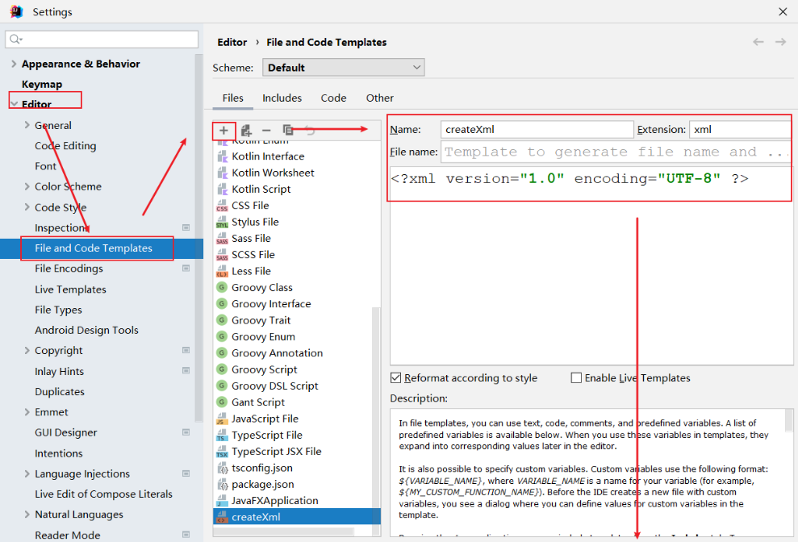

## 7.xml的注释

```java
1.注释:
  <!--
  -->
      
2.快捷键:
  ctrl+/
```

```xml
<?xml version="1.0" encoding="UTF-8" ?>
<bean>
<!--
  xml中的注释
-->
</bean>
```

## 8.xml的组成部分之标签(元素)以及注意事项

```xml
1.标签(元素):Element
2.怎么写:
  a.闭合标签
    <开始标签></结束标签>

    <开始标签>
       <子标签>
          还可以嵌套其他标签
       </子标签>    
    </结束标签>

    <开始标签>文本内容</结束标签>

  b.自闭合标签
    <标签名 />

3.注意:
  a.每一个xml文档必须有一个根标签(只有一个)
  b.标签名要写英文,不要有空格
  c.标签名不要以:xml XML Xml开头
  d.开始标签和结束标签要一致  
  e.标签名不要数字开头
```

```xml
<?xml version="1.0" encoding="UTF-8" ?>
<bean>
<!--
  1.标签(元素):Element
  2.怎么写:
    a.闭合标签
      <开始标签></结束标签>

      <开始标签>
       <子标签>
          还可以嵌套其他标签
       </子标签>    
      </结束标签>

      <开始标签>文本内容</结束标签>

  b.自闭合标签
    <标签名 />

  3.注意:
    a.每一个xml文档必须有一个根标签(只有一个)
    b.标签名要写英文,不要有空格
    c.标签名不要以:xml XML Xml开头
    d.开始标签和结束标签要一致 
    e.标签名不要数字开头
-->
    <name>
        <xing>姓</xing>
        <ming>名</ming>
    </name>
</bean>
```

## 9.xml的标签属性定义以及注意事项

```java
1.属性:attribute
2.写法:属性都是写在开始标签中
  a.<开始标签 属性名="属性值" 属性名="属性值"></结束标签>
  b.<标签名 属性名="属性值"/>
    
3.注意事项:
  a.属性都要写在开始标签中 不要写在结束标签的位置
  b.修饰key=value形式
  c.属性名不要以数字开头
  d.标签中可以有0个或者多个属性
  e.但是同一个标签中,不能出现同名的属性
```

```xml
<?xml version="1.0" encoding="UTF-8" ?>
<bean>
    <!--
      1.属性:
        属性名 = "属性值"
    -->
    <person id="p001" class="com.atguigu.person">
        <name>zhangsan</name>
        <age>18</age>
    </person>

    <student name="lisi" age="16"/>
</bean>
```

## 10.xml中的xml文档约束

```java
1.注意:xml中的标签名可以自定义,但是将来我们干开发是一个团队,就不能各写一套不同的xml,不能瞎写标签名,不然一整合,废了,所以我们在使用xml的时候也需要有约束
    
2.xml的约束:
  a.DTD约束
  b.schema约束

3.注意:
  a.两种约束,不用我们自己写,将来使用框架都是框架提供给我们的
  b.使用这两个约束,需要将两个约束文档放到我们的项目下,我们目前	将约束文档和所写的xml文档放到同一个目录下,将来我们约束文档不用自己手动导入    
```

## 11.根据DTD约束编写xml文档

```xml
直接粘贴dtd文件,粘贴一以下代码:

<?xml version="1.0" encoding="UTF-8"?>
<!--
	尚硅谷DTD教学实例文档。
	模拟spring规范，如果开发人员需要在xml使用当前DTD约束，必须包括DOCTYPE。
	格式如下：
	<!DOCTYPE beans SYSTEM "bean.dtd">
-->
<!ELEMENT beans (bean*,import*) >
<!ELEMENT bean (property*)>
<!ELEMENT property (#PCDATA)>

<!ELEMENT import (#PCDATA)>

<!ATTLIST bean id CDATA #REQUIRED
			   className CDATA #REQUIRED
			   type CDATA #IMPLIED
>

<!ATTLIST property name CDATA #REQUIRED
			   	   value CDATA #REQUIRED
>
<!ATTLIST import resource CDATA #REQUIRED>
```

```xml
<?xml version="1.0" encoding="UTF-8" ?>
<!DOCTYPE beans SYSTEM "bean.dtd">
<beans>
    <bean id="c001" className="javase">
        <property name="username" value="tom"></property>
    </bean>
    <import resource="path"></import>
</beans>
```

> 想让约束文档约束xml,需要让两个文档产生联系
>
> ```java
> <!DOCTYPE beans SYSTEM "bean.dtd">
> ```

## 12.DTD约束阅读

```java
各部分解释:
  DOCTYPE:文档类型
  beans:根标签
  SYSTEM:本地系统文件
  "bean.dtd":产生关系的文件名,写文件的路径
  bean*:可以写多个bean标签
  (bean*,import*):,表示标签顺序
  #PCDATA:此标签体中应该是文本
  CDATA:代表的是标签中的属性值为字符型
  #REQUIRED：属性值必须设置
```

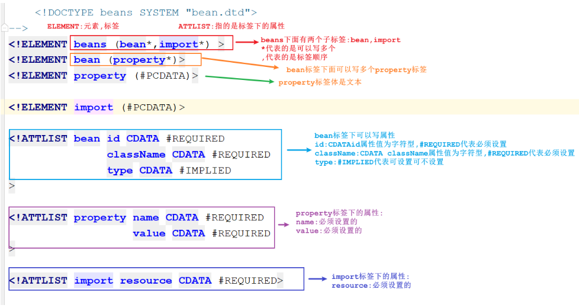

## 13.schema约束介绍

```java
Schema是新的xml文档约束
Schema要比DTD强大很多
Schema本身也是xml文档,但是Schema文档的扩展名为.xsd
Schema功能更强大,数据类型更完善
Schema支持名称空间
```

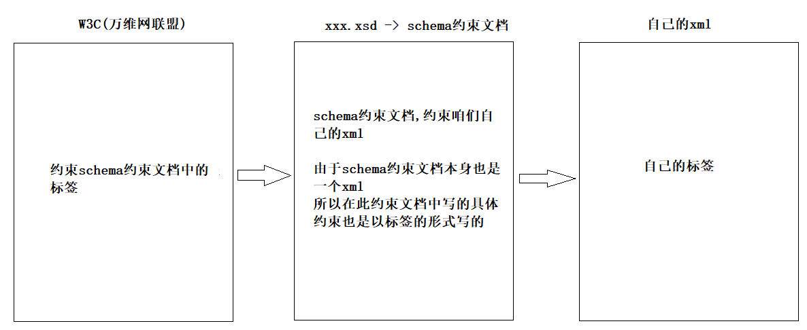

## 14.命名空间的介绍(相当于导包)

```xml
1.简单理解:命名空间相当于java中的导包
```


## 15.根据Schema约束编写xml文件

```xml
1.直接粘贴schema约束文档
  <?xml version="1.0" encoding="UTF-8"?>
<!-- 
	尚硅谷Schema教学实例文档。
	模拟spring规范，如果开发人员需要在xml使用当前Schema约束，必须包括指定命名空间。
	格式如下：
	<beans xmlns="http://www.atguigu.cn/bean"
	   xmlns:xsi="http://www.w3.org/2001/XMLSchema-instance"
	   xsi:schemaLocation="http://www.atguigu.cn/bean bean-schema.xsd"
	>
-->
<schema xmlns="http://www.w3.org/2001/XMLSchema" 
		targetNamespace="http://www.atguigu.cn/bean"
		xmlns:xsd="http://www.w3.org/2001/XMLSchema"
		xmlns:tns="http://www.atguigu.cn/bean" 
		elementFormDefault="qualified">
	<!-- 声明根标签 
		1. <element> 声明元素(标签)
		2. 每一个元素必须确定类型：
			complexType 复杂类型
			simpleType 简单类型,一般不用，大部分都是复杂类型
		3. 需要继续明确子标签出差顺序
           <sequence> 表明元素必须按照顺序出现。 
           <all> 元素的顺序可以任意。 但是元素出现的次数有且仅有一次。 
           <choice> 元素出现其中的一个。
			minOccurs 最少出现次数
			maxOccurs 最大出现次数，unbounded 不限制(没有边)
		4.<attribute>用于给元素声明属性的
			use 设置属性使用， optional可选、required必选	
	-->
	<element name="beans">
		<complexType>
			<choice minOccurs="0" maxOccurs="unbounded">
				<element name="bean">
					<complexType>
						<sequence minOccurs="0" maxOccurs="unbounded">
							<element name="property">
								<complexType>
									<attribute name="name" use="optional"></attribute>
									<attribute name="value" use="required"></attribute>
								</complexType>
							</element>
						</sequence>
						<attribute name="id" use="required"></attribute>
						<attribute name="className" use="required"></attribute>
					</complexType>
				</element>
				<element name="import">
					<complexType>
						<attribute name="resource" use="required"></attribute>
					</complexType>
				</element>
			</choice>
		</complexType>
	</element>
</schema>
```

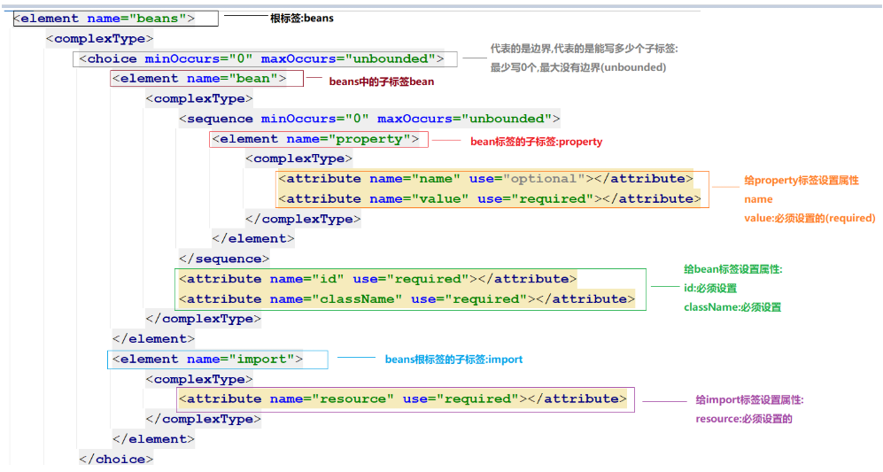

```xml
<?xml version="1.0" encoding="UTF-8" ?>
<beans xmlns="http://www.atguigu.cn/bean"
       xmlns:xsi="http://www.w3.org/2001/XMLSchema-instance"
       xsi:schemaLocation="http://www.atguigu.cn/bean bean-schema.xsd"
>
    
       <!--
          xmlns="http://www.atguigu.cn/bean": 要和约束文档中的targetNamespace一样
                 http://www.atguigu.cn:公司域名
                 bean:别名
          xmlns:xsi="http://www.w3.org/2001/XMLSchema-instance"
                 当前文档,遵循W3C约束规则
          xsi:schemaLocation="http://www.atguigu.cn/bean bean-schema.xsd" 
                 http://www.atguigu.cn/bean:要和上面的xmlns一致
                 bean-schema.xsd:约束文档路径        
       -->
    
    <bean id="c001" className="com.atguigu.person">
        <property value="tom"></property>
    </bean>
    <import resource="path"/>
</beans>
```

> <complexType>:复杂类型
>
> 1.被定义为复杂类型的标签,如果还有子标签的话,可以换行,但是不要写文本,只能写子标签
>
> 2.被定义为复杂类型的标签,如果没有子标签,不能换行了,也不能写文本

# 第四章.Tomcat服务器软件

## 1.Tomcat介绍

```java
Tomcat服务器软件是一个开源的轻量级的web应用服务器,在中小型系统和并发量小的场合下被普遍使用,是开发和调试Servlet,jsp程序的首选,也是绝大多数JavaEE开发工程师所必用的
    
我们开发的web项目需要部署到tomcat下,启动tomcat,我们就可以在浏览器上访问项目下的web资源了
```

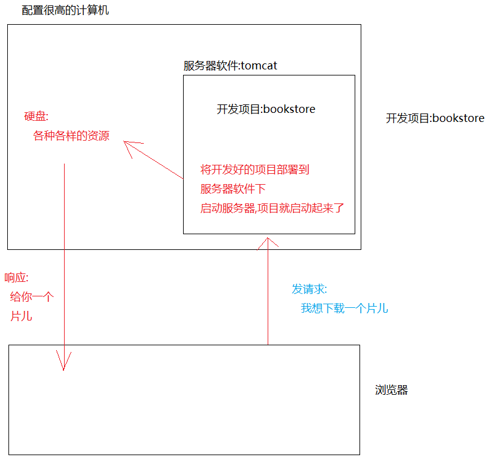

## 2.Tomcat安装

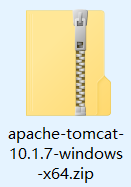

```java
1.安装非常简单:直接将tomcat从压缩包中解压出来即可
2.注意:
  a.tomcat的路径上不要有中文,不要有空格(所有跟开发相关的软件,安装路径上都不要有中文,)
  b.tomcat启动,首先本地上需要正确的jdk环境变量配置(不然启动tomcat会一闪而过)    
```

## 3.Tomcat目录结构

```java
1.bin: 脚本目录(重点)
       启动tomcat脚本:startup.bat
       停止tomcat脚本:shutdown.bat
2.conf:配置文件目录
       核心配置文件:server.xml
       用户权限配置文件:tomcat-users.xml
       所有web项目默认配置文件:web.xml
3.lib:依赖库,tomcat和web项目中需要使用的jar包
 
4.logs:日志文件目录
    
5.temp:临时文件目录,内容可以随便删除(不用管)
    
6.webapps:默认情况下,发布的web项目所存放的目录(重点)
    
7.work:tomcat处理jsp页面的工作目录
```

## 4.Tomcat端口简介_8080

```java
在tomcat/conf/server.xml,这个文件中配置了tomcat的端口号
```

```xml
8080:tomcat启动之后,用于建立http连接(重中之重)
8005:tomcat断开停止之后所用端口
8009:与其他http服务器通信接口传输数据,采用二进制传输可读性文本
```

> tomcat一旦启动,三个端口都会被占用

## 5.Tomcat的访问

```java
1.启动tomcat:在bin中找到startup.bat,双击
2.打开浏览器:
  输入localhost:8080 -> 回车
  会看到一只小喵咪    
```

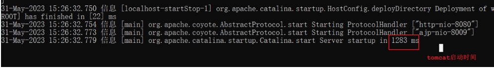

## 6.Tomcat下部署web项目_手动

```java
1.我们需要将项目打成war包,才能部署到tomcat下(如何打war包,web不学)
2.将war包放到webapps下面
3.启动tomcat,tomcat会自动将war解压
4.打开浏览器:输入localhost:8080/web应用程序名称
```

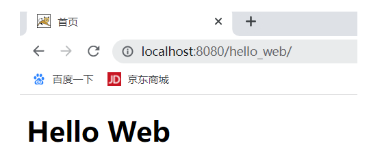

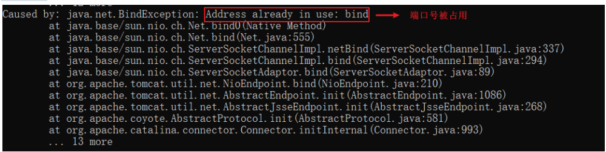

## 7.Tomcat直接访问Web项目名(conf/web.xml)

```java
1.问题:
  为什么访问web项目下的首页(index.html),可以直接写-> localhost:8080/web项目名
  而不是写-> localhost:8080/web项目名/index.html
      
2.原因:在 tomcat下 已经做了相关配置->
      tomcat/conf/web.xml中做了配置 
```

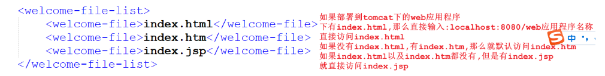

## 8.idea中集成Tomcat

```java
由于我们写代码都是在idea中写,所以为了测试方便,我们需要在idea中集成tomcat
```

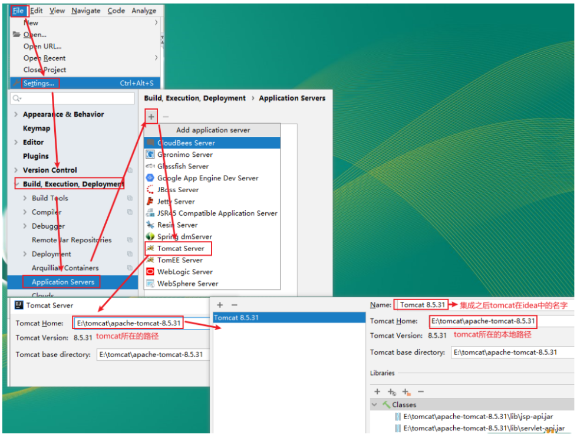


## 9.创建动态Web项目

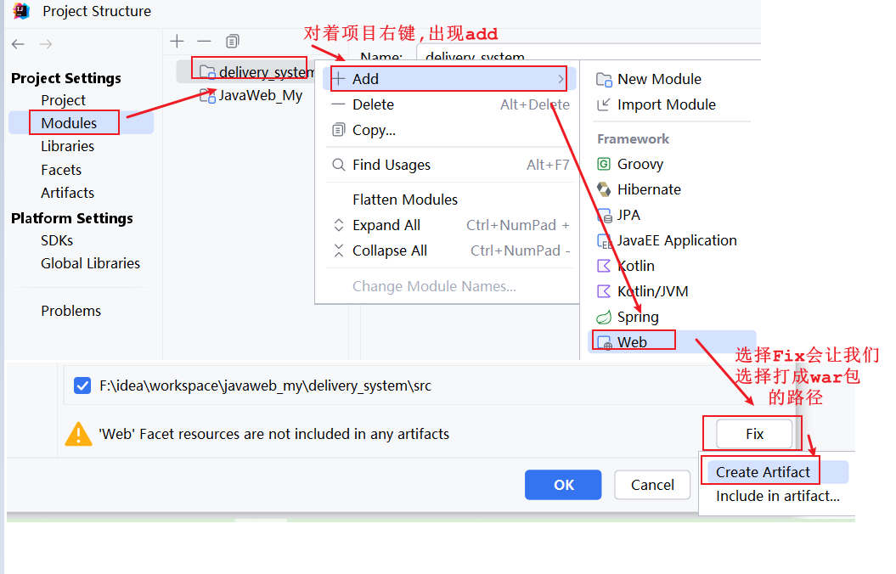


### 9.1 web项目的目录结构

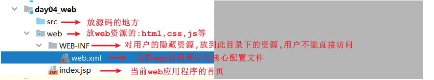


## 10.部署Web项目


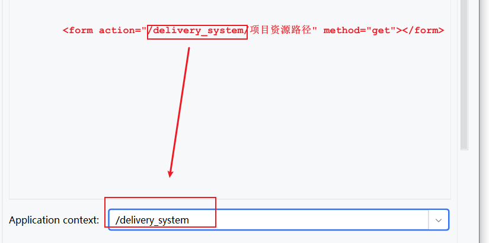

## 11.启动tomcat,访问Web项目

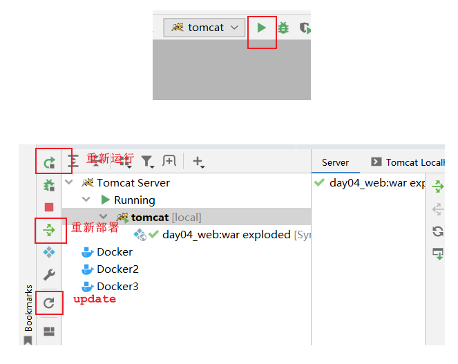

> 启动tomcat之后如果控制台上是乱码,需要改变一下控制台的编码:
>
> 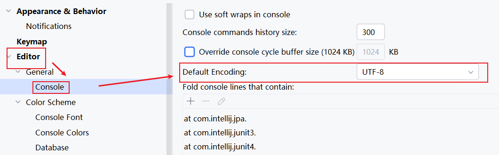

## 12.部署时的容易出现的问题

```java
问题1:我们在部署web项目的时候,点+号,没有Artifact选择
```

```java
问题2：
 刚开始部署的时候,不会自动跑到webapps下面
解决问题2:
 修改一下output directory选项中的路径,放到webapps下
```

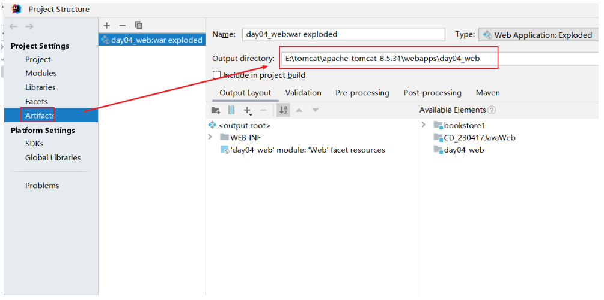

## 13.改变代码之后重新部署以及直接更新页面(可以不用设置)

```java
如果我们改变了项目中的代码,比如我们修改了页面的标签元素,重启tomcat就比较麻烦了
如果我们直接点"update",就直接重新部署一下项目,就不重新启动了,那该多好了
```

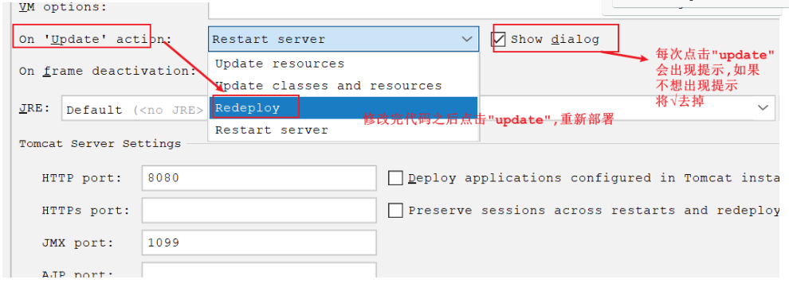

```java
如果修改了页面元素,我们能不能不重新部署呢,直接更新页面就显示新的内容,我们就可以设置:on frame deactivation
```

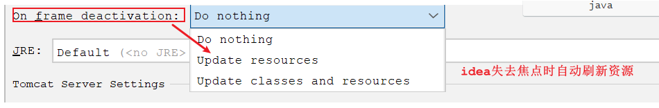

# 第五章.HTTP协议

## 1.HTTP协议介绍

```java
1.HTTP协议:超文本传输协议(HyperText Transfer Protocol)是互联网上应用最为广泛的一种网络协议.用于定义web浏览器与web服务器之间交换数据的过程
    
2.web浏览器和web服务器数据交换过程:
  web浏览器向web服务器发送请求(携带请求数据)
  web服务器向web浏览器返回响应(携带响应数据)
      
3.http协议默认端口:80
```

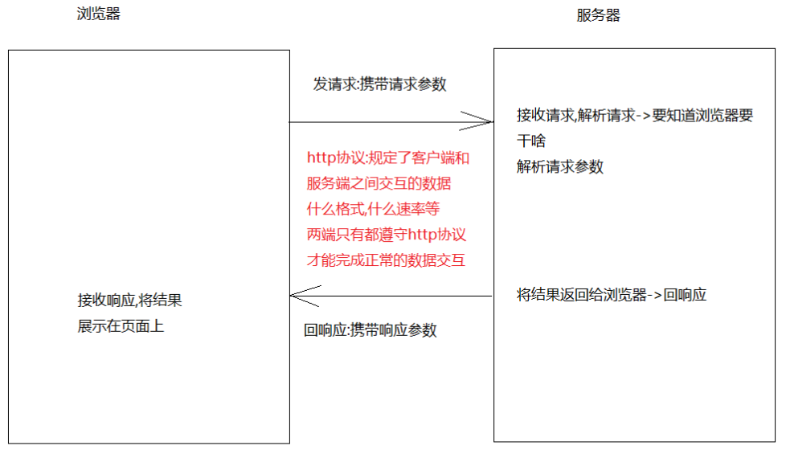

> 1.谁先主动连接谁:客户端主动连接服务器端
>
> 2.客户端发出请求之后,一定会有响应吗?不一定

> TCP和HTTP协议的关系:
>
> 1. **层级关系**：在TCP/IP模型中，TCP位于传输层，负责提供可靠的、面向连接的服务，确保数据能够从一个端点准确无误地传输到另一个端点。而HTTP则位于应用层，主要用于Web浏览器和Web服务器之间的通信，用于传输网页等内容。
> 2. **功能区别**：
>    - **TCP**：提供可靠的数据传输服务。它通过三次握手建立连接，保证数据包按序到达，并且没有错误、重复或丢失。此外，TCP还处理流量控制和拥塞控制，以确保网络的有效使用。
>    - **HTTP**：是一种请求-响应协议，客户端（通常是浏览器）向服务器发送请求，服务器根据该请求返回相应的资源（如HTML页面）。HTTP基于这种请求-响应模式工作，但它本身不负责数据的可靠传输，这项任务由TCP完成。
> 3. **工作方式**：当一个HTTP请求被发起时，首先会通过TCP协议与目标服务器建立连接（即TCP连接）。一旦连接建立成功，HTTP就可以通过这个连接发送请求并接收响应。整个过程结束后，TCP连接通常会被关闭（在HTTP早期版本中），不过HTTP/1.1及之后的版本支持持久连接（Keep-Alive），可以复用TCP连接来提高效率
> 4.  **综上所述**: HTTP依赖于TCP提供的可靠传输服务来进行数据交换，可以说HTTP是构建在TCP之上的应用层协议之一。 

## 2.HTTP两种报文格式

```java
1.客户端向服务器发请求,会携带请求报文
  get请求
  post请求
2.服务器给客户端回响应,会携带响应报文    
```

## 3.HTTP请求报文

```html
index.html
=======================================
<!DOCTYPE html>
<html lang="en">
<head>
    <meta charset="UTF-8">
    <title>首页</title>
</head>
<body>
<form action="login.html" method = "get">
    用户名:<input type = "text" name = "username"/><br>
    密&nbsp;&nbsp;&nbsp;码:<input type = "password" name = "password"/><br>
    <input type="submit" value = "登录">
</form>
</body>
</html>
```

```html
login.html
====================================
<!DOCTYPE html>
<html lang="en">
<head>
    <meta charset="UTF-8">
    <title>登录</title>
</head>
<body>
  登录成功
</body>
</html>
```

### 3.1 get请求报文说明

```java
请求行
请求头
请求体(get请求没有请求体)
     请求体是放请求参数的,但是get请求中的请求参数在地址栏上
```

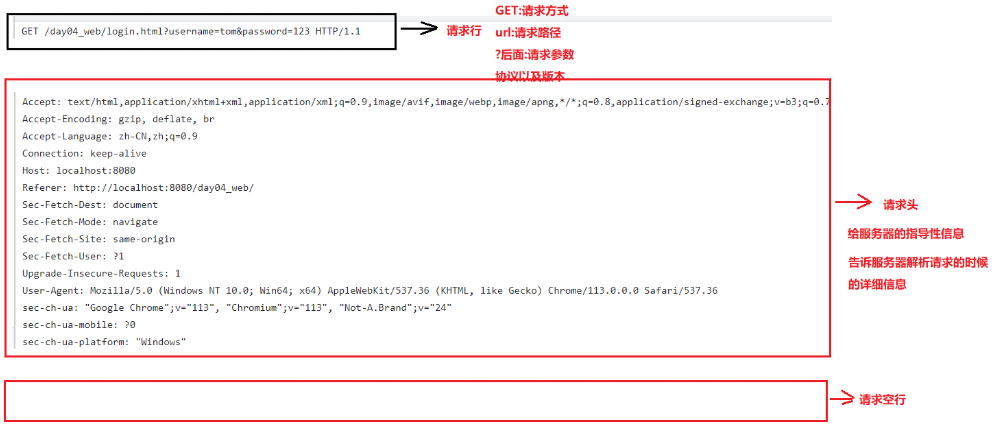

### 3.2 post请求报文说明

```java
请求行
请求头
请求体
```

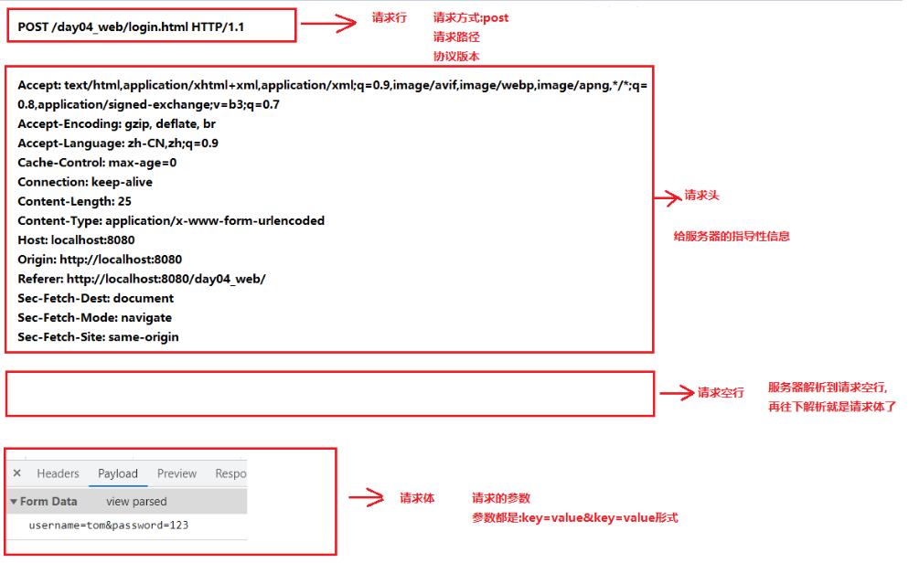

## 4.HTTP响应报文

```java
1.响应行
2.响应头
3.响应空行
4.响应体(主要是响应给浏览器的结果,如果是响应页面,此处保存的是页面的源码)
```


## 5.常见的响应状态码

| 响应状态码 | 状态码解释                           |
| ---------- | ------------------------------------ |
| 200        | 响应成功                             |
| 302        | 浏览器重定向                         |
| 304        | 查找本地缓存                         |
| 404        | 访问的资源不存在                     |
| 405        | 请求方式和服务器对应的处理方式不一样 |
| 500        | 服务器内部错误                       |

> 今日任务:
>
>   1.完成快递管理_登录和修改密码页面的校验
>
>   2.在idea中集成tomcat
>
>   3.学会如何创建动态web项目
>
>   4.将动态web项目部署到tomcat下->启动->访问首页
>
>   5.看懂http请求报文