# day04.Servlet

```java
课前回顾:
  1.正则:和java中的正则表达式一样的
    var regex = /^正则$/  -> 精准匹配
  2.xml:可扩展性标记语言
    a.作用:用作配置文件使用
    b.约束:dtd schema
  3.tomcat:服务器软件
    a.会在idea中集成tomcat
    b.会创建动态web项目
    c.会将动态web项目部署到tomcat下,启动,访问
  4.http协议:
    a.看懂请求报文和响应报文
      
    
今日重点:
  1.除了ServletConfig对象以及第三章之外都是重点
```

# 除了ServletConfig对象以及第三章之外都是重点

# 第一章.Web资源

## 1.Web资源的介绍

```java
1.web资源概述:运行在服务端的资源
             html jsp css js等
             servlet
2.web资源分类:
  a.静态web资源
  b.动态web资源
```

## 2.静态Web资源

```java
1.概述:静态web资源,不会根据不同的用户,不同的时间,不同的操作而改变的资源,静态web资源中的数据不会去数据库中查询-> 比如html -> css  -> js等
```

## 3.动态Web资源

```java
1.概述:动态web资源,会根据不同的用户,不同的时间访问而展示的数据不同,会根据不同的用户自动查询数据库中的数据
    
      比如:servlet jsp thymeleaf
          
      需要程序处理或者从数据库中读数据,能根据不同的条件在页面上显示不同的效果,内容更新不需要修改页面         这些动态的数据,都需要程序去动态查询展示     
```

# 第二章.Servlet

## 1.Servlet介绍

```java
1.概述:
  运行在服务端的一个小程序,从代码级别来看,Servlet是一个接口,我们需要实现Servlet接口,完成一个servlet小程序
```

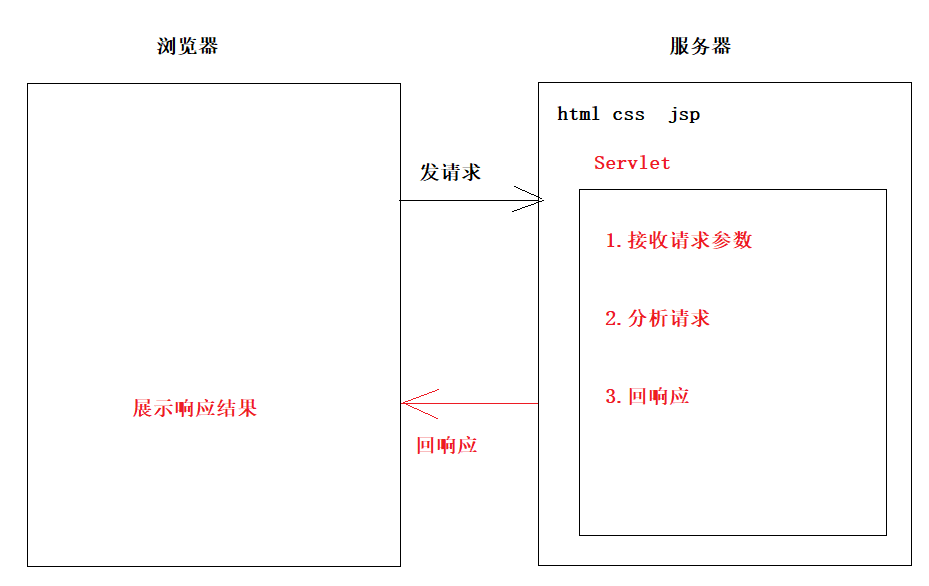

## 2.Servlet入门

```java
需求:
  访问一个servlet,响应一个"helloservlet"
```

想用tomcat下的依赖，就需要把tomcat导进去,不然servlet的api是使用不了的。

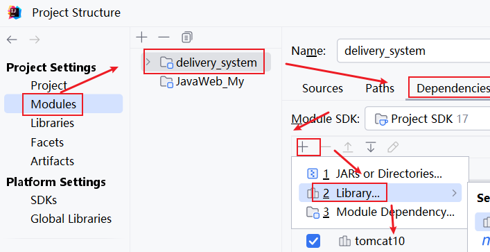

### 2.1 实现步骤

```java
1.创建一个类
2.实现Servlet接口
3.重写Servlet接口中所有的抽象方法(其中service方法非常重要)
4.在service方法中写处理请求和响应的代码
5.在web.xml中配置servlet
6.启动tomcat,运行web项目,通过浏览器访问servlet
```

#### 2.1.1.直接访问servlet

实现Servlet接口 并重写所有的抽象方法

```java
public class Servlet1 implements Servlet {
    @Override
    public void init(ServletConfig servletConfig) throws ServletException {

    }

    @Override
    public ServletConfig getServletConfig() {
        return null;
    }

    /**
     *
     * @param servletRequest   请求对象
     * @param servletResponse  响应对象
     * @throws ServletException
     * @throws IOException
     */
    @Override
    public void service(ServletRequest servletRequest, ServletResponse servletResponse) throws ServletException, IOException {
         servletResponse.getWriter().write("helloservlet");
    }

    @Override
    public String getServletInfo() {
        return "";
    }

    @Override
    public void destroy() {

    }
}

```

在web.xml中配置servelet

```xml
<servlet>
        <!--
          servlet-name中写的是我们自己给servlet取的名字
          servlet-class中写的是我们要访问的Servlet的全限定名
        -->
        <servlet-name>servlet1</servlet-name>
        <servlet-class>com.atguigu.a_servlet.Servlet1</servlet-class>
    </servlet>

    <servlet-mapping>
        <!--
          servlet-name中写的和上面的servlet-name名字保持一致
          url-pattern中写的是在浏览器上访问servlet的地址
          在浏览器上-将来如果想直接访问servlet:localhost:8080/web应用名称/urlpattern配置的路径
          在当前web项目下的页面中想要给servlet发请求 -> /web应用名称/urlpattern配置的路径
        -->
        <servlet-name>servlet1</servlet-name>
        <url-pattern>/servlet1</url-pattern>
    </servlet-mapping>
```

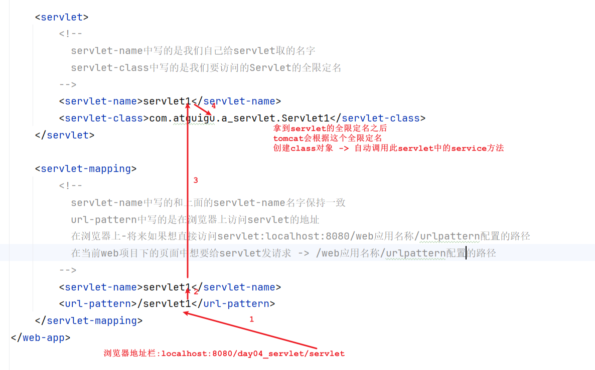

#### 2.1.2.通过页面访问servlet

```html
<!DOCTYPE html>
<html lang="en">
<head>
    <meta charset="UTF-8">
    <title>首页</title>
</head>
<body>

<form action="#" method="get">
    用户名:<input type="text" name="username"/><br/>
    密&nbsp;&nbsp;&nbsp;码:<input type="password" name="password"/><br/>
    <input type="submit" value="登录">
</form>
</body>
</html>
```

```html
<!DOCTYPE html>
<html lang="en">
<head>
    <meta charset="UTF-8">
    <title>首页</title>
</head>
<body>
<!--
  表单提交之后,将请求发送到servlet1上面
  action = "/web应用名称/url-pattern配置的路径"
-->
<form action="/day04_servlet/servlet1" method="get">
    用户名:<input type="text" name="username"/><br/>
    密&nbsp;&nbsp;&nbsp;码:<input type="password" name="password"/><br/>
    <input type="submit" value="登录">
</form>
</body>
</html>
```

> Servlet小结:
>
> 1.在当前project下集成tomcat
>
> 2.创建一个web项目
>
>    a.创建一个web项目
>
> 3.在当前web项目下引入tomcat依赖:
>
>   
>
> 4.写servlet,在web.xml中配置servlet
>
> 5.在tomcat下部署web项目,修改application context的名称(web应用名称),将部署路径改成webapps
>
> 6.启动tomcat,根据配置的url-pattern,访问servlet
>
> 7.如果是页面访问-> 访问路径 -> /web应用程序名称/url-pattern

> ## web概念汇总
>
> ##### a. 原生Tomcat
>
> 安装在电脑上的实实在在的Tomcat软件
>
> ##### b. IDEA中的Tomcat实例
>
> 通过idea的配置在idea上集成的Tomcat实例，其实还是使用的原生的Tomcat软件
>
> ##### c. IDEA中的Web工程
>
> 程序员使用IDEA编写的动态Web工程，该工程只是用于程序员编码
>
> ##### d. 根据Web工程生成的war包
>
> 根据程序员创建的动态Web工程，IDEA会将其打包成一个war包，而真正部署运行在Tomcat服务器中的其实是war包
>
> ##### c. 访问资源的地址
>
> ######     访问静态资源 → 通过浏览器直接访问静态文件
>
> ​    /Web应用名称/静态资源本身的路径-->  localhost:8080/day06_servlet/index.html
>
> ######    访问动态资源  -> 直接访问servlet
>
> ​    /Web应用名称/映射路径        -> localhost:8080/day06_servlet/servlet1
>
> ##### d. Web应用名称(项目名)
>
> 注意Web应用名不是你工程或者Module的名字，而是你在部署时候的ApplicationContext的名字
>
> 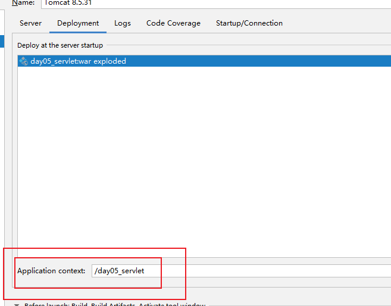
>
> e.为了方便我们学习,我们应该启动tomcat时,把web应用程序发布到tomcat的webapps下
>
>    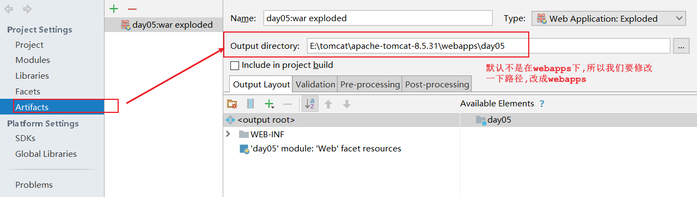

### 2.2 项目目录和部署webapp下的目录对比

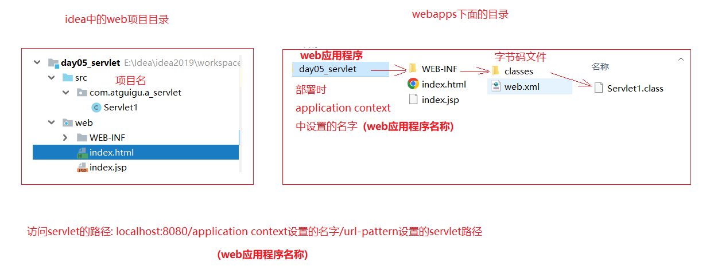

## 从开发到部署的过程（简化版）

| 步骤 | 说明                                                         |
| ---- | ------------------------------------------------------------ |
| 1️⃣    | 你在 IDEA 中写好 `Servlet1.java` 和 `web.xml`                |
| 2️⃣    | 编译 `Servlet1.java` → 生成 `Servlet1.class`                 |
| 3️⃣    | IDEA 自动将 `src` → `WEB-INF/classes`，`web` → `webapps/day05_servlet` |
| 4️⃣    | 启动 Tomcat，部署项目                                        |
| 5️⃣    | Tomcat 加载 `web.xml`，找到 Servlet 映射                     |
| 6️⃣    | 用户访问 `/servlet1` → Tomcat 调用 `Servlet1.class` 处理请求 |

## 3.注解方式使用Servlet

```java
1.我们想要实现一个servlet程序,我们需要不断的在web.xml中配置,如果写的servlet程序多了,我们需要在web.xml中配置好多好多东西,就很麻烦,所以我们可以使用注解方式实现servlet
  让注解代替配置文件  

2.注解:
  @WebServlet("/url-pattern的配置")
```

```java
@WebServlet("/servlet2")
public class Servlet2 implements Servlet {
    @Override
    public void init(ServletConfig servletConfig) throws ServletException {

    }

    @Override
    public ServletConfig getServletConfig() {
        return null;
    }

    /**
     *
     * @param servletRequest   请求对象
     * @param servletResponse  响应对象
     * @throws ServletException
     * @throws IOException
     */
    @Override
    public void service(ServletRequest servletRequest, ServletResponse servletResponse) throws ServletException, IOException {
         servletResponse.getWriter().write("helloservlet2");
    }

    @Override
    public String getServletInfo() {
        return "";
    }

    @Override
    public void destroy() {

    }
}

```

> 注意:不要同时使用注解和web.xml两种方式配置同一个servlet,不要,不要不要

## 4.Servlet的执行流程

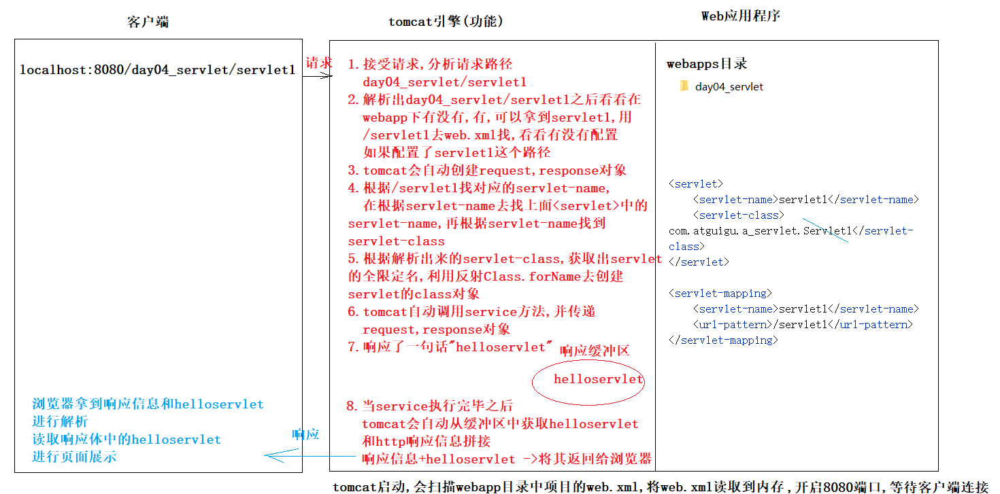

搞明白 **“浏览器怎么访问一个 Servlet”** 的全过程。

------

### 一、先说结论（一句话）

> 当你在浏览器输入 `localhost:8080/day04_servlet/servlet1`，
>  Tomcat 就会自动找到对应的 Java 程序（Servlet），执行它，然后把结果返回给浏览器。

------

###  二、角色介绍（就像演电影）

####  客户端：你的浏览器

- 比如 Chrome、Edge
- 它负责发送请求（比如点击链接）和展示网页

#### Web 应用程序：你的项目代码

- 包含 `.html`, `.jsp`, `.class`, `web.xml`
- 存放在 Tomcat 的 `webapps/day04_servlet` 目录下

####  Tomcat 引擎：服务器的“大脑”

- 负责接收请求、找程序、运行程序、返回结果
- 像一个“智能管家”，帮你处理所有网络请求

------

###  三、完整流程图解（从左到右）

我们来一步步看：

------

#### 🔹 第一步：你在浏览器输入地址

```text 
localhost:8080/day04_servlet/servlet1
```

👉 这就像是你在对服务器说：

> “嘿，我想访问你家里的 `servlet1` 这个服务，请帮我处理一下。”

这个地址分为三部分：

- `localhost:8080` → 本地电脑 + 端口（Tomcat 默认监听 8080）
- `day04_servlet` → 你的项目名字（也叫“上下文路径”）
- `servlet1` → 你想访问的具体功能（Servlet 映射路径）

------

#### 🔹 第二步：Tomcat 接收到请求

Tomcat 启动后，会一直“守在”8080 端口，等待你发消息。

当你输入上面地址并回车，Tomcat 就收到了这个请求。

------

#### 🔹 第三步：Tomcat 开始分析请求路径

Tomcat 把你输入的地址拆开来看：

```text
/day04_servlet/servlet1
```

它会问自己：

> “有没有叫 `day04_servlet` 的项目？有！在 webapps 下找到了！”
>
> “那里面有没有 `/servlet1` 这个路径？让我查查 `web.xml`……”

✅ 它会去 `webapps/day04_servlet/WEB-INF/web.xml` 文件里找配置。

------

#### 🔹 第四步：查找 web.xml 配置

你的 `web.xml` 写了这样两段：

```xml
<servlet>
    <servlet-name>servlet1</servlet-name>
    <servlet-class>com.atguigu.a_servlet.Servlet1</servlet-class>
</servlet>

<servlet-mapping>
    <servlet-name>servlet1</servlet-name>
    <url-pattern>/servlet1</url-pattern>
</servlet-mapping>
```

Tomcat 读完后就明白了：

> “哦！原来 `/servlet1` 对应的是一个叫 `servlet1` 的 Servlet，
>  它的类全名是 `com.atguigu.a_servlet.Servlet1`。”

------

#### 🔹 第五步：创建对象并调用方法

Tomcat 会做几件事：

1. **自动创建两个对象**：
   - `request`：装着你发来的数据（比如表单内容）
   - `response`：用来装你要返回给浏览器的内容
2. **根据类名 `com.atguigu.a_servlet.Servlet1` 找到对应的 `.class` 文件**
   - 它会在 `WEB-INF/classes/com/atguigu/a_servlet/Servlet1.class` 找到这个文件
   - 然后用 Java 的“反射”机制，把这个类变成一个对象
3. **自动调用 `service()` 方法**
   - 所有 Servlet 都必须实现 `service()` 方法
   - Tomcat 会自动执行这个方法，并传入 `request` 和 `response`

------

#### 🔹 第六步：Servlet 执行逻辑

假设你的 `Servlet1.java` 里写了：

```java
public void service(HttpServletRequest request, HttpServletResponse response) {
    try {
        response.getWriter().write("helloservlet");
    } catch (IOException e) {
        e.printStackTrace();
    }
}
```

那么这段代码就会被执行：

> 在响应中写入字符串 `"helloservlet"`

这个字符串被存到了一个叫“**响应缓冲区**”的地方。

------

#### 🔹 第七步：Tomcat 返回结果

当 `service()` 方法执行完后，Tomcat 会：

1. 从缓冲区取出 `"helloservlet"`
2. 加上 HTTP 协议头（比如状态码 200、Content-Type 等）
3. 把完整的响应发回给浏览器

------

#### 🔹 第八步：浏览器收到并显示

浏览器接到数据后：

- 解析出响应体中的 `"helloservlet"`
- 在页面上显示出来（比如白屏上出现这几个字）

最终效果：你看到网页上显示了 `helloservlet`

###  四、总结成一句话流程

> 浏览器 → 发送请求 → Tomcat 收到 → 查配置 → 找 Servlet 类 → 创建对象 → 调用 service() → 输出内容 → 返回给浏览器 → 页面显示

## 5.Servlet的三种映射路径配置

```java
Servlet的映射路径说的其实是在web.xml中写的url-pattern
我们访问具体的servlet都需要通过url-pattern配置的路径去访问
```

| 分类                             | 格式      | 说明                                                         |
| -------------------------------- | --------- | ------------------------------------------------------------ |
| 精准匹配(完全匹配)               | /servlet1 | 访问时必须写servlet1才能访问对应的servlet                    |
| 目录匹配(需要到Filter会用到)     | /目录名/* | 访问时路径上必须带目录名,利用目录名给所有的请求分类,带此目录名的需要走过滤器,不带的不需要走过滤器 |
| 后缀名匹配(需要到spingmvc会用到) | *.action  | 访问路径上带.action,都可以访问对应的资源                     |

目录匹配:


```xml
    <servlet-mapping>
        <servlet-name>servlet3</servlet-name>
        <!--精准匹配-->
        <!--<url-pattern>/servlet3</url-pattern>-->

        <!--目录匹配-->
        <!--<url-pattern>/cart/*</url-pattern>-->

        <!--后缀名匹配-->
        <url-pattern>*.action</url-pattern>
    </servlet-mapping>
```

```java
public class Servlet3 implements Servlet {
    @Override
    public void init(ServletConfig servletConfig) throws ServletException {

    }
    @Override
    public ServletConfig getServletConfig() {
        return null;
    }

    @Override
    public void service(ServletRequest servletRequest, ServletResponse servletResponse) throws ServletException, IOException {
         servletResponse.getWriter().write("servlet3");
    }

    @Override
    public String getServletInfo() {
        return "";
    }

    @Override
    public void destroy() {

    }
}
```

## 6.Servlet生命周期

### 6.1.Servlet生命周期介绍

```java
1.Servlet的生命周期:启动tomcat,第一次访问servlet,Servlet对象就产生了,然后从产生到运行,从运行到 结束这是一个生命周期的过程
    
2.Servlet的生命周期涉及到了三个方法:
  a.init():初始化 -> 第一次访问servlet的时候,tomcat会创建一个servlet对象,此时调用init方法(重新部署servlet已销毁)
  b.service():接请求 -> 每次访问servlet的时候都会调用
  c.destory():销毁 -> tomcat停止或者直接将项目从tomcat下移除,调用destory方法
```

```java
public class Servlet4 implements Servlet {
    @Override
    public void init(ServletConfig servletConfig) throws ServletException {
        System.out.println("Servlet4 init");
    }

    @Override
    public ServletConfig getServletConfig() {
        return null;
    }

    @Override
    public void service(ServletRequest servletRequest, ServletResponse servletResponse) throws ServletException, IOException {
        System.out.println("Servlet4 service");
    }

    @Override
    public String getServletInfo() {
        return "";
    }

    @Override
    public void destroy() {
        System.out.println("Servlet4 destroy");
    }
}

```

```xml
    <servlet>
        <servlet-name>servlet4</servlet-name>
        <servlet-class>com.atguigu.a_servlet.Servlet4</servlet-class>
    </servlet>

    <servlet-mapping>
        <servlet-name>servlet4</servlet-name>
        <!--精准匹配-->
        <url-pattern>/servlet4</url-pattern>
    </servlet-mapping>
```

### 6.2. Servlet对象提前创建(只会init,但不会service)

```java
1.注意:默认情况下,我们第一次访问servlet的时候,tomcat会创建此servlet的对象;那么如果高并发的情况下,访问同一个servlet,会给用户的感觉有点慢,所以我们需要让项目一启动,在访问servlet之前就直接创建servlet对象
    
2.让servlet提前创建的配置:
  <load-on-startup>数字</load-on-startup>
  数字越小,越先被创建     
```

```java
public class Servlet5 implements Servlet {
    @Override
    public void init(ServletConfig servletConfig) throws ServletException {
        System.out.println("Servlet5 init");
    }

    @Override
    public ServletConfig getServletConfig() {
        return null;
    }

    @Override
    public void service(ServletRequest servletRequest, ServletResponse servletResponse) throws ServletException, IOException {
        System.out.println("Servlet5 service");
    }

    @Override
    public String getServletInfo() {
        return "";
    }

    @Override
    public void destroy() {
        System.out.println("Servlet5 destroy");
    }
}

```

```java
public class Servlet6 implements Servlet {
    @Override
    public void init(ServletConfig servletConfig) throws ServletException {
        System.out.println("Servlet6 init");
    }

    @Override
    public ServletConfig getServletConfig() {
        return null;
    }

    @Override
    public void service(ServletRequest servletRequest, ServletResponse servletResponse) throws ServletException, IOException {
        System.out.println("Servlet6 service");
    }

    @Override
    public String getServletInfo() {
        return "";
    }

    @Override
    public void destroy() {
        System.out.println("Servlet6 destroy");
    }
}

```

```xml
    <servlet>
        <servlet-name>servlet5</servlet-name>
        <servlet-class>com.atguigu.a_servlet.Servlet5</servlet-class>
        <load-on-startup>2</load-on-startup>
    </servlet>

    <servlet-mapping>
        <servlet-name>servlet5</servlet-name>
        <!--精准匹配-->
        <url-pattern>/servlet5</url-pattern>
    </servlet-mapping>

    <servlet>
        <servlet-name>servlet6</servlet-name>
        <servlet-class>com.atguigu.a_servlet.Servlet6</servlet-class>
        <load-on-startup>1</load-on-startup>
    </servlet>

    <servlet-mapping>
        <servlet-name>servlet6</servlet-name>
        <!--精准匹配-->
        <url-pattern>/servlet6</url-pattern>
    </servlet-mapping>
```

## 7.ServletConfig配置对象(了解)

```java
用于操作web.xml参数的
```

### 7.1.接口方法

| 方法名                       | 作用                                                      |
| ---------------------------- | --------------------------------------------------------- |
| getServletContext()          | 获取ServletContext对象(重要)->代表的整个web应用程序的对象 |
| getServletName()             | 获取<servlet-name>hello</servlet-name>定义的servlet名称   |
| getInitParameter(String key) | 获取配置Servlet时设置的[初始化参数],根据名字获取值        |
| getInitParameterNames()      | 获取所有初始化参数名组成的Enumeration对象                 |

| `<init-param>` 是干啥的？ | **给 Servlet 启动时传参数**，不用在java改代码就能换配置,或者是不想将某些信息公布在代码上，例如密码、用户名、路径、开关。 |
| ------------------------- | ------------------------------------------------------------ |

```java
public class Servlet7 implements Servlet {
    @Override
    public void init(ServletConfig servletConfig) throws ServletException {
       //getServletContext() 获取ServletContext对象->代表的是整个web应用程序的对象
        ServletContext servletContext = servletConfig.getServletContext();
        System.out.println("servletContext = " + servletContext);
        // ->
        //getServletName() -> 获取web.xml中servlet-name参数的
        String servletName = servletConfig.getServletName();
        System.out.println("servletName = " + servletName);

        //getInitParameter(String key)-> 获取在web.xml中给servlet初始化值的方法
        String value1 = servletConfig.getInitParameter("key1");
        System.out.println("value1 = " + value1);

        //getInitParameterNames() -> 获取所有的初始化参数的
        Enumeration<String> enumeration = servletConfig.getInitParameterNames();
        while (enumeration.hasMoreElements()) {
            String key = enumeration.nextElement();
            System.out.println(key + " = " + servletConfig.getInitParameter(key));
        }
    }

    @Override
    public ServletConfig getServletConfig() {
        return null;
    }

    @Override
    public void service(ServletRequest servletRequest, ServletResponse servletResponse) throws ServletException, IOException {
        //System.out.println("I am Servlet7");
    }

    @Override
    public String getServletInfo() {
        return "";
    }

    @Override
    public void destroy() {

    }
}

```

```xml
    <servlet>
        <servlet-name>servlet7</servlet-name>
        <servlet-class>com.atguigu.a_servlet.Servlet7</servlet-class>
        <init-param>
            <param-name>key1</param-name>
            <param-value>zhangsan</param-value>
        </init-param>

        <init-param>
            <param-name>key2</param-name>
            <param-value>lisi</param-value>
        </init-param>
    </servlet>

    <servlet-mapping>
        <servlet-name>servlet7</servlet-name>
        <url-pattern>/servlet7</url-pattern>
    </servlet-mapping>

```

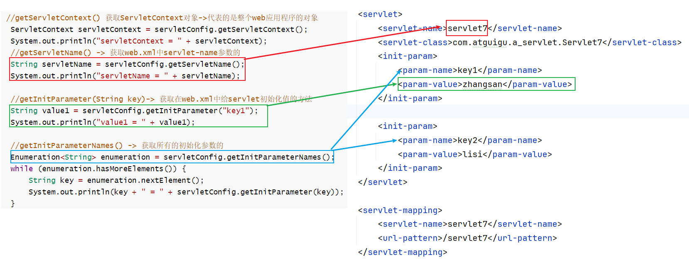

## 8.继承HttpServlet方式实现Servlet(最常用)

### 8.1.描述

```java
1.Servlet接口有一个实现类: GenericServlet
  GenericServlet有一个子类:HttpServlet
  HttpServlet中有两个方法:
       a.doGet方法 -> 用于处理get请求
       b.doPost方法 -> 用于处理post请求    
```

### 8.2.继承HttpServlet方式实现Servlet

```html
<head>
    <meta charset="UTF-8">
    <title>首页</title>
</head>
<body>
<!--
  action="/web应用程序名称/配置的url-pattern"
         web应用程序名称:部署web项目是在application context上取的名字
         url-pattern:在web.xml中或者将来在注解中写的url-pattern
-->
<form action="" method="post">
    用户名:<input type="text" name="username"/><br/>
    密&nbsp;&nbsp;&nbsp;码:<input type="password" name="password"/><br/>
    <input type="submit" value="登录">
</form>
</body>
</html>
```

```html
<!DOCTYPE html>
<html lang="en">
<head>
    <meta charset="UTF-8">
    <title>首页</title>
</head>
<body>
<!--
  表单提交之后,将请求发送到servlet1上面
  action = "/web应用名称/url-pattern配置的路径"
-->
<form action="/day04_servlet/httpservlet1" method="post">
    用户名:<input type="text" name="username"/><br/>
    密&nbsp;&nbsp;&nbsp;码:<input type="password" name="password"/><br/>
    <input type="submit" value="登录">
</form>
</body>
</html>
```

```java
@WebServlet("/httpservlet1")
public class Servlet1 extends HttpServlet {
    @Override
    protected void doGet(HttpServletRequest req, HttpServletResponse resp) throws ServletException, IOException {
        System.out.println("i am get");
    }

    @Override
    protected void doPost(HttpServletRequest req, HttpServletResponse resp) throws ServletException, IOException {
        System.out.println("i am post");
    }
}

```

> 1.通知地址栏直接发请求是get请求
>
> 2.超链接直接发出来的请求是get请求

### 8.3.doGet()和doPost方法介绍

```java
1.注意:表单提交就两种方式:
      get请求
      post请求
          
2.如果要是通过get请求提交,会自动调用doGet方法
  如果要是通过post请求提交,会自动调用doPost方法
          
3.但是,将来发的请求有可能是get请求,也有可能是post请求,假如实现一个登录功能,此登录功能有可能是get,有可能是post请求,那么难道我们需要针对这个登录请求,在doGet中实现一遍,还要在doPost方法中实现一遍吗?
          
4.解决方案:          
  不管是get请求还是post请求,我们都让其走一个方法即可
  所以我们可以在doGet中调用doPost或者在doPost中调用doGet
```

```java
@WebServlet("/httpservlet2")
public class Servlet2 extends HttpServlet {
    @Override
    protected void doGet(HttpServletRequest req, HttpServletResponse resp) throws ServletException, IOException {
        System.out.println("i am get");
    }

    @Override
    protected void doPost(HttpServletRequest req, HttpServletResponse resp) throws ServletException, IOException {
        doGet(req,resp);
    }
}
```

### 8.4.配置Servlet模板

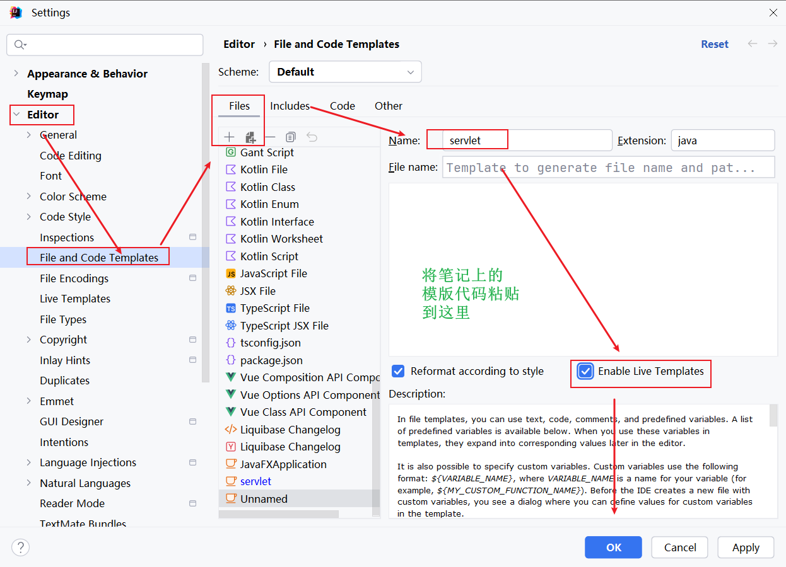

```java
#if (${PACKAGE_NAME} && ${PACKAGE_NAME} != "")package ${PACKAGE_NAME};#end
#parse("File Header.java")
 
import java.io.*;
import jakarta.servlet.*;
import jakarta.servlet.http.*;
import jakarta.servlet.annotation.WebServlet;
import java.io.IOException;
 
@WebServlet("/${Class_Name}")
public class ${Class_Name} extends HttpServlet {
    @Override
    protected void doGet(HttpServletRequest request, HttpServletResponse response) throws ServletException, IOException {
        
    }
 
    @Override
    protected void doPost(HttpServletRequest request, HttpServletResponse response) throws ServletException, IOException {
        doGet(request,response);
    }
}

```

### 8.5.快捷创建动态web项目

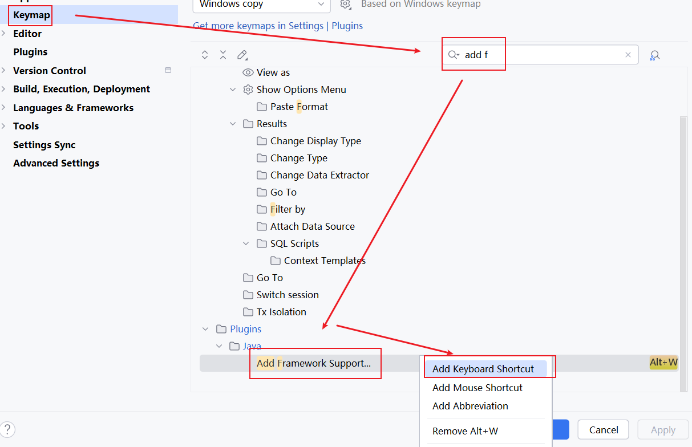

## 9.路径说明

### 9.1. URL

```java
1.概述:  统一的资源定位符,他是某个互联网资源的唯一访问地址,客户端可以通过url访问到具体的互联网资源
2.使用场景:客户端访问服务器的资源,或者一台服务器中要访问另外一台服务器的资源都是通过url访问
```


### 9.2. URI

```java
1.概述:统一的资源标识符,他是服务器中某个资源的唯一标识,通过uri可以实现同项目中的某个资源访问另外一个资源
    
2.格式:
  /项目部署名/资源路径
      
3.使用场景:
  在同一个项目的某个资源中访问该项目中的另一个资源
```


# 第三章.Tomcat下web.xml公共配置

## 1.Tomcat下web.xml公共配置文件说明

```java
tomcat/conf/web.xml
```

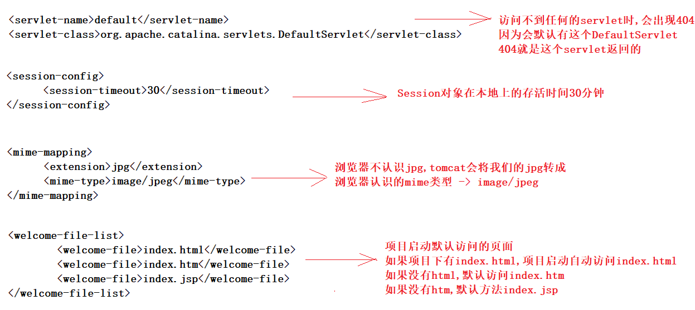

# 第四章.ServletContext对象(很重要)

“域对象”是 Java Web（Servlet）开发中的一个**核心概念**，它指的是**在特定作用范围内可以共享数据的对象**。简单说：**域对象 = 有范围的数据容器**。

| 域对象          | 像什么？       | 谁能看？         | 什么时候消失？       |
| --------------- | -------------- | ---------------- | -------------------- |
| **request**     | 外卖订单       | 这次送餐相关的人 | 餐送到就扔           |
| **session**     | 你的会员账号   | 只有你自己       | 你退出 or 长时间不用 |
| **application** | 店铺公告板     | 所有人           | 店打烊（服务器关）   |
| **pageContext** | 厨师手边小盘子 | 只有当前页面     | 页面加载完就清       |

 小白记住这三句话就够了：

1. **临时传数据**（比如表单结果）→ 用 **request**
2. **记住你是谁**（比如登录状态）→ 用 **session**
3. **全网站公用的东西**（比如网站名）→ 用 **application**

```java
1.概述:万物皆对象,我们的web应用也应该有对象,那么这个对象叫做ServletContext,而且只有一个对象
2.作用:都是当做域对象使用(存对象 ),而且是作用范围最大的域对象
  a.Request域  一次请求（比如点一次按钮）  只有这次请求经过的页面/Servlet 能拿
  b.Session域  一个用户的一次上网过程（比如从登录到退出） 只有这个用户自己能拿
  c.ServletContext域 整个网站运行期间一直存在  所有用户、所有页面、所有 Servlet 都能拿！
    
3.作用范围:只要是在ServletContext域中存储的数据,在当前项目下都可以共享    
```

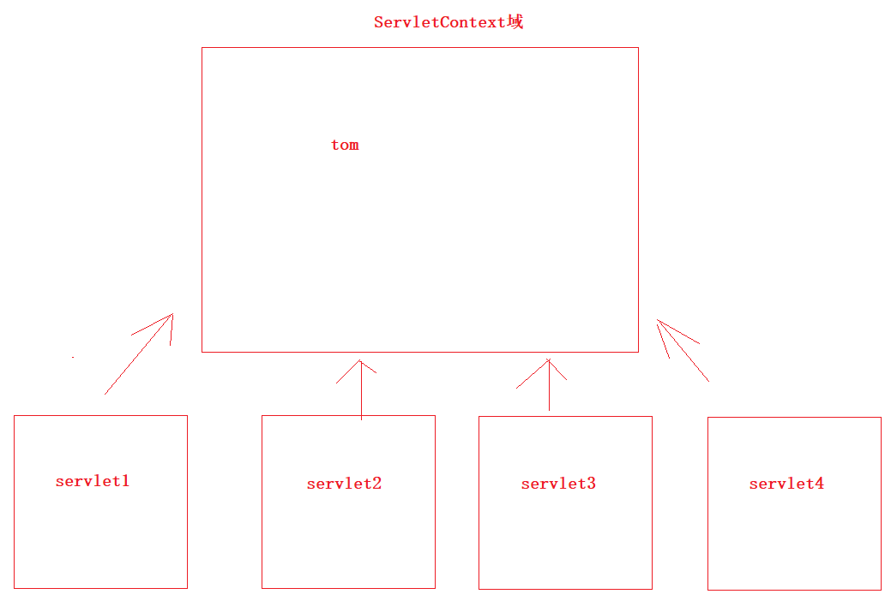

## 1.ServletContext对象的获取

```java
1.获取:getServletContext()
2.为啥可以直接调用getServletContext方法
  a.我们自己的类继承了HttpServlet
  b.HttpServlet继承了GenericServlet
  c.而getServletContext方法就是GenericServlet里面的方法  
```

```java
@WebServlet(name = "Servlet1", urlPatterns = "/context1")
public class Servlet1 extends HttpServlet {
    @Override
    protected void doGet(HttpServletRequest request, HttpServletResponse response) throws ServletException, IOException {
        ServletContext servletContext = getServletContext();
        System.out.println("servletContext = " + servletContext);
    }

    @Override
    protected void doPost(HttpServletRequest request, HttpServletResponse response) throws ServletException, IOException {
        doGet(request, response);
    }
}
```

```java
@WebServlet(name = "Servlet2", urlPatterns = "/context2")
public class Servlet2 extends HttpServlet {
    @Override
    protected void doGet(HttpServletRequest request, HttpServletResponse response) throws ServletException, IOException {
        ServletContext servletContext = getServletContext();
        System.out.println("servletContext = " + servletContext);
    }

    @Override
    protected void doPost(HttpServletRequest request, HttpServletResponse response) throws ServletException, IOException {
        doGet(request, response);
    }
}
```

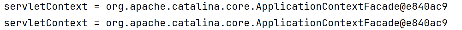

## 2.ServletContext对象获取web.xml中全局初始化参数

| 方法名                                                       | 说明                                                         |
| ------------------------------------------------------------ | ------------------------------------------------------------ |
| String getInitParameter(String key)<br>key指的是<param-name>中的内容 | 根据设置的<param-name>获取<param-value>                      |
| String getRealPath("web目录下的web资源的相对路径")           | 获取web应用程序下,任意资源的绝对路径(文件下载会用到)         |
| String getContextPath()                                      | 获取web应用程序的名字(部署项目时application context中设置的web名字) |
| String getMimeType("xxx.文件后缀名")                         | 获取文件的MIME类型(此MIME是给浏览器看的)<br>浏览器看不懂.doc   .jpg这种扩展名<br>所以tomcat在conf路径下的web.xml中规定了每一个扩展名对应的MIME类型 |

```java
@WebServlet("/context3")
public class Servlet3 extends HttpServlet {
    @Override
    protected void doGet(HttpServletRequest request, HttpServletResponse response) throws ServletException, IOException {
        ServletContext servletContext = getServletContext();
        String value1 = servletContext.getInitParameter("key1");
        System.out.println("value1 = " + value1);
        /*
          String getRealPath("web目录下的web资源的相对路径")
                 根据相对路径获取web资源下的绝对路径

                 将来我们想获取部署到tomcat中web目录下的资源,假如我们忘记了tomcat在什么位置了,此时我们不能直接
                 写绝对路径,因为我们都不知道部署项目的位置,所以也就不能写绝对路径了
                 我们只能通过web资源的相对路径获取对应的绝对路径
         */
        String path1 = servletContext.getRealPath("1.txt");
        System.out.println(path1);

        System.out.println("===================================");
        String path2 = servletContext.getRealPath("WEB-INF/2.txt");
        System.out.println("path2 = " + path2);

        System.out.println("===================================");
        //我们在src下创建了一个3.txt.我们如果想获取部署项目之后3.txt的绝对路径
        String path3 = servletContext.getRealPath("WEB-INF/classes/3.txt");
        System.out.println("path3 = " + path3);
        System.out.println("============================");
        String contextPath = servletContext.getContextPath();
        System.out.println("contextPath = " + contextPath);
        System.out.println("=============================");
        String mimeType = servletContext.getMimeType("1.jpg");
        System.out.println("mimeType = " + mimeType);
    }

    @Override
    protected void doPost(HttpServletRequest request, HttpServletResponse response) throws ServletException, IOException {
        doGet(request, response);
    }
}
```

```xml
    <context-param>
        <param-name>key1</param-name>
        <param-value>我是全局初始化参数</param-value>
    </context-param>
```

## 3.ServletContext 域对象

```java
1.ServletContext对象是当前web应用程序的对象,只有一个,所以当ServletContext作为域对象存储数据时,就可以给当前web应用程序中的其他资源所共享
    
2.ServletContext是域对象中最大的域
    
3.ServletContext作为域对象的作用:
  存,取,删除
```

| 方法名                            | 说明           |
| --------------------------------- | -------------- |
| setAttribute(String key,Object o) | 往域中存数据   |
| getAttribute(String key)          | 从域中去数据   |
| removeAttribute(String key)       | 从域中删除数据 |

```java
@WebServlet(name = "Servlet4", urlPatterns = "/context4")
public class Servlet4 extends HttpServlet {
    @Override
    protected void doGet(HttpServletRequest request, HttpServletResponse response) throws ServletException, IOException {
        ServletContext servletContext = getServletContext();
        servletContext.setAttribute("username","tom");
        servletContext.removeAttribute("username");
    }

    @Override
    protected void doPost(HttpServletRequest request, HttpServletResponse response) throws ServletException, IOException {
        doGet(request, response);
    }
}
```

```java
@WebServlet(name = "Servlet5", urlPatterns = "/context5")
public class Servlet5 extends HttpServlet {
    @Override
    protected void doGet(HttpServletRequest request, HttpServletResponse response) throws ServletException, IOException {
        Object username = getServletContext().getAttribute("username");
        System.out.println("username = " + username);
    }

    @Override
    protected void doPost(HttpServletRequest request, HttpServletResponse response) throws ServletException, IOException {
        doGet(request, response);
    }
}
```

