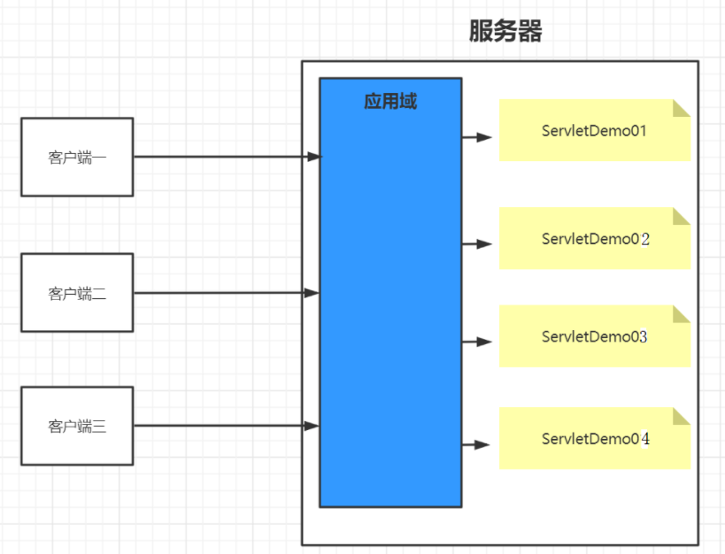
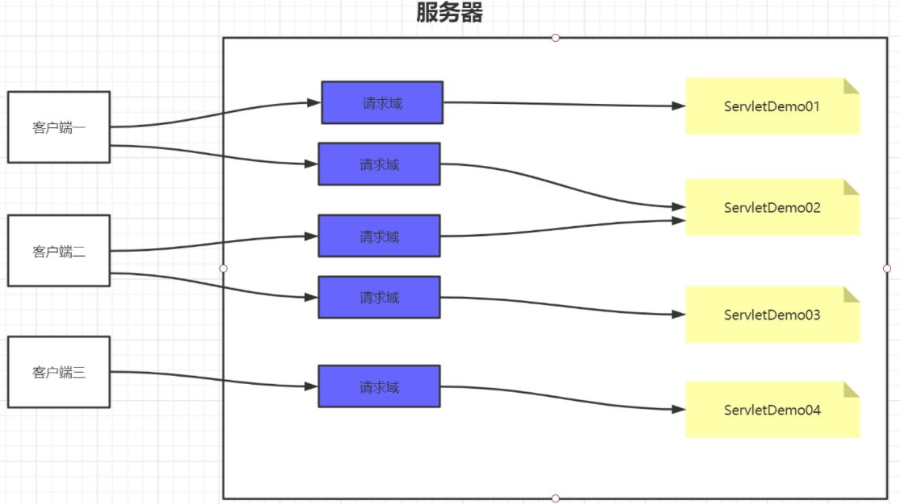
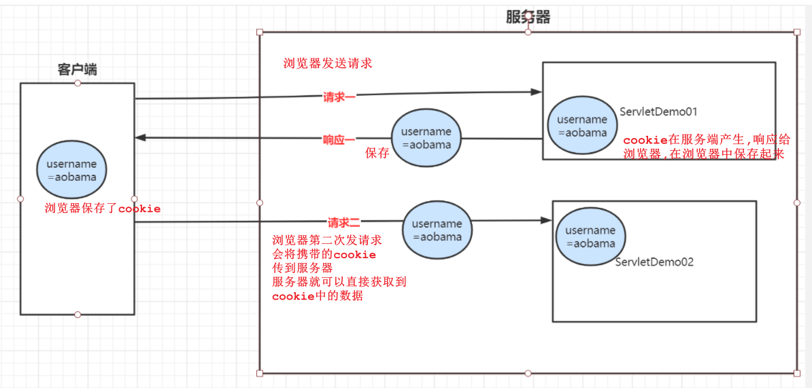
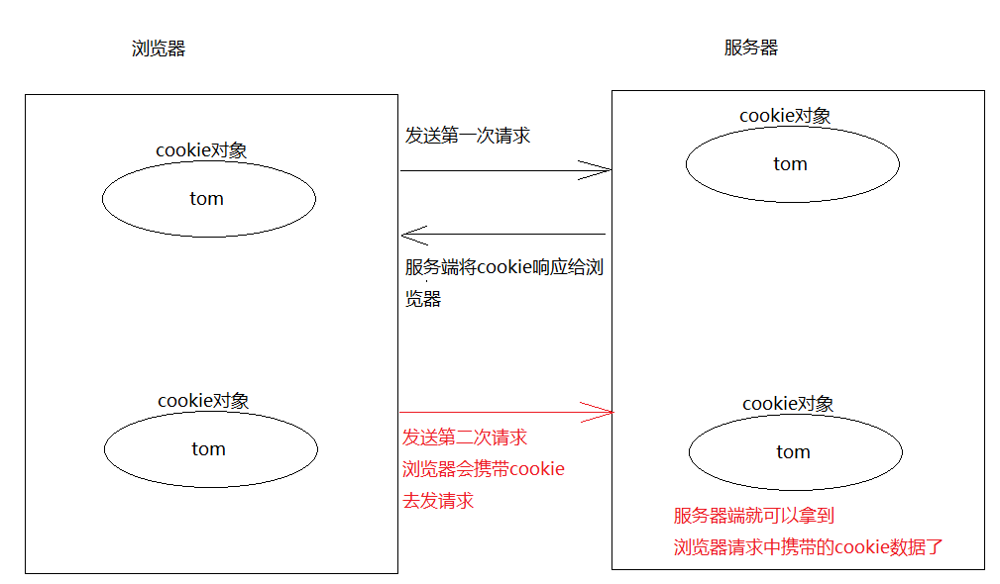
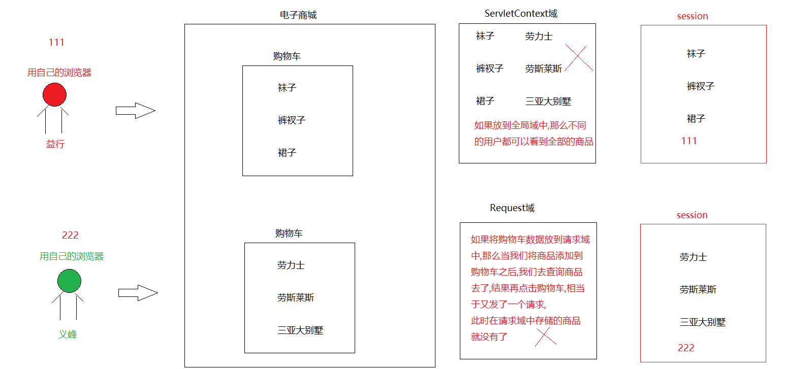
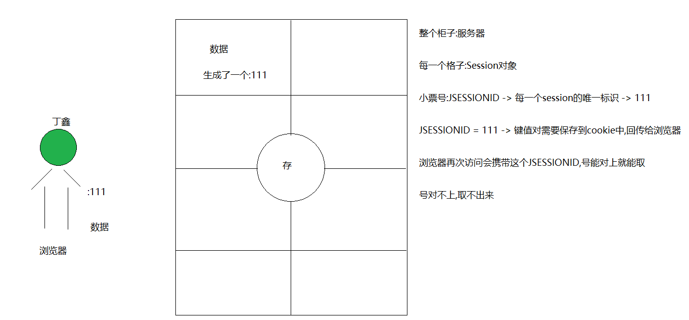
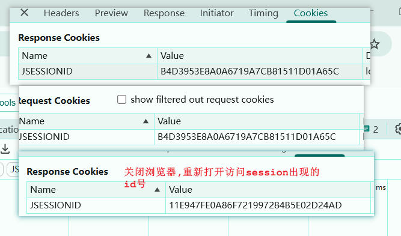
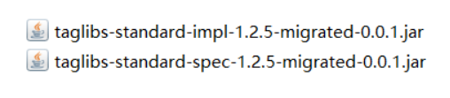

#  day06.会话技术_jsp

```java
课前回顾:
  1.HttpServletRequest对象:请求对象
    a.获取请求行信息
    b.获取请求头信息:getContextPath()获取web应用名称
    c.获取请求体信息(请求参数):
      getparameter("name的属性值") -> 获取指定的请求参数
      getParamterValues("name的属性值")-> 获取相同name属性值的一组数据
      getParamterMap() -> 获取所有的请求参数 ->key为name的属性值,value就是value属性值
    d.作为域对象使用:
      存  取  删除
    e.请求转发:将一个请求转发到另外一个web资源,是一个服务器内部行为,浏览器不会发第二次请求,地址栏也不变
              请求转发可以将不同的web资源放到同一个请求中
              request.getRequestDispacher("请求转发的web资源地址").forward(请求对象,响应对象)
  2.HttpServletResponse对象:响应对象
    a.设置响应行信息
    b.设置响应头信息
    c.设置响应体信息:getWriter().write()
      解决响应乱码: setContentType("text/html;charset=utf-8") 
    d.重定向:浏览器发送两次请求 -> 地址栏会改变
          
今日重点:
  1.知道什么是会话技术
  2.知道Cookie怎么存数据 ,怎么取数据
  3.知道session的作用,以及session如何存数据,如何取数据
  4.完成第四章代码
```

# 第一章.会话介绍

## 1.会话技术介绍

保持用户登录状态，就是当用户在登录之后，会在服务器中保存该用户的登录状态，当该用户后续访问该项目中的其它动态资源(Servlet或者Thymeleaf)的时候，能够判断当前是否是已经登录过的。而从用户登录到用户退出登录这个过程中所发生的所有请求，其实都是在一次会话范围之内

```java
1.概述:
  就是服务器和客户端连接之后,进行的多次请求和多次响应的过程
2.会话什么时候开始:当客户端连接到服务端,会话开始了
  会话什么时候结束:当客户端和服务端断开,会话结束了
      
3.会话技术分两种:
  a.客户端的会话技术:Cookie
    cookie对象在服务端创建,保存在浏览器
  b.服务端的会话技术:Session
    就是用于服务端的会话技术,主要用于域对象存储数据
4.注意:会话开始,在会话的过程中,可以进行多次请求和响应      
```

## 2.域对象范围

### 2.1.应用域范围_ServletContext



```java
ServletContext全局域代表的是整个web应用程序的对象,在此域中存储的数据,在当前web应用程序的任意位置都可以访问
```

### 2.2.请求域范围_Request



```java
request域中的数据只能在同一个请求中生效,重新发起请求,就获取不到了
```

### 2.3.会话域范围_Session


```java
会话域中包含了多次请求,所以只要在会话域中存储数据,当前会话中的所有请求都可以共享这个数据
```

> 从作用范围大小来看
>
> ServletContext>session>request

# 第二章.浏览器会话技术_Cookie

## 1.Cookie介绍

**Cookie 就是“小纸条”**，服务器写好后交给浏览器，下次浏览器访问时会自动带上这张纸条，让服务器知道“哦，你是老熟人”。

| 场景         | Cookie 的作用                    |
| ------------ | -------------------------------- |
| **登录系统** | 记住你登录过，下次自动跳过登录页 |
| **购物车**   | 你加的商品不会丢失               |
| **偏好设置** | 你选的“夜间模式”下次依然生效     |

```java
1.概述:
  由服务器产生,保存到浏览器的会话技术
2.作用:
  存一个数据片段
3.使用:
  a.创建Cookie对象,保存数据
  b.将cookie对象响应给浏览器(因为服务端创建cookie对象,之后要保存到浏览器)
  c.再次访问服务器,可以在服务器上拿到浏览器携带过来的cookie对象 
4.cookie中的数据格式:
  key=value形式
5.注意:
  a.cookie中的key不能是中文
  b.cookie中的value可以是中文(不建议写,除非有特殊要求)
  c.cookie中的键值对应该是String的    
```






## 2.Cookie入门

| 方法                                | 说明                                            |
| ----------------------------------- | ----------------------------------------------- |
| new Cookie(String key,String value) | 创建cookie对象,存储数据                         |
| response.addCookie(cookie对象)      | 将创建好的cookie对象响应给浏览器,保存到浏览器上 |
| request.getCookies()                | 获取Cookie对象,返回Cookie数组                   |
| String getName()                    | 获取Cookie中的key                               |
| String getValue()                   | 获取Cookie的value                               |

```java
@WebServlet("/cookie1")
public class Cookie1 extends HttpServlet {
    @Override
    protected void doGet(HttpServletRequest request, HttpServletResponse response) throws ServletException, IOException {
        //创建cookie对象
        Cookie cookie = new Cookie("username", "tom");
        //将cookie对象响应给浏览器
        response.addCookie(cookie);
    }

    @Override
    protected void doPost(HttpServletRequest request, HttpServletResponse response) throws ServletException, IOException {
        doGet(request, response);
    }
}

```

```java
@WebServlet("/cookie2")
public class Cookie2 extends HttpServlet {
    @Override
    protected void doGet(HttpServletRequest request, HttpServletResponse response) throws ServletException, IOException {
        //获取cookie对象中的数据
        Cookie[] cookies = request.getCookies();
        for (Cookie cookie : cookies) {
            String name = cookie.getName();
            String value = cookie.getValue();
            System.out.println(name+"..."+value);
        }
    }

    @Override
    protected void doPost(HttpServletRequest request, HttpServletResponse response) throws ServletException, IOException {
        doGet(request, response);
    }
}

```

> 扩展:
>
>  1.Cookie中key不能是中文,value可以是(tomcat8之后,tomcat老版本不好使)
>
>  2.如果tomcat为低版本,但是value由于特殊情况需要存中文:我们需要将value转成utf-8
>
> ```java
> String str = "汤姆";
> str = URLEncoder.encode(str, "utf-8");
> System.out.println(str);
> Cookie cookie = new Cookie("username", str);
> response.addCookie(cookie);
> ```

## 3.Cookie的时效性

```java
什么叫做时效性:Cookie中数据的有效期
```

### 3.1.会话级Cookie

```java
默认情况下,浏览器一关闭,会话结束了,Cookie中的数据也就获取不到了
```

### 3.2.持久化Cookie

```java
指的是我们可以延长cookie的存活时间,如果时间不到,即使关闭了浏览器,那么cookie数据也不会失效
```

### 3.3.设置Cookie存在时间方法

| 方法                      | 说明    |
| ------------------------- | ------- |
| setMaxAge(cookie存活时间) | 单位:秒 |

```java
@WebServlet("/cookie3")
public class Cookie3 extends HttpServlet {
    @Override
    protected void doGet(HttpServletRequest request, HttpServletResponse response) throws ServletException, IOException {
        Cookie cookie = new Cookie("username", "jack");
        //设置cookie的存活时间
        cookie.setMaxAge(20);
        response.addCookie(cookie);
    }

    @Override
    protected void doPost(HttpServletRequest request, HttpServletResponse response) throws ServletException, IOException {
        doGet(request, response);
    }
}

```

```java
@WebServlet("/cookie4")
public class Cookie4 extends HttpServlet {
    @Override
    protected void doGet(HttpServletRequest request, HttpServletResponse response) throws ServletException, IOException {
        //获取cookie对象中的数据
        Cookie[] cookies = request.getCookies();
        for (Cookie cookie : cookies) {
            String name = cookie.getName();
            String value = cookie.getValue();
            System.out.println(name+"..."+value);
        }
    }

    @Override
    protected void doPost(HttpServletRequest request, HttpServletResponse response) throws ServletException, IOException {
        doGet(request, response);
    }
}

```

> 给cookie设置了时间,只要不超时,即使会话关闭,我们也能从cookie中获取数据,一旦超时,获取不到了(访问服务器时,浏览器不再携带我们设置的cookie了,所以就拿不到了)

### 3.4.删除Cookie数据(存活时间设置为0)

```java
@WebServlet("/cookie5")
public class Cookie5 extends HttpServlet {
    @Override
    protected void doGet(HttpServletRequest request, HttpServletResponse response) throws ServletException, IOException {
        Cookie cookie = new Cookie("username", "jack");
        //设置cookie的存活时间
        cookie.setMaxAge(0);
        response.addCookie(cookie);
    }

    @Override
    protected void doPost(HttpServletRequest request, HttpServletResponse response) throws ServletException, IOException {
        doGet(request, response);
    }
}

```

```java
@WebServlet("/cookie6")
public class Cookie6 extends HttpServlet {
    @Override
    protected void doGet(HttpServletRequest request, HttpServletResponse response) throws ServletException, IOException {
        //获取cookie对象中的数据
        Cookie[] cookies = request.getCookies();
        for (Cookie cookie : cookies) {
            String name = cookie.getName();
            String value = cookie.getValue();
            System.out.println(name+"..."+value);
        }
    }

    @Override
    protected void doPost(HttpServletRequest request, HttpServletResponse response) throws ServletException, IOException {
        doGet(request, response);
    }
}
```

> 一般情况下不会做

# 第三章.服务器会话技术_Session(重中之重)

## 1.Session介绍

```java
1.概述:
  session是服务器端的会话技术,作为一个域对象操作
2.session的作用范围:
  会话开始,在session域中存储的数据,会作用于当前整个会话
  会话结束,默认情况下session域中的数据就获取不到了
3.注意:服务器会为每一个浏览器在内存中创建一个对象,这个对象就是session对象      
```






## 2.Session入门

| 方法                              | 说明            |
| --------------------------------- | --------------- |
| getSession()                      | 获取session对象 |
| setAttribute(String key,Object o) | 往域中存储数据  |
| Object getAttribute(String name)  | 取数据          |
| void removeAttribute(String name) | 删除数据        |

```java
@WebServlet("/session1")
public class Session1 extends HttpServlet {
    @Override
    protected void doGet(HttpServletRequest request, HttpServletResponse response) throws ServletException, IOException {
          //获取session对象
        HttpSession session = request.getSession();
        session.setAttribute("username","rose");
    }

    @Override
    protected void doPost(HttpServletRequest request, HttpServletResponse response) throws ServletException, IOException {
        doGet(request, response);
    }
}

```

```java
@WebServlet("/session2")
public class Session2 extends HttpServlet {
    @Override
    protected void doGet(HttpServletRequest request, HttpServletResponse response) throws ServletException, IOException {
          //获取session对象
        HttpSession session = request.getSession();
        Object username = session.getAttribute("username");
        System.out.println("username = " + username);
    }

    @Override
    protected void doPost(HttpServletRequest request, HttpServletResponse response) throws ServletException, IOException {
        doGet(request, response);
    }
}

```

## 3.Session工作原理和有效期

### 3.1.Session工作原理

```java
1.tomcat会为每一个浏览器在内存中开辟一个空间,创建一个对象,这个对象就是session对象,同时会自动生成一个id号,将id号放到cookie中,key为JSESSIONID,值为这个id号,然后保存到浏览器上
    
2.从session中获取数据,需要将cookie中的JSESSIONID回传给服务器,根据id去找对应的session对象,从而获取session中的数据
    
3.如果关闭浏览器,cookie默认会立即失效,此时在获取session对象中的数据,由于JSESSIONID号丢了,所以无法从session中获取数据了
```



### 3.2.设置Session有效期_了解即可

| 方法                               | 说明                    |
| ---------------------------------- | ----------------------- |
| session.setMaxInactiveInterval(秒) | 设置session闲置超时时间 |
| session.invalidate()               | 强制Session立即失效     |

> 1.大伙儿要注意:session和cookie不要搞混了
>
> ​    a.session对象默认时间是:30分钟
>
> ​    b.关闭浏览器之后,重新打开,重新从session对象中获取数据,获取不到的原因不是session对象没有了,而是生成的cookie中的JSESSIONID号变了,和之前的不一样了,所以获取不到session中的数据了

### 3.3.延长session中数据的存活时间(session持久化)

```java
 1.咱们都知道,session中的数据需要cookie中的JSESSIONID匹配,如果浏览器关闭,cookie默认会立马失效,再次访问cookie中的JSESSIONID对不上了,session中的数据也就拿不到了
 2.解决:延长session中数据的存活时间,其实就是延长cookie的存活时间    
```

```java
@WebServlet("/session3")
public class Session3 extends HttpServlet {
    @Override
    protected void doGet(HttpServletRequest request, HttpServletResponse response) throws ServletException, IOException {
        //获取session对象
        HttpSession session = request.getSession();
        /*
           session中有一个方法:String getId()
           获取服务器为session生成的id号
         */
        String id = session.getId();

        //创建cookie对象,key为JSESSIONID,value值是id
        Cookie cookie = new Cookie("JSESSIONID", id);
        //设置cookie的存活时间
        cookie.setMaxAge(30);
        //将设置好的cookie响应给浏览器
        response.addCookie(cookie);

        session.setAttribute("username","faker");
    }

    @Override
    protected void doPost(HttpServletRequest request, HttpServletResponse response) throws ServletException, IOException {
        doGet(request, response);
    }
}

```

```java
@WebServlet("/session4")
public class Session4 extends HttpServlet {
    @Override
    protected void doGet(HttpServletRequest request, HttpServletResponse response) throws ServletException, IOException {
          //获取session对象
        HttpSession session = request.getSession();
        Object username = session.getAttribute("username");
        System.out.println("username = " + username);
    }

    @Override
    protected void doPost(HttpServletRequest request, HttpServletResponse response) throws ServletException, IOException {
        doGet(request, response);
    }
}
```

# 第四章.案例开发-快递管理-第三期

目标：1实现登录状态会话保存 登陆后 系统记住我是谁 当我点击快递管理的时候 只显示属于我自己的快递记录

​		如何实现：保存信息到session

​	   2.保存快递公司信息

​				   

## 1.登录状态会话保存

### 1.1.修改UserLoginController层的登录方法: 进行账号信息保存

```java
@WebServlet("/user/login")
public class UserLoginController extends HttpServlet {
    @Override
    protected void doGet(HttpServletRequest req, HttpServletResponse resp) throws ServletException, IOException {
        //1.设置请求参数编码格式
        req.setCharacterEncoding("UTF-8");
        resp.setContentType("text/html;charset=UTF-8");
        //2.获取请求参数
        String username = req.getParameter("username");
        String password = req.getParameter("password");
        //3.调用service层方法
        UserService userService = new UserServiceImpl();
        try {
            SysUser sysUser =userService.login(username,password);
            if (sysUser!=null){
                //保存登录的用户状态,用于查询登录快递信息以及登录的状态
                req.getSession().setAttribute("user", sysUser);
                req.getRequestDispatcher("/index.html").forward(req,resp);
            }else{
                req.getRequestDispatcher("/login.html").forward(req,resp);
            }
        } catch (SQLException e) {
            throw new RuntimeException(e);
        }
    }

    @Override
    protected void doPost(HttpServletRequest req, HttpServletResponse resp) throws ServletException, IOException {
        doGet(req,resp);
    }
}
```

## 2. 当前登录用户快递列表展示

### 2.1.修改html页面中快递管理跳转页面(所有页面)

注意： 需要修改除了login.html以外的所有页面


将静态页面->动态查询数据

```java
修改index.html页面中的"快递管理"请求路径 -> /delivery_system/delivery/list
```

``` html

<!DOCTYPE html PUBLIC "-//W3C//DTD HTML 4.01 Transitional//EN" "http://www.w3.org/TR/html4/loose.dtd">
<html>
    <head>
        <meta http-equiv="Content-Type" content="text/html; charset=UTF-8">
        <title>快递管理系统</title>
        <meta name="Copyright" content="Douco Design." />
        <link href="/delivery_system/css/public.css" rel="stylesheet" type="text/css">
        <script type="text/javascript" src="js/jquery.min.js"></script>
        <script type="text/javascript" src="js/global.js"></script>
    </head>
    <body>
        <div id="dcWrap">
            <div id="dcHead">
                <div id="head">
                    <div class="logo"><a href="index.html"></a></div>
                    <div class="nav">
                        <ul class="navRight">
                            <li class="M noLeft"><a
                                    href="JavaScript:void(0);">您好，admin</a>
                                <div class="drop mUser">
                                    <a href="/delivery_system/password.html">修改密码</a>
                                </div>
                            </li>
                            <li class="noRight"><a
                                    href="login.php?rec=logout">退出</a></li>
                        </ul>
                    </div>
                </div>
            </div>
            <!-- dcHead 结束 -->
            <div id="dcLeft"><div id="menu">
                    <ul class="top">
                        <li><a href="index.html"><i
                                    class="home"></i><em>管理首页</em></a></li>
                    </ul>
                    <ul>
                        <li><a href="/delivery_system/password.html"><i
                                    class="system"></i><em>修改密码</em></a></li>
                        <li><a href="/delivery_system/delivery/list"><i
                                    class="nav"></i><em>快递管理</em></a></li>

                    </ul>

                </div></div>
            <div id="dcMain"> <!-- 当前位置 -->
                <div id="urHere">快递管理系统</div> <div id="index" class="mainBox"
                    style="padding-top:18px;height:auto!important;height:550px;min-height:550px;">
                    <div class="warning">欢迎光临：admin</div>
                </div>
            </div>
            <div class="clear"></div>
            <div id="dcFooter">
                <div id="footer">
                    <div class="line"></div>
                    <ul>
                        版权所有 © 2024-2025 尚硅谷教育，并保留所有权利。
                    </ul>
                </div>
            </div><!-- dcFooter 结束 -->
            <div class="clear"></div> </div>

    </body>
</html>
```

### 2.2.导入快递记录数据库脚本

```  sql
# 快递公司表
CREATE TABLE sys_company (
    id INT AUTO_INCREMENT PRIMARY KEY,
    company_name VARCHAR(255) NOT NULL
);

INSERT INTO  sys_company  (company_name) VALUES
('顺丰快递'),
('圆通速递'),
('中通快递'),
('申通快递'),
('韵达快递');

CREATE TABLE sys_delivery (
    id INT AUTO_INCREMENT PRIMARY KEY,
    delivery_name VARCHAR(10) COMMENT '收件人姓名',
    user_id INT COMMENT '关联用户id',
    company_id INT COMMENT '关联公司id',
    phone VARCHAR(11) COMMENT '手机号',
    address VARCHAR(100) COMMENT '收获地址',
    send_time VARCHAR(20) COMMENT '送达日期',
    state INT DEFAULT 0 COMMENT '签收状态 0 未签收 1已签收'
);


INSERT INTO sys_delivery (delivery_name, user_id, company_id, phone, address, send_time,state) VALUES
('二狗子', 1, 1, '13812345678', '北京市朝阳区', '2024-07-11',1),
('二狗子', 1, 2, '13987654321', '上海市浦东新区', '2024-07-12',0),
('二狗子', 1, 3, '13611112222', '广州市天河区','2024-07-13', 0),
('二狗子', 1, 4, '13544443333', '深圳市南山区','2024-07-14', 1),
('二狗子', 1, 1, '13755556666', '成都市武侯区','2024-07-15', 0),
('二狗子', 1, 2, '13377778888', '重庆市渝中区','2024-08-03', 1),
('二狗子', 1, 3, '13299990000', '武汉市江汉区', '2024-08-02',0),
('驴蛋蛋', 2, 4, '13122223333', '西安市雁塔区', '2024-08-11',1),
('驴蛋蛋', 2, 1, '13033334444', '杭州市西湖区', '2024-07-11',0),
('驴蛋蛋', 2, 2, '13466667777', '南京市鼓楼区', '2024-07-22',1);
```

### 2.3.准备快递记录和公司信息pojo类

``` java
@Data
public class Company {
    private Integer id;
    private String companyName;
}
 
@Data
public class Delivery {
    private Integer id;
    private String deliveryName;
    private Integer userId;
    private Integer companyId;
    private String phone;
    private String address;
    private String sendTime;
    private Integer state;

    //将来需要将快递公司对象封装到快递对象中
    private Company company; //关联公司对象
}
```

```java
由于快递记录的类中有快递公司的属性,所以我们需要先将快递公司的内容查询出来,封装到快递记录的类中
```

### 2.4.查询快递公司的service层

```java
1.问题:为啥没有直接写查询快递公司的Controller层?
2.原因:通过页面显示,我们主查快递信息表,只不过我们需要在查询快递信息的过程中,将快递公司查询出来,最后放到Delivery对象中了
```

``` java
public interface CompanyService {
    /**
     * 查询所有快递公司
     */
    List<Company> findAllCompany() throws SQLException;
}

```

```java
public class CompanyServiceImpl implements CompanyService {
    private CompanyDao companyDao = new CompanyDaoImpl();

    /**
     * 查询所有的快递公司
     * @return
     */
    @Override
    public List<Company> findAllCompany() throws SQLException {
        List<Company> list = companyDao.findAllCompany();
        return list;
    }
}

```

### 2.5.查询快递公司的dao层

``` java
public interface CompanyDao {
    List<Company> findAllCompany() throws SQLException;

}
```

```java
public class CompanyDaoImpl implements CompanyDao {
    private QueryRunner qr = new QueryRunner(DruidUtils.getDataSource());
    /**
     * 查询所有快递公司
     * @return
     */
    @Override
    public List<Company> findAllCompany() throws SQLException {
       
        String sql = "select id id,company_name companyName from sys_company";
        List<Company> list = qr.query(sql, new BeanListHandler<Company>(Company.class));
        return list;
    }
}
```

### 2.6.查询快递信息的controller层

```java
先添加一个快递信息的状态,用于存储到session中,然后后期在页面展示
```

```java
@WebServlet("/delivery/list")
public class DeliveryListController extends HttpServlet {
    private DeliveryService deliveryService = new DeliveryServiceImpl();

    @Override
    protected void doGet(HttpServletRequest request, HttpServletResponse response) throws ServletException, IOException {
        try {
        //1.解决请求乱码问题
            request.setCharacterEncoding("utf-8");
            response.setContentType("text/html;charset=utf-8");
        /*
          2.获取登录的用户id
            我们需要用登录用户的id去查询对应的快递信息
            也就是哪个用户登录,就只查询哪个用户相关的快递信息
         */
            SysUser user = (SysUser) request.getSession().getAttribute("user");
            Integer userId = user.getId();
            List<Delivery> list = deliveryService.findAllDeliveryByUserId(userId);
            //3.将查询出来的集合响应给页面
            request.setAttribute("deliverylist", list);
            request.getRequestDispatcher("/list.html").forward(request, response);
        } catch (SQLException e) {
            e.printStackTrace();
        }

    }

    @Override
    protected void doPost(HttpServletRequest request, HttpServletResponse response) throws ServletException, IOException {
        doGet(request, response);
    }
}

```

### 2.7.查询快递信息的service层

```java
public interface DeliveryService {
    /**
     * 根据用户id查询所有快递信息
     * @param userId
     * @return
     */
    List<Delivery> findAllDeliveryByUserId(Integer userId) throws SQLException;
}
```

```java
public class DeliveryServiceImpl implements DeliveryService {
    private DeliveryDao deliveryDao = new DeliveryDaoImpl();
    private CompanyService companyService = new CompanyServiceImpl();
    /**
     * 根据用户id查询所有快递信息
     * @param userId
     * @return
     */
    @Override
    public List<Delivery> findAllDeliveryByUserId(Integer userId) throws SQLException {
        List<Delivery> deliverylist = deliveryDao.findAllDeliveryByUserId(userId);
        List<Company> allCompany = companyService.findAllCompany();

        //将Company对象放到map集合中,方便直接往deliveryList集合中封装
        HashMap<Integer, Company> map = new HashMap<>();
        allCompany.forEach(company -> {map.put(company.getId(), company);});

        //根据delivery中封装的快递公司id从map中获取对应的快递公司对象,然后封装到delivery对象中
        deliverylist.forEach(delivery -> {delivery.setCompany(map.get(delivery.getCompanyId()));});
        return deliverylist;
    }
}
```

### 2.8.查询快递信息的dao层

``` java
public interface DeliveryDao {
    /**
     * 根据用户id查询所有快递信息
     * @param userId
     * @return
     */
    List<Delivery> findAllDeliveryByUserId(Integer userId) throws SQLException;
}

```

```java
public class DeliveryDaoImpl implements  DeliveryDao{   
  private QueryRunner qr = new QueryRunner(DruidUtils.getDataSource());

    /**
     * 根据用户id查询所有快递信息
     *
     * @param userId
     * @return private Integer id;
     * private String deliveryName;
     * private Integer userId;
     * private Integer companyId;
     * private String phone;
     * private String address;
     * private String sendTime;
     * private Integer state;
     * <p>
     * id INT AUTO_INCREMENT PRIMARY KEY,
     * delivery_name VARCHAR(10) COMMENT '收件人姓名',
     * user_id INT COMMENT '关联用户id',
     * company_id INT COMMENT '关联公司id',
     * phone VARCHAR(11) COMMENT '手机号',
     * address VARCHAR(100) COMMENT '收获地址',
     * send_time VARCHAR(20) COMMENT '送达日期',
     * state INT DEFAULT 0 COMMENT '签收状态 0 未签收 1已签收'
     */
    @Override
    public List<Delivery> findAllDeliveryByUserId(Integer userId) throws SQLException {
        String sql = "select id id,delivery_name deliveryName,user_id userId,company_id companyId,phone phone,address address,send_time sendTime,state state from sys_delivery where user_id = ?";
        List<Delivery> list = qr.query(sql, new BeanListHandler<Delivery>(Delivery.class), userId);
        return list;
    }
}

```

### 2.9.请求转发之后跳转页面显示问题

``` html
修改index.html中"快递管理"的请求路径:
 <li><a href="/delivery_system/deliverylist/list"><i
                                    class="nav"></i><em>快递管理</em></a></li>
```

# 第五章.JSP

## 1.JSP初识

JSP（Java Server Pages）是一种动态网页开发技术，它是由 Sun 公司提出的一种基于 Java 技术的 Web 页面制作技术，可以在 HTML 文件中嵌入 Java 代码，使得生成动态内容的编写更加简单。

JSP 最主要的作用是生成动态页面。它允许将 Java 代码嵌入到 HTML 页面中，以便使用 Java 进行数据库查询、处理表单数据和生成 HTML 等动态内容。另外，JSP 还可以与 Servlet 结合使用，实现更加复杂的 Web 应用程序开发。

JSP 的主要特点包括：

1.  简单：JSP 通过将 Java 代码嵌入到 HTML 页面中，使得生成动态内容的编写更加简单。
2.  高效：JSP 首次运行时会被转换为 Servlet，然后编译为字节码，从而可以启用 Just-in-Time（JIT）编译器，实现更高效的运行。
3.  多样化：JSP 支持多种标准标签库，包括 JSTL（JavaServer Pages 标准标签库）、EL（表达式语言）等，可以帮助开发人员更加方便的处理常见的 Web 开发需求。
    总之，JSP 是一种简单高效、多样化的动态网页开发技术，它可以方便地生成动态页面和与 Servlet 结合使用，是 Java Web 开发中常用的技术之一。

## 2.EL表达式

EL(Expression Language) 是为了使JSP写起来更加简单。表达式语言的灵感来自于 ECMAScript 和 XPath 表达式语言，它提供了在 JSP 中简化表达式的方法，让Jsp的代码更加简化。

语法结构:**${expression}**

EL获取变量数据的方法很简单，例如:${username}。它的意思是取出某一范围中名称为username的变量。

因为我们并没有指定哪一个范围的username，所以它会依序从Page、Request、Session、Application范围查找。**由于它只会从作用域中获取数据,所以被展示的数据一定要先存储到作用域,才可以使用EL表达式获取**

EL 提供"."和"[ ]"两种运算符来取数据。如果被访问的数据是对象时,可以使用"."操作符获取属性,如果是数组,则可以使用"[]"获取数据。

案例代码:

```jsp
<%@ page import="com.atguigu.pojo.SysUser" %><%--
  Created by IntelliJ IDEA.
  User: yutao
  Date: 2025/2/19
  Time: 21:54
  To change this template use File | Settings | File Templates.
--%>
<%@ page contentType="text/html;charset=UTF-8" language="java" %>
<html>
<head>
    <title>EL表达式</title>
</head>
<body>
<%
    String name = "tom";
    int age = 18;
    SysUser sysUser = new SysUser();
    sysUser.setUsername("root");
    String[] strs = {"张三", "李四"};

    //将四个数据保存到请求域中
    request.setAttribute("sysname", name);
    request.setAttribute("sysage", age);
    request.setAttribute("sysuser", sysUser);
    request.setAttribute("strs", strs);

    //2.内置对象测试
    request.setAttribute("reqkey","request的数据");
    session.setAttribute("sessionkey","session的数据");
    application.setAttribute("applicationkey","application的数据");
%>
   <h1>学生姓名:${sysname}</h1>
   <h1>学生年龄:${sysage}</h1>
   <h1>对象的姓名:${sysuser.username}</h1>
   <h1>数组:${strs[0]},${strs[1]}</h1>
   <h1>request:${reqkey}</h1>
   <h1>session:${sessionkey}</h1>
   <h1>application:${applicationkey}</h1>
</body>
</html>
```

**注意: EL表达式只负责取数据,无法循环遍历数据**

## 3.JSTL标签库

JSP 标准[标签库](https://baike.so.com/doc/5997574-6210547.html)(JSP Standard Tag Library，JSTL)是一个实现 Web应用程序中常见的通用功能的定制标记库集，这些功能包括迭代和条件判断、数据管理格式化、XML 操作以及数据库访问。

JSTL使用步骤:

### 3.1.添加依赖包

```java
这里的依赖包会因为tomcat版本以及配置环境的区别而有变化
```


### 3.2.jsp页面中引入核心标签库

```jsp
<%@ taglib prefix="c" uri="http://java.sun.com/jsp/jstl/core" %>
```

### 3.3.页面中使用c:forEach标签循环数据

```java
<c:forEach>标签有如下属性：
```

| **属性**  | **描述**                                   | **是否必要** | **默认值**   |
| :-------- | :----------------------------------------- | :----------- | :----------- |
| items     | 要被循环的信息                             | 否           | 无           |
| begin     | 开始的元素（0=第一个元素，1=第二个元素）   | 否           | 0            |
| end       | 最后一个元素（0=第一个元素，1=第二个元素） | 否           | Last element |
| step      | 每一次迭代的步长                           | 否           | 1            |
| var       | 代表当前条目的变量名称                     | 否           | 无           |
| varStatus | 代表循环状态的变量名称                     | 否           | 无           |

```java
<c:if>标签有如下属性：
```

| **属性** | **描述**               | **是否必要** | **默认值** |
| :------- | :--------------------- | :----------- | :--------- |
| test     | 条件                   | 是           | 无         |
| var      | 用于存储条件结果的变量 | 否           | 无         |
| scope    | var属性的作用域        | 否           | page       |

```jsp
<%@ page import="java.util.ArrayList" %>
<%@ page import="java.util.List" %>
<%@ page contentType="text/html;charset=UTF-8" language="java" %>
<%@ taglib prefix="c" uri="http://java.sun.com/jsp/jstl/core" %>
<html>
<head>
    <title>Title</title>
</head>
<body>
   <%
       List list=new ArrayList<>();
       list.add("张三1");
       list.add("李四2");
       list.add("王五3");
       list.add("赵六4");
       request.setAttribute("ulist",list);  //必须先存再取
   %>
   <table width="300px" border="1" cellspacing="0">
       <tr>
           <td>序号</td>
           <td>姓名</td>
       </tr>
       <c:if test="${ulist.size()>0}">
               <!--循环取出列表数据-->
               <c:forEach items="${ulist}" var="uname" varStatus="i">
               <tr>
                   <td>${i.count}</td>
                   <td>${uname}</td>
               </tr>
               </c:forEach>
       </c:if>
       <c:if test="${ulist.size()==0}">
           <tr>
               <td colspan="2">无数据</td>
           </tr>
       </c:if>
   </table>
    
       <!--从1循环到100-->
       <c:forEach begin="1" end="100" var="num">${num}</c:forEach>
</body>
</html>

```

# 第六章.案例开发-快递管理-第四期

## 1.动态展示快递记录信息

### 1.1.项目导入jstl相关的依赖



### 1.2.将list.html页面改成list.jsp动态页面

```java
注意:修改时可以新建一个jsp页面,将html页面的代码复制到新的jsp页面中,也可以将html页面的后缀改成jsp
jsp页面必须要包含头信息:
```

``` java
<%@ page contentType="text/html;charset=UTF-8" language="java" %>
<%@ taglib prefix="c" uri="http://java.sun.com/jsp/jstl/core" %>
```

#### 1.2.1.修改DeliveryListController资源跳转地址

```  java
@WebServlet("/deliverylist/list")
public class DeliveryListController extends HttpServlet {
    private DeliveryService deliveryService = new DeliveryServiceImpl();

    @Override
    protected void doGet(HttpServletRequest request, HttpServletResponse response) throws ServletException, IOException {
        try {
        //1.解决请求乱码问题
            request.setCharacterEncoding("utf-8");
            response.setContentType("text/html;charset=utf-8");
        /*
          2.获取登录的用户id
            我们需要用登录用户的id去查询对应的快递信息
            也就是哪个用户登录,就只查询哪个用户相关的快递信息
         */
            SysUser user = (SysUser) request.getSession().getAttribute("user");
            Integer userId = user.getId();
            List<Delivery> list = deliveryService.findAllDeliveryByUserId(userId);
            //3.将查询出来的集合响应给页面
            request.setAttribute("deliverylist", list);
            //这里将list.html改成list.jsp
            request.getRequestDispatcher("/list.jsp").forward(request, response);
        } catch (SQLException e) {
            e.printStackTrace();
        }

    }

    @Override
    protected void doPost(HttpServletRequest request, HttpServletResponse response) throws ServletException, IOException {
        doGet(request, response);
    }
}
```

#### 1.2.2.修改list.jsp页面，进行快递记录展示

```java
1.将页面中"您好,admin"改成->${user.username}
2.将页面中展示快递信息的表格位置用c:foreach遍历请求域中包含的信息
3.将页面中"快递管理"对应的超链接请求,全部改成:/web应用名称/DeliveryListController写的urlpattern 
```

```  jsp
<!DOCTYPE html PUBLIC "-//W3C//DTD HTML 4.01 Transitional//EN" "http://www.w3.org/TR/html4/loose.dtd">
<%@ page contentType="text/html;charset=UTF-8" language="java" %>
<%@ taglib prefix="c" uri="http://java.sun.com/jsp/jstl/core" %>
<html>
    <head>
        <meta http-equiv="Content-Type" content="text/html; charset=UTF-8">
        <title>快递管理系统</title>
        <meta name="Copyright" content="Douco Design." />
        <link href="css/public.css" rel="stylesheet" type="text/css">
        <script type="text/javascript" src="js/jquery.min.js"></script>
        <script type="text/javascript" src="js/global.js"></script>
        <script type="text/javascript" src="js/jquery.autotextarea.js"></script>
    </head>
    <body>
        <div id="dcWrap">
            <div id="dcHead">
                <div id="head">
                    <div class="logo"><a href="index.html"></a></div>
                    <div class="nav">
                        <ul class="navRight">
                            <li class="M noLeft"><a
                                    href="JavaScript:void(0);">${user.username}</a>
                                <div class="drop mUser">
                                    <a href="password.html">修改密码</a>
                                </div>
                            </li>
                            <li class="noRight"><a
                                    href="login.html">退出</a></li>
                        </ul>
                    </div>
                </div>
            </div>
            <!-- dcHead 结束 --> <div id="dcLeft"><div id="menu">
                    <ul class="top">
                        <li><a href="index.html"><i
                                    class="home"></i><em>管理首页</em></a></li>
                    </ul>
                    <ul>
                        <li><a href="password.html"><i
                                    class="system"></i><em>修改密码</em></a></li>
                        <li><a href="list.html"><i
                                    class="nav"></i><em>快递管理</em></a></li>
                    </ul>
                </div></div>
            <div id="dcMain">
                <!-- 当前位置 -->
                <div id="urHere">快递管理系统<b>></b><strong>快递列表</strong> </div>
                <div class="mainBox"
                    style="height:auto!important;height:550px;min-height:550px;">
                    <h3><a href="add.html"
                            class="actionBtn add">添加快递</a>快递列表</h3>
                    <!-- 
                    本阶段不实现!!        
                    <div class="filter">
                        <form action="#" method="post">
                            物流公司
                            <select name="cat_id">
                                <option value>请选择</option>
                                <option value="1"> 申通快递</option>
                                <option value="2"> 圆通快递</option>
                                <option value="2"> 韵达快递</option>
                            </select>
                            收件人手机号 <input name="keyword" type="text"
                                class="inpMain" value size="20" />
                            签收状态 <select name="cat_id">
                                <option value>请选择</option>
                                <option value="1">已签收</option>
                                <option value="2"> 未签收</option>

                            </select>
                            <input name="submit" class="btnGray" type="submit"
                                value="筛选" />
                        </form>

                    </div> -->
                    <div id="list">

                        <table width="100%" border="0" cellpadding="8"
                            cellspacing="0" class="tableBasic">
                            <tr>
                                <th width="40" align="center">编号</th>
                                <th width="80" align="center">物流公司</th>
                                <th width="80" align="center">收件人</th>
                                <th width="80" align="center">手机号</th>
                                <th width="80" align="center">送达日期</th>
                                <th align="center">地址</th>
                                <th width="80" align="center">签收状态</th>
                                <th width="80" align="center">操作</th>
                            </tr>
                            <c:forEach items="${delivery}" var="delivery">
                            <tr>
                                <td align="center">${delivery.id}</td>
                                <td>${delivery.company.companyName}</td>
                                <td align="center">${delivery.deliveryName}</td>
                                <td align="center">${delivery.phone}</td>
                                <td align="center">${delivery.sendTime}</td>
                                <td align="center">${delivery.address}</td>
                                <td align="center">${delivery.state==0?'未签收':'已签收'}</td>
                                <td align="center">
                                    <a href="#">编辑</a> | <a href="#">删除</a>
                                </td>
                            </tr>
                            </c:forEach>
<%--                            <tr>
                                <td align="center">2</td>
                                <td>申通快递</td>
                                <td align="center">王老师</td>
                                <td align="center">13700009999</td>
                                <td align="center">2024-08-10</td>
                                <td align="center">北京市昌平区宏福科技园B座</td>
                                <td align="center">未签收</td>
                                <td align="center">
                                    <a href="#">编辑</a> | <a href="#">删除</a>
                                </td>

                            </tr>--%>
                        </table>
                    </div>
                    <div class="clear"></div>
                    <div class="pager"> <a href="article.php?page=1">第一页</a>
                        <a href="article.php?page=1"> 上一页</a> <a
                            href="article.php?page=1">下一页</a> <a
                            href="article.php?page=1">最末页</a></div> </div>
            </div>
            <div class="clear"></div>
            <div id="dcFooter">
                <div id="footer">
                    <div class="line"></div>
                    <ul>
                        版权所有 © 2024-2025 尚硅谷教育，并保留所有权利。
                    </ul>
                </div>
            </div><!-- dcFooter 结束 -->
            <div class="clear"></div> </div>
        <script type="text/javascript">
 
 onload = function()
 {
   document.forms['action'].reset();
 }

 function douAction()
 {
     var frm = document.forms['action'];

     frm.elements['new_cat_id'].style.display = frm.elements['action'].value == 'category_move' ? '' : 'none';
 }
 
 </script>
    </body>
</html>
```

## 2.展示用户信息

```java
展示登录的用户nickname,主要涉及页面： index.html / list.html / add.html / edit.html / password.html
将以上页面改成动态页面 .jsp，修改后缀名和添加固定头
```

``` jsp
<%@ page contentType="text/html;charset=UTF-8" language="java" %>
<%@ taglib prefix="c" uri="http://java.sun.com/jsp/jstl/core" %>
```

```java
需要修改登录成功(UserLoginController)跳转页面index.html -> index.jsp
```

``` java
@WebServlet("/user/login")
public class UserLoginController extends HttpServlet {
    @Override
    protected void doGet(HttpServletRequest req, HttpServletResponse resp) throws ServletException, IOException {
        //1.设置请求参数编码格式
        req.setCharacterEncoding("UTF-8");
        resp.setContentType("text/html;charset=UTF-8");
        //2.获取请求参数
        String username = req.getParameter("username");
        String password = req.getParameter("password");
        System.out.println(username);
        //3.调用service层方法
        UserService userService = new UserServiceImpl();
        try {
            SysUser sysUser =userService.login(username,password);
            //System.out.println(sysUser);
            if (sysUser!=null){
                //保存登录的用户状态,用于查询登录快递信息以及登录的状态
                req.getSession().setAttribute("user",sysUser);
                req.getRequestDispatcher("/index.jsp").forward(req,resp);
            }else{
                req.getRequestDispatcher("/login.html").forward(req,resp);
            }
        } catch (SQLException e) {
            throw new RuntimeException(e);
        }
    }

    @Override
    protected void doPost(HttpServletRequest req, HttpServletResponse resp) throws ServletException, IOException {
        doGet(req,resp);
    }
}

```

```java
修改index.jsp位置如下：
```


```java
修改代码如下：
```

```jsp
<li class="M noLeft"><a href="JavaScript:void(0);">您好，${user.nickname}</a>
```

# 第七章.修改密码功能

```java
修改各个页面跳转到password.jsp的地址 -> 改成web应用名称/password.jsp
```


```java
修改password.jsp页面表单 -> 
    1.action = "/delivery_system/user/changepassword"
    2.原始密码的input标签,加上name = "password"
    3.新密码的input标签,加上name = "newpassword"
    4.确认密码的input标签,加上name = "repassword"
```

``` html
<form action="/delivery/user/change" method="post" onsubmit="return checkForm()">
    <table width="100%" border="0" cellpadding="8" cellspacing="0"
           class="tableBasic">
        <tr>
            <td width="100" align="right">原始密码</td>
            <td>
                <input id="oldPwdInput" type="password" name="password"
                       size="40"
                       class="inpMain" onchange="checkOldPwd()" />
                &nbsp; &nbsp; <span id="oldPwdMsg"></span>
            </td>
        </tr>
        <tr>
            <td width="100" align="right">新密码</td>
            <td>
                <input id="newPwdInput" type="password" size="40"
                       class="inpMain" onchange="checkNewPwd()" name="newpassword" />
                &nbsp; &nbsp; <span id="newPwdMsg"></span>
            </td>
        </tr>
        <tr>
            <td align="right">确认密码</td>
            <td>
                <input id="rePwdInput" type="password" name="repassword"
                       size="40"
                       class="inpMain"  onchange="checkReUserPwd()"/>
                &nbsp; &nbsp; <span id="rePwdMsg"></span>
            </td>
        </tr>
        <tr>
            <td></td>
            <td>
                <input type="submit" name="submit" class="btn" value="提交" />
            </td>
        </tr>
    </table>
</form>
```

## 1.修改密码的Controller层

``` java
@WebServlet("/user/changepassword")
public class UserChangePassword extends HttpServlet {
    private UserService userService = new UserServiceImpl();

    protected void doGet(HttpServletRequest request, HttpServletResponse response) throws ServletException, IOException {
        //1.处理请求响应乱码
        request.setCharacterEncoding("UTF-8");
        response.setContentType("text/html;charset=UTF-8");
        try{
            //2.获取请求参数
            String password = request.getParameter("password");
            String newpassword = request.getParameter("newpassword");
        /*
          3.从session中获取SysUser对象,后面需要根据SysUser对象中的id
            查询数据库中的SysUser对象,然后拿到里面的密码做判断是否和填写的一样

            以及根据SysUser的id做更新密码的操作
         */
            SysUser sysUser = (SysUser) request.getSession().getAttribute("user");
            Integer id = sysUser.getId();

            boolean result = userService.updatePassword(id,password,newpassword);
            if (result==true){
                request.setAttribute("successMsg","success");
                request.getRequestDispatcher("/password.jsp").forward(request, response);
            }else {
                request.setAttribute("errorMsg","error");
                request.getRequestDispatcher("/password.jsp").forward(request, response);
            }
        }catch (Exception e){
            e.printStackTrace();
        }
    }

    protected void doPost(HttpServletRequest request, HttpServletResponse response) throws ServletException, IOException {
        doGet(request, response);
    }
}

```

## 2.修改密码的Service层

```  java
public interface UserService {
    SysUser login(String username, String password) throws SQLException;

    boolean updatePassword(Integer id,String password,String newpassword) throws SQLException;
}

```

```java
public class UserServiceImpl implements UserService {
    @Override
    public SysUser login(String username, String password) throws SQLException {
        //1.将password加密
        password = MD5Utils.encrypt(password);
        //2.将username和password传递到dao层
        UserDao userDao = new UserDaoImpl();
        SysUser sysUser = userDao.login(username,password);
        return sysUser;
    }

    /**
     * 修改密码
     * @return
     */
    @Override
    public boolean updatePassword(Integer id,String password,String newpassword) throws SQLException {
        UserDao userDao = new UserDaoImpl();
        //1.根据用户id将用户对象获取出来
        SysUser sysUser = userDao.findUserById(id);
        //System.out.println(sysUser);
        //2.从查询出来的用户对象中获取password,判断一下是否和输入的原始密码一样
        String oldPassword = sysUser.getPassword();
        //3.由于数据库中的密码是加密的,所有我们比较之前需要将输入的password加密才能比较
        password = MD5Utils.encrypt(password);
        //System.out.println(password);
        if (oldPassword.equals(password)){
           userDao.updateUserById(id,MD5Utils.encrypt(newpassword));
           return true;
        }
        return false;
    }
}

```

## 3.修改密码的Dao层

```  java
public interface UserDao {
    SysUser login(String username, String password) throws SQLException;

    SysUser findUserById(Integer id) throws SQLException;

    void updateUserById(Integer id, String newpassword) throws SQLException;
}

```

```java
public class UserDaoImpl implements UserDao {
    QueryRunner qr = new QueryRunner(DruidUtils.getDataSource());
    @Override
    public SysUser login(String username, String password) throws SQLException {
        String sql = "select id,username,password,nickname from sys_user where username = ? and password = ?";
        SysUser sysUser = qr.query(sql, new BeanHandler<SysUser>(SysUser.class), username, password);
        return sysUser;
    }

    /**
     * 根据id获取SysUser对象
     * @param id
     * @return
     */
    @Override
    public SysUser findUserById(Integer id) throws SQLException {
        String sql = "select id,username,password,nickname from sys_user where id = ?";
        SysUser sysUser = qr.query(sql, new BeanHandler<>(SysUser.class), id);
        return sysUser;
    }

    /**
     * 根据用户id获取SysUser对象
     * @param id
     * @param newpassword
     */
    @Override
    public void updateUserById(Integer id, String newpassword) throws SQLException {
        String sql = "update sys_user set password = ? where id = ?";
        qr.update(sql,newpassword,id);
    }
}

```

## 4.修改password.jsp页面

```java
将相应回来的结果展示在页面上-> table下面添加两个font标签,来展示修改密码成功与否的结果
```

``` jsp
<tr>
    <td></td>
    <td>
        <input type="submit" name="submit" class="btn" value="提交" />
    </td>
</tr>
</table>
<font color="red">${errorMsg}</font>
<font color="green">${successMsg}</font>
</form>
```

## 5.通用页面修改和提取

```java
创建resource.jsp -> 用于展示css和js文件的
```

``` jsp
<%@ page contentType="text/html;charset=UTF-8" language="java" %>
<%@ taglib prefix="c" uri="http://java.sun.com/jsp/jstl/core" %>
<link href="/delivery/css/public.css" rel="stylesheet" type="text/css">
<script type="text/javascript" src="/delivery/js/jquery.min.js"></script>
<script type="text/javascript" src="/delivery/js/global.js"></script>
<script type="text/javascript" src="/delivery/js/jquery.autotextarea.js"></script>
```

```java
创建head.jsp -> 用于提取内容head（登录状态）
```

``` html
<%@ page contentType="text/html;charset=UTF-8" language="java" %>
<%@ taglib prefix="c" uri="http://java.sun.com/jsp/jstl/core" %>
<div id="dcHead">
    <div id="head">
        <div class="logo"><a href="/delivery/index.jsp"></a></div>
        <div class="nav">
            <ul class="navRight">
                <li class="M noLeft"><a
                        href="JavaScript:void(0);">您好，${sessionScope.user.nickname}</a>
                    <div class="drop mUser">
                        <a href="/delivery/password.jsp">修改密码</a>
                    </div>
                </li>
                <li class="noRight"><a
                        href="/delivery/user/logout">退出</a></li>
            </ul>
        </div>
    </div>
</div>
```

```java
创建menu.jsp -> 提取内容菜单（左侧菜单）
```

``` jsp
<%@ page contentType="text/html;charset=UTF-8" language="java" %>
<%@ taglib prefix="c" uri="http://java.sun.com/jsp/jstl/core" %>
<div id="dcLeft">
    <div id="menu">
        <ul class="top">
            <li><a href="/delivery/index.jsp"><i
                    class="home"></i><em>管理首页</em></a></li>
        </ul>
        <ul>
            <li><a href="/delivery/password.jsp"><i
                    class="system"></i><em>修改密码</em></a></li>
            <li><a href="/delivery/data/list"><i
                    class="nav"></i><em>快递管理</em></a></li>
        </ul>
   </div>
</div>
```

```java
所有页面引用
注意：删除原有位置，使用jsp:include技术动态引入，不要引错位置！
```

``` jsp
<%@ page contentType="text/html;charset=UTF-8" language="java" %>
<%@ taglib prefix="c" uri="http://java.sun.com/jsp/jstl/core" %>
<!DOCTYPE html PUBLIC "-//W3C//DTD HTML 4.01 Transitional//EN" "http://www.w3.org/TR/html4/loose.dtd">
<html>
    <head>
        <meta http-equiv="Content-Type" content="text/html; charset=UTF-8">
        <title>快递管理系统</title>
        <meta name="Copyright" content="Douco Design." />
        <jsp:include page="resource.jsp" />
    </head>
    <body>
        <div id="dcWrap">
            <jsp:include page="head.jsp" />
            <!-- dcHead 结束 -->
            <jsp:include page="menu.jsp" />
```

## 6.用户退出功能

### 6.1.用户退出的Controller层

```java
修改head.jsp页面:在"退出"按钮上修改请求路径
li class="noRight"><a href="/delivery_system/user/logout">退出</a></li>    
```

```jsp
<%--
  Created by IntelliJ IDEA.
  User: 123
  Date: 2024/12/11
  Time: 16:11
  To change this template use File | Settings | File Templates.
--%>
<%@ page contentType="text/html;charset=UTF-8" language="java" %>
<div id="head">
    <div class="logo"><a href="index.html"></a></div>
    <div class="nav">
        <ul class="navRight">
            <li class="M noLeft"><a
                    href="JavaScript:void(0);">您好，${user.username}</a>
                <div class="drop mUser">
                    <a href="/delivery_system/password.jsp">修改密码</a>
                </div>
            </li>
            <li class="noRight"><a
                    href="/delivery_system/user/logout">退出</a></li>
        </ul>
    </div>
</div>

```

``` java
@WebServlet("/user/logout")
public class UserLogoutController extends HttpServlet {
    @Override
    protected void doGet(HttpServletRequest request, HttpServletResponse response) throws ServletException, IOException {
        //session失效
        request.getSession().invalidate();
        //重定向到login.html
        response.sendRedirect(request.getContextPath()+"/login.html");
    }

    @Override
    protected void doPost(HttpServletRequest request, HttpServletResponse response) throws ServletException, IOException {
        doGet(request,response);
    }
}
```

1