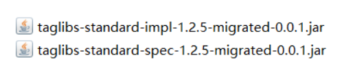
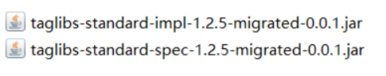
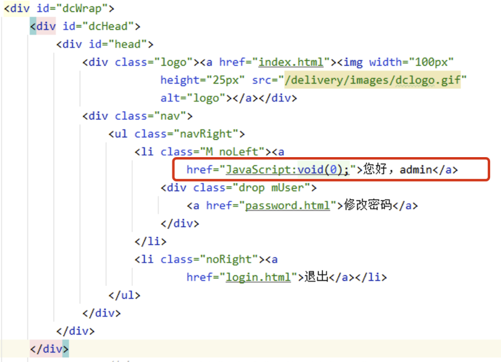
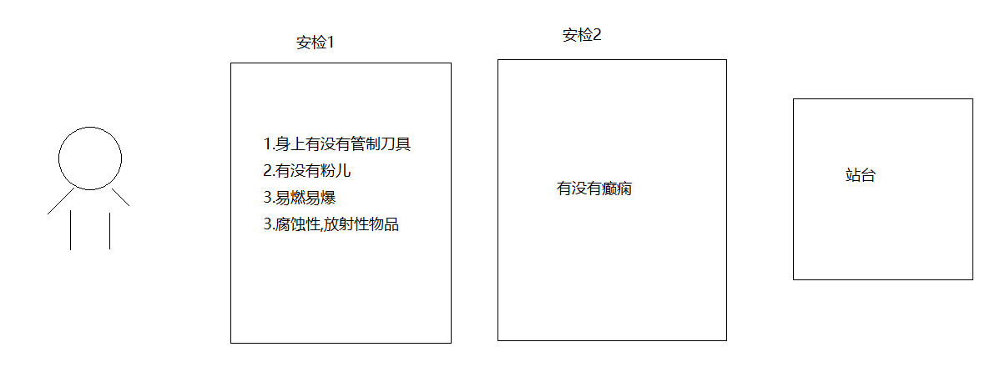
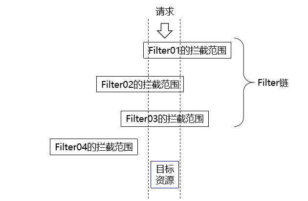
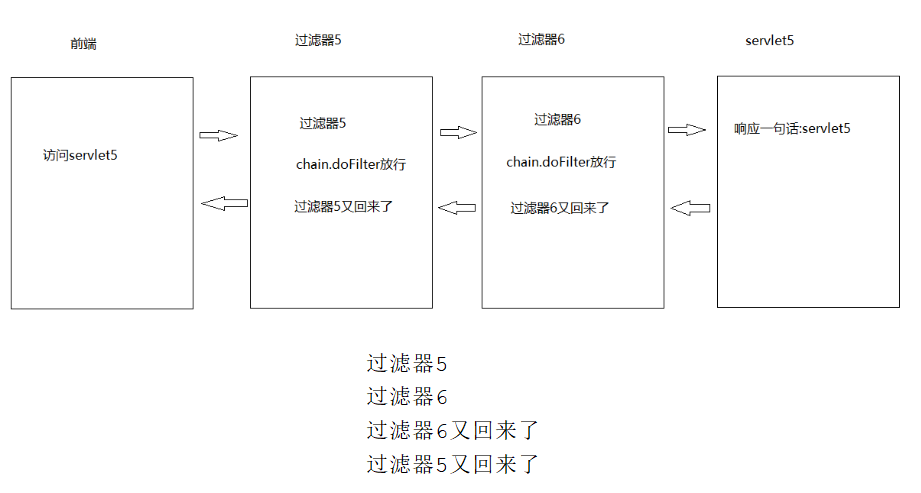
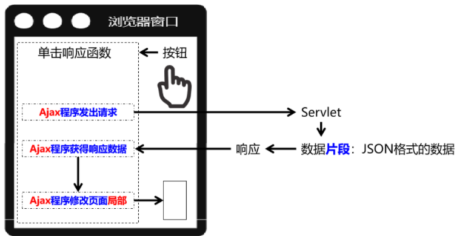

# day07.JSP 快递管理 过滤器

```java 
课前回顾:会话技术
    1.会话:客户端和服务端之间建立的一个会话,在这个会话中包含多次请求以及多次响应
    2.会话什么时候开始:客户端和服务端之间连接起来
      会话什么时候结束:客户端和服务端断开连接
    3.Cookie:由服务端创建,保存到浏览器上 -> 浏览器端的会话技术
      a.获取:
        Cookie(String name,String value)
      b.将cookie响应给浏览器
        addCookie(cookie对象)
      c.服务端获取cookie
        getCookies()
      d.获取cookie中的数据
        getName()
        getValue()
    4.cookie默认情况下,一旦和服务器断开,里面的数据就获取不到了
    5.设置cookie存活时间:
      setMaxAge(秒)
    6.Session:在服务端创建,而且存在在服务端的 -> 服务端的会话技术
    7.使用:
      a.getSession()
      b.setAttribute(String key,Object value)
      c.getAttribute(String key)
      d.removeAttribute(String key)
    8.Session和cookie的关系:
      a.服务端创建session对象,往域中存储一个数据
      b.服务器会为每一个session对象自动生成一个编号,然后将编号放到cookie中
        cookie的key为"JSESSIONID" value就是生成这个编号
      c.我们如果从域中获取数据,浏览器会将自己cookie中的JSESSIONID回传到服务器,如果号对上了,能从域中获取,如果对不上获取不到
      d.注意:默认情况下,我们一旦关闭浏览器,session域中的数据获取不到了,因为浏览器一关闭,里面的cookie失效了,所以号对不上了
        
今日重点:
  a.会使用jsp技术将服务端存在在域中的数据获取到页面上展示
  b.快递管理代码的完成
  c.会简单使用过滤器,过滤请求
  d.理解异步和同步(同步：所有数据一同出现 异步:谁先完成谁先出现在页面上 )
```

# 第一章.JSP

## 1.JSP初识

JSP（Java Server Pages）是一种动态网页开发技术，它是由 Sun 公司提出的一种基于 Java 技术的 Web 页面制作技术，可以在 HTML 文件中嵌入 Java 代码，使得生成动态内容的编写更加简单。

JSP 最主要的作用是生成动态页面。它允许将 Java 代码嵌入到 HTML 页面中，以便使用 Java 进行数据库查询、处理表单数据和生成 HTML等动态内容。另外，JSP 还可以与 Servlet 结合使用，实现更加复杂的 Web 应用程序开发。

JSP 的主要特点包括：

1.  简单：JSP 通过将 Java 代码嵌入到 HTML 页面中，使得生成动态内容的编写更加简单。
2.  高效：JSP 首次运行时会被转换为 Servlet，然后编译为字节码，从而可以启用 Just-in-Time（JIT）编译器，实现更高效的运行。
3.  多样化：JSP 支持多种标准标签库，包括 JSTL（JavaServer Pages 标准标签库）、EL（表达式语言）等，可以帮助开发人员更加方便的处理常见的 Web 开发需求。
    总之，JSP 是一种简单高效、多样化的 动态网页开发技术，它可以方便地生成动态页面和与 Servlet 结合使用，是 Java Web 开发中常用的技术之一。

## 2.EL表达式

EL(Expression Language) 是为了使JSP写起来更加简单。表达式语言的灵感来自于 ECMAScript 和 XPath 表达式语言，它提供了在 JSP 中简化表达式的方法，让Jsp的代码更加简化。

语法结构:**${expression}**

EL获取变量数据的方法很简单，例如:${username}。它的意思是取出某一范围(域)中名称为username的变量。

因为我们并没有指定哪一个范围的username，所以它会依序从Page、Request、Session、Application范围查找。**由于它只会从作用域中获取数据,所以被展示的数据一定要先存储到作用域,才可以使用EL表达式获取**

EL 提供"."和"[ ]"两种运算符来取数据。如果被访问的数据是对象时,可以使用"."操作符获取属性,如果是数组,则可以使用"[]"获取数据。

案例代码:

```jsp
<%@ page import="com.atguigu.pojo.SysUser" %><%--
  Created by IntelliJ IDEA.
  User: yutao
  Date: 2025/2/19
  Time: 21:54
  To change this template use File | Settings | File Templates.
--%>
<%@ page contentType="text/html;charset=UTF-8" language="java" %>
<html>
<head>
    <title>EL表达式</title>
</head>
<body>
<%
    String name = "tom";
    int age = 18;
    SysUser sysUser = new SysUser();
    sysUser.setUsername("root");
    String[] strs = {"张三", "李四"};

    //将四个数据保存到请求域中
    request.setAttribute("sysname", name);
    request.setAttribute("sysage", age);
    request.setAttribute("sysuser", sysUser);
    request.setAttribute("strs", strs);

    //2.内置对象测试
    request.setAttribute("reqkey","request的数据");
    session.setAttribute("sessionkey","session的数据");
    application.setAttribute("applicationkey","application的数据");
%>
   <h1>学生姓名:${sysname}</h1>
   <h1>学生年龄:${sysage}</h1>
   <h1>对象的姓名:${sysuser.username}</h1>
   <h1>数组:${strs[0]},${strs[1]}</h1>
   <h1>request:${reqkey}</h1>
   <h1>session:${sessionkey}</h1>
   <h1>application:${applicationkey}</h1>
</body>
</html>
```

**注意: EL表达式只负责取数据,无法循环遍历数据**

## 3.JSTL标签库

JSP 标准[标签库](https://baike.so.com/doc/5997574-6210547.html)(JSP Standard Tag Library，JSTL)是一个实现 Web应用程序中常见的通用功能的定制标记库集，这些功能包括迭代和条件判断、数据管理格式化、XML 操作以及数据库访问。

JSTL使用步骤:

### 3.1.添加依赖包

```java
这里的依赖包会因为tomcat版本以及配置环境的区别而有变化
```



### 3.2.jsp页面中引入核心标签库

```jsp
<%@ taglib prefix="c" uri="http://java.sun.com/jsp/jstl/core" %>
```

### 3.3.页面中使用c标签

```java
<c:forEach>标签有如下属性：
```

| **属性**      | **描述**                                                     | **是否必要** | **默认值**   |
| :------------ | :----------------------------------------------------------- | :----------- | :----------- |
| items(最重要) | 要被循环的信息                                               | 否           | 无           |
| begin         | 开始的元素（0=第一个元素，1=第二个元素）                     | 否           | 0            |
| end           | 最后一个元素（0=第一个元素，1=第二个元素）                   | 否           | Last element |
| step          | 每一次迭代的步长                                             | 否           | 1            |
| var(最重要)   | 代表当前条目的变量名称                                       | 否           | 无           |
| varStatus     | 代表循环状态的变量名称index：当前元素的索引（从 0 开始）。<br/>count：当前循环的次数（从 1 开始）。<br/><br/>first：是否是第一次循环（布尔值）。<br/><br/>last：是否是最后一次循环（布尔值）。 | 否           | 无           |

```java
<c:if>标签有如下属性：
```

| **属性**     | **描述**               | **是否必要** | **默认值** |
| :----------- | :--------------------- | :----------- | :--------- |
| test(最重要) | 条件                   | 是           | 无         |
| var          | 用于存储条件结果的变量 | 否           | 无         |
| scope        | var属性的作用域        | 否           | page       |

```jsp
<%@ page import="java.util.ArrayList" %><%--
  Created by IntelliJ IDEA.
  User: admin
  Date: 2025/2/25
  Time: 20:24
  To change this template use File | Settings | File Templates.
--%>
<%@ page contentType="text/html;charset=UTF-8" language="java" %>
<%@ taglib prefix="c" uri="http://java.sun.com/jsp/jstl/core" %>
<html>
<head>
    <title>Title</title>
</head>
<body>

<table width="300px" border="1" cellspacing="0">
    <tr>
        <td>序号</td>
        <td>姓名</td>
    </tr>
    <tr>
        <td></td>
        <td></td>
    </tr>
</table>
</body>
</html>
```

```jsp
<%@ page import="java.util.ArrayList" %><%--
  Created by IntelliJ IDEA.
  User: admin
  Date: 2025/2/25
  Time: 20:24
  To change this template use File | Settings | File Templates.
--%>
<%@ page contentType="text/html;charset=UTF-8" language="java" %>
<%@ taglib prefix="c" uri="http://java.sun.com/jsp/jstl/core" %>
<html>
<head>
    <title>Title</title>
</head>
<body>
<%
    ArrayList<String> list = new ArrayList<>();
    list.add("张三");
    list.add("李四");
    list.add("王五");
    list.add("赵六");

    request.setAttribute("list", list);
%>

<table width="300px" border="1" cellspacing="0">
    <tr>
        <td>序号</td>
        <td>姓名</td>
    </tr>
    <c:if test="${list.size()>0}">
        <c:forEach items="${list}" var="element" varStatus="i">
            <tr>
                <td>${i.count}</td>
                <td>${element}</td>
            </tr>
        </c:forEach>
    </c:if>

</table>
</body>
</html>
```

> jsp中四大域:
>
>   PageContext:页面域,作用于当前页面 
>
>   request:请求域,作用于一个请求中
>
>   session:会话域,作用于一次会话中
>
>   application:应用域(全局域),作用于整个web应用程序
>
> ```java
> 如果同时用了四大域存储数据,但是key一样,比如都叫name
>     
> 我们直接用EL表达式获取域中的name值 -> ${name} -> 当前页面能获取,就获取页面域中的name,页面域中没有,获取请求域中的name,请求域中的name没有获取会话域中的,会话域中的那么没有就获取全局域中的
> ```

# 第二章.案例开发-快递管理-第四期

## 1.动态展示快递记录信息

### 1.1.项目导入jstl相关的依赖



### 1.2.将除了login.html页面之外的页面都改成.jsp动态页面

```java
注意:修改时可以新建一个jsp页面,将html页面的代码复制到新的jsp页面中,也可以将html页面的后缀改成jsp
jsp页面必须要包含头信息:
```

``` java
<%@ page contentType="text/html;charset=UTF-8" language="java" %>
<%@ taglib prefix="c" uri="http://java.sun.com/jsp/jstl/core" %>
```

#### 1.2.1.修改DeliveryListController资源跳转地址

```  java
@WebServlet("/deliverylist/list")
public class DeliveryListController extends HttpServlet {
    private DeliveryService deliveryService = new DeliveryServiceImpl();

    @Override
    protected void doGet(HttpServletRequest request, HttpServletResponse response) throws ServletException, IOException {
        try {
        //1.解决请求乱码问题
            request.setCharacterEncoding("utf-8");
            response.setContentType("text/html;charset=utf-8");
        /*
          2.获取登录的用户id
            我们需要用登录用户的id去查询对应的快递信息
            也就是哪个用户登录,就只查询哪个用户相关的快递信息
         */
            SysUser user = (SysUser) request.getSession().getAttribute("user");
            Integer userId = user.getId();
            List<Delivery> list = deliveryService.findAllDeliveryByUserId(userId);
            //3.将查询出来的集合响应给页面
            request.setAttribute("deliverylist", list);
            //这里将list.html改成list.jsp
            request.getRequestDispatcher("/list.jsp").forward(request, response);
        } catch (SQLException e) {
            e.printStackTrace();
        }

    }

    @Override
    protected void doPost(HttpServletRequest request, HttpServletResponse response) throws ServletException, IOException {
        doGet(request, response);
    }
}
```

#### 1.2.2.修改list.jsp页面，进行快递记录展示

```java
1.将页面中展示快递信息的表格位置用c:foreach遍历请求域中包含的信息 
```

```  jsp
<!DOCTYPE html PUBLIC "-//W3C//DTD HTML 4.01 Transitional//EN" "http://www.w3.org/TR/html4/loose.dtd">
<%@ page contentType="text/html;charset=UTF-8" language="java" %>
<%@ taglib prefix="c" uri="http://java.sun.com/jsp/jstl/core" %>
<html>
    <head>
        <meta http-equiv="Content-Type" content="text/html; charset=UTF-8">
        <title>快递管理系统</title>
        <meta name="Copyright" content="Douco Design." />
        <link href="css/public.css" rel="stylesheet" type="text/css">
        <script type="text/javascript" src="js/jquery.min.js"></script>
        <script type="text/javascript" src="js/global.js"></script>
        <script type="text/javascript" src="js/jquery.autotextarea.js"></script>
    </head>
    <body>
        <div id="dcWrap">
            <div id="dcHead">
                <div id="head">
                    <div class="logo"><a href="index.html"></a></div>
                    <div class="nav">
                        <ul class="navRight">
                            <li class="M noLeft"><a
                                    href="JavaScript:void(0);">${user.username}</a>
                                <div class="drop mUser">
                                    <a href="password.html">修改密码</a>
                                </div>
                            </li>
                            <li class="noRight"><a
                                    href="login.html">退出</a></li>
                        </ul>
                    </div>
                </div>
            </div>
            <!-- dcHead 结束 --> <div id="dcLeft"><div id="menu">
                    <ul class="top">
                        <li><a href="index.html"><i
                                    class="home"></i><em>管理首页</em></a></li>
                    </ul>
                    <ul>
                        <li><a href="password.html"><i
                                    class="system"></i><em>修改密码</em></a></li>
                        <li><a href="list.html"><i
                                    class="nav"></i><em>快递管理</em></a></li>
                    </ul>
                </div></div>
            <div id="dcMain">
                <!-- 当前位置 -->
                <div id="urHere">快递管理系统<b>></b><strong>快递列表</strong> </div>
                <div class="mainBox"
                    style="height:auto!important;height:550px;min-height:550px;">
                    <h3><a href="add.html"
                            class="actionBtn add">添加快递</a>快递列表</h3>
                    <!-- 
                    本阶段不实现!!        
                    <div class="filter">
                        <form action="#" method="post">
                            物流公司
                            <select name="cat_id">
                                <option value>请选择</option>
                                <option value="1"> 申通快递</option>
                                <option value="2"> 圆通快递</option>
                                <option value="2"> 韵达快递</option>
                            </select>
                            收件人手机号 <input name="keyword" type="text"
                                class="inpMain" value size="20" />
                            签收状态 <select name="cat_id">
                                <option value>请选择</option>
                                <option value="1">已签收</option>
                                <option value="2"> 未签收</option>

                            </select>
                            <input name="submit" class="btnGray" type="submit"
                                value="筛选" />
                        </form>

                    </div> -->
                    <div id="list">

                        <table width="100%" border="0" cellpadding="8"
                            cellspacing="0" class="tableBasic">
                            <tr>
                                <th width="40" align="center">编号</th>
                                <th width="80" align="center">物流公司</th>
                                <th width="80" align="center">收件人</th>
                                <th width="80" align="center">手机号</th>
                                <th width="80" align="center">送达日期</th>
                                <th align="center">地址</th>
                                <th width="80" align="center">签收状态</th>
                                <th width="80" align="center">操作</th>
                            </tr>
                            <c:forEach items="${deliveryList}" var="delivery">
                            <tr>
                                <td align="center">${delivery.id}</td>
                                <td>${delivery.company.companyName}</td>
                                <td align="center">${delivery.deliveryName}</td>
                                <td align="center">${delivery.phone}</td>
                                <td align="center">${delivery.sendTime}</td>
                                <td align="center">${delivery.address}</td>
                                <td align="center">${delivery.state==0?'未签收':'已签收'}</td>
                                <td align="center">
                                    <a href="#">编辑</a> | <a href="#">删除</a>
                                </td>
                            </tr>
                            </c:forEach>
<%--                            <tr>
                                <td align="center">2</td>
                                <td>申通快递</td>
                                <td align="center">王老师</td>
                                <td align="center">13700009999</td>
                                <td align="center">2024-08-10</td>
                                <td align="center">北京市昌平区宏福科技园B座</td>
                                <td align="center">未签收</td>
                                <td align="center">
                                    <a href="#">编辑</a> | <a href="#">删除</a>
                                </td>

                            </tr>--%>
                        </table>
                    </div>
                    <div class="clear"></div>
                    <div class="pager"> <a href="article.php?page=1">第一页</a>
                        <a href="article.php?page=1"> 上一页</a> <a
                            href="article.php?page=1">下一页</a> <a
                            href="article.php?page=1">最末页</a></div> </div>
            </div>
            <div class="clear"></div>
            <div id="dcFooter">
                <div id="footer">
                    <div class="line"></div>
                    <ul>
                        版权所有 © 2024-2025 尚硅谷教育，并保留所有权利。
                    </ul>
                </div>
            </div><!-- dcFooter 结束 -->
            <div class="clear"></div> </div>
        <script type="text/javascript">
 
 onload = function()
 {
   document.forms['action'].reset();
 }

 function douAction()
 {
     var frm = document.forms['action'];

     frm.elements['new_cat_id'].style.display = frm.elements['action'].value == 'category_move' ? '' : 'none';
 }
 
 </script>
    </body>
</html>
```

## 2.展示用户信息

```java
展示登录的用户nickname,主要涉及页面： index.jsp / list.jsp / add.jsp / edit.jsp / password.jsp
将以上页面改成动态页面 .jsp，修改后缀名和添加固定头
```

```java
需要修改登录成功(UserLoginController)跳转页面index.html -> index.jsp
```

``` java
@WebServlet("/user/login")
public class UserLoginController extends HttpServlet {
    @Override
    protected void doGet(HttpServletRequest req, HttpServletResponse resp) throws ServletException, IOException {
        //1.设置请求参数编码格式
        req.setCharacterEncoding("UTF-8");
        resp.setContentType("text/html;charset=UTF-8");
        //2.获取请求参数
        String username = req.getParameter("username");
        String password = req.getParameter("password");
        System.out.println(username);
        //3.调用service层方法
        UserService userService = new UserServiceImpl();
        try {
            SysUser sysUser =userService.login(username,password);
            //System.out.println(sysUser);
            if (sysUser!=null){
                //保存登录的用户状态,用于查询登录快递信息以及登录的状态
                req.getSession().setAttribute("user",sysUser);
                req.getRequestDispatcher("/index.jsp").forward(req,resp);
            }else{
                req.getRequestDispatcher("/login.html").forward(req,resp);
            }
        } catch (SQLException e) {
            throw new RuntimeException(e);
        }
    }

    @Override
    protected void doPost(HttpServletRequest req, HttpServletResponse resp) throws ServletException, IOException {
        doGet(req,resp);
    }
}

```



```java
修改代码如下：
```

```jsp
<li class="M noLeft"><a href="JavaScript:void(0);">您好，${user.nickname}</a>
```

# 第三章.修改密码功能

## 1.通用页面修改和提取

页面抽取

```java
创建resource.jsp -> 用于展示css和js文件的
```

``` jsp
<%@ page contentType="text/html;charset=UTF-8" language="java" %>
<%@ taglib prefix="c" uri="http://java.sun.com/jsp/jstl/core" %>
<link href="/delivery_system/css/public.css" rel="stylesheet" type="text/css">
<script type="text/javascript" src="/delivery_system/js/jquery.min.js"></script>
<script type="text/javascript" src="/delivery_system/js/global.js"></script>
<script type="text/javascript" src="/delivery_system/js/jquery.autotextarea.js"></script>
```

```java
创建head.jsp -> 用于提取内容head（登录状态）
```

``` html
<%@ page contentType="text/html;charset=UTF-8" language="java" %>
<%@ taglib prefix="c" uri="http://java.sun.com/jsp/jstl/core" %>
<div id="dcHead">
    <div id="head">
        <div class="logo"><a href="index.html"></a></div>
        <div class="nav">
            <ul class="navRight">
                <li class="M noLeft"><a
                        href="JavaScript:void(0);">您好，${user.nickname}</a>
                    <div class="drop mUser">
                        <a href="password.jsp">修改密码</a>
                    </div>
                </li>
                <li class="noRight"><a
                        href="login.php?rec=logout">退出</a></li>
            </ul>
        </div>
    </div>
</div>
```

```java
创建menu.jsp -> 提取内容菜单（左侧菜单）
```

``` jsp
<%@ page contentType="text/html;charset=UTF-8" language="java" %>
<%@ taglib prefix="c" uri="http://java.sun.com/jsp/jstl/core" %>
<div id="dcLeft">
    <div id="menu">
        <ul class="top">
            <li><a href="index.html"><i
                    class="home"></i><em>管理首页</em></a></li>
        </ul>
        <ul>
            <li><a href="password.jsp"><i
                    class="system"></i><em>修改密码</em></a></li>
            <li><a href="/delivery_system/delivery/list"><i
                    class="nav"></i><em>快递管理</em></a></li>

        </ul>
    </div>
</div>
```

```java
所有页面引用
注意：删除原有位置，使用jsp:include技术动态引入，不要引错位置！
```

``` jsp
<head>
    <jsp:include page="resource.jsp"></jsp:include>
</head>
<div id="dcWrap">
    <jsp:include page="head.jsp"></jsp:include>
    <jsp:include page="menu.jsp"></jsp:include>
```

## 2.跳转password.jsp页面

为什么不直接写"/delivery_system/user/password.jsp"？

因为我们需要登录了 才能进入修改页面 这样子的话 无论用户有没有登录都可以直接跳转到修改密码页面，这很明显不合理。 

所以应该用下面的方式 后续可以用过滤器(目录匹配 ) 看看user里面有没有东西

```java
修改menu.jsp中的"修改密码"地址  -> 请求发送到对应的controller层
            <li><a href="/delivery_system/user/toPasswordPage"><i
                    class="system"></i><em>修改密码</em></a></li>     
```

```java
@WebServlet("/user/toPasswordPage")
public class UserToPasswordController extends HttpServlet {
    @Override
    protected void doGet(HttpServletRequest request, HttpServletResponse response) throws ServletException, IOException {
        request.getRequestDispatcher("/password.jsp").forward(request,response);
    }

    @Override
    protected void doPost(HttpServletRequest request, HttpServletResponse response) throws ServletException, IOException {
        doGet(request, response);
    }
}

```

## 3.修改密码的Controller层

```java
修改password.jsp页面表单 -> 
    1.action = "/delivery_system/user/changepassword"
    2.原始密码的input标签,加上name = "password"
    3.新密码的input标签,加上name = "newpassword"
    4.确认密码的input标签,加上name = "repassword"
```

``` java
@WebServlet("/user/changepassword")
public class UserChangePasswordController extends HttpServlet {
    private UserService userService = new UserServiceImpl();

    @Override
    protected void doGet(HttpServletRequest request, HttpServletResponse response) throws ServletException, IOException {
        try {
            request.setCharacterEncoding("UTF-8");
            response.setContentType("text/html;charset=UTF-8");
            /**
             * 我们应该先根据当前登录的用户id查询对应的用户
             * 然后再service层拿出用户的密码,和我们在页面上
             * 填写的原始密码比较一样才能更新新密码
             */
            SysUser sysUser = (SysUser) request.getSession().getAttribute("user");
            Integer uid = sysUser.getId();

            //获取页面上填写的原始密码和新密码
            String password = request.getParameter("password");
            String newpassword = request.getParameter("newpassword");
            //调用service层修改密码的方法,传递uid,和原始密码以及新密码
            boolean flag = userService.updateUserPassword(uid, password, newpassword);
            //判断将来如果flag为true,在页面展示"修改密码成功",否则展示"修改密码失败"
            if (flag == true) {
                request.setAttribute("message", "修改密码成功");
                request.getRequestDispatcher("/password.jsp").forward(request, response);
            } else {
                request.setAttribute("message", "修改密码失败");
                request.getRequestDispatcher("/password.jsp").forward(request, response);
            }
        } catch (SQLException e) {
            e.printStackTrace();
        }
    }

    @Override
    protected void doPost(HttpServletRequest request, HttpServletResponse response) throws ServletException, IOException {
        doGet(request, response);
    }
}

```

## 4.修改密码的Service层

```  java
public interface UserService {
    /**
     * 用户登录
     * @param username
     * @param password
     * @return
     */
    SysUser login(String username, String password) throws SQLException;

    /**
     * 修改用户密码
     * @param uid
     * @param password
     * @param newpassword
     * @return
     */
    boolean updateUserPassword(Integer uid, String password, String newpassword) throws SQLException;
}

```

```java
public class UserServiceImpl implements UserService {
    private UserDao userDao = new UserDaoImpl();
    /**
     * 用户登录
     * @param username
     * @param password
     * @return
     */
    @Override
    public SysUser login(String username, String password) throws SQLException {
        //1.将password加密
        password = MD5Utils.encrypt(password);
        //2.将username和password传递到dao层
        SysUser sysUser = userDao.login(username,password);
        return sysUser;
    }

    @Override
    public boolean updateUserPassword(Integer uid, String password, String newpassword) throws SQLException {
        //先根据当前登录的用户id查询对应的用户,以便拿出在数据库中用户的密码
        SysUser sysUser = userDao.findUserById(uid);
        String oldPassword = sysUser.getPassword();
        //将页面上获取的原始密码password加密然后和查询出来的密码比较
        password = MD5Utils.encrypt(password);
        if (oldPassword.equals(password)){
            userDao.updateUserPassword(uid,MD5Utils.encrypt(newpassword));
            return true;
        }
        return false;
    }
}
```

## 5.修改密码的Dao层

```  java
public interface UserDao {
    /**
     * 用户登录
     * @param username
     * @param password
     * @return
     */
    SysUser login(String username, String password) throws SQLException;

    /**
     * 根据id查询用户
     * @param uid
     * @return
     */
    SysUser findUserById(Integer uid) throws SQLException;

    /**
     * 修改用户密码
     * @param uid
     * @param newpassword
     */
    void updateUserPassword(Integer uid, String newpassword) throws SQLException;
}

```

```java
public class UserDaoImpl implements UserDao {
    private QueryRunner qr = new QueryRunner(DruidUtils.getDataSource());
    /**
     * 用户登录
     * @param username
     * @param password
     * @return
     */
    @Override
    public SysUser login(String username, String password) throws SQLException {
        String sql = "select id,username,password,nickname from sys_user where username = ? and password = ?";
        SysUser sysUser = qr.query(sql, new BeanHandler<SysUser>(SysUser.class), username, password);
        return sysUser;
    }

    /**
     * 根据用户id查询用户
     * @param uid
     * @return
     * @throws SQLException
     */
    @Override
    public SysUser findUserById(Integer uid) throws SQLException {
        String sql = "select id,username,password,nickname from sys_user where id = ?";
        SysUser sysUser = qr.query(sql, new BeanHandler<>(SysUser.class), uid);
        return sysUser;
    }

    /**
     * 修改用户密码
     * @param uid
     * @param newpassword
     */
    @Override
    public void updateUserPassword(Integer uid, String newpassword) throws SQLException {
        String sql = "update sys_user set password = ? where id = ?";
        qr.update(sql,newpassword,uid);
    }
}

```

## 6.修改password.jsp页面

```java
将相应回来的结果展示在页面上-> table下面添加展示错误信息的div
```

``` jsp
<tr>
    <td></td>
    <td>
        <input type="submit" name="submit" class="btn" value="提交" />
    </td>
</tr>
</table>
<div>${message}</div>
</form>
```

## 7.用户退出功能

### 7.1.用户退出的Controller层

```java
修改head.jsp页面:在"退出"按钮上修改请求路径
li class="noRight"><a href="/delivery_system/user/logout">退出</a></li>    
```

```jsp
<%--
  Created by IntelliJ IDEA.
  User: 123
  Date: 2024/12/11
  Time: 16:11
  To change this template use File | Settings | File Templates.
--%>
<%@ page contentType="text/html;charset=UTF-8" language="java" %>
<div id="head">
    <div class="logo"><a href="index.html"></a></div>
    <div class="nav">
        <ul class="navRight">
            <li class="M noLeft"><a
                    href="JavaScript:void(0);">您好，${user.username}</a>
                <div class="drop mUser">
                    <a href="/delivery_system/password.jsp">修改密码</a>
                </div>
            </li>
            <li class="noRight"><a
                    href="/delivery_system/user/logout">退出</a></li>
        </ul>
    </div>
</div>

```

``` java
@WebServlet("/user/logout")
public class UserLogoutController extends HttpServlet {
    @Override
    protected void doGet(HttpServletRequest request, HttpServletResponse response) throws ServletException, IOException {
       request.getSession().invalidate();
       //request.getRequestDispatcher("/login.html").forward(request, response);
        response.sendRedirect(request.getContextPath()+"/login.html");
    }

    @Override
    protected void doPost(HttpServletRequest request, HttpServletResponse response) throws ServletException, IOException {
        doGet(request, response);
    }
}
```

# 第四章.Filter过滤器

## 1.Filter过滤器介绍

```java
1.概述:过滤器,从代码层面来看,过滤器是一个接口->Filter,想要实现一个过滤器,我们可以实现这个接口
2.作用:
  过滤请求,请求发送过来访问web资源,都是先经过过滤器,所以过滤器是在访问到web资源之前就会过滤,如果过滤器不放行,请求是访问不到想要访问的web资源的,放行了,请求才能访问到想要的web资源
      
3.使用场景:
  a.登录权限校验(比如快递管理,没有登录,就不能点击"快递管理","修改密码"等操作)
  b.统一处理请求中文乱码 
  c.打游戏骂队友    
```



## 2.Filter过滤器入门1_1个Filter

```java
实现过程:
  1.定义一个类,实现Filter接口
  2.重写方法doFilter方法
  3.做配置,指明访问哪些web资源要走此过滤器   
```

```java
@WebServlet("/servlet1")
public class Servlet1 extends HttpServlet {
    @Override
    protected void doGet(HttpServletRequest request, HttpServletResponse response) throws ServletException, IOException {
        response.getWriter().write("servlet1");
    }

    @Override
    protected void doPost(HttpServletRequest request, HttpServletResponse response) throws ServletException, IOException {
        doGet(request, response);
    }
}
```

```java
public class Filter1 implements Filter {
    @Override
    public void doFilter(ServletRequest servletRequest, ServletResponse servletResponse, FilterChain filterChain) throws IOException, ServletException {
        System.out.println("filter1");
        /*
           放行方法
           不写不放行
           写了放行
           不是递归调用
         */
        //filterChain.doFilter(servletRequest, servletResponse);
    }
}

```

```xml
    <filter>
        <filter-name>filter1</filter-name>
        <filter-class>com.atguigu.b_filter.Filter1</filter-class>
    </filter>
    <filter-mapping>
        <filter-name>filter1</filter-name>
        <!--
          写的是访问的web资源的路径
          此时访问这个web资源就会走这个过滤器
        -->
        <url-pattern>/servlet1</url-pattern>
    </filter-mapping>
```

## 3.Filter过滤器入门2_2个Filter

```java
再加一个过滤器,如果第一个过滤器不放行,就走不到第二个过滤器
```

```java
@WebServlet("/servlet2")
public class Servlet2 extends HttpServlet {
    @Override
    protected void doGet(HttpServletRequest request, HttpServletResponse response) throws ServletException, IOException {
        response.getWriter().write("servlet2");
    }

    @Override
    protected void doPost(HttpServletRequest request, HttpServletResponse response) throws ServletException, IOException {
        doGet(request, response);
    }
}
```

```java
public class Filter2 implements Filter {
    @Override
    public void doFilter(ServletRequest servletRequest, ServletResponse servletResponse, FilterChain filterChain) throws IOException, ServletException {
        System.out.println("filter2");
        /*
           放行方法
           不写不放行
           写了放行
           不是递归调用
         */
        filterChain.doFilter(servletRequest, servletResponse);
    }
}
```

```java
public class Filter3 implements Filter {
    @Override
    public void doFilter(ServletRequest servletRequest, ServletResponse servletResponse, FilterChain filterChain) throws IOException, ServletException {
        System.out.println("filter3");
        /*
           放行方法
           不写不放行
           写了放行
           不是递归调用
         */
        filterChain.doFilter(servletRequest, servletResponse);
    }
}
```

```xml
    <filter>
        <filter-name>filter2</filter-name>
        <filter-class>com.atguigu.b_filter.Filter2</filter-class>
    </filter>
    <filter-mapping>
        <filter-name>filter2</filter-name>
        <!--
          写的是访问的web资源的路径
          此时访问这个web资源就会走这个过滤器
        -->
        <url-pattern>/servlet2</url-pattern>
    </filter-mapping>

    <filter>
        <filter-name>filter3</filter-name>
        <filter-class>com.atguigu.b_filter.Filter3</filter-class>
    </filter>
    <filter-mapping>
        <filter-name>filter3</filter-name>
        <!--
          写的是访问的web资源的路径
          此时访问这个web资源就会走这个过滤器
        -->
        <url-pattern>/servlet2</url-pattern>
    </filter-mapping>
```

## 4.Filter过滤器入门3_选择性拦截

<url-pattern>/*</url-pattern>拦截所有请求

<url-pattern>/servlet1</url-pattern>拦截特定请求

```java
@WebServlet("/servlet3")
public class Servlet3 extends HttpServlet {
    @Override
    protected void doGet(HttpServletRequest request, HttpServletResponse response) throws ServletException, IOException {
        response.getWriter().write("servlet3");
    }

    @Override
    protected void doPost(HttpServletRequest request, HttpServletResponse response) throws ServletException, IOException {
        doGet(request, response);
    }
}

```

```java
public class Filter4 implements Filter {
    @Override
    public void doFilter(ServletRequest servletRequest, ServletResponse servletResponse, FilterChain filterChain) throws IOException, ServletException {
        System.out.println("filter4");
        /*
           放行方法
           不写不放行
           写了放行
           不是递归调用
         */
        filterChain.doFilter(servletRequest, servletResponse);
    }
}

```

```java
public class Filter5 implements Filter {
    @Override
    public void doFilter(ServletRequest servletRequest, ServletResponse servletResponse, FilterChain filterChain) throws IOException, ServletException {
        System.out.println("filter5");
        /*
           放行方法
           不写不放行
           写了放行
           不是递归调用
         */
        filterChain.doFilter(servletRequest, servletResponse);
    }
}
```

```java
public class Filter6 implements Filter {
    @Override
    public void doFilter(ServletRequest servletRequest, ServletResponse servletResponse, FilterChain filterChain) throws IOException, ServletException {
        System.out.println("filter6");
        /*
           放行方法
           不写不放行
           写了放行
           不是递归调用
         */
        filterChain.doFilter(servletRequest, servletResponse);
    }
}

```

```xml
    <filter>
        <filter-name>filter4</filter-name>
        <filter-class>com.atguigu.b_filter.Filter4</filter-class>
    </filter>
    <filter-mapping>
        <filter-name>filter4</filter-name>
        <!--
          写的是访问的web资源的路径
          此时访问这个web资源就会走这个过滤器
        -->
        <url-pattern>/*</url-pattern>
    </filter-mapping>

    <filter>
        <filter-name>filter5</filter-name>
        <filter-class>com.atguigu.b_filter.Filter5</filter-class>
    </filter>
    <filter-mapping>
        <filter-name>filter5</filter-name>
        <!--
          写的是访问的web资源的路径
          此时访问这个web资源就会走这个过滤器
        -->
        <url-pattern>/*</url-pattern>
    </filter-mapping>

    <filter>
        <filter-name>filter6</filter-name>
        <filter-class>com.atguigu.b_filter.Filter6</filter-class>
    </filter>
    <filter-mapping>
        <filter-name>filter6</filter-name>
        <!--
          写的是访问的web资源的路径
          此时访问这个web资源就会走这个过滤器
        -->
        <url-pattern>/servlet3</url-pattern>
    </filter-mapping>

```

## 5.处理中文乱码的Filter(请求阶段)

```html
<!DOCTYPE html>
<html lang="en">
<head>
    <meta charset="UTF-8">
    <title>首页</title>
</head>
<body>
<form action="/day13_filter/servlet4" method="post">
    <input type="text" name="username"><br/>
    <input type="submit" value="提交">
</form>
</body>
</html>
```

```java
public class Servlet4 extends HttpServlet {
    @Override
    protected void doGet(HttpServletRequest request, HttpServletResponse response) throws ServletException, IOException {
        String username = request.getParameter("username");
        System.out.println("username = " + username);
    }

    @Override
    protected void doPost(HttpServletRequest request, HttpServletResponse response) throws ServletException, IOException {
        doGet(request, response);
    }
}

```

```java
public class Filter7 implements Filter {

    /**
     * 有关过滤器的生命周期方法:初始化
     * @param filterConfig
     * @throws ServletException
     */
    @Override
    public void init(FilterConfig filterConfig) throws ServletException {

    }

    /**
     * 此方法就是实现过滤规则的方法
     *
     * filterChain.doFilter(servletRequest,servletResponse) -> 放行
     * 而且不是递归调用
     *
     * @param servletRequest
     * @param servletResponse
     * @param filterChain
     * @throws IOException
     * @throws ServletException
     */
    @Override
    public void doFilter(ServletRequest servletRequest, ServletResponse servletResponse, FilterChain filterChain) throws IOException, ServletException {
        System.out.println("过滤器7");
        //处理请求中文乱码
        servletRequest.setCharacterEncoding("utf-8");

        //放行
        filterChain.doFilter(servletRequest,servletResponse);
    }


    /**
     * 有关过滤器生命周期的方法:销毁
     */
    @Override
    public void destroy() {

    }
}

```

```xml
    <servlet>
        <servlet-name>servlet4</servlet-name>
        <servlet-class>com.atguigu.servlet.Servlet4</servlet-class>
    </servlet>
    <servlet-mapping>
        <servlet-name>servlet4</servlet-name>
        <url-pattern>/servlet4</url-pattern>
    </servlet-mapping>


    <filter>
        <filter-name>filter7</filter-name>
        <filter-class>com.atguigu.filter.Filter7</filter-class>
    </filter>
    <filter-mapping>
        <filter-name>filter7</filter-name>
        <url-pattern>/servlet4</url-pattern>
    </filter-mapping>
```

> 问题:响应中文乱码要不要在过滤器中设置? -> 不要
>
> ​         响应的结果有可能是各种类型,有可能是文本内容,页面,json,音乐,图片等
>
> ​        我们设置响应中文乱码:response.setContentType("text/html;charset=utf-8")->这种写法只针对文本
>
> ​        所以此方法不能对json,音乐等其他数据格式起作用
>
> ​        所以,我们不用将响应中文乱码放到过滤器中

## 6.Filter过滤器生命周期以及生命周期方法

| 生命周期阶段 | 执行时机                               | 生命周期方法 |
| ------------ | -------------------------------------- | ------------ |
| 初始化       | web项目启动时                          | init()       |
| 执行         | 来了请求了,过滤器拦截到了              | doFilter()   |
| 销毁         | 在过滤器销毁时被销毁(比如,web项目关闭) | destroy()    |

```java
public class Filter7 implements Filter {
    @Override
    public void init(FilterConfig filterConfig) throws ServletException {
        System.out.println("Filter7 init");
    }

    @Override
    public void doFilter(ServletRequest servletRequest, ServletResponse servletResponse, FilterChain filterChain) throws IOException, ServletException {
        System.out.println("Filter7 doFilter");
        filterChain.doFilter(servletRequest, servletResponse);
    }

    @Override
    public void destroy() {
        System.out.println("Filter7 destroy");
    }
}

```

## 7.Filter过滤器4种匹配规则

### 7.1.精准匹配

```java
1.格式: 
  <url-pattern>/servlet1</url-pattern>
2.意义:
  此时只有访问servlet1才会经过这个过滤器
```

```xml
    <filter>
        <filter-name>filter8</filter-name>
        <filter-class>com.atguigu.b_filter.Filter8</filter-class>
    </filter>
    <filter-mapping>
        <filter-name>filter8</filter-name>
        <!--精准匹配-->
        <url-pattern>/servlet5</url-pattern>
    </filter-mapping>
```

### 7.2.模糊匹配

```java
1.方式一:  /*   -> 太极端了 -> 代表得是所有请求都拦截

2.方式二:
  /目录名/*    -> 用一个指定的目录名将一类请求放到一组中了,只要是请求路径上代指定的目录名,就先走过滤器
```

```xml
     <filter>
        <filter-name>filter8</filter-name>
        <filter-class>com.atguigu.b_filter.Filter8</filter-class>
    </filter>
    <filter-mapping>
        <filter-name>filter8</filter-name>
        <!--精准匹配-->
        <!--<url-pattern>/servlet5</url-pattern>-->
        <!--模糊匹配-->
        <url-pattern>/delivery/*</url-pattern>
    </filter-mpping>   
```

### 7.3.扩展名匹配

```java
1.格式:
  *.action  或者  *.do
      
2.意义:请求路径上到指定后缀名的,都走这个过滤器      
```

```java
    <filter>
        <filter-name>filter8</filter-name>
        <filter-class>com.atguigu.b_filter.Filter8</filter-class>
    </filter>
    <filter-mapping>
        <filter-name>filter8</filter-name>
        <!--精准匹配-->
        <!--<url-pattern>/servlet5</url-pattern>-->
        <!--模糊匹配-->
        <!--<url-pattern>/delivery/*</url-pattern>-->
        <!--扩展名匹配-->
        <url-pattern>*.action</url-pattern>
    </filter-mapping>
```


### 2.4.匹配servlet名称

```java
1.方式:
  将过滤器配置中的url-pattern换成servlet-name的值
```

```xml
    <filter>
        <filter-name>filter8</filter-name>
        <filter-class>com.atguigu.b_filter.Filter8</filter-class>
    </filter>
    <filter-mapping>
        <filter-name>filter8</filter-name>
        <!--精准匹配-->
        <!--<url-pattern>/servlet5</url-pattern>-->
        <!--模糊匹配-->
        <!--<url-pattern>/delivery/*</url-pattern>-->
        <!--扩展名匹配-->
        <!--<url-pattern>*.action</url-pattern>-->
        <!--servlet-name匹配-->
        <servlet-name>servlet5</servlet-name>
    </filter-mapping>
```

## 8.Filter过滤器链以及执行顺序

```java
1.过滤器链:说白了就是多个过滤器过滤一个请求,请求来了,经过第一个过滤器,如果一个过滤器放行,才能进入到下一个过滤器;如果第一个过滤器不放行,后面的过滤器也到达不了
    
2.执行顺序:
  a.如果多个过滤器过滤一个请求,使用的是url-pattern配置的,谁先配置的,先走谁
  b.如果多个过滤器过滤一个请求,一个使用url-pattern,一个使用servlet-name,使用url-pattern的过滤器不管在前还是在后,都会先走使用url-pattern的
```



```java
@WebServlet(name = "servlet6",urlPatterns = "/servlet6")
public class Servlet6 extends HttpServlet {
    @Override
    protected void doGet(HttpServletRequest request, HttpServletResponse response) throws ServletException, IOException {
        response.getWriter().write("servlet6");
    }

    @Override
    protected void doPost(HttpServletRequest request, HttpServletResponse response) throws ServletException, IOException {
        doGet(request, response);
    }
}

```

```java
public class Filter9 implements Filter {
    @Override
    public void doFilter(ServletRequest servletRequest, ServletResponse servletResponse, FilterChain filterChain) throws IOException, ServletException {
        System.out.println("Filter9 doFilter");
        filterChain.doFilter(servletRequest, servletResponse);
    }
}
```

```java
public class Filter10 implements Filter {
    @Override
    public void doFilter(ServletRequest servletRequest, ServletResponse servletResponse, FilterChain filterChain) throws IOException, ServletException {
        System.out.println("Filter10 doFilter");
        filterChain.doFilter(servletRequest, servletResponse);
    }
}

```

```xml
    <filter>
        <filter-name>filter10</filter-name>
        <filter-class>com.atguigu.b_filter.Filter10</filter-class>
    </filter>
    <filter-mapping>
        <filter-name>filter10</filter-name>
        <!--<url-pattern>/servlet6</url-pattern>-->
        <servlet-name>servlet6</servlet-name>
    </filter-mapping>

    <filter>
        <filter-name>filter9</filter-name>
        <filter-class>com.atguigu.b_filter.Filter9</filter-class>
    </filter>
    <filter-mapping>
        <filter-name>filter9</filter-name>
        <url-pattern>/servlet6</url-pattern>
    </filter-mapping>

```

> 

## 9.注解方式实现过滤器Filter

```java
@WebServlet(name = "servlet7",urlPatterns = "/servlet7")
public class Servlet7 extends HttpServlet {
    @Override
    protected void doGet(HttpServletRequest request, HttpServletResponse response) throws ServletException, IOException {
        response.getWriter().write("servlet7");
    }

    @Override
    protected void doPost(HttpServletRequest request, HttpServletResponse response) throws ServletException, IOException {
        doGet(request, response);
    }
}

```

```java
@WebFilter("/servlet7")
public class Filter11 implements Filter {
    @Override
    public void doFilter(ServletRequest servletRequest, ServletResponse servletResponse, FilterChain filterChain) throws IOException, ServletException {
        System.out.println("Filter11 doFilter");
        filterChain.doFilter(servletRequest, servletResponse);
    }
}
```

> 1.如果是纯注解的过滤器,哪个过滤器在前就先执行哪个过滤器(按照过滤器名字比较)
>
> 2.如果有配置的,还有注解的,先走配置的->不要配置的,注解的混着使用

## 10.为快递管理添加过滤器

```java
将web.xml中配置的欢迎页面干掉 -> 清浏览器缓存
```

```java
这里采用了继承HttpFilter类的方式实现过滤器,和实现Filter接口是一样的
实现Filter接口的方式重写的doFilter方法参数是ServletRequest和ServletResponse
ServletRequest对象无法调用getSession方法
而继承HttpFilter类的方式重写的doFilter方法参数为HttpServletRequest和HttpServletResponse
可以调用getSession方法
```

```java
@WebFilter(urlPatterns = {"/delivery/*","/user/logout","/user/changepassword","/user/toPasswordPage"})
public class LoginFilter extends HttpFilter {
    @Override
    protected void doFilter(HttpServletRequest request, HttpServletResponse response, FilterChain chain) throws IOException, ServletException {
        SysUser sysUser = (SysUser) request.getSession().getAttribute("user");
        if (sysUser==null){
            response.sendRedirect(request.getContextPath()+"/login.html");
        }else{
            chain.doFilter(request, response);
        }
    }
}

```

# 第五章.Listener监听器(了解)

## 1.Listener监听器介绍

```java
1.监听器：专门用于对其他对象身上发生的事件或状态改变进行监听和相应处理的对象，当被监视的对象发生情况时，立即采取相应的行动。

2.Servlet监听器:Servlet规范中定义的一种特殊类，它用于监听Web应用程序中的ServletContext，HttpSession 和HttpServletRequest等域对象的创建与销毁事件，以及监听这些域对象中的属性发生修改的事件。
    
3.监听器作用:主要是监听域对象的,比如监听域对象的创建,销毁,以及属性的改变等
    
4.过滤器和监听器区别:
  过滤器:过滤的是请求
  监听器:监听的是域对象的状态
```

## 2.监听器分类(了解即可)

### 2.1.ServletContextListener

```java
作用：监听ServletContext对象的创建与销毁
```

| 方法名                                      | 作用                     |
| ------------------------------------------- | ------------------------ |
| contextInitialized(ServletContextEvent sce) | ServletContext创建时调用 |
| contextDestroyed(ServletContextEvent sce)   | ServletContext销毁时调用 |

```java
ServletContextEvent对象代表从ServletContext对象身上捕获到的事件，通过这个事件对象我们可以获取到ServletContext对象。
```

### 2.2.HttpSessionListener

```java
作用：监听HttpSession对象的创建与销毁
```

| 方法名                                 | 作用                      |
| -------------------------------------- | ------------------------- |
| sessionCreated(HttpSessionEvent hse)   | HttpSession对象创建时调用 |
| sessionDestroyed(HttpSessionEvent hse) | HttpSession对象销毁时调用 |

```java
HttpSessionEvent对象代表从HttpSession对象身上捕获到的事件，通过这个事件对象我们可以获取到触发事件的HttpSession对象。
```

### 2.3.ServletRequestListener

```java
作用：监听ServletRequest对象的创建与销毁
```

| 方法名                                      | 作用                         |
| ------------------------------------------- | ---------------------------- |
| requestInitialized(ServletRequestEvent sre) | ServletRequest对象创建时调用 |
| requestDestroyed(ServletRequestEvent sre)   | ServletRequest对象销毁时调用 |

```java
ServletRequestEvent对象代表从HttpServletRequest对象身上捕获到的事件，通过这个事件对象我们可以获取到触发事件的HttpServletRequest对象。另外还有一个方法可以获取到当前Web应用的ServletContext对象。
```

###    2.4.ServletContextAttributeListener

```java
作用：监听ServletContext中属性的添加、移除和修改
```

| 方法名                                               | 作用                                 |
| ---------------------------------------------------- | ------------------------------------ |
| attributeAdded(ServletContextAttributeEvent scab)    | 向ServletContext中添加属性时调用     |
| attributeRemoved(ServletContextAttributeEvent scab)  | 从ServletContext中移除属性时调用     |
| attributeReplaced(ServletContextAttributeEvent scab) | 当ServletContext中的属性被修改时调用 |

```java
ServletContextAttributeEvent对象代表属性变化事件，它包含的方法如下：
```

| 方法名              | 作用                     |
| ------------------- | ------------------------ |
| getName()           | 获取修改或添加的属性名   |
| getValue()          | 获取被修改或添加的属性值 |
| getServletContext() | 获取ServletContext对象   |

### 2.5.HttpSessionAttributeListener

```java
作用：监听HttpSession中属性的添加、移除和修改
```

| 方法名                                        | 作用                              |
| --------------------------------------------- | --------------------------------- |
| attributeAdded(HttpSessionBindingEvent se)    | 向HttpSession中添加属性时调用     |
| attributeRemoved(HttpSessionBindingEvent se)  | 从HttpSession中移除属性时调用     |
| attributeReplaced(HttpSessionBindingEvent se) | 当HttpSession中的属性被修改时调用 |

```java
HttpSessionBindingEvent对象代表属性变化事件，它包含的方法如下：
```

| 方法名       | 作用                          |
| ------------ | ----------------------------- |
| getName()    | 获取修改或添加的属性名        |
| getValue()   | 获取被修改或添加的属性值      |
| getSession() | 获取触发事件的HttpSession对象 |

### 2.6.ServletRequestAttributeListener

```java
作用：监听ServletRequest中属性的添加、移除和修改
```

| 方法名                                               | 作用                                 |
| ---------------------------------------------------- | ------------------------------------ |
| attributeAdded(ServletRequestAttributeEvent srae)    | 向ServletRequest中添加属性时调用     |
| attributeRemoved(ServletRequestAttributeEvent srae)  | 从ServletRequest中移除属性时调用     |
| attributeReplaced(ServletRequestAttributeEvent srae) | 当ServletRequest中的属性被修改时调用 |

```java
ServletRequestAttributeEvent对象代表属性变化事件，它包含的方法如下：
```

| 方法名               | 作用                             |
| -------------------- | -------------------------------- |
| getName()            | 获取修改或添加的属性名           |
| getValue()           | 获取被修改或添加的属性值         |
| getServletRequest () | 获取触发事件的ServletRequest对象 |

### 2.7. HttpSessionBindingListener

```java
作用：监听某个对象在Session域中的创建与移除
```

| 方法名                                      | 作用                              |
| ------------------------------------------- | --------------------------------- |
| valueBound(HttpSessionBindingEvent event)   | 该类的实例被放到Session域中时调用 |
| valueUnbound(HttpSessionBindingEvent event) | 该类的实例从Session中移除时调用   |

```java
HttpSessionBindingEvent对象代表属性变化事件，它包含的方法如下：
```

| 方法名       | 作用                          |
| ------------ | ----------------------------- |
| getName()    | 获取当前事件涉及的属性名      |
| getValue()   | 获取当前事件涉及的属性值      |
| getSession() | 获取触发事件的HttpSession对象 |

### 2.8.HttpSessionActivationListener

```java
作用：监听某个对象在Session中的序列化(钝化)与反序列化(活化)。
```

| 方法名                                    | 作用                                            |
| ----------------------------------------- | ----------------------------------------------- |
| sessionWillPassivate(HttpSessionEvent se) | 该类实例和Session一起钝化到硬盘时调用(序列化)   |
| sessionDidActivate(HttpSessionEvent se)   | 该类实例和Session一起活化到内存时调用(反序列化) |

```java
HttpSessionEvent对象代表事件对象，通过getSession()方法获取事件涉及的HttpSession对象。
```

## 3.ServletContextListener的使用

```java
1.介绍:ServletContextListener是监听ServletContext对象的创建和销毁的，因为ServletContext对象是在服务器启动的时候创建、在服务器关闭的时候销毁，所以ServletContextListener也可以监听服务器的启动和关闭
    
2.使用场景:
  将来学习SpringMVC的时候，会用到一个ContextLoaderListener，这个监听器就实现了ServletContextListener接口，表示对ServletContext对象本身的生命周期进行监控。
```

### 3.1.代码演示

```java
编写监听器的步骤:
1. 写一个类实现对应的：Listener的接口(我们这里使用的是ServletContextListener),并且实现它里面的方法
   1.1 contextInitialized()这个方法在ServletContext对象被创建出来的时候执行，也就是说在服务器启动的时候执行
   1.2 contextDestroyed()这个方法会在ServletContext对象被销毁的时候执行，也就是说在服务器关闭的时候执行
   
2.在web.xml中注册(配置)监听器
```

```java
public class Listener1 implements ServletContextListener {
    @Override
    public void contextInitialized(ServletContextEvent servletContextEvent) {
        System.out.println("servletContext创建了");
    }

    @Override
    public void contextDestroyed(ServletContextEvent servletContextEvent) {
        System.out.println("servletContext销毁了");
    }
}
```

```xml
    <!--
      配置监听器
    -->
    <listener>
        <listener-class>com.atguigu.c_listener.Listener1</listener-class>
    </listener>
```

# 第六章.ajax异步请求

## 1.服务器端渲染_同步请求


## 2.Ajax异步渲染_异步请求(局部更新)




```java
Ajax程序发出的请求,页面中的一部分发出的请求给对应的一个Servlet,Servlet将一个数据片段响应给浏览器
    
所以异步请求的效率要高于同步的
```

## 3.前后端分离项目

```java
1.将来我们的项目都是前后端分离,前端部署到一个服务器,后端部署到一个服务器,此时前端和后端的数据交互,主要的数据格式,就是json数据格式
```

## 4.同步和异步

### 4.1.Ajax介绍

```java
   Ajax本身就是Asynchronous JavaScript And XML的缩写，直译为：异步的[JavaScript]和[XML]。在实际应用中Ajax指的是不刷新浏览器窗口,不做页面跳转,局部更新页面内容的技术。  
    
   以前ajax的数据放到xml中,现在都是json数据格式存放了  {"username":"root","password":"1234"}
```

### 4.2.同步和异步区别

```java
1.同步:多个操作按顺序执行,前面的操作没有完成,后面的操作必须等待
2.异步:多个操作相继并发执行,即使开始的先后顺序不同,但是由于他们各自在自己独立的进程或者线程中完成,所以互不干扰
```


  

