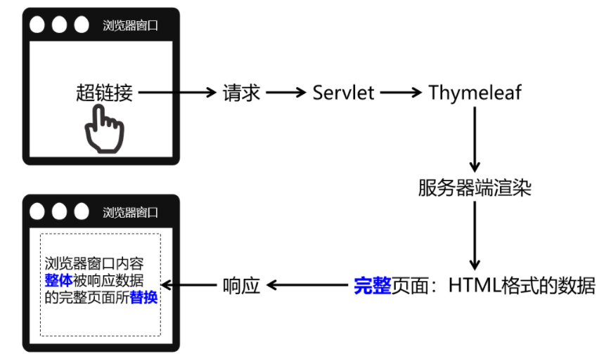
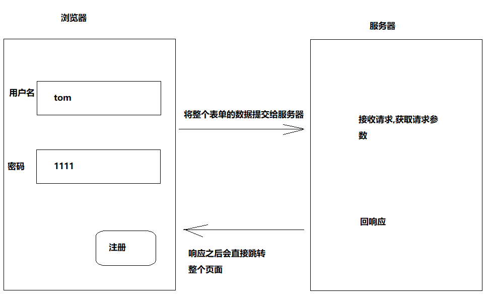
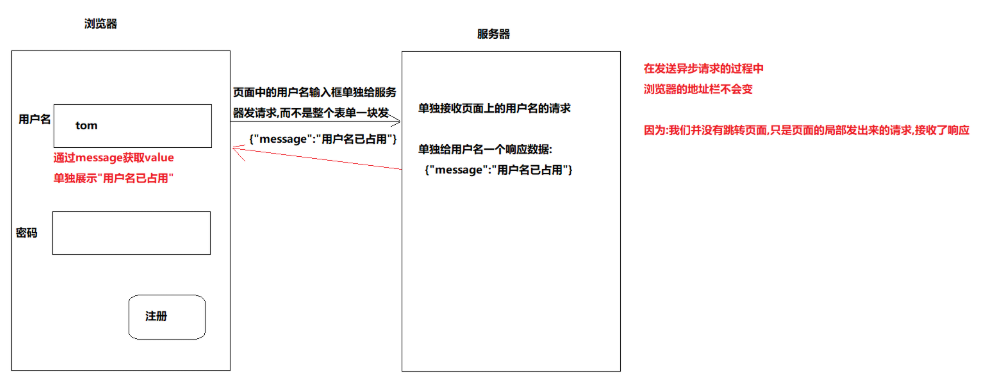
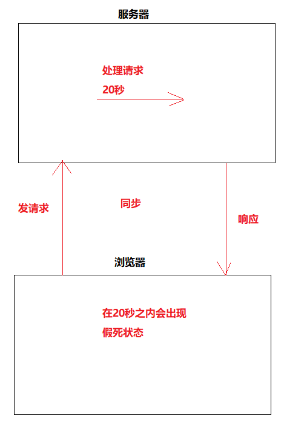
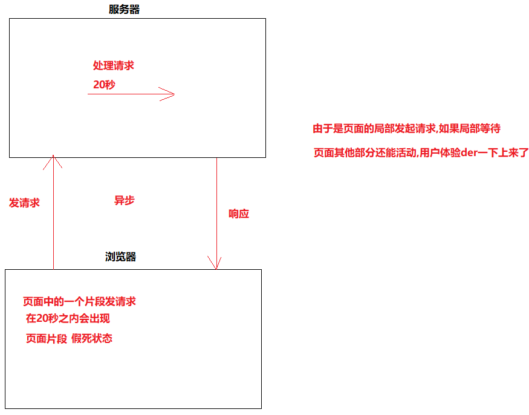

#  day08_快递管理

```java 
课前回顾:
  1.jsp:动态页面技术,本质是一个servlet
    a.作用:将服务端响应回来的数据,动态展示在页面上
    b.EL表达式:
      ${存在在域中的key}  -> 根据key获取域中的value
    c.JSTL表达式: -> 要引入两个jar包 -> 在页面上引入标签库(c标签)
    d.JSTL表达式->c:if
      属性:test="条件"
    e.JSTL表达式-> c:foreach
      属性:items="${写域中存储的key}"
          var="接收元素的变量"
      后续想取值就直接用这个var中取的变量名去点
  2.过滤器:Filter
    a.作用:过滤请求的,浏览器往服务器端发送请求访问某个资源的时候,先走过滤器
    b.实现:
      定义一个类实现Filter接口或者继承HttpFilter类
      重写doFilter方法 -> 是否对过来的请求放行
          
      实现Filter接口 -> 重写的doFilter参数是ServletRequest,ServletResponse-> 不能直接调用getSession方法获取Session
      继承HttpFilter类 -> 重写的doFilter参数是HttpServletRequest,HttpServletResponse ->能直接调用getSession方法获取Session  
          
    c.四种匹配方式:
      精准匹配
      目录匹配 -> 将同样的请求分组
      后缀名匹配
      servlet-name匹配
          
    d.web.xml配置过滤器 -> 先配置的哪个过滤器,就先走哪个过滤器  
    e.注解方式实现过滤器:
      @WebFilter("web资源的路径")
```

```java
今日重点:
  1.分清楚同步和异步
  2.完成快递管理->添加   删除   修改    
```

# 第一章.Listener监听器(了解)

## 1.Listener监听器介绍

```java
1.监听器：专门用于对其他对象身上发生的事件或状态改变进行监听和相应处理的对象，当被监视的对象发生情况时，立即采取相应的行动。

2.Servlet监听器:Servlet规范中定义的一种特殊类，它用于监听Web应用程序中的ServletContext，HttpSession 和HttpServletRequest等域对象的创建与销毁事件，以及监听这些域对象中的属性发生修改的事件。
    
3.监听器作用:主要是监听域对象的,比如监听域对象的创建,销毁,以及属性的改变等
    
4.过滤器和监听器区别:
  过滤器:过滤的是请求
  监听器:监听的是域对象的状态
```

## 2.监听器分类(了解即可)

### 2.1.ServletContextListener

```java
作用：监听ServletContext对象的创建与销毁
```

| 方法名                                      | 作用                     |
| ------------------------------------------- | ------------------------ |
| contextInitialized(ServletContextEvent sce) | ServletContext创建时调用 |
| contextDestroyed(ServletContextEvent sce)   | ServletContext销毁时调用 |

```java
ServletContextEvent对象代表从ServletContext对象身上捕获到的事件，通过这个事件对象我们可以获取到ServletContext对象。
```

### 2.2.HttpSessionListener

```java
作用：监听HttpSession对象的创建与销毁
```

| 方法名                                 | 作用                      |
| -------------------------------------- | ------------------------- |
| sessionCreated(HttpSessionEvent hse)   | HttpSession对象创建时调用 |
| sessionDestroyed(HttpSessionEvent hse) | HttpSession对象销毁时调用 |

```java
HttpSessionEvent对象代表从HttpSession对象身上捕获到的事件，通过这个事件对象我们可以获取到触发事件的HttpSession对象。
```

### 2.3.ServletRequestListener

```java
作用：监听ServletRequest对象的创建与销毁
```

| 方法名                                      | 作用                         |
| ------------------------------------------- | ---------------------------- |
| requestInitialized(ServletRequestEvent sre) | ServletRequest对象创建时调用 |
| requestDestroyed(ServletRequestEvent sre)   | ServletRequest对象销毁时调用 |

```java
ServletRequestEvent对象代表从HttpServletRequest对象身上捕获到的事件，通过这个事件对象我们可以获取到触发事件的HttpServletRequest对象。另外还有一个方法可以获取到当前Web应用的ServletContext对象。
```

###    2.4.ServletContextAttributeListener

```java
作用：监听ServletContext中属性的添加、移除和修改
```

| 方法名                                               | 作用                                 |
| ---------------------------------------------------- | ------------------------------------ |
| attributeAdded(ServletContextAttributeEvent scab)    | 向ServletContext中添加属性时调用     |
| attributeRemoved(ServletContextAttributeEvent scab)  | 从ServletContext中移除属性时调用     |
| attributeReplaced(ServletContextAttributeEvent scab) | 当ServletContext中的属性被修改时调用 |

```java
ServletContextAttributeEvent对象代表属性变化事件，它包含的方法如下：
```

| 方法名              | 作用                     |
| ------------------- | ------------------------ |
| getName()           | 获取修改或添加的属性名   |
| getValue()          | 获取被修改或添加的属性值 |
| getServletContext() | 获取ServletContext对象   |

### 2.5.HttpSessionAttributeListener

```java
作用：监听HttpSession中属性的添加、移除和修改
```

| 方法名                                        | 作用                              |
| --------------------------------------------- | --------------------------------- |
| attributeAdded(HttpSessionBindingEvent se)    | 向HttpSession中添加属性时调用     |
| attributeRemoved(HttpSessionBindingEvent se)  | 从HttpSession中移除属性时调用     |
| attributeReplaced(HttpSessionBindingEvent se) | 当HttpSession中的属性被修改时调用 |

```java
HttpSessionBindingEvent对象代表属性变化事件，它包含的方法如下：
```

| 方法名       | 作用                          |
| ------------ | ----------------------------- |
| getName()    | 获取修改或添加的属性名        |
| getValue()   | 获取被修改或添加的属性值      |
| getSession() | 获取触发事件的HttpSession对象 |

### 2.6.ServletRequestAttributeListener

```java
作用：监听ServletRequest中属性的添加、移除和修改
```

| 方法名                                               | 作用                                 |
| ---------------------------------------------------- | ------------------------------------ |
| attributeAdded(ServletRequestAttributeEvent srae)    | 向ServletRequest中添加属性时调用     |
| attributeRemoved(ServletRequestAttributeEvent srae)  | 从ServletRequest中移除属性时调用     |
| attributeReplaced(ServletRequestAttributeEvent srae) | 当ServletRequest中的属性被修改时调用 |

```java
ServletRequestAttributeEvent对象代表属性变化事件，它包含的方法如下：
```

| 方法名               | 作用                             |
| -------------------- | -------------------------------- |
| getName()            | 获取修改或添加的属性名           |
| getValue()           | 获取被修改或添加的属性值         |
| getServletRequest () | 获取触发事件的ServletRequest对象 |

### 2.7. HttpSessionBindingListener

```java
作用：监听某个对象在Session域中的创建与移除
```

| 方法名                                      | 作用                              |
| ------------------------------------------- | --------------------------------- |
| valueBound(HttpSessionBindingEvent event)   | 该类的实例被放到Session域中时调用 |
| valueUnbound(HttpSessionBindingEvent event) | 该类的实例从Session中移除时调用   |

```java
HttpSessionBindingEvent对象代表属性变化事件，它包含的方法如下：
```

| 方法名       | 作用                          |
| ------------ | ----------------------------- |
| getName()    | 获取当前事件涉及的属性名      |
| getValue()   | 获取当前事件涉及的属性值      |
| getSession() | 获取触发事件的HttpSession对象 |

### 2.8.HttpSessionActivationListener

```java
作用：监听某个对象在Session中的序列化(钝化)与反序列化(活化)。
```

| 方法名                                    | 作用                                            |
| ----------------------------------------- | ----------------------------------------------- |
| sessionWillPassivate(HttpSessionEvent se) | 该类实例和Session一起钝化到硬盘时调用(序列化)   |
| sessionDidActivate(HttpSessionEvent se)   | 该类实例和Session一起活化到内存时调用(反序列化) |

```java
HttpSessionEvent对象代表事件对象，通过getSession()方法获取事件涉及的HttpSession对象。
```

## 3.ServletContextListener的使用

```java
1.介绍:ServletContextListener是监听ServletContext对象的创建和销毁的，因为ServletContext对象是在服务器启动的时候创建、在服务器关闭的时候销毁，所以ServletContextListener也可以监听服务器的启动和关闭
    
2.使用场景:
  将来学习SpringMVC的时候，会用到一个ContextLoaderListener，这个监听器就实现了ServletContextListener接口，表示对ServletContext对象本身的生命周期进行监控。
```

### 3.1.代码演示

```java
编写监听器的步骤:
1. 写一个类实现对应的：Listener的接口(我们这里使用的是ServletContextListener),并且实现它里面的方法
   1.1 contextInitialized()这个方法在ServletContext对象被创建出来的时候执行，也就是说在服务器启动的时候执行
   1.2 contextDestroyed()这个方法会在ServletContext对象被销毁的时候执行，也就是说在服务器关闭的时候执行
   
2.在web.xml中注册(配置)监听器
```

```java
public class Listener1 implements ServletContextListener {
    @Override
    public void contextInitialized(ServletContextEvent servletContextEvent) {
        System.out.println("servletContext创建了");
    }

    @Override
    public void contextDestroyed(ServletContextEvent servletContextEvent) {
        System.out.println("servletContext销毁了");
    }
}
```

```xml
    <!--
      配置监听器
    -->
    <listener>
        <listener-class>com.atguigu.c_listener.Listener1</listener-class>
    </listener>
```

# 第二章.ajax异步请求

## 1.服务器端渲染_同步请求






## 2.Ajax异步渲染_异步请求(局部更新)




```java
Ajax程序发出的请求,页面中的一部分发出的请求给对应的一个Servlet,Servlet将一个数据片段响应给浏览器
    
所以异步请求的效率要高于同步的
```

## 3.前后端分离项目

```java
1.将来我们的项目都是前后端分离,前端部署到一个服务器,后端部署到一个服务器,此时前端和后端的数据交互,主要的数据格式,就是json数据格式
```

## 4.同步和异步

### 4.1.Ajax介绍

```java
   Ajax本身就是Asynchronous JavaScript And XML的缩写，直译为：异步的[JavaScript]和[XML]。在实际应用中Ajax指的是不刷新浏览器窗口,不做页面跳转,局部更新页面内容的技术。  
    
   以前ajax的数据放到xml中,现在都是json数据格式存放了  {"username":"root","password":"1234"}
```

### 4.2.同步和异步区别

```java
1.同步:多个操作按顺序执行,前面的操作没有完成,后面的操作必须等待
2.异步:多个操作相继并发执行,即使开始的先后顺序不同,但是由于他们各自在自己独立的进程或者线程中完成,所以互不干扰
```




  

#  第三章.快递管理-第六期

## 1.新增快递记录

### 1.1.修改list.jsp页面，给添加快递指定后台地址

``` html
 <div id="urHere">快递管理系统<b>></b><strong>快递列表</strong> </div>
    <div class="mainBox"
        style="height:auto!important;height:550px;min-height:550px;">
             <h3><a href="/delivery_system/delivery/toadd"
                   class="actionBtn add">添加快递</a>快递列表</h3>
```

### 1.2.编写跳转添加快递页面的DeliveryAddController

因为add.jsp页面的快递公司消息显示不齐全，所以我们需要先查询到完整的快递公司

```java
先点击"添加快递"按钮,跳转到添加页面,同时查询所有的快递公司展示在select下拉菜单中
```

``` java
@WebServlet("/delivery/toadd")
public class DeliveryToAddController extends HttpServlet {
    private CompanyService companyService = new CompanyServiceImpl();
    @Override
    protected void doGet(HttpServletRequest request, HttpServletResponse response) throws ServletException, IOException {
        request.setCharacterEncoding("UTF-8");
        response.setContentType("text/html;charset=UTF-8");
        try {
            List<Company> companyList = companyService.findAllCompany();
            request.setAttribute("companyList", companyList);
            request.getRequestDispatcher("/add.jsp").forward(request, response);
        } catch (SQLException e) {
            e.printStackTrace();
        }
    }
    @Override
    protected void doPost(HttpServletRequest request, HttpServletResponse response) throws ServletException, IOException {
        doGet(request,response);
    }
}

```

### 1.3.编写add.jsp进行快递公司数据展示

```html
 <select name="cat_id">
     <option value>请选择</option>
     <c:forEach items="${companyList}" var="company">
     <option value="${company.id}">${company.companyName}</option>
     </c:forEach>
 </select> 
```

### 1.4.编写添加快递的DeliveryAddController

```html
1.修改add.jsp中form表单的请求提交路径: <form action="/delivery_system/delivery/add" method="post">
    
2.修改add.jsp页面表单中所有的标签name属性->将输入框中没有name属性的加上name属性
3.在add.jsp给state收货状态添加value属性值
    
  <form action="/delivery_system/delivery/add" method="post">
                <table width="100%" border="0" cellpadding="8"
                       cellspacing="0" class="tableBasic">
                    <tr>
                        <td width="100" align="right">收件人</td>
                        <td>
                            <input type="text" name="deliveryName"
                                   size="40" class="inpMain"/>
                        </td>
                    </tr>
                    <tr>
                        <td width="100" align="right">快递公司</td>
                        <td>
                            <select name="companyId">
                                <option value>请选择</option>
                                <c:forEach items="${companyList}" var="company">
                                    <option value="${company.id}">${company.companyName}</option>
                                </c:forEach>

                            </select>
                        </td>
                    </tr>
                    <tr>
                        <td width="100" align="right">手机号</td>
                        <td>
                            <input type="text" size="40" name="phone"
                                   class="inpMain" />
                        </td>
                    </tr>
                    <tr>
                        <td align="right">收货地址</td>
                        <td>
                            <input type="text" size="40" name="address"
                                   class="inpMain"/>
                        </td>
                    </tr>
                    <tr>
                        <td align="right">收货日期</td>
                        <td>
                            <input type="text" name="date" size="40" name="sendTime"
                                   class="inpMain"
                                   placeholder="yyyy-MM-dd"/>
                        </td>
                    </tr>
                    <tr>
                        <td align="right">收货状态</td>
                        <td>
                            <input type="radio" name="state" size="40" value="1"
                                   checked/> 已签收
                            <input type="radio" name="state" size="40" value="0"/>
                            未签收
                        </td>
                    </tr>
                    <tr>
                        <td></td>
                        <td>
                            <!-- <input type="hidden" name="token"
                                value="5a58b748" /> -->
                            <input type="submit" name="submit"
                                   class="btn" value="提交"/>
                        </td>
                    </tr>
                </table>
            </form>  
```

``` java
@WebServlet("/delivery/add")
public class DeliveryAddController extends HttpServlet {
    private DeliveryService deliveryService = new DeliveryServiceImpl();
    @Override
    protected void doGet(HttpServletRequest req, HttpServletResponse resp) throws ServletException, IOException {
        //1.解决相应和请求乱码
        req.setCharacterEncoding("UTF-8");
        resp.setContentType("text/html;charset=UTF-8");
        /*
          2.将当前登录的用户id获取出来
            因为添加记录的时候我们要知道是谁添加的
         */
        SysUser sysUser = (SysUser) req.getSession().getAttribute("user");
        Integer uid = sysUser.getId();
        //3.获取请求参数
        Map<String, String[]> map = req.getParameterMap();
        /*Set<Map.Entry<String, String[]>> set = map.entrySet();
        for (Map.Entry<String, String[]> entry : set) {
            System.out.println(entry.getKey()+":"+ Arrays.toString(entry.getValue()));
        }*/
        //4.将userid和页面提交过来的参数传递到service层
        deliveryService.addDelivery(uid,map);
        //5.重定向重新给查询快递信息功能发请求,重新查询
        resp.sendRedirect(req.getContextPath()+"/deliverylist/list");
    }

    @Override
    protected void doPost(HttpServletRequest req, HttpServletResponse resp) throws ServletException, IOException {
        doGet(req, resp);
    }
}
```

### 1.5.编写添加快递的Service层

``` java
public interface DeliveryService 
    /**
     * 根据用户id查询所有快递信息
     * @param userId
     * @return
     */
    List<Delivery> findAllDeliveryByUserId(Integer userId) throws SQLException;

    /**
     * 添加快递信息
     * @param uid
     * @param map
     */
    void addDelivery(Integer uid, Map<String, String[]> map) throws SQLException;
}

```

```java
public class DeliveryServiceImpl implements DeliveryService {
    private DeliveryDao deliveryDao = new DeliveryDaoImpl();
    private CompanyService companyService = new CompanyServiceImpl();
    /**
     * 根据用户id查询所有快递信息
     * @param userId
     * @return
     */
    @Override
    public List<Delivery> findAllDeliveryByUserId(Integer userId) throws SQLException {
        List<Delivery> deliverylist = deliveryDao.findAllDeliveryByUserId(userId);
        List<Company> allCompany = companyService.findAllCompany();

        //将Company对象放到map集合中,方便直接往deliveryList集合中封装
        HashMap<Integer, Company> map = new HashMap<>();
        allCompany.forEach(company -> {map.put(company.getId(), company);});

        //根据delivery中封装的快递公司id从map中获取对应的快递公司对象,然后封装到delivery对象中
        deliverylist.forEach(delivery -> {delivery.setCompany(map.get(delivery.getCompanyId()));});
        return deliverylist;
    }

    /**
     * 添加快递信息
     * @param uid
     * @param map
     */
    @Override
    public void addDelivery(Integer uid, Map<String, String[]> map) throws SQLException {
        deliveryDao.addDelivery(uid,map);
    }
}

```

### 1.6.编写添加快递的DeliveryDao

``` java
public interface DeliveryDao {
    /**
     * 根据用户id查询所有快递信息
     * @param userId
     * @return
     */
    List<Delivery> findAllDeliveryByUserId(Integer userId) throws SQLException;

    /**
     * 添加快递信息
     * @param uid
     * @param map
     */
    void addDelivery(Integer uid, Map<String, String[]> map) throws SQLException;
}
```

```java
public class DeliveryDaoImpl implements DeliveryDao {
    private QueryRunner qr = new QueryRunner(DruidUtils.getDataSource());

    /**
     * 根据用户id查询所有快递信息
     *
     * @param userId
     * @return private Integer id;
     * private String deliveryName;
     * private Integer userId;
     * private Integer companyId;
     * private String phone;
     * private String address;
     * private String sendTime;
     * private Integer state;
     * <p>
     * id INT AUTO_INCREMENT PRIMARY KEY,
     * delivery_name VARCHAR(10) COMMENT '收件人姓名',
     * user_id INT COMMENT '关联用户id',
     * company_id INT COMMENT '关联公司id',
     * phone VARCHAR(11) COMMENT '手机号',
     * address VARCHAR(100) COMMENT '收获地址',
     * send_time VARCHAR(20) COMMENT '送达日期',
     * state INT DEFAULT 0 COMMENT '签收状态 0 未签收 1已签收'
     */
    @Override
    public List<Delivery> findAllDeliveryByUserId(Integer userId) throws SQLException {
        String sql = "select id id,delivery_name deliveryName,user_id userId,company_id companyId,phone phone,address address,send_time sendTime,state state from sys_delivery where user_id = ?";
        List<Delivery> list = qr.query(sql, new BeanListHandler<Delivery>(Delivery.class), userId);
        return list;
    }

    /**
     * 添加快递信息
     * @param uid
     * @param map
     */
    @Override
    public void addDelivery(Integer uid, Map<String, String[]> map) throws SQLException {
        String sql = "insert into sys_delivery values (null,?,?,?,?,?,?,?)";
        qr.update(sql,map.get("deliveryName")[0],uid,map.get("companyId")[0],map.get("phone")[0],map.get("address")[0],map.get("sendTime")[0],map.get("state")[0]);
    }
}
```

## 2.删除快递记录

```java
修改删除按钮（list.jsp）
```

``` html
 <c:forEach items="${deliveries}" var="delivery" >
                          <tr>
                              <td align="center">${delivery.id}</td>
                              <td>${delivery.company.companyName}</td>
                              <td align="center">${delivery.deliveryName}</td>
                              <td align="center">${delivery.phone}</td>
                              <td align="center">${delivery.sendTime}</td>
                              <td align="center">${delivery.address}</td>
                              <td align="center">${delivery.state == 0 ?'未签收':'已签收'}</td>
                              <td align="center">
                                  <a href="#">编辑</a> | <a href="<a href="/delivery_system/delivery/delete?id=${delivery.id}">删除</a>" >删除</a>
                              </td>
                          </tr>
                      </c:forEach>
                  </table>
              </div>
              <div class="clear"></div>
          </div>
      </div>
      <div class="clear"></div>
      <div id="dcFooter">
          <div id="footer">
              <div class="line"></div>
              <ul>
                  版权所有 © 2024-2025 尚硅谷教育，并保留所有权利。
              </ul>
          </div>
      </div><!-- dcFooter 结束 -->
      <div class="clear"></div> </div>  
```

### 2.1.编写删除快递的Controller层

``` java
@WebServlet("/delivery/delete")
public class DeliveryDeleteController extends HttpServlet {
    private DeliveryService deliveryService = new DeliveryServiceImpl();
    @Override
    protected void doGet(HttpServletRequest req, HttpServletResponse resp) throws ServletException, IOException {
        //1.解决相应和请求乱码
        req.setCharacterEncoding("UTF-8");
        resp.setContentType("text/html;charset=UTF-8");
        try {
            //2.获取请求中发送过来的被删除的快递信息id
            String id = req.getParameter("id");
            System.out.println(id);
            //3.将id传递到service层
            deliveryService.deleteDeliveryById(id);
            //4.重定向到list.jsp,重新发请求,重新查询快递信息
            resp.sendRedirect(req.getContextPath()+"/deliverylist/list");
        } catch (SQLException e) {
            e.printStackTrace();
        }
    }

    @Override
    protected void doPost(HttpServletRequest req, HttpServletResponse resp) throws ServletException, IOException {
        doGet(req, resp);
    }
}

```

### 2.2.编写删除快递的Service层

``` java
public interface DeliveryService {
    /**
     * 根据用户id查询所有快递信息
     * @param userId
     * @return
     */
    List<Delivery> findAllDeliveryByUserId(Integer userId) throws SQLException;

    /**
     * 添加快递信息
     * @param uid
     * @param map
     */
    void addDelivery(Integer uid, Map<String, String[]> map) throws SQLException;

    /**
     * 根据id删除快递信息
     * @param id
     */
    void deleteDeliveryById(String id) throws SQLException;
}
```

```java
public class DeliveryServiceImpl implements DeliveryService {
    private DeliveryDao deliveryDao = new DeliveryDaoImpl();
    private CompanyService companyService = new CompanyServiceImpl();
    /**
     * 根据用户id查询所有快递信息
     * @param userId
     * @return
     */
    @Override
    public List<Delivery> findAllDeliveryByUserId(Integer userId) throws SQLException {
        List<Delivery> deliverylist = deliveryDao.findAllDeliveryByUserId(userId);
        List<Company> allCompany = companyService.findAllCompany();

        //将Company对象放到map集合中,方便直接往deliveryList集合中封装
        HashMap<Integer, Company> map = new HashMap<>();
        allCompany.forEach(company -> {map.put(company.getId(), company);});

        //根据delivery中封装的快递公司id从map中获取对应的快递公司对象,然后封装到delivery对象中
        deliverylist.forEach(delivery -> {delivery.setCompany(map.get(delivery.getCompanyId()));});
        return deliverylist;
    }

    /**
     * 添加快递信息
     * @param uid
     * @param map
     */
    @Override
    public void addDelivery(Integer uid, Map<String, String[]> map) throws SQLException {
        deliveryDao.addDelivery(uid,map);
    }

    /**
     * 根据id删除快递信息
     * @param id
     */
    @Override
    public void deleteDeliveryById(String id) throws SQLException {
        deliveryDao.deleteDeliveryById(id);
    }
}

```

### 2.3.编写删除快递的Dao层

```java

public interface DeliveryDao {
    /**
     * 根据用户id查询所有快递信息
     * @param userId
     * @return
     */
    List<Delivery> findAllDeliveryByUserId(Integer userId) throws SQLException;

    /**
     * 添加快递信息
     * @param uid
     * @param map
     */
    void addDelivery(Integer uid, Map<String, String[]> map) throws SQLException;

    /**
     * 根据id删除快递信息
     * @param id
     */
    void deleteDeliveryById(String id) throws SQLException;
}

```

``` java
public class DeliveryDaoImpl implements DeliveryDao {
    private QueryRunner qr = new QueryRunner(DruidUtils.getDataSource());

    @Override
    public List<Delivery> findAllDeliveryByUserId(Integer userId) throws SQLException {
        String sql = "select id id,delivery_name deliveryName,user_id userId,company_id companyId,phone phone,address address,send_time sendTime,state state from sys_delivery where user_id = ?";
        List<Delivery> list = qr.query(sql, new BeanListHandler<Delivery>(Delivery.class), userId);
        return list;
    }

    /**
     * 添加快递信息
     * @param uid
     * @param map
     */
    @Override
    public void addDelivery(Integer uid, Map<String, String[]> map) throws SQLException {
        String sql = "insert into sys_delivery values (null,?,?,?,?,?,?,?)";
        qr.update(sql,map.get("deliveryName")[0],uid,map.get("companyId")[0],map.get("phone")[0],map.get("address")[0],map.get("sendTime")[0],map.get("state")[0]);
    }

    /**
     * 根据id删除快递信息
     * @param id
     */
    @Override
    public void deleteDeliveryById(String id) throws SQLException {
        String sql = "  from sys_delivery where id = ?";
        qr.update(sql,id);
    }
}
```

> 找到平西王府->往里走 ->街面上 -> 义乌小商品对面有一个一间半屋子的"安徽正宗牛肉板面"

## 3.更新快递记录

### 3.1.修改list.jap中"编辑"的按钮超链接请求

```html
 <a href="/delivery_system/delivery/toUpdatePage?id=${delivery.id}">编辑</a>
```

### 3.2.编写回显快递信息的Controller

``` java
@WebServlet("/delivery/toUpdatePage")
public class DeliveryToEditController extends HttpServlet {
    private DeliveryService deliveryService = new DeliveryServiceImpl();
    @Override
    protected void doGet(HttpServletRequest req, HttpServletResponse resp) throws ServletException, IOException {
        //1.解决相应和请求乱码
        req.setCharacterEncoding("UTF-8");
        resp.setContentType("text/html;charset=UTF-8");
        try {
            //2.获取请求参数中的id
            String id = req.getParameter("id");
            //3.根据id查询对应被修改的快递信息
            Map<String, Object> map = deliveryService.findDeliveryById(id);
            //4.将查询出来的快递信息对象存放到请求域中
            req.setAttribute("map", map);
            //5.请求转发到edit.jsp页面上
            req.getRequestDispatcher("/edit.jsp").forward(req, resp);
        } catch (SQLException e) {
            e.printStackTrace();
        }

    }

    @Override
    protected void doPost(HttpServletRequest req, HttpServletResponse resp) throws ServletException, IOException {
        doGet(req, resp);
    }
}

```

### 3.3.编写回显详情的Service

``` java
public interface DeliveryService {
    /**
     * 根据用户id查询所有快递信息
     * @param userId
     * @return
     */
    List<Delivery> findAllDeliveryByUserId(Integer userId) throws SQLException;

    /**
     * 添加快递信息
     * @param uid
     * @param map
     */
    void addDelivery(Integer uid, Map<String, String[]> map) throws SQLException;

    /**
     * 根据id删除快递信息
     * @param id
     */
    void deleteDeliveryById(String id) throws SQLException;

    /**
     * 根据id查询快递信息,便于修改时回显
     * @param id
     * @return
     */
    Map<String, Object> findDeliveryById(String id) throws SQLException;
}
```

```java
public class DeliveryServiceImpl implements DeliveryService {
    private DeliveryDao deliveryDao = new DeliveryDaoImpl();
    private CompanyService companyService = new CompanyServiceImpl();
    /**
     * 根据用户id查询所有快递信息
     * @param userId
     * @return
     */
    @Override
    public List<Delivery> findAllDeliveryByUserId(Integer userId) throws SQLException {
        List<Delivery> deliverylist = deliveryDao.findAllDeliveryByUserId(userId);
        List<Company> allCompany = companyService.findAllCompany();

        //将Company对象放到map集合中,方便直接往deliveryList集合中封装
        HashMap<Integer, Company> map = new HashMap<>();
        allCompany.forEach(company -> {map.put(company.getId(), company);});

        //根据delivery中封装的快递公司id从map中获取对应的快递公司对象,然后封装到delivery对象中
        deliverylist.forEach(delivery -> {delivery.setCompany(map.get(delivery.getCompanyId()));});
        return deliverylist;
    }

    /**
     * 添加快递信息
     * @param uid
     * @param map
     */
    @Override
    public void addDelivery(Integer uid, Map<String, String[]> map) throws SQLException {
        deliveryDao.addDelivery(uid,map);
    }

    /**
     * 根据id删除快递信息
     * @param id
     */
    @Override
    public void deleteDeliveryById(String id) throws SQLException {
        deliveryDao.deleteDeliveryById(id);
    }

    /**
     * 根据id查询快递信息,便于回显
     * @param id
     * @return
     */
    @Override
    public Map<String, Object> findDeliveryById(String id) throws SQLException {
        //由于修改页面中快递公司是下拉菜单,所以需要先查所有的快递公司
        List<Company> companyList = companyService.findAllCompany();
        Delivery delivery = deliveryDao.findDeliveryById(id);

        Map<String, Object> map = new HashMap<>();
        map.put("companyList", companyList);
        map.put("delivery",delivery);
        return map;
    }
}
```

### 3.4.编写回显详情的Dao

```java
public interface DeliveryDao {
    /**
     * 根据用户id查询所有快递信息
     * @param userId
     * @return
     */
    List<Delivery> findAllDeliveryByUserId(Integer userId) throws SQLException;

    /**
     * 添加快递信息
     * @param uid
     * @param map
     */
    void addDelivery(Integer uid, Map<String, String[]> map) throws SQLException;

    /**
     * 根据id删除快递信息
     * @param id
     */
    void deleteDeliveryById(String id) throws SQLException;

    /**
     * 根据id查询快递信息,便于回显
     * @param id
     * @return
     */
    Delivery findDeliveryById(String id) throws SQLException;
}

```

```java
public class DeliveryDaoImpl implements DeliveryDao {
    private QueryRunner qr = new QueryRunner(DruidUtils.getDataSource());
    @Override
    public List<Delivery> findAllDeliveryByUserId(Integer userId) throws SQLException {
        String sql = "select id id,delivery_name deliveryName,user_id userId,company_id companyId,phone phone,address address,send_time sendTime,state state from sys_delivery where user_id = ?";
        List<Delivery> list = qr.query(sql, new BeanListHandler<Delivery>(Delivery.class), userId);
        return list;
    }

    /**
     * 添加快递信息
     * @param uid
     * @param map
     */
    @Override
    public void addDelivery(Integer uid, Map<String, String[]> map) throws SQLException {
        String sql = "insert into sys_delivery values (null,?,?,?,?,?,?,?)";
        qr.update(sql,map.get("deliveryName")[0],uid,map.get("companyId")[0],map.get("phone")[0],map.get("address")[0],map.get("sendTime")[0],map.get("state")[0]);
    }

    /**
     * 根据id删除快递信息
     * @param id
     */
    @Override
    public void deleteDeliveryById(String id) throws SQLException {
        String sql = "delete from sys_delivery where id = ?";
        qr.update(sql,id);
    }

    /**
     * 根据id查询快递信息,便于回显
     * @param id
     * @return
     */
    @Override
    public Delivery findDeliveryById(String id) throws SQLException {
        String sql = "select id id,delivery_name deliveryName,user_id userId,company_id companyId,phone phone,address address,send_time sendTime,state state from sys_delivery where id = ?";
        Delivery delivery = qr.query(sql, new BeanHandler<Delivery>(Delivery.class), id);
        return delivery;
    }
}
```

### 3.5.回显页面调整edit.jsp

```html
<!DOCTYPE html PUBLIC "-//W3C//DTD HTML 4.01 Transitional//EN" "http://www.w3.org/TR/html4/loose.dtd">
<%@ page contentType="text/html;charset=UTF-8" language="java" %>
<%@ taglib prefix="c" uri="http://java.sun.com/jsp/jstl/core" %>
<head>
    <jsp:include page="resouces.jsp"/>
</head>
<body>
<div id="dcWrap">
<div id="dcHead">
    <jsp:include page="head.jsp"/>
</div>
<!-- dcHead 结束 -->
<div id="dcLeft">
    <jsp:include page="menu.jsp"/>
</div>
<div id="dcMain">
<!-- 当前位置 -->
<div id="urHere">快递管理系统<b>></b><strong>编辑快递</strong></div>
<div
id="manager" class="mainBox"
style="height:auto!important;height:550px;min-height:550px;">
<h3><a href="index.jsp" class="actionBtn">返回首页</a>编辑快递</h3>

<form action="#" method="post">
<!-- 修改的参照id-->
<input type="hidden" name="id" value="xx"/>
<table width="100%" border="0" cellpadding="8" cellspacing="0"
class="tableBasic">
<tr>
    <td width="100" align="right">收件人</td>
    <td>
        <input type="text" name="deliveryName" size="40"
               class="inpMain" value="${map.delivery.deliveryName}"/>
    </td>
</tr>
<tr>
<td width="100" align="right">快递公司</td>
<td>
<select name="companyId">
<option value>请选择</option>
<c:forEach items="${map.companyList}" var="company">
    <option value="${company.id}">${company.companyName}</option>
</c:forEach>
    </select>
    </td>
    </tr>
    <tr>
    <td width="100" align="right">手机号</td>
    <td>
    <input type="text" size="40" class="inpMain" name="phone" value="${map.delivery.phone}"/>
    </td>
    </tr>
    <tr>
    <td align="right">收货地址</td>
    <td>
    <input type="text" name="address" value="${map.delivery.address}" size="40"
    class="inpMain" />
    </td>
    </tr>
    <tr>
    <td align="right">收货日期</td>
    <td>
    <input type="text" name="sendTime" value="${map.delivery.sendTime}" size="40" class="inpMain"
    placeholder="yyyy-MM-dd" />
    </td>
    </tr>
    <tr>
    <td align="right">收货状态</td>
    <td>
    <input type="radio" name="state" value="1" ${map.delivery.state==1?'checked':''} size="40" /> 已签收
    <input type="radio" name="state" value="0" ${map.delivery.state==0?'checked':''} size="40" /> 未签收
    </td>
    </tr>
    <tr>
    <td></td>
    <td>
    <input type="submit" name="submit" class="btn" value="提交" />
    </td>
    </tr>
    </table>
    </form>
    </div>
    </div>
    <div class="clear"></div>
    <div id="dcFooter">
    <div id="footer">
    <div class="line"></div>
    <ul>
    版权所有 © 2024-2025 尚硅谷教育，并保留所有权利。
    </ul>
    </div>
    </div><!-- dcFooter 结束 -->
    <div class="clear"></div> </div>
    </body>
    </html>
```

### 3.6.编写修改快递信息的Controller

```java
1.修改edit.jsp中隐藏的input标签:
  <input type="hidden" name="id" value="${map.delivery.id}"/>
2.修改edit.jsp中form表单提交路径:
  <form action="/delivery_system/delivery/update" method="post">
```

```java
@WebServlet("/delivery/update")
public class DeliveryUpdateController extends HttpServlet {
    private DeliveryService deliveryService = new DeliveryServiceImpl();
    @Override
    protected void doGet(HttpServletRequest req, HttpServletResponse resp) throws ServletException, IOException {
        //1.解决相应和请求乱码
        req.setCharacterEncoding("UTF-8");
        resp.setContentType("text/html;charset=UTF-8");
        try {
            //获取当前登录的用户id
            SysUser sysUser = (SysUser) req.getSession().getAttribute("user");
            Integer uid = sysUser.getId();
            System.out.println(uid);
            //2.获取请求参数
            Map<String, String[]> map = req.getParameterMap();
            Set<Map.Entry<String, String[]>> set = map.entrySet();
            for (Map.Entry<String, String[]> entry : set) {
                System.out.println(entry.getKey()+":"+ Arrays.toString(entry.getValue()));
            }
            deliveryService.updateDeliveryById(uid,map);
            resp.sendRedirect(req.getContextPath()+"/deliverylist/list");
        } catch (Exception e) {
            e.printStackTrace();
        }
    }

    @Override
    protected void doPost(HttpServletRequest req, HttpServletResponse resp) throws ServletException, IOException {
        doGet(req, resp);
    }
}

```

### 3.7.编写修改快递信息的Service

```java
public interface DeliveryService {
    /**
     * 根据用户id查询所有快递信息
     * @param userId
     * @return
     */
    List<Delivery> findAllDeliveryByUserId(Integer userId) throws SQLException;

    /**
     * 添加快递信息
     * @param uid
     * @param map
     */
    void addDelivery(Integer uid, Map<String, String[]> map) throws SQLException;

    /**
     * 根据id删除快递信息
     * @param id
     */
    void deleteDeliveryById(String id) throws SQLException;

    /**
     * 根据id查询快递信息,便于修改时回显
     * @param id
     * @return
     */
    Map<String, Object> findDeliveryById(String id) throws SQLException;

    /**
     * 根据id修改快递信息
     * @param map
     */
    void updateDeliveryById(Integer uid,Map<String, String[]> map) throws SQLException;
}

```

```java
public class DeliveryServiceImpl implements DeliveryService {
    private DeliveryDao deliveryDao = new DeliveryDaoImpl();
    private CompanyService companyService = new CompanyServiceImpl();
    /**
     * 根据用户id查询所有快递信息
     * @param userId
     * @return
     */
    @Override
    public List<Delivery> findAllDeliveryByUserId(Integer userId) throws SQLException {
        List<Delivery> deliverylist = deliveryDao.findAllDeliveryByUserId(userId);
        List<Company> allCompany = companyService.findAllCompany();

        //将Company对象放到map集合中,方便直接往deliveryList集合中封装
        HashMap<Integer, Company> map = new HashMap<>();
        allCompany.forEach(company -> {map.put(company.getId(), company);});

        //根据delivery中封装的快递公司id从map中获取对应的快递公司对象,然后封装到delivery对象中
        deliverylist.forEach(delivery -> {delivery.setCompany(map.get(delivery.getCompanyId()));});
        return deliverylist;
    }

    /**
     * 添加快递信息
     * @param uid
     * @param map
     */
    @Override
    public void addDelivery(Integer uid, Map<String, String[]> map) throws SQLException {
        deliveryDao.addDelivery(uid,map);
    }

    /**
     * 根据id删除快递信息
     * @param id
     */
    @Override
    public void deleteDeliveryById(String id) throws SQLException {
        deliveryDao.deleteDeliveryById(id);
    }

    /**
     * 根据id查询快递信息,便于回显
     * @param id
     * @return
     */
    @Override
    public Map<String, Object> findDeliveryById(String id) throws SQLException {
        //由于修改页面中快递公司是下拉菜单,所以需要先查所有的快递公司
        List<Company> companyList = companyService.findAllCompany();
        Delivery delivery = deliveryDao.findDeliveryById(id);

        Map<String, Object> map = new HashMap<>();
        map.put("companyList", companyList);
        map.put("delivery",delivery);
        return map;
    }

    /**
     * 根据id修改快递信息
     * @param map
     */
    @Override
    public void updateDeliveryById(Integer uid,Map<String, String[]> map) throws SQLException {
        deliveryDao.updateDeliveryById(uid,map);
    }
}

```

### 3.8.编写修改快递信息的Dao

```java
public interface DeliveryDao {
    /**
     * 根据用户id查询所有快递信息
     * @param userId
     * @return
     */
    List<Delivery> findAllDeliveryByUserId(Integer userId) throws SQLException;

    /**
     * 添加快递信息
     * @param uid
     * @param map
     */
    void addDelivery(Integer uid, Map<String, String[]> map) throws SQLException;

    /**
     * 根据id删除快递信息
     * @param id
     */
    void deleteDeliveryById(String id) throws SQLException;

    /**
     * 根据id查询快递信息,便于回显
     * @param id
     * @return
     */
    Delivery findDeliveryById(String id) throws SQLException;

    /**
     * 根据id修改快递信息
     * @param map
     */
    void updateDeliveryById(Integer uid,Map<String, String[]> map) throws SQLException;
}

```

```java
public class DeliveryDaoImpl implements DeliveryDao {
    private QueryRunner qr = new QueryRunner(DruidUtils.getDataSource());

    /**
     * 根据用户id查询所有快递信息
     *
     * @param userId
     * @return private Integer id;
     * private String deliveryName;
     * private Integer userId;
     * private Integer companyId;
     * private String phone;
     * private String address;
     * private String sendTime;
     * private Integer state;
     * <p>
     * id INT AUTO_INCREMENT PRIMARY KEY,
     * delivery_name VARCHAR(10) COMMENT '收件人姓名',
     * user_id INT COMMENT '关联用户id',
     * company_id INT COMMENT '关联公司id',
     * phone VARCHAR(11) COMMENT '手机号',
     * address VARCHAR(100) COMMENT '收获地址',
     * send_time VARCHAR(20) COMMENT '送达日期',
     * state INT DEFAULT 0 COMMENT '签收状态 0 未签收 1已签收'
     */
    @Override
    public List<Delivery> findAllDeliveryByUserId(Integer userId) throws SQLException {
        String sql = "select id id,delivery_name deliveryName,user_id userId,company_id companyId,phone phone,address address,send_time sendTime,state state from sys_delivery where user_id = ?";
        List<Delivery> list = qr.query(sql, new BeanListHandler<Delivery>(Delivery.class), userId);
        return list;
    }

    /**
     * 添加快递信息
     *
     * @param uid
     * @param map
     */
    @Override
    public void addDelivery(Integer uid, Map<String, String[]> map) throws SQLException {
        String sql = "insert into sys_delivery values (null,?,?,?,?,?,?,?)";
        qr.update(sql, map.get("deliveryName")[0], uid, map.get("companyId")[0], map.get("phone")[0], map.get("address")[0], map.get("sendTime")[0], map.get("state")[0]);
    }

    /**
     * 根据id删除快递信息
     *
     * @param id
     */
    @Override
    public void deleteDeliveryById(String id) throws SQLException {
        String sql = "delete from sys_delivery where id = ?";
        qr.update(sql, id);
    }

    /**
     * 根据id查询快递信息,便于回显
     *
     * @param id
     * @return
     */
    @Override
    public Delivery findDeliveryById(String id) throws SQLException {
        String sql = "select id id,delivery_name deliveryName,user_id userId,company_id companyId,phone phone,address address,send_time sendTime,state state from sys_delivery where id = ?";
        Delivery delivery = qr.query(sql, new BeanHandler<Delivery>(Delivery.class), id);
        return delivery;
    }

    /**
     * 根据id修改快递信息
     *
     * @param map
     */
    @Override
    public void updateDeliveryById(Integer uid, Map<String, String[]> map) throws SQLException {
        String sql = "update sys_delivery set delivery_name = ? , user_id = ? , company_id = ? , phone = ? , address = ? , send_time = ? , state = ? where id = ?";
        qr.update(sql, map.get("deliveryName")[0],
                uid,
                map.get("companyId")[0],
                map.get("phone")[0],
                map.get("address")[0],
                map.get("sendTime")[0],
                map.get("state")[0],
                map.get("id")[0]);

    }
}
```

