# day01_数据库基础

# 第一章.数据库介绍

## 1.数据库介绍

```java
1.概述:存储数据的仓库
2.作用:永久存储数据
3.问题:javase中数组和集合都是存储数据的容器,但是都是临时存储,所以我们要想将数据永久保存,我们可以使用IO流技术将数据保存到硬盘上,那么为啥还要学数据库呢?
      数据库的数据都是在表中存储,我们有数据库独特的sql语句可以快速定位到指定的位置,直接进行修改
      而且数据量大的话,我们也可以通过数据库相关技术,提交我们的操作速度(增删改查) 查询最重要
```

> 常见的关系型数据库:(存储数据的时候都在表格里面，在表格里找数据)
>
>   mysql    oracle

## 2.数据库管理系统

```java
1.注意:我们操作数据库,不是我们程序员直接去操作,中间会有一个数据库管理系统
2.数据库管理系统:在安装数据库的时候就自动安装好了,作用是:维护数据库数据的安全性,可靠性,统一性 
```

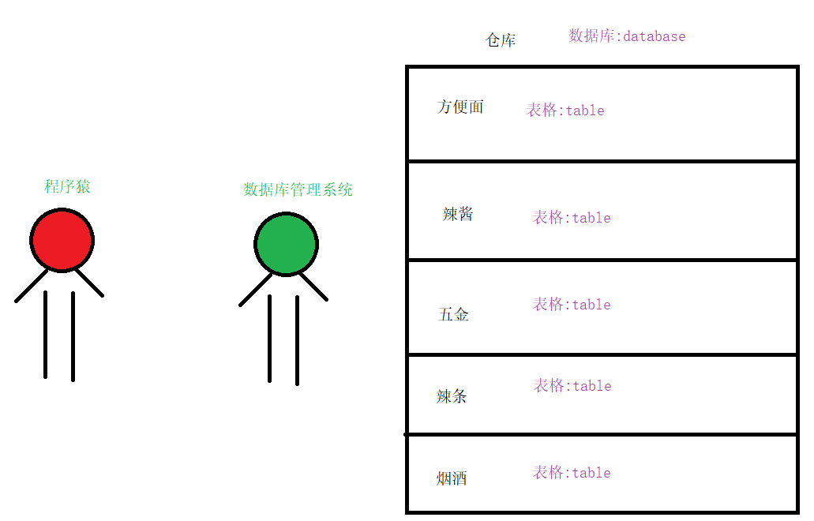

## 3.数据库表

```java
1.注意:真正存数据的地方是数据库中的表(table)
```

## 4.数据库表和Java类的对应关系

```java
数据库表和javabean类联系在一起的
```

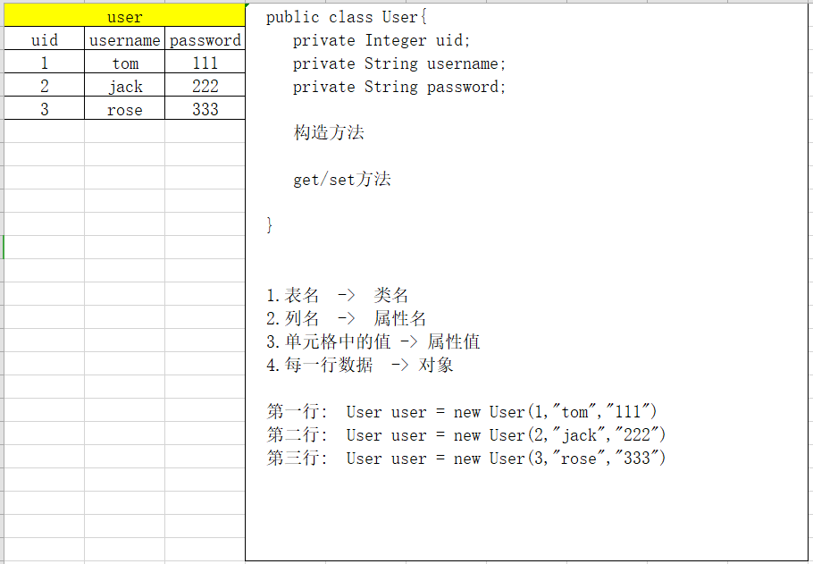

```java
  1.表名  ->  类名
  2.列名  ->  属性名
  3.单元格中的值 -> 属性值
  4.每一行数据  -> 对象

  第一行:  User user = new User(1,"tom","111")
  第二行:  User user = new User(2,"jack","222")
  第三行:  User user = new User(3,"rose","333")
```

### 4.1.javabean在开发中如何跟表联系起来的->添加数据

```
javabean将页面上的输入的数据封装成对象了,然后传递给dao层
```

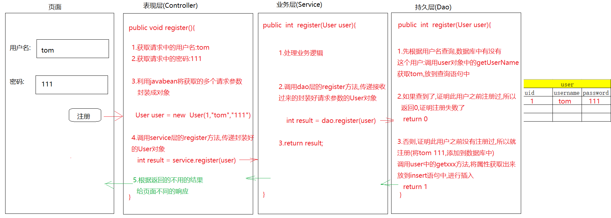

### 4.2.javabean在开发中如何跟表联系起来的->查询数据

```java
将从数据库中查询出来的数据,都封装成一个一个的javabean对象,将多个javabean对象一起返回给页面展示
```

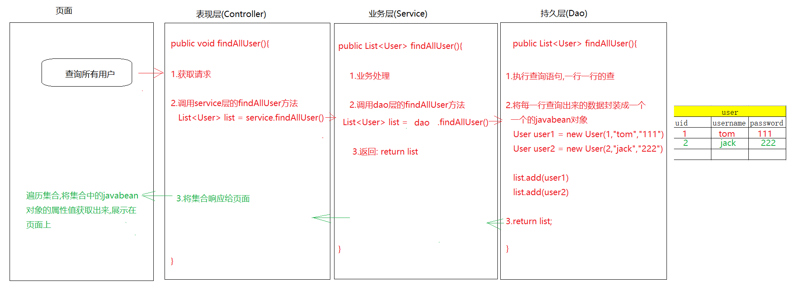

# 第二章.mysql8安装

## 1.MySQL数据库安装

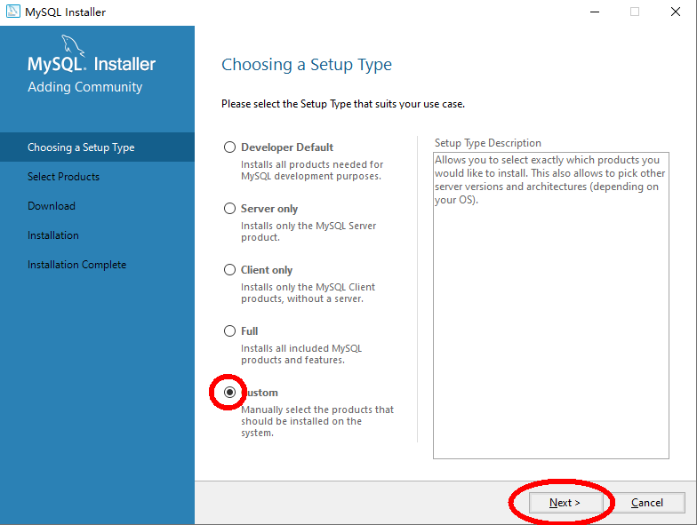

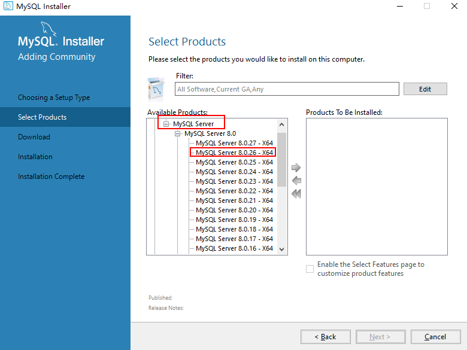

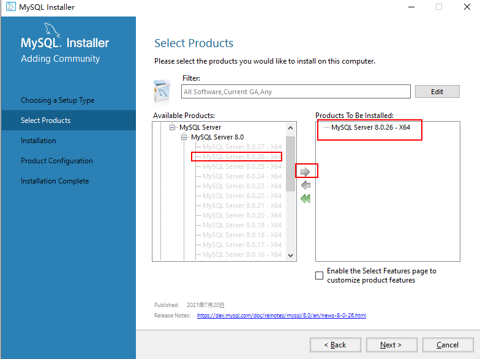

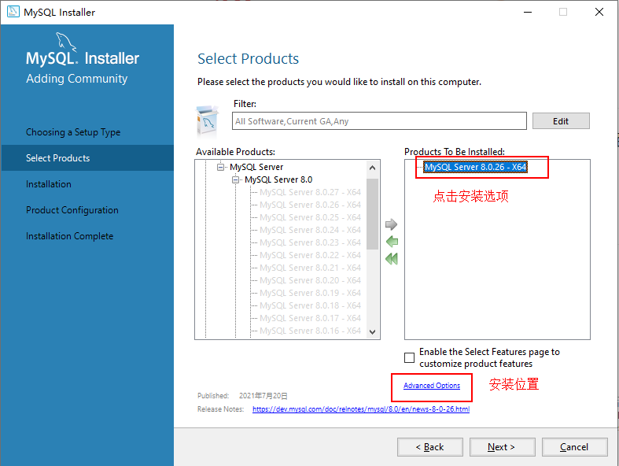


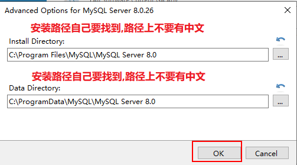

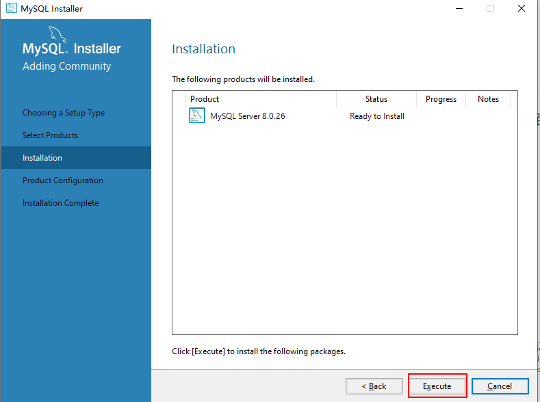


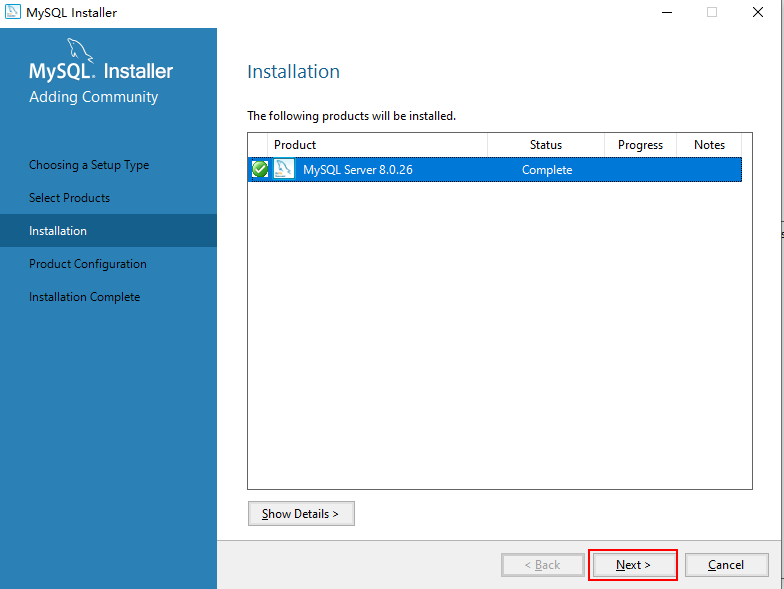

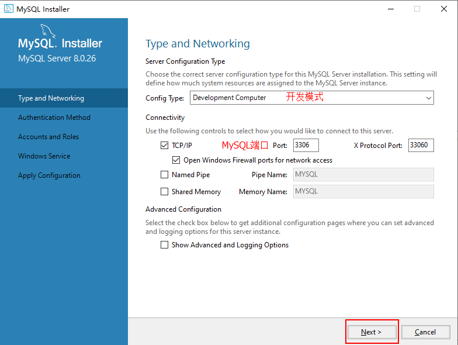


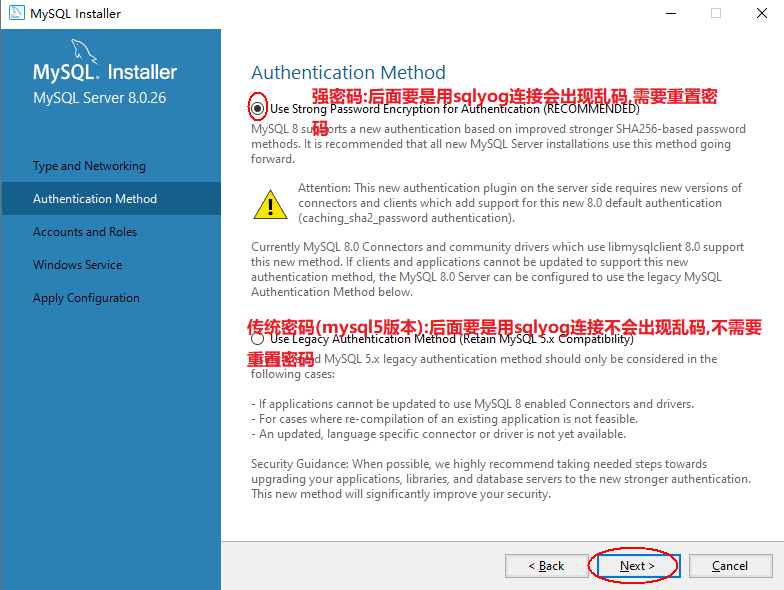

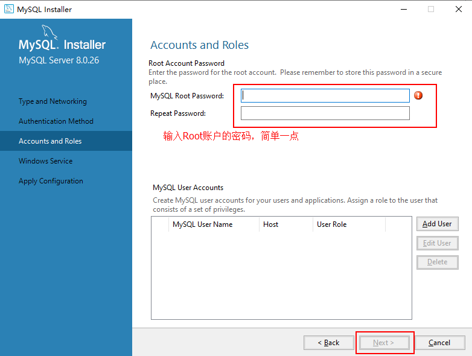

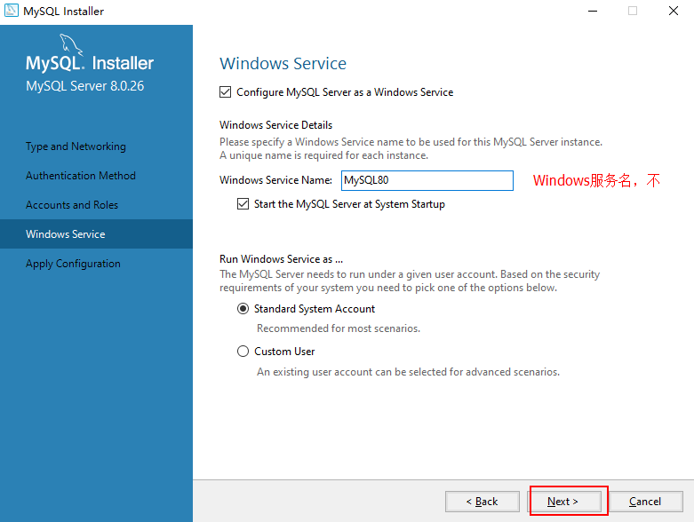

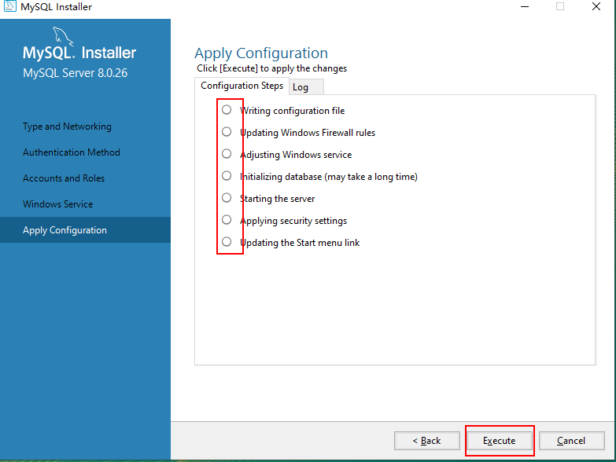


## 2.数据库服务启动和停止

```java
MySQL软件的服务器端必须先启动，客户端才可以连接和使用使用数据库。
```

### 2.1.方式1:图形化方式

```java
* 计算机（点击鼠标右键）==》管理（点击）==》服务和应用程序（点击）==》服务（点击）==》MySQL57（点击鼠标右键）==》启动或停止（点击）
* 控制面板（点击）==》系统和安全（点击）==》管理工具（点击）==》服务（点击）==》MySQL57（点击鼠标右键）==》启动或停止（点击）
* 任务栏（点击鼠标右键）==》启动任务管理器（点击）==》服务（点击）==》MySQL57（点击鼠标右键）==》启动或停止（点击）
```

### 2.2.方式2:命令方式

```java
启动 MySQL 服务命令：
net start MySQL80

停止 MySQL 服务命令：
net stop MySQL80
```

## 3.配置数据库环境变量

### 3.1.方式1:使用MYSQL_HOME

| 环境变量名 | 操作 |              环境变量值              |
| :--------: | :--: | :----------------------------------: |
| MYSQL_HOME | 新建 | D:\ProgramFiles\mysql\MySQLServer5.7 |
|    path    | 编辑 |           %MYSQL_HOME%\bin           |

### 3.2.方式2:直接配置mysql的bin路径

| 环境变量名 | 操作 |                环境变量值                |
| :--------: | :--: | :--------------------------------------: |
|    path    | 编辑 | D:\ProgramFiles\mysql\MySQLServer5.7\bin |

## 4.数据库服务端安装之后登陆

```java
1.win+R-->调出黑窗口
2.登录命令:
  a.mysql -u用户名 -p密码->回车   -> 缺点,在登录的时候密码显示出来了
  b.mysql -u 用户名 -p   ->回车
    输入密码(密码将显示成小星星)
```

```mysql
问题:输入mysql命令出现"不是内部或外部命令"
原因:环境变量没配置
解决:将mysql安装路径下的bin目录复制到环境变量下的path中
    如果path下有,还出现了"不是内部或者外部命令",干掉重新配置一下
```

```java
问题:ERROR 1045 (28000): Access denied for user 'root'@'localhost' (using password: YES)
原因:输入的mysql用户名或者密码有问题
```

```java
问题:ERROR 2003 (HY000): Can't connect to MySQL server on 'localhost' (10061)
原因:mysql服务没有启动
```

## 5.黑窗口乱码问题(可以忽略)

```java
1.在黑窗口中默认编码为GBK,而我们mysql为UTF-8,所以在黑窗口中操作中文就会乱码
2.解决:
  a.在黑窗口中输入:set names gbk   ->临时将mysql编码修改成gbk
  b.在mysql安装路径下修改my.ini文件，将涉及到编码的地方都修改了,重启服务所有地方生效。
```

```java
在路径：D:\ProgramFiles\mysql\MySQLServer8\Data 找到my.ini文件

修改内容1：
	找到[mysql]命令，大概在63行左右，在其下一行添加 
		default-character-set=utf8
修改内容2:
	找到[mysqld]命令，大概在76行左右，在其下一行添加
		character-set-server=utf8
		collation-server=utf8_general_ci

修改完毕后，重启MySQL57服务
```

```java
show variables like 'character_%';
show variables like 'collation_%';
```

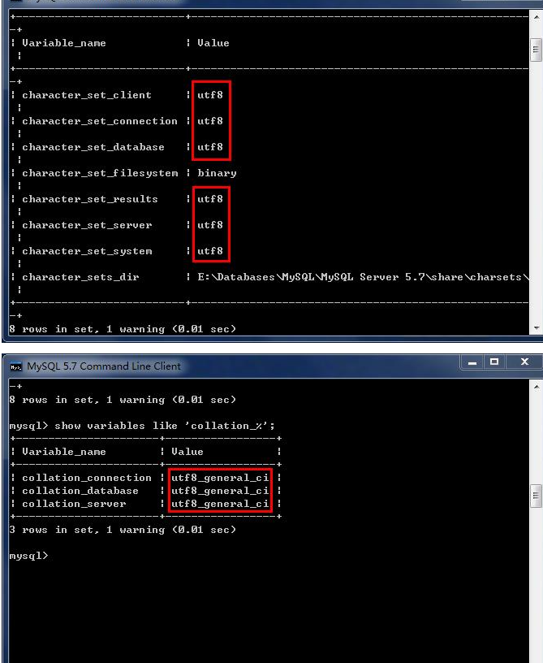


## 6.mysql客户端(可视化工具)安装

```java
例如：Navicat Preminum，SQLyog 等工具
```

### 6.1.SQLyog

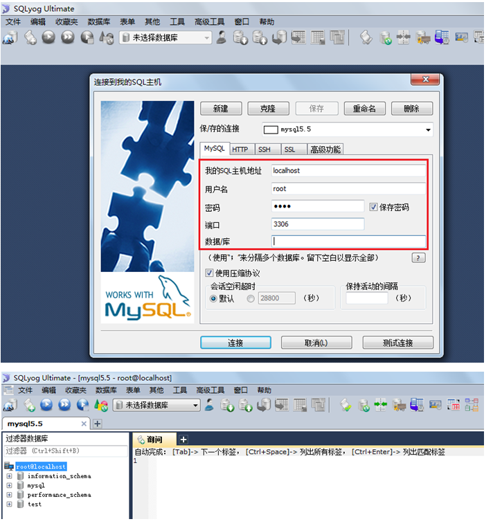

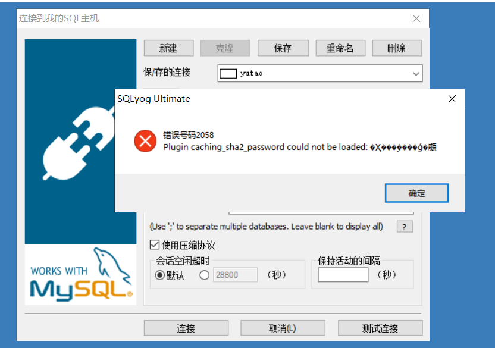

```java
通过黑窗口先登录数据库
处理无法连接：ALTER USER 'root'@'localhost' IDENTIFIED WITH mysql_native_password BY '你的密码';
```

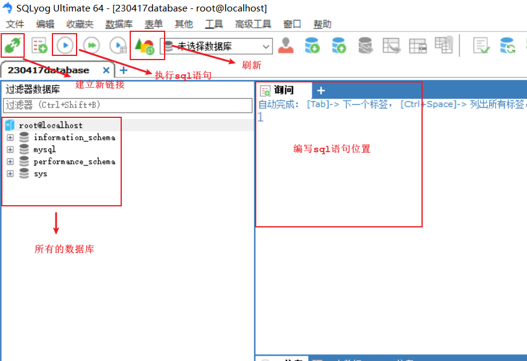

### 6.2.Navicat

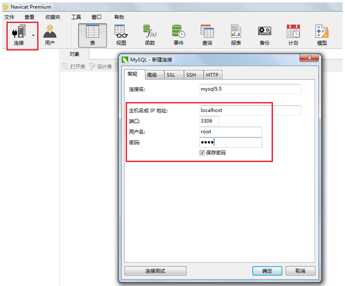

# 第三章.sql语言

## 1.sql语言介绍

```java
1.什么叫做sql语言:是所有关系型数据库语法的一个标准,规范
2.作用:规范了关系型数据库的语法以及一写关键字的使用: create drop insert select update等
3.注意:不同的关系型数据库在都遵守sql语言规范的基础上,会有一些差异,这些差异叫做sql方言
```

## 2.sql语言分类

```java
- 数据定义语言：简称DDL(Data Definition Language)，用来定义数据库对象：数据库，表，列等。关键字：create，alter，drop等

- 数据操作语言：简称DML(Data Manipulation Language)，用来对数据库中表的记录进行操作。关键字：insert，delete，update等

- 数据控制语言：简称DCL(Data Control Language)，用来定义数据库的访问权限和安全级别，及创建用户。

- 数据查询语言：简称DQL(Data Query Language)，用来查询数据库中表的记录。关键字：select，from，where等
```

## 3.sql语句的通用语法

```sql
1.- SQL语句可以单行或多行书写，以分号结尾
2.- 可使用空格和缩进来增强语句的可读性:基本上一个单词就一个空格
3.- MySQL数据库的SQL语句不区分大小写，关键字建议使用大写
    
  - 例如：SELECT * FROM user。
4.- 同样可以使用/**/的方式完成注释  #
    /*
     我是一个注释
    */
    #我也是一个注释
   -- 我也是一个注释
```

## 4.sql中的数据类型

| **类型名称**          | 说明                                                         |
| --------------------- | ------------------------------------------------------------ |
| int                   | 整数类型                                                     |
| double                | 小数类型                                                     |
| decimal（m,d）        | 指定整数位与小数位长度的小数类型                             |
| date                  | 日期类型，格式为yyyy-MM-dd，包含年月日，不包含时分秒  2020-01-01 |
| datetime              | 日期类型，格式为 YYYY-MM-DD HH:mm:ss，包含年月日时分秒   到9999年 |
| timestamp             | 日期类型，时间戳  从1970年到2038年                           |
| varchar（字符串长度） | 文本类型， M为0~65535之间的整数                              |

### 举个例子：

```mysql
DECIMAL(5,2)
```

- 总共最多可以存储 **5 位数字**。
- 其中 **2 位是小数**，那么整数部分最多可以有 **3 位**。
- 可以存储的范围是：`-999.99` 到 `999.99`。

例如：

- ✅ `123.45` —— 合法（整数3位 + 小数2位）
- ❌ `1234.56` —— 不合法（整数部分4位，超过了总位数5）

```java
我们先学  mysql
```

# 第四章.mysql中语句

## 1.DDL之数据库操作：database

### 1.1 创建数据库

```mysql
1.关键字: create database
2.语法:
  create database `数据库名字`
```

```mysql
CREATE DATABASE `241229_database`;
```

> 涛哥建议:
>
>   只要是写库名,表名,列名的时候,建议用``包裹


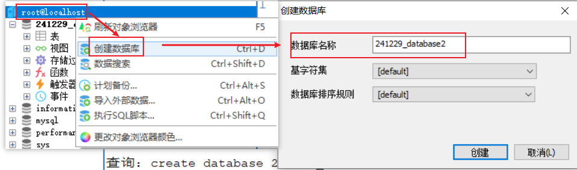

### 1.2 查看数据库(了解)

```mysql
1.查看库:
  show databases;
```

```sql
-- 查看所有库
SHOW DATABASES;
```

### 1.3 删除数据库

```mysql
1.关键字: drop database
2.语法: drop database `库名`
```

```mysql
-- 删库
DROP DATABASE `241229_database2`;
```

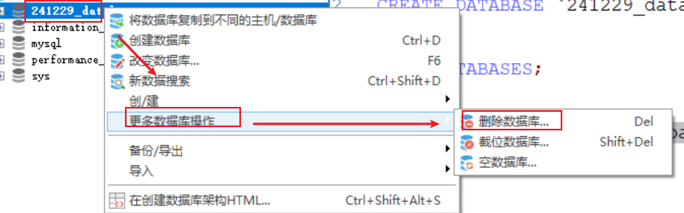

### 1.4 使用数据库(切换数据库)

```mysql
1.语法: use 库名
```

```mysql
USE `241229_database`;
```

## 2.DDL之表操作->table

### 2.1 创建表

```mysql
1.关键字: create table
2.语法:
  create table `表名`(
    `字段名` 数据类型(长度)[约束],
    `字段名` 数据类型(长度)[约束],
    `字段名` 数据类型(长度)[约束]  
  )
  
3.注意:
  字段和字段之间用,隔开,如果我们写完最后一个字段,就不用加,了
```

```mysql
#创建表
CREATE TABLE `user`(
   `uid` INT,
   `username` VARCHAR(10),
   `password` VARCHAR(15)
);
```

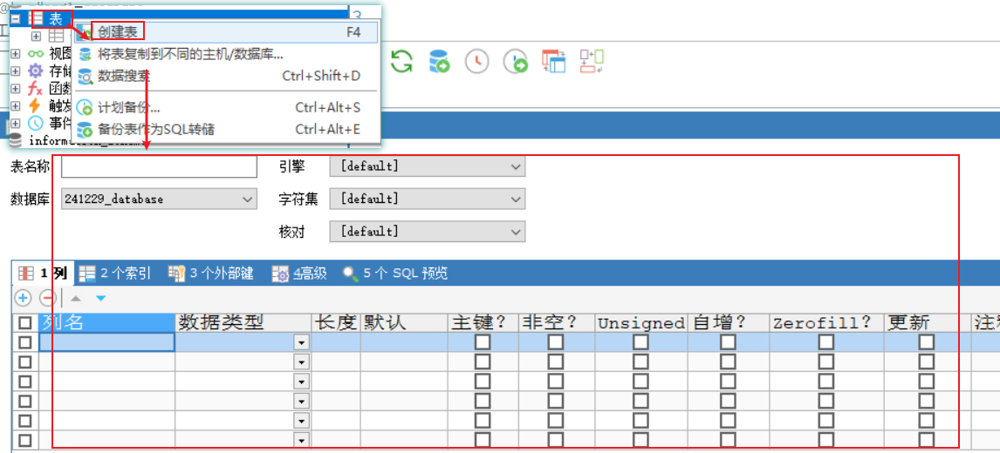

### 2.3 查看表(了解)

```mysql
#查看所有表
show tables;

#查看表结构
desc 表名;
```

```mysql
#查看所有表
SHOW TABLES;

-- 查看表结构
DESC person;
```

### 2.4 删除表

```mysql
1.关键字: drop table
2.语法:drop table 表名
```

```mysql
-- 删除表
DROP TABLE `person`;
```

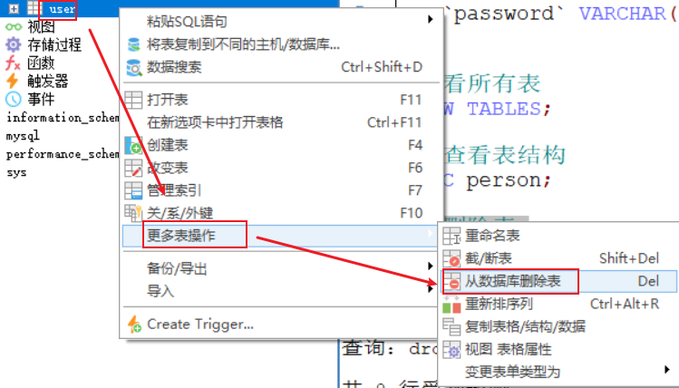

### 2.5修改表结构(了解)

```java
alter table 表名 add 列名 类型(长度) [约束];
作用：添加列. 
```

```mysql
ALTER TABLE `user` ADD `gender` VARCHAR(2);
```

```mysql
alter table 表名 modify 列名 类型(长度) [约束];
  作用：修改列的类型,长度及约束.
```

```mysql
ALTER TABLE `user` MODIFY `gender` INT;
```

```mysql
  alter table 表名 change 旧列名 新列名 类型(长度) [约束]; 
  作用：修改列名.
```

```mysql
ALTER TABLE `user` CHANGE `gender` `sex` VARCHAR(10);
```

```mysql
  alter table 表名 drop 列名; 
  作用：修改表_删除列.
```

```mysql
ALTER TABLE `user` DROP `sex`;
```

```mysql
 rename table 表名 to 新表名; 
 作用：修改表名
```

```mysql
RENAME TABLE `user` TO `person`;
RENAME TABLE `person` TO `user`;
```

## 3.DML之数据操作语言

### 3.1 插入数据

```mysql
1.关键字: insert into values
2.语法:
  a.insert into 表名 (列名,列名) values (值1,值2)
  b.insert into 表名 (列名,列名) values (值1,值2),(值1,值2),(值1,值2)... -> 一把添加多个数据
  c.insert into 表名 values (值1,值2) -> 所写的值必须覆盖所有列，不能少写
3.注意:
  如果某列是varchar类型的,那么在添加数据的时候,数据要求用'',不要用双引号
  String sql = "INSERT INTO person VALUES (NULL,'玉皇大帝','男')";、
  原因是将来我们的sql语句会放到java代码中参与运行,那么sql语句在java代码中是用String表示的
  就会变成

  String sql = "INSERT INTO person VALUES (NULL,"玉皇大帝",'男')";
  "INSERT INTO person VALUES (NULL,"这样子匹配在一起
  
```

```mysql
CREATE TABLE category(
   cid INT PRIMARY KEY,# primary key为主键约束,此列不能重复
   cname VARCHAR(10),
   cdesc VARCHAR(10)
);

/*
 insert into 表名 (列名,列名) values (值1,值2)
*/
INSERT INTO category (cid,cname,cdesc) VALUES (1,'服装','纸的');

/*
 insert into 表名 (列名,列名) values (值1,值2),(值1,值2),(值1,值2)... -> 一把添加多个数据
*/
INSERT INTO category (cid,cname,cdesc) VALUES (2,'箱包','钛合金'),(3,'蔬菜','纯添加'),(4,'方便面','过期的');

/*
insert into 表名 values (值1,值2)
*/
INSERT INTO category VALUES (5,'水果','水多的');

CREATE TABLE person(
  pid INT PRIMARY KEY AUTO_INCREMENT,#主键自增长,主键列的序号会自动编号
  pname VARCHAR(10),
  psex VARCHAR(5)
);

INSERT INTO person (pid,pname,psex) VALUES (1,'元始天尊','男');

# 由于pid是主键自增长列,所以添加数据的时候不需要单独维护
INSERT INTO person (pname,psex) VALUES ('灵宝天尊','男');

# 如果添加数据的时候不指定列名,即使有逐渐自增长,填写的值也必须覆盖所有列
INSERT INTO person VALUES (NULL,'道德天尊','男');

INSERT INTO person VALUES (NULL,"玉皇大帝","男");
```

> 细节:
>
>   列名,表名,库名用``
>
>   varchar类型的值用''

### 3.2 删除数据

```mysql
1.关键字: delete from where
2.语法:
  delete from 表名 [where 条件]
```

| java | mysql      |
| ---- | ---------- |
| ==   | =          |
| >    | >          |
| <    | <          |
| >=   | >=         |
| <=   | <=         |
| !=   | != 或者 <> |

```sql
-- 删除cid为1的记录
-- 删除cid>=5的记录
-- 删除cid不等于3的记录
```

```sql
-- 直接将所有数据删除
DELETE FROM person;

-- 删除cid为1的记录
DELETE FROM category WHERE cid = 1;

-- 删除cid>=5的记录
DELETE FROM category WHERE cid >= 5;

-- 删除cid不等于3的记录

DELETE FROM category WHERE cid != 3;

DELETE FROM category WHERE cid <> 3;

DELETE FROM category WHERE  NOT (cid=3);
```

### 3.3 修改数据

```mysql
1.关键字: update set where
2.语法:
  update 表名 set 列名 = 新值 -> 将指定列中所有的数据都改成同一个新值
  update 表名 set 列名 = 新值 [where条件] -> 根据条件修改数据
```

```mysql

-- 将表中的显卡改成水杯

-- 将cid为4的cdesc改成涤纶


-- 将cid不等于1的cname都改成平板

```

```sql
UPDATE category SET cname = '手机';

-- 将表中的水杯改成显卡
UPDATE category SET cname = '显卡' WHERE cname = '水杯';

-- 将cid为4的cdesc改成涤纶
UPDATE category SET cdesc = '涤纶' WHERE cid = 4;

-- 将cid不等于1的cname都改成平板
UPDATE category SET cname = '平板' WHERE cid !=1;
```

# 第五章.约束

```java
1.制约指定列中的数据
```

## 1.主键约束

```mysql
1.关键字: primary key
2.特点:
  a.主键列的数据不能重复
  b.主键列的数据不能为null
3.注意:
  每个表中都应该有一个主键列,代表一条数据,相当于人得身份证号
```

### 1.1.添加方式1:在创建表时,在字段后面直接指定(重点)

```mysql
create table 表名(
  列名 数据类型(长度)[约束],
  列名 数据类型(长度)[约束],
  列名 数据类型(长度)[约束]
)
```

```sql
CREATE TABLE product(
   pid INT PRIMARY KEY,#主键约束
   pname VARCHAR(10),
   pdesc VARCHAR(10)
);

INSERT INTO product (pid,pname,pdesc) VALUES (1,'苹果手机','富士康的');
-- INSERT INTO product (pid,pname,pdesc) VALUES (1,'香蕉','非洲');
-- INSERT INTO product (pid,pname,pdesc) VALUES (null,'香蕉','非洲');
```

### 1.2.添加方式2:在constraint约束区域,去指定主键约束

```mysql
1.什么叫做constraint域
  创建表的时候,最后一列和右半个小括号之间的区域
2.语法:
  [constraint 名字] primary key (字段名)
3.注意:[constraint 名字]:可写可不写    
```

```mysql
CREATE TABLE product(
   pid INT,
   pname VARCHAR(10),
   pdesc VARCHAR(10),
   PRIMARY KEY (pid)   
);
```

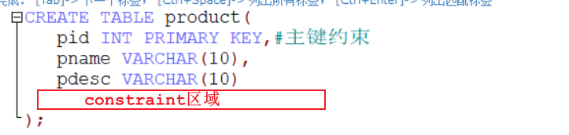

### 1.3.添加方式3:通过修改表结构的方式

```mysql
1.格式:ALTER TABLE 表名 ADD [CONSTRAINT 名称] PRIMARY KEY (字段列表)
2.注意:[CONSTRAINT 名称]可以省略不写
```

```mysql
CREATE TABLE product(
   pid INT,
   pname VARCHAR(10),
   pdesc VARCHAR(10)
);
ALTER TABLE product ADD PRIMARY KEY (pid);

```

### 1.4.联合主键

```mysql
1.概述:多个列共同称之为是一个主键
2.特点:
  联合主键中的多个列数据不能完全一样
  不能为null
```

```mysql
/*
  联合主键
*/
CREATE TABLE student(
  xing VARCHAR(10),
  ming VARCHAR(10),
  city VARCHAR(10),
  PRIMARY KEY (xing,ming)
);
```

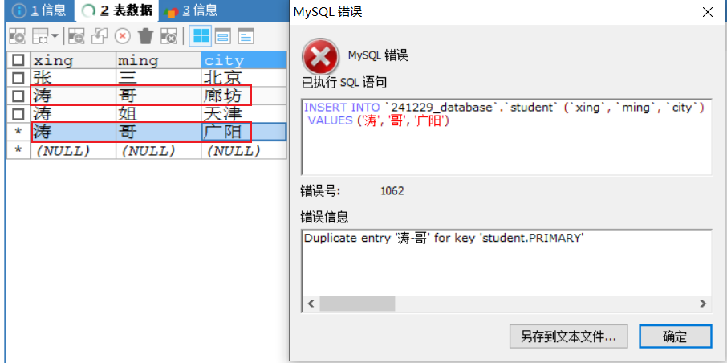

### 1.5.删除主键约束

```mysql
ALTER TABLE 表名 DROP PRIMARY KEY->删除主键约束
```

```mysql
ALTER TABLE person DROP PRIMARY KEY;
```

## 2.自增长约束

### 2.1.基本操作

```mysql
1.关键字:auto_increment
2.特点:
  a.自增长约束都是和主键约束一起使用
  b.主键自增长列中的数据mysql会自动维护
3.注意:
  如果是主键自增长列的数据,那么删除之后,再重新添加,序号会从被删除数据的序号后一个序号编号
```

``` mysql
DROP TABLE category;

CREATE TABLE category(
  cid INT PRIMARY KEY AUTO_INCREMENT,
  cname VARCHAR(10),
  cdesc VARCHAR(10)
);

INSERT INTO category (cid,cname,cdesc) VALUES (NULL,'蔬菜','纯野生');

INSERT INTO category VALUES (NULL,'水果','偷的');

INSERT INTO category VALUES (NULL,'海鲜','核污染的');

DELETE FROM category WHERE cid = 3; #删除之后不会重新编号

#摧毁表结构
TRUNCATE TABLE category;
```

> ```mysql
> /*
> 自增长是一个约束,操作起来和其他约束不太一样
> 
> 如果自增长约束和主键约束合起来使用想删除
> 
> 先删除自增长约束
> 再删除主键约束
> 
> */
> 
> drop table category;
> create table category(
> cid int primary key auto_increment,
> cname varchar(100)
> );
> 
> alter table category modify cid int;
> 
> alter table category drop primary key;
> ```

### 2.2.truncate和delete区别

```mysql
1.delete:如果是主键自增长,删除之后,再次添加,编号不会重新编号,会接着被删除的那个编号往下继续编
2.truncate:摧毁表结构,主键自增长列,会重新编号
```

## 3.非空约束

```mysql
1.关键字:NOT NULL
2.特点:
  此列不能为NULL
```

```mysql
DROP TABLE category;
#非空约束

CREATE TABLE category(
  cid INT PRIMARY KEY AUTO_INCREMENT,
  cname VARCHAR(10) NOT NULL,
  cdesc VARCHAR(10)
);

INSERT INTO category (cid,cname,cdesc) VALUES (NULL,'蔬菜','纯野生');

#相当于String s = null
-- INSERT INTO category (cid,cname,cdesc) VALUES (NULL,NULL,'纯野生');

#相当于String s = "null"
INSERT INTO category (cid,cname,cdesc) VALUES (NULL,'null','纯野生');

#相当于String s = ""
INSERT INTO category (cid,cname,cdesc) VALUES (NULL,'','纯野生');
```

## 4.唯一约束

```mysql
1.关键字:UNIQUE
2.特点:
  唯一约束的列,数据不能重复
3.唯一约束和主键约束区别:
  a.一个表中只能有一个主键约束
  b.一个表中能有多个唯一约束
  c.主键约束可以代表一行数据,相当于人得身份证号
  d.唯一约束只能限制数据不重复,不能完全代表一行数据
```

```mysql
DROP TABLE category;
#非空约束

CREATE TABLE category(
  cid INT PRIMARY KEY AUTO_INCREMENT,
  cname VARCHAR(10) UNIQUE,
  cdesc VARCHAR(10)
);

INSERT INTO category (cid,cname,cdesc) VALUES (NULL,'蔬菜','纯野生');

#INSERT INTO category (cid,cname,cdesc) VALUES (NULL,'蔬菜','扣大棚');

INSERT INTO category (cid,cname,cdesc) VALUES (NULL,'蔬菜1','扣大棚');
```

```mysql
删除唯一约束:
 ALTER TABLE 表名 DROP INDEX 名称   [名称是CONSTRAINT后面的名称]
```

