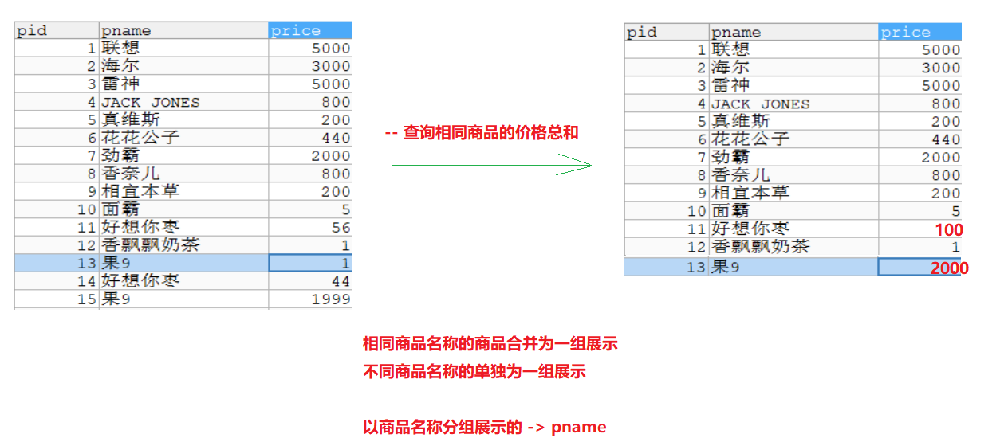
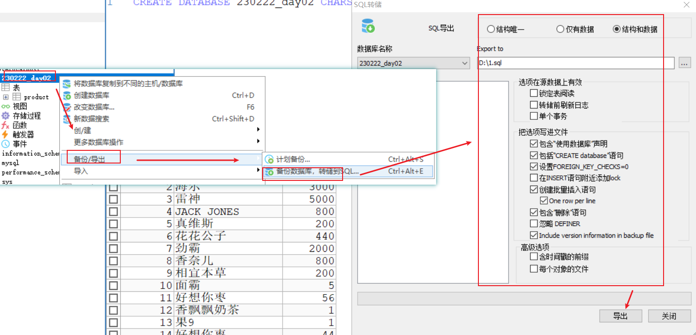
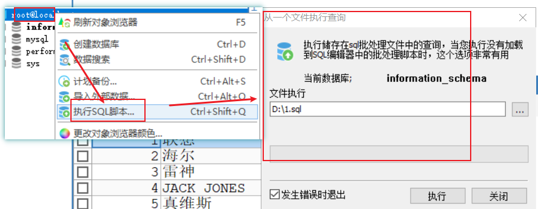
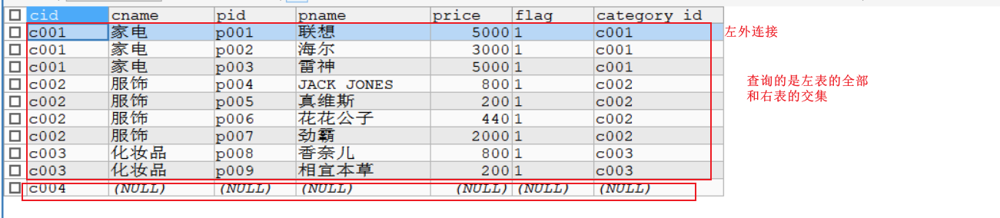

# day02-查询

```java
课前回顾:
  1.javabean和表的对应关系:
    a.表名 -> 类名
    b.列名 -> 属性名
    c.一行数据 -> 对象
    d.单元格中的数据 -> 属性值
  2.创建数据库:
    create database 数据库名字 charset utf8;
  3.删除数据库
    drop database 数据库名字
  4.创建表
    create table 表名(
      列名 数据类型(长度) [约束],
      列名 数据类型(长度) [约束],
      列名 数据类型(长度) [约束]
    );
  5.删除表
    drop table 表名
  6.添加数据
    insert into 表名(列名,列名) values (值1,值2)
    insert into 表名(列名,列名) values (值1,值2),(值1,值2),(值1,值2)
    insert into 表名 values (值1,值2) -> 不关怎样值都要匹配所有列
  7.删除数据
    delete from 表名 where 条件
  8.修改数据
    update 表名 set 列名 = 新值 where 条件
  
今日重点:
  1.会在创建表的时候指定约束
  2.会数据库的备份和还原
  3.知道表和表之间的关系
  4.会使用内连接,外连接,子查询查询数据
```

# 第一章.单表查询

```sql
#创建商品表：
create table product(
	pid int primary key,
	pname varchar(20),
	price double
);

INSERT INTO product(pid,pname,price) VALUES(1,'联想',5000);
INSERT INTO product(pid,pname,price) VALUES(2,'海尔',3000);
INSERT INTO product(pid,pname,price) VALUES(3,'雷神',5000);
INSERT INTO product(pid,pname,price) VALUES(4,'JACK JONES',800);
INSERT INTO product(pid,pname,price) VALUES(5,'真维斯',200);
INSERT INTO product(pid,pname,price) VALUES(6,'花花公子',440);
INSERT INTO product(pid,pname,price) VALUES(7,'劲霸',2000);
INSERT INTO product(pid,pname,price) VALUES(8,'香奈儿',800);
INSERT INTO product(pid,pname,price) VALUES(9,'相宜本草',200);
INSERT INTO product(pid,pname,price) VALUES(10,'面霸',5);
INSERT INTO product(pid,pname,price) VALUES(11,'好想你枣',56);
INSERT INTO product(pid,pname,price) VALUES(12,'香飘飘奶茶',1);
INSERT INTO product(pid,pname,price) VALUES(13,'果9',1);
```

## 1.简单查询

```mysql
1.关键字:select from where
2.格式:
  a.select * from 表名 -> 查询所有数据,展示所有列的数据
  b.select 列名 from 表名 -> 查询所有,展示指定列的数据
  c.select 列名 as 别名 from 表名 as 别名 -> 给列和表起别名 as可以省略
3.注意:
  查询出来的结果也是一个表格,但是这个表示伪表,此表示只读的,不能改
```

```mysql
-- 查询product所有数据
SELECT * FROM product;

-- 查询product 所有数据,展示pname和pid
SELECT pid,pname FROM product;

/*
  去重复值
  
  关键字: distinct(列名)
*/
SELECT DISTINCT(price) FROM product;


/*
  给列中的数据做计算
*/
-- 查询所有数据,给price列中所有的数据+100
SELECT pid,pname,price+100 FROM product;


/*
  给列和表取别名
  
  as 别名
  
  as可以省略
*/
SELECT pid,pname,(price+100) `newprice` FROM product;

SELECT pid,pname,(price+100) `newprice` FROM product `p`;
```

## 2.条件查询

```sql
  a.select * from 表名 where 条件 -> 根据条件查询,展示所有列的数据
  b.select 列名 from 表名 where 条件 -> 根据条件查询,展示指定列的数据
```

| **比较运算符** | <  <=  >=   =  <>     | 大于、小于、大于(小于)等于、不等于                           |
| -------------- | --------------------- | ------------------------------------------------------------ |
|                | BETWEEN  ...AND...    | 显示在某一区间的值(含头含尾)                                 |
|                | 字段 IN(set)          | 显示在in列表中的值，例：price in(100,200)  查询id为1,3,7的商品: id  in(1,3,7) |
|                | 列名 LIKE ‘张pattern’ | 模糊查询，Like语句中，% 代表零个或多个任意字符，_ 代表一个字符， 例如：`first_name like '_a%';`   <br/>比如:查询姓张的人:name like '张%'<br> 查询商品名中带香的商品: pname like '%香%'<br>查询第二个字为想的商品: like '_想%'<br>查询商品名为四个字的商品:like '____' |
|                | IS NULL               | 判断是否为空                                                 |
| **逻辑运行符** | and  (与)             | 多个条件同时成立  全为true,整体才为true                      |
|                | or(或)                | 多个条件任一成立   有真则真                                  |
|                | not(非)               | 不成立，例：`where not(salary>100); `                        |

```mysql
-- 查询商品名为'花花公子'的商品所有信息
SELECT * FROM product WHERE pname = '花花公子';

-- 查询价格为800的商品
SELECT * FROM product WHERE price>800;


-- 查询商品价格大于60元的所有商品信息
SELECT * FROM product WHERE price>=60;


-- 查询商品价格在200-1000之间的所有商品信息
SELECT * FROM product WHERE price>=200 AND price <=1000;
SELECT * FROM product WHERE price BETWEEN 200 AND 1000;
SELECT * FROM product WHERE price BETWEEN 1000 AND 200;-- 不行,先写小的再写大的

-- 查询商品价格是200或者800的商品
SELECT * FROM product WHERE price = 200 OR price = 800;
SELECT * FROM product WHERE price IN(200,800);

-- 查询以'香'开头的商品
SELECT * FROM product WHERE pname LIKE '香%';


-- 查询含有'霸'的商品
SELECT * FROM product WHERE pname LIKE '%霸%';

-- 查询商品名为NULL的
SELECT * FROM product WHERE pname IS NULL;


-- 查询商品名不为NULL的
SELECT * FROM product WHERE pname IS NOT NULL;
```

## 3.排序查询

```java
1.关键字:order by
2.语法:
  select 列名 from 表名 order by 排序字段 desc|asc
  
  desc:降序
  asc:升序 -> order by 默认排序规则
      
3.问题:先排序还是先查询
  先查询,再排序
```

```mysql
书写sql语句关键字的顺序
select 
from 
where 
group by 
having 
order by

执行顺序:
from 
where 
group by 
having 
select 
order by

先定位到要查询哪个表,然后根据什么条件去查,表确定好了,条件也确定好了,开始利用select查询
查询得出一个结果,在针对这个结果进行一个排序
```

```mysql
-- 使用价格排序(降序)
SELECT * FROM product ORDER BY price DESC;

-- 使用价格排序(升序)
SELECT * FROM product ORDER BY price ASC;

SELECT * FROM product ORDER BY price;

-- 显示商品的价格(去重复),并排序(降序)
SELECT DISTINCT(price) FROM product ORDER BY price DESC;

```

## 4.聚合查询

```mysql
1.查询方式:纵向查询,对指定列的数据进行聚合查询,需要用到聚合函数
2.语法:
  select 聚合函数(列名) from 表名 [where 条件]
3.常见的聚合函数:
  count(列名) -> 统计总记录数
  sum(列名) -> 对指定列求和
  avg(列名) -> 对指定列求平均值
  max(列名) -> 对指定列求最大值
  min(列名) -> 对指定列求最小值
```

```mysql
-- 统计product的总记录数
SELECT COUNT(*) FROM product; -- 查询所有,表中有多少条记录,都统计出来
SELECT COUNT(pid) FROM product;
SELECT COUNT(0) FROM product; -- 即使有NULL也能统计
SELECT COUNT(1) FROM product; -- 即使有NULL也能统计
SELECT COUNT(pname) FROM product; -- 如果指定的列中有NULL,统计不出来

-- 查询所有商品的价格总和
SELECT SUM(price) FROM product;

-- 查询pid为1,3,7 商品的价格平均值
SELECT AVG(price) FROM product WHERE pid IN(1,3,7);


-- 查询商品的最高价格以及最低价格
SELECT MIN(price),MAX(price) FROM product;

```

## 5.分组查询

```mysql
1.关键字:group by
2.语法:
  select 聚合函数(列名) from 表名 group by 分组列 having 条件
3.注意:
  a.分组查询都是和聚合函数一起使用
4.分组小技巧:
  观察以哪一组分组展示
  相同的合并为一组展示
  不同的单独为一组展示 
  
5.having和where的区别:
  a.相同点:都是条件筛选
  b.不同点:
    where在分组之前执行
    having在分组之后执行
```

```mysql
书写sql语句关键字的顺序
select 
from 
where 
group by 
having 
order by

执行顺序:
from 
where 
group by 
having 
select 
order by

先定位到要查询哪个表,然后根据什么条件去查,表确定好了,条件也确定好了,开始利用select查询
查询得出一个结果,在针对这个结果进行一个排序
```

```sql
-- 查询相同商品的价格总和
SELECT pname, SUM(price) FROM product GROUP BY pname;

-- 查询相同商品的价格总和并排序

SELECT pname,SUM(price) FROM product GROUP BY pname ORDER BY SUM(price) ASC;

SELECT pname,SUM(price) `newprice` FROM product GROUP BY pname ORDER BY newprice ASC;

-- 查询相同商品的价格总和,再展示出价格总和大于等于2000的商品


/*
  where关键字要写在group by前面,现在写在后面了,所以报错了
*/
SELECT pname,SUM(price) `newprice` FROM product GROUP BY pname WHERE newprice>=2000;

/*
  先走where,在走where的时候别名还没产生了,所以报错
*/
SELECT pname,SUM(price) `newprice` FROM product WHERE newprice>=2000 GROUP BY pname ;

/*
  执行where的时候,还没分组呢
  此时第一个果9是1块钱;第二个果9是1999,都没有到2000,所以直接被where筛掉了
  所以结果不对
*/
SELECT pname,SUM(price) `newprice` FROM product WHERE price>=2000 GROUP BY pname ;


SELECT pname,SUM(price) `newprice` FROM product GROUP BY pname HAVING newprice>=2000;
```



## 6.分页查询

```mysql
1.语法:
  select * from 表名 limit m,n
2.字母代表啥:
  m:每页的起始位置
  n:每页显示条数
3.小技巧:
  我们将整个表的每一条数据进行编号,从0开始
  
4.每页的起始位置快速算法:
  (当前页-1)*每页显示条数
  
5.其他分页参数:
  a.每页的起始位置:
    (当前页-1)*每页显示条数
  b.int curPage = 2; -- 当前页数
  c.int pageSize = 5; -- 每页显示数量
  d.int startRow = (curPage - 1) * pageSize; -- 当前页, 记录开始的位置(行数)计算
  e.int totalSize = select count(*) from products; -- 记录总数量
  f.int totalPage = Math.ceil(totalSize * 1.0 / pageSize); -- 总页数
                总页数 = (总记录数/每页显示条数)向上取整
```

```mysql
-- 第一页
SELECT * FROM product LIMIT 0,5;

-- 第二页
SELECT * FROM product LIMIT 5,5;

-- 第三页
SELECT * FROM product LIMIT 10,5;

-- 第四页
SELECT * FROM product LIMIT 15,5;
```


# 第二章.数据库的备份与还原

## 1.用命令去操作数据库的备份与还原

### 1.1.命令操作备份

```mysql
mysqldump  -u用户名 -p密码 数据库名>生成的脚本文件路径

生成的脚本文件路径:指定备份的路径,写路径时最后要指明备份的sql文件名,命令后不要加;
```

### 1.2.命令操作还原

```mysql
mysql  -uroot  -p密码 数据库名 < 文件路径

注意:我们利用命令备份出来的sql文件中没有单独创建数据库的语句,所以如果利用命令去还原的话,需要我们自己手动先创建对应的库
    命令后不要加;
```

## 2.利用点击去操作数据库的备份与还原

### 2.1.利用点击去备份



### 2.2.利用点击去还原


# 第三章.数据库三范式

```java
好的数据库设计对数据的存储性能和后期的程序开发，都会产生重要的影响。建立科学的，规范的数据库就需要满足一些规则来优化数据的设计和存储，这些规则就称为范式。
```

## 1第一范式: **确保每列保持原子性**

第一范（1NF）式是最基本的范式。如果数据库表中的所有字段值都是不可分解的原子值，就说明该数据库表满足了第一范式。

第一范式的合理遵循需要根据系统的实际需求来定。比如某些数据库系统中需要用到“地址”这个属性，本来直接将“地址”属性设计成一个数据库表的字段就行。但是如果系统经常会访问“地址”属性中的“城市”部分，那么就非要将“地址”这个属性重新拆分为省份、城市、详细地址等多个部分进行存储，这样在对地址中某一部分操作的时候将非常方便。这样设计才算满足了数据库的第一范式，如下表所示。


如果不遵守第一范式，查询出数据还需要进一步处理（查询不方便）。遵守第一范式，需要什么字段的数据就查询什么数据（方便查询）

```java
列名:详细地址手机号
     
    北京市昌平区北七家镇宏福苑小区19号楼1501087xxxx -> 不行,因为数据可以拆分,不符合第一范式原子性
```

## 2 第二范式: **确保表中的每行都能唯一区分**

第二范式（2NF)第二范式（2NF）是在第一范式（1NF）的基础上建立起来的，即满足第二范式（2NF）必须先满足第一范式（1NF）。第二范式（2NF）要求数据库表中的每个实例或行必须可以被惟一的区分。为实现区分通常需要为表加上一个列，以存储各个实例的惟一标识。

## 3 第三范式: **3NF:非主键字段不能相互依赖**

比如student表，班级编号受人员编号的影响，如果在这个表中再插入班级的班主任、数学老师等信息，你们觉得这样合适吗？肯定不合适，因为学生有多个，这样就会造成班级有多个，那么每个班级的班主任、数学老师都会出现多条数据，而我们理想中的效果应该是一条班级信息对应一个班主任和数学老师，这样更易于我们理解，

# 第四章.多表之间的关系

```mysql
1.一对一: 两张表之间怎么看都是一对一
         人和身份证号
         
2.一对多: 两张表,从一张表出发看是一对多,反过来看多对一
         比如:商品分类表和商品信息表
             一个分类对应多个商品 -> 一对多
             多个商品对应同一个分类 -> 多对一

3.多对多:两张表,怎么看都是一对多
        比如:商品信息表和订单表
            一个商品可以在多个订单中 -> 一对多
            一个订单中存在多个商品 -> 一对多
            
两个表中的数据想要牵制,需要将两张表约束起来            
```

# 第五章.创建外键约束

```mysql
格式:alter table 从表 add [constraint 外键名称(自定义)] foreign key 从表(外键列名) references 主表(主键列名)
```

## 1.一对多的表创建外键约束


```mysql
    CREATE TABLE category (
      cid VARCHAR(32) PRIMARY KEY ,
      cname VARCHAR(50)
    );

    #商品表->从表
    CREATE TABLE products(
      pid VARCHAR(32) PRIMARY KEY ,
      pname VARCHAR(50),
      price DOUBLE,
      category_id VARCHAR(32)-- 外键  存储的是主表的主键内容
    );
    
      ALTER TABLE products ADD CONSTRAINT cp1 FOREIGN KEY products(category_id) REFERENCES category(cid);
```


## 2.多对多的表创建外键约束


```mysql
# 订单表 -> 主表
 CREATE TABLE `orders`(
  `oid` VARCHAR(32) PRIMARY KEY ,
  `totalprice` DOUBLE 	#总计
  );
   
#订单项表->中间表->从表
CREATE TABLE orderitem(
  pid VARCHAR(50),-- 商品id->外键
  oid VARCHAR(50)-- 订单id ->外键
);

-- 商品表和中间表做
ALTER TABLE orderitem ADD CONSTRAINT po1 FOREIGN KEY orderitem(pid) REFERENCES products(pid);

-- 订单表和中间表做
ALTER TABLE orderitem ADD CONSTRAINT po2 FOREIGN KEY orderitem(oid) REFERENCES orders(oid);
```

# 第六章.多表查询

```mysql
    # 分类表
    CREATE TABLE category (
      cid VARCHAR(32) PRIMARY KEY ,
      cname VARCHAR(50)
    );

    #商品表
    CREATE TABLE products(
      pid VARCHAR(32) PRIMARY KEY ,
      pname VARCHAR(50),
      price DOUBLE,
      flag VARCHAR(2), #是否上架标记为：1表示上架、0表示下架
      category_id VARCHAR(32), -- 外键
      CONSTRAINT products_fk FOREIGN KEY (category_id) REFERENCES category (cid)
    );
    #分类
INSERT INTO category(cid,cname) VALUES('c001','家电');
INSERT INTO category(cid,cname) VALUES('c002','服饰');
INSERT INTO category(cid,cname) VALUES('c003','化妆品');
#商品
INSERT INTO products(pid, pname,price,flag,category_id) VALUES('p001','联想',5000,'1','c001');
INSERT INTO products(pid, pname,price,flag,category_id) VALUES('p002','海尔',3000,'1','c001');
INSERT INTO products(pid, pname,price,flag,category_id) VALUES('p003','雷神',5000,'1','c001');

INSERT INTO products (pid, pname,price,flag,category_id) VALUES('p004','JACK JONES',800,'1','c002');
INSERT INTO products (pid, pname,price,flag,category_id) VALUES('p005','真维斯',200,'1','c002');
INSERT INTO products (pid, pname,price,flag,category_id) VALUES('p006','花花公子',440,'1','c002');
INSERT INTO products (pid, pname,price,flag,category_id) VALUES('p007','劲霸',2000,'1','c002');

INSERT INTO products (pid, pname,price,flag,category_id) VALUES('p008','香奈儿',800,'1','c003');
INSERT INTO products (pid, pname,price,flag,category_id) VALUES('p009','相宜本草',200,'1','c003');
```

## 1.交叉查询

```mysql
1.语法:
   select 列名 from 表A,表B
2.注意:
  交叉查询容易出现笛卡尔乘积
```

```mysql
-- 查询所有商品的具体信息
SELECT * FROM category,products;  -- 出现了笛卡尔乘积

SELECT * FROM category,products WHERE category.cid = products.category_id;

SELECT * FROM category c,products p WHERE c.cid = p.category_id;
```


## 2.内连接查询

```mysql
1.关键字:inner join on -> inner 可以省略

2.语法:
  a.显示内连接:select 列名 from 表A join 表B on 条件
  b.隐式内连接:select 列名 from 表A,表B where 条件
```

```mysql
-- 查询具体的商品信息->隐式内连接
SELECT * FROM category c,products p WHERE c.`cid` = p.`category_id`;

-- 查询具体的商品信息->显示内连接
SELECT * FROM category c JOIN products p ON c.`cid` = p.`category_id`;

-- 用显示内连接的方式查询"化妆品"的商品信息

/*
  on 条件1 and 条件2  -> 条件1 and 条件2是一个大条件
  
  on 条件1 where 条件2 -> 两个小条件
*/
SELECT * FROM category c JOIN products p ON c.`cid` = p.`category_id` AND cname='化妆品';

SELECT * FROM category c JOIN products p ON c.`cid` = p.`category_id` WHERE cname='化妆品';
```

## 3.外连接

```mysql
1.关键字:outer join on -> outer可以省略
2.分类:
  左外连接:select * from 表A left join 表B on 条件
  右外连接:select * from 表A right join 表B on 条件
3.左外连接,右外连接,内连接
  a.左外连接:查询的是左表的全部和右表的交集
  b.右外连接:查询的是右表的全部和左表的交集
  c.内连接:只查询两个表的交集
4.怎么分区左表和右表
  看join
  在join左边的是左表
  在join右边的是右表
```

```mysql
-- 查询所有的商品信息 左外连接
SELECT * FROM category c LEFT JOIN products p ON c.`cid` = p.`category_id`;

-- 查询所有的商品信息 右外连接
SELECT * FROM category c RIGHT JOIN products p ON c.`cid` = p.`category_id`;

-- 查询所有的商品信息内连接
SELECT * FROM category c JOIN products p ON c.`cid` = p.`category_id`;

```




## 4.union联合查询实现全外连接查询（了解）

```java
首先要明确，联合查询不是多表连接查询的一种方式。联合查询是将多条查询语句的查询结果合并成一个结果并去掉重复数据。
全外连接查询的意思就是将左表和右表的数据都查询出来，然后按照连接条件连接
    
只要将两个结果一连接,左表和右表没有交叉的部分也就都查出来了
```

```java
1.union的语法:
  查询语句1 union 查询语句2 union 查询语句3 ...
```

```mysql
-- 全外连接
SELECT * FROM category c LEFT JOIN products p ON c.`cid` = p.`category_id`

UNION

SELECT * FROM category c RIGHT JOIN products p ON c.`cid` = p.`category_id`;
```

## 5.子查询

```mysql
1.一条查询语句作为另外一条查询语句的条件使用 -> 查询语句嵌套
```

```mysql
-- 查询products表中'化妆品'的商品信息
SELECT * FROM products WHERE category_id = 'c003'; 

/*
  我们单纯看products表,我们并不确定c003就一定是化妆品
  c003是category表来的
  所以c003应该是查询出来的数据
  
  c003不确定是化妆品,但是化妆品这三个字是确定的吧
  我们只需要根据化妆品从category中查询出对应的id,就可以了
*/
-- 先根据化妆品将id从category表中差出来
SELECT cid FROM category WHERE cname = '化妆品';

-- 再将上面的sql语句放到另外一个查询语句中做条件使用
SELECT * FROM products WHERE category_id = (SELECT cid FROM category WHERE cname = '化妆品');


-- 查询products表中化妆品和家电的商品信息
SELECT * FROM products WHERE category_id = 'c001' OR category_id = 'c003';
SELECT * FROM products WHERE category_id IN ('c001','c003');

SELECT cid FROM category WHERE cname IN ('家电','化妆品');

SELECT * FROM products WHERE category_id IN (SELECT cid FROM category WHERE cname IN ('家电','化妆品'));

```

## 6.子查询作为伪表使用

```mysql
1.查询语句出来的结果也是一张表,但是这个表为"伪表",让这个伪表当做正常表,参与查询
```

```mysql
-- 查询化妆品的所有商品信息
SELECT * FROM category c,products p WHERE c.`cid` = p.`category_id` AND cname = '化妆品';

-- 先将化妆品查出来
SELECT * FROM category WHERE cname = '化妆品';

SELECT * FROM (SELECT * FROM category WHERE cname = '化妆品') c,products p WHERE c.`cid` = p.`category_id`

-- 查询所有化妆品和家电的商品信息
SELECT * FROM category c,products p WHERE c.`cid` = p.`category_id` AND cname IN ('化妆品','家电');

-- 先将化妆品和家电查出来
SELECT * FROM category WHERE cname IN ('家电','化妆品');

SELECT * FROM (SELECT * FROM category WHERE cname IN ('家电','化妆品')) c,products p WHERE c.`cid` = p.`category_id`
```


# 第七章.mysql函数

```java

```

##  1.字符串函数

### 1.1.1 字符串函数列表概览

| 函数                                  | 用法                                          |
| ------------------------------------- | --------------------------------------------- |
| CONCAT(S1,S2,......,Sn)               | 连接S1,S2,......,Sn为一个字符串               |
| CONCAT_WS(separator, S1,S2,......,Sn) | 连接S1一直到Sn，并且中间以separator作为分隔符 |
| UPPER(s) 或 UCASE(s)                  | 将字符串s的所有字母转成大写字母               |
| LOWER(s)  或LCASE(s)                  | 将字符串s的所有字母转成小写字母               |
| TRIM(s)                               | 去掉字符串s开始与结尾的空格                   |
| SUBSTRING(s,index,len)                | 返回从字符串s的index位置其len个字符           |

### 1.1.2 环境准备

```mysql
-- 用户表
CREATE TABLE t_user (
  id int(11) NOT NULL AUTO_INCREMENT,
  uname varchar(40) DEFAULT NULL,
  age int(11) DEFAULT NULL,
  sex int(11) DEFAULT NULL,
  PRIMARY KEY (id)
);
insert  into t_user values (null,'zs',18,1);
insert  into t_user values (null,'ls',20,0);
insert  into t_user values (null,'ww',23,1);
insert  into t_user values (null,'zl',24,1);
insert  into t_user values (null,'lq',15,0);
insert  into t_user values (null,'hh',12,0);
insert  into t_user values (null,'wzx',60,null);
insert  into t_user values (null,'lb',null,null);
```

### 1.1.3 字符串连接函数

字符串连接函数主要有2个：

| 函数或操作符                          | 描述                                     |
| ------------------------------------- | ---------------------------------------- |
| concat(str1, str2, ...)               | 字符串连接函数，可以将多个字符串进行连接 |
| concat_ws(separator, str1, str2, ...) | 可以指定间隔符将多个字符串进行连接；     |

练习1：使用concat函数显示出 你好uname 的结果

```mysql
/*
  concat(str1, str2, ...)
  字符串连接函数，可以将多个字符串进行连接
  
  concat_ws(separator, str1, str2, ...)->可以指定间隔符将多个字符串进行连接
*/
-- 拼接字符串练习 练习1：使用concat函数显示出 你好uname 的结果


```

练习2：使用concat_ws函数显示出 你好,uname 的结果

```mysql
-- 练习2：使用concat_ws函数显示出 你好,uname 的结果

```

### 1.1.4 字符串大小写处理函数

字符串大小写处理函数主要有2个：

| 函数或操作符 | 描述              |
| ------------ | ----------------- |
| upper(str)   | 得到str的大写形式 |
| lower(str)   | 得到str的小写形式 |

练习1： 将字符串 hello 转换为大写显示

```mysql
-- 将hello转成大写


-- 查询t_user,uname变成大写

```

练习2：将字符串 heLLo 转换为小写显示

```mysql
-- 查询t_user,uname变成小写

```

### 1.1.5 移除空格函数

可以对字符串进行按长度填充满、也可以移除空格符

| 函数或操作符 | 描述                  |
| ------------ | --------------------- |
| trim(str)    | 将str两边的空白符移除 |

练习1： 将用户id为9的用户的姓名的两边空白符移除

```mysql
-- 将用户id为9的用户的姓名的两边空白符移除

```

### 1.1.6 子串函数

字符串也可以按条件进行截取，主要有以下可以截取子串的函数;

| 函数或操作符          | 描述                                                         |
| --------------------- | ------------------------------------------------------------ |
| substr()、substring() | 获取子串： 1：substr(str, pos) 、substring(str, pos)； 2：substr(str, pos, len)、substring(str, pos, len) |

```mysql
/*
  功能一样:
    substr(str, pos)
    substring(str, pos)
    
    str:要截取的字符串
    pos:从第几个字符开始截取
    
  功能一样  
    substr(str, pos, len)
    substring(str, pos, len)  
  
  str:要截取的字符串
  pos:从第几个字符开始截
  len:截多少个
*/

```

练习1：获取 hello,world 从第二个字符开始的完整子串

```mysql
自己写
```

练习2：获取 hello,world 从第二个字符开始但是长度为4的子串

```mysql
自己写
```

## 2 数值函数

### 2.1. 数值函数列表

| 函数     | 用法                  |
| -------- | --------------------- |
| ABS(x)   | 返回x的绝对值         |
| CEIL(x)  | 返回大于x的最小整数值 |
| FLOOR(x) | 返回小于x的最大整数值 |
| RAND()   | 返回0~1的随机值       |
| POW(x,y) | 返回x的y次方          |

### 2.2. 常用数值函数练习

```mysql
-- 练习1： 获取 -12 的绝对值

-- 练习2： 将 -11.2 向上取整

-- 练习3： 将 1.6 向下取整

-- 练习4： 获得2的2次幂的值

-- 练习5： 获得一个在0-100之间的随机数

```

## 3.日期函数

### 3.1 日期函数列表

| 函数                                                         | 用法                                                      |
| ------------------------------------------------------------ | --------------------------------------------------------- |
| **CURDATE()** 或 CURRENT_DATE()                              | 返回当前日期  年月日                                      |
| **CURTIME()** 或 CURRENT_TIME()                              | 返回当前时间  时分秒                                      |
| **NOW()** / SYSDATE() / CURRENT_TIMESTAMP() / LOCALTIME() / LOCALTIMESTAMP() | 返回当前系统日期时间                                      |
| DATEDIFF(date1,date2) / TIMEDIFF(time1, time2)               | 返回date1 - date2的日期间隔 / 返回time1 - time2的时间间隔 |

### 3.2 常用日期函数的练习

```mysql
-- 练习1：获取当前的日期

-- 练习2： 获取当前的时间（仅仅需要时分秒）

-- 练习3： 获取当前日期时间（包含年月日时分秒）

-- 练习4: 获取到4月5日还有多少天

```

# 第八章.sql练习

## 1.创建数据库

```mysql
CREATE DATABASE mytest01;
USE mytest01;
```

## 2.创建表以及添加数据

```mysql
# 创建部门表dept  部门表中包含 部门id 部门名称  
CREATE TABLE dept(
  id INT PRIMARY KEY AUTO_INCREMENT,
  NAME VARCHAR(20)
)

INSERT INTO dept (NAME) VALUES ('开发部'),('市场部'),('财务部');  
```

```mysql
# 创建员工表
CREATE TABLE emp (
  id INT PRIMARY KEY AUTO_INCREMENT,
  NAME VARCHAR(10),
  gender CHAR(1),   -- 性别
  salary DOUBLE,   -- 工资
  join_date DATE,  -- 入职日期
  dept_id INT,
  FOREIGN KEY (dept_id) REFERENCES dept(id) -- 外键，关联部门表(部门表的主键)
)  

INSERT INTO emp(NAME,gender,salary,join_date,dept_id) VALUES('小松松','男',7200,'2013-02-24',1);
INSERT INTO emp(NAME,gender,salary,join_date,dept_id) VALUES('鱼小鱼','女',3600,'2015-12-02',2);
INSERT INTO emp(NAME,gender,salary,join_date,dept_id) VALUES('小霈霈','男',8000,'2013-12-02',3);
INSERT INTO emp(NAME,gender,salary,join_date,dept_id) VALUES('亮仔','男',5000,'2017-11-11',2);
INSERT INTO emp(NAME,gender,salary,join_date,dept_id) VALUES('坤仔','男',8000,'2012-02-02',1);
INSERT INTO emp(NAME,gender,salary,join_date,dept_id) VALUES('福姐','女',6500,'2011-09-12',3);
INSERT INTO emp(NAME,gender,salary,join_date,dept_id) VALUES('熊姐','女',10500,'2018-12-02',3);
INSERT INTO emp(NAME,gender,salary,join_date,dept_id) VALUES('猛哥','男',9500,'2016-07-08',2);
INSERT INTO emp(NAME,gender,salary,join_date,dept_id) VALUES('栋栋','男',8500,'2018-06-28',2);
```

## 3.练习

```mysql
-- 1.查询员工和部门的名字
SELECT emp.`name`, dept.`name` FROM emp,dept WHERE emp.`dept_id` = dept.`id`;
```

```mysql
-- 2.查询鱼小鱼的信息，显示员工id，姓名，性别，工资和所在的部门名称(使用显式内连接)
SELECT * FROM emp e INNER JOIN dept d ON e.`dept_id` = d.`id` WHERE e.`name`='鱼小鱼';
```

```mysql
-- 3.将上面查到的内容 表头使用别名的形式展示 比如显示id为员工id  name为姓名 等
SELECT e.id 编号,e.name 姓名,e.gender 性别,e.salary 工资,d.name 部门名字 FROM emp e INNER JOIN dept d ON e.dept_id = d.id WHERE e.name='鱼小鱼';
```

```mysql
-- 4.在部门表中增加一个销售部 
INSERT INTO dept (NAME) VALUES ('销售部');
SELECT * FROM dept;
```

```mysql
-- 5.查询所有的部门信息关联查询出该部门中的所有员工信息 
SELECT * FROM dept d LEFT JOIN emp e ON d.`id` = e.`dept_id`;
```

```mysql
-- 6.查询所有的部门信息关联查询出该部门中的所有员工的名字  部门 以及 工资 
SELECT e.name 姓名,d.name 部门, e.salary 工资 FROM dept d LEFT JOIN emp e ON d.id = e.dept_id;
```

```mysql
-- 7.统计出 每个部门的员工人数   查询显示 部门名称 人数 
SELECT d.name 部门,COUNT(e.name) 人数 FROM dept d LEFT JOIN emp e ON d.id = e.dept_id GROUP BY d.name;
```

```mysql
-- 8.统计出 每个部门员工 平均薪资 按照 薪资排序 查询显示 部门名称 平均薪资 
SELECT d.name 部门,AVG(e.salary) `平均薪资` FROM dept d LEFT JOIN emp e ON d.id = e.dept_id GROUP BY d.name ORDER BY salary;
```

```mysql
-- 9.统计出，每个部门的平均薪资 按照薪资排序 并且筛选出平均薪资>7000的部门
SELECT d.name 部门,AVG(e.salary) 人数 FROM dept d LEFT JOIN emp e ON d.id = e.dept_id 
GROUP BY d.name HAVING AVG(e.salary)>7000 ORDER BY salary;
```

```mysql
-- 10.查询最高工资是多少
SELECT MAX(salary) FROM emp;
```

```mysql
-- 11.根据最高工资到员工表查询到对应的员工信息
SELECT * FROM emp WHERE salary=(SELECT MAX(salary) FROM emp)
```

```mysql
-- 12.查询工资小于平均工资的员工有哪些
SELECT * FROM emp WHERE salary < (SELECT AVG(salary) FROM emp);
```

```mysql
-- 13.查询工资大于5000的员工，来自于哪些部门的名字  
 SELECT dept.name FROM dept WHERE dept.id IN (SELECT dept_id FROM emp WHERE salary > 5000
```

```mysql
-- 14.查询开发部与财务部所有的员工信息
SELECT * FROM emp WHERE dept_id IN (SELECT id FROM dept WHERE NAME IN('开发部','财务部'));
```

```mysql
-- 15.查询出2011年以后入职的员工信息，包括部门名称
SELECT * FROM dept d, (SELECT * FROM emp WHERE join_date > '2011-1-1') e WHERE e.dept_id = d.id;
```

