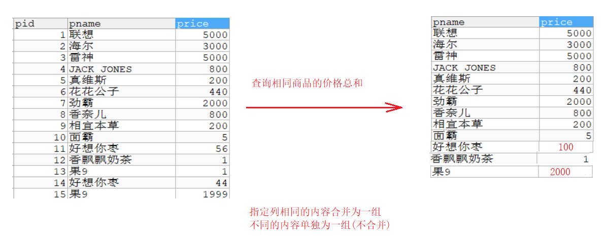
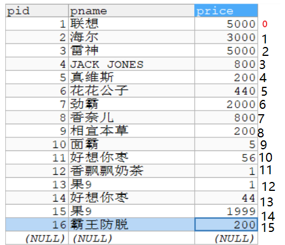
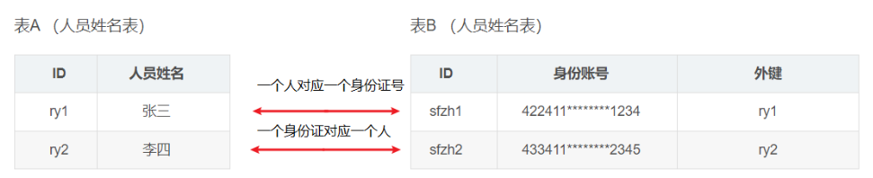
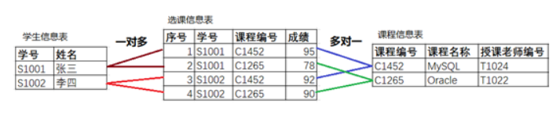
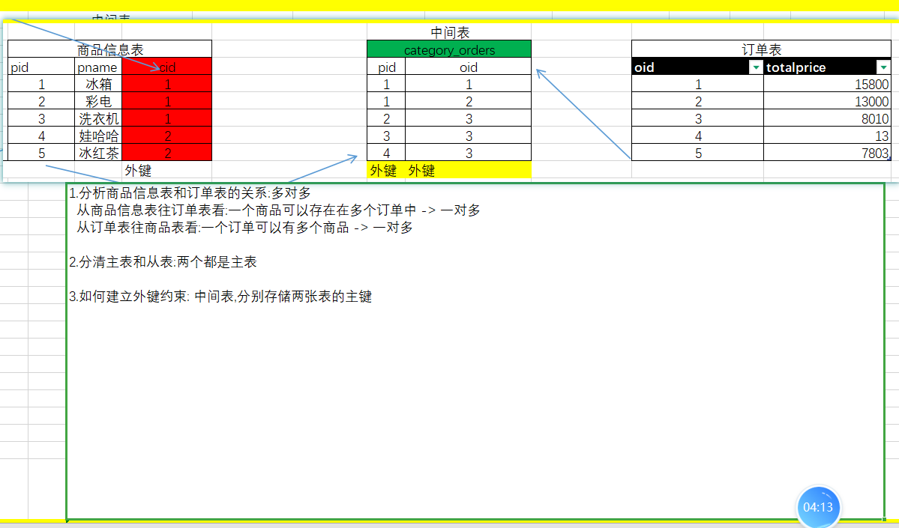
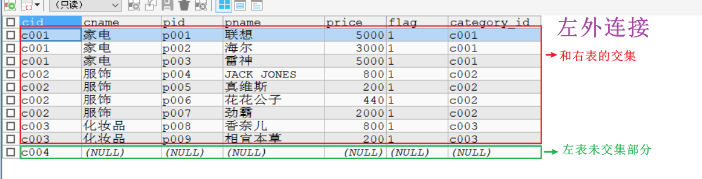
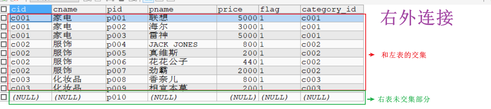
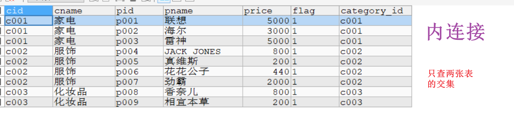
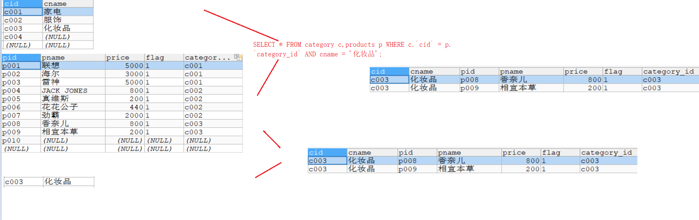

# day02-查询

```java
课前回顾:
 1.创建库:create database `库名`
 2.删除库:drop database `库名`
 3.创建表:
   create table `表名`(
     列名 类型 (长度) [约束],
     列名 类型 (长度) [约束],
     列名 类型 (长度) [约束]  
   );
 4.删除表:drop table `表名`
 5.修改表结构: alter table
 6.添加数据:
   insert into `表名` (`列名`,`列名`) values (值1,值2);
   insert into `表名` (`列名`,`列名`) values (值1,值2),(值1,值2),(值1,值2);
   insert into `表名` values (值1,值2); -> 填写的值需要匹配所有列
 7.删除数据:
   delete from 表名 [where条件]
 8.修改数据:
   update 表名 set 列名 = 新值 [where条件]
 9.约束:
   a.主键约束: primary key  一张表都应该有一个主键列
   b.自增长: auto_increment -> 编号数据库自动管理
   c.非空约束: not null
   d.唯一约束: unique

今日重点:
  a.只要关于查询的都是重点
  b.必须分清表和表之间的关系 : 一对一   一对多   多对多    
```

# 第一章.单表查询

```sql
#创建商品表：
create table product(
	pid int primary key,
	pname varchar(20),
	price double
);


INSERT INTO product(pid,pname,price) VALUES(1,'联想',5000);
INSERT INTO product(pid,pname,price) VALUES(2,'海尔',3000);
INSERT INTO product(pid,pname,price) VALUES(3,'雷神',5000);
INSERT INTO product(pid,pname,price) VALUES(4,'JACK JONES',800);
INSERT INTO product(pid,pname,price) VALUES(5,'真维斯',200);
INSERT INTO product(pid,pname,price) VALUES(6,'花花公子',440);
INSERT INTO product(pid,pname,price) VALUES(7,'劲霸',2000);
INSERT INTO product(pid,pname,price) VALUES(8,'香奈儿',800);
INSERT INTO product(pid,pname,price) VALUES(9,'相宜本草',200);
INSERT INTO product(pid,pname,price) VALUES(10,'面霸',5);
INSERT INTO product(pid,pname,price) VALUES(11,'好想你枣',56);
INSERT INTO product(pid,pname,price) VALUES(12,'香飘飘奶茶',1);
INSERT INTO product(pid,pname,price) VALUES(13,'果9',1);
```

## 1.简单查询

```sql
1.关键字: select  from 
2.语法:
  a.select * from 表名  -> 查询所有数据,*代表的是展示所有列
  b.select 列名,列名 from 表名 -> 查询所有数据,展示指定的列
  
3.注意:
  查询出来的结果都是以表的形式展示,我们可以和这个查询出来的结果称之为"伪表",这个"伪表"是只读的,不能改里面的数据
```

```mysql
-- 查询product所有数据 1


-- 查询product 所有数据,展示pname和pid 1


/*
  去重复值
  
  关键字: distinct(列名) 
*/


/*
  给列中的数据做计算
*/
-- 查询所有数据,给price列中所有的数据+100 1


/*
  给列和表取别名
  
  as 别名 1
  
  as可以省略
*/


-- 也可以给表取别名,但是不涉及到多表查询,给表取别名看不出效果来

```

```sql
-- 查询product所有数据
SELECT * FROM product;
-- 查询product 所有数据,展示pname和pid
SELECT pid,pname FROM product;
/*
  去重复值
  
  关键字: distinct(列名)
*/
SELECT DISTINCT(price) FROM product;

/*
  给列中的数据做计算
*/
-- 查询所有数据,给price列中所有的数据+100
SELECT pid,pname,price+100 FROM product;

/*
  给列和表取别名
  
  as 别名
  
  as可以省略
*/
SELECT pid,pname,price+100 `price` FROM product;


-- 也可以给表取别名,但是不涉及到多表查询,给表取别名看不出效果来
SELECT * FROM product `p`;
```

## 2.条件查询

```sql
1.格式:
  select 列名 from 表名 where 条件
```

| **比较运算符** | > <  <=  >=   =  <>   | 大于、小于、大于(小于)等于、不等于                           |
| -------------- | --------------------- | ------------------------------------------------------------ |
|                | BETWEEN  ...AND...    | 显示在某一区间的值(含头含尾)                                 |
|                | 字段 IN(set)          | 显示在in列表中的值，例：price in(100,200)  查询id为1,3,7的商品: id  in(1,3,7) |
|                | 列名 LIKE ‘张pattern’ | 模糊查询，Like语句中，% 代表零个或多个任意字符，_ 代表一个字符， 例如：`first_name like '_a%';`   <br/>比如:查询姓张的人:name like '张%'<br> 查询商品名中带香的商品: pname like '%香%'<br>查询第二个字为想的商品: like '_想%'<br>查询商品名为四个字的商品:like '____' |
|                | IS NULL               | 判断是否为空    不为空的就是 IS NOT NULL                     |
| **逻辑运行符** | and  (与)             | 多个条件同时成立  全为true,整体才为true                      |
|                | or(或)                | 多个条件任一成立   有真则真                                  |
|                | not(非)               | 不成立，例：`where not(salary>100); `                        |

```mysql
-- 查询商品名为'花花公子'的商品所有信息
1

-- 查询价格为800的商品
1

-- 查询商品价格大于60元的所有商品信息
1

-- 查询商品价格在200-1000之间的所有商品信息
1


-- 查询商品价格是200或者800的商品
1

-- 查询以'香'开头的商品
1

-- 查询含有'霸'的商品
1

-- 查询商品名为NULL的
1

-- 查询商品名不为NULL的
1
```

```sql
-- 查询商品名为'花花公子'的商品所有信息
SELECT * FROM product WHERE pname = '花花公子';
-- 查询价格为800的商品
SELECT * FROM product WHERE price = 800;
-- 查询商品价格大于60元的所有商品信息
SELECT * FROM product WHERE price>60;
-- 查询商品价格在200-1000之间的所有商品信息
SELECT * FROM product WHERE price BETWEEN 200 AND 1000;

SELECT * FROM product WHERE price>=200 AND price<=1000;

-- 查询商品价格是200或者800的商品
SELECT * FROM product WHERE price = 200 OR price = 800;
SELECT * FROM product WHERE price IN (200,800);

-- 查询以'香'开头的商品
SELECT * FROM product WHERE pname LIKE '香%';

-- 查询含有'霸'的商品
SELECT * FROM product WHERE pname LIKE '%霸%';

-- 查询商品名为NULL的
SELECT * FROM product WHERE pname IS NULL;

-- 查询商品名不为NULL的
SELECT * FROM product WHERE pname IS NOT NULL;
```

## 3.排序查询

```sql
1.关键字: order by
2.语法:
  select 列名 from 表名 order by 排序列名 asc|desc
3.asc和desc解释:
  asc:升序(默认的)
  desc:降序
4.问题:
  先查询,还是先排序
  
  一定是先查询,最后排序
```

```mysql
书写sql语句关键字的顺序
select （列）
from 	（表）
where 	（范围）
group by （分组）
having 	（类似where）
order by	（排序）

执行顺序:
from 
where 
group by 
having 
select 
order by

先定位到要查询哪个表,然后根据什么条件去查,表确定好了,条件也确定好了,开始利用select查询
查询得出一个结果,在针对这个结果进行一个排序
```

```mysql
-- 使用价格排序(降序)
1

-- 使用价格排序(升序)
1

-- 显示商品的价格(去重复),并排序(降序)
1
```

```sql
-- 使用价格排序(降序)
SELECT * FROM product ORDER BY price DESC;


-- 使用价格排序(升序)
SELECT * FROM product ORDER BY price ASC;


-- 显示商品的价格(去重复),并排序(降序)
SELECT DISTINCT(price) FROM product ORDER BY price DESC;
```

## 4.聚合查询

```mysql
1.特点:纵向查询-> 操作指定列

2.需要聚合函数: 聚合函数查询结果是单值
  count(*) 统计总记录数
  sum(列名) 对指定列求和
  avg(列名) 对指定列求平均值
  max(列名) 对指定列求最大值
  min(列名) 对指定列求最小值
  
3.语法: 只要用函数,都放到select后面
  select 聚合函数(列名) from 表名 where 条件
```

```mysql
-- 统计product的总记录数
1

-- 查询所有商品的价格总和
1

-- 查询pid为1,3,7 商品的价格平均值
1


-- 查询商品的最高价格以及最低价格
1

#================================
CREATE TABLE person(
  pid INT,
  pname VARCHAR(10)
);

SELECT COUNT(*) FROM person;  # 不管有没有null,将所有数据都统计出来

SELECT COUNT(pid) FROM person; # 如果指定的列有NULL,不记录
```

```sql
-- 统计product的总记录数
SELECT COUNT(*) FROM product;


-- 查询所有商品的价格总和
SELECT SUM(price) FROM product;


-- 查询pid为1,3,7 商品的价格平均值
SELECT AVG(price) FROM product WHERE pid IN(1,3,7);


-- 查询商品的最高价格以及最低价格
SELECT MIN(price) `minprice`,MAX(price) `maxprice` FROM product;

#================================
CREATE TABLE person(
  pid INT,
  pname VARCHAR(10)
);

SELECT COUNT(*) FROM person;  # 不管有没有null,将所有数据都统计出来

SELECT COUNT(pid) FROM person; # 如果指定的列有NULL,不记录
```

## 5.分组查询

```mysql
1.关键字: group by
2.语法:
  select 聚合函数(列名) from 表名 group by 分组列 having 条件
3.注意: 分组查询都是和聚合函数一起使用
4.分析按照那一列分组: 
  相同的合并为一组
  不同的单独为一组
  
```

```mysql
书写sql语句关键字的顺序:偏向的是关键字
select 
from 
where 
group by 
having 
order by

执行顺序:偏向的是逻辑
from 
where 
group by 
having 
select 
order by

先定位到要查询哪个表,然后根据什么条件去查,表确定好了,条件也确定好了,开始利用select查询
查询得出一个结果,在针对这个结果进行一个排序
```

```sql
-- 查询相同商品的价格总和
0

-- 查询相同商品的价格总和并排序
1

-- 查询相同商品的价格总和,再展示出价格总和大于等于2000的商品

```

```sql
-- 查询相同商品的价格总和
SELECT pname,SUM(price) FROM product GROUP BY pname;

-- 查询相同商品的价格总和并排序
SELECT pname,SUM(price) FROM product GROUP BY pname ORDER BY price DESC;

/*
  以上sql语句不好使
  
  原因是:我们都是先查询,最后排序
  我们会先做一个分组查询,查询出一个伪表来
  然后针对伪表进行排序
  但是伪表中价格列不叫price,叫做SUM(price)
  所以我们排序的时候要按照SUM(price)来排序
*/
SELECT pname,SUM(price) FROM product GROUP BY pname ORDER BY SUM(price) DESC;

SELECT pname,SUM(price) `newprice` FROM product GROUP BY pname ORDER BY `newprice` DESC;

-- 查询相同商品的价格总和,再展示出价格总和大于等于2000的商品
SELECT pname,SUM(price) `newprice` FROM product GROUP BY pname WHERE `newprice` >= 2000;

/*
  以上sql有问题
  因为where要在group by关键字之前
*/
SELECT pname,SUM(price) `newprice` FROM product WHERE `newprice` >= 2000 GROUP BY pname;

/*
  从执行顺序上来看,先走where再走select语句
  在执行where的时候newprice这个别名产生了嘛?-> 没有产生
*/

SELECT pname,SUM(price) `newprice` FROM product WHERE `price` >= 2000 GROUP BY pname;

/*
  以上sql有问题,分组查询之后果9是2000,但是结果没有果9
  原因:走where的时候还没有真正的分组查询呢
       没有分组查询之前,有两个果9(没合并)
       一个果9是1块钱;一个果9是1999
       所以先执行where的时候直接将两个果9排除了
       
  解决:我们应该找一个关键字,从书写顺序和执行顺序上都在分组查询之后去晒选条件
       关键字:having
            
*/
SELECT pname,SUM(price) `newprice` FROM product GROUP BY pname HAVING `newprice` >= 2000;

```



## 6.分页查询

```mysql
1.语法:
  select * from 表名 limit m,n
  
2.字母代表啥:
  m:每页的起始位置
  n:每页显示条数
3.小技巧:
  我们将整个表的每一条数据进行编号,从0开始
  
4.每页的起始位置快速算法:
  (当前页-1)*每页显示条数
  
  当前页 -> 第几页
  
5.其他分页参数:
  a.每页的起始位置:
    (当前页-1)*每页显示条数
  b.int curPage = 2; -- 当前页数
  c.int pageSize = 5; -- 每页显示数量
  d.int startRow = (curPage - 1) * pageSize; -- 当前页, 记录开始的位置(行数)计算
  
  e.int totalSize = select count(*) from products; -- 记录总数量
  f.int totalPage = Math.ceil(totalSize * 1.0 / pageSize); -- 总页数
                总页数 = (总记录数/每页显示条数)向上取整
```

```mysql
-- select * from 表名 limit m,n

-- 第一页
SELECT * FROM product LIMIT 0,5;

-- 第二页
SELECT * FROM product LIMIT 5,5;

-- 第三页
SELECT * FROM product LIMIT 10,5;

-- 第四页
SELECT * FROM product LIMIT 15,5;

```



# 第二章.数据库的备份与还原

## 1.用命令去操作数据库的备份与还原

### 1.1.命令操作备份

```mysql
mysqldump  -u用户名 -p密码 数据库名>生成的脚本文件路径

生成的脚本文件路径:指定备份的路径,写路径时最后要指明备份的sql文件名,命令后不要加;
```

### 1.2.命令操作还原

```mysql
mysql  -uroot  -p密码 数据库名 < 文件路径

注意:我们利用命令备份出来的sql文件中没有单独创建数据库的语句,所以如果利用命令去还原的话,需要我们自己手动先创建对应的库
    命令后不要加;
```

## 2.利用点击去操作数据库的备份与还原

### 2.1.利用点击去备份


### 2.2.利用点击去还原


# 第三章.数据库三范式

```java
好的数据库设计对数据的存储性能和后期的程序开发，都会产生重要的影响。建立科学的，规范的数据库就需要满足一些规则来优化数据的设计和存储，这些规则就称为范式。
```

## 1第一范式: **确保每列保持原子性**

第一范（1NF）式是最基本的范式。如果数据库表中的所有字段值都是不可分解的原子值，就说明该数据库表满足了第一范式。

第一范式的合理遵循需要根据系统的实际需求来定。比如某些数据库系统中需要用到“地址”这个属性，本来直接将“地址”属性设计成一个数据库表的字段就行。但是如果系统经常会访问“地址”属性中的“城市”部分，那么就非要将“地址”这个属性重新拆分为省份、城市、详细地址等多个部分进行存储，这样在对地址中某一部分操作的时候将非常方便。这样设计才算满足了数据库的第一范式，如下表所示。


如果不遵守第一范式，查询出数据还需要进一步处理（查询不方便）。遵守第一范式，需要什么字段的数据就查询什么数据（方便查询）

```java
列名:详细地址手机号
     
    北京市昌平区北七家镇宏福苑小区19号楼1501087xxxx -> 不行,因为数据可以拆分,不符合第一范式原子性
```

## 2 第二范式: **确保表中的每行都能唯一区分**

第二范式（2NF)第二范式（2NF）是在第一范式（1NF）的基础上建立起来的，即满足第二范式（2NF）必须先满足第一范式（1NF）。第二范式（2NF）要求数据库表中的每个实例或行必须可以被惟一的区分。为实现区分通常需要为表加上一个列，以存储各个实例的惟一标识。

它要求：

> **跟“整个主键”没关系的信息，不能放在这张表里！**
>
> **第二范式就是：不要把“只跟主键一部分有关”的信息，塞进一张以“多个字段当主键”的表里。要拆开，避免重复和混乱！**

## 3 第三范式: **3NF:非主键字段不能相互依赖**

假设有一个员工表，其中包含员工ID（主键）、员工姓名、部门名称和部门负责人。在这里，“部门负责人”依赖于“部门名称”，而“部门名称”又依赖于“员工ID”，因此“部门负责人”传递依赖于“员工ID”。这不符合3NF。需要将部门相关信息拆分到另一个表中，例如一个独立的部门表。（==说白了部门表是部门表，员工表是员工表，把他两拆开，不要放在一起，后续有外键约束将二者联系起来==）

通过逐步满足这三个范式，可以设计出更加规范化、减少冗余和依赖关系的数据库结构，从而提高数据的完整性和查询效率。  

# 第四章.多表之间的关系（选定一个数据看）

在关系数据库管理系统中，很多表之间是有关系的，表之间的关系分为一对一关系、一对多关系和多对多关系。

## 4.1.一对一

该关系中第一个表中的一个行只可以与第二个表中的一个行相关，且第二个表中的一个行也只可以与第一个表中的一个行相关。

例如，"人员信息表","身份证表",一个人只能有一个身份证号,反过来一个身份证号只能对应一个人



## 4.2.一对多

==第一个表中的一个行可以与第二个表中的一个或多个行相关，但第二个表中的一个行只可以与第一个表中的一个行相关==。(正着看一对多，倒着看一对一)

例如，“商品分类表”和“商品信息表”。一个商品分类对应多个商品,反过来一个商品只属于一个分类,形成了一对多


## 4.3.多对多

该关系中第一个表中的一个行可以与第二个表中的一个或多个行相关。第二个表中的一个行也可以与第一个表中的一个或多个行相关。通常两个表的多对多关系会借助第三张表，转换为两个一对多的关系。

例如，选课系统的“学生信息表”和“课程信息表”是多对多关系。一个学生可以选择多门课，一门课程可以被多个学生选择，即“学生信息表”中一条记录可以与“课程信息表”多条记录对应，反过来“课程信息表”的一条记录也可以与“学生信息表”中多条记录对应。它们之间借助第三张“选课信息表”实现关联关系，而“学生信息表”与“选课信息表”是一对多关系，“课程信息表”与“选课信息表”也是一对多关系。“选课信息表”中“学号”字段与“学生信息表”中“学号”字段意义相同。“课程信息表”中“课程编号”字段与“课程信息表”中“课程编号”字段意义相同。



> 一对一:
>
> ​    正着看,倒着看都是一对一
>
> 一对多:
>
> ​    正着看一对多,倒着看一对一
>
> 多对多:
>
> ​     正着看一对多,倒着看一对多

# 第五章.创建外键约束

```java
创建外键约束的原因:表和表之间是有联系的,那么将来有联系的表应该有数据约束,比如:
两张表:
   商品分类表   商品信息表  -> 比如有蔬菜分类,那么商品表中可以有黄瓜,西红柿,茄子,土豆等
                            但是没有水果分类,那么商品表中不能有水果相关的
       
默认情况下两张独立的表谁也不能限制谁->所以只有创建了外键约束,一张表中的数据才会限制另外一张表       
```

# 第五章.创建外键约束

```mysql
格式:alter table 从表 add [constraint 外键名称(自定义)] foreign key 从表(外键列名) references 主表(主键列名)
```

## 1.一对多的表创建外键约束

```java
1.分析商品分类表和商品信息表的关系:一对多
   从分类表往商品信息表看:一个分类对应多个商品 -> 一对多
   从商品表往分类表看:一个商品只对应一个分类 -> 一对一

2.要分清主表和从表:假设如果这张表建立约束之后,谁限制谁?
  如果分类表和商品表之间将来建议约束,分类表中的数据会限制商品表中的数据
  所以分类表为主表,信息表为从表

3.如果没有建立约束,两张独立的表不会相互制约,只有建立了外键约束,表中的数据才会制约
   首先我们应该创建一个外键列,而外键列一般都放到从表中,存储主表的主键
```


```mysql
    #商品分类表->主表    
    CREATE TABLE category (
      cid VARCHAR(32) PRIMARY KEY ,
      cname VARCHAR(50)
    );

    #商品表->从表
    CREATE TABLE products(
      pid VARCHAR(32) PRIMARY KEY ,
      pname VARCHAR(50),
      price DOUBLE,
      category_id VARCHAR(32)-- 外键  存储的是主表的主键内容
    );  
    
    /*
     格式:alter table 从表 add [constraint 外键名称(自定义)] foreign key 从表(外键列名) 
          references 主表(主键列名)    
    */
    
    ALTER TABLE products ADD CONSTRAINT cp1 FOREIGN KEY products(category_id) REFERENCES category(cid);
    
            
```


## 2.多对多的表创建外键约束



```mysql
# 订单表 -> 主表
 CREATE TABLE `orders`(
  `oid` VARCHAR(32) PRIMARY KEY ,
  `totalprice` DOUBLE 	#总计
  );
   
#订单项表->中间表->从表
CREATE TABLE orderitem(
  pid VARCHAR(50),-- 商品id->外键
  oid VARCHAR(50)-- 订单id ->外键
);

```


> 将来开发一般不会上来就创建外键约束,不方便我们用测试数据测试功能;都是测试完毕,最后建立外键约束

# 第六章.多表查询

数据准备

```mysql
    # 分类表
    CREATE TABLE category (
      cid VARCHAR(32) PRIMARY KEY ,
      cname VARCHAR(50)
    );

    #商品表
    CREATE TABLE products(
      pid VARCHAR(32) PRIMARY KEY ,
      pname VARCHAR(50),
      price DOUBLE,
      flag VARCHAR(2), #是否上架标记为：1表示上架、0表示下架
      category_id VARCHAR(32), -- 外键
      CONSTRAINT products_fk FOREIGN KEY (category_id) REFERENCES category (cid)
    );
    #分类
INSERT INTO category(cid,cname) VALUES('c001','家电');
INSERT INTO category(cid,cname) VALUES('c002','服饰');
INSERT INTO category(cid,cname) VALUES('c003','化妆品');
#商品
INSERT INTO products(pid, pname,price,flag,category_id) VALUES('p001','联想',5000,'1','c001');
INSERT INTO products(pid, pname,price,flag,category_id) VALUES('p002','海尔',3000,'1','c001');
INSERT INTO products(pid, pname,price,flag,category_id) VALUES('p003','雷神',5000,'1','c001');

INSERT INTO products (pid, pname,price,flag,category_id) VALUES('p004','JACK JONES',800,'1','c002');
INSERT INTO products (pid, pname,price,flag,category_id) VALUES('p005','真维斯',200,'1','c002');
INSERT INTO products (pid, pname,price,flag,category_id) VALUES('p006','花花公子',440,'1','c002');
INSERT INTO products (pid, pname,price,flag,category_id) VALUES('p007','劲霸',2000,'1','c002');

INSERT INTO products (pid, pname,price,flag,category_id) VALUES('p008','香奈儿',800,'1','c003');
INSERT INTO products (pid, pname,price,flag,category_id) VALUES('p009','相宜本草',200,'1','c003');
```

## 1.交叉查询

```mysql
1.语法: select 列名 from 表A,表B
```

```mysql
-- 查询所有商品的具体信息
SELECT * FROM category,products;

SELECT * FROM category,products WHERE category.cid = products.category_id;

-- 给表取别名
SELECT * FROM category c,products p WHERE c.cid = p.category_id;
```


## 2.内连接查询

**“显式内连接”和“隐式内连接”效果完全一样，只是写法不同。**

on的作用是告诉数据库:两张表怎么关联

> 但 **推荐用显式（`JOIN ... ON`）**，因为更清晰、更安全、更现代！

```mysql
1.关键字: inner join on  -> inner可以省略

2.分类:
  a.显示内连接:select 列名 from 表A join 表B on 条件 
  b.隐式内连接:select 列名 from 表A,表B where 条件 
```

```mysql
-- 查询具体的商品信息->隐式内连接
1

-- 查询具体的商品信息->显示内连接
1

-- 用显示内连接的方式查询"化妆品"的商品信息
1
```

```sql
-- 查询具体的商品信息->隐式内连接
SELECT * FROM category c,products p WHERE c.cid = p.category_id;

-- 查询具体的商品信息->显示内连接
SELECT * FROM category c JOIN products p ON c.`cid` = p.`category_id`;

-- 用显示内连接的方式查询"化妆品"的商品信息

/*
   on 条件1 and 条件2  -> 条件1和条件2是一个大条件
   on 条件1 where 条件2 -> 两个条件
*/
SELECT * FROM category c JOIN products p ON c.`cid` = p.`category_id` AND c.`cname` = '化妆品'

SELECT * FROM category c JOIN products p ON c.`cid` = p.`category_id` WHERE c.`cname` = '化妆品'
```

## 3.外连接

```mysql
1.关键字:outer join on -> outer可以省略
2.分类:
  a.左外连接: select 列名 from 表A left join 表B on 条件
  b.右外连接: select 列名 from 表A right join 表B on 条件
3.区分左表和右表
  join左边的就是左表
  join右边的就是右表
  
4.左外连接和右外连接以及内连接区别:
  a.左外连接:查询的是和右表的交集,以及左边的全部
  b.右外连接:查询的是和左表的交集,以及右表的全部
  c.内连接:查询的是两张表的交集
```

```mysql
-- 查询所有的商品信息 左外连接
1

-- 查询所有的商品信息 右外连接
1

-- 查询所有的商品信息内连接
1
```

```sql
-- 查询所有的商品信息 左外连接
SELECT * FROM category c LEFT JOIN products p ON c.`cid` = p.`category_id`;

-- 查询所有的商品信息 右外连接
SELECT * FROM category c RIGHT JOIN products p ON c.`cid` = p.`category_id`;

-- 查询所有的商品信息内连接
SELECT * FROM category c,products p WHERE c.`cid` = p.`category_id`;
```









## 4.union联合查询实现全外连接查询（了解）

```java
首先要明确，联合查询不是多表连接查询的一种方式。联合查询是将多条查询语句的查询结果合并成一个结果并去掉重复数据。
全外连接查询的意思就是将左表和右表的数据都查询出来，然后按照连接条件连接
    
只要将两个结果一连接,左表和右表没有交叉的部分也就都查出来了
```

```java
1.union的语法:
  查询语句1 union 查询语句2 union 查询语句3 ...
```

```mysql
-- 查询所有的商品信息 左外连接
SELECT * FROM category c LEFT JOIN products p ON c.`cid` = p.`category_id`;

-- 查询所有的商品信息 右外连接
SELECT * FROM category c RIGHT JOIN products p ON c.`cid` = p.`category_id`;

-- 查询所有的商品信息内连接
SELECT * FROM category c,products p WHERE c.`cid` = p.`category_id`;


-- 全外连接

SELECT * FROM category c LEFT JOIN products p ON c.`cid` = p.`category_id`

UNION

SELECT * FROM category c RIGHT JOIN products p ON c.`cid` = p.`category_id`;
```

## 5.子查询

```mysql
一条查询语句作为另外一条查询语句的条件使用
```

```mysql
-- 查询products表中'化妆品'的商品信息
1

-- 查询products表中化妆品和家电的商品信息
1
```

```sql
-- 查询products表中'化妆品'的商品信息
SELECT * FROM products WHERE category_id = 'c003'; 

/*
  单纯看products表我们不知道c003到底代表是啥
  因为c003是从category中得来的
  所以c003需要从category表中确定,是否为化妆品
*/
-- 先从categroy表中查询出化妆品对应的cid
SELECT cid FROM category WHERE cname = '化妆品';

-- 将以上的查询结果当成条件使用
SELECT * FROM products WHERE category_id = (SELECT cid FROM category WHERE cname = '化妆品');

-- 查询products表中化妆品和家电的商品信息
SELECT * FROM products WHERE category_id IN ('c001','c003');

-- 将c001和c003从category表中查询出来,当成条件使用
SELECT cid FROM category WHERE cname IN ('家电','化妆品');

SELECT * FROM products WHERE category_id IN (SELECT cid FROM category WHERE cname IN ('家电','化妆品'));
```

## 6.子查询作为伪表使用

```mysql
1.查询语句的结果是一张伪表,这个伪表也可以当成一个表和其他的表做查询
```

```mysql
-- 查询化妆品的所有商品信息
1
-- 查询所有化妆品和家电的商品信息

```

```sql
-- 查询化妆品的所有商品信息
SELECT * FROM category c,products p WHERE c.`cid` = p.`category_id` AND cname = '化妆品';

-- 先将化妆品从category中查询出来
SELECT * FROM category WHERE cname = '化妆品';

SELECT * FROM (SELECT * FROM category WHERE cname = '化妆品') c,products p WHERE c.`cid` = p.`category_id`;

-- 查询所有化妆品和家电的商品信息

-- 先查询家电和化妆品
SELECT * FROM category WHERE cname IN('化妆品','家电');

SELECT * FROM (SELECT * FROM category WHERE cname IN('化妆品','家电')) c,products p WHERE c.`cid` = p.`category_id`;

```



# 第七章.sql练习

## 1.创建数据库

```mysql
CREATE DATABASE mytest01;
USE mytest01;
```

## 2.创建表以及添加数据

```mysql
# 创建部门表dept  部门表中包含 部门id 部门名称  
CREATE TABLE dept(
  id INT PRIMARY KEY AUTO_INCREMENT,
  NAME VARCHAR(20)
)

INSERT INTO dept (NAME) VALUES ('开发部'),('市场部'),('财务部');  
```

```mysql
# 创建员工表
CREATE TABLE emp (
  id INT PRIMARY KEY AUTO_INCREMENT,
  NAME VARCHAR(10),
  gender CHAR(1),   -- 性别
  salary DOUBLE,   -- 工资
  join_date DATE,  -- 入职日期
  dept_id INT,
  FOREIGN KEY (dept_id) REFERENCES dept(id) -- 外键，关联部门表(部门表的主键)
)  

INSERT INTO emp(NAME,gender,salary,join_date,dept_id) VALUES('小松松','男',7200,'2013-02-24',1);
INSERT INTO emp(NAME,gender,salary,join_date,dept_id) VALUES('鱼小鱼','女',3600,'2015-12-02',2);
INSERT INTO emp(NAME,gender,salary,join_date,dept_id) VALUES('小霈霈','男',8000,'2013-12-02',3);
INSERT INTO emp(NAME,gender,salary,join_date,dept_id) VALUES('亮仔','男',5000,'2017-11-11',2);
INSERT INTO emp(NAME,gender,salary,join_date,dept_id) VALUES('坤仔','男',8000,'2012-02-02',1);
INSERT INTO emp(NAME,gender,salary,join_date,dept_id) VALUES('福姐','女',6500,'2011-09-12',3);
INSERT INTO emp(NAME,gender,salary,join_date,dept_id) VALUES('熊姐','女',10500,'2018-12-02',3);
INSERT INTO emp(NAME,gender,salary,join_date,dept_id) VALUES('猛哥','男',9500,'2016-07-08',2);
INSERT INTO emp(NAME,gender,salary,join_date,dept_id) VALUES('栋栋','男',8500,'2018-06-28',2);
```

## 3.练习

-- 1.查询员工和部门的名字
-- 2.查询鱼小鱼的信息，显示员工id，姓名，性别，工资和所在的部门名称(使用显式内连接)
-- 3.将上面查到的内容 表头使用别名的形式展示 比如显示id为员工id  name为姓名 等
-- 4.在部门表中增加一个销售部 
-- 5.==查询所有的部门信息关联查询出该部门中的所有员工信息== 
-- 6.查询所有的部门信息关联查询出该部门中的所有员工的名字  部门 以及 工资 
-- 7.统计出 每个部门的员工人数   查询显示 部门名称 人数 
-- 8.统计出 每个部门员工 平均薪资 按照 薪资排序 查询显示 部门名称 平均薪资 
-- 9.==统计出，每个部门的平均薪资 按照薪资排序 并且筛选出平均薪资>7000的部门==
-- 10.==查询最高工资是多少==
-- 11.==根据最高工资到员工表查询到对应的员工信息==
-- 12.查询工资小于平均工资的员工有哪些
-- 13.==查询工资大于5000的员工，来自于哪些部门的名字==  
-- 14.查询开发部与财务部所有的员工信息
-- 15.==查询出2011年以后入职的员工信息，包括部门名称==


```mysql
-- 1.查询员工和部门的名字
SELECT emp.`name`, dept.`name` FROM emp,dept WHERE emp.`dept_id` = dept.`id`;
```

```mysql
-- 2.查询鱼小鱼的信息，显示员工id，姓名，性别，工资和所在的部门名称(使用显式内连接)
SELECT * FROM emp e INNER JOIN dept d ON e.`dept_id` = d.`id` WHERE e.`name`='鱼小鱼';
```

```mysql
-- 3.将上面查到的内容 表头使用别名的形式展示 比如显示id为员工id  name为姓名 等
SELECT e.id 编号,e.name 姓名,e.gender 性别,e.salary 工资,d.name 部门名字 FROM emp e INNER JOIN dept d ON e.dept_id = d.id WHERE e.name='鱼小鱼';
```

```mysql
-- 4.在部门表中增加一个销售部 
INSERT INTO dept (NAME) VALUES ('销售部');
SELECT * FROM dept;
```

```mysql
-- 5.查询所有的部门信息关联查询出该部门中的所有员工信息 
SELECT * FROM dept d LEFT JOIN emp e ON d.`id` = e.`dept_id`;
```

```mysql
-- 6.查询所有的部门信息关联查询出该部门中的所有员工的名字  部门 以及 工资 
SELECT e.name 姓名,d.name 部门, e.salary 工资 FROM dept d LEFT JOIN emp e ON d.id = e.dept_id;
```

```mysql
-- 7.统计出 每个部门的员工人数   查询显示 部门名称 人数 
SELECT d.name 部门,COUNT(e.name) 人数 FROM dept d LEFT JOIN emp e ON d.id = e.dept_id GROUP BY d.name;
```

```mysql
-- 8.统计出 每个部门员工 平均薪资 按照 薪资排序 查询显示 部门名称 平均薪资 
SELECT d.name 部门,AVG(e.salary) `平均薪资` FROM dept d LEFT JOIN emp e ON d.id = e.dept_id GROUP BY d.name ORDER BY salary;
```

```mysql
-- 9.统计出，每个部门的平均薪资 按照薪资排序 并且筛选出平均薪资>7000的部门
SELECT d.name 部门,AVG(e.salary) 人数 FROM dept d LEFT JOIN emp e ON d.id = e.dept_id 
GROUP BY d.name HAVING AVG(e.salary)>7000 ORDER BY salary;
```

```mysql
-- 10.查询最高工资是多少
SELECT MAX(salary) FROM emp;
```

```mysql
-- 11.根据最高工资到员工表查询到对应的员工信息
SELECT * FROM emp WHERE salary=(SELECT MAX(salary) FROM emp)
```

```mysql
-- 12.查询工资小于平均工资的员工有哪些
SELECT * FROM emp WHERE salary < (SELECT AVG(salary) FROM emp);
```

```mysql
-- 13.查询工资大于5000的员工，来自于哪些部门的名字  
 SELECT dept.name FROM dept WHERE dept.id IN (SELECT dept_id FROM emp WHERE salary > 5000
```

```mysql
-- 14.查询开发部与财务部所有的员工信息
SELECT * FROM emp WHERE dept_id IN (SELECT id FROM dept WHERE NAME IN('开发部','财务部'));
```

```mysql
-- 15.查询出2011年以后入职的员工信息，包括部门名称
SELECT * FROM dept d, (SELECT * FROM emp WHERE join_date > '2011-1-1') e WHERE e.dept_id = d.id;
```

# SQL 查询的执行顺序（重点！）

理解这个问题的核心是记住 **SQL 子句的实际执行顺序**（不是书写顺序）：

| 步骤 | 子句                                  | 作用阶段                               |
| ---- | ------------------------------------- | -------------------------------------- |
| 1    | `FROM`                                | 确定数据来源（包括 JOIN）              |
| 2    | `ON`                                  | 过滤 JOIN 的匹配条件                   |
| 3    | `WHERE`                               | 过滤行（在分组前）                     |
| 4    | `GROUP BY`                            | 将数据分组                             |
| 5    | **聚合函数计算**（如 `AVG`, `COUNT`） |                                        |
| 6    | `HAVING`                              | **过滤分组后的结果**（可使用聚合函数） |
| 7    | `SELECT`                              | 选择要显示的列                         |
| 8    | `ORDER BY`                            | 排序                                   |
| 9    | `LIMIT`                               | 限制返回行数                           |

HAVING 和GROUP BY合用
