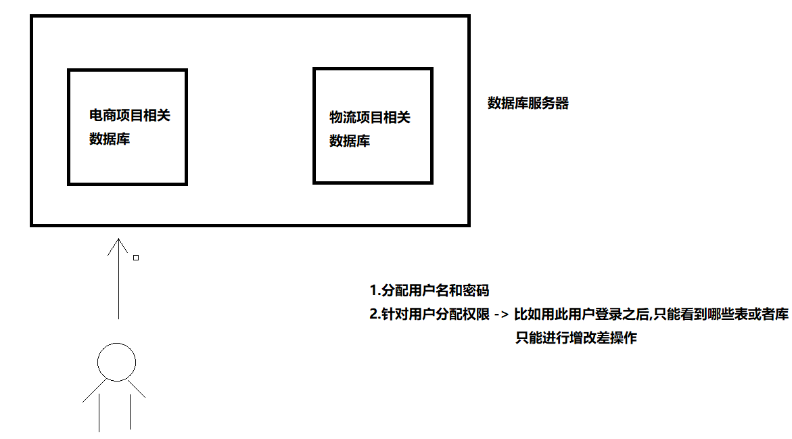

# day03.函数_jdbc

```mysql
课前回顾:
 1.简单查询: select 列名 from 表名
 2.条件查询: select 列名 from 表名 where 条件
 3.条件:
   a.比较运算符
   b.and or not
   c.between...and...
   d.列名 like ''
   e.列名 in(数据)
 4.排序查询: order by
   a.desc:降序
   b.asc:升序
 5.分组查询: group by 分组列名 having 条件
 6.聚合查询:
   count sum avg max min
 7.分页: limit m,n
   a.每页起始位置:(当前页-1)*每页显示条数
 8.多表查询:
   a.交叉查询: select 列名 from 表A,表B -> 笛卡尔乘积
   b.内连接:
     显示:表A join 表B on条件
     隐式:没有join on
   c.外连接:
     左外连接:left join on
     右外连接:right join on
   d.怎么区分左表和右表:看join
   e.左外连接,右外连接,内连接区别
     左:查询的是和右表的交集以及左表的全部
     右:查询的是和左表的交集以及右表的全部
     内:只查询交集
     
   f.子查询:
     一条查询语句作为另外一条查询语句的条件使用
     
今日重点:
  1.会使用字符串函数,判断函数
  2.从第三章开始到最后所有
```

# 第一章.MySQL的常用函数

```java
函数:对指定列的数据进行操作
```

```sql
-- 用户表
CREATE TABLE t_user (
  id INT(11) NOT NULL AUTO_INCREMENT,
  uname VARCHAR(40) DEFAULT NULL,
  age INT(11) DEFAULT NULL,
  sex INT(11) DEFAULT NULL,
  PRIMARY KEY (id)
);

INSERT  INTO t_user VALUES (NULL,'zs',18,1);
INSERT  INTO t_user VALUES (NULL,'ls',20,0);
INSERT  INTO t_user VALUES (NULL,'ww',23,1);
INSERT  INTO t_user VALUES (NULL,'zl',24,1);
INSERT  INTO t_user VALUES (NULL,'lq',15,0);
INSERT  INTO t_user VALUES (NULL,'hh',12,0);
INSERT  INTO t_user VALUES (NULL,'wzx',60,NULL);
INSERT  INTO t_user VALUES (NULL,'lb',NULL,NULL);
```

##  1.字符串函数

### 1.1 字符串函数列表概览

| 函数                                  | 用法                                          |
| ------------------------------------- | --------------------------------------------- |
| CONCAT(S1,S2,......,Sn)               | 连接S1,S2,......,Sn为一个字符串               |
| CONCAT_WS(separator, S1,S2,......,Sn) | 连接S1一直到Sn，并且中间以separator作为分隔符 |
| UPPER(s) 或 UCASE(s)                  | 将字符串s的所有字母转成大写字母               |
| LOWER(s)  或LCASE(s)                  | 将字符串s的所有字母转成小写字母               |
| TRIM(s)                               | 去掉字符串s开始与结尾的空格                   |
| SUBSTRING(s,index,len)                | 返回从字符串s的index位置其len个字符           |

### 1.2 环境准备

```mysql
-- 用户表
CREATE TABLE t_user (
  id int(11) NOT NULL AUTO_INCREMENT,
  uname varchar(40) DEFAULT NULL,
  age int(11) DEFAULT NULL,
  sex int(11) DEFAULT NULL,
  PRIMARY KEY (id)
);
insert  into t_user values (null,'zs',18,1);
insert  into t_user values (null,'ls',20,0);
insert  into t_user values (null,'ww',23,1);
insert  into t_user values (null,'zl',24,1);
insert  into t_user values (null,'lq',15,0);
insert  into t_user values (null,'hh',12,0);
insert  into t_user values (null,'wzx',60,null);
insert  into t_user values (null,'lb',null,null);
```

### 1.3 字符串连接函数

字符串连接函数主要有2个：

| 函数或操作符                          | 描述                                     |
| ------------------------------------- | ---------------------------------------- |
| concat(str1, str2, ...)               | 字符串连接函数，可以将多个字符串进行连接 |
| concat_ws(separator, str1, str2, ...) | 可以指定间隔符将多个字符串进行连接；     |

练习1：使用concat函数显示出 你好uname 的结果

```mysql
/*
  concat(str1, str2, ...)
  字符串连接函数，可以将多个字符串进行连接
  
  concat_ws(separator, str1, str2, ...)->可以指定间隔符将多个字符串进行连接
*/
-- 拼接字符串练习 练习1：使用concat函数显示出 你好uname 的结果

SELECT id,CONCAT('你好',uname) uname,age,sex FROM t_user;
```

练习2：使用concat_ws函数显示出 你好,uname 的结果

```mysql
-- 练习2：使用concat_ws函数显示出 你好,uname 的结果
SELECT id,CONCAT_WS(',','你好',uname) uname,age,sex FROM t_user;
```

### 1.4 字符串大小写处理函数

字符串大小写处理函数主要有2个：

| 函数或操作符 | 描述              |
| ------------ | ----------------- |
| upper(str)   | 得到str的大写形式 |
| lower(str)   | 得到str的小写形式 |

练习1： 将字符串 hello 转换为大写显示

```mysql
-- 将hello转成大写
SELECT UPPER('hello');

-- 查询t_user,uname变成大写
SELECT id,UPPER(uname) uname,age,sex FROM t_user;

```

练习2：将字符串 heLLo 转换为小写显示

```mysql
-- 查询t_user,uname变成小写
SELECT id,LOWER(uname) uname,age,sex FROM t_user;
```

### 1.5 移除空格函数

可以对字符串进行按长度填充满、也可以移除空格符

| 函数或操作符 | 描述                  |
| ------------ | --------------------- |
| trim(str)    | 将str两边的空白符移除 |

练习1： 将用户id为9的用户的姓名的两边空白符移除

```mysql
-- 将用户id为9的用户的姓名的两边空白符移除
SELECT id,TRIM(uname) uname,age,sex FROM t_user WHERE id = 9;
```

### 1.6 子串函数

字符串也可以按条件进行截取，主要有以下可以截取子串的函数;

| 函数或操作符          | 描述                                                         |
| --------------------- | ------------------------------------------------------------ |
| substr()、substring() | 获取子串： 1：substr(str, pos) 、substring(str, pos)； 2：substr(str, pos, len)、substring(str, pos, len) |

```mysql
/*
  功能一样:
    substr(str, pos)
    substring(str, pos)
    
    str:要截取的字符串
    pos:从第几个字符开始截取
    
  功能一样  
    substr(str, pos, len)
    substring(str, pos, len)  
  
  str:要截取的字符串
  pos:从第几个字符开始截
  len:截多少个
*/

SELECT SUBSTRING('helloworld',2);

SELECT SUBSTRING('helloworld',2,2);
```

练习1：获取 hello,world 从第二个字符开始的完整子串

```mysql
自己写
```

练习2：获取 hello,world 从第二个字符开始但是长度为4的子串

```mysql
自己写
```

## 2.数值函数

### 2.1. 数值函数列表

| 函数     | 用法                  |
| -------- | --------------------- |
| ABS(x)   | 返回x的绝对值         |
| CEIL(x)  | 返回大于x的最小整数值 |
| FLOOR(x) | 返回小于x的最大整数值 |
| RAND()   | 返回0~1的随机值       |
| POW(x,y) | 返回x的y次方          |

### 2.2. 常用数值函数练习

```mysql
-- 练习1： 获取 -12 的绝对值
SELECT ABS(-12);

-- 练习2： 将 -11.2 向上取整
SELECT CEIL(-11.2);

-- 练习3： 将 1.6 向下取整
SELECT FLOOR(1.6);

-- 练习4： 获得2的2次幂的值
SELECT POW(2,2);

-- 练习5： 获得一个在0-100之间的随机数
SELECT RAND()*100;
```

## 3.日期函数

### 3.1 日期函数列表

| 函数                                                         | 用法                                                      |
| ------------------------------------------------------------ | --------------------------------------------------------- |
| **CURDATE()** 或 CURRENT_DATE()                              | 返回当前日期  年月日                                      |
| **CURTIME()** 或 CURRENT_TIME()                              | 返回当前时间  时分秒                                      |
| **NOW()** / SYSDATE() / CURRENT_TIMESTAMP() / LOCALTIME() / LOCALTIMESTAMP() | 返回当前系统日期时间                                      |
| DATEDIFF(date1,date2) / TIMEDIFF(time1, time2)               | 返回date1 - date2的日期间隔 / 返回time1 - time2的时间间隔 |

### 3.2 常用日期函数的练习

```mysql
-- 练习1：获取当前的日期(仅仅需要年月日)
SELECT CURDATE();

-- 练习2： 获取当前的时间（仅仅需要时分秒）
SELECT CURTIME();

-- 练习3： 获取当前日期时间（包含年月日时分秒）
SELECT NOW();

-- 练习4: 获取到10月1日还有多少天
SELECT DATEDIFF('2023-10-1',NOW());
```

## 4.流程函数_判断

| 函数                                                         | 用法                                         |
| ------------------------------------------------------------ | -------------------------------------------- |
| IF(比较,t ,f)                                                | 如果比较是真，返回t，否则返回f               |
| IFNULL(value1, value2)                                       | 如果value1不为空，返回value1，否则返回value2 |
| CASE WHEN 条件1 THEN result1 WHEN 条件2 THEN result2 .... [ELSE resultn] END | 相当于Java的if...else if...else...           |

* 练习1：获取用户的姓名、性别，如果性别为1则显示'男'，否则显示'女'；要求使用if函数查询：

  ```mysql
  SELECT uname,age,IF(sex=1,'男','女') sex FROM t_user;
  ```


* 练习2：获取用户的姓名、性别，如果性别为null则显示为0；要求使用ifnull函数查询：

  ```mysql
  SELECT uname,age,IFNULL(sex,0) sex FROM t_user;
  ```


* 练习3：如果age<=12,显示儿童,如果age<=18,显示少年,如果age<=40,显示中年,否则显示老年

  ```mysql
  SELECT uname,CASE WHEN age<=12 THEN '儿童' 
  WHEN age<=18 THEN '少年' 
  WHEN age<=40 THEN '中年' 
  ELSE '老年' END age,sex FROM t_user;
  ```

# 第二章 DCL语句

我们现在默认使用的都是root用户，超级管理员，拥有全部的权限。但是，一个公司里面的数据库服务器上面可能同时运行着很多个项目的数据库。所以，我们应该根据不同的项目建立不同的用户，分配不同的权限来管理和维护数据库。



## 2.1 创建用户

```mysql
CREATE USER '用户名'@'主机名' IDENTIFIED BY '密码';
```

**关键字说明：**

```java
1.用户名:创建的用户名
2.主机名:指定该用户在哪个主机上可以登录,如果是本地用户,可以用'localhost',如果想让该用户可以任意远程主机登录,可以使用通配符%
3.密码:该用户登录的密码,密码可以为空,如果为空,该用户可以不输入密码就可以登录mysql
```

**具体操作：**

```sql
-- user1用户只能在localhost这个IP登录mysql服务器
CREATE USER 'user1'@'localhost' IDENTIFIED BY '123';
-- user2用户可以在任何电脑上登录mysql服务器
CREATE USER 'user2'@'%' IDENTIFIED BY '123';
```

## 2.2 授权用户

用户创建之后，基本没什么权限！需要给用户授权


**授权格式**：

```sql
GRANT 权限1, 权限2... ON 数据库名.表名 TO '用户名'@'主机名';
```

**关键字说明**：

```java
a.GRANT:授权关键字
b.授予用户的权限,比如  'select' 'insert' 'update'等,如果要授予所有的权限,使用 'ALL'
c.数据库名.表名:该用户操作哪个数据库的哪些表,如果要授予该用户对所有数据库和表的相关操作权限,就可以用*表示: *.*
d.'用户名'@'主机名':给哪个用户分配权限
```

**具体操作：**

1. 给user1用户分配对test这个数据库操作的权限

   ```sql
   GRANT CREATE,ALTER,DROP,INSERT,UPDATE,DELETE,SELECT ON test.* TO 'user1'@'localhost';
   ```

   

2. 给user2用户分配对所有数据库操作的权限

   ```sql
   GRANT ALL ON *.* TO 'user2'@'%';
   ```

   

## 2.3 撤销授权

```sql
REVOKE  权限1, 权限2... ON 数据库.表名 FROM '用户名'@'主机名';
```

**具体操作：**

* 撤销user1用户对test操作的权限

  ```sql
  REVOKE ALL ON test.* FROM 'user1'@'localhost';
  ```

  

## 2.4 查看权限

```sql
SHOW GRANTS FOR '用户名'@'主机名';
```

**具体操作：**

* 查看user1用户的权限

  ```sql
  SHOW GRANTS FOR 'user1'@'localhost';
  ```

  

## 2.5 删除用户

```sql
DROP USER '用户名'@'主机名';
```

**具体操作：**

* 删除user2

  ```sql
   DROP USER 'user2'@'%';
  ```

  

```mysql
/*
  分配用户:
    create:创建
    user:用户
    'user1'@'localhost' : 用户名以及可以访问的主机地址
    IDENTIFIED BY '123' : 分配密码
    
    %:可以在任意远程主机上登录
*/
-- user1用户只能在localhost这个IP登录mysql服务器
CREATE USER 'user1'@'localhost' IDENTIFIED BY '123';
-- user2用户可以在任何电脑上登录mysql服务器
CREATE USER 'user2'@'%' IDENTIFIED BY '123';


/*
   grant:分配权限关键字
   grant后面跟的就是具体的操作权限:select insert update等,如果分配所有权限就写ALL
   
   on:后面跟的是数据库名字 -> 指定啥数据库那么用此用户登录就只能看到哪个数据库名字
   
   `220706_mysql03`.* -> 指定库中所有的表 * 代表所有,如果想要看到所有的库以及所有的表我们就写*.*
   
   to:指明此权限要给的用户
*/
-- 给用户1分配权限
GRANT SELECT ON `230222_day02_2`.* TO 'user1'@'localhost';

-- 给用户2分配权限
GRANT ALL ON *.* TO 'user2'@'%';

/*
  drop:删除用户关键字
*/
DROP USER 'user2'@'%';
DROP USER 'user1'@'localhost';
```

## 2.6 修改用户密码

### 2.6.1 修改管理员密码

```sql
mysqladmin -uroot -p password 新密码  -- 新密码不需要加上引号
```

>注意：需要在未登陆MySQL的情况下操作。

**具体操作：**

   ```sql
mysqladmin -uroot -p password root
输入老密码
   ```

   

### 2.6.2 修改普通用户密码

```sql
set password for '用户名'@'主机名' = password('新密码');
```

>注意：需要在登陆MySQL的情况下操作。

**具体操作：**

   ```sql
set password for 'user1'@'localhost' = password('666666');
   ```

   

# 第三章.JDBC

## 1.JDBC介绍

```java
1.概述: mysql是独立于java语言之外的,但是将来我们写的sql语句要放到java语言中,那么如何将mysql和java语言连接起来,就需要使用JDBC技术
  
  JDBC是一种标准,一种规则,主要作用是使用java语言操作数据库的
  JDBC这个标准中有很多的接口,接口中有很多方法    
```


## 2.JDBC准备(导入jar包)

```java
1.导入jar包
  mysql-connector-java-8.0.25.jar
2.四大核心对象
  DriverManager类: 注册驱动 -> 我们需要知道我们操作的是哪款数据库
  Connection接口:连接数据库用的
  Statement接口:执行sql语句用的
  ResultSet接口:结果集接口 -> 主要用于处理查询操作的
```

## 3.JDBC开发步骤以及详解

```java
1.注册驱动:DriverManager类
2.获取连接:DriverManager类中的静态方法 -> 返回的是Connection
  static Connection getConnection(String url, String user, String password)  
                                  url:数据库的地址
                                  user:数据库用户名
                                  password:数据库用户密码
3.准备sql语句:写sql
4.获取执行平台:Connection中的方法 -> 返回的是Statement对象 -> 主要用于执行sql语句
  Statement createStatement();
5.执行sql:Statement中的方法
  int executeUpdate(String sql) -> 针对于增删改  
  ResultSet executeQuery(String sql) -> 针对于查询    
6.处理结果集:ResultSet接口中的方法:
  boolean next() -> 判断有没有下一个元素  
  getxxx()    -> 获取元素
      
7.关闭资源:
  close方法
  结果集关闭  ResultSet
  执行平台关闭 Statement
  连接关闭    Connection
```

## 4.JDBC注册驱动

```mysql
CREATE TABLE `user`(
  uid INT PRIMARY KEY AUTO_INCREMENT,
  username VARCHAR(20),
  `password` VARCHAR(20)
);
```

```java
1.DriverManager类
  static void registerDriver(Driver driver)  
2.参数:Driver接口,需要传递实现类对象
  实现类在mysql核心jar包中: com.mysql.cj.jdbc.Driver
3.问题:通过我们看Driver源码发现,里面也写了一个注册驱动的代码
       所以我们如果直接DriverManager.registerDriver(new Driver());相当于注册了两次,没必要
4.所以:我们驱动只需要注册一次即可:
      Class.forName("com.mysql.cj.jdbc.Driver");
```

```java
Class.forName("com.mysql.cj.jdbc.Driver");
```

## 5.JDBC获取连接

```java
1.DriverManager中的方法:
  static Connection getConnection(String url, String user, String password) 
2.参数说明:
  url:操作数据库的地址 -> jdbc:mysql://localhost:3306/数据库名
      此地址是一个请求路径,请求路径后面还可以加请求参数
      但是需要用?隔开
      请求参数都是key=value形式,多个键值对之间用&连接
      jdbc:mysql://localhost:3306/数据库名?key=value&key=value   

  user:数据库用户名
  password:数据库密码 
```

```java
        //2.获取连接,连接数据库
        String url = "jdbc:mysql://localhost:3306/day03_database1";
        String name = "root";
        String password = "root";
        Connection connection = DriverManager.getConnection(url,name,password);
        System.out.println(connection);
```

> 
>

## 6.JDBC实现增删改操作

```java
 @Test
    public void insert() throws Exception {
        //1.注册驱动
        Class.forName("com.mysql.cj.jdbc.Driver");
        //2.获取连接,连接数据库
        String url = "jdbc:mysql://localhost:3306/day03_database1";
        String name = "root";
        String password = "root";
        Connection connection = DriverManager.getConnection(url,name,password);
        /*
          3.准备sql
         */
        String sql = "insert into user (username,password) values ('tom','1234')";
        /*
          4.获取执行平台:Connection中的方法:
            Statement createStatement()
         */
        Statement st = connection.createStatement();
        /*
          5.执行sql:Statement中的方法
            int executeUpdate(String sql) -> 针对于增删改操作的
         */
        int i = st.executeUpdate(sql);
        System.out.println(i);

        /*
          6.由于增删改不需要处理结果集,所有直接关闭资源
         */
        st.close();
        connection.close();
    }
```

```java
 /**
     * 删除
     */
    @Test
    public void delete()throws Exception{
        //1.注册驱动
        Class.forName("com.mysql.cj.jdbc.Driver");
        //2.获取连接,连接数据库
        String url = "jdbc:mysql://localhost:3306/day03_database1";
        String name = "root";
        String password = "root";
        Connection connection = DriverManager.getConnection(url,name,password);
        /*
          3.准备sql
         */
        String sql = "delete from user where uid = 1";
        /*
          4.获取执行平台:Connection中的方法:
            Statement createStatement()
         */
        Statement st = connection.createStatement();
        /*
          5.执行sql:Statement中的方法
            int executeUpdate(String sql) -> 针对于增删改操作的
         */
        int i = st.executeUpdate(sql);
        System.out.println(i);

        /*
          6.由于增删改不需要处理结果集,所有直接关闭资源
         */
        st.close();
        connection.close();
    }   
```

```java
 /**
     * 修改
     * @throws Exception
     */
    @Test
    public void update()throws Exception{
        //1.注册驱动
        Class.forName("com.mysql.cj.jdbc.Driver");
        //2.获取连接,连接数据库
        String url = "jdbc:mysql://localhost:3306/day03_database1";
        String name = "root";
        String password = "root";
        Connection connection = DriverManager.getConnection(url,name,password);
        /*
          3.准备sql
         */
        String sql = "update user set password = 666 where uid = 2";
        /*
          4.获取执行平台:Connection中的方法:
            Statement createStatement()
         */
        Statement st = connection.createStatement();
        /*
          5.执行sql:Statement中的方法
            int executeUpdate(String sql) -> 针对于增删改操作的
         */
        int i = st.executeUpdate(sql);
        System.out.println(i);

        /*
          6.由于增删改不需要处理结果集,所有直接关闭资源
         */
        st.close();
        connection.close();
    }
```

> 注意:
>
>  1.我们可以在java中写完sql语句,放到sqlyog中执行一下,看看对不对
>
>  2.或者我们先在sqlyog中写,写完放到java代码中

## 7.JDBC实现查询操作

```java
1.Statement中的方法:
   ResultSet executeQuery(String sql)   -> 针对查询,返回结果集
2.处理结果集:ResultSet中的方法
  boolean next() -> 判断有没有下一个元素
  int getInt(int columnIndex)  -> 获取第几列的数据 
  int getInt(String columnLabel) -> 获取指定列名的数据   

  String getString(int columnIndex)  -> 获取第几列的数据 
  String getString(String columnLabel)  -> 获取指定列名的数据  
    
  Object getObject(int columnIndex)-> 获取第几列的数据   
  Object getObject(String columnLabel)-> 获取指定列名的数据,写列名      
```

```java
    /**
     * 查询数据
     */
    @Test
    public void query()throws Exception{
        //1.注册驱动
        Class.forName("com.mysql.cj.jdbc.Driver");
        //2.获取连接
        Connection connection = DriverManager.getConnection("jdbc:mysql://localhost:3306/day03_database1", "root", "root");
        //3.准备sql语句
        String sql = "select * from user";
        //4.获取执行平台
        Statement st = connection.createStatement();
        //5.执行sql
        ResultSet rs = st.executeQuery(sql);
        //6.处理结果集
        while(rs.next()){
            //int uid = rs.getInt(1);
            //int uid = rs.getInt("uid");
            //int username = rs.getInt("username");

            //String uid = rs.getString("uid");
            //String username = rs.getString("username");
            //String password = rs.getString("password");

            Object uid = rs.getObject("uid");
            Object username = rs.getObject("username");
            Object password = rs.getObject("password");
            System.out.println(uid+"..."+username+"..."+password);
        }
        //7.关闭资源
        rs.close();
        st.close();
        connection.close();
    }
```

## 8.JDBC工具类使用

```java
package com.atguigu.utils;

import java.sql.*;

public class JDBCUtils {
    private static String url = null;
    private static String name = null;
    private static String password = null;
    static{
        //1.注册驱动
        try {
            Class.forName("com.mysql.cj.jdbc.Driver");
            //2.获取连接,连接数据库
            url = "jdbc:mysql://localhost:3306/day03_database1";
            name = "root";
            password = "root";
        } catch (ClassNotFoundException e) {
            throw new RuntimeException(e);
        }
    }
    //获取连接
    public static Connection getConn(){
        Connection connection = null;
        try {
            connection = DriverManager.getConnection(url,name,password);
        } catch (SQLException e) {
            throw new RuntimeException(e);
        }
        return connection;
    }

    /**
     * 关闭资源
     */
    public static void close(Connection conn,Statement st,ResultSet rs){
        if (rs!=null){
            try {
                rs.close();
            } catch (SQLException e) {
                throw new RuntimeException(e);
            }
        }

        if (st!=null){
            try {
                st.close();
            } catch (SQLException e) {
                throw new RuntimeException(e);
            }
        }

        if (conn!=null){
            try {
                conn.close();
            } catch (SQLException e) {
                throw new RuntimeException(e);
            }
        }

    }
}
```

```java
public class Demo02JDBC {
    @Test
    public void insert() throws Exception {
        Connection conn = JDBCUtils.getConn();
        /*
          3.准备sql
         */
        String sql = "insert into user (username,password) values ('tom','1234')";
        /*
          4.获取执行平台:Connection中的方法:
            Statement createStatement()
         */
        Statement st = conn.createStatement();
        /*
          5.执行sql:Statement中的方法
            int executeUpdate(String sql) -> 针对于增删改操作的
         */
        int i = st.executeUpdate(sql);
        System.out.println(i);

        /*
          6.由于增删改不需要处理结果集,所有直接关闭资源
         */
        JDBCUtils.close(conn,st,null);
    }

    /**
     * 删除
     */
    @Test
    public void delete()throws Exception{
        Connection connection = JDBCUtils.getConn();
        /*
          3.准备sql
         */
        String sql = "delete from user where uid = 2";
        /*
          4.获取执行平台:Connection中的方法:
            Statement createStatement()
         */
        Statement st = connection.createStatement();
        /*
          5.执行sql:Statement中的方法
            int executeUpdate(String sql) -> 针对于增删改操作的
         */
        int i = st.executeUpdate(sql);
        System.out.println(i);

        /*
          6.由于增删改不需要处理结果集,所有直接关闭资源
         */
        JDBCUtils.close(connection,st,null);
    }

    /**
     * 修改
     * @throws Exception
     */
    @Test
    public void update()throws Exception{
        Connection connection = JDBCUtils.getConn();
        /*
          3.准备sql
         */
        String sql = "update user set password = 666 where uid = 3";
        /*
          4.获取执行平台:Connection中的方法:
            Statement createStatement()
         */
        Statement st = connection.createStatement();
        /*
          5.执行sql:Statement中的方法
            int executeUpdate(String sql) -> 针对于增删改操作的
         */
        int i = st.executeUpdate(sql);
        System.out.println(i);

        /*
          6.由于增删改不需要处理结果集,所有直接关闭资源
         */
        JDBCUtils.close(connection,st,null);
    }

    /**
     * 查询数据
     */
    @Test
    public void query()throws Exception{
        Connection connection = JDBCUtils.getConn();
        //3.准备sql语句
        String sql = "select * from user";
        //4.获取执行平台
        Statement st = connection.createStatement();
        //5.执行sql
        ResultSet rs = st.executeQuery(sql);
        //6.处理结果集
        while(rs.next()){
            //int uid = rs.getInt(1);
            //int uid = rs.getInt("uid");
            //int username = rs.getInt("username");

            //String uid = rs.getString("uid");
            //String username = rs.getString("username");
            //String password = rs.getString("password");

            Object uid = rs.getObject("uid");
            Object username = rs.getObject("username");
            Object password = rs.getObject("password");
            System.out.println(uid+"..."+username+"..."+password);
        }
        //7.关闭资源
        JDBCUtils.close(connection,st,rs);
    }
}

```

## 9.获取最新添加的数据的id

```mysql
1.概述:我们经常会有这种需求:
      需要获取最新添加数据的id
2.语法:
  SELECT LAST_INSERT_ID();

3.注意:
  a.获取最新添加数据id时,id需要主键自增长
  b.获取最新添加数据id时,添加的最新数据id列不要我们自己指定添加,需要依靠自增长去自动维护
```

```java
public class Demo03JDBC {
    public static void main(String[] args)throws Exception {
        //1.获取连接
        Connection conn = JDBCUtils.getConn();
        //2.准备sql
        String sql = "insert into user (username,password) values ('tom','666')";
        //3.准备查询最新添加数据的id
        String lastInsertId = "select last_insert_id()";
        //4.获取执行平台
        Statement st = conn.createStatement();
        //5.执行sql
        st.executeUpdate(sql);
        //6.执行查询最后添加id的sql
        ResultSet rs = st.executeQuery(lastInsertId);
        //7.处理结果集
        while(rs.next()){
            int lastinsertid = rs.getInt(1);
            System.out.println("lastinsertid = " + lastinsertid);
        }
        //8.关流
        JDBCUtils.close(conn,st,rs);
    }
}

```

> ```mysql
> INSERT INTO `user` (username,`password`) VALUES ('manman','888');
> 
> INSERT INTO `user` (username,`password`) VALUES ('taoge','888');
> 
> INSERT INTO `user` (uid,username,`password`) VALUES (8,'zhangsan','888');
> 
> SELECT LAST_INSERT_ID();
> ```

# 第四章.PreparedStatement预处理对象


## 1.sql注入的问题以及解决方式(预处理对象)

```java
public class Demo04PreparedStatement {
    public static void main(String[] args)throws Exception {
        //1.创建Scanner对象
        Scanner sc = new Scanner(System.in);
        //2.调用nextLine方法输入用户名和密码
        System.out.println("请您输入用户名:");
        String username = sc.nextLine();
        System.out.println("请您输入密码:");
        String password = sc.nextLine();
        //3.获取连接
        Connection conn = JDBCUtils.getConn();
        /*
          4.准备sql
         */
        String sql = "select * from user where username = '"+username+"' and password = '"+password+"'";
        //5.获取执行平台
        Statement st = conn.createStatement();
        //6.执行sql
        ResultSet rs = st.executeQuery(sql);
        //7.直接判断结果集中有没有数据
        if (rs.next()){
            System.out.println("登录成功");
        }else{
            System.out.println("登录失败");
        }
        //8.关闭资源
        JDBCUtils.close(conn,st,rs);
    }
}

```

> 密码输入:111' or '1' = '1  以上程序不行了->sql注入

## 2.使用预处理对象(PreparedStatement)实现操作

```java
1.概述:PreparedStatement extends Statement
2.获取:Connection中的方法
      PreparedStatement prepareStatement(String sql) 
3.特点:
  PreparedStatement支持sql语句中带? -> 一个?代表一个数据
4.方法:
  void setObject(int parameterIndex, Object x)  -> 为?赋值
                 parameterIndex:指定第几个?
                 x:为?赋的值
                     
  int executeUpdate() -> 针对增删改操作的
  ResultSet executeQuery()  -> 针对于查询                   
```

## 3.使用预处理对象(PreparedStatement)实现查询操作

```java
public class Demo05PreparedStatement {
    public static void main(String[] args)throws Exception {
        //1.创建Scanner对象
        Scanner sc = new Scanner(System.in);
        //2.调用nextLine方法输入用户名和密码
        System.out.println("请您输入用户名:");
        String username = sc.nextLine();
        System.out.println("请您输入密码:");
        String password = sc.nextLine();
        //3.获取连接
        Connection conn = JDBCUtils.getConn();
        /*
          4.准备sql
         */
        String sql = "select * from user where username = ? and password = ?";

        //5.获取执行平台
        PreparedStatement pst = conn.prepareStatement(sql);
        //6.为?赋值
        pst.setObject(1,username);
        pst.setObject(2,password);
        //7.执行sql
        ResultSet rs = pst.executeQuery();
        //8.直接判断结果集中有没有数据
        if (rs.next()){
            System.out.println("登录成功");
        }else{
            System.out.println("登录失败");
        }
        //9.关闭资源
        JDBCUtils.close(conn,pst,rs);
    }
}

```

> ```java
> select * from user where username = 'tom' and password = '111' or '1' = '1'
> 
> 如果用的是PreparedStatement即使传入了111' or '1' = '1,拼接到了sql语句中会自动将输入'转义
> 变成了:
> select * from user where username = 'tom' and password = '111\' or \'1\' = \'1'
> 123\' or \'1\' = \'1 是一整个大的字符串,被包裹在了''中   
> ```

```java
public class Demo06PreparedStatement {
   //添加用户
    @Test
    public void insert()throws Exception{
        //1.获取连接
        Connection conn = JDBCUtils.getConn();
        //2.准备sql
        String sql = "insert into user (username,password) values (?,?)";
        //3.获取执行平台
        PreparedStatement pst = conn.prepareStatement(sql);
        //4.为?赋值
        pst.setObject(1,"rose");
        pst.setObject(2,"111");
        //5.执行sql
        int i = pst.executeUpdate();
        //6.关闭资源
        JDBCUtils.close(conn,pst,null);
    }

    //删除用户
    @Test
    public void delete()throws Exception{
        //1.获取连接
        Connection conn = JDBCUtils.getConn();
        //2.准备sql
        String sql = "delete from user where uid = ?";
        //3.获取执行平台
        PreparedStatement pst = conn.prepareStatement(sql);
        //4.为?赋值
        pst.setObject(1,1);
        //5.执行sql
        int i = pst.executeUpdate();
        //6.关闭资源
        JDBCUtils.close(conn,pst,null);
    }

    //修改用户
    @Test
    public void update()throws Exception{
        //1.获取连接
        Connection conn = JDBCUtils.getConn();
        //2.准备sql
        String sql = "update user set password = ? where uid = ?";
        //3.获取执行平台
        PreparedStatement pst = conn.prepareStatement(sql);
        //4.为?赋值
        pst.setObject(1,666);
        pst.setObject(2,4);
        //5.执行sql
        int i = pst.executeUpdate();
        //6.关闭资源
        JDBCUtils.close(conn,pst,null);
    }

    //查询
    @Test
    public void query()throws Exception{
        //1.获取连接
        Connection conn = JDBCUtils.getConn();
        //2.准备sql
        String sql = "select * from user";
        //3.获取执行平台
        PreparedStatement pst = conn.prepareStatement(sql);
        //4.执行sql
        ResultSet rs = pst.executeQuery();
        while(rs.next()){
            Object uid = rs.getObject("uid");
            Object username = rs.getObject("username");
            Object password = rs.getObject("password");
            System.out.println(uid+"..."+username+"..."+password);
        }
        //6.关闭资源
        JDBCUtils.close(conn,pst,rs);
    }
}

```

## 4.PreparedStatement实现批量添加

```mysql
CREATE TABLE category(
  cid INT PRIMARY KEY AUTO_INCREMENT,
  cname VARCHAR(10)
);
```

```java
public class JDBCUtils {
    private static String url = null;
    private static String name = null;
    private static String password = null;
    static{
        //1.注册驱动
        try {
            Class.forName("com.mysql.cj.jdbc.Driver");
            //2.获取连接,连接数据库
            url = "jdbc:mysql://localhost:3306/day03_database1?rewriteBatchedStatements=true";
            name = "root";
            password = "root";
        } catch (ClassNotFoundException e) {
            throw new RuntimeException(e);
        }
    }
    //获取连接
    public static Connection getConn(){
        Connection connection = null;
        try {
            connection = DriverManager.getConnection(url,name,password);
        } catch (SQLException e) {
            throw new RuntimeException(e);
        }
        return connection;
    }

    /**
     * 关闭资源
     */
    public static void close(Connection conn,Statement st,ResultSet rs){
        if (rs!=null){
            try {
                rs.close();
            } catch (SQLException e) {
                throw new RuntimeException(e);
            }
        }

        if (st!=null){
            try {
                st.close();
            } catch (SQLException e) {
                throw new RuntimeException(e);
            }
        }

        if (conn!=null){
            try {
                conn.close();
            } catch (SQLException e) {
                throw new RuntimeException(e);
            }
        }

    }
}

```

```java
1.在设置完所有要添加的参数,调用PreparedStatement中的addBatch(),将SQL语句添加到PreparedStatement中
2.调用PreparedStatement中的executeBatch()方法批处理sql语句
```

```java
public class Demo07Batch {
    public static void main(String[] args)throws Exception {
        //1.获取连接
        Connection conn = JDBCUtils.getConn();
        //2.准备sql
        String sql = "insert into user (username,password) values (?,?)";
        //3.获取执行平台
        PreparedStatement pst = conn.prepareStatement(sql);
        //4.执行sql
        for (int i = 0; i < 100; i++) {
            pst.setObject(1,"tom"+i);
            pst.setObject(2,"111"+i);
            pst.addBatch();//将多条语句写到内存中
        }
        //5.将内存中的多条sql打包,一起发送给mysql,批量执行
        pst.executeBatch();

        //6.关流
        JDBCUtils.close(conn,pst,null);
    }
}
```

# 第五章.改造JDBC工具类_结合Properties文件

```properties
driverclass=com.mysql.cj.jdbc.Driver
url=jdbc:mysql://localhost:3306/day03_database1
name=root
password=root
```

```java
public class JDBCUtils {
    private static String url = null;
    private static String name = null;
    private static String password = null;
    static{
        //1.注册驱动
        try {
            Properties properties = new Properties();
            InputStream in = JDBCUtils.class.getClassLoader().getResourceAsStream("jdbc.properties");
            properties.load(in);
            Class.forName(properties.getProperty("driverclass"));
            url = properties.getProperty("url");
            name = properties.getProperty("name");
            password = properties.getProperty("password");
        } catch (Exception e) {
            throw new RuntimeException(e);
        }
    }
    //获取连接
    public static Connection getConn(){
        Connection connection = null;
        try {
            connection = DriverManager.getConnection(url,name,password);
        } catch (SQLException e) {
            throw new RuntimeException(e);
        }
        return connection;
    }

    /**
     * 关闭资源
     */
    public static void close(Connection conn,Statement st,ResultSet rs){
        if (rs!=null){
            try {
                rs.close();
            } catch (SQLException e) {
                throw new RuntimeException(e);
            }
        }

        if (st!=null){
            try {
                st.close();
            } catch (SQLException e) {
                throw new RuntimeException(e);
            }
        }

        if (conn!=null){
            try {
                conn.close();
            } catch (SQLException e) {
                throw new RuntimeException(e);
            }
        }

    }
}
```

```java
public class Demo08PreparedStatement {
   //添加用户
    @Test
    public void insert()throws Exception{
        //1.获取连接
        Connection conn = JDBCUtils.getConn();
        //2.准备sql
        String sql = "insert into user (username,password) values (?,?)";
        //3.获取执行平台
        PreparedStatement pst = conn.prepareStatement(sql);
        //4.为?赋值
        pst.setObject(1,"rose");
        pst.setObject(2,"111");
        //5.执行sql
        int i = pst.executeUpdate();
        //6.关闭资源
        JDBCUtils.close(conn,pst,null);
    }

    //删除用户
    @Test
    public void delete()throws Exception{
        //1.获取连接
        Connection conn = JDBCUtils.getConn();
        //2.准备sql
        String sql = "delete from user where uid = ?";
        //3.获取执行平台
        PreparedStatement pst = conn.prepareStatement(sql);
        //4.为?赋值
        pst.setObject(1,106);
        //5.执行sql
        int i = pst.executeUpdate();
        //6.关闭资源
        JDBCUtils.close(conn,pst,null);
    }

    //修改用户
    @Test
    public void update()throws Exception{
        //1.获取连接
        Connection conn = JDBCUtils.getConn();
        //2.准备sql
        String sql = "update user set password = ? where uid = ?";
        //3.获取执行平台
        PreparedStatement pst = conn.prepareStatement(sql);
        //4.为?赋值
        pst.setObject(1,666);
        pst.setObject(2,108);
        //5.执行sql
        int i = pst.executeUpdate();
        //6.关闭资源
        JDBCUtils.close(conn,pst,null);
    }

    //查询
    @Test
    public void query()throws Exception{
        //1.获取连接
        Connection conn = JDBCUtils.getConn();
        //2.准备sql
        String sql = "select * from user";
        //3.获取执行平台
        PreparedStatement pst = conn.prepareStatement(sql);
        //4.执行sql
        ResultSet rs = pst.executeQuery();
        while(rs.next()){
            Object uid = rs.getObject("uid");
            Object username = rs.getObject("username");
            Object password = rs.getObject("password");
            System.out.println(uid+"..."+username+"..."+password);
        }
        //6.关闭资源
        JDBCUtils.close(conn,pst,rs);
    }
}

```

> 完成注册功能:作业
>
> ​    输入用户名和密码
>
> ​     根据用户名查询,是否有该用户
>
> ​     如果有,注册失败
>
> ​     否则,将用户名和密码insert到数据库中,显示注册成功