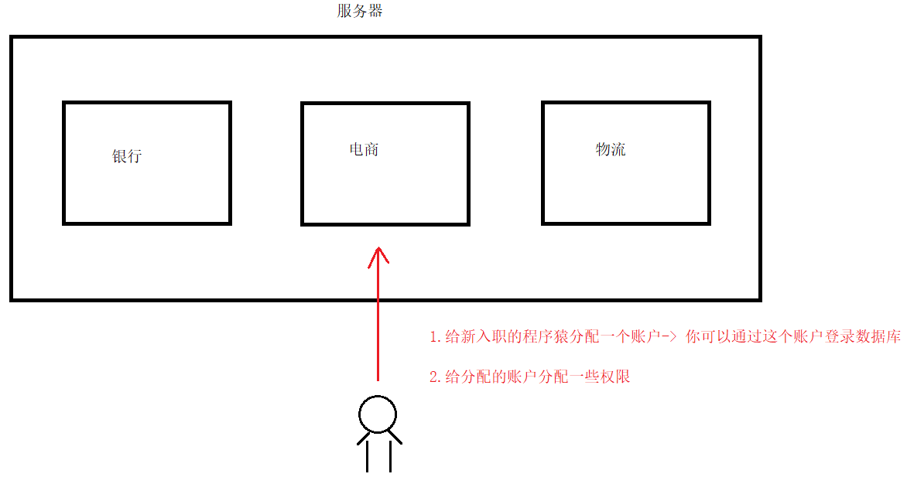
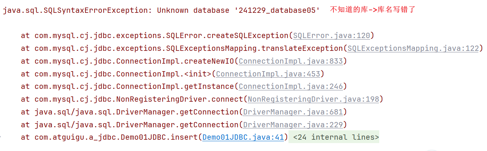
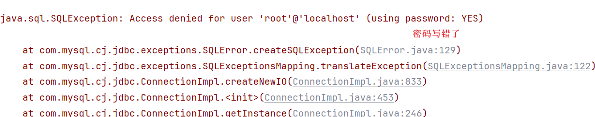
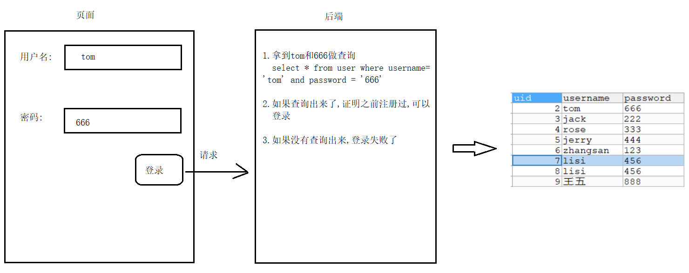
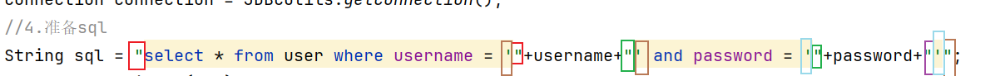
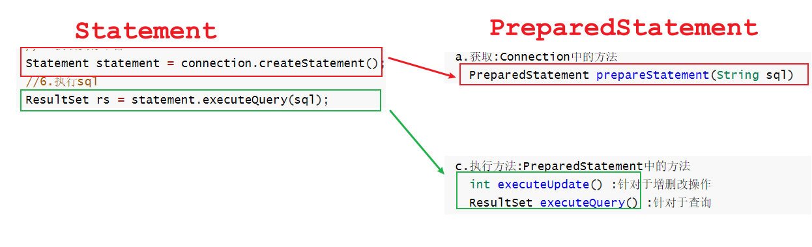

# day03.函数_jdbc

```mysql
课前回顾:
  1.简单查询: select 列名 from 表名
  2.条件查询: select 列名 from 表名 where 条件
  3.表关系:
    一对一:  正反都是一对一
    一对多:  正着看一对多,倒着看一对一
    多对多:  正反都是一对多
  4.交叉查询:
    select 列名 from 表A,表B
  5.内连接:
    a.隐式内连接:select 列名 from 表A,表B where 条件
    b.显式内连接:select 列名 from 表A join 表B on 条件
  6.外连接:
    a.左外连接:select 列名 from 表A left join 表B on 条件
    b.右外连接:select 列名 from 表A right join 表B on 条件
  7.子查询: 一条select作为另外一条select语句的条件使用 
  
今日重点:
  1.会字符串函数以及流程函数的使用
  2.从第三章到第四章都是重点
```

# 第一章.MySQL的常用函数

```java
1.数据库中的函数都是操作一列数据
2.都是写在select后面
```

##  1.字符串函数

### 1.1 字符串函数列表概览

| 函数                                  | 用法                                          |
| ------------------------------------- | --------------------------------------------- |
| CONCAT(S1,S2,......,Sn)               | 连接S1,S2,......,Sn为一个字符串               |
| CONCAT_WS(separator, S1,S2,......,Sn) | 连接S1一直到Sn，并且中间以separator作为分隔符 |
| UPPER(s) 或 UCASE(s)                  | 将字符串s的所有字母转成大写字母               |
| LOWER(s)  或LCASE(s)                  | 将字符串s的所有字母转成小写字母               |
| TRIM(s)                               | 去掉字符串s开始与结尾的空格                   |
| SUBSTRING(s,index,len)                | 返回从字符串s的index位置其len个字符           |

### 1.2 环境准备

```mysql
-- 用户表
CREATE TABLE t_user (
  id int(11) NOT NULL AUTO_INCREMENT,
  uname varchar(40) DEFAULT NULL,
  age int(11) DEFAULT NULL,
  sex int(11) DEFAULT NULL,
  PRIMARY KEY (id)
);
insert  into t_user values (null,'zs',18,1);
insert  into t_user values (null,'ls',20,0);
insert  into t_user values (null,'ww',23,1);
insert  into t_user values (null,'zl',24,1);
insert  into t_user values (null,'lq',15,0);
insert  into t_user values (null,'hh',12,0);
insert  into t_user values (null,'wzx',60,null);
insert  into t_user values (null,'lb',null,null);
```

### 1.3 字符串连接函数

字符串连接函数主要有2个：

| 函数或操作符                          | 描述                                     |
| ------------------------------------- | ---------------------------------------- |
| concat(str1, str2, ...)               | 字符串连接函数，可以将多个字符串进行连接 |
| concat_ws(separator, str1, str2, ...) | 可以指定间隔符将多个字符串进行连接；     |

练习1：使用concat函数显示出 你好uname 的结果

```mysql
/*
  concat(str1, str2, ...)
  字符串连接函数，可以将多个字符串进行连接
  
  concat_ws(separator, str1, str2, ...)->可以指定间隔符将多个字符串进行连接
*/
-- 拼接字符串练习 练习1：使用concat函数显示出 你好uname 的结果

```

```sql
/*
  concat(str1, str2, ...)
  字符串连接函数，可以将多个字符串进行连接
  
  concat_ws(separator, str1, str2, ...)->可以指定间隔符将多个字符串进行连接
*/
-- 拼接字符串练习 练习1：使用concat函数显示出 你好uname 的结果
SELECT id,CONCAT('你好',uname) uname,age,sex FROM t_user;
```

练习2：使用concat_ws函数显示出 你好,uname 的结果

```mysql
-- 练习2：使用concat_ws函数显示出 你好,uname 的结果
SELECT id,CONCAT_WS(',','你好',uname) uname,age,sex FROM t_user;
```

### 1.4 字符串大小写处理函数

字符串大小写处理函数主要有2个：

| 函数或操作符 | 描述              |
| ------------ | ----------------- |
| upper(str)   | 得到str的大写形式 |
| lower(str)   | 得到str的小写形式 |

练习1： 将字符串 uname 转换为大写显示

```mysql
-- 将hello转成大写
SELECT UPPER('hello');

-- 查询t_user,uname变成大写
SELECT id,UPPER(uname) uname,age,sex FROM t_user;
```

练习2：将uname 转换为小写显示

```mysql
-- 查询t_user,uname变成小写
SELECT id,LOWER(uname) uname,age,sex FROM t_user;
```

### 1.5 移除空格函数

可以对字符串进行按长度填充满、也可以移除空格符

| 函数或操作符 | 描述                  |
| ------------ | --------------------- |
| trim(str)    | 将str两边的空白符移除 |

练习1： 将用户id为9的用户的姓名的两边空白符移除

```mysql
-- 将用户id为9的用户的姓名的两边空白符移除
SELECT id,TRIM(uname) uname,age,sex FROM t_user WHERE id = 9;
```

### 1.6 子串函数

字符串也可以按条件进行截取，主要有以下可以截取子串的函数;

| 函数或操作符          | 描述                                                         |
| --------------------- | ------------------------------------------------------------ |
| substr()、substring() | 获取子串： 1：substr(str, pos) 、substring(str, pos)； 2：substr(str, pos, len)、substring(str, pos, len) |

```mysql
/*
  substring(str, pos)
            str:被截取的字符串
            pos:从第几个字符开始截取
  substring(str, pos, len)
            str:被截取的字符串
            pos:从第几个字符开始截取
            len:截取多少个字符
*/
SELECT SUBSTRING('abcdefg',2);

SELECT SUBSTRING('abcdefg',2,2);
```

练习1：获取 hello,world 从第二个字符开始的完整子串

```mysql
SELECT SUBSTR('hello,world',2)sout;
```

练习2：获取 hello,world 从第二个字符开始但是长度为4的子串

```mysql
SELECT SUBSTR('hello,world',2,4)sout;
```

## 2.数值函数

### 2.1. 数值函数列表

| 函数     | 用法                              |
| -------- | --------------------------------- |
| ABS(x)   | 返回x的绝对值                     |
| CEIL(x)  | 返回大于x的最小整数值【向上取整】 |
| FLOOR(x) | 返回小于x的最大整数值【向下取整】 |
| RAND()   | 返回0~1的随机值                   |
| POW(x,y) | 返回x的y次方                      |

### 2.2. 常用数值函数练习

```mysql
-- 练习1： 获取 -12 的绝对值


-- 练习2： 将 -11.2 向上取整


-- 练习3： 将 1.6 向下取整


-- 练习4： 获得2的2次幂的值


-- 练习5： 获得一个在0-100之间的随机数

```

```sql
-- 练习1： 获取 -12 的绝对值
SELECT ABS(-12);
-- 练习2： 将 -11.2 向上取整
SELECT CEIL(-11.2);

-- 练习3： 将 1.6 向下取整
SELECT FLOOR(1.6);

-- 练习4： 获得2的2次幂的值
SELECT POW(2,2);

-- 练习5： 获得一个在0-100之间的随机数
SELECT RAND()*100;
```

## 3.日期函数

### 3.1 日期函数列表

| 函数                                                         | 用法                                                      |
| ------------------------------------------------------------ | --------------------------------------------------------- |
| **CURDATE()** 或 CURRENT_DATE()                              | 返回当前日期  年月日                                      |
| **CURTIME()** 或 CURRENT_TIME()                              | 返回当前时间  时分秒                                      |
| **NOW()** / SYSDATE() / CURRENT_TIMESTAMP() / LOCALTIME() / LOCALTIMESTAMP() | 返回当前系统日期时间                                      |
| DATEDIFF(date1,date2) / TIMEDIFF(time1, time2)               | 返回date1 - date2的日期间隔 / 返回time1 - time2的时间间隔 |

### 3.2 常用日期函数的练习

```mysql
-- 练习1：获取当前的日期(仅仅需要年月日)


-- 练习2： 获取当前的时间（仅仅需要时分秒）


-- 练习3： 获取当前日期时间（包含年月日时分秒）


-- 练习4: 获取到12月1日还有多少天

```

```java
-- 练习1：获取当前的日期(仅仅需要年月日)
SELECT CURDATE();

-- 练习2： 获取当前的时间（仅仅需要时分秒）
SELECT CURTIME();

-- 练习3： 获取当前日期时间（包含年月日时分秒）
SELECT NOW();

-- 练习4: 获取到5月1日还有多少天
SELECT DATEDIFF('2025-5-1',NOW());
```

## 4.流程函数_判断

| 函数                                                         | 用法                                         |
| ------------------------------------------------------------ | -------------------------------------------- |
| IF(比较,t ,f)<br>里面的t和f是两个结果                        | 如果比较是真，返回t，否则返回f               |
| IFNULL(value1, value2)                                       | 如果value1不为空，返回value1，否则返回value2 |
| CASE WHEN 条件1 THEN result1 WHEN 条件2 THEN result2 .... [ELSE resultn] END | 相当于Java的if...else if...else...           |

* 练习1：获取用户的姓名、性别，如果性别为1则显示'男'，否则显示'女'；要求使用if函数查询：

  ```mysql
  SELECT id,uname,IF(sex=1,'男','女') sex FROM t_user;
  ```


* 练习2：获取用户的姓名、性别，如果性别为null则显示为0；要求使用ifnull函数查询：

  ```mysql
  SELECT id,uname,IFNULL(sex,0) sex FROM t_user;
  ```


* 练习3：如果age<=12,显示儿童,如果age<=18,显示少年,如果age<=40,显示中年,否则显示老年

  ```mysql
  SELECT id,uname,CASE WHEN age<=12 THEN '儿童' 
  WHEN age<=18 THEN '少年' 
  WHEN age<=40 THEN '中年' 
  ELSE '老年' END age FROM t_user;
  ```

# 第二章 DCL语句

我们现在默认使用的都是root用户，超级管理员，拥有全部的权限。但是，一个公司里面的数据库服务器上面可能同时运行着很多个项目的数据库。所以，我们应该根据不同的项目建立不同的用户，分配不同的权限来管理和维护数据库。



## 2.1 创建用户

```mysql
CREATE USER '用户名'@'主机名' IDENTIFIED BY '密码';
```

**关键字说明：**

```java
1.用户名:创建的用户名
2.主机名:指定该用户在哪个主机上可以登录,如果是本地用户,可以用'localhost',如果想让该用户可以任意远程主机登录,可以使用通配符%
3.密码:该用户登录的密码,密码可以为空,如果为空,该用户可以不输入密码就可以登录mysql
```

**具体操作：**

```sql
-- user1用户只能在localhost这个IP登录mysql服务器
CREATE USER 'user1'@'localhost' IDENTIFIED BY '123';
-- user2用户可以在任何电脑上登录mysql服务器
CREATE USER 'user2'@'%' IDENTIFIED BY '123';
```

## 2.2 授权用户

用户创建之后，基本没什么权限！需要给用户授权


**授权格式**：

```sql
GRANT 权限1, 权限2... ON 数据库名.表名 TO '用户名'@'主机名';
```

**关键字说明**：

```java
a.GRANT:授权关键字
b.授予用户的权限,比如  'select' 'insert' 'update'等,如果要授予所有的权限,使用 'ALL'
c.数据库名.表名:该用户操作哪个数据库的哪些表,如果要授予该用户对所有数据库和表的相关操作权限,就可以用*表示: *.*
d.'用户名'@'主机名':给哪个用户分配权限
```

**具体操作：**

1. 给user1用户分配对test这个数据库操作的权限

   ```
   .*的意思是可以操控该数据库下的所有表
   *.*的意思是可以操控所有数据库以及下面的所有表
   ```

   ```sql
   GRANT CREATE,ALTER,DROP,INSERT,UPDATE,DELETE,SELECT ON test.* TO 'user1'@'localhost';
   ```

   

2. 给user2用户分配对所有数据库操作的权限

   ```sql
   GRANT ALL ON *.* TO 'user2'@'%';
   ```

   

## 2.3 撤销授权

```sql
REVOKE  权限1, 权限2... ON 数据库.表名 FROM '用户名'@'主机名';
```

**具体操作：**

* 撤销user1用户对test操作的权限

  ```sql
  REVOKE ALL ON test.* FROM 'user1'@'localhost';
  ```

  

## 2.4 查看权限

```sql
SHOW GRANTS FOR '用户名'@'主机名';
```

**具体操作：**

* 查看user1用户的权限

  ```sql
  SHOW GRANTS FOR 'user1'@'localhost';
  ```

  

## 2.5 删除用户

```sql
DROP USER '用户名'@'主机名';
```

**具体操作：**

* 删除user2

  ```sql
   DROP USER 'user2'@'%';
  ```

  

```mysql
/*
  分配用户:
    create:创建
    user:用户
    'user1'@'localhost' : 用户名以及可以访问的主机地址
    IDENTIFIED BY '123' : 分配密码
    
    %:可以在任意远程主机上登录
*/
-- user1用户只能在localhost这个IP登录mysql服务器
CREATE USER 'user1'@'localhost' IDENTIFIED BY '123';
-- user2用户可以在任何电脑上登录mysql服务器
CREATE USER 'user2'@'%' IDENTIFIED BY '123';


/*
   grant:分配权限关键字
   grant后面跟的就是具体的操作权限:select insert update等,如果分配所有权限就写ALL
   
   on:后面跟的是数据库名字 -> 指定啥数据库那么用此用户登录就只能看到哪个数据库名字
   
   `220706_mysql03`.* -> 指定库中所有的表 * 代表所有,如果想要看到所有的库以及所有的表我们就写*.*
   
   to:指明此权限要给的用户
*/
-- 给用户1分配权限
GRANT SELECT ON `230222_day02_2`.* TO 'user1'@'localhost';

-- 给用户2分配权限
GRANT ALL ON *.* TO 'user2'@'%';

/*
  drop:删除用户关键字
*/
DROP USER 'user2'@'%';
DROP USER 'user1'@'localhost';
```

## 2.6 修改用户密码

### 2.6.1 修改管理员密码

```sql
mysqladmin -uroot -p password 新密码  -- 新密码不需要加上引号
```

>注意：需要在未登陆MySQL的情况下操作。

**具体操作：**

   ```sql
mysqladmin -uroot -p password root
输入老密码
   ```

   

### 2.6.2 修改普通用户密码

```sql
set password for '用户名'@'主机名' = password('新密码');
```

>注意：需要在登陆MySQL的情况下操作。

**具体操作：**

   ```sql
set password for 'user1'@'localhost' = password('666666');
   ```

   

# 第三章.JDBC

## 1.JDBC介绍

```java
1.概述:Java DataBase Connectivity(Java语言连接数据库)
      也是数据库和java连接的一套标准
2.为啥要用它:
  将来我们不可能直接在数据库中写sql语句,我们肯定是将sql语句放到java代码中参与运行,所以我们就需要jdbc中的API
```


## 2.JDBC准备(导入jar包)

```java
1.导入JDBC核心jar包:
  mysql-connector-java-8.0.25.jar
2.JDBC四大核心对象:
  a.DriverManager类:用于注册驱动->我们操作的哪款数据库呀?就注册哪款数据库的驱动
  b.Connection接口(连接对象) : 用于连接数据库
  c.Statement接口(执行平台对象): 用于执行sql语句的
  d.ResultSet接口(结果集对象): 用于处理查询出来的数据
```

## 3.JDBC开发步骤以及详解

JDBC连接Mysql数据库并执行SQL操作的基本流程

```
1.注册驱动:
2.获取连接:
3.准备sql语句:
4.获取执行平台:
5.执行sql:
6.处理结果集:
7.关闭资源:
```

```java
1.注册驱动:DriverManager类,但是mysql会自动注册驱动
         mysql会自动扫描jar包中services下面的文件java.sql.Driver
2.获取连接:Connection对象
  获取:DriverManager中的静态方法:
      static Connection getConnection(String url, String user, String password)  
          
       url:代表的是数据库地址
       user:代表的是登录数据库的用户名
       password:代表的是登录数据库的密码
           
           
3.准备sql语句:
  用字符串String表示一条sql语句
      
4.获取执行平台:Statement对象
  获取:Connection中的方法
      Statement createStatement()
      
5.执行sql:
  Statement中的方法:
     int executeUpdate(String sql) ->  专门操作增删改的 
     ResultSet executeQuery(String sql) -> 专门操作查询的,返回的是结果集    
6.处理结果集:Resultset对象:
while (rs.next()) { //   判断有没有下一个  移动到下一行，首次调用移到第一行
    int id = rs.getInt("id"); //b.getxxx() 获取查询出来的数据
    String name = rs.getString("name");
    System.out.println(id + ": " + name);
}

7.关闭资源:
  结果集对象,执行平台对象,连接对象都要close
```

## 4.JDBC注册驱动

```mysql
CREATE TABLE `user`(
  uid INT PRIMARY KEY AUTO_INCREMENT,
  username VARCHAR(20),
  `password` VARCHAR(20)
);
```

```java
       /*
          1.注册驱动
            DriverManager.registerDriver(Driver driver)
            Driver是一个接口,我们需要传递

          2.注意:我们一创建Driver对象,Driver对象就会加载,我们发现里面有一个静态代码块
            当我们一new,里面的静态代码块直接执行,静态代码块中还有一句注册驱动的代码
            所以我们用此种方式相当于一下子注册了两次驱动
        */
//DriverManager.registerDriver(new Driver());

```

```java
Class.forName("com.mysql.cj.jdbc.Driver");
```

> 其实我们不用自己手动注册驱动:jdbc会自动扫描一个包下的资源->java.sql.driver下的驱动资源

## 5.JDBC获取连接

```java
        /*
           2.获取连接:DriverManager对象
             static Connection getConnection(String url, String user, String password)

             url:代表的是数据库地址->jdbc:mysql://localhost:3306/数据库名字
             user:代表的是登录数据库的用户名
             password:代表的是登录数据库的密码

             jdbc:mysql://localhost:3306/数据库名字,如果后面有请求参数那么在后面加?
             ?后面的内容就是请求参数-> 请求参数都是key=value形式
             jdbc:mysql://localhost:3306/数据库名字?key=value&key=value
         */
        String url = "jdbc:mysql://localhost:3306/241229_database03";
        String user = "root";
        String password = "root";
        Connection connection = DriverManager.getConnection(url,user,password);
        System.out.println("connection = " + connection);
```

> 
>
> 

## 6.JDBC实现增删改操作

```java
    @Test
    public void insert() throws Exception {
       /*
          1.注册驱动
            DriverManager.registerDriver(Driver driver)
            Driver是一个接口,我们需要传递

          2.注意:我们一创建Driver对象,Driver对象就会加载,我们发现里面有一个静态代码块
            当我们一new,里面的静态代码块直接执行,静态代码块中还有一句注册驱动的代码
            所以我们用此种方式相当于一下子注册了两次驱动
        */
        //DriverManager.registerDriver(new Driver());

        Class.forName("com.mysql.cj.jdbc.Driver");

        /*
           2.获取连接:DriverManager对象
             static Connection getConnection(String url, String user, String password)

             url:代表的是数据库地址->jdbc:mysql://localhost:3306/数据库名字
             user:代表的是登录数据库的用户名
             password:代表的是登录数据库的密码

             jdbc:mysql://localhost:3306/数据库名字,如果后面有请求参数那么在后面加?
             ?后面的内容就是请求参数-> 请求参数都是key=value形式
             jdbc:mysql://localhost:3306/数据库名字?key=value&key=value
         */
        String url = "jdbc:mysql://localhost:3306/241229_database03";
        String user = "root";
        String password = "root";
        Connection connection = DriverManager.getConnection(url,user,password);

        //3.准备sql
        String sql = "insert into user (username,password) values ('tom','111')";

        /*
            4.获取执行平台->Statement对象
              Connection中的方法:Statement createStatement()
         */
        Statement statement = connection.createStatement();

        /*
            5.执行sql语句:Statement中的方法:
               int executeUpdate(String sql) ->  专门操作增删改的 ,不用处理结果集
               ResultSet executeQuery(String sql) -> 专门操作查询的,返回的是结果集
         */
        statement.executeUpdate(sql);

        //6.关闭资源
        statement.close();
        connection.close();
    }
```

```java
 @Test
    public void delete() throws Exception {
        //1.注册驱动
        Class.forName("com.mysql.cj.jdbc.Driver");

        //2.获取连接
        String url = "jdbc:mysql://localhost:3306/241229_database03";
        String user = "root";
        String password = "root";
        Connection connection = DriverManager.getConnection(url,user,password);

        //3.准备sql
        String sql = "delete from user where uid = 1";

        /*
            4.获取执行平台->Statement对象
         */
        Statement statement = connection.createStatement();

        /*
            5.执行sql语句:Statement中的方法:
               int executeUpdate(String sql) ->  专门操作增删改的 ,不用处理结果集
        */
        statement.executeUpdate(sql);

        //6.关闭资源
        statement.close();
        connection.close();
    }
```

```java
    @Test
    public void update() throws Exception {
        //1.注册驱动
        Class.forName("com.mysql.cj.jdbc.Driver");

        //2.获取连接
        String url = "jdbc:mysql://localhost:3306/241229_database03";
        String user = "root";
        String password = "root";
        Connection connection = DriverManager.getConnection(url,user,password);

        //3.准备sql
        String sql = "update user set password = '666' where uid = 2";

        /*
            4.获取执行平台->Statement对象
         */
        Statement statement = connection.createStatement();

        /*
            5.执行sql语句:Statement中的方法:
               int executeUpdate(String sql) ->  专门操作增删改的 ,不用处理结果集
        */
        statement.executeUpdate(sql);

        //6.关闭资源
        statement.close();
        connection.close();
    }
```

> 1.我们可以将在java代码中写的sql语句放到sqlyog中去检测是否正确
>
> 2.或者先从sqlyog中吧sql语句写出来,粘贴到java代码中

## 7.JDBC实现查询操作

```java
1.Statement中的方法:
  ResultSet executeQuery(String sql)
2.处理结果集:ResultSet接口中的方法
  a.boolean next()  判断有没有下一个元素
  b.int getInt(int columnIndex) ->获取int型列的数据,传递的是第几列 
    int getInt(String columnLabel)  ->获取int型列的数据,传递的是列名
    String getString(int columnIndex) -> 获取varchar型列的数据,传递的是第几列
    String getString(String columnLabel) -> 获取varchar型列的数据,传递的是列名 
    
    Object getObject(int columnIndex)  获取数据,传递第几列
    Object getObject(String columnLabel)  获取数据,传递列名
```

```java
    @Test
    public void query() throws Exception {
        //1.注册驱动
        Class.forName("com.mysql.cj.jdbc.Driver");

        //2.获取连接
        String url = "jdbc:mysql://localhost:3306/241229_database03";
        String user = "root";
        String password = "root";
        Connection connection = DriverManager.getConnection(url, user, password);

        //3.准备sql
        String sql = "select * from user";

         /*
            4.获取执行平台->Statement对象
         */
        Statement statement = connection.createStatement();

        //5.执行sql语句:Statement中的方法:
        ResultSet resultSet = statement.executeQuery(sql);

        //6.处理结果集
        while (resultSet.next()) {
            int uid = resultSet.getInt("uid");
            String username = resultSet.getString("username");
            String pwd = resultSet.getString("password");
            System.out.println(uid + " " + username + " " + pwd);
        }
        //7.关闭资源
        resultSet.close();
        statement.close();
        connection.close();
    }   
```

## 8.JDBC工具类使用

```properties
driverClassName=com.mysql.cj.jdbc.Driver
url=jdbc:mysql://localhost:3306/241229_database03
user=root
password=root
```

```java
public class JDBCUtils {
    private JDBCUtils() {
    }

    private static String url = null;
    private static String user = null;
    private static String password = null;

    static {
        try {
            //创建properties集合
            Properties properties = new Properties();
            //读取配置文件
            InputStream in = JDBCUtils.class.getClassLoader().getResourceAsStream("jdbc.properties");
            properties.load(in);
            //解析
            Class.forName(properties.getProperty("driverClassName"));
            url = properties.getProperty("url");
            user = properties.getProperty("user");
            password = properties.getProperty("password");
        } catch (Exception e) {
            e.printStackTrace();
        }
    }

    //获取连接
    public static Connection getConnection() {
        Connection connection = null;
        try {
            connection = DriverManager.getConnection(url, user, password);
        } catch (SQLException e) {
            e.printStackTrace();
        }
        return connection;
    }

    //关闭资源
    public static void close(Connection connection, Statement statement, ResultSet resultSet) {
        if (resultSet != null) {
            try {
                resultSet.close();
            } catch (SQLException e) {
                e.printStackTrace();
            }
        }

        if (statement != null) {
            try {
                statement.close();
            } catch (SQLException e) {
                e.printStackTrace();
            }
        }

        if (connection != null) {
            try {
                connection.close();
            } catch (SQLException e) {
                e.printStackTrace();
            }
        }
    }
}

```

```java
public class Demo02JDBC {
    @Test
    public void insert() throws Exception {
        //1.获取连接
        Connection connection = JDBCUtils.getConnection();
        //2.准备sql
        String sql = "insert into user values(null,'zhangsan','123')";
        //3.获取执行平台->Statement对象
        Statement statement = connection.createStatement();
        //4.执行sql
        statement.executeUpdate(sql);
        //5.关闭资源
        JDBCUtils.close(connection, statement, null);
    }
}

```

## 9.获取最新添加的数据的id

```mysql
1.mysql函数:
  SELECT LAST_INSERT_ID()
2.注意:
  id列不能自己手动指定,需要让mysql自动编号
  
```

```java
 public class Demo03JDBC {
    @Test
    public void insert() throws Exception {
        //获取连接
        Connection connection = JDBCUtils.getConnection();
        //准备sql
        String add = "INSERT INTO `user` (username,`password`) VALUES ('王五','888');";
        String selectLastInsertId = "SELECT LAST_INSERT_ID();";

        //获取执行平台
        Statement statement = connection.createStatement();
        //执行sql
        statement.executeUpdate(add);
        ResultSet resultSet = statement.executeQuery(selectLastInsertId);
        while (resultSet.next()) {
            System.out.println(resultSet.getInt(1));
        }
        //关闭资源
        JDBCUtils.close(connection, statement, resultSet);
    }
}
```

> ```mysql
> INSERT INTO `user` (username,`password`) VALUES ('lisi','456');
> 
> 
> #INSERT INTO `user` (uid,username,`password`) VALUES (8,'lisi','456');
> SELECT LAST_INSERT_ID();
> ```

# 第四章.PreparedStatement预处理对象



## 1.==sql注入==的问题以及解决方式(预处理对象)

```java
public class UserLogin {
    public static void main(String[] args)throws Exception {
        //1.创建Scanner对象
        Scanner sc = new Scanner(System.in);
        //2.录入用户名和密码
        System.out.println("请您输入用户名:");
        String username = sc.nextLine();
        System.out.println("请您输入密码:");
        String password = sc.nextLine();
        //3.获取连接
        Connection connection = JDBCUtils.getConnection();
        //4.准备sql
        String sql = "select * from user where username = '"+username+"' and password = '"+password+"'";
        System.out.println(sql);
        //5.获取执行平台
        Statement statement = connection.createStatement();
        //6.执行sql
        ResultSet rs = statement.executeQuery(sql);
        //7.处理结果集
        if (rs.next()){
            System.out.println("登录成功!");
        }else {
            System.out.println("登录失败!");
        }

        //8.关闭资源
        JDBCUtils.close(connection,statement,rs);
    }
}

```



> 密码输入:111' or '1' = '1  以上程序不行了->sql注入

## 1.使用预处理对象(PreparedStatement)实现操作

```java
1.概述:PreparedStatement 是 Statement的子接口
2.作用:支持sql中有占位符 -> ?
  String sql = "select * from user username = ? and password = ?"
3.使用:
  a.获取:Connection中的方法
    PreparedStatement prepareStatement(String sql)  
  b.为?赋值:PreparedStatement中的方法
    void setObject(int parameterIndex, Object x)
                   parameterIndex:指的是第几个?
                   x:为?赋的值
  c.执行方法:PreparedStatement中的方法
    int executeUpdate() :针对于增删改操作 
    ResultSet executeQuery() :针对于查询
```



## 2.使用预处理对象(PreparedStatement)实现增删改查操作

```java
public class Demo04JDBC {
    @Test
    public void insert()throws Exception{
        Connection connection = JDBCUtils.getConnection();
        String sql = "INSERT INTO `user` (username,`password`) VALUES (?,?);";
        PreparedStatement pst = connection.prepareStatement(sql);
        //为sql语句中的?赋值
        pst.setObject(1,"tianqi");
        pst.setObject(2,"999");
        pst.executeUpdate();
        JDBCUtils.close(connection,pst,null);
    }

    @Test
    public void delete()throws Exception{
        Connection connection = JDBCUtils.getConnection();
        String sql = "delete from user where uid = ?";
        PreparedStatement pst = connection.prepareStatement(sql);
        //为sql语句中的?赋值
        pst.setObject(1,2);
        pst.executeUpdate();
        JDBCUtils.close(connection,pst,null);
    }

    @Test
    public void update()throws Exception{
        Connection connection = JDBCUtils.getConnection();
        String sql = "update user set password = ? where uid = ?";
        PreparedStatement pst = connection.prepareStatement(sql);
        //为sql语句中的?赋值
        pst.setObject(1,"111");
        pst.setObject(2,3);
        pst.executeUpdate();
        JDBCUtils.close(connection,pst,null);
    }

    @Test
    public void query()throws Exception{
        Connection connection = JDBCUtils.getConnection();
        String sql = "select username,password from user where uid = ?";
        PreparedStatement pst = connection.prepareStatement(sql);
        //为sql语句中的?赋值
        pst.setObject(1,4);
        ResultSet resultSet = pst.executeQuery();
        while (resultSet.next()){
            String username = resultSet.getString("username");
            String password = resultSet.getString("password");
            System.out.println(username+"--"+password);
        }
        JDBCUtils.close(connection,pst,resultSet);
    }
}

```

> 注意:?占位符只能代表值

```java
public class UserLogin {
    public static void main(String[] args)throws Exception {
        //1.创建Scanner对象
        Scanner sc = new Scanner(System.in);
        //2.录入用户名和密码
        System.out.println("请您输入用户名:");
        String username = sc.nextLine();
        System.out.println("请您输入密码:");
        String password = sc.nextLine();
        //3.获取连接
        Connection connection = JDBCUtils.getConnection();
        //4.准备sql
        //String sql = "select * from user where username = '"+username+"' and password = '"+password+"'";
        String sql = "select * from user where username = ? and password = ?";
        //5.获取执行平台
        PreparedStatement pst = connection.prepareStatement(sql);
        //为?赋值
        pst.setObject(1,username);
        pst.setObject(2,password);
        //6.执行sql
        ResultSet rs = pst.executeQuery();
        //7.处理结果集
        if (rs.next()){
            System.out.println("登录成功!");
        }else {
            System.out.println("登录失败!");
        }

        //8.关闭资源
        JDBCUtils.close(connection,pst,rs);
    }
}

```

```java
select * from user where username = 'tom' and password = '111' or '1' = '1'

如果用的是PreparedStatement即使传入了111' or '1' = '1,拼接到了sql语句中会自动将输入'转义
变成了:
select * from user where username = 'tom' and password = '111\' or \'1\' = \'1'
123\' or \'1\' = \'1 是一整个大的字符串,被包裹在了''中   
```

> ?只能给sql语句中的具体的数据占位

> 完成注册功能:作业
>
> ​    输入用户名和密码
>
> ​     根据用户名查询,是否有该用户
>
> ​     如果有,注册失败
>
> ​     否则,将用户名和密码insert到数据库中,显示注册成功

```java
package com.JDBC;

import utils.JDBCUTILS;

import java.sql.Connection;
import java.sql.PreparedStatement;
import java.sql.ResultSet;
import java.sql.SQLException;
import java.util.Scanner;

public class homework {
    public static void main(String[] args) throws Exception {
        //
        Scanner scanner = new Scanner(System.in);
        System.out.println("请输入用户名");
        String username = scanner.nextLine();
        System.out.println("请输入密码");
        String password = scanner.nextLine();
        Connection connection = JDBCUTILS.getConnection();
        //2.sql
        String sql="select * from user where username =?";
        //3.连接
        PreparedStatement preparedStatement = connection.prepareStatement(sql);
        //4.
        preparedStatement.setObject(1,username);
        ResultSet resultSet = preparedStatement.executeQuery();
        //5.读取
        if(resultSet.next()){
            System.out.println("注册失败,此用户名已存在!");
        }else{
            //开始注册
            String register="insert into user values(null,?,?)";
            PreparedStatement pr = connection.prepareStatement(register);
            pr.setObject(1,username);
            pr.setObject(2,password);
            pr.executeUpdate();
            System.out.println("注册成功!");
            JDBCUTILS.close(connection,pr,null);
        }
        //6.退出
        JDBCUTILS.close(connection,preparedStatement,resultSet);
    }
}

```

