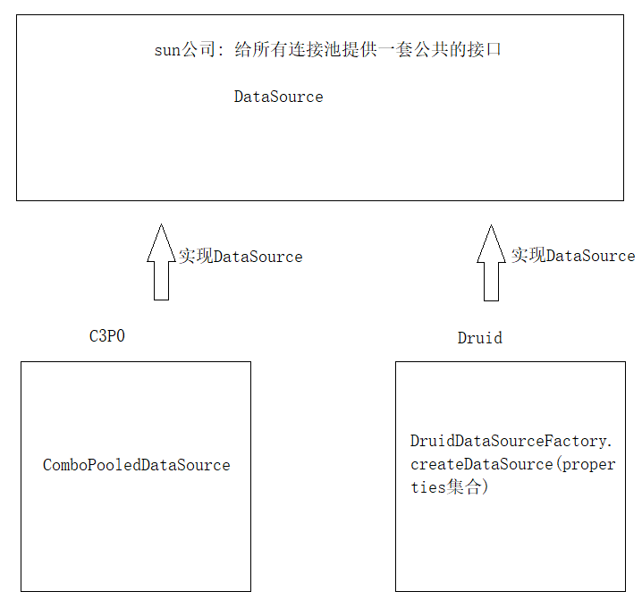
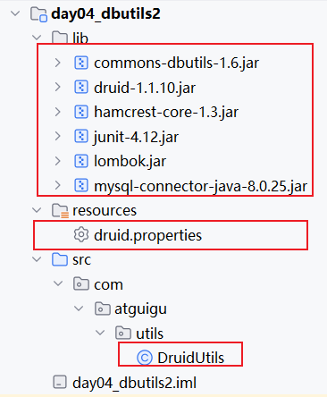
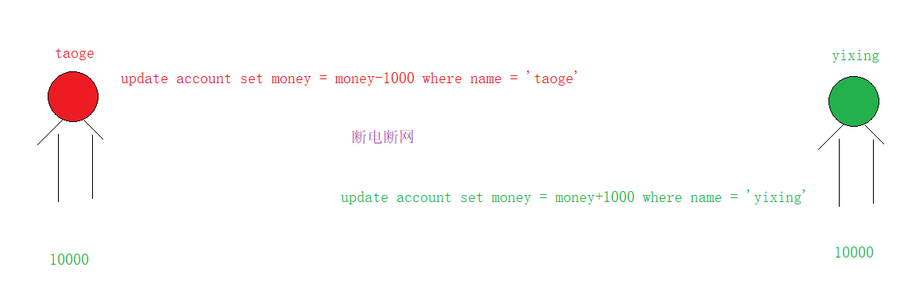
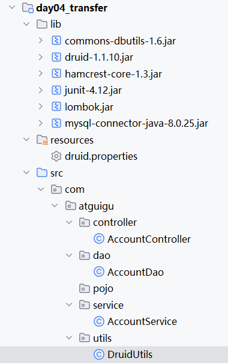
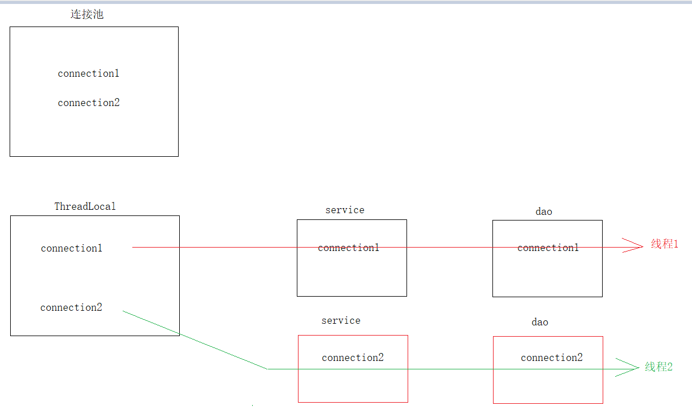
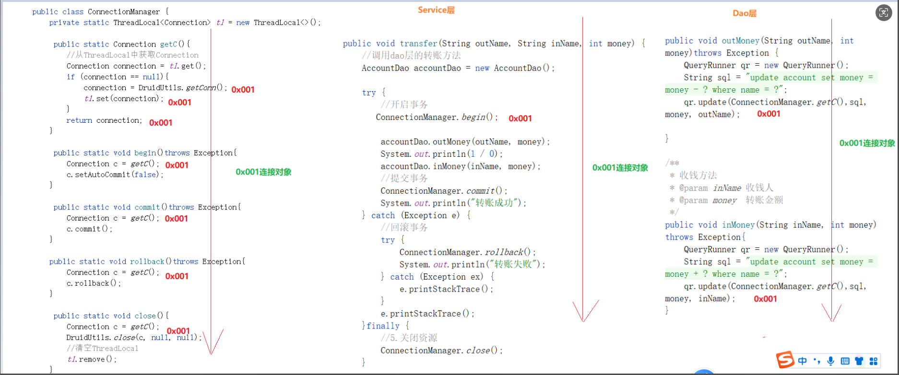

# day04.连接池-DBUtils-事务

```java
课前回顾:
  1.函数:放到select后面用
    字符串函数:和java中的String方法差不多
    判断函数: if  ifnull  case when
  2.DCL:用于分配用户,以及给用户分配权限
  3.JDBC:java连接数据库的一套标准
  4.开发步骤:
    a.注册驱动:Class.forName("Driver的全限定名");
    b.获取连接:
      Connection connection = DriverManager.getConnection("数据库url","数据库账号","数据库密码")
    c.准备sql
    d.获取执行平台:
      Statement st = connection.createStatement()
    e.执行sql
      st.executeUpdate(sql)
      ResultSet rs = st.executeQuery(sql)
    f.处理结果集
      boolean next() 判断有没有下一个数据
      getxxx()获取数据
  5.PreparedStatement:是Statement接口的子接口
    a.特点:支持占位符,防止sql注入问题
    b.获取:
      PreparedStatement pst = connection.preparedStatement(sql)
    c.为?赋值
      setxxx(第几个?,为?赋的值)
    d.执行方法:
      st.executeUpdate()
      ResultSet rs = st.executeQuery()
          
今日重点:
  1.会批量添加操作
  2.使用德鲁伊连接池
  3.会使用DBUtils工具包中的核心类进行增删改查
  4.要知道事务是干啥的
  5.要会使用事务管理一组操作(多条sql语句)
  6.会使用ThreadLocal    
```

# 第一章.PreparedStatement预处理对象

## 1.PreparedStatement实现批量添加

```mysql
CREATE TABLE category(
  cid INT PRIMARY KEY AUTO_INCREMENT,
  cname VARCHAR(10)
);
```

```java
1.注意:mysql默认是不会做批量添加,默认都是一个数据,一个数据的添加,所以需要我们手动开启批量添加操作
2.用到PreparedStatement中的方法:
  void addBatch() -> 将一组数据保存起来,给数据打包,放到内存中
  executeBatch() -> 将打包好的数据一起发送给mysql
      
3.如果想实现批量添加的话,我们需要在url后面添加一个参数:
  ?rewriteBatchedStatements=true
      
  jdbc:mysql://localhost:3306/241023_database3?rewriteBatchedStatements=true

  请求路径?username=tom&password=123

  url?请求参数 -> 请求参数都是key=value形式
```

```properties
driverClassName=com.mysql.cj.jdbc.Driver
url=jdbc:mysql://localhost:3306/241229_database04?rewriteBatchedStatements=true
user=root
password=root
```

```java
public class JDBCUtils {
    private JDBCUtils() {
    }

    private static String url = null;
    private static String user = null;
    private static String password = null;

    static {
        try {
            //创建properties集合
            Properties properties = new Properties();
            //读取配置文件
            InputStream in = JDBCUtils.class.getClassLoader().getResourceAsStream("jdbc.properties");
            properties.load(in);
            //解析
            Class.forName(properties.getProperty("driverClassName"));
            url = properties.getProperty("url");
            user = properties.getProperty("user");
            password = properties.getProperty("password");
        } catch (Exception e) {
            e.printStackTrace();
        }
    }

    //获取连接
    public static Connection getConnection() {
        Connection connection = null;
        try {
            connection = DriverManager.getConnection(url, user, password);
        } catch (SQLException e) {
            e.printStackTrace();
        }
        return connection;
    }

    //关闭资源
    public static void close(Connection connection, Statement statement, ResultSet resultSet) {
        if (resultSet != null) {
            try {
                resultSet.close();
            } catch (SQLException e) {
                e.printStackTrace();
            }
        }

        if (statement != null) {
            try {
                statement.close();
            } catch (SQLException e) {
                e.printStackTrace();
            }
        }

        if (connection != null) {
            try {
                connection.close();
            } catch (SQLException e) {
                e.printStackTrace();
            }
        }
    }
}

```

```java
   @Test
    public void insert()throws Exception{
        //1.获取连接
        Connection connection = JDBCUtils.getConnection();
        //2.准备sql
        String sql = "insert into category (cname) values (?)";
        //3.获取执行平台->PreparedStatement对象
        PreparedStatement pst = connection.prepareStatement(sql);
        for (int i = 0; i < 1000; i++) {
            pst.setObject(1,"java" + i);
            //将要添加的数据打包,放到内存中
            pst.addBatch();
        }
        //4.将内存中打包好的数据批量执行
        pst.executeBatch();
        //5.关闭资源
        JDBCUtils.close(connection,pst,null);
    }
```

# 第二章.连接池

```java
我们现在每做一个操作,我们都要获取一条连接对象(Connection),操作完之后,我们就要关闭Connection对象,如果我们频繁的创建连接对象,销毁连接对象,会非常耗费内存资源,所以我们就想,能不能让连接对象能循环利用?可以了,所以我们就有了"连接池"的概念,先创建一个存有连接对象的容器,用的时候从容器中获取连接对象,用完还回去
```



## 1.连接池之C3p0(扩展)

```java
1.导入C3P0的jar包
  c3p0-0.9.5.2.jar 
  mchange-commons-java-0.2.12.jar  
2.创建C3P0的配置文件(xml):
   a.取名:c3p0-config.xml(名字不能错)
         右键->新建->file-> xxx.xml 
   b.写xml的配置:
     <c3p0-config>
    <!-- 使用默认的配置读取连接池对象 -->
    <default-config>
        <!--  连接参数 -->
        <property name="driverClass">com.mysql.cj.jdbc.Driver</property>
        <property name="jdbcUrl">jdbc:mysql://localhost:3306/nini?rewriteBatchedStatements=true</property>
        <property name="user">root</property>
        <property name="password">1234</property>

        <!--
          连接池参数
          初始连接数(initialPoolSize)：刚创建好连接池的时候准备的连接数量
          最大连接数(maxPoolSize)：连接池中最多可以放多少个连接
          最大等待时间(checkoutTimeout)：连接池中没有连接时最长等待时间,单位毫秒
          最大空闲回收时间(maxIdleTime)：连接池中的空闲连接多久没有使用就会回收,单位毫秒
         -->
        <property name="initialPoolSize">5</property>
        <property name="maxPoolSize">10</property>
        <property name="checkoutTimeout">2000</property>
        <property name="maxIdleTime">1000</property>
    </default-config>
</c3p0-config>
```

```java
C3P0实现类:ComboPooledDataSource
```

```java
public class C3P0Utils {
    private C3P0Utils() {
    }
    //创建连接池对象
    private static DataSource dataSource = null;

    static {
        try {
            dataSource = new ComboPooledDataSource();
        } catch (Exception e) {
            e.printStackTrace();
        }
    }

    //获取连接
    public static Connection getConnection() {
        Connection connection = null;
        try {
            //从连接池中获取连接对象
            connection = dataSource.getConnection();
        } catch (SQLException e) {
            e.printStackTrace();
        }
        return connection;
    }

    //关闭资源
    public static void close(Connection connection, Statement statement, ResultSet resultSet) {
        if (resultSet != null) {
            try {
                resultSet.close();
            } catch (SQLException e) {
                e.printStackTrace();
            }
        }

        if (statement != null) {
            try {
                statement.close();
            } catch (SQLException e) {
                e.printStackTrace();
            }
        }

        /**
         * 将连接对象归还连接池
         */
        if (connection != null) {
            try {
                connection.close();
            } catch (SQLException e) {
                e.printStackTrace();
            }
        }
    }
}

```

```java
public class Demo01C3P0 {
    @Test
    public void insert() throws Exception {
        //获取连接
        Connection connection = C3P0Utils.getConnection();
        //准备sql
        String sql = "insert into category (cname) values (?)";
        //获取执行平台
        PreparedStatement pst = connection.prepareStatement(sql);
        pst.setObject(1,"蔬菜");
        //执行sql
        pst.executeUpdate();
        //关闭资源
        C3P0Utils.close(connection,pst,null);
    }
}
```

> ```java
> 1.概述:xml -> 可扩展性标记语言 -> 可扩展(标签名可以自定义) 标记(文件中的内容都是标签形式)
> 2.标签:
>   a.闭合标签:一个标签由开始标签和结束标签组成
>     <标签名>标签体</标签名>  
>   b.自闭合标签
>     <标签名 />  
>       
>   c.注意:标签体中可以嵌套标签,或者直接写文本也行  
>       
> 3.标签中有属性 -> key=value形式
>   <标签名 属性名 = "值" 属性名 = "值"></标签名>
>   <标签名 属性名 = "值" />    
> ```

## 2.连接池之Druid(德鲁伊)

```java
1.概述:是阿里巴巴开发的
2.导入jar包:
  druid-1.1.10.jar
3.编写配置文件:properties配置文件
  a.取名为:xxx.properties
  b.文件中的配置:
    driver=com.mysql.cj.jdbc.Driver 
    url=jdbc:mysql://localhost:3306/220227_java4
    username=root
    password=root
    initialSize=5
    maxActive=10
    maxWait=1000
        
4.怎么读取配置文件:
  DruidDataSourceFactory.createDataSource(properties集合)  
```

```java
public class DruidUtils {
    private DruidUtils() {
    }
    //创建连接池对象
    private static DataSource dataSource = null;
    static {
        try {
            Properties properties = new Properties();
            properties.load(DruidUtils.class.getClassLoader().getResourceAsStream("druid.properties"));
            dataSource = DruidDataSourceFactory.createDataSource(properties);
        } catch (Exception e) {
            e.printStackTrace();
        }
    }

    //获取连接
    public static Connection getConnection() {
        Connection connection = null;
        try {
            //从连接池中获取连接对象
            connection = dataSource.getConnection();
        } catch (SQLException e) {
            e.printStackTrace();
        }
        return connection;
    }

    //关闭资源
    public static void close(Connection connection, Statement statement, ResultSet resultSet) {
        if (resultSet != null) {
            try {
                resultSet.close();
            } catch (SQLException e) {
                e.printStackTrace();
            }
        }

        if (statement != null) {
            try {
                statement.close();
            } catch (SQLException e) {
                e.printStackTrace();
            }
        }

        /**
         * 将连接对象归还连接池
         */
        if (connection != null) {
            try {
                connection.close();
            } catch (SQLException e) {
                e.printStackTrace();
            }
        }
    }
}

```

```java
public class Demo01Druid {
    @Test
    public void insert() throws Exception {
        //获取连接
        Connection connection = DruidUtils.getConnection();
        //准备sql
        String sql = "insert into category (cname) values (?)";
        //获取执行平台
        PreparedStatement pst = connection.prepareStatement(sql);
        pst.setObject(1,"水果");
        //执行sql
        pst.executeUpdate();
        //关闭资源
        DruidUtils.close(connection,pst,null);
    }
}
```

# 第三章.DBUtils工具包

## 1.准备工作



## 2.DBUtils的介绍

```java
1.概述:DBUtils是简化jdbc开发步骤的工具包
2.三大核心对象:
  a.QueryRunner:执行sql
  b.ResultSetHandler:处理结果集
  c.DButils:关闭资源,事务处理
```

## 3.QueryRunner

### 3.1.空参的QueryRunner的介绍以及使用

```java
1.构造:
  QueryRunner()
2.特点:
  a.我们需要自己维护连接对象
  b.支持占位符?
3.方法:
  int update(Connection conn, String sql, Object... params)->针对于增删改操作
             conn:连接对象
             sql:sql语句
             params:自动为sql中的?赋值 -> 直接传递给?赋予的值->传递的第一个值就自动找第一个?,以此类推    
  query(Connection conn, String sql, ResultSetHandler<T> rsh, Object... params)->针对于查询  
             conn:连接对象
             sql:sql语句
             rsh:处理结果集的方式,传递哪个实现类对象,就会自动按照哪个实现类对象处理结果集
             params:自动为sql中的?赋值 -> 直接传递给?赋予的值->传递的第一个值就自动找第一个?,以此类推    
```

```java
 public class Demo01DBUtils {
    @Test
    public void insert()throws Exception{
        QueryRunner qr = new QueryRunner();
        //1.获取连接对象
        Connection conn = DruidUtils.getConnection();
        //2.准备sql
        String sql = "insert into category(cname) values (?)";
        //3.执行sql
        qr.update(conn,sql,"箱包");
        //4.关闭资源
        DruidUtils.close(conn,null,null);
    }

    @Test
    public void delete()throws Exception{
        QueryRunner qr = new QueryRunner();
        //1.获取连接对象
        Connection conn = DruidUtils.getConnection();
        //2.准备sql
        String sql = "delete from category where cid = ?";
        //3.执行sql
        qr.update(conn,sql,1);
        //4.关闭资源
        DruidUtils.close(conn,null,null);

    }

    @Test
    public void update()throws Exception{
        QueryRunner qr = new QueryRunner();
        //1.获取连接对象
        Connection conn = DruidUtils.getConnection();
        //2.准备sql
        String sql = "update category set cname = ? where cid = ?";
        //3.执行sql
        qr.update(conn,sql,"手机",2);
        //4.关闭资源
        DruidUtils.close(conn,null,null);

    }
}
```

### 3.2.有参QueryRunner的介绍以及使用

```java
1.构造:
  QueryRunner(DataSource ds)
2.特点:
  a.我们不需要自己维护连接对象
  b.支持占位符?
3.方法:
  int update(String sql, Object... params)->针对于增删改操作
             sql:sql语句
             params:自动为sql中的?赋值 -> 直接传递给?赋予的值->传递的第一个值就自动找第一个?,以此类推    
  query(String sql, ResultSetHandler<T> rsh, Object... params)->针对于查询  
             sql:sql语句
             rsh:处理结果集的方式,传递哪个实现类对象,就会自动按照哪个实现类对象处理结果集
             params:自动为sql中的?赋值 -> 直接传递给?赋予的值->传递的第一个值就自动找第一个?,以此类推  
```

```java
public class DruidUtils {
    private DruidUtils() {
    }
    //创建连接池对象
    private static DataSource dataSource = null;
    static {
        try {
            Properties properties = new Properties();
            properties.load(DruidUtils.class.getClassLoader().getResourceAsStream("druid.properties"));
            dataSource = DruidDataSourceFactory.createDataSource(properties);
        } catch (Exception e) {
            e.printStackTrace();
        }
    }

    /**
     *新加的方法,返回工具类中创建好的DataSource连接池对象,给有参的QueryRunner用
     */
    public static DataSource getDataSource() {
        return dataSource;
    }

    //获取连接
    public static Connection getConnection() {
        Connection connection = null;
        try {
            //从连接池中获取连接对象
            connection = dataSource.getConnection();
        } catch (SQLException e) {
            e.printStackTrace();
        }
        return connection;
    }

    //关闭资源
    public static void close(Connection connection, Statement statement, ResultSet resultSet) {
        if (resultSet != null) {
            try {
                resultSet.close();
            } catch (SQLException e) {
                e.printStackTrace();
            }
        }

        if (statement != null) {
            try {
                statement.close();
            } catch (SQLException e) {
                e.printStackTrace();
            }
        }

        /**
         * 将连接对象归还连接池
         */
        if (connection != null) {
            try {
                connection.close();
            } catch (SQLException e) {
                e.printStackTrace();
            }
        }
    }
}

```

```java
    @Test
    public void insert()throws Exception{
        QueryRunner qr = new QueryRunner(DruidUtils.getDataSource());
        //2.准备sql
        String sql = "insert into category(cname) values (?)";
        //3.执行sql
        qr.update(sql,"飞机");
    }
```

```java
// 情况 A：传 DataSource → QueryRunner 自动管理连接
QueryRunner qr = new QueryRunner(dataSource);
qr.update(sql, "飞机"); // 自动开/关 connection

// 情况 B：传 Connection → QueryRunner 不会关闭 connection！
Connection conn = dataSource.getConnection();
QueryRunner qr = new QueryRunner();
qr.update(conn, sql, "飞机"); // ❗️connection 需要你手动关闭！
```


## 4.ResultSetHandler结果集

### 4.1.BeanHandler<T>

```java
1.作用:将查询出来的结果集中的第一行数据封装成javabean对象
2.方法:
  query(String sql, ResultSetHandler<T> rsh, Object... params)>有参QueryRunner时使用
  query(Connection conn, String sql, ResultSetHandler<T> rsh, Object... params)->空参QueryRunner时使用
3.构造:
  BeanHandler(Class type)
  传递的class对象其实就是我们想要封装的javabean类的class对象
  想将查询出来的数据封装成哪个javabean对象,就写哪个javabean的class对象
4.怎么理解:
  将查询出来的数据为javabean中的成员变量赋值
```

```java
    @Test
    public void beanHandler()throws Exception{
        QueryRunner qr = new QueryRunner(DruidUtils.getDataSource());
        String sql = "select * from category where cid = ?";
        Category category = qr.query(sql, new BeanHandler<Category>(Category.class),3);
        System.out.println(category);
    }
```

### 4.2.BeanListHandler<T>

```java
1.作用:将查询出来的结果每一条数据都封装成一个一个的javabean对象,将这些javabean对象放到List集合中
2.构造:
  BeanListHandler(Class type)
  传递的class对象其实就是我们想要封装的javabean类的class对象
  想将查询出来的数据封装成哪个javabean对象,就写哪个javabean的class对象
      
3.怎么理解:
  将查询出来的多条数据封装成多个javabean对象,将多个javabean对象放到List集合中
```

```java
    @Test
    public void beanListHandler()throws Exception{
        QueryRunner qr = new QueryRunner(DruidUtils.getDataSource());
        String sql = "select * from category";
        List<Category> list = qr.query(sql, new BeanListHandler<Category>(Category.class));
        for (Category category : list) {
            System.out.println(category);
        }
    }
```

### 4.3.ScalarHandler

```java
1.作用:主要是处理单值的查询结果的,执行的select语句,结果集只有1个
2.构造:
  ScalarHandler(int columnIndex)->不常用->指定第几列
  ScalarHandler(String columnName)->不常用->指定列名
  ScalarHandler()->常用 -> 默认代表查询结果的第一行第一列数据
3.注意:
  ScalarHandler和聚合函数使用更有意义
```

```java
    @Test
    public void scalarHandler()throws Exception{
        QueryRunner qr = new QueryRunner(DruidUtils.getDataSource());
        //String sql = "select * from category";
        String sql = "select count(*) from category";
        Object o = qr.query(sql, new ScalarHandler<>());
        System.out.println(o);
    }
```

### 4.4.ColumnListHandler

```java
1.作用:将查询出来的结果中的某一列数据,存储到List集合中
2.构造:
  ColumnListHandler(int columnIndex)->指定第几列
  ColumnListHandler(String columnName)->指定列名
  ColumnListHandler()-> 默认显示查询结果中的第一列数据
3.注意:
 ColumnListHandler可以指定泛型类型,如果不指定,返回的List泛型就是Object类型,可以不指定泛型
```

```java
    @Test
    public void columnListHandler()throws Exception{
        QueryRunner qr = new QueryRunner(DruidUtils.getDataSource());
        String sql = "select * from category";
        List<Integer> list = qr.query(sql, new ColumnListHandler<Integer>("cid"));
        System.out.println(list);
    }
```

# 第四章.事务

## 1.事务

### 1.1.事务_转账分析图



不允许发生上面一条执行成功，下面一条执行失败的情况。必须二者同时成功或失败。==》事务

```mysql
CREATE TABLE account(
  `name` VARCHAR(10),
  money INT
);
```

### 1.2.实现转账(不加事务)

```java
public class Demo04Transfer {
    public static void main(String[] args)throws Exception {
        //1.创建QueryRunner对象
        QueryRunner qr = new QueryRunner();
        //2.获取连接
        Connection conn = DruidUtils.getConnection();
        //3.准备sql
        String outMoney = "update account set money = money-? where name = ?";
        String inMoney = "update account set money = money+? where name = ?";
        //4.执行sql
        qr.update(conn,outMoney,1000,"taoge");

        //System.out.println(1/0);

        qr.update(conn,inMoney,1000,"yixing");
        //5.关闭资源
        DruidUtils.close(conn,null,null);
    }
}
```

### 1.3.事务的介绍

```java
1.事务:是用来管理一组操作的(一组操作包含了多条sql语句),使其要么全部执行成功,要么全部执行失败,默认情况下,mysql自带事务管理,只不过自带的事务一次只能管理一条sql语句;如果我们想要管理多条sql语句,我们就必须要先将mysql自带的事务关闭,开启手动事务,手动管理
2.事务怎么管理一组操作的:说白了就是调用三个方法 -> Connection中的方法
  a.setAutoCommit(boolean autoCommit)->当参数为false,证明关闭mysql自带事务,自动开启手动事务
  b.void commit() -> 提交事务 -> 事务一旦提交,数据将永久保存,不能自动回到原来的数据了
  c.void rollback() -> 回滚事务 -> 数据将恢复到原来的样子 -> 前提是事务没有提交
```

==注意:想让以上三个方法成功管理一组操作,需要三个方法用同一条Connection对象调用== 

### 1.4.DBUtils实现转账(添加事务)

```java
public class Demo05Transfer2 {
    public static void main(String[] args) {
        //1.创建QueryRunner对象
        QueryRunner qr = new QueryRunner();
        //2.获取连接
        Connection conn = DruidUtils.getConnection();
        try {

            //关闭mysql自带事务,开启手动事务
            conn.setAutoCommit(false);
            //3.准备sql
            String outMoney = "update account set money = money-? where name = ?";
            String inMoney = "update account set money = money+? where name = ?";
            //4.执行sql
            qr.update(conn, outMoney, 1000, "taoge");

            //System.out.println(1/0);

            qr.update(conn, inMoney, 1000, "yixing");

            //提交事务
            conn.commit();

            System.out.println("转账成功!");

        } catch (Exception e) {
            //回滚事务
            try {
                conn.rollback();
                System.out.println("转账失败");
            } catch (SQLException ex) {
               ex.printStackTrace();
            }
            e.printStackTrace();
        } finally {
            //5.关闭资源
            DruidUtils.close(conn, null, null);
        }
    }
}
```

### 1.5.mysql中操作事务_了解

```mysql
#开启事务
BEGIN;

UPDATE account SET money = money-1000 WHERE `name` = 'taoge';
UPDATE account SET money = money+1000 WHERE `name` = 'yixing';

#提交事务
COMMIT;

#回滚事务
ROLLBACK;
```

### 1.6.分层思想介绍以及架构搭建

```java
1.三层架构:
  表现层(Controller): 接受请求,回响应
  业务层(Service) : 处理业务逻辑
  持久层(Dao): 和数据库打交道-> 写jdbc代码
```

```java
com.atguigu.controller -> 专门放接受请求,回响应相关类
com.atguigu.service -> 专门放处理业务相关类
com.atguigu.dao -> 专门放和数据库打交道的相关类
com.atguigu.utils -> 专门放工具类
com.atguigu.pojo(entity) -> 专门放javabean的
```



#### 1.6.1.转账_表现层实现

```java
public class AccountController {
    public static void main(String[] args) {
        //1.创建Scanner对象
        Scanner sc = new Scanner(System.in);
        //2.键盘录入出钱人姓名,收钱人姓名,转账金额
        System.out.println("请您输入出钱人姓名:");
        String outName = sc.next();
        System.out.println("请您输入收钱人姓名:");
        String inName = sc.next();
        System.out.println("请您输入转账金额:");
        int money = sc.nextInt();
        //3.将录入的三个数据传递给service层
        AccountService accountService = new AccountService();
        accountService.transfer(outName,inName,money);
    }
}
```

#### 1.6.2.转账_service层实现

```java
public class AccountService {
    /**
     * @param outName 出钱人姓名
     * @param inName  收钱人姓名
     * @param money   转账金额
     */
    public void transfer(String outName, String inName, int money) {
        //1.创建dao层对象
        AccountDao accountDao = new AccountDao();

        //获取连接对象,操作事务
        Connection conn = DruidUtils.getConnection();

        try {
            //开启事务
            conn.setAutoCommit(false);

            //2.调用dao层方法进行减钱
            accountDao.outMoney(conn,outName, money);

            System.out.println(1 / 0);

            //3.调用dao层方法进行加钱
            accountDao.inMoney(conn,inName, money);

            System.out.println("转账成功");

            //提交事务
            conn.commit();

        } catch (Exception e) {
            //回滚事务
            try {
                conn.rollback();
                System.out.println("转账失败");
            } catch (SQLException ex) {
                ex.printStackTrace();
            }

            e.printStackTrace();
        }finally {
            DruidUtils.close(conn, null, null);
        }
    }
}
```

#### 1.6.3.转账_dao层实现

```java
public class AccountDao {
    /**
     * 减钱
     * @param outName  出钱人姓名
     * @param money    转账金额
     */
    public void outMoney(Connection conn,String outName, int money) throws SQLException {
        QueryRunner qr = new QueryRunner();
        String sql = "update account set money = money - ? where name = ?";
        qr.update(conn, sql, money, outName);

    }

    /**
     * 加钱
     * @param inName 收钱人姓名
     * @param money 转账金额
     */
    public void inMoney(Connection conn,String inName, int money) throws SQLException {
        QueryRunner qr = new QueryRunner();
        String sql = "update account set money = money + ? where name = ?";
        qr.update(conn, sql, money, inName);
    }
}
```

>    问题1:我们为啥要用三层架构写代码?
>
>    ​            a.解耦
>
>    ​            b.自己类干自己该干的事儿:controller就干接请求回响应的事儿,service就干处理业务逻辑的事儿,dao就干和数据库相关的事儿 -> 好维护
>
>    问题2:获取连接对象是Service应该干的吗? 不是,获取连接的活儿应该是dao干
>
>    问题3: 如果获取连接的代码不在service干,那么怎么将连接对象传递给dao层?不将连接传递给dao层那么怎么保证多个操作用的是同一条连接对象,无法保证多个操作使用同一条连接,事务怎么生效?
>
>    
>
>    问题解决:
>
>    a.获取连接,事务操作应该直接从service抽离出来,单独形成一个工具类
>
>    b.还要保证service和dao层使用的连接是同一条

## 2.ThreadLocal

### 2.1.ThreadLocal基本使用和原理

```java
1.概述:容器
2.创建:
  ThreadLocal<E> 对象名 = new ThreadLocal<>()
3.方法:
  set(数据): 存数据
  get():取数据
  remove():清空ThreadLocal
      
4.注意:
  a.一次只能存储一个数据
  b.在一个线程中往ThreadLocal中存储数据,在其他线程中获取不到
  c.在同一个线程中往TheadLocal中存储的数据,在此线程的其他位置都能共享     
  d.如果往ThreadLocal中存储数据,当前线程会和值直接绑死,只能在当前线程中获取,其他线程中获取不到
```

```java
public class Test01 {
    public static void main(String[] args) {
        ThreadLocal<String> tl = new ThreadLocal<>();
        tl.set("abc");
        String s = tl.get();
        System.out.println("s = " + s);

        new Thread(()->{
            System.out.println(tl.get());
        }).start();
    }
}

```



### 2.2.连接对象管理类(小秘书)

```java
public class ConnectionManager {
    //创建ThreadLocal对象
    private static ThreadLocal<Connection> threadLocal = new ThreadLocal<>();

    /**
     * 从连接池中获取连接转存到ThreadLocal中
     * @return
     */
    public static Connection getConn() {
        //先从ThreadLocal中获取连接
        Connection connection = threadLocal.get();
        //判断从TheadLocal中获取的Connection是否为null
        if (connection == null) {
            //如果Connection为null,证明之前没有往ThreadLocal中存过,没有存过就要从连接池中获取
            connection = DruidUtils.getConnection();
            //将连接转存到ThreadLocal中
            threadLocal.set(connection);
        }
        return connection;
    }

    /**
     * 开启事务
     */
    public static void begin() throws SQLException {
        //获取连接
        Connection connection = getConn();
        connection.setAutoCommit(false);
    }

    /**
     * 提交事务
     */
    public static void commit() throws SQLException {
        //获取连接
        Connection connection = getConn();
        connection.commit();
    }

    /**
     * 回滚事务
     */
    public static void rollback() throws SQLException {
        //获取连接
        Connection connection = getConn();
        connection.rollback();
    }

    /**
     * 释放资源
     */
    public static void close() {
        //获取连接
        Connection connection = getConn();
        //释放资源
        DruidUtils.close(connection, null, null);
        //从ThreadLocal中移除连接
        threadLocal.remove();
    }
}
```

```java
public class AccountService {
    /**
     * @param outName 出钱人姓名
     * @param inName  收钱人姓名
     * @param money   转账金额
     */
    public void transfer(String outName, String inName, int money) {
        //1.创建dao层对象
        AccountDao accountDao = new AccountDao();

        try {
            //开启事务
            ConnectionManager.begin();

            //2.调用dao层方法进行减钱
            accountDao.outMoney(outName, money);

            System.out.println(1 / 0);

            //3.调用dao层方法进行加钱
            accountDao.inMoney(inName, money);

            System.out.println("转账成功");

            //提交事务
            ConnectionManager.commit();

        } catch (Exception e) {
            //回滚事务
            try {
                ConnectionManager.rollback();
                System.out.println("转账失败");
            } catch (SQLException ex) {
                ex.printStackTrace();
            }

            e.printStackTrace();
        }finally {
            ConnectionManager.close();
        }
    }
}

```

```java
public class AccountDao {

    /**
     * 减钱
     * @param outName  出钱人姓名
     * @param money    转账金额
     */
    public void outMoney(String outName, int money) throws SQLException {
        QueryRunner qr = new QueryRunner();
        String sql = "update account set money = money - ? where name = ?";
        qr.update(ConnectionManager.getConn(), sql, money, outName);

    }

    /**
     * 加钱
     * @param inName 收钱人姓名
     * @param money 转账金额
     */
    public void inMoney(String inName, int money) throws SQLException {
        QueryRunner qr = new QueryRunner();
        String sql = "update account set money = money + ? where name = ?";
        qr.update(ConnectionManager.getConn(), sql, money, inName);
    }
}

```



## 3.事务的特性以及隔离级别

###  3.1.事务特性：ACID

- 原子性（Atomicity）原子性是指事务是一个不可分割的工作单位，事务中的操作要么都发生，要么都不发生。 

- 一致性（Consistency）事务前后数据的完整性必须保持一致。

- 隔离性（Isolation）事务的隔离性是指多个用户并发访问数据库时，一个用户的事务不能被其它用户的事务所干扰，多个并发事务之间数据要相互隔离,正常情况下数据库是做不到这一点的,可以设置隔离级别,但是效率会非常低。
- 持久性（Durability）持久性是指一个事务一旦被提交，它对数据库中数据的改变就是永久性的，接下来即使数据库发生故障也不应该对其有任何影响。

### 3.2 并发访问问题

如果不考虑隔离性，事务存在3中并发访问问题。

1. 脏读：一个事务读到了另一个事务未提交的数据.

2. 不可重复读：一个事务读到了另一个事务已经提交(update)的数据。引发另一个事务，在事务中的多次查询结果不一致。
3. 虚读 /幻读：一个事务读到了另一个事务已经提交(insert)的数据。导致另一个事务，在事务中多次查询的结果不一致。

### 3.3 隔离级别：解决问题

- 数据库规范规定了4种隔离级别，分别用于描述两个事务并发的所有情况。

1. **read uncommitted** 读未提交，一个事务读到另一个事务没有提交的数据。

   a)存在：3个问题（脏读、不可重复读、虚读）。

   b)解决：0个问题

2. **read committed** 读已提交，一个事务读到另一个事务已经提交的数据。

   a)存在：2个问题（不可重复读、虚读）。

   b)解决：1个问题（脏读）

3. **repeatable read**:可重复读，在一个事务中读到的数据始终保持一致，无论另一个事务是否提交。

   a)存在：1个问题（虚读）。

   b)解决：2个问题（脏读、不可重复读）

   4.**serializable 串行化**，同时只能执行一个事务，相当于事务中的单线程。

a)存在：0个问题。

b)解决：3个问题（脏读、不可重复读、虚读）

- 安全和性能对比
  - 安全性：`serializable > repeatable read > read committed > read uncommitted`
  - 性能 ： `serializable < repeatable read < read committed < read uncommitted`
- 常见数据库的默认隔离级别：
  - MySql：`repeatable read`
  - Oracle：`read committed`

### 3.4 演示

- 隔离级别演示参考：资料/隔离级别操作过程.doc【增强内容,了解】

- 查询数据库的隔离级别

```mysql
show variables like '%isolation%';
或
select @@tx_isolation;
```


- 设置数据库的隔离级别
  - `set session transactionisolation level` 级别字符串
  - 级别字符串：`readuncommitted`、`read committed`、`repeatable read`、`serializable`
  - 例如：`set session transaction isolation level read uncommitted;`

- 读未提交：readuncommitted
  - A窗口设置隔离级别
    - AB同时开始事务
    - A 查询
    - B 更新，但不提交
    - A 再查询？-- 查询到了未提交的数据
    - B 回滚
    - A 再查询？-- 查询到事务开始前数据

- 读已提交：read committed
  - A窗口设置隔离级别
    - AB同时开启事务
    - A查询
    - B更新、但不提交
    - A再查询？--数据不变，解决问题【脏读】
    - B提交
    - A再查询？--数据改变，存在问题【不可重复读】
- 可重复读：repeatable read
  - A窗口设置隔离级别
    - AB 同时开启事务
    - A查询
    - B更新， 但不提交
    - A再查询？--数据不变，解决问题【脏读】
    - B提交
    - A再查询？--数据不变，解决问题【不可重复读】
    - A提交或回滚
    - A再查询？--数据改变，另一个事务
- 串行化：serializable
  - A窗口设置隔离级别
  - AB同时开启事务
  - A查询
    - B更新？--等待(如果A没有进一步操作，B将等待超时)
    - A回滚
    - B 窗口？--等待结束，可以进行操作


```java
- 原子性（Atomicity）原子性是指事务是一个不可分割的工作单位，事务中的操作要么都发生，要么都不发生。 
- 一致性（Consistency）事务前后数据的完整性必须保持一致。
- 隔离性（Isolation）事务的隔离性是指多个用户并发访问数据库时，一个用户的事务不能被其它用户的事务所干扰，多个并发事务之间数据要相互隔离,正常情况下数据库是做不到这一点的,可以设置隔离级别,但是隔离级别越高,效率会非常低。
- 持久性（Durability）持久性是指一个事务一旦被提交，它对数据库中数据的改变就是永久性的，接下来即使数据库发生故障也不应该对其有任何影响。
```

```java
如果不考虑隔离性，事务存在3中并发访问问题。(如果隔离级别低,事务跟事务之间有可能互相影响)

1. 脏读：一个事务读到了另一个事务未提交的数据.
2. 不可重复读：一个事务读到了另一个事务已经提交(update)的数据。引发另一个事务，在事务中的多次查询结果不一致。
3. 虚读 /幻读：一个事务读到了另一个事务已经提交(insert)的数据。导致另一个事务，在事务中多次查询的结果不一致。
```

```java
总结:
  我们最理想的状态是:一个事务和其他事务互不影响
  
  但是如果不考虑隔离级别的话,就会出现多个事务之间互相影响
  
  而事务互相影响的表现方式为:
    脏读
    不可重复读
    虚读/幻读
```

