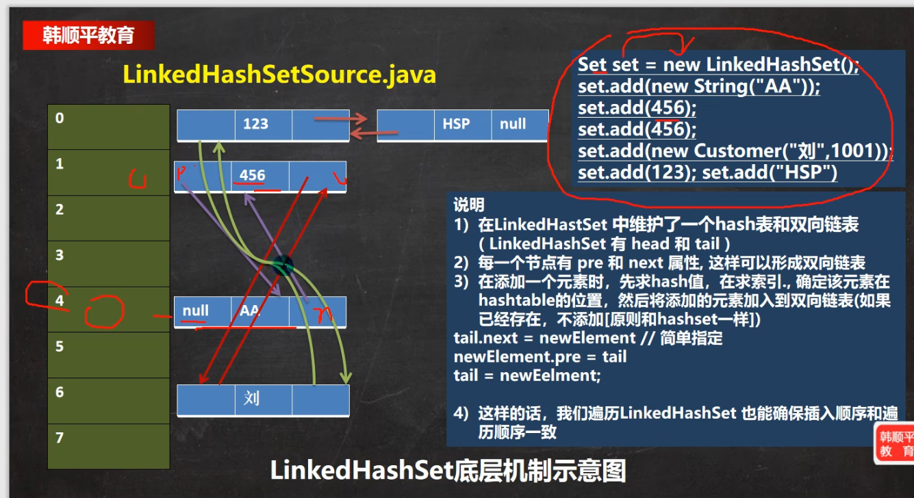
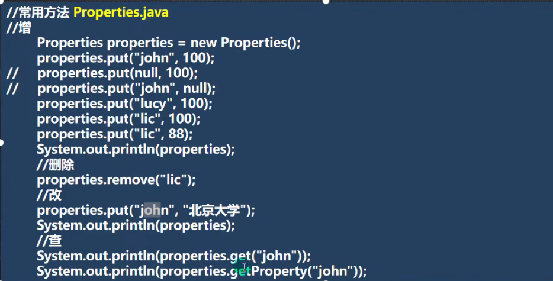
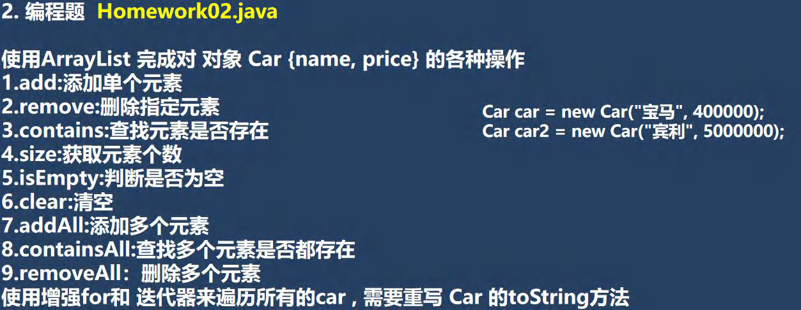
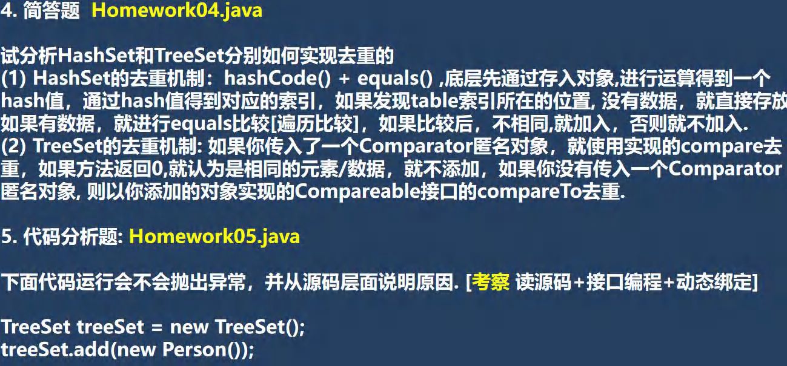
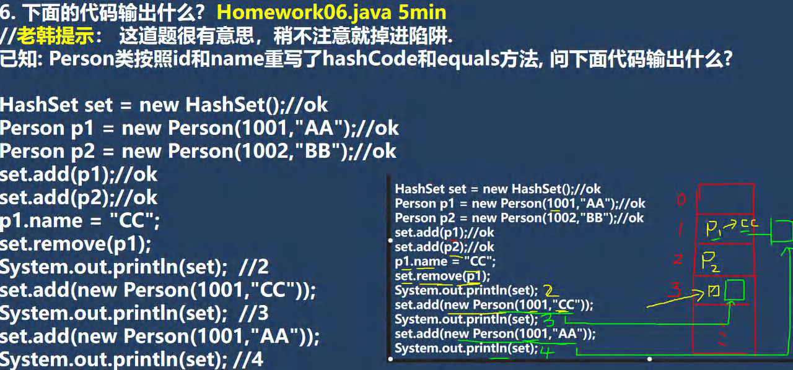

# 	JAVA第14章随记 集合

## 集合


## 集合的框架体系⭐⭐⭐⭐⭐(背)


```java
//1. 集合主要是两组(单列集合 , 双列集合)
//2. Collection 接口有两个重要的子接口 List Set , 他们的实现子类都是单列集合
//3. Map 接口的实现子类 是双列集合，存放的 K-V 键值对
```

## Collection接口和常用方法


### iterator迭代器

#### 1. Iterator的基本概念

Iterator是Java集合框架中的一个接口，它位于`java.util`包中。Iterator不是集合本身，而是一种用于遍历集合的机制。任何实现了`Iterable`接口的集合（如ArrayList、LinkedList、HashSet等）都可以通过调用`iterator()`方法获取一个迭代器对象。

Iterator的核心作用是提供一种统一的遍历集合元素的方式，无论底层集合的具体实现如何，你都可以使用相同的方法来访问其中的元素。

#### 2. Iterator的核心方法

Iterator接口定义了三个核心方法，掌握了它们就掌握了Iterator的使用：

| 方法名      | 返回值      | 功能描述                                   |
| :---------- | :---------- | :----------------------------------------- |
| `hasNext()` | `boolean`   | 检查是否还有更多元素可供遍历               |
| `next()`    | `E`（泛型） | 返回下一个元素，并将指针向后移动           |
| `remove()`  | `void`      | 删除上次调用`next()`返回的元素（可选操作） |

##### 2.1 hasNext()和next()方法

`hasNext()`方法用于检查集合中是否还有未遍历的元素，而`next()`方法则实际获取下一个元素并将迭代器的指针向后移动。

```java
import java.util.ArrayList;
import java.util.Iterator;

public class IteratorExample {
    public static void main(String[] args) {
        // 创建一个ArrayList集合
        ArrayList<String> fruits = new ArrayList<>();
        fruits.add("Apple");
        fruits.add("Banana");
        fruits.add("Cherry");
        
        // 获取迭代器
        Iterator<String> iterator = fruits.iterator();
        
        // 使用while循环遍历集合
        while(iterator.hasNext()) {
            String fruit = iterator.next();
            System.out.println(fruit);
        }
    }
}
```

##### 2.2 remove()方法

`remove()`方法用于删除迭代器当前指向的元素。**重要提示**：必须先调用`next()`方法定位到元素后，才能调用`remove()`方法。

```java
import java.util.ArrayList;
import java.util.Iterator;

public class RemoveExample {
    public static void main(String[] args) {
        ArrayList<Integer> numbers = new ArrayList<>();
        numbers.add(12);
        numbers.add(8);
        numbers.add(2);
        numbers.add(23);
        
        Iterator<Integer> it = numbers.iterator();
        while(it.hasNext()) {
            Integer num = it.next();
            if(num < 10) {
                it.remove(); // 删除小于10的元素
            }
        }
        
        System.out.println(numbers); // 输出: [12, 23]
    }
}
```

#### 3. Iterator的工作原理

理解Iterator的工作原理有助于避免常见的错误。你可以把迭代器想象成一个指向集合元素的"指针"：

1. 当通过`集合.iterator()`获取迭代器时，指针位于第一个元素之前
2. 第一次调用`next()`，指针移动到第一个元素并返回该元素
3. 后续调用`next()`，指针继续向后移动
4. 当`hasNext()`返回`false`时，表示所有元素已遍历完毕

Iterator（迭代器）是Java中用于遍历集合（如ArrayList、HashSet等）的重要工具。它提供了一种标准的方法来逐个访问集合中的元素，而无需关心集合的内部结构。下面我将为你详细解释Iterator的用法、原理和注意事项。

下面的表格展示了迭代器遍历集合`["A", "B", "C"]`的过程：

| 操作        | 返回值  | 指针位置 |
| :---------- | :------ | :------- |
| 初始状态    | -       | ↑A, B, C |
| `hasNext()` | `true`  | ↑A, B, C |
| `next()`    | "A"     | A, ↑B, C |
| `next()`    | "B"     | A, B, ↑C |
| `next()`    | "C"     | A, B, C↑ |
| `hasNext()` | `false` | A, B, C↑ |

#### 4. 增强for循环与Iterator的关系

Java的增强for循环，增强 for 循环是一种“语法糖”，意思是它只是现有技术的简便写法，编译后会被转换成等价的底层实现,==底层仍然使用Iterator实现。==

```java
// 增强for循环
/*
for (元素类型 局部变量名 : 要遍历的数组或集合) {
    // 循环体，可以使用局部变量
}
*/
for (String fruit : fruits) {
    System.out.println(fruit);
}

// 等价于以下Iterator写法
Iterator<String> iterator = fruits.iterator();
while(iterator.hasNext()) {
    String fruit = iterator.next();
    System.out.println(fruit);
}
```

虽然增强for循环更简洁，但它有一个限制：**在增强for循环中不能直接修改集合结构（如删除元素）**，否则会抛出`ConcurrentModificationException`异常。需要删除元素时，必须使用显式的Iterator。

#### 5.测试题


```java
import java.util.ArrayList;
import java.util.Iterator;
import java.util.List;

// 定义Dog类
class Dog {
    private String name;
    private int age;

    // 构造方法，用于初始化name和age
    public Dog(String name, int age) {
        this.name = name;
        this.age = age;
    }

    // 重写toString方法，自定义输出格式
    @Override
    public String toString() {
        return "Dog{name='" + name + "', age=" + age + "}";
    }
}

// 主类
public class CollectionExercise {
    public static void main(String[] args) {
        // 1. 创建ArrayList并赋给List接口引用（多态：List是接口，ArrayList是实现类）
        List dogList = new ArrayList();

        // 创建3个Dog对象并添加到ArrayList中
        dogList.add(new Dog("Buddy", 3));
        dogList.add(new Dog("Max", 5));
        dogList.add(new Dog("Charlie", 2));

        // 2. 使用迭代器遍历 快捷键itit
        System.out.println("=== 使用迭代器遍历 ===");
        Iterator<Dog> iterator = dogList.iterator(); // 获取迭代器对象
        while (iterator.hasNext()) { // 检查是否还有下一个元素
            Dog dog = iterator.next(); // 获取下一个元素并移动指针
            System.out.println(dog); // 自动调用dog的toString方法
        }

        // 3. 使用增强for循环遍历 快捷键I
        System.out.println("\n=== 使用增强for循环遍历 ===");
        for (Dog dog : dogList) { // 语法：for (元素类型 变量 : 集合)
            System.out.println(dog);
        }
    }
}
```

------

## List接口和常用方法


List 接口是 Java 集合框架中非常核心的一部分，它代表了一个==**有序、可重复**==的序列。下面这个表格汇总了 List 主要实现类的特点，帮助你快速建立整体印象：

| 实现类                   | 底层数据结构         | 线程安全           | 随机访问效率        | 插入/删除效率                 | 典型适用场景                 |
| :----------------------- | :------------------- | :----------------- | :------------------ | :---------------------------- | :--------------------------- |
| **ArrayList**            | 动态数组             | **否**             | **O(1) - 快**       | O(n) - 慢（需移动元素）       | 查询频繁，增删操作少         |
| **LinkedList**           | 双向链表             | **否**             | O(n) - 慢（需遍历） | **O(1) - 快**（在已知节点处） | 频繁在列表中间进行插入和删除 |
| **Vector**               | 动态数组             | **是**（方法同步） | O(1) - 快           | O(n) - 慢                     | 遗留系统，线程安全需求       |
| **CopyOnWriteArrayList** | 动态数组（写时复制） | **是**（写时复制） | O(1) - 快（读）     | O(n) - 慢（写）               | 读多写极少的高并发场景       |

理解 List 接口，首先要掌握它的三个核心特性：

- **有序性**：元素按照插入的顺序存储，第一个添加的元素索引为0，第二个为1，以此类推。
- **可重复性**：允许存储相同的元素。
- **索引支持**：可以通过类似数组的下标（从0开始）来精确访问和操作元素。

### List 常用的操作方法：

**1. 增加元素**

- `boolean add(E e)`: 将元素追加到列表末尾。
- `void add(int index, E element)`: 在指定索引位置插入元素，该位置及后续的元素会自动后移。

**2. 删除元素**

- `E remove(int index)`: 移除指定索引位置的元素，并返回被移除的元素。
- `boolean remove(Object o)`: 移除列表中第一次出现的指定元素（如果存在），返回是否成功移除。

**3. 修改元素**

- `E set(int index, E element)`: 用指定元素替换列表中指定位置的元素，并返回被替换的旧元素。

**4. 查询元素**

- `E get(int index)`: 返回列表中指定位置的元素。
- `int indexOf(Object o)`: 返回指定元素在列表中第一次出现的索引，如果不存在则返回-1。
- `int lastIndexOf(Object o)`: 返回指定元素在列表中最后一次出现的索引。
- `int size()`: 返回列表中的元素个数。
- `boolean contains(Object o)`: 判断列表是否包含指定元素。
- `boolean isEmpty()`: 判断列表是否为空。

**5. 其他操作**

- `void clear()`: 清空列表中的所有元素。
- `List<E> subList(int fromIndex, int toIndex)`: 返回从 `fromIndex`（包含）到 `toIndex`（不包含）的子列表视图。

```java
import java.util.ArrayList;
import java.util.List;

public class ListBasicExample {
    public static void main(String[] args) {
        // 1. 创建一个ArrayList（使用List接口引用，这是良好的编程习惯）
        List<String> cityList = new ArrayList<>();

        // 2. 添加元素
        cityList.add("Beijing"); // 索引0
        cityList.add("Shanghai"); // 索引1
        cityList.add("Guangzhou"); // 索引2
        cityList.add(1, "Shenzhen"); // 在索引1处插入，原索引1及之后的元素后移

        System.out.println("初始列表: " + cityList); // 输出: [Beijing, Shenzhen, Shanghai, Guangzhou]

        // 3. 查询元素
        String city = cityList.get(2);
        System.out.println("索引2的城市是: " + city); // 输出: Shanghai
        System.out.println("深圳的索引位置: " + cityList.indexOf("Shenzhen")); // 输出: 1
        System.out.println("列表大小: " + cityList.size()); // 输出: 4

        // 4. 修改元素
        String oldCity = cityList.set(3, "Hangzhou");
        System.out.println("将" + oldCity + "替换为Hangzhou后: " + cityList); // 输出: [Beijing, Shenzhen, Shanghai, Hangzhou]

        // 5. 删除元素
        cityList.remove("Shenzhen"); // 按元素删除
        cityList.remove(0); // 按索引删除
        System.out.println("删除部分元素后: " + cityList); // 输出: [Shanghai, Hangzhou]

        // 6. 子列表
        List<String> subList = cityList.subList(0, 1);
        System.out.println("子列表: " + subList); // 输出: [Shanghai]
    }
}
```

###  遍历List的三种方式

#### **1. 普通 for 循环（使用索引）**

当需要知道元素的索引时使用。

```java
for (int i = 0; i < list.size(); i++) {
    String item = list.get(i);
    System.out.println("索引 " + i + ": " + item);
}
```

#### **2. 增强 for 循环（for-each）**

语法简洁，适用于只需遍历元素而无需索引的场景。

```java
for (String item : list) {
    System.out.println(item);
}
```

#### **3. 迭代器（Iterator）**

提供了安全的遍历方式，可以在遍历过程中使用迭代器的 `remove()`方法删除元素，而不会引发并发修改异常。

```java
java.util.Iterator<String> iterator = list.iterator();
while (iterator.hasNext()) {
    String item = iterator.next();
    System.out.println(item);
    // 如果需要，可以在这里安全地使用 iterator.remove(); 删除当前元素
}
```

------

## 改查多ArrayList (Collection-List子类)

### 定义

底层的数据结构就是**数组**，数组元素类型为 Object 类型，即可以存放所有类型数据。对 ArrayList 类的实例的所有操作底层都是基于数组的。

### 注意事项

1.**线程不安全**

ArrayList 是**非同步的**，多个线程同时修改（添加、删除）可能导致数据不一致或异常。

2.**Fail-Fast 机制**

当使用迭代器遍历 ArrayList 时，如果**直接通过 ArrayList 的方法（非迭代器自身的 `remove`方法）修改了集合的结构**，迭代器会立即抛出 `ConcurrentModificationException`异常，这就是 fail-fast。这是为了尽早发现并发修改问题，避免更隐蔽的错误。

```java
// 错误示例：会抛出ConcurrentModificationException
Iterator<String> it = list.iterator();
while (it.hasNext()) {
    String s = it.next();
    if ("A".equals(s)) {
        list.remove(s); // 错误！直接调用集合的remove方法
    }
}

// 正确做法：使用迭代器的remove方法
Iterator<String> it = list.iterator();
while (it.hasNext()) {
    String s = it.next();
    if ("A".equals(s)) {
        it.remove(); // 正确！使用迭代器的remove方法
    }
}
```

ArrayList 是 List 接口的大小可变数组的实现；
ArrayList 实现了所有可选列表操作，并允许 null 元素；
ArrayList 不断添加元素，容量也会自动增长；

### 扩容机制

| **默认初始容量** | 10                                                           |
| ---------------- | ------------------------------------------------------------ |
| **扩容机制**     | 通常增加为原容量的 1.5 倍（`int newCapacity = oldCapacity + (oldCapacity >> 1)`） |

```java
// 1. 无参构造：创建一个初始容量为10的空列表（实际首次添加元素时才分配容量为10的数组，刚开始容量为0，10满了再扩容原本的1.5倍）
ArrayList<String> list1 = new ArrayList<>(); 

// 2. 指定初始容量：如果预先知道大致容量，可避免初期频繁扩容，提升性能，下次扩容直接扩容1.5倍
ArrayList<Integer> list2 = new ArrayList<>(100); 

// 3. 通过集合构造：创建一个包含指定集合所有元素的新ArrayList
List<String> existingList = Arrays.asList("A", "B", "C");
ArrayList<String> list3 = new ArrayList<>(existingList);
```

### 底层结构和源码分析


 

------

## Vector类

| 实现类     | 底层数据结构 | 线程安全(synchronized) | 随机访问效率 | 插入/删除效率 | 典型适用场景           |
| :--------- | :----------- | :--------------------- | :----------- | :------------ | :--------------------- |
| **Vector** | 动态数组     | **是**（方法同步）     | O(1) - 快    | O(n) - 慢     | 遗留系统，线程安全需求 |

### Vector和ArrayList的比较


### Vector源码解读

```java
//老韩解读源码 

//1. new Vector() 底层

 /* public Vector() 

{ this(10); } 

补充：如果是 Vector vector = new Vector(8);

 走的方法: public Vector(int initialCapacity) 

{ this(initialCapacity, 0); } 

//2. vector.add(i) 

2.1 //下面这个方法就添加数据到 vector 集合 

public synchronized boolean add(E e) { 

	modCount++; 

	ensureCapacityHelper(elementCount + 1);

 	elementData[elementCount++] = e; 

	return true; } 

2.2 //确定是否需要扩容 条件 ：minCapacity - elementData.length>0

 private void ensureCapacityHelper(int minCapacity) { 

// overflow-conscious code 

if (minCapacity - elementData.length > 0)

	grow(minCapacity); } 

2.3 //如果 需要的数组大小 不够用，就扩容 , 扩容的算法 

//newCapacity = oldCapacity + ((capacityIncrement > 0) ? capacityIncrement : oldCapacity); //就是扩容两倍.

private void grow(int minCapacity) { 

    // overflow-conscious code 

    int oldCapacity = elementData.length; 

    int newCapacity = oldCapacity + ((capacityIncrement > 0) ? capacityIncrement : oldCapacity); 

    if (newCapacity - minCapacity < 0) 

    newCapacity = minCapacity; 

    if (newCapacity - MAX_ARRAY_SIZE > 0) 

    newCapacity = hugeCapacity(minCapacity); 

    elementData = Arrays.copyOf(elementData, newCapacity); }
```

------

## 增删多LinkedList(Collection-List子类)

| 特性          | 说明                                                         |
| :------------ | :----------------------------------------------------------- |
| **底层实现**  | 双向链表（每个节点包含数据、指向前驱节点的引用和指向后继节点的引用） |
| **数据特性**  | 有序、可重复、允许包含 `null`元素                            |
| **随机访问**  | **较慢**（O(n)），需要从头或尾开始遍历链表                   |
| **插入/删除** | **高效**（在已知节点位置时复杂度为 O(1)，只需调整指针）      |

链表中的每个基本单位称为**节点（Node）**。在 LinkedList 中，节点是一个静态内部类，其结构如下：

```java
private static class Node<E> {
    E item;        // 当前节点存储的数据
    Node<E> next;  // 指向下一个节点的引用（指针）
    Node<E> prev;  // 指向上一个节点的引用（指针）
    // 构造方法...
}
```

LinkedList 本身则维护了两个重要的成员变量，分别指向链表的首尾：

- `transient Node<E> first;`：指向链表的**第一个节点**。
- `transient Node<E> last;`：指向链表的**最后一个节点**。
- `transient int size;`：记录链表中节点的**数量**。

#### 1. 作为 List 的基本操作

这些方法是你从 ArrayList 那里就已经熟悉的。

- **添加元素**

  ```java
  LinkedList<String> list = new LinkedList<>();
  list.add("Apple");       // 添加到末尾 [Apple]
  list.add(0, "Banana");  // 在索引0处插入 [Banana, Apple]
  list.addFirst("Mango"); // 添加到开头 [Mango, Banana, Apple]
  list.addLast("Orange"); // 添加到末尾 [Mango, Banana, Apple, Orange]
  ```

- **删除元素**

  ```java
  list.remove("Banana");   // 删除指定元素 [Mango, Apple, Orange]
  list.remove(1);          // 删除索引1处的元素 [Mango, Orange]
  list.removeFirst();      // 删除首元素 [Orange]
  list.removeLast();       // 删除尾元素 []
  ```

- **获取与查询元素**

  ```
  LinkedList<String> list = new LinkedList<>();
  list.add("A");
  list.add("B");
  list.add("C");
  
  String element = list.get(1); // 获取索引1的元素，返回 "B"
  String first = list.getFirst(); // 获取第一个元素 "A"
  String last = list.getLast();  // 获取最后一个元素 "C"
  boolean hasB = list.contains("B"); // 判断是否包含 "B"，返回 true
  int indexOfB = list.indexOf("B"); // 查找 "B" 第一次出现的索引，返回 1
  ```

#### 2. 作为 Queue/Deque 的队列和栈操作

这是 LinkedList 的特色功能，非常实用。

- **作为队列（FIFO: 先进先出）**

  ```
  Queue<String> queue = new LinkedList<>();
  queue.offer("First");  // 入队，添加到队尾
  queue.offer("Second");
  String head = queue.peek(); // 获取队首元素但不移除，返回 "First"
  String out = queue.poll();  // 出队，移除并返回队首元素 "First"
  ```

- **作为栈（LIFO: 后进先出）**

  ```
  Deque<String> stack = new LinkedList<>();
  stack.push("Element1"); // 压栈，相当于 addFirst
  stack.push("Element2");
  String top = stack.peek(); // 获取栈顶元素但不移除，返回 "Element2"
  String pop = stack.pop();  // 弹栈，移除并返回栈顶元素 "Element2"
  ```

------

## ArrayList和LinkList的比较⭐⭐⭐⭐⭐


------

## Set接口和常用方法

Set接口是Java集合框架中一个非常重要的成员，它专门用于存储**不重复的元素**。下面这个表格汇总了Set接口的核心特性和主要实现类的对比，帮助你快速建立整体印象。

| 特性/实现类      | **HashSet**                            | **LinkedHashSet**             | **TreeSet**                        |
| :--------------- | :------------------------------------- | :---------------------------- | :--------------------------------- |
| **底层实现**     | 基于 HashMap (哈希表)                  | 继承 HashSet，使用链表+哈希表 | 基于 TreeMap (红黑树)              |
| **元素顺序**     | ==**无序**==，不保证插入和遍历顺序一致 | ==**按插入顺序**==排列        | ==**按自然顺序或自定义顺序**==排序 |
| **线程安全**     | 否                                     | 否                            | 否                                 |
| **允许null元素** | 是 (最多一个)                          | 是 (最多一个)                 | 否 (JDK7+)                         |
| **性能特点**     | ==增删查==非常快，平均时间复杂度 O(1)  | 性能略低于HashSet，但遍历快   | 增删查慢，时间复杂度 O(log n)      |
| **适用场景**     | ==快速去重，不关心顺序==               | 去重且需要保留插入顺序        | 需要元素排序或范围查询             |

###  Set 接口核心特性

Set接口的核心特性源于其定义，理解这些特性是正确使用它的关键：

1. **元素唯一性**：这是Set最根本的特性。它不允许存储重复的元素。当你试图添加一个已经存在于Set中的元素时，`add()`方法会返回`false`，且集合内容不会改变。它判断元素是否重复，依赖于对象的`equals()`和`hashCode()`方法，而非简单的`==`运算符。
2. **无序性**：这里的“无序”指的是**不保证元素存入的顺序和取出的顺序一致**。特别是最常用的`HashSet`，其元素的存储位置由哈希值决定，因此遍历顺序是不确定的。需要注意的是，`LinkedHashSet`和`TreeSet`是例外，它们会维护某种特定的顺序。
3. **无索引**：与List不同，Set不提供通过整数索引（如`get(int index)`）来直接访问元素的方法。你必须使用迭代器或增强型for循环来遍历所有元素。

### Set 接口常用方法详解

```java
Set<String> set = new HashSet<>();
set.add("Apple");  // 返回 true
set.add("Banana"); // 返回 true
set.add("Apple");  // 返回 false，因为"Apple"已存在
```

- **`boolean remove(Object o)`**
  - **功能**：如果指定元素存在，则从此集合中移除该元素。
  - **返回值**：如果集合包含该元素并被移除，则返回`true`。
  - **示例**：`set.remove("Banana"); // 返回 true`
- **`boolean contains(Object o)`**
  - **功能**：判断集合中是否包含指定元素。
  - **返回值**：包含则返回`true`。
  - **示例**：`set.contains("Apple"); // 返回 true`
- **`int size()`**
  - **功能**：返回集合中的元素个数。
  - **示例**：`int count = set.size(); // 假设此时 count 为 2`
- **`boolean isEmpty()`**
  - **功能**：判断集合是否为空（不包含任何元素）。
  - **示例**：`if (set.isEmpty()) { ... }`
- **`void clear()`**
  - **功能**：清空集合中的所有元素。
  - **示例**：`set.clear(); // 清空后，set.size() 为 0`

### 遍历Set集合

由于Set没有索引，遍历必须使用迭代器或增强for循环。

- **增强for循环 (推荐)**：

  ```java
  for (String element : set) {
      System.out.println(element);
  }
  ```

- **使用Iterator迭代器**：

  ```java
  Iterator<String> iterator = set.iterator();
  while (iterator.hasNext()) {
      String element = iterator.next();
      System.out.println(element);
      // 可以使用 iterator.remove() 安全地删除当前元素
  }
  ```

### Set选择建议


## 无序HashSet类(Set子类)

###  创建HashSet对象

使用`new`关键字来创建一个HashSet。在尖括号`<>`中指定集合中要存储的元素类型（例如`String`, `Integer`），这称为泛型，它保证了类型安全。

```java
HashSet<String> sites = new HashSet<>(); // 创建一个用于存放字符串的HashSet[5](@ref)
```

### 添加元素：`add()`方法

使用`add()`方法向集合中添加元素。如果尝试添加一个已经存在的元素，操作不会成功，且方法会返回`false`。

```java
sites.add("Google");
sites.add("Bing");
sites.add("Baidu");
sites.add("Google"); // 这个重复的"Google"不会被添加进去[5,10](@ref)
System.out.println(sites); // 输出可能是 [Google, Baidu, Bing] 或其他顺序
```

#### ⚖️ 添加不同类型对象的区别

HashSet 判断元素是否重复，严重依赖于对象的 ==`hashCode()`和 `equals()`方法==。对于不同类型的对象，这两个方法的行为差异导致了添加结果的不同。

##### **添加 `new String()`与直接添加字符串字面量**

- **关键点**：`String`类已经重写了 `hashCode()`和 `equals()`方法，其计算依据是字符串的 **内容**，而非对象的内存地址。
- **`new String("abc")`和 `new String("abc")`**：虽然是两个不同的对象（使用 `==`比较返回 `false`），但因为它们的内容相同，所以 `hashCode()`返回值相同，`equals()`比较返回 `true`。因此==HashSet 会认为它们是重复元素，第二个不会被添加==。
- **直接添加字符串字面量**：例如 `add("abc")`。在 Java 中，内容相同的字符串字面量可能被编译器优化指向同一个对象（字符串驻留机制），但无论如何，只要内容相同，在 HashSet 看来就是重复的。所以 **`new String("abc")`和 字符串字面量 `"abc"`也会被 HashSet 视为重复元素**。

##### **添加自定义类对象**

- **关键点**：如果你没有在自定义类中重写 `hashCode()`和 `equals()`方法，它们将继承自 `Object`类。`Object`类中的默认实现是基于对象的 **内存地址**。

- **未重写的情况**：即使两个自定义对象的所有字段值都相同（逻辑上相等），因为它们是分别 `new`出来的，内存地址不同，所以默认的 `hashCode()`返回值很可能不同，`equals()`比较也会返回 `false`。HashSet 会认为它们是不同的对象，从而都能添加进去。这通常 **不符合 Set 集合元素唯一的预期**。

- **正确重写后**：为了让 HashSet 能正确判断自定义对象的唯一性，你必须在该类中重写 `hashCode()`和 `equals()`方法。重写时，应确保逻辑上相等的对象返回相同的哈希码，并且 `equals()`方法返回 `true`。一个常见的重写例子如下（以 `User`类为例）：

  ```java
  @Override
  public int hashCode() {
      // 使用 Objects.hash 方便地组合多个字段的哈希值
      return Objects.hash(name, age);
  }
  
  @Override
  public boolean equals(Object obj) {
      if (this == obj) return true;
      if (obj == null || getClass() != obj.getClass()) return false;
      User other = (User) obj;
      // 比较所有相关字段是否相等
      return age == other.age && Objects.equals(name, other.name);
  }
  ```

  重写后，只要两个 `User`对象的 `name`和 `age`相同，HashSet 就会正确识别为重复元素。

## HashSet添加元素的底层源码⭐⭐⭐⭐⭐

HashSet底层是HashMap，HashMap底层是(数组＋链表＋红黑树)

==先算hasCode，hashCode转成的索引相同的话，比较equals 不同的话添加进去。==


#### 1. HashSet 的底层结构：HashMap

这是理解 `HashSet`所有行为的基石。

- **“HashSet 底层是 HashMap”**：这意味着你创建一个 `HashSet`时，它内部其实封装了一个 `HashMap`对象。
- **`HashSet`的元素去哪了？**：当你调用 `hashSet.add("abc")`时，内部的 `HashMap`会执行 `map.put("abc", PRESENT)`。这里的 `"abc"`成为了 `HashMap`的 **Key**，而 **Value** 则是一个固定的、无实际意义的静态对象。正因为 `HashMap`的 **Key** 是唯一的，所以 `HashSet`天然就具有了元素唯一的特性。

#### 2. 添加元素的详细流程

这个过程就是 `HashMap`存入 Key 的过程，下图直观再现了从计算哈希值到最终决定添加或放弃的完整逻辑链：

现在我们来分解图中的每一步：

- **第2点：得到哈希值，转为索引值**
  - **得到哈希值**：首先，它会调用待添加元素的 `hashCode()`方法，计算出一个整型的哈希值。
  - **转为索引值**：这个哈希值通常很大，不能直接作为数组下标。它会通过一个扰动函数（为了减少哈希冲突）和模运算（如 `索引 = (数组长度 - 1) & hash`），最终映射到底层数组（`table`）的一个具体位置上。这个位置就是元素将要存放的“桶”。
- **第3、4点：检查位置并直接加入**
  - 系统会去检查计算出的那个索引位置是否为空。
  - **如果为空**：说明是第一次遇到这个哈希值的元素，没有发生冲突。太好了！直接在这个位置创建一个新节点，把元素放进去。添加成功。
- **第5点：处理哈希冲突（该位置已有元素）**
  - **如果该位置不为空**：说明发生了“哈希冲突”，即不同的元素计算出了相同的数组索引。
  - 这时，`HashSet`会调用 `equals()`方法进行精确比较：（eqals不是简单的比较，Dogs类可以由程序员自由重写）
    - **如果 `equals()`返回 `true`**：说明两个元素是“相等的”（根据你的业务逻辑定义）。`HashSet`会**放弃添加**这个新元素，因为它要保证唯一性。
    - **如果 `equals()`返回 `false`**：说明两个元素只是哈希值冲突了，但本身并不相同。这时，新元素会以**链表**的形式添加到这个位置已有元素的后面。

## HashSet的扩容和转成红黑树机制

- **首次添加时的初始化**：当第一次调用`add()`方法时，底层的`HashMap`会初始化它的存储数组（称为`table`）。如PPT所示，初始容量为**16**。
- **临界值的计算**：临界值 = 容量 × 负载因子。默认负载因子是**0.75**，所以初始临界值 = 16 * 0.75 = **12**。这个值决定了何时需要扩容。

### 扩容机制：动态增长以保持性能

当元素越来越多时，为了减少哈希冲突、保证操作效率，`HashSet`（实际上是底层的`HashMap`）需要进行扩容。

- **触发条件**：当`HashSet`中的元素数量（==不仅仅是`table`数组被占用的位置，而是所有元素的总数==）**超过临界值**时，就会触发扩容。如图中例子，当添加第13个元素时，当前容量16和临界值12已无法满足需求。
- **扩容方式**：扩容会创建一个新的、更大的数组。新容量通常是旧容量的**2倍**（16 -> 32）。这是一种权衡，既避免频繁扩容，又不会浪费太多内存。
- **重新散列**：扩容后，所有已存在的元素需要重新计算其在新数组中的位置，并移动过去。这个过程开销较大，因此如果能预估元素数量，在创建`HashSet`时指定一个合适的初始容量是提升性能的好习惯。
- **更新临界值**：扩容后，临界值也会重新计算：新临界值 = 新容量 × 负载因子 = 32 * 0.75 = **24**。

### 树化：应对大量哈希冲突的优化

这是Java 8引入的重要优化，用于解决当哈希冲突严重时，链表过长导致的查询性能下降问题。

- **问题场景**：不同的元素可能计算出相同的数组索引，从而在同一个位置形成链表。如果链表很长，遍历查找的效率会从O(1)退化为O(n)。
- **树化条件（两个条件必须同时满足）**：
  1. ==**链表长度达到 8**。==
  2. ==**当前`table`数组的总长度达到 64**==。
- **树化行动**：当同时满足以上两个条件时，将该位置的链表转换为一颗**红黑树**。
- **目的**：红黑树是一种自平衡的二叉搜索树，即使数据量较大，其查找、插入的时间复杂度也能维持在O(log n)，远优于长链表的O(n)。
- **否则扩容**：如果链表长度达到8，但数组总长度未达到64，HashMap会选择**优先扩容**。因为扩容可能会将原本冲突的元素重新分散到不同的位置，从而直接缩短链表长度，这是一种成本可能更低的解决方式。

## HashSet的实践


```java
import java.util.HashSet;
import java.util.Objects;

// Employee类
class Employee {
    private String name;
    private int age;
    
    // 构造方法
    public Employee(String name, int age) {
        this.name = name;
        this.age = age;
    }
    
    // getter方法
    public String getName() { return name; }
    public int getAge() { return age; }
    
    // 关键步骤1：重写hashCode方法
    @Override
    public int hashCode() {
        // 使用Objects.hash()方法，基于name和age计算哈希值
        return Objects.hash(name, age);
    }
    
    // 关键步骤2：重写equals方法
    @Override
    public boolean equals(Object obj) {
        if (this == obj) return true; // 如果是同一个对象，直接返回true
        if (obj == null || getClass() != obj.getClass()) return false; // 如果对象为null或类型不同
        
        Employee other = (Employee) obj; // 类型转换
        
        // 比较name和age是否都相等
        return age == other.age && Objects.equals(name, other.name);
    }
    
    // 可选：重写toString方法，方便输出查看
    @Override
    public String toString() {
        return "Employee{name='" + name + "', age=" + age + "}";
    }
}

// 测试类
public class HashSetExercise {
    public static void main(String[] args) {
        HashSet<Employee> employees = new HashSet<>();
        
        // 创建3个Employee对象
        Employee emp1 = new Employee("张三", 25);
        Employee emp2 = new Employee("李四", 30);
        Employee emp3 = new Employee("张三", 25); // 与emp1相同
        
        // 添加到HashSet
        System.out.println("添加emp1: " + employees.add(emp1)); // 输出true
        System.out.println("添加emp2: " + employees.add(emp2)); // 输出true
        System.out.println("添加emp3: " + employees.add(emp3)); // 输出false（重复，添加失败）
        
        // 验证结果
        System.out.println("最终集合大小: " + employees.size()); // 输出2
        System.out.println("集合内容: " + employees);
    }
}
```

### 扩展


```java
import java.util.HashSet;
import java.util.Objects;

// 1. 定义 MyDate 类
class MyDate {
    private int year;
    private int month;
    private int day;

    public MyDate(int year, int month, int day) {
        this.year = year;
        this.month = month;
        this.day = day;
    }

    // 关键：为 MyDate 类重写 hashCode 和 equals
    // 这样，当且仅当年、月、日都相同时，两个 MyDate 对象才被视为相等
    @Override
    public int hashCode() {
        return Objects.hash(year, month, day);
    }

    @Override
    public boolean equals(Object o) {
        if (this == o) return true;
        if (o == null || getClass() != o.getClass()) return false;
        MyDate myDate = (MyDate) o;
        return year == myDate.year &&
                month == myDate.month &&
                day == myDate.day;
    }

    // 可选：重写 toString 方便查看结果
    @Override
    public String toString() {
        return year + "-" + month + "-" + day;
    }
}

// 2. 定义 Employee 类
class Employee {
    private String name;
    private double sal;
    private MyDate birthday;

    public Employee(String name, double sal, MyDate birthday) {
        this.name = name;
        this.sal = sal;
        this.birthday = birthday;
    }

    // 关键：为 Employee 类重写 hashCode 和 equals
    // 判断依据是 name 和 birthday 是否都相等
    @Override
    public int hashCode() {
        return Objects.hash(name, birthday);
    }

    @Override
    public boolean equals(Object o) {
        if (this == o) return true;
        if (o == null || getClass() != o.getClass()) return false;
        Employee employee = (Employee) o;
        return Objects.equals(name, employee.name) &&
                Objects.equals(birthday, employee.birthday);
    }

    // 可选：重写 toString 方便查看结果
    @Override
    public String toString() {
        return "Employee{" +
                "name='" + name + '\'' +
                ", sal=" + sal +
                ", birthday=" + birthday +
                '}';
    }
}

// 3. 测试类
public class HashSetExercise {
    public static void main(String[] args) {
        HashSet<Employee> set = new HashSet<>();

        // 创建几个 MyDate 对象
        MyDate date1 = new MyDate(1990, 1, 1);
        MyDate date2 = new MyDate(1995, 5, 5);
        MyDate date3 = new MyDate(1990, 1, 1); // 与 date1 相同

        // 创建 Employee 对象
        Employee emp1 = new Employee("张三", 10000, date1);
        Employee emp2 = new Employee("李四", 12000, date2);
        Employee emp3 = new Employee("张三", 15000, date3); // 名字和生日与 emp1 相同，但工资不同

        // 尝试添加到 HashSet
        System.out.println("添加 emp1（张三，1990-1-1）: " + set.add(emp1)); // 返回 true
        System.out.println("添加 emp2（李四，1995-5-5）: " + set.add(emp2)); // 返回 true
        System.out.println("添加 emp3（张三，1990-1-1）: " + set.add(emp3)); // 返回 false！因为重复了

        System.out.println("最终集合中的员工数量: " + set.size()); // 输出 2

        // 遍历集合查看内容
        for (Employee emp : set) {
            System.out.println(emp);
        }
    }
}
```

## LinkedHashSet(不重复 插入和取出顺序一致)

### 核心特性与底层原理

简单来说，你可以把 LinkedHashSet 看作是 **HashSet 和 LinkedList 的优点结合体**。

| 特性               | 说明                                                         |
| :----------------- | :----------------------------------------------------------- |
| **元素唯一性**     | 继承自 `Set`接口，不允许存储重复的元素。                     |
| **插入顺序有序**   | 内部维护了一个**双向链表**，==严格按照元素被添加到集合的先后顺序来记录顺序==。当你遍历集合时，元素的顺序就是你的添加顺序。 |
| **允许 null 元素** | 可以存储一个 `null`元素。                                    |
| **非线程安全**     | 默认不是线程安全的，多线程环境下访问需要外部同步。           |

**底层实现**：正如流程图所示，LinkedHashSet 的底层是基于 `LinkedHashMap`实现的。它结合了：

1. **哈希表（Hash Table）**：用于快速定位元素，提供了 `O(1)`时间复杂度的添加、删除和查找操作。
2. **双向链表（Doubly-Linked List）**：贯穿于所有元素，专门用于记录元素的**插入顺序**。这正是它与 HashSet 最本质的区别。



## Map接口

### 1. 基本概念

`Map`是Java集合框架中的一个接口，它用于存储“键值对（Key-Value Pair）”数据。每个元素都包含一个键（Key）和一个值（Value），键是唯一的，但值可以重复。

**简单比喻**：

> 你可以把`Map`想象成一个字典或电话簿：
>
> - **键（Key）**：就像字典中的“单词”或电话簿中的“姓名”
> - **值（Value）**：就像字典中的“解释”或电话簿中的“电话号码”

### 2. Map 的特点

- 键不允许重复（如果重复put，会覆盖旧值）
- 每个键最多只能映射到一个值
- value可以重复
- key可以为null但只能有一个，value也可以为null且不限制
- 常见实现类：`HashMap`, `TreeMap`, `LinkedHashMap`


本质上就是把Table表的每个Node的kv键值对打包给一个新的Entry对象，再把这个对象放到集合EntrySet里面，一来方便遍历，二来方便统一管理，第三个可以防止Node的其他值被篡改！

因为程序员只需要关注键值对，对Node的其他属性不关心，所以把kv封装成Entry丢到集合里面让程序员自己玩，Node我就不给你了。


```java
实际存储：Node (底层实现)
          ↓ 实现
对外接口：Entry (抽象概念)
          ↓ 封装
方便使用：EntrySet (工具集合)
```

### 3.Map常用方法

```java
import java.util.*;

public class HashMapExample {
    public static void main(String[] args) {
        // 1. 创建HashMap
        Map<String, Integer> map = new HashMap<>();

        // 2. 添加元素
        map.put("Alice", 25);
        map.put("Bob", 30);
        map.put("Charlie", 28);
        map.put("Alice", 26); // 会覆盖之前的25

        // 3. 获取元素
        System.out.println("Alice的年龄: " + map.get("Alice")); // 26

        // 4. 遍历所有键
        for (String name : map.keySet()) {
            System.out.println(name);
        }

        // 5. 遍历所有值
        for (Integer age : map.values()) {
            System.out.println(age);
        }

        // 6. 遍历键值对（推荐方式）
        for (Map.Entry<String, Integer> entry : map.entrySet()) {
            System.out.println(entry.getKey() + ":" + entry.getValue());
        }
    }
}
```

### 4.Map遍历方法

| 类别                         | 方法                                                     | 核心思想                             | 特点               |
| :--------------------------- | :------------------------------------------------------- | :----------------------------------- | :----------------- |
| **1. 遍历键值对 (EntrySet)** | 1. `entrySet()`+ 增强 for 循环 2. `entrySet()`+ Iterator | 直接拿到**键和值的组合对象**         | **最常用、效率高** |
| **2. 先遍历键 (KeySet)**     | 3. `keySet()`+ 增强 for 循环 4. `keySet()`+ Iterator     | 先拿到所有**键**，再通过键去**取**值 | 效率稍低，写法直观 |

```java
Map<String, Integer> map = new HashMap<>();
map.put("Alice", 25);
map.put("Bob", 30);
map.put("Charlie", 28);
```

#### 方法 1 & 2：通过 `entrySet()`遍历（推荐👍）

##### 为什么需要 `map.entrySet()`？

- `Map`是一个键值对集合，但您不能直接遍历它内部的键值对。
- `entrySet()`方法的作用是返回一个包含所有"键值对包裹"的集合（`Set`）。每个"包裹"都是一个 `Map.Entry`对象，里面装着一个键和对应的值。
- 这样您就可以通过遍历这个集合来访问每个键值对了。

这是**最常用且效率最高**的方法，因为它是直接遍历键值对，不需要再次查询。

##### 方法 1: `entrySet()`+ 增强 for 循环

```java
System.out.println("=== 方法1: entrySet() + 增强for循环 ===");
Set entrySet=map.entrySet();//EntrySet<Map.Entry<k,v>>
for (Object entry: entrySet) {
    //将entry转成Map.entry
    Map.Entry m=(Map.Entry) entry;
    System.out.println("Key: " + m.getKey() + ", Value: " + m.getValue());
}
```

**输出结果：**

```java
Key: Alice, Value: 25
Key: Bob, Value: 30
Key: Charlie, Value: 28
```

**通俗解释：**

> `map.entrySet()`会返回一个装着所有“键值对包裹”的集合。你用 `for`循环拆开每一个包裹，然后直接从包裹里拿出键(`getKey()`)和值(`getValue()`)。

------

##### 方法 2: `entrySet()`+ Iterator（迭代器）

```java
System.out.println("\n=== 方法2: entrySet() + Iterator ===");
Iterator iter=entrySet().iterator();
while (iter.hasNext()) {
    Object entry=iter.next();//Node类型--》实现了Map.entry()
    Map.Entry m=(Map.Entry) entry;
    System.out.println("Key: " + m.getKey() + ", Value: " + m.getValue());
    // 可以在遍历时安全地删除元素
    // if (key.equals("Bob")) {
    //     iterator.remove(); // 安全删除当前元素
    // }
}
```

**通俗解释：**

> 让一个“迭代器小哥”帮你一个一个地检查包裹。他告诉你“还有下一个吗？”(`hasNext()`)，你说“有”，他就把下一个包裹递给你(`next()`)。这种方式的好处是，你可以让小哥直接把某个包裹扔掉(`remove()`)，而不会出错。

#### 方法 3: `keySet()`+ 增强 for 循环

```java
System.out.println("\n=== 方法3: keySet() + 增强for循环 ===");
for (String key : map.keySet()) {
    Integer value = map.get(key); // 通过键获取值
    System.out.println("Key: " + key + ", Value: " + value);
}
```

#### 方法 4: `keySet()`+ Iterator

```java
System.out.println("\n=== 方法4: keySet() + Iterator ===");
Iterator<String> keyIterator = map.keySet().iterator();
while (keyIterator.hasNext()) {
    String key = keyIterator.next();
    Integer value = map.get(key); // 通过键获取值
    System.out.println("Key: " + key + ", Value: " + value);
}
```

**通俗解释：**

> 你先拿到所有包裹的“取件码”（`keySet()`），然后你拿着每一个取件码，再去仓库里找对应的包裹（`get(key)`）。比第一种方法多跑了一趟腿。

### Map练习


```java
package com.Map_;

import java.util.HashMap;
import java.util.Iterator;
import java.util.Map;
import java.util.Set;

public class exercise {
    public static void main(String[] args) {
        Map map = new HashMap();
        map.put(101, new Employee("张三", 20000.0, 101));
        map.put(102, new Employee("李四", 17000.0, 102));
        map.put(103, new Employee("王五", 19000.0, 103));

        //遍历1 entrySet+增强for
        Set entryset = map.entrySet();
        for(Object entry:entryset){
            Map.Entry m=(Map.Entry) entry;
            Object value = m.getValue();
            Employee em=(Employee) value;
            if(em.getSal()>18000){
                System.out.println(m.getKey()+"=="+m.getValue());}
        }
        //遍历2 keySet()+Iterator
        Iterator iterator = map.keySet().iterator();
        while (iterator.hasNext()){
            Object key = iterator.next();
            Employee value = (Employee) map.get(key);
            if(value.getSal()>18000){
                System.out.println(key+"=="+value);
            }
        }
    }
}
class Employee{
    private String name;
    private double sal;
    private int id;

    public Employee(String name, double sal, int id) {
        this.name = name;
        this.sal = sal;
        this.id = id;
    }
    public String getName() {
        return name;
    }
    public void setName(String name) {
        this.name = name;
    }
    public double getSal() {
        return sal;
    }
    public void setSal(double sal) {
        this.sal = sal;
    }
    public int getId() {
        return id;
    }
    public void setId(int id) {
        this.id = id;
    }
    @Override
    public String toString() {
        return "Employee{" +
                "name='" + name + '\'' +
                ", sal=" + sal +
                ", id=" + id +
                '}';
    }
}

```

## HashMap阶段小结


## Map接口实现类-HashTable

HashTable是Java中一个经典的键值对存储数据结构，它通过同步机制实现了线程安全。下面这个表格能帮你快速抓住它的核心要点：

| 特性          | HashTable 的具体实现                                         |
| :------------ | :----------------------------------------------------------- |
| **线程安全**  | 所有公共方法（如`put`, `get`）都使用 `synchronized`关键字修饰，保证多线程环境下的数据安全。 |
| **Null键/值** | **不允许**键（Key）或值（Value）为`null`，否则会抛出`NullPointerException`。 |
| **底层结构**  | **数组 + 链表**。数组中的每个位置称为一个"桶"（Bucket），哈希冲突时，新元素会加入该桶的链表中。 |
| **初始容量**  | 默认初始容量为**11**。扩容时，新容量为**旧容量 × 2 + 1**，以使容量保持为素数（质数），这有助于减少哈希冲突。 |
| **哈希函数**  | `index = (key.hashCode() & 0x7FFFFFFF) % table.length`。通过按位与操作确保索引值为非负数。 |
| **扩容机制**  | 当元素数量**超过阈值11*0.75=8（容量 × 负载因子，默认负载因子为0.75）** 时，会触发`rehash()`操作进行扩容。 |

## Map接口实现类-Properties(HashTable的子类)




## 总结-开发中如何选择集合实现类(==记住==)


## TreeSet类(Set子类)

TreeSet 是 Java 中一个非常实用的集合类，它能够自动对元素进行排序并保证元素的唯一性。下面这个表格能帮你快速抓住它的核心要点：

### 自然顺序的排序规则

#### 字符串的自然顺序 = 字典序（字母顺序）

- 按字符的Unicode编码值逐个比较
- 从第一个字符开始比较，如果相同再比较第二个字符
- 类似于英文字典的排列方式

| 特性          | 说明                                                         |
| :------------ | :----------------------------------------------------------- |
| **核心特性**  | 元素**唯一**，且**自动排序**                                 |
| **底层实现**  | 基于 **红黑树**（一种自平衡的二叉查找树）                    |
| **排序方式**  | 1. **自然排序**：元素类实现 `Comparable`接口 2. **比较器排序**：创建 TreeSet 时传入 `Comparator`对象 |
| **性能特点**  | 插入、删除和查找操作的时间复杂度均为 **O(log n)**            |
| **线程安全**  | **否**，多线程环境下需要外部同步                             |
| **允许 null** | 通常**不允许**，除非使用支持 null 的自定义比较器             |

```java
import java.util.Comparator;
import java.util.TreeSet;

public class TreeSetDemo {
    public static void main(String[] args) {
        // 使用你截图中的自定义比较器创建TreeSet
        TreeSet<String> treeSet = new TreeSet<>(new Comparator<String>() {
            @Override
            public int compare(String o1, String o2) {
                // 按字典顺序排序（自然顺序）
                return o1.compareTo(o2);
            }
        });
        
        // 添加数据 - 就是你截图中的4个字符串
        treeSet.add("jack");
        treeSet.add("tom"); 
        treeSet.add("sp");
        treeSet.add("a");
        
        // 查看排序结果
        System.out.println("排序后的结果: " + treeSet);
        //排序后的结果: [a, jack, sp, tom]
    }
}
```

## TreeMap类(Map子类)

TreeMap 是 Java 集合框架中一个非常实用的类，它能够按照键（Key）的顺序来存储键值对。下面这个表格能帮你快速抓住它的核心要点：

### 自然顺序的排序规则

#### 字符串的自然顺序 = 字典序（字母顺序）

- 按字符的Unicode编码值逐个比较
- 从第一个字符开始比较，如果相同再比较第二个字符
- 类似于英文字典的排列方式

| 特性             | TreeMap 的具体实现                                |
| :--------------- | :------------------------------------------------ |
| **核心数据结构** | 基于 **红黑树**（一种自平衡的二叉查找树）         |
| **核心特性**     | 键值对**按键的顺序存储**（自然顺序或自定义顺序）  |
| **元素唯一性**   | **键（Key）是唯一的**，相同的键会覆盖旧值         |
| **性能特点**     | 插入、删除和查找操作的时间复杂度均为 **O(log n)** |
| **线程安全**     | **否**，多线程环境下需要外部同步                  |
| **允许 null 键** | **不允许**，会抛出 `NullPointerException`         |

## Collections工具类

```java
import java.util.*;

public class CollectionsDemo {
    public static void main(String[] args) {
        // 创建测试数据
        List<String> fruits = new ArrayList<>(Arrays.asList(
            "apple", "banana", "orange", "grape", "banana"
        ));
        
        System.out.println("原始列表: " + fruits);//原始列表: [apple, banana, orange, grape, banana]

        // 1. reverse - 反转顺序
        Collections.reverse(fruits);
        System.out.println("1. reverse反转后: " + fruits);//[banana, grape, orange, banana, apple]
        
        // 2. shuffle - 随机打乱
        Collections.shuffle(fruits);
        System.out.println("2. shuffle随机打乱: " + fruits);//[orange, banana, grape, apple, banana]
        
        // 3. sort - 自然顺序升序
        Collections.sort(fruits);
        System.out.println("3. sort自然排序: " + fruits);//[apple, banana, banana, grape, orange]
        
        // 4. sort with Comparator - 自定义排序（按字符串长度）
        Collections.sort(fruits, (s1, s2) -> s1.length() - s2.length());
        System.out.println("4. 按长度排序: " + fruits);//[apple, banana, banana, grape, orange]
        
        // 5. swap - 交换元素（交换第一个和最后一个）
        Collections.swap(fruits, 0, fruits.size()-1);
        System.out.println("5. swap交换后: " + fruits);//[orange, grape, banana, banana, apple]
        
        // 6. max - 自然顺序最大值
        String maxFruit = Collections.max(fruits);
        System.out.println("6. 自然顺序最大值: " + maxFruit);//orange
        
        // 7. max with Comparator - 自定义比较最大值（按长度）
        String longestFruit = Collections.max(fruits, (s1, s2) -> s1.length() - s2.length());
        System.out.println("7. 最长的水果: " + longestFruit);//orange
        
        // 8. min - 自然顺序最小值
        String minFruit = Collections.min(fruits);
        System.out.println("8. 自然顺序最小值: " + minFruit);//apple
        
        // 9. min with Comparator - 自定义比较最小值
        String shortestFruit = Collections.min(fruits, (s1, s2) -> s1.length() - s2.length());
        System.out.println("9. 最短的水果: " + shortestFruit);//grape
        
        // 10. frequency - 统计出现次数
        int bananaCount = Collections.frequency(fruits, "banana");
        System.out.println("10. banana出现次数: " + bananaCount);//2
        
        // 11. copy - 列表复制（重要：目标列表size要足够）
        List<String> destList = new ArrayList<>(Arrays.asList("1", "2", "3", "4", "5"));
        Collections.copy(destList, fruits);
        System.out.println("11. copy复制后: " + destList);//[orange, grape, banana, banana, apple]
        
        // 12. replaceAll - 替换所有匹配值
        Collections.replaceAll(fruits, "banana", "BANANA");
        System.out.println("12. replaceAll替换后: " + fruits);//[orange, grape, BANANA, BANANA, apple]
    }
}
```

# 集合课后练习

## 1


```java
package com.ArrayList_;

import java.util.*;

public class Homework01 {
    public static void main(String[] args) {
        News news1 = new News("新冠确诊病例超千万，数百万印度教信徒赴恒河”圣浴“引民众担忧");
        News news2 = new News("男子突然想起2个月前钓的鱼还在网兜里，捞起一看赶紧放生");
        ArrayList arrayList = new ArrayList();
        arrayList.add(news1);
        arrayList.add(news2);
        Collections.reverse(arrayList);
        for (int i = 0; i <arrayList.size(); i++) {
            Object o = arrayList.get(i);
            News news=(News) o;
            String title=news.getTitle();
            if(news.getTitle().length()>15){
                title = title.substring(0, 15) + "..."; // 截取前15个字符
            }
            System.out.println(title);
        }
    }
}
class News{
    private String title;
    private String content;

    public News(String title) {
        this.title = title;
        this.content="";
    }

    public String getTitle() {
        return title;
    }

    public void setTitle(String title) {
        this.title = title;
    }

    public String getContent() {
        return content;
    }

    public void setContent(String content) {
        this.content = content;
    }

    @Override
    public String toString() {
        return "News{" +
                "title='" + title  +
                '}';
    }
}

```

## 2



```java
import java.util.ArrayList;
import java.util.Iterator;
import java.util.List;

// 1. 定义Car类
class Car {
    private String name;
    private double price;
    
    // 构造方法
    public Car(String name, double price) {
        this.name = name;
        this.price = price;
    }
    
    // getter和setter方法
    public String getName() {
        return name;
    }
    
    public void setName(String name) {
        this.name = name;
    }
    
    public double getPrice() {
        return price;
    }
    
    public void setPrice(double price) {
        this.price = price;
    }
    
    // 重写toString方法
    @Override
    public String toString() {
        return "Car{name='" + name + "', price=" + price + "}";
    }
    
    // 重写equals方法，便于比较和删除操作
    @Override
    public boolean equals(Object obj) {
        if (this == obj) return true;
        if (obj == null || getClass() != obj.getClass()) return false;
        Car car = (Car) obj;
        return Double.compare(car.price, price) == 0 && 
               name.equals(car.name);
    }
}

public class Homework02 {
    public static void main(String[] args) {
        // 创建ArrayList集合
        ArrayList<Car> carList = new ArrayList<>();
        
        System.out.println("=== ArrayList基本操作演示 ===");
        
        // 1. add: 添加单个元素
        System.out.println("\n1. 添加单个元素:");
        carList.add(new Car("宝马", 500000));
        carList.add(new Car("奔驰", 600000));
        carList.add(new Car("奥迪", 450000));
        System.out.println("添加后集合: " + carList);
        
        // 2. remove: 删除指定元素
        System.out.println("\n2. 删除奔驰:");
        Car benz = new Car("奔驰", 600000);
        carList.remove(benz);
        System.out.println("删除后集合: " + carList);
        
        // 3. contains: 查找元素是否存在
        System.out.println("\n3. 查找元素是否存在:");
        Car bmw = new Car("宝马", 500000);
        System.out.println("集合中是否包含宝马: " + carList.contains(bmw));
        System.out.println("集合中是否包含奔驰: " + carList.contains(benz));
        
        // 4. size: 获取元素个数
        System.out.println("\n4. 获取元素个数:");
        System.out.println("当前集合大小: " + carList.size());
        
        // 5. isEmpty: 判断是否为空
        System.out.println("\n5. 判断是否为空:");
        System.out.println("集合是否为空: " + carList.isEmpty());
        
        // 6. clear: 清空集合
        System.out.println("\n6. 清空集合:");
        carList.clear();
        System.out.println("清空后集合大小: " + carList.size());
        System.out.println("清空后是否为空: " + carList.isEmpty());
        
        // 重新添加一些车辆用于后续演示
        carList.add(new Car("丰田", 200000));
        carList.add(new Car("本田", 180000));
        carList.add(new Car("大众", 150000));
        
        // 7. addAll: 添加多个元素
        System.out.println("\n7. 添加多个元素:");
        ArrayList<Car> newCars = new ArrayList<>();
        newCars.add(new Car("比亚迪", 120000));
        newCars.add(new Car("特斯拉", 300000));
        carList.addAll(newCars);
        System.out.println("添加多个元素后: " + carList);
        
        // 8. containsAll: 查找多个元素是否都存在
        System.out.println("\n8. 查找多个元素是否都存在:");
        ArrayList<Car> checkCars = new ArrayList<>();
        checkCars.add(new Car("丰田", 200000));
        checkCars.add(new Car("比亚迪", 120000));
        System.out.println("是否同时包含丰田和比亚迪: " + carList.containsAll(checkCars));
        
        // 9. removeAll: 删除多个元素
        System.out.println("\n9. 删除多个元素:");
        ArrayList<Car> removeCars = new ArrayList<>();
        removeCars.add(new Car("本田", 180000));
        removeCars.add(new Car("大众", 150000));
        carList.removeAll(removeCars);
        System.out.println("删除多个元素后: " + carList);
        
        System.out.println("\n=== 遍历方式演示 ===");
        
        // 重新填充数据用于遍历演示
        carList.clear();
        carList.add(new Car("宝马", 500000));
        carList.add(new Car("奔驰", 600000));
        carList.add(new Car("奥迪", 450000));
        carList.add(new Car("雷克萨斯", 550000));
        
        // 10. 使用增强for循环遍历
        System.out.println("\n10. 使用增强for循环遍历:");
        for (Car car : carList) {
            System.out.println(car);
        }
        
        // 11. 使用迭代器遍历
        System.out.println("\n11. 使用迭代器遍历:");
        Iterator<Car> iterator = carList.iterator();
        while (iterator.hasNext()) {
            Car car = iterator.next();
            System.out.println(car);
        }
    }
}
```

## 3


```java
package com.ArrayList_;

import java.util.HashMap;
import java.util.Iterator;
import java.util.Map;
import java.util.Set;

public class Homework03 {
    public static void main(String[] args) {
        Map m = new HashMap();
        m.put("jack",650);
        m.put("tom",1200);
        m.put("smith",2900);
        m.put("jack",2600);
        Set entrySet = m.entrySet();
        Iterator iter = entrySet.iterator();
        while (iter.hasNext()){
            Object entry = iter.next();
            Map.Entry e=(Map.Entry) entry;
            Object value = e.getValue();
            value=(int)value+100;
            e.setValue(value);
            System.out.println(e.getKey());
            System.out.println(e.getValue());
        }
    }
}
```

## 4-5



```java
这道题要求比较HashSet和TreeSet如何实现去重（即确保集合中不包含重复元素）。以下是基于题目要点的扩展解释，我会从基础概念讲起，逐步深入。

（1）HashSet的去重机制：基于hashCode()和equals()方法
​核心答案​：HashSet通过组合使用对象的hashCode()和equals()方法来实现去重。添加元素时，先计算哈希值定位存储位置，再使用equals方法比较是否重复。

​详细解题思路​：

​底层数据结构​：HashSet底层基于HashMap实现（HashMap使用数组+链表/红黑树存储键值对，但HashSet只使用键，值固定为一个虚拟对象）。这使它具有快速查找的特性。

​去重流程​（分步解释）：

​计算哈希值​：当调用hashSet.add(element)时，首先调用元素的hashCode()方法计算哈希值。哈希值是一个整数，用于确定元素在底层数组中的索引位置（通过哈希函数映射）。

​定位索引​：根据哈希值找到数组对应的索引（称为“桶”或“bucket”）。如果该位置为空（没有元素），则直接存入新元素。

​处理冲突​：如果该位置已有元素（哈希冲突），则使用equals()方法遍历比较新元素与现有元素：

如果equals()返回true，表示元素重复，不添加新元素。

如果equals()返回false，表示不重复，则将新元素添加到链表或红黑树的末尾（Java 8后，链表长度超过阈值会转为红黑树以提高性能）。

​关键方法的作用​：

hashCode()：用于快速定位，减少比较次数。理想情况下，不同对象应有不同哈希值，但实际可能冲突。

equals()：用于精确比较内容是否相同。必须保证：如果两个对象equals为true，则hashCode必须相同；但hashCode相同，equals不一定为true。

​示例帮助理解​：

java
// 假设有一个Person类，重写hashCode和equals
class Person {
    String name;
    // 重写hashCode和equals，基于name字段
    @Override
    public int hashCode() { return name != null ? name.hashCode() : 0; }
    @Override
    public boolean equals(Object obj) { /* 比较name */ }
}

HashSet<Person> set = new HashSet<>();
set.add(new Person("Alice")); // 添加成功，计算hashCode定位索引
set.add(new Person("Alice")); // 添加失败，因为hashCode相同且equals返回true
​举一反三​：如果未重写hashCode()和equals()，HashSet会使用Object类的默认实现（基于内存地址），可能导致重复元素被误加。因此，自定义类用作HashSet元素时，必须重写这两个方法。

（2）TreeSet的去重机制：基于Comparator或Comparable接口
​核心答案​：TreeSet通过比较机制实现去重。如果提供了Comparator对象，使用其compare方法；否则，依赖元素的Comparable接口的compareTo方法。如果比较返回0，视为重复元素，不添加。

​详细解题思路​：

​底层数据结构​：TreeSet底层基于TreeMap实现（红黑树结构），元素会自动排序，因此去重基于排序比较。

​去重流程​：

​判断比较器​：添加元素时（如treeSet.add(element)），TreeSet检查是否在构造时传入了Comparator对象。

如果传入了Comparator：使用comparator.compare(newElement, existingElement)比较新元素与现有元素。

如果未传入Comparator：要求元素必须实现Comparable接口，使用element.compareTo(existingElement)比较。

​比较结果处理​：

如果compare方法返回0，表示元素“相等”（去重依据），不添加新元素。

如果返回负数或正数，根据红黑树排序规则插入新位置。

​关键点​：

TreeSet的“去重”基于比较结果是否为0，而非equals方法（但默认情况下，compareTo应和equals逻辑一致）。

如果未提供Comparator且元素未实现Comparable，添加时会抛出ClassCastException（见第5题）。

​示例帮助理解​：

java
// 方式1：使用Comparator
TreeSet<String> set1 = new TreeSet<>( (a,b) -> a.compareTo(b) ); // 自定义比较器
set1.add("apple");
set1.add("apple"); // 添加失败，compare返回0

// 方式2：依赖Comparable（String已实现）
TreeSet<String> set2 = new TreeSet<>();
set2.add("banana");
set2.add("banana"); // 添加失败，compareTo返回0
​举一反三​：TreeSet不仅去重，还排序。如果去重逻辑需要自定义（如忽略大小写），可通过Comparator实现。注意：如果compare返回0但equals为false，可能导致集合行为不一致，因此建议保持比较逻辑与equals同步。

总结第4题
HashSet去重快，但不保证顺序；TreeSet去重同时排序，但性能稍低。选择取决于需求：如果需要快速访问且不关心顺序，用HashSet；如果需要有序遍历，用TreeSet。
```

```java
第5题：代码分析题（TreeSet添加Person对象是否会抛出异常）
这道题要求判断代码TreeSet treeSet = new TreeSet(); treeSet.add(new Person());是否会抛出异常，并从源码层面解释原因。

核心答案
​是否会抛出异常​：会抛出ClassCastException（类型转换异常）。

​异常发生时机​：在调用treeSet.add(new Person())时抛出。

详细解题思路
我将从源码角度逐步解释原因，包括TreeSet的add方法如何工作，以及为什么Person类会导致异常。假设Person是一个自定义类，未实现任何接口。

​代码分析​：

TreeSet treeSet = new TreeSet();：创建了一个空的TreeSet实例。由于未传入Comparator，TreeSet会依赖元素的自然排序（即要求元素实现Comparable接口）。

treeSet.add(new Person());：尝试添加一个Person对象。Person类如果没有实现Comparable接口，就会出问题。

​源码层面解释​（基于Java标准库源码，简化说明）：

TreeSet底层使用TreeMap来存储元素。add方法实际上调用TreeMap的put方法。

关键源码逻辑（简化版）：

java
// TreeSet的add方法内部
public boolean add(E e) {
    return map.put(e, PRESENT) == null; // PRESENT是虚拟值
}

// TreeMap的put方法内部
public V put(K key, V value) {
    // 首先检查比较器：如果未设置comparator，则尝试将key强制转换为Comparable
    Comparable<? super K> k = (Comparable<? super K>) key; // 这里可能抛出ClassCastException
    // 然后使用k.compareTo(...)进行比较和插入
}
​异常触发点​：当TreeMap的put方法执行时，如果未提供Comparator，它会尝试将添加的对象（这里是Person实例）强制转换为Comparable接口类型。由于Person类没有实现Comparable接口，这个强制转换失败，抛出ClassCastException。

​根本原因​：TreeSet需要比较元素来维护排序和去重。如果没有比较机制（无Comparator或元素不可比较），就无法工作。

​示例和变体帮助理解​：

​错误代码示例​：

java

class Person { } // 未实现Comparable
TreeSet treeSet = new TreeSet();
treeSet.add(new Person()); // 抛出ClassCastException
​修复方法​：

方法1：让Person实现Comparable接口。

java
class Person implements Comparable<Person> {
    @Override
    public int compareTo(Person other) { /* 实现比较逻辑，例如基于id */ }
}
方法2：创建TreeSet时传入Comparator。

java

TreeSet<Person> treeSet = new TreeSet<>( (p1, p2) -> p1.name.compareTo(p2.name) );
treeSet.add(new Person()); // 正常添加
​举一反三​：这种异常是“接口编程”和“动态绑定”的体现。TreeSet在运行时动态决定比较方式，如果元素不满足契约（未实现Comparable），就会失败。这强调了Java中“约定优于配置”的原则。

​小白友好提示​：可以把TreeSet想象成一个需要“排序规则”的智能书架。如果你不放书（元素）时告诉它如何排序（通过Comparator或Comparable），它就会“困惑”并报错。Person类就像一本没有标签的书，书架不知道如何摆放它。

总结第5题
代码会抛出ClassCastException，因为Person未实现Comparable接口，且未提供Comparator。从源码看，TreeSet在添加元素时强制转换失败。

预防措施：始终为TreeSet提供比较机制，要么元素实现Comparable，要么构造时传入Comparator。

如果您对这部分内容还有疑问，或想查看更多代码示例，请随时告诉我！我可以进一步细化解释。
```

## 6  ==JAVA集合的陷阱==



```java
步骤1: 创建HashSet和添加初始对象（第1-4行）​​

​代码: HashSet set = new HashSet();等。

​功能: 创建一个空的HashSet集合，然后添加p1和p2。

​逻辑解释:

HashSet基于哈希表实现，它使用hashCode值快速定位元素存储的“桶”（类似书架上的格子）。添加元素时：

先调用对象的hashCode()方法计算哈希值（例如，p1的hashCode基于id=1001和name="AA"）。

根据哈希值找到对应的桶索引。

如果桶为空，直接存入；如果桶非空，用equals方法比较是否重复（重复则不添加）。

这里，p1和p2的id和name不同，所以hashCode不同，它们被存入不同的桶，添加成功。set初始包含两个元素。

​语法细节: HashSet是泛型集合，但这里使用了原始类型（未指定泛型），但不影响行为。add方法返回boolean（成功返回true）。

​小白提示: 想象set是一个书架，每本书（Person对象）有一个唯一编号（hashCode）。添加时，根据编号放书到对应格子。p1和p2编号不同，所以放在不同格子。

​步骤2: 修改p1的name字段（第5行）​​

​代码: p1.name = "CC";

​功能: 将p1对象的name从"AA"改为"CC"。

​逻辑解释:

p1是对象引用，set中存储的是p1的引用（即内存地址），而不是对象的副本。所以修改p1的name后，set中的p1对象也同步变化（现在name="CC"）。

但关键点：对象在set中的存储位置（桶索引）是基于添加时的hashCode计算的。修改p1的name后，p1的hashCode变了（从基于"AA"变为基于"CC"），但它在set中的位置没有变——它仍然在原始桶中（基于旧hashCode"AA"的桶）。

​陷阱: 这破坏了HashSet的不变性：如果对象在集合中被修改，导致hashCode变化，后续操作（如remove）可能无法正确定位对象。

​示例: 就像把一本书从书架格子里拿出来改了标题，但书架记录的位置还是旧标题的编号，导致以后查找时可能找错格子。

​步骤3: 尝试移除p1（第6行）​​

​代码: set.remove(p1);

​功能: 尝试从set中移除p1对象。

​逻辑解释:

remove方法的工作流程：

计算p1的当前hashCode（基于id=1001,name="CC"）。

根据新hashCode找到对应的桶（比如桶B）。

在桶B中使用equals方法比较是否有匹配对象。

问题：p1实际存储在旧桶中（基于添加时hashCode"AA"的桶，比如桶A）。但新hashCode"CC"可能对应不同的桶B。因此，remove在桶B中查找，找不到p1（因为p1在桶A），所以移除失败，返回false。

结果：p1仍然在set中，但它的name已是"CC"。

​语法细节: remove方法返回boolean表示是否成功。这里它返回false，但代码没检查。

​小白提示: 这就像根据新书名编号找书，但书还在老位置，所以找不到。HashSet设计假设对象hashCode不变，修改后就会出错。

​步骤4: 第一个输出（第7行）​​

​代码: System.out.println(set);

​输出: set包含p1和p2。p1的name是"CC"，p2的name是"BB"。所以输出类似[Person{id=1001, name='CC'}, Person{id=1002, name='BB'}]。

​原因: remove失败，set未变化。

​步骤5: 添加新Person(1001,"CC")（第8行）​​

​代码: set.add(new Person(1001,"CC"));

​功能: 添加一个新对象，其id和name与修改后的p1相同。

​逻辑解释:

add方法流程：

计算新对象的hashCode（基于id=1001,name="CC"），找到对应桶（比如桶B）。

在桶B中检查是否重复：桶B可能为空（因为p1在桶A），所以没有重复对象。

因此添加成功。

但问题：新对象和p1在逻辑上相等（id和name相同），但由于p1在桶A（基于旧hashCode），而新对象在桶B（基于新hashCode），HashSet认为它们不重复。这导致set中出现重复元素，违背了Set的去重原则。

​输出: 添加后，set有三个元素：p1(1001,"CC")、p2(1002,"BB")、新对象(1001,"CC")。

​步骤6: 第二个输出（第9行）​​

​代码: System.out.println(set);

​输出: set包含三个元素，包括两个“相等”的对象。输出类似[Person{id=1001, name='CC'}, Person{id=1002, name='BB'}, Person{id=1001, name='CC'}]。

​步骤7: 添加新Person(1001,"AA")（第10行）​​

​代码: set.add(new Person(1001,"AA"));

​功能: 添加另一个新对象，其id和name与原始p1（添加时）相同。

​逻辑解释:

add方法：

计算新对象的hashCode（基于id=1001,name="AA"），找到对应桶（桶A，即p1的原始桶）。

在桶A中，有p1对象（但p1的name现在是"CC"）。使用equals比较：新对象name="AA"，p1 name="CC"，所以不相等。

因此添加成功。

结果：set有四个元素，包括p1、p2、第一个新对象、和这个新对象。

​输出: 添加后，set有四个元素。

​步骤8: 第三个输出（第11行）​​

​代码: System.out.println(set);

​输出: set包含四个元素：p1(1001,"CC")、p2(1002,"BB")、第一个新对象(1001,"CC")、第二个新对象(1001,"AA")。输出类似[Person{id=1001, name='CC'}, Person{id=1002, name='BB'}, Person{id=1001, name='CC'}, Person{id=1001, name='AA'}]。

为什么输出会这样？关键陷阱分析
​核心问题: 当对象被添加到HashSet后，如果修改了影响hashCode的字段（如name），会导致对象存储位置（桶）与当前hashCode不一致。后续操作（如remove或add）可能无法正确工作，因为HashSet依赖hashCode定位桶。

​hashCode和equals的作用:

hashCode: 用于快速定位桶，理想情况下不同对象应有不同hashCode，但可能冲突。

equals: 用于精确比较对象内容。HashSet要求如果两个对象equals为true，则hashCode必须相同。

这里，修改p1后，hashCode变了，但对象在旧桶中，造成“错位”。

​陷阱总结: 永远不要修改已存储在HashSet（或HashMap键）中的对象的hashCode相关字段，否则集合状态会不一致。这是Java集合的常见陷阱。
```

```java
//举一反三：学习建议和变体示例
//为了帮助您更好地理解，这里有一些扩展内容：

//​正确做法: 如果需要修改Set中的对象，应先remove对象，修改后再add回去，确保hashCode一致。
set.remove(p1); // 先移除
p1.name = "CC"; // 修改
set.add(p1); // 再添加
```

